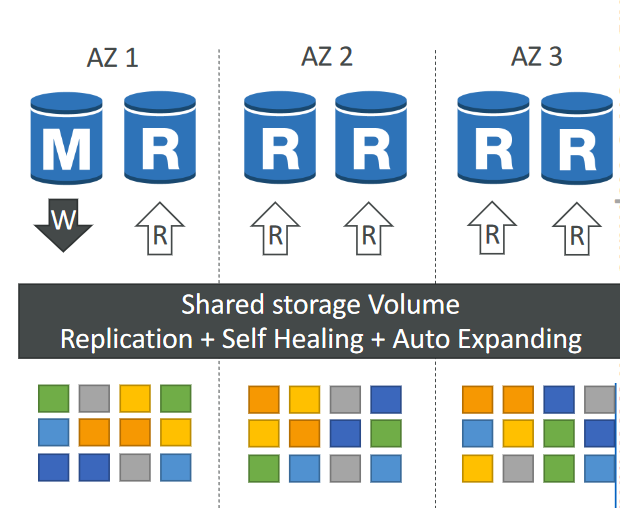
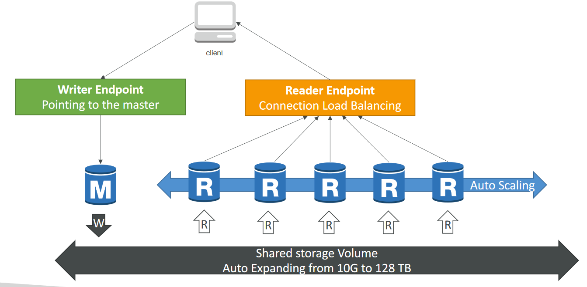
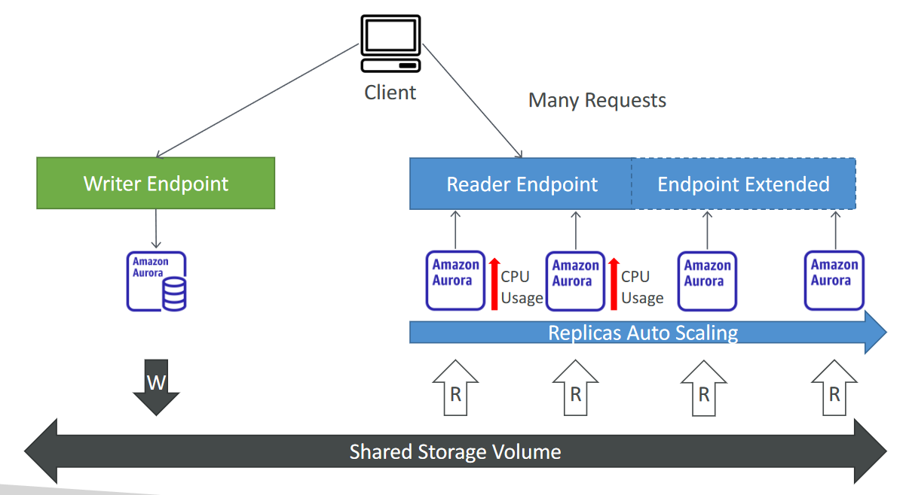
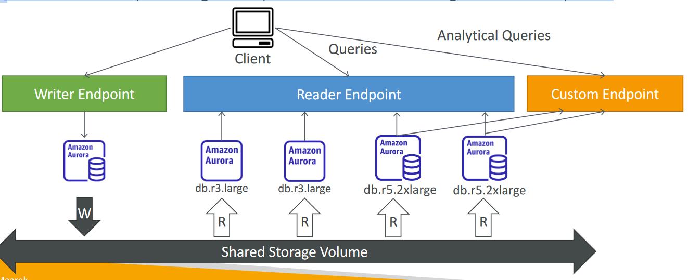

# Amazon Aurora
- Aurora is a proprietary technology from AWS (not open sourced)
- Postgres and MySQL are both supported as Aurora DB (that means your
drivers will work as if Aurora was a Postgres or MySQL database)
- Aurora is “AWS cloud optimized” and claims 5x performance improvement
over MySQL on RDS, over 3x the performance of Postgres on RDS
- Aurora storage automatically grows in increments of 10GB, up to 128 TB.
- Aurora can have up to 15 replicas and the replication process is faster than
MySQL (sub 10 ms replica lag)
- Failover in Aurora is instantaneous. It’s HA (High Availability) native.
- Aurora costs more than RDS (20% more) – but is more efficient

# Aurora High Availability and Read Scaling
- 6 copies of your data across 3 AZ:
    - 4 copies out of 6 needed for writes
    - 3 copies out of 6 need for reads
    - Self healing with peer-to-peer replication
    - Storage is striped across 100s of volumes
- One Aurora Instance takes writes (master)
- Automated failover for master in less than
30 seconds
- Master + up to 15 Aurora Read Replicas
serve reads
- Support for Cross Region Replication

# Aurora DB Cluster

# Features of Aurora
- Automatic fail-over
- Backup and Recovery
- Isolation and security
- Industry compliance
- Push-button scaling
- Automated Patching with Zero Downtime
- Advanced Monitoring
- Routine Maintenance
- Backtrack: restore data at any point of time without using backups

# Aurora Replicas - Auto Scaling

# Aurora – Custom Endpoints
- Define a subset of Aurora Instances as a Custom Endpoint
- Example: Run analytical queries on specific replicas
- The Reader Endpoint is generally not used after defining Custom Endpoints

# Aurora Serverless

- Automated database
instantiation and auto-
scaling based on actual
usage
- Good for infrequent,
intermittent or
unpredictable workloads
- No capacity planning
needed
- Pay per second, can be
more cost-effective

# Global Aurora

- Aurora Cross Region Read Replicas:
    - Useful for disaster recovery
    - Simple to put in place
- Aurora Global Database (recommended):
    - 1 Primary Region (read / write)
    - Up to 5 secondary (read-only) regions, replication lag is less
    than 1 second
    - Up to 16 Read Replicas per secondary region
    - Helps for decreasing latency
    - Promoting another region (for disaster recovery) has an RTO
    of < 1 minute
    - Typical cross-region replication takes less than 1 second

# Aurora Machine Learning
- Enables you to add ML-based predictions to
your applications via SQL
- Simple, optimized, and secure integration
between Aurora and AWS ML services
- Supported services
    - Amazon SageMaker (use with any ML model)
    - Amazon Comprehend (for sentiment analysis)
- You don’t need to have ML experience
- Use cases: fraud detection, ads targeting,
sentiment analysis, product recommendations

# Aurora Backups
- Automated backups
    - 1 to 35 days (cannot be disabled)
    - point-in-time recovery in that timeframe
- Manual DB Snapshots
    - Manually triggered by the user
    - Retention of backup for as long as you want

# RDS & Aurora Restore options
- Restoring a RDS / Aurora backup or a snapshot creates a new database
- Restoring MySQL RDS database from S3
    - Create a backup of your on-premises database
    - Store it on Amazon S3 (object storage)
    - Restore the backup file onto a new RDS instance running MySQL
- Restoring MySQL Aurora cluster from S3
    - Create a backup of your on-premises database using Percona XtraBackup
    - Store the backup file on Amazon S3
    - Restore the backup file onto a new Aurora cluster running MySQL

# Aurora Database Cloning
- Create a new Aurora DB Cluster from an
existing one
- Faster than snapshot & restore
- Uses copy-on-write protocol
    - Initially, the new DB cluster uses the same data volume as the original DB cluster (fast and efficient– no copying is needed)
    - When updates are made to the new DB cluster data, then additional storage is allocated and data is copied to be separated
- Very fast & cost-effective
- Useful to create a “staging” database from a
“production” database without impacting the
production database

# RDS & Aurora Security
- At-rest encryption:
    - Database master & replicas encryption using AWS KMS – must be defined as launch time
    - If the master is not encrypted, the read replicas cannot be encrypted
    - To encrypt an un-encrypted database, go through a DB snapshot & restore as encrypted
- In-flight encryption: TLS-ready by default, use the AWS TLS root certificates client-side
- IAM Authentication: IAM roles to connect to your database (instead of username/pw)
- Security Groups: Control Network access to your RDS / Aurora DB
- No SSH available except on RDS Custom
- Audit Logs can be enabled and sent to CloudWatch Logs for longer retention