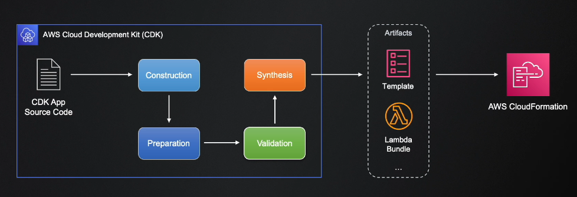

# AWS CDK AWS Cloud development Kit

## Concepts

You write infraestructure code using popular programming languages supported, such as python, javascript, typescript, C#, java and Go

you can use the power pf `rpgramming languages with tools such as control flow statements and abstraction via classes

#CDK Concepts

- **CDK application** Top level scope for your infraestructure code developed via CDK

- **Stack** Correspond to a cloudformation stack managing a group of AWS resources in a cDK app

- **Constructs** Basic building blocks of a CDK app, used to deploy one or more AWS resources.
There are 3 level of constructs

    - **L1** 
      - the lowest level construct type mapping CloudFormation resources types one-to-one, automatically generated from CloudFormation specs
      -  You must know and configure resources types in detail, as in CloudFormation . 
    
    - **L2**
      -  Represents at a higher level with convenient defaults, reducing the need to know and configure all details
      - You can use the power of abstraction with instance methods and properties to  work with resources efficiently
      

    - **L3** CDK patterns
      - the highest level construct type bundling resources from multiple AWS services to create a complete solution
      - You can also create custom L3 constructs to share with your collegues as libraries in your programming language
      

 - For a CDK deployment you need at least on ecDK environment consisting of an AWS account and a region to deply resources

 - each target environment must be bootstrapped before any CDK deployment


- **CDK toolkit**: a command-line interface to initialize CDK apps, synthesize templates and deploy stacks from them
 - **aWS Toolkit for visual studio Code** an open source plugin for AWS application on VS code with the cDK explorer feature

## Instal CDK environment

- AWS CLI
- IAM acces to create resources (Administrator Access)
- aws configure
- Node.js
- CDK  npm install -g aws-cdk

for windows Set-ExecutionPolicy -ExecutionPolicy RemoteSigned

- bootstraping to generate a CDK environment `reàrign an AWs region in your aws account for cdk deployment by creating necessary resources, like S· buckets and IAM roles
- cdk bootstrap command is used to bootstrap a cDK environment

```
cdk bootsrap <Account ID>/<region>

cdk bootsrap 0123456789/eu-central-1
```

create a stack in cloudformation call CDKToolkit and create some roles, policies and bucket S3

## First CDK App

first install python 3.6 or later
then update pip

```
python3 -m pip install --upgrade pip
```

for create the first cdk project you will use a template provided by the CDK CLI.

```
cdk init <availabe template>

cdk init sample-app --language python
```
After the app has been created, also enter the following two commands. These activate the app's Python virtual environment and install the AWS CDK core dependencies.

```
$ source .venv/bin/activate # On Windows, run `.\venv\Scripts\activate` instead
$ python -m pip install -r requirements.txt
```
### Synthesize
Synthesize an AWS CloudFormation template for the app, as follows:

```
cdk synth <stacks name>
```
If your app contains more than one stack, you must specify which stacks to synthesize. Since your app contains a single stack, the CDK CLI automatically detects the stack to synthesize.

The cdk synth command runs your app. This creates an AWS CloudFormation template for each stack in your app.

The generated template can be deployed through the AWS CloudFormation console or any AWS CloudFormation deployment tool. You can also use the CDK CLI to deploy.

### Deploy 
To deploy your CDK stack to AWS CloudFormation using the CDK CLI, run the following:

```
cdk deploy
```

Similar to cdk synth, you don't have to specify the AWS CDK stack since the app contains a single stack.

If your code has security implications, the CDK CLI will output a summary. You will need to confirm them to continue with deployment

### Destroy

you can delete the deployed AWS CloudFormation stack and all resources associated with it
```
 cdk destroy
```
Enter y to approve the changes and delete your stack.

If you didn't change the bucket's RemovalPolicy, the stack deletion would complete successfully, but the bucket would become orphaned (no longer associated with the stack).

you need lambda to delete bucket s3 qhen delete the stack


## AWS CDK App Lifecycle

- **construction** The construction chain (init() methods) of all constructs, app, stack and their child constructs are executed, most of your CDK code is executed at this stage
- **preparation** If a construct has the prepare() method implemented, it is executed at this phase, CDK aspect are also executed at this phase, It is not recommended for general CDK logic updating your resources
- **validation** The phase for validating wheter your constructs behave correctly by executing their validate() methods if implemented
- **synthesis** The phase creating deployment artifacts by executing the syntesize() methods of all constructs, these artifacts can be CloudÇFormation templates, lambda bundles, files and Docker images according to construct types

After synthesis, all deploments artifacts are deployed by creating stacks on AWS Cloudformation




## AWS  CDK  Constructs

create a directory

To create an empyt CDK app use

```
cdk init app -l python
```
activate virtual environment
```
source .venv/bin/activate
```
upgrade pip
```
python -m pip install --upgrade pip
```

install requeriments
```
python -m pip install -r requirements.txt
```

### L1 contructs

- the lowest level cdk constructs mapping AWS cloudformation resource types and properties one-to-one
- Their names start with Cfn in the Construct library
- There is an L1 constructs for an AWS resource if AWS cloudformation already support it
- You can switch from _Cloudformation's JSON or YAML templates to CDK using only L1 constructs
- You must know the resource type in detail as in Cloudformation

https://docs.aws.amazon.com/cdk/api/v2/docs/aws-construct-library.html

https://docs.aws.amazon.com/cdk/api/v2/python/

```
from aws_cdk import (
    Stack,
    aws_ec2 as ec2
)
from constructs import Construct

class MySampleAppStack(Stack):

    def __init__(self, scope: Construct, construct_id: str, **kwargs) -> None:
        super().__init__(scope, construct_id, **kwargs)

        my_vpc = ec2.CfnVPC(self, 'MyVpc',
                            cidr_block='10.0.0.0/16',
                            enable_dns_hostnames=True,
                            enable_dns_support=True)
        
        internet_gateway = ec2.CfnInternetGateway(self, 'InternetGateway')

        ec2.CfnVPCGatewayAttachment(self, 'IgwAttachment',
                                    vpc_id=my_vpc.attr_vpc_id,
                                    internet_gateway_id=internet_gateway.attr_internet_gateway_id)

```