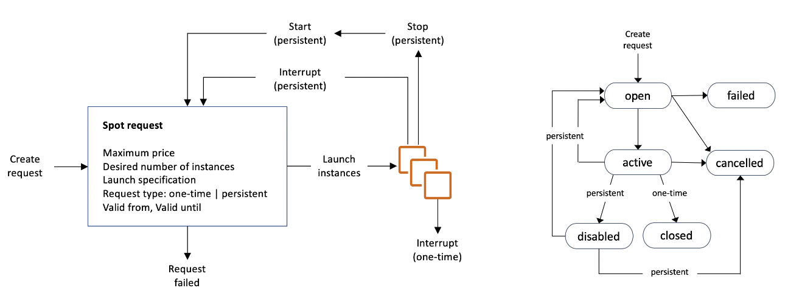

# Amazon EC2
- EC2 is one of the most popular of AWS’ offering
- EC2 = Elastic Compute Cloud = Infrastructure as a Service
- It mainly consists in the capability of :
    - Renting virtual machines (EC2)
    - Storing data on virtual drives (EBS)
    - Distributing load across machines (ELB)
    - Scaling the services using an auto-scaling group (ASG)
- Knowing EC2 is fundamental to understand how the Cloud works

# EC2 sizing & configuration options
- Operating System (OS): Linux, Windows or Mac OS
- How much compute power & cores (CPU)
- How much random-access memory (RAM)
- How much storage space:
    - Network-attached (EBS & EFS)
    - hardware (EC2 Instance Store)
- Network card: speed of the card, Public IP address
- Firewall rules: security group
- Bootstrap script (configure at first launch): EC2 User Data

# EC2 User Data
- It is possible to bootstrap our instances using an EC2 User data script.
- bootstrapping means launching commands when a machine starts
- That script is only run once at the instance first start
- EC2 user data is used to automate boot tasks such as:
    - Installing updates
    - Installing software
    - Downloading common files from the internet
    - Anything you can think of
- The EC2 User Data Script runs with the root user

# EC2 Instance Types
You can use different types of EC2 instances that are optimised for
different use cases (https://aws.amazon.com/ec2/instance-types/)

## EC2 Instance Types – General Purpose
- Great for a diversity of workloads such as web servers or code repositories
- Balance between:
    - Compute
    - Memory
    - Networking

# EC2 Instance Types – Compute Optimized
- Great for compute-intensive tasks that require high performance
processors:
    - Batch processing workloads
    - Media transcoding
    - High performance web servers
    - High performance computing (HPC)
    - Scientific modeling & machine learning
    - Dedicated gaming servers

# EC2 Instance Types – Memory Optimized
- Fast performance for workloads that process large data sets in memory
- Use cases:
    - High performance, relational/non-relational databases
    - Distributed web scale cache stores
    - In-memory databases optimized for BI (business intelligence)
    - Applications performing real-time processing of big unstructured data

# EC2 Instance Types – Storage Optimized
- Great for storage-intensive tasks that require high, sequential read and write
access to large data sets on local storage
- Use cases:
    - High frequency online transaction processing (OLTP) systems
    - Relational & NoSQL databases
    - Cache for in-memory databases (for example, Redis)
    - Data warehousing applications
    - Distributed file systems

# EC2 Instances Purchasing Options
- On-Demand Instances – short workload, predictable pricing, pay by second
- Reserved (1 & 3 years)
    - Reserved Instances – long workloads
    - Convertible Reserved Instances – long workloads with flexible instances
- Savings Plans (1 & 3 years) –commitment to an amount of usage, long workload
- Spot Instances – short workloads, cheap, can lose instances (less reliable)
- Dedicated Hosts – book an entire physical server, control instance placement
- Dedicated Instances – no other customers will share your hardware
- Capacity Reservations – reserve capacity in a specific AZ for any duration

## EC2 On Demand
- Pay for what you use:
- Linux or Windows - billing per second, after the first minute
- All other operating systems - billing per hour
- Has the highest cost but no upfront payment
- No long-term commitment
- Recommended for short-term and un-interrupted workloads, where
you can't predict how the application will behave

## EC2 Reserved Instances
- Up to 72% discount compared to On-demand
- You reserve a specific instance attributes (Instance Type, Region, Tenancy, OS)
- Reservation Period – 1 year (+discount) or 3 years (+++discount)
- Payment Options – No Upfront (+), Partial Upfront (++), All Upfront (+++)
- Reserved Instance’s Scope – Regional or Zonal (reserve capacity in an AZ)
- Recommended for steady-state usage applications (think database)
- You can buy and sell in the Reserved Instance Marketplace
- Convertible Reserved Instance
- Can change the EC2 instance type, instance family, OS, scope and tenancy
- Up to 66% discount 

## EC2 Savings Plans
- Get a discount based on long-term usage (up to 72% - same as RIs)
- Commit to a certain type of usage ($10/hour for 1 or 3 years)
- Usage beyond EC2 Savings Plans is billed at the On-Demand price
- Locked to a specific instance family & AWS region (e.g., M5 in us-east-1)
- Flexible across:
    - Instance Size (e.g., m5.xlarge, m5.2xlarge)
    - OS (e.g., Linux, Windows)
    - Tenancy (Host, Dedicated, Default)

## EC2 Spot Instances
- Can get a discount of up to 90% compared to On-demand
- Instances that you can “lose” at any point of time if your max price is less than the
current spot price
- The MOST cost-efficient instances in AWS
- Useful for workloads that are resilient to failure
    - Batch jobs
    - Data analysis
    - Image processing
    - Any distributed workloads
    - Workloads with a flexible start and end time
- Not suitable for critical jobs or databases

## EC2 Dedicated Hosts
- A physical server with EC2 instance capacity fully dedicated to your use
- Allows you address compliance requirements and use your existing server-
bound software licenses (per-socket, per-core, pe—VM software licenses)
- Purchasing Options:
    - On-demand – pay per second for active Dedicated Host
    - Reserved - 1 or 3 years (No Upfront, Partial Upfront, All Upfront)
- The most expensive option
- Useful for software that have complicated licensing model (BYOL – Bring Your
Own License)
- Or for companies that have strong regulatory or compliance needs

## EC2 Dedicated Instances
- Instances run on hardware that’s
dedicated to you
- May share hardware with other
instances in same account
- No control over instance placement
(can move hardware after Stop / Start)

## EC2 Capacity Reservations
- Reserve On-Demand instances capacity in a specific AZ for any
duration
- You always have access to EC2 capacity when you need it
- No time commitment (create/cancel anytime), no billing discounts
- Combine with Regional Reserved Instances and Savings Plans to benefit
from billing discounts
- You’re charged at On-Demand rate whether you run instances or not
- Suitable for short-term, uninterrupted workloads that needs to be in a
specific AZ

# EC2 Spot Instance Requests
- Can get a discount of up to 90% compared to On-demand
- Define max spot price and get the instance while current spot price < max
    - The hourly spot price varies based on offer and capacity
    - If the current spot price > your max price you can choose to stop or terminate your instance
with a 2 minutes grace period.
- Other strategy: Spot Block
    - “block” spot instance during a specified time frame (1 to 6 hours) without interruptions
    - In rare situations, the instance may be reclaimed
- Used for batch jobs, data analysis, or workloads that are resilient to failures.
- Not great for critical jobs or databases

# How to terminate Spot Instances?

You can only cancel Spot Instance requests that are open, active, or disabled.
Cancelling a Spot Request does not terminate instances
You must first cancel a Spot Request, and then terminate the associated Spot Instances

# Spot Fleets
- Spot Fleets = set of Spot Instances + (optional) On-Demand Instances
- The Spot Fleet will try to meet the target capacity with price constraints
    - Define possible launch pools: instance type (m5.large), OS, Availability Zone
    - Can have multiple launch pools, so that the fleet can choose
    - Spot Fleet stops launching instances when reaching capacity or max cost
- Strategies to allocate Spot Instances:
    - lowestPrice: from the pool with the lowest price (cost optimization, short workload)
    - diversified: distributed across all pools (great for availability, long workloads)
    - capacityOptimized: pool with the optimal capacity for the number of instances
    - priceCapacityOptimized (recommended): pools with highest capacity available, then select
    the pool with the lowest price (best choice for most workloads)
- Spot Fleets allow us to automatically request Spot Instances with the lowest price

# Private vs Public IP (IPv4)
Fundamental Differences
## Public IP:
- Public IP means the machine can be identified on the internet (WWW)
- Must be unique across the whole web (not two machines can have the same public IP).
- Can be geo-located easily
## Private IP:
- Private IP means the machine can only be identified on a private network only
- The IP must be unique across the private network
- BUT two different private networks (two companies) can have the same IPs.
- Machines connect to WWW using a NAT + internet gateway (a proxy)
- Only a specified range of IPs can be used as private IP

# Elastic IPs
- When you stop and then start an EC2 instance, it can change its public
IP.
- If you need to have a fixed public IP for your instance, you need an
Elastic IP
- An Elastic IP is a public IPv4 IP you own as long as you don’t delete it
- You can attach it to one instance at a time
With an Elastic IP address, you can mask the failure of an instance or software
by rapidly remapping the address to another instance in your account.
- You can only have 5 Elastic IP in your account (you can ask AWS to increase
that).
- Overall, try to avoid using Elastic IP:
    - They often reflect poor architectural decisions
    - Instead, use a random public IP and register a DNS name to it
    - Or, as we’ll see later, use a Load Balancer and don’t use a public IP

# Placement Groups
- Sometimes you want control over the EC2 Instance placement strategy
- That strategy can be defined using placement groups
- When you create a placement group, you specify one of the following
strategies for the group:
    - Cluster—clusters instances into a low-latency group in a single Availability Zone
    - Spread—spreads instances across underlying hardware (max 7 instances per
    group per AZ)
    - Partition—spreads instances across many different partitions (which rely on
    different sets of racks) within an AZ. Scales to 100s of EC2 instances per group
    (Hadoop, Cassandra, Kafka)

## Placement Groups Cluster

- Pros: Great network (10 Gbps bandwidth between instances with Enhanced
Networking enabled - recommended)
- Cons: If the rack fails, all instances fails at the same time
- Use case:
    - Big Data job that needs to complete fast
    - Application that needs extremely low latency and high network throughput

## Placement Groups Spread 

- Pros:
    - Can span across Availability
    Zones (AZ)
    - Reduced risk is simultaneous
    failure
    - EC2 Instances are on different
    physical hardware
- Cons:
    - Limited to 7 instances per AZ
per placement group
- Use case:
    - Application that needs to
    maximize high availability
    - Critical Applications where
    each instance must be isolated
    from failure from each other

## Placements Groups Partition

- Up to 7 partitions per AZ
- Can span across multiple AZs in the
same region
- Up to 100s of EC2 instances
- The instances in a partition do not
share racks with the instances in the
other partitions
- A partition failure can affect many
EC2 but won’t affect other partitions
- EC2 instances get access to the
partition information as metadata
- Use cases: HDFS, HBase, Cassandra,
Kafka

# Elastic Network Interfaces (ENI)
- Logical component in a VPC that represents a
virtual network card
- The ENI can have the following attributes:
    - Primary private IPv4, one or more secondary IPv4
    - One Elastic IP (IPv4) per private IPv4
    - One Public IPv4
    - One or more security groups
    - A MAC address
- You can create ENI independently and attach
them on the fly (move them) on EC2 instances
for failover
- Bound to a specific availability zone (AZ)

# EC2 Hibernate
- We know we can stop, terminate instances
- Stop – the data on disk (EBS) is kept intact in the next start
- Terminate – any EBS volumes (root) also set-up to be destroyed is lost
- On start, the following happens:
- First start: the OS boots & the EC2 User Data script is run
- Following starts: the OS boots up
- Then your application starts, caches get warmed up, and that can take time!

##  Introducing EC2 Hibernate:

- The in-memory (RAM) state is preserved
- The instance boot is much faster!
(the OS is not stopped / restarted)
- Under the hood: the RAM state is written
to a file in the root EBS volume
- The root EBS volume must be encrypted
- Use cases:
    - Long-running processing
    - Saving the RAM state
    - Services that take time to initialize

## EC2 Hibernate – Good to know
- Supported Instance Families – C3, C4, C5, I3, M3, M4, R3, R4, T2, T3, …
- Instance RAM Size – must be less than 150 GB.
- Instance Size – not supported for bare metal instances.
- AMI – Amazon Linux 2, Linux AMI, Ubuntu, RHEL, CentOS & Windows…
- Root Volume – must be EBS, encrypted, not instance store, and large
- Available for On-Demand, Reserved and Spot Instances
- An instance can NOT be hibernated more than 60 days

# AMI Overview
- AMI = Amazon Machine Image
- AMI are a customization of an EC2 instance
    - You add your own software, configuration, operating system, monitoring…
    - Faster boot / configuration time because all your software is pre-packaged
- AMI are built for a specific region (and can be copied across regions)
- You can launch EC2 instances from:
    - A Public AMI: AWS provided
    - Your own AMI: you make and maintain them yourself
    - An AWS Marketplace AMI: an AMI someone else made (and potentially sells)

# AMI Process (from an EC2 instance)
- Start an EC2 instance and customize it
- Stop the instance (for data integrity)
- Build an AMI – this will also create EBS snapshots
- Launch instances from other AMIs

# EC2 Instance Store
- EBS volumes are network drives with good but “limited” performance
- If you need a high-performance hardware disk, use EC2 Instance
Store
- Better I/O performance
- EC2 Instance Store lose their storage if they’re stopped (ephemeral)
- Good for buffer / cache / scratch data / temporary content
- Risk of data loss if hardware fails
- Backups and Replication are your responsibility

# High Availability & Scalability For EC2
- Vertical Scaling: Increase instance size (= scale up / down)
    - From: t2.nano - 0.5G of RAM, 1 vCPU
    - To: u-12tb1.metal – 12.3 TB of RAM, 448 vCPUs
- Horizontal Scaling: Increase number of instances (= scale out / in)
    - Auto Scaling Group
    - Load Balancer
- High Availability: Run instances for the same application across multi AZ
    - Auto Scaling Group multi AZ
    - Load Balancer multi AZ