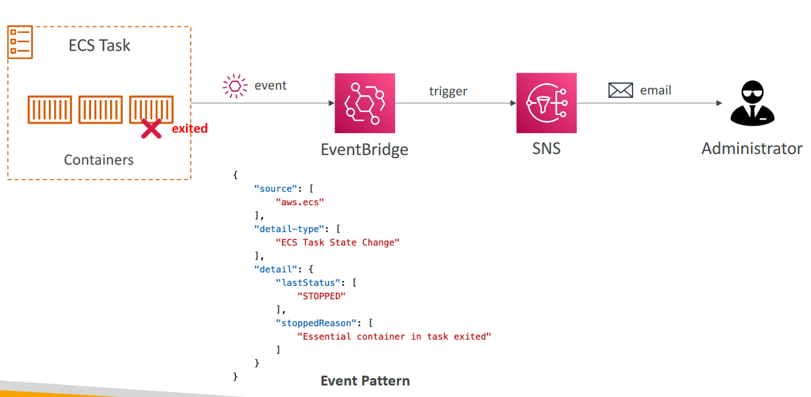

# Amazon Elastic Container Service (Amazon ECS)
- Amazon’s own container platform

# Amazon ECS - EC2 Launch Type

- ECS = Elastic Container Service
- Launch Docker containers on AWS =Launch ECS Tasks on ECS Clusters
- EC2 Launch Type: you must provision & maintain the infrastructure (the EC2 instances)
- Each EC2 Instance must run the ECS Agent to register in the ECS Cluster
- AWS takes care of starting / stopping containers

# Amazon ECS – Fargate Launch Type
- Launch Docker containers on AWS
- You do not provision the infrastructure
(no EC2 instances to manage)
- It’s all Serverless!
- You just create task definitions
- AWS just runs ECS Tasks for you based
on the CPU / RAM you need
- To scale, just increase the number of
tasks. Simple - no more EC2 instances

# Amazon ECS – IAM Roles for ECS

##  EC2 Instance Profile (EC2 Launch Type only):
- Used by the ECS agent
- Makes API calls to ECS service
- Send container logs to CloudWatch Logs
- Pull Docker image from ECR
- Reference sensitive data in Secrets Manager or SSM Parameter Store
##  ECS Task Role:
- Allows each task to have a specific role
- Use different roles for the different ECS Services you run
- Task Role is defined in the task definition

# Amazon ECS – Load Balancer Integrations
## Application Load Balancer supported
and works for most use cases
## Network Load Balancer recommended
only for high throughput / high
performance use cases, or to pair it with
AWS Private Link
## Classic Load Balancer supported but
not recommended (no advanced
features – no Fargate)

# Amazon ECS – Data Volumes (EFS)
- Mount EFS file systems onto ECS tasks
- Works for both EC2 and Fargate launch types
- Tasks running in any AZ will share the same data
in the EFS file system
- Fargate + EFS = Serverless
- Use cases: persistent multi-AZ shared storage for
your containers
- Note:
- Amazon S3 cannot be mounted as a file system

Amazon ECS with EC2 launch type is charged based on EC2 instances and EBS volumes used. Amazon ECS with Fargate launch type is charged based on vCPU and memory resources that the containerized application requests

# ECS Service Auto Scaling
- Automatically increase/decrease the desired number of ECS tasks
- Amazon ECS Auto Scaling uses AWS Application Auto Scaling
    - ECS Service Average CPU Utilization
    - ECS Service Average Memory Utilization - Scale on RAM
    - ALB Request Count Per Target – metric coming from the ALB
- Target Tracking – scale based on target value for a specific CloudWatch metric
- Step Scaling – scale based on a specified CloudWatch Alarm
- Scheduled Scaling – scale based on a specified date/time (predictable changes)
- ECS Service Auto Scaling (task level) ≠ EC2 Auto Scaling (EC2 instance level)
- Fargate Auto Scaling is much easier to setup (because Serverless)

# EC2 Launch Type – Auto Scaling EC2 Instances

- Accommodate ECS Service Scaling by adding underlying EC2 Instances
- Auto Scaling Group Scaling
    - Scale your ASG based on CPU Utilization
    - Add EC2 instances over time
- ECS Cluster Capacity Provider
    - Used to automatically provision and scale the infrastructure for your ECS Tasks
    - Capacity Provider paired with an Auto Scaling Group
    - Add EC2 Instances when you’re missing capacity (CPU, RAM…)

# ECS – Intercept Stopped Tasks using EventBridge

