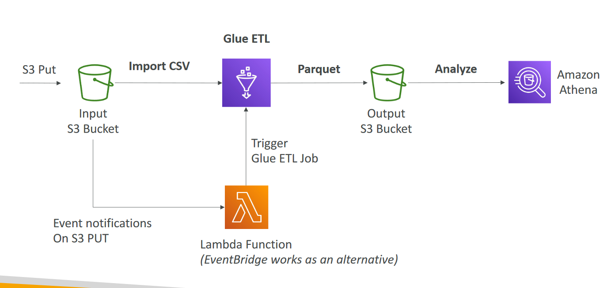

# AWS Glue 

- Managed extract, transform, and load (ETL) service
- Useful to prepare and transform data for analytics
- Fully serverless service

# AWS Glue – Convert data into Parquet format

# Glue Data Catalog: catalog of datasets

# © Stephane Maarek
NOT FOR DISTRIBUTION © Stephane Maarek www.datacumulus.com
Glue – things to know at a high-level
- Glue Job Bookmarks: prevent re-processing old data
- Glue Elastic Views:
    - Combine and replicate data across multiple data stores using SQL
    - No custom code, Glue monitors for changes in the source data, serverless
    - Leverages a “virtual table” (materialized view)
- Glue DataBrew: clean and normalize data using pre-built transformation
- Glue Studio: new GUI to create, run and monitor ETL jobs in Glue
- Glue Streaming ETL (built on Apache Spark Structured Streaming): compatible with Kinesis Data Streaming, Kafka, MSK (managed Kafka)

 AWS Glue is a fully managed extract, transform, and load (ETL) service that makes it easy for customers to prepare and load their data for analytics. AWS Glue job is meant to be used for batch ETL data processing. AWS Glue does not offer the same storage and processing speed as FSx for Lustre.