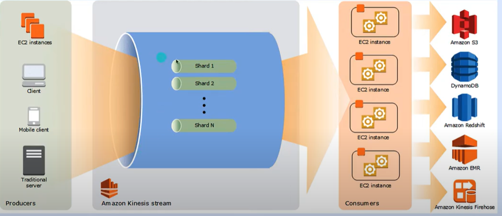
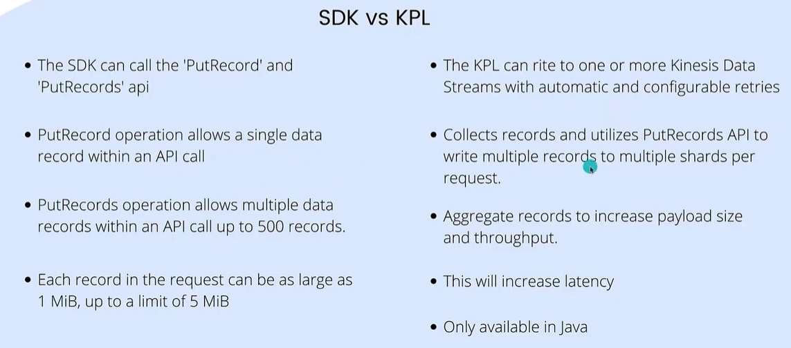

# AWS Kinesis

- Real time streaming solution which allows you to ingest, buffer, and process data
- Fully managed and runs ypur streaming applications without requqiring you to manage any infraestructure
- amazon kinesis is scalable. it can handle any ammount of streaming data and process data from hundreds of thousands of sources with very low latencies

## AWS kinesis data steams archietecture

- A kinesis data stream is a set of shards
- a shards is a uniquely identified sequences of data records in a stream

## Useful definitions

- A data record is the unit of data stored in a kinesis data stream. Data records are composed of a sequence number, a partition key, and a data blob, which is an inmutable sequence of bytes. Kinesis Data Streams does not inspect, interpret, or change the data in the blob in any way. A data blob can be up to 1MB
- Producers put records into Amazon Kinesis Data streams. For example, a web server sending log data to a stream is a producer
- A partition key is used togroup data by shard within a stream Kinesis Data Streams segregates the data records belonging to a stream into multiple shards. It uses the partition key that is associated with each data record to determine which shard given data record belongs to
- Each data record has a sequence number that is unique per partition-key within its shard. Kinesis Data Streams assigns the sequence number after you write to the stream with clientputRecords or client.putRecord
- Consumer get records from Amazon Kinesis Data Streams and process them. These consumenrs are known as Amazon Kinesis Data Streams Application 

## KPL kinesis Producer library

ECS, FIREHOSE, LAMBDAS
SQL
PYTHOn/BASH
TERRAFORM, ANSIBLE or cloudformation
Jenkins
Cloudwatch

https://jayendrapatil.com/aws-kinesis-data-streams-vs-kinesis-firehose/
https://www.whizlabs.com/blog/aws-kinesis-data-streams-vs-aws-kinesis-data-firehose/

https://aws.amazon.com/es/firehose/faqs/

https://nahidsaikat.medium.com/stream-data-to-s3-using-kinesis-and-firehose-with-terraform-7ed2e25310c

https://adefemiafuwape.medium.com/create-a-terraform-module-that-creates-1-kinesis-firehose-and-sqs-57d5a212d691

https://blog.bismart.com/diferencia-entre-data-lake-y-data-warehouse

# Kinesis Overview
- Makes it easy to collect, process, and analyze streaming data in real-time
- Ingest real-time data such as: Application logs, Metrics, Website clickstreams,
IoT telemetry data…
- Kinesis Data Streams: capture, process, and store data streams
- Kinesis Data Firehose: load data streams into AWS data stores
- Kinesis Data Analytics: analyze data streams with SQL or Apache Flink
- Kinesis Video Streams: capture, process, and store video streams