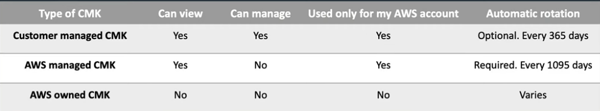

# kms vs secret manager vs parameter store

So KMS is a fundamental service, in that you need it for other things to work like EBS volume encryption. KMS generates and manages crypto keys and that’s all it does. Secrets Manager or SSM Parameter store both allow you to encrypt secrets using KMS generated keys and therefore protect your data. In order for a user to get the secret back out they will also need permissions to KMS.

Secrets Manager: It was designed specifically for confidential information (like database credentials, API keys) that needs to be encrypted, so the creation of a secret entry has encryption enabled by default. It also gives additional functionality like rotation of keys.
Systems Manager Parameter Store: It was designed to cater to a wider use case, not just secrets or passwords, but also application configuration variables like URLs, Custom settings, AMI IDs, License keys, etc.

# 1. Explain the difference between a Customer Master Key (CMK) and a Data Key.
In AWS Key Management Service (KMS), a Customer Master Key (CMK) and a Data Key have distinct roles. A CMK is a master key created in your account, used to encrypt and decrypt data keys and small data amounts. CMKs can be customer-managed or AWS-managed, with customer-managed CMKs offering more control over policies and lifecycle management. A Data Key is generated by AWS KMS for encrypting larger data volumes. It is used outside of AWS KMS, typically involving generating a data key with a CMK, encrypting data, and storing the encrypted data key with the data. For decryption, the encrypted data key is sent back to AWS KMS to be decrypted using the CMK.

# Write a code snippet to encrypt a plaintext string using a CMK.
To encrypt a plaintext string using a Customer Master Key (CMK) in AWS KMS, you can use the AWS SDK for Python (Boto3). Below is a code snippet demonstrating this process:

```
import boto3

def encrypt_string(plaintext, key_id):
    kms_client = boto3.client('kms')
    response = kms_client.encrypt(
        KeyId=key_id,
        Plaintext=plaintext
    )
    return response['CiphertextBlob']

key_id = 'arn:aws:kms:region:account-id:key/key-id'
plaintext = 'Hello, AWS KMS!'
encrypted_text = encrypt_string(plaintext, key_id)
print(encrypted_text)
```

# 3. Provide a code example to decrypt an encrypted string.
To decrypt an encrypted string using AWS KMS, you can use the AWS SDK for Python (Boto3). Below is an example demonstrating how to achieve this:

```
import boto3

def decrypt_string(encrypted_string):
    kms_client = boto3.client('kms')
    response = kms_client.decrypt(
        CiphertextBlob=bytes.fromhex(encrypted_string)
    )
    plaintext = response['Plaintext'].decode('utf-8')
    return plaintext

encrypted_string = 'your_encrypted_string_here'
decrypted_string = decrypt_string(encrypted_string)
print(decrypted_string)
```

# 4. Implement envelope encryption in a programming language of your choice.
Envelope encryption involves encrypting data with a data encryption key (DEK) and then encrypting the DEK with a key encryption key (KEK) managed by AWS KMS. This ensures secure data encryption and DEK protection.

Here is an example in Python using the boto3 library to implement envelope encryption with AWS KMS:

```
import boto3
from cryptography.fernet import Fernet

kms_client = boto3.client('kms')
response = kms_client.generate_data_key(KeyId='alias/your-kms-key-alias', KeySpec='AES_256')
plaintext_key = response['Plaintext']
encrypted_key = response['CiphertextBlob']

fernet = Fernet(plaintext_key)
data = b"Sensitive data that needs encryption"
encrypted_data = fernet.encrypt(data)

decrypted_data = fernet.decrypt(encrypted_data)
decrypted_key = kms_client.decrypt(CiphertextBlob=encrypted_key)['Plaintext']

assert decrypted_key == plaintext_key
```

# 5. Write a code snippet to allow cross-account access to a KMS key.

To allow cross-account access to a KMS key in AWS, modify the key policy to grant permissions to the external account by specifying the account’s AWS account ID.
Here is a code snippet demonstrating how to modify the key policy for cross-account access:
Replace EXTERNAL_ACCOUNT_ID with the actual AWS account ID of the external account you want to grant access to.

```
{
  "Version": "2012-10-17",
  "Id": "key-cross-account-policy",
  "Statement": [
    {
      "Sid": "Allow access for Key Administrators",
      "Effect": "Allow",
      "Principal": {
        "AWS": "arn:aws:iam::EXTERNAL_ACCOUNT_ID:root"
      },
      "Action": [
        "kms:DescribeKey",
        "kms:CreateGrant",
        "kms:ListGrants",
        "kms:RevokeGrant"
      ],
      "Resource": "*"
    }
  ]
}
```

# 6. Provide a code example to create a custom key policy and attach it to a CMK.
AWS Key Management Service (KMS) allows you to create and control encryption keys. Custom key policies define permissions for the CMK, specifying who can use and manage the key.

Here is an example of creating a custom key policy and attaching it to a CMK using the AWS SDK for Python (Boto3):

```
import boto3

kms_client = boto3.client('kms')

key_policy = {
    "Version": "2012-10-17",
    "Id": "custom-key-policy",
    "Statement": [
        {
            "Sid": "Enable IAM User Permissions",
            "Effect": "Allow",
            "Principal": {"AWS": "arn:aws:iam::123456789012:root"},
            "Action": "kms:*",
            "Resource": "*"
        },
        {
            "Sid": "Allow access for Key Administrators",
            "Effect": "Allow",
            "Principal": {"AWS": "arn:aws:iam::123456789012:user/KeyAdmin"},
            "Action": [
                "kms:Create*",
                "kms:Describe*",
                "kms:Enable*",
                "kms:List*",
                "kms:Put*",
                "kms:Update*",
                "kms:Revoke*",
                "kms:Disable*",
                "kms:Get*",
                "kms:Delete*",
                "kms:TagResource",
                "kms:UntagResource",
                "kms:ScheduleKeyDeletion",
                "kms:CancelKeyDeletion"
            ],
            "Resource": "*"
        }
    ]
}

response = kms_client.create_key(
    Policy=json.dumps(key_policy),
    Description='CMK with custom key policy',
    KeyUsage='ENCRYPT_DECRYPT',
    Origin='AWS_KMS'
)

key_id = response['KeyMetadata']['KeyId']

print(f'Created CMK with KeyId: {key_id}')
```

# 7. Explain the difference between symmetric and asymmetric CMKs.
In AWS KMS, Customer Master Keys (CMKs) can be symmetric or asymmetric, serving different purposes based on their cryptographic properties.

Symmetric CMKs use a single key for both encryption and decryption, typically for data encryption at rest. They are simpler to manage and generally faster. Asymmetric CMKs use a key pair: a public key for encryption and a private key for decryption. They are used for digital signatures and key exchange, offering features like non-repudiation and secure key distribution.



# 8. Describe the significance of key policies in KMS and how they differ from IAM policies.

ey policies in AWS KMS are JSON-based documents defining who can use and manage KMS keys. They provide fine-grained control over key usage and are attached directly to the keys. IAM policies, however, are attached to IAM users, groups, or roles and define actions those entities can perform on AWS resources. While IAM policies can grant permissions to use KMS keys, they do not offer the same level of control as key policies.

Key differences include:

- Scope: Key policies are specific to KMS keys, while IAM policies apply to a range of AWS resources.
- Attachment: Key policies are attached to KMS keys, whereas IAM policies are attached to IAM users, groups, or roles.
- Granularity: Key policies offer more granular control over key management and usage.
- Default Permissions: Key policies can include default permissions for the AWS account root user, unlike IAM policies.

# 9. How do you manage grants in KMS, and what are they used for?
Grants in AWS KMS provide temporary permissions to use a customer master key (CMK) for specific actions. They are useful for delegating limited access without modifying the key policy or IAM policies. Grants can allow other AWS principals to perform actions like encrypting, decrypting, or generating data keys.

Grants are managed using the AWS Management Console, AWS CLI, or AWS SDKs. When creating a grant, specify the grantee principal, allowed operations, and any conditions. Grants can be listed, retired, or revoked as needed.

For example, you might create a grant to allow an AWS Lambda function to decrypt data using a specific CMK, maintaining a higher level of security.

# 10. How can you audit and monitor the usage of KMS keys?
To audit and monitor the usage of AWS KMS keys, leverage several AWS services and features:

- AWS CloudTrail: Logs all API requests made to KMS, including key creation, deletion, encryption, and decryption operations, allowing you to track key access and actions.
- AWS CloudWatch: Provides data and insights to monitor applications, respond to performance changes, and optimize resource utilization. Create CloudWatch Alarms to monitor specific KMS metrics and receive notifications for unusual activity or high usage.
- AWS Config: Continuously monitors and records AWS resource configurations, allowing you to automate the evaluation of recorded configurations against desired configurations. For KMS, track changes to key policies, key rotation status, and other key attributes.
- AWS CloudWatch Logs: Monitor, store, and access log files from various sources. Integrate CloudTrail logs with CloudWatch Logs to create custom metrics and set up alarms for specific KMS-related activities.

