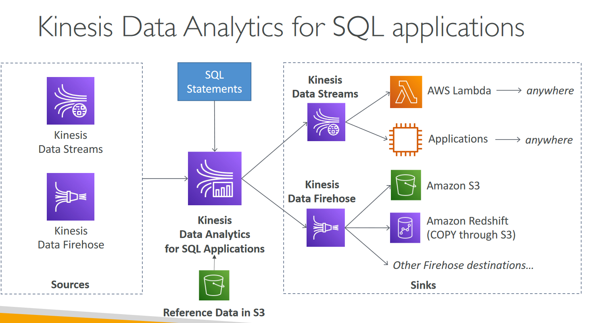
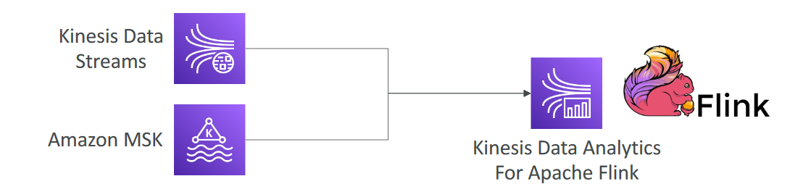

# Kinesis Data Analytics (SQL application)

- Real-time analytics on Kinesis Data Streams & Firehose using SQL
- Add reference data from Amazon S3 to enrich streaming data
- Fully managed, no servers to provision
- Automatic scaling
- Pay for actual consumption rate
- Output:
    - Kinesis Data Streams: create streams out of the real-time analytics queries
    - Kinesis Data Firehose: send analytics query results to destinations
- Use cases:
    - Time-series analytics
    - Real-time dashboards
    - Real-time metrics

# Kinesis Data Analytics for Apache Flink

- Use Flink (Java, Scala or SQL) to process and analyze streaming data
- Run any Apache Flink application on a managed cluster on AWS
    - provisioning compute resources, parallel computation, automatic scaling
    - application backups (implemented as checkpoints and snapshots)
    - Use any Apache Flink programming features
    - Flink does not read from Firehose (use Kinesis Analytics for SQL instead)