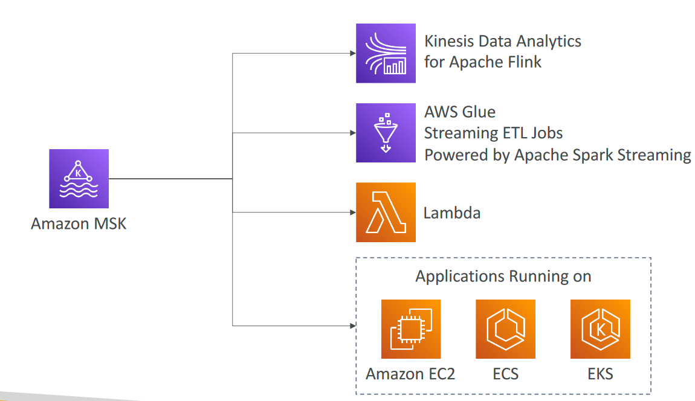

# Amazon Managed Streaming for Apache Kafka (Amazon MSK)
- Alternative to Amazon Kinesis
- Fully managed Apache Kafka on AWS
    - Allow you to create, update, delete clusters
    - MSK creates & manages Kafka brokers nodes & Zookeeper nodes for you
    - Deploy the MSK cluster in your VPC, multi-AZ (up to 3 for HA)
    - Automatic recovery from common Apache Kafka failures
    - Data is stored on EBS volumes for as long as you want
- MSK Serverless
    - Run Apache Kafka on MSK without managing the capacity
    - MSK automatically provisions resources and scales compute & storage

# Amazon MSK Consumers

