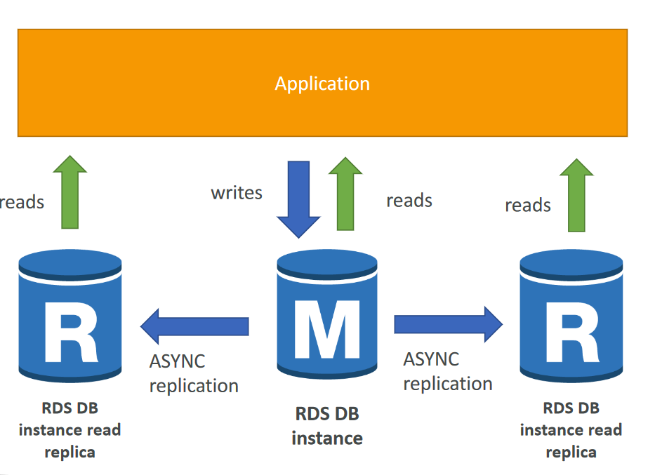
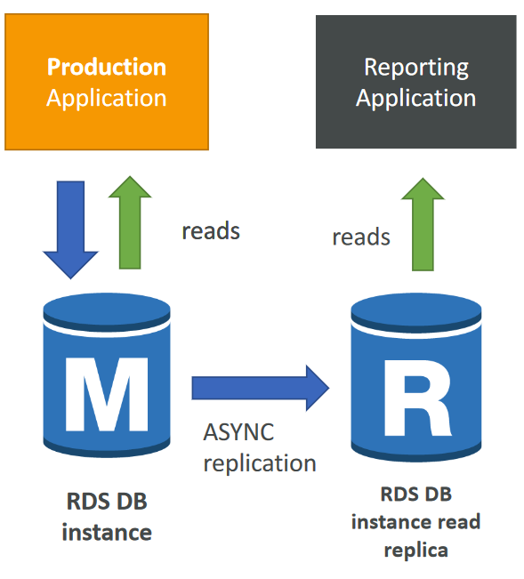
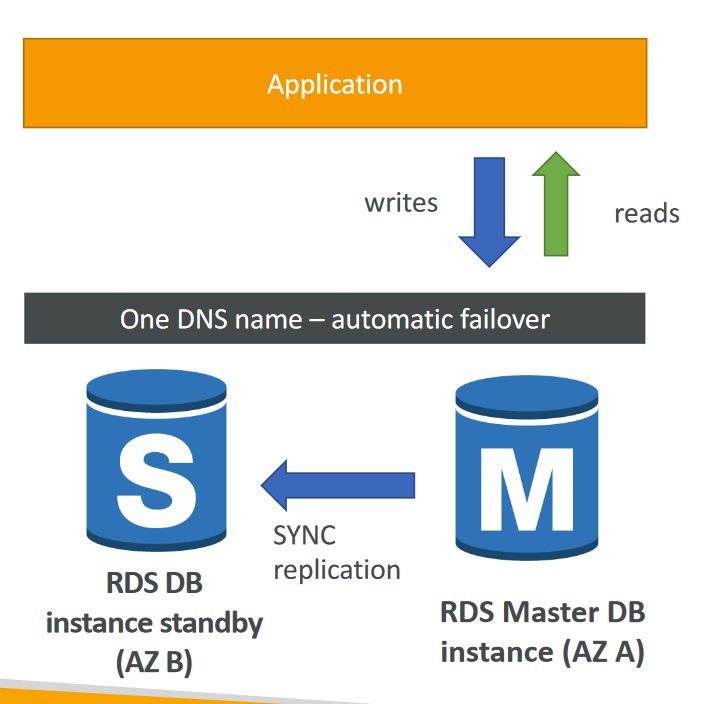
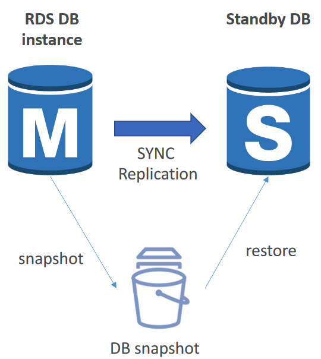
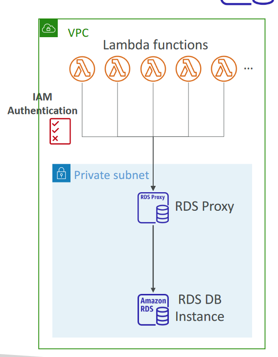

# RDS Overview
- RDS stands for Relational Database Service
- It’s a managed DB service for DB use SQL as a query language.
- It allows you to create databases in the cloud that are managed by AWS
    - Postgres
    - MySQL
    - MariaDB
    - Oracle
    - Microsoft SQL Server
    - IBM DB2
    - Aurora (AWS Proprietary database)

# Advantage over using RDS versus deploying DB on EC2
- RDS is a managed service:
    - Automated provisioning, OS patching
    - Continuous backups and restore to specific timestamp (Point in Time Restore)!
    - Monitoring dashboards
    - Read replicas for improved read performance
    - Multi AZ setup for DR (Disaster Recovery)
    - Maintenance windows for upgrades
    - Scaling capability (vertical and horizontal)
    - Storage backed by EBS (gp2 or io1)
- BUT you can’t SSH into your instances

# RDS – Storage Auto Scaling
- Helps you increase storage on your RDS DB instance
dynamically
- When RDS detects you are running out of free database
storage, it scales automatically
- Avoid manually scaling your database storage
- You have to set Maximum Storage Threshold (maximum
limit for DB storage)
- Automatically modify storage if:
    - Free storage is less than 10% of allocated storage
    - Low-storage lasts at least 5 minutes
    - 6 hours have passed since last modification
- Useful for applications with unpredictable workloads
- Supports all RDS database engines

# RDS Read Replicas for read scalability

- Up to 15 Read Replicas
- Within AZ, Cross AZ or Cross Region
- Replication is ASYNC,so reads are eventually consistent
- Replicas can be promoted to their own
DB
- Applications must update the connection
string to leverage read replicas

# RDS Read Replicas – Use Cases

- You have a production database
that is taking on normal load
- You want to run a reporting
application to run some analytics
- You create a Read Replica to run
the new workload there
- The production application is
unaffected
- Read replicas are used for SELECT
(=read) only kind of statements
(not INSERT, UPDATE, DELETE)

# RDS Read Replicas – Network Cost

- In AWS there’s a network cost when data goes from one AZ to another
- For RDS Read Replicas within the same region, you don’t pay that fee

# RDS Multi AZ (Disaster Recovery)

- SYNC replication
- One DNS name – automatic app
failover to standby
- Increase availability
- Failover in case of loss of AZ, loss of
network, instance or storage failure
- No manual intervention in apps
- Not used for scaling
- Note: The Read Replicas be setup as
Multi AZ for Disaster Recovery (DR)

# RDS – From Single-AZ to Multi-AZ

- Zero downtime operation (no
need to stop the DB)
- Just click on “modify” for the
database
- The following happens internally:
    - A snapshot is taken
    - A new DB is restored from the
    snapshot in a new AZ
    - Synchronization is established
    between the two databases

# RDS Custom

- Managed Oracle and Microsoft SQL Server Database with OS
and database customization
- RDS: Automates setup, operation, and scaling of database in AWS
- Custom: access to the underlying database and OS so you can
    - Configure settings
    - Install patches
    - Enable native features
    - Access the underlying EC2 Instance using SSH or SSM Session Manager
- De-activate Automation Mode to perform your customization,
better to take a DB snapshot before
- RDS vs. RDS Custom
    - RDS: entire database and the OS to be managed by AWS
    - RDS Custom: full admin access to the underlying OS and the database

# RDS Backups
    - Automated backups:
    - Daily full backup of the database (during the backup window)
    - Transaction logs are backed-up by RDS every 5 minutes
    - => ability to restore to any point in time (from oldest backup to 5 minutes ago)
    - 1 to 35 days of retention, set 0 to disable automated backups
- Manual DB Snapshots
    - Manually triggered by the user
    - Retention of backup for as long as you want
- Trick: in a stopped RDS database, you will still pay for storage. If you plan on
stopping it for a long time, you should snapshot & restore instead

# RDS & Aurora Security
- At-rest encryption:
    - Database master & replicas encryption using AWS KMS – must be defined as launch time
    - If the master is not encrypted, the read replicas cannot be encrypted
    - To encrypt an un-encrypted database, go through a DB snapshot & restore as encrypted
- In-flight encryption: TLS-ready by default, use the AWS TLS root certificates client-side
- IAM Authentication: IAM roles to connect to your database (instead of username/pw)
- Security Groups: Control Network access to your RDS / Aurora DB
- No SSH available except on RDS Custom
- Audit Logs can be enabled and sent to CloudWatch Logs for longer retention

# Amazon RDS Proxy
- Fully managed database proxy for RDS
- Allows apps to pool and share DB connections
established with the database
- Improving database efficiency by reducing the
stress on database resources (e.g., CPU, RAM) and minimize open connections (and timeouts)
- Serverless, autoscaling, highly available (multi-AZ)
- Reduced RDS & Aurora failover time by up 66%
- Supports RDS (MySQL, PostgreSQL, MariaDB, MS
SQL Server) and Aurora (MySQL, PostgreSQL)
- No code changes required for most apps
- Enforce IAM Authentication for DB, and securely store credentials in AWS Secrets Manager
- RDS Proxy is never publicly accessible (must be accessed from VPC)

