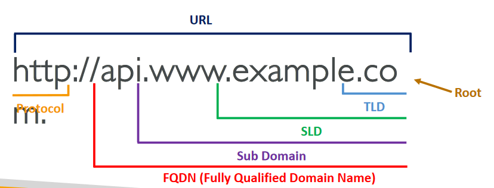
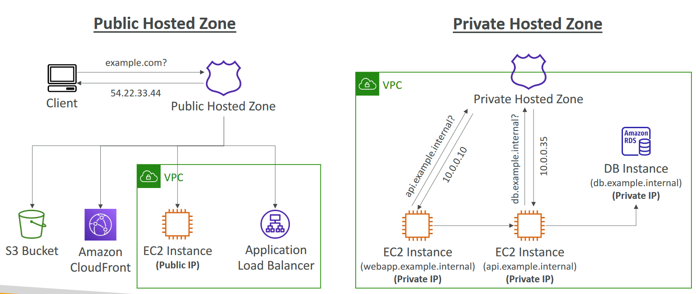
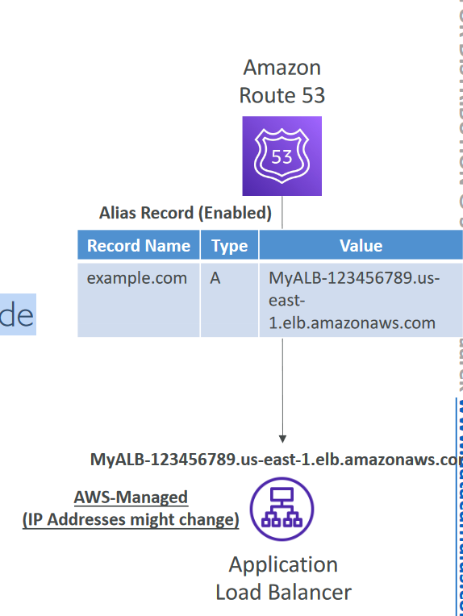
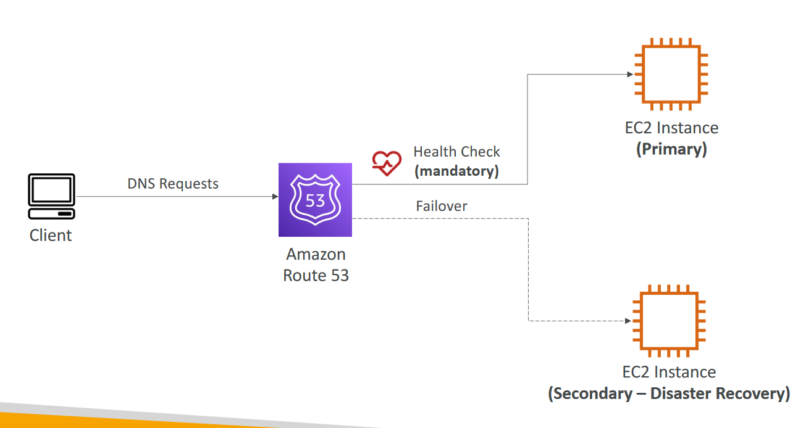

# Route 53

# What is DNS?
- Domain Name System which translates the human friendly hostnames
into the machine IP addresses
- www.google.com => 172.217.18.36
- DNS is the backbone of the Internet
- DNS uses hierarchical naming structure

.com
example.com
api.example.com
www.example.com

# DNS Terminologies

- Domain Registrar : Amazon Route 53, GoDaddy, …
- DNS Records: A, AAAA, CNAME, NS, …
- Zone File: contains DNS records
- Name Server : resolves DNS queries (Authoritative or Non-Authoritative)
- Top Level Domain (TLD): .com, .us, .in, .gov, .org, …
- Second Level Domain (SLD): amazon.com, google.com, …

# Amazon Route 53
- A highly available, scalable, fully managed and Authoritative DNS
- Authoritative = the customer (you) can update the DNS records
- Route 53 is also a Domain Registrar
- Ability to check the health of your resources
- The only AWS service which provides 100% availability SLA
- Why Route 53? 53 is a reference to the traditional DNS port

# Route 53 – Records
- How you want to route traffic for a domain
- Each record contains:
    - Domain/subdomain Name – e.g., example.com
    - Record Type – e.g., A or AAAA
    - Value – e.g., 12.34.56.78
    - Routing Policy – how Route 53 responds to queries
    - TTL – amount of time the record cached at DNS Resolvers
- Route 53 supports the following DNS record types:
    - (must know) A / AAAA / CNAME / NS
    - (advanced) CAA / DS / MX / NAPTR / PTR / SOA / TXT / SPF / SRV

# Route 53 – Record Types
- A – maps a hostname to IPv4
- AAAA – maps a hostname to IPv6
- CNAME – maps a hostname to another hostname
    - The target is a domain name which must have an A or AAAA record
    - Can’t create a CNAME record for the top node of a DNS namespace (Zone
    Apex)
    - Example: you can’t create for example.com, but you can create for
    www.example.com
- NS – Name Servers for the Hosted Zone
    - Control how traffic is routed for a domain

# Route 53 – Hosted Zones
- A container for records that define how to route traffic to a domain and
its subdomains
- Public Hosted Zones – contains records that specify how to route
traffic on the Internet (public domain names)
application1.mypublicdomain.com
- Private Hosted Zones – contain records that specify how you route
traffic within one or more VPCs (private domain names)
application1.company.internal
- You pay $0.50 per month per hosted zone

# Public vs. Private Hosted Zones

# Route 53 – Records TTL (Time To Live)

- High TTL – e.g., 24 hr
    - Less traffic on Route 53
    - Possibly outdated records
- Low TTL – e.g., 60 sec.
    - More traffic on Route 53 ($$)
    - Records are outdated for less
    time
    - Easy to change records
- Except for Alias records, TTL is mandatory for each DNS record

# CNAME vs Alias
- AWS Resources (Load Balancer, CloudFront...) expose an AWS hostname:
    - lb1-1234.us-east-2.elb.amazonaws.com and you want myapp.mydomain.com
- CNAME:
    - Points a hostname to any other hostname. (app.mydomain.com => blabla.anything.com)
    - ONLY FOR NON ROOT DOMAIN (aka. something.mydomain.com)
- Alias:
    - Points a hostname to an AWS Resource (app.mydomain.com => blabla.amazonaws.com)
    - Works for ROOT DOMAIN and NON ROOT DOMAIN (aka mydomain.com)
    - Free of charge
    - Native health check

# Route 53 – Alias Records
- Maps a hostname to an AWS resource
- An extension to DNS functionality
- Automatically recognizes changes in the
resource’s IP addresses
- Unlike CNAME, it can be used for the top node
of a DNS namespace (Zone Apex), e.g.:
example.com
- Alias Record is always of type A/AAAA for
AWS resources (IPv4 / IPv6)
- You can’t set the TTL

# Route 53 – Alias Records Targets

- Elastic Load Balancers
- CloudFront Distributions
- API Gateway
- Elastic Beanstalk environments
- S3 Websites
- VPC Interface Endpoints
- Global Accelerator accelerator
- Route 53 record in the same hosted zone
- You cannot set an ALIAS record for an EC2 DNS name

# Route 53 – Routing Policies
- Define how Route 53 responds to DNS queries
- Don’t get confused by the word “Routing”
    - It’s not the same as Load balancer routing which routes the traffic
    - DNS does not route any traffic, it only responds to the DNS queries
- Route 53 Supports the following Routing Policies
    - Simple
    - Weighted
    - Failover
    - Latency based
    - Geolocation
    - Multi-Value Answer
    - Geoproximity (using Route 53 Traffic Flow feature)

## Routing Policies – Simple
- Typically, route traffic to a single resource
- Can specify multiple values in the same record
- If multiple values are returned, a random one is chosen by the client
- When Alias enabled, specify only one AWS resource
- Can’t be associated with Health Checks

## Routing Policies – Weighted
- Control the % of the requests that go to each specific resource
- Assign each record a relative weight:
    - 𝑡𝑟𝑎𝑓𝑓𝑖𝑐 (%) = !"#$%& ()* + ,-".#(#. *".)*/
    012 )( +33 &%" 4"#$%&, ()* +33 *".)*/,
    - Weights don’t need to sum up to 100
- DNS records must have the same name and type
- Can be associated with Health Checks
- Use cases: load balancing between regions, testing new application versions…
- Assign a weight of 0 to a record to stop sending traffic to a resource
- If all records have weight of 0, then all records will be returned equally

## Routing Policies – Latency-based

- Redirect to the resource that
has the least latency close to us
- Super helpful when latency for
users is a priority
- Latency is based on traffic
between users and AWS
Regions
- Germany users may be
directed to the US (if that’s the
lowest latency)
- Can be associated with Health
Checks (has a failover
capability)

## Route 53 – Health Checks

- HTTP Health Checks are only for public
resources
- Health Check => Automated DNS Failover:
    1. Health checks that monitor an endpoint (application, server, other AWS resource)
    2. Health checks that monitor other health checks (Calculated Health Checks)
    3. Health checks that monitor CloudWatch Alarms (full control !!) – e.g., throttles of DynamoDB, alarms on RDS, custom metrics,… (helpful for private resources)
- Health Checks are integrated with CW
metrics

###  Health Checks – Monitor an Endpoint

- About 15 global health checkers will check the
endpoint health
    - Healthy/Unhealthy Threshold – 3 (default)
    - Interval – 30 sec (can set to 10 sec – higher cost)
    - Supported protocol: HTTP, HTTPS and TCP
    - If > 18% of health checkers report the endpoint is healthy, Route 53 considers it Healthy. Otherwise, it’s Unhealthy
    - Ability to choose which locations you want Route 53 to use
- Health Checks pass only when the endpoint
responds with the 2xx and 3xx status codes
- Health Checks can be setup to pass / fail based on
the text in the first 5120 bytes of the response
- Configure you router/firewall to allow incoming
requests from Route 53 Health Checkers

### Route 53 – Calculated Health Checks

- Combine the results of multiple Health
Checks into a single Health Check
- You can use OR, AND, or NOT
- Can monitor up to 256 Child Health Checks
- Specify how many of the health checks need to pass to make the parent pass
- Usage: perform maintenance to your website
without causing all health checks to fail

### Health Checks – Private Hosted Zones

- Route 53 health checkers are outside the VPC
- They can’t access private endpoints (private VPC or on-premises resource)
- You can create a CloudWatch Metric and associate a CloudWatch Alarm, then create a Health Check that checks the alarm itself

## Routing Policies – Failover (Active-Passive)

## Routing Policies – Geolocation

- Different from Latency-based!
- This routing is based on user location
- Specify location by Continent, Country or by US State (if there’s overlapping,most precise location selected)
- Should create a “Default” record (in
case there’s no match on location)
- Use cases: website localization, restrict
content distribution, load balancing, …
- Can be associated with Health Checks

## Routing Policies – Geoproximity

- Route traffic to your resources based on the geographic location of users and
resources
- Ability to shift more traffic to resources based on the defined bias
- To change the size of the geographic region, specify bias values:
    - To expand (1 to 99) – more traffic to the resource
    - To shrink (-1 to -99) – less traffic to the resource
- Resources can be:
    - AWS resources (specify AWS region)
    - Non-AWS resources (specify Latitude and Longitude)
- You must use Route 53 Traffic Flow to use this feature

## Routing Policies – IP-based Routing

- Routing is based on clients’ IP addresses
- You provide a list of CIDRs for your clients
and the corresponding endpoints/locations
(user-IP-to-endpoint mappings)
- Use cases: Optimize performance, reduce
network costs…
- Example: route end users from a particular
ISP to a specific endpoint

## Routing Policies – Multi-Value
- Use when routing traffic to multiple resources
- Route 53 return multiple values/resources
- Can be associated with Health Checks (return only values for healthy resources)
- Up to 8 healthy records are returned for each Multi-Value query
- Multi-Value is not a substitute for having an ELB

# 3rd Party Registrar with Amazon Route 53

- If you buy your domain on a 3rd party registrar, you can still use
Route 53 as the DNS Service provider
1. Create a Hosted Zone in Route 53
2. Update NS Records on 3rd party website to use Route 53 Name
Servers
- Domain Registrar != DNS Service
- But every Domain Registrar usually comes with some DNS features