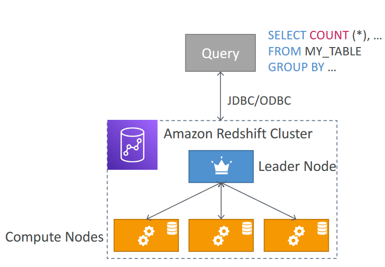
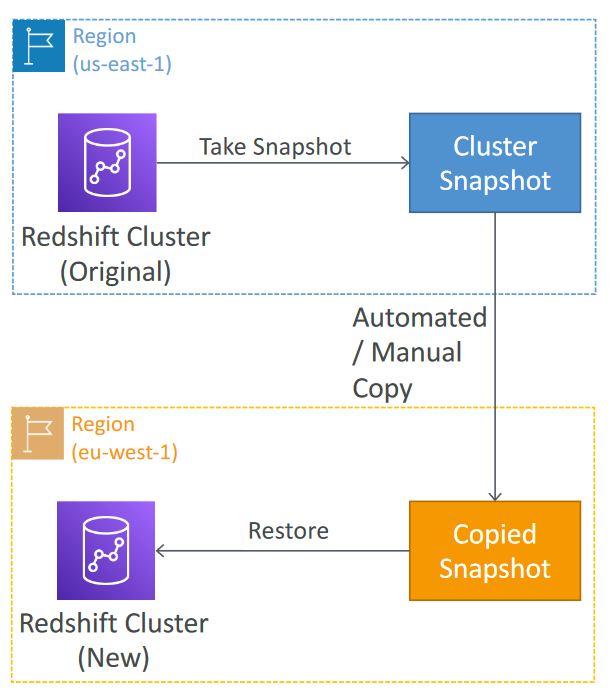
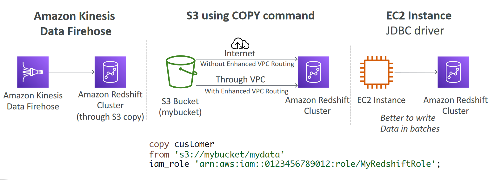

# Redshift Overview
- Redshift is based on PostgreSQL, but it’s not used for OLTP
- It’s OLAP – online analytical processing (analytics and data warehousing)
- 10x better performance than other data warehouses, scale to PBs of data
- Columnar storage of data (instead of row based) & parallel query engine
- Pay as you go based on the instances provisioned
- Has a SQL interface for performing the queries
- BI tools such as Amazon Quicksight or Tableau integrate with it
- vs Athena: faster queries / joins / aggregations thanks to indexes

# Redshift Cluster

- Leader node: for query planning, results aggregation
- Compute node: for performing the queries, send results to leader
- You provision the node size in advance
- You can used Reserved Instances for cost savings

# Redshift – Snapshots & DR
- Redshift has “Multi-AZ” mode for some clusters
- Snapshots are point-in-time backups of a cluster, stored internally in S3
- Snapshots are incremental (only what has changed is saved)
- You can restore a snapshot into a new cluster
- Automated: every 8 hours, every 5 GB, or on a schedule. Set retention between 1 to 35 days
- Manual: snapshot is retained until you delete it
- You can configure Amazon Redshift toautomatically copy snapshots (automated or manual) of a cluster to another AWS Region

# Loading data into Redshift:
- Large inserts are MUCH better

# Redshift Spectrum

- Query data that is already in S3 without loading it
- Must have a Redshift cluster available to start the query
- The query is then submitted to thousands of Redshift Spectrum nodes
