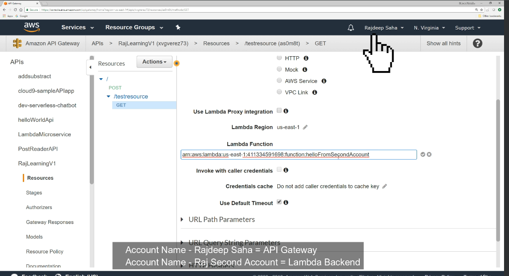
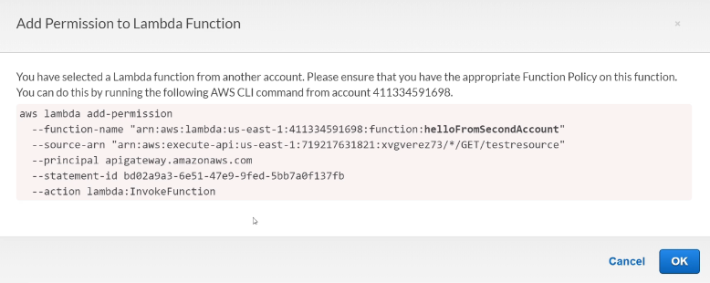
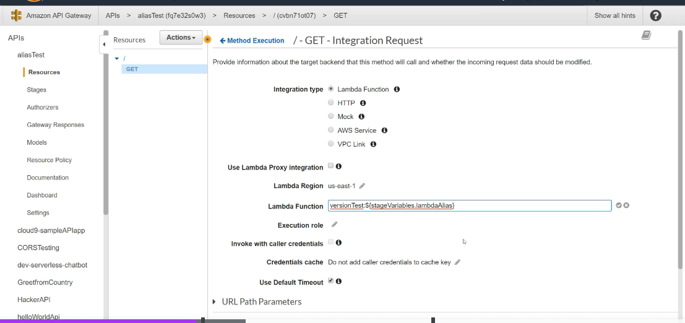
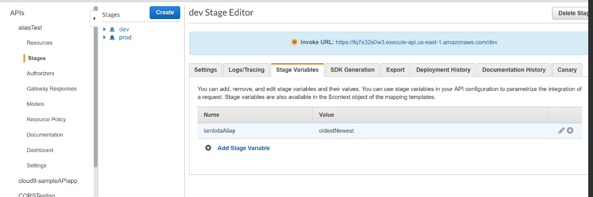
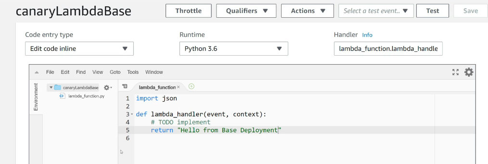
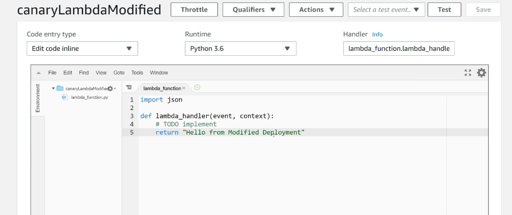
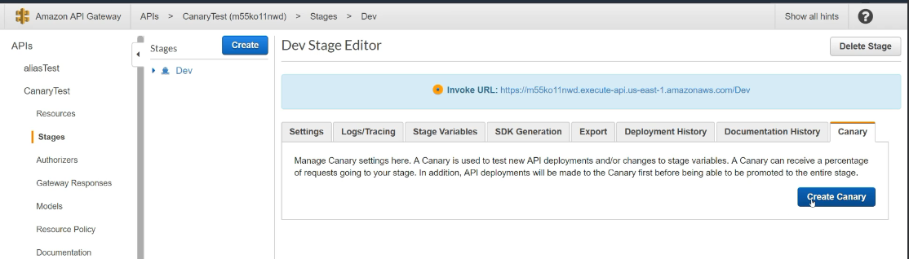
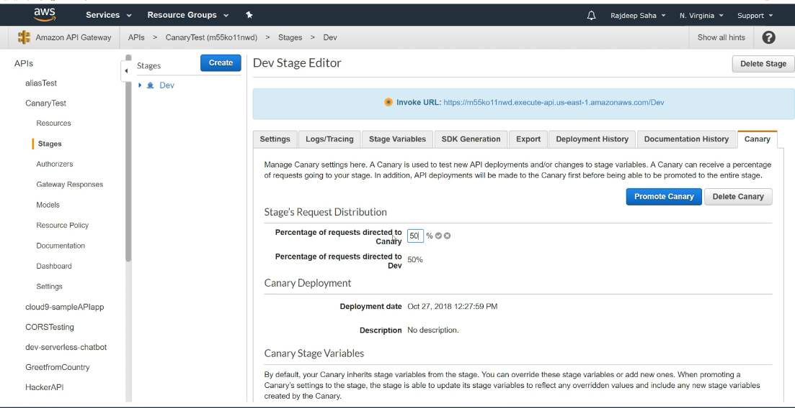

# AWS CROSS ACCOUNT CALL in API gateway

in the first account where is teh api gateway select the lambda function and write the ARN  of the lambda in the second account

add permission

# Lambda version and alias 

is used to manage traffic between lambda version is used to bluee green deployments

version test name of the lambda

# Canary deployment API

