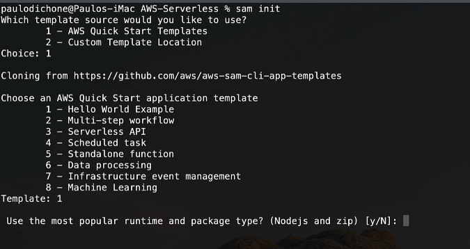
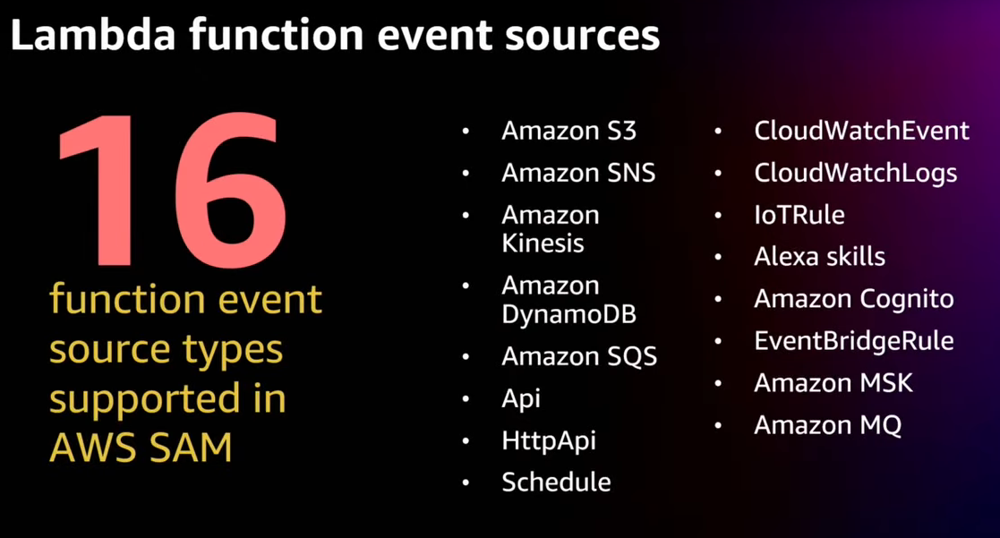
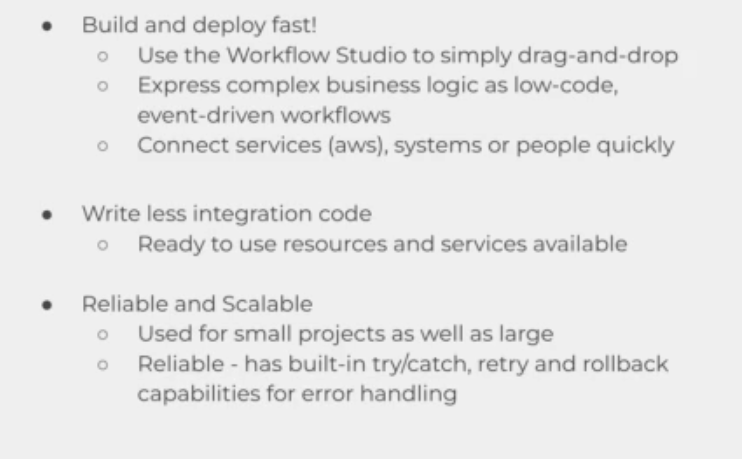
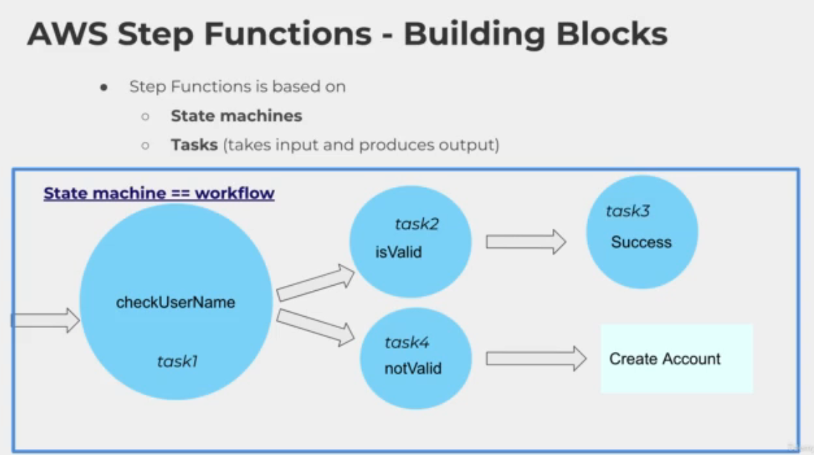
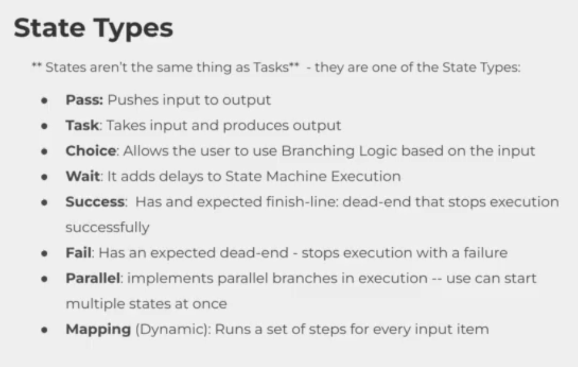

# AWS SAM

- AWS SAM (serverless application Model)
- Used to define your serverless application
- AWS SAM consists of the  following components
    - **AWS SAM Template Specification** you write properties to a file to describe functions, APIs, permissions, etc
    - **AWS SAM CLI** to invoke function, packages and deploy serverless applications to AWS cloud and so on
- AWS SAM CLI aims to ease the pain of creating, deplying, managing and debugging lambda functions
- It integrates well with CI/CD tools
- You use SAM to define and configure your serverless applications using a yaml template

## SAM benefits

- single deployment configuration deploy the whole stack as a single entity
- extension of AWS Cluodformation reliable cloudformation stack deployment
- built in best practices use AWS SAM to define and deploy your infraestructure as config
- deep integration with development tools
- local debugging and testing


## AWS SAM hello world

sam init



sam build

sam local invoke #need docker is running

sam deploy --guided

sam local start-api

sam local invoke  "name_fuction" -e events/event.json

clean all

aws cloudformation delete-stack --stack-name sam-app --region us-east-1


## AWS SAM TEMPLATE

An AWS SAM template file closely follows the format of an AWS CloudFormation template file, which is described in Template anatomy in the AWS CloudFormation User Guide. The primary differences between AWS SAM template files and AWS CloudFormation template files are the following:

- **Transform declaration.** The declaration Transform: AWS::Serverless-2016-10-31 is required for AWS SAM template files. This declaration identifies an AWS CloudFormation template file as an AWS SAM template file. For more information about transforms, see Transform in the AWS CloudFormation User Guide.

- **Globals section.** The Globals section is unique to AWS SAM. It defines properties that are common to all your serverless functions and APIs. All the AWS::Serverless::Function, AWS::Serverless::Api, and AWS::Serverless::SimpleTable resources inherit the properties that are defined in the Globals section. For more information about this section, see Globals section of the AWS SAM template.

- **Resources section.** In AWS SAM templates the Resources section can contain a combination of AWS CloudFormation resources and AWS SAM resources. For more information about AWS CloudFormation resources, see AWS resource and property types reference in the AWS CloudFormation User Guide. For more information about AWS SAM resources, see AWS SAM resource and property reference.

- **Parameters section.** Objects that are declared in the Parameters section cause the sam deploy --guided command to present additional prompts to the user. For examples of declared objects and the corresponding prompts, see sam deploy in the AWS SAM CLI command reference.

All other sections of an AWS SAM template file correspond to the AWS CloudFormation template file section of the same name.

### Template sections

```
Transform: AWS::Serverless-2016-10-31

Globals:
  set of globals

Description:
  String

Metadata:
  template metadata

Parameters:
  set of parameters

Mappings:
  set of mappings

Conditions:
  set of conditions

Resources:
  set of resources

Outputs:
  set of outputs

```

AWS SAM templates can include several major sections. Only the Transform and Resources sections are required.

You can include template sections in any order. However, if using language extensions, you should add AWS::LanguageExtensions before the serverless transform (that is, before AWS::Serverless-2016-10-31) as shown in the following example:

```
Transform:
  - AWS::LanguageExtensions
  - AWS::Serverless-2016-10-31

```

As you build your template, it can be helpful to use the logical order that's shown in the following list. This is because the values in one section might refer to values from a previous section.

- Transform (required)

For AWS SAM templates, you must include this section with a value of AWS::Serverless-2016-10-31.

Additional transforms are optional. For more information about transforms, see Transform in the AWS CloudFormation User Guide.

- Globals (optional)

Properties that are common to all your serverless functions, APIs, and simple tables. All the AWS::Serverless::Function, AWS::Serverless::Api, and AWS::Serverless::SimpleTable resources inherit the properties that are defined in the Globals section.

This section is unique to AWS SAM. There isn't a corresponding section in AWS CloudFormation templates.

- Description (optional)

A text string that describes the template.

This section corresponds directly with the Description section of AWS CloudFormation templates.

- Metadata (optional)

Objects that provide additional information about the template.

This section corresponds directly with the Metadata section of AWS CloudFormation templates.

- Parameters (optional)

Values to pass to your template at runtime (when you create or update a stack). You can refer to parameters from the Resources and Outputs sections of the template.

Values that are passed in using the --parameter-overrides parameter of the sam deploy command—and entries in the configuration file—take precendence over entries in the AWS SAM template file. For more information about the sam deploy command, see sam deploy in the AWS SAM CLI command reference. For more information about the configuration file, see AWS SAM CLI configuration file.

- Mappings (optional)

A mapping of keys and associated values that you can use to specify conditional parameter values, similar to a lookup table. You can match a key to a corresponding value by using the Fn::FindInMap intrinsic function in the Resources and Outputs sections.

This section corresponds directly with the Mappings section of AWS CloudFormation templates.

- Conditions (optional)

Conditions that control whether certain resources are created or whether certain resource properties are assigned a value during stack creation or update. For example, you could conditionally create a resource that depends on whether the stack is for a production or test environment.

This section corresponds directly with the Conditions section of AWS CloudFormation templates.

- Resources (required)

The stack resources and their properties, such as an Amazon Elastic Compute Cloud (Amazon EC2) instance or an Amazon Simple Storage Service (Amazon S3) bucket. You can refer to resources in the Resources and Outputs sections of the template.

This section is similar to the Resources section of AWS CloudFormation templates. In AWS SAM templates, this section can contain AWS SAM resources in addition to AWS CloudFormation resources.

- Outputs (optional)

The values that are returned whenever you view your stack's properties. For example, you can declare an output for an S3 bucket name, and then call the aws cloudformation describe-stacks AWS Command Line Interface (AWS CLI) command to view the name.

This section corresponds directly with the Outputs section of AWS CloudFormation templates.

### AWS SAM Resource Types

AWS::Serverless::Api

AWS::Serverless::Application

AWS::Serverless::Connector

AWS::Serverless::Function

AWS::Serverless::GraphQLApi

AWS::Serverless::HttpApi

AWS::Serverless::LayerVersion

AWS::Serverless::SimpleTable

AWS::Serverless::StateMachine

https://docs.aws.amazon.com/serverless-application-model/latest/developerguide/sam-specification-resources-and-properties.html



## AWS Step function

A service that allow developer build visual workflows for business processes
- orchestrate data flow in an automated environment

### Benefits Step function

- build and deploy fast
- write less integration code
- reliable ans scalable







