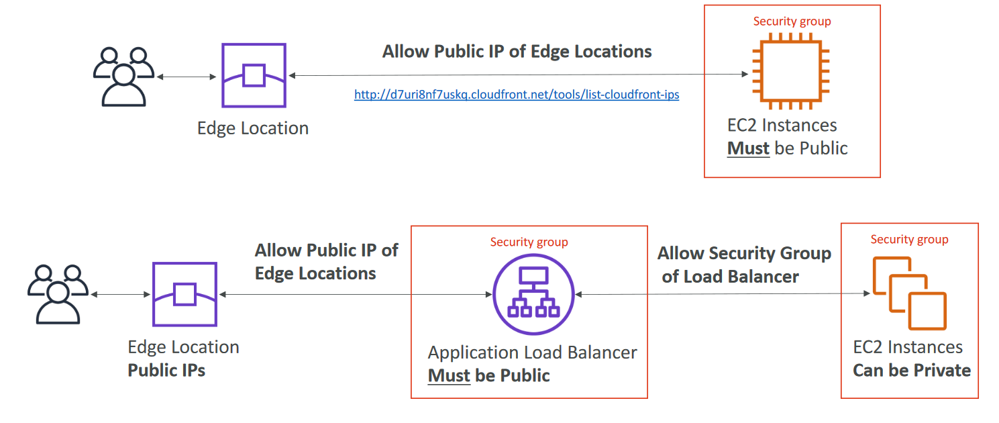
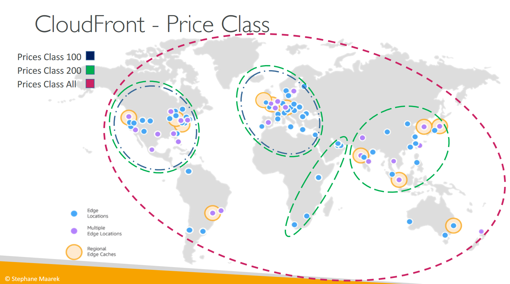

# Amazon CloudFront -

- Content Delivery Network (CDN)
- Improves read performance,content is cached at the edge
- Improves users experience
- 216 Point of Presence globally (edge locations)
- DDoS protection (becauseworldwide), integration with Shield,AWS Web Application Firewall

# CloudFront – Origins
- S3 bucket
    - For distributing files and caching them at the edge
    - Enhanced security with CloudFront Origin Access Control (OAC)
    - OAC is replacing Origin Access Identity (OAI)
    - CloudFront can be used as an ingress (to upload files to S3)
- Custom Origin (HTTP)
    - Application Load Balancer
    - EC2 instance
    - S3 website (must first enable the bucket as a static S3 website)
    - Any HTTP backend you want

# CloudFront vs S3 Cross Region Replication

- CloudFront:
    - Global Edge network
    - Files are cached for a TTL (maybe a day)
    - Great for static content that must be available everywhere
- S3 Cross Region Replication:
    - Must be setup for each region you want replication to happen
    - Files are updated in near real-time
    - Read only
    - Great for dynamic content that needs to be available at low-latency in few
    regions

# CloudFront – ALB or EC2 as an origin

# CloudFront Geo Restriction
- You can restrict who can access your distribution
    - Allowlist: Allow your users to access your content only if they're in one of the
    countries on a list of approved countries.
    - Blocklist: Prevent your users from accessing your content if they're in one of the
    countries on a list of banned countries.
- The “country” is determined using a 3rd party Geo-IP database
- Use case: Copyright Laws to control access to content

# CloudFront - Pricing
- CloudFront Edge locations are all around the world
- The cost of data out per edge location varies

## CloudFront – Price Classes
- You can reduce the number of edge locations for cost reduction
- Three price classes:
    1. Price Class All: all regions – best performance
    2. Price Class 200: most regions, but excludes the most expensive regions
    3. Price Class 100: only the least expensive regions

# CloudFront – Cache Invalidations
- In case you update the back-end origin, CloudFront doesn’t know about it and will only get the refreshed  content after the TTL has expired
- However, you can force an entire or partial cache refresh (thus bypassing the TTL) by performing a cloudFront Invalidation
- You can invalidate all files (*) or aspecial path (/images/*)

# CloudFront Functions & Lambda@Edge
Use Cases
- Website Security and Privacy
- Dynamic Web Application at the Edge
- Search Engine Optimization (SEO)
- Intelligently Route Across Origins and Data Centers
- Bot Mitigation at the Edge
- Real-time Image Transformation
- A/B Testing
- User Authentication and Authorization
- User Prioritization
- User Tracking and Analytics

# CloudFront Functions
- Lightweight functions written in JavaScript
- For high-scale, latency-sensitive CDN customizations
- Sub-ms startup times, millions of requests/second
- Used to change Viewer requests and responses:
- Viewer Request: after CloudFront receives a request from a
viewer
- Viewer Response: before CloudFront forwards the response
to the viewer
- Native feature of CloudFront (manage code entirely
within CloudFront)

______________________

Amazon CloudFront is a fast content delivery network (CDN) service that securely delivers data, videos, applications, and APIs to customers globally with low latency, high transfer speeds, all within a developer-friendly environment.

AWS Global Accelerator and Amazon CloudFront are separate services that use the AWS global network and its edge locations around the world. CloudFront improves performance for both cacheable content (such as images and videos) and dynamic content (such as API acceleration and dynamic site delivery), while Global Accelerator improves performance for a wide range of applications over TCP or UDP.