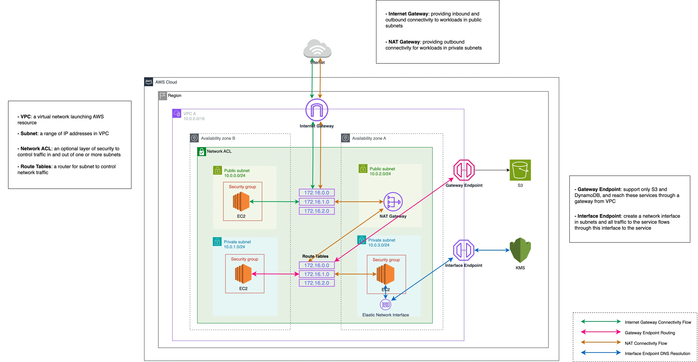

## AWS Well-Architected

The AWS Well-Architected Framework describes key concepts, design principles, and architectural best practices for designing and running workloads in the cloud. By answering a few foundational questions, learn how well your architecture aligns with cloud best practices and gain guidance for making improvements.

### Operational Excellence Pillar

The operational excellence pillar focuses on running and monitoring systems, and continually improving processes and procedures. Key topics include automating changes, responding to events, and defining standards to manage daily operations.


### Security Pillar

The security pillar focuses on protecting information and systems. Key topics include confidentiality and integrity of data, managing user permissions, and establishing controls to detect security events.


### Reliability Pillar

The reliability pillar focuses on workloads performing their intended functions and how to recover quickly from failure to meet demands. Key topics include distributed system design, recovery planning, and adapting to changing requirements.

### Performance Efficiency Pillar

The performance efficiency pillar focuses on structured and streamlined allocation of IT and computing resources. Key topics include selecting resource types and sizes optimized for workload requirements, monitoring performance, and maintaining efficiency as business needs evolve.

### Cost Optimization Pillar

The cost optimization pillar focuses on avoiding unnecessary costs. Key topics include understanding spending over time and controlling fund allocation, selecting resources of the right type and quantity, and scaling to meet business needs without overspending.


### Sustainability Pillar

The sustainability pillar focuses on minimizing the environmental impacts of running cloud workloads. Key topics include a shared responsibility model for sustainability, understanding impact, and maximizing utilization to minimize required resources and reduce downstream impacts. 

## RPO VS RTO

**Recovery Point Objective (RPO)** generally refers to the amount of data that can be lost within a period most relevant to a business, before significant harm occurs, from the point of a critical event to the most preceding backup.
Los RPO calculan cuándo sus datos estuvieron disponibles por última vez

**Recovery Time Objective (RTO)** often refers to the quantity of time that an application, system and/or process, can be down for without causing significant damage to the business as well as the time spent restoring the application and its data.

Los RTO representan la cantidad de tiempo que una aplicación puede estar inactiva sin resultar en un daño significativo para el negocio y el tiempo que el sistema necesita para recuperarse.

## AWS CLI


## ROUTE 53

Choosing a routing policy
PDF
Kindle
RSS

When you create a record, you choose a routing policy, which determines how Amazon Route 53 responds to queries:

    Simple routing policy – Use for a single resource that performs a given function for your domain, for example, a web server that serves content for the example.com website.

    Failover routing policy – Use when you want to configure active-passive failover.

    Geolocation routing policy – Use when you want to route traffic based on the location of your users.

    Geoproximity routing policy – Use when you want to route traffic based on the location of your resources and, optionally, shift traffic from resources in one location to resources in another.

    Latency routing policy – Use when you have resources in multiple AWS Regions and you want to route traffic to the Region that provides the best latency with less round-trip time.

    Multivalue answer routing policy – Use when you want Route 53 to respond to DNS queries with up to eight healthy records selected at random.

    Weighted routing policy – Use to route traffic to multiple resources in proportions that you specify

    # AWS


## EC2 INSTANCES

is like a virtual machine

### EC2 PRICING OPTIONS

- *ON DEMAND*
    - short term
    - flexible
    - testing

- *RESERVED* 
 - predictable usage
 - specific capacity requirements
 - pay up front (one or three years)

 - there are 3 types 
    - standar RI 
    - Convertible RI
    - scheduled RI

- *SPOT*
    - application that have flexible start and end times 
    - aplication that are only feasible at very low computes price 
    - used for a urgent need for a large amount of additional computing capacity
- *DEDICATED*
    - Compliance regulatory requeriments that  may no support multi tenant virtualization
    - Licensing

### EC2 INSTANCE TYPES

## GENERAL PURPOUSE
T y M 

## COMPUTE OPTIMIZED
C

## FPGA INSTANCES
F

## GPU INSTANCES
G

## MACHINE LEARNING
inf

## MEMORY OPTIMIZED
R

## STORAGE OPTIMIZED
D, I, H

## EBS Elastic Block Storage

[https://docs.aws.amazon.com/AWSEC2/latest/UserGuide/ebs-volume-types.html]

Highly available and scalable storage volumes that you can attach to your EC2 instances


### General purpose SSD (gp2)

-  3 IOP per GiB up to maximum of  16000 IOPS per volume
- gp2 volumes smaller tan 1TB can burst up to 3000 IOPS
- Good for boot volumes or development and test applications which are not latency sensitive

### General purpose SSD (gp3)

- baseline of 3000 IOPS for any volume size (1-16 GB)
- Delivering up to 16000 IOPs
- 20% cheaper than gp2
-  Good for boot volumes or development and test applications which are not latency sensitive

### provisioned IOPS SSD (io1)

- the high performance option and the most expenisve
- up to 64000 IOPS per volume 50 IOPS per GiB
- Use if you need more than 16000 IOPS
- Design for I/O intensive app large database, and latency sensitive workloads
- the most expensive
- durability up to 99.9%

### provisioned IOPS SSD (io2)

- latest generation
- Higher durability an more IOPS
- the same price as io1
- 500 IOPS per GiB
- Up to 64000 IOPS
- 99.999% durability instead of up to 99.9%
- Design for I/O intensive app large database, and latency sensitive workloads, app which need high levels of durability

### Provisiones IOPS SSD io2 Block Express
- SAN (storage area network) in the cloud highest performance, sub milisecon latency
- Uses EBs bloc express arquitechture
- 4x throughtput, IOPS, and capacity of regular io2 volumes
- Up to 64 TB, 256000 IOPS per volume 99.999% durability
- Great for the largest most critical , high performance app like SAP HANA, ORACLE, MS SQL Server, IBM DB2

### Throughput Optimez HDD (st1)

- Low cos HDD volume
- Baseline throughput of 40MB/s per TB
- Ability to burst up  to 250MB/s per TB
- Maximum througput of 500 MB/s per volume
- Frecuently-accessed, throughput-intensive workloads
- BIG data, data warehouse, ETL, and log processing
- A cost effective way to store mountains of data infrecuent access
- cannot be a boot volume

### COLD HDD (SC1)

- more cheaper
- Baseline througput of 12 MB/s per TB
- Ability to burst up to 80MB/s per TB
- Max throughput of 250 MB/s per volume
- A good choice for colder data requiring fewer scans per day
- Good fro applications that need the lowest cost and performance is not a factor
- cannot be a boot volume

## IOPS VS THROUGHPUT

### IOPS

- Measures the number of read and write operation per second
- import metric for quick transactions, low latency apps, transactional workloads
- the ability to action reads and writes very quickly
- Choose provisiones IOPS SSD (io1 or io2)


### THROUGHPUT

- Measure the number of bits read or written per second (MB/s)
- important metric for large datasets, large I/o sizes, complex queries
- the ability to deal with large datasets
- Choose throughput optimized HDD (st1)

## LOAD BALANCER

a load balancer distributes network traffic across a group of servers

### APLICATION LOAD BALANCER

- HTTP y HTTPS
- operates at layer 7 application layer and are application-aware


### NETWORK LOAD BALANCER

- TCP and high performance
- operates at layer 4
- most exepnsive

### CALSSIC LOAD BALANCER (legacy)

HTTP/HTTPS and TCP
- x-forwarded-for header and sticky sessions

### GATEWAY LOAD BALANCER

- Allows you to load balance workloads for third party appliances running in AWs such as
    - Virtual appliances purchased using AWS marketplace
    - Virtual firewall from companies like Fortinet, Palo Alto, Juniper, CISCO
    - IDS/IPS system from companies like CheckPoint, Trend Micro, etc

### COMMON LOAD BALANCER ERROR

- ERROR 504 gateway timeout
    - the target failed to respond
    - the ELB could not establish a connection to the target
    - Your app is having issues
    - Identfy where the app is failing and fix the problem

## ROUTE 53

Is amazon's DNS service
Allows you to map domain name that you own to:
    - EC2 instances
    - Load Balancer
    - S3 Buckets


## NOTES
 - roles are preferred from security perspective
 - avoid hard coding your credentials
 - policies control a roles's permissions
 - You can update a policy attahed to a role an it take inmediate effect
 - YOu can attach or detach roles to running EC2 instances without hving to stop or terminate

 ## RDS

 ### When would we use and RDS database?

 - RDS is generally used for online transaction processing (OLTP) workloads

### RDS TYPES

    - SQL SERVER
    - POSTGRESQL
    - ORACLE
    - MARIA DB
    - AURORA (MYSQL y POSTGRESQL)
    - MYSQL

 multi aZ
 failover capability
 automated backups

 ### difference betwee OLTP (Online transaction Processing) and OLAP (Online analytics Processing)

 - OLTP Processes from transactions in real time (payment, booking, banking transactions)
 - OLAP processes complex queries to analyze historical data, OLAP is about data analysis using large amount of data

TO OLAP RDS not suitable for analyzing large amount of data. Use datawarehouse like REdShift

### MULTIAZ

- An exact copy of your prodcution DB in another availability zone
- Used for disaster recovery
- In the event of a failure RDS will automatically failover to the stand by instance

### READ REPLICAS

- A read only copy oy your primary DB in the same AZ, cross AZ or cross region
- Used to increase or scale read performance
- Great for read heavy workloads and takes off the load off your primary DB for read only workloads

### RDS BACKUP AND SNAPSHOT

- database snapshot manual ad hoc and user initiaded it provides a snapshoy storage volume attached to the DB instance

- automated backup enable by default, it creates daily backups or snapshots that run during a backup window that you define. Transaction logs are used to replay transactions
 point in time recovery  retention period of 1 to 35 days
 retetion period

 the restore version of databasee will always be a new RDS instance with a new DNS endpoint no matter if was backup o snapshot

 ### ENCYPTION

 - encryption at rest KMS AES-256 encryption
    includes all DB storage

  - you can't enable encryption on an unencrypted RDS DB instance

  for encrypt unencrypted DB first is necessary make an snapshot then create an encrypted snapshot to the unecrypted snapshot and the encrypted DB from de encrypted snapshot

  ## ELASTICACHE

-  in memory cache (key value)
-  improve database performance
- great for read heavy database workloads: caching the results of I/O intensive database queries Also for storing sessions data for distributed applications

- there are 2 types elsticcahce MEMCAHCED and REDIS

### MEMCACHED

- great for basic object caching
- scales hotiontally, but there is no persistence, multi-AZ or failover
-good choice if you just want basic caching and you want your caching model to be as simple as possible

### REDIS

- A more sophisticated solution with enterprise feature like persistence, replication, multi  AZ and failover
- Support storing and ranking data (for gaming leaderboard) and complex data types like lists and hashes

Elastic cache not help in heavy write load or OLAP queries (redshift)

## SYSTEM MANAGER PARAMETER STORE

Parameter store store confidential info password,database connection string, licenses code, et


## S3

simple storage service provide secure, durable, highly- scalable obect store

cannot  use to run to OS or database

object up to 5 TB in size

S3 bucket name is globally unique

### S3 storage classes

 - S3 Standard 
    High availability and durability (99.99% availability, 99.999999999% durability 11's 9)
    frequently accesed data
      big data nalytics, gamming app, mobile, content distribution

 - S3 standard infrequen acces S3-IA
  designed for infrequently accesed data
  long terms storage, backups and disaster recovery
   minimum storage duration 30 days
   (99.99% availability, 99.999999999% durability 11's 9)

 -  S3 IA one zone
    cost 20% less than regular S# IA
    great for long lived, infrequently accesed, non critical data
    minimum storage duration 30 days
    (99.5% availability, 99.999999999% durability 11's 9)

 - Glacier
    Glacier is very cheap storage
    optimized for data is very infrequent accesed
    90 day minimum
    retrieval times rnage from 1 minute to 12 hours
    (99.99% availability, 99.999999999% durability 11's 9)

 - Glacier deep arhcive
    archives rarely accecesd data
    retrieval time of 12 hours
    180 days minimum
    (99.99% availability, 99.999999999% durability 11's 9)

 - S3 intellignet tiering
    automatically moves your data to the most cost-effective tier based on how frequently you access each object
    (99.9% availability, 99.999999999% durability 11's 9)

### Securing S3 buckets

BUCKET POLICIES
- bucket policies applied at bucket leves
- not individula objects
- groups of files which need to be accesed by the same people

BUCKET ACL ACCESS CONTROL LIST
- applied at an object level
- we can define which accounts or groups are granted acces and also the type of access
-  fine grained control

S3 ACCES LOGS
every time a user makes a reuqest to upload, read or delete a file logs written 

## AWS — Difference between Secrets Manager and Parameter Store (Systems Manager)

https://medium.com/awesome-cloud/aws-difference-between-secrets-manager-and-parameter-store-systems-manager-f02686604eae

AWS gives you two ways to store and manage application configuration data centrally:

**Secrets Manager:** It was designed specifically for confidential information (like database credentials, API keys) that needs to be encrypted, so the creation of a secret entry has encryption enabled by default. It also gives additional functionality like rotation of keys.
**Systems Manager Parameter Store:** It was designed to cater to a wider use case, not just secrets or passwords, but also application configuration variables like URLs, Custom settings, AMI IDs, License keys, etc.


### Use Cases
Choose Secrets Manager if:
You want to store only encrypted values and super easy way to manage the rotation of the secrets. For instance, for organizations that have to be PCI compliant where the mandate is to rotate your passwords every 90d, AWS Secrets Manager makes that a very easy and seamless process.
Choose Parameter Store if:
You want cheaper option to store encrypted or unencrypted secrets.


_______________

. How can you recover/login to an EC2 instance for which you have lost the key?
Follow the steps provided below to recover an EC2 instance if you have lost the key:

Verify that the EC2Config service is running
Detach the root volume for the instance
Attach the volume to a temporary instance
Modify the configuration file
Restart the original instance

How Do Amazon Rds, Dynamodb, and Redshift Differ from Each Other?
Amazon RDS is a database management service for relational databases. It manages patching, upgrading, and data backups automatically. It’s a database management service for structured data only. On the other hand, DynamoDB is a NoSQL database service for dealing with unstructured data. Redshift is a data warehouse product used in data analysis.

What is RTO and RPO in AWS?
RTO or Recovery Time Objective is the maximum time your business or organization is willing to wait for a recovery to complete in the wake of an outage. On the other hand, RPO or Recovery Point Objective is the maximum amount of data loss your company is willing to accept as measured in time.

How is AWS CloudFormation different from AWS Elastic Beanstalk?
Here are some differences between AWS CloudFormation and AWS Elastic Beanstalk:

AWS CloudFormation helps you provision and describe all of the infrastructure resources that are present in your cloud environment. On the other hand, AWS Elastic Beanstalk provides an environment that makes it easy to deploy and run applications in the cloud.
AWS CloudFormation supports the infrastructure needs of various types of applications, like legacy applications and existing enterprise applications. On the other hand, AWS Elastic Beanstalk is combined with the developer tools to help you manage the lifecycle of your applications.

What are the elements of an AWS CloudFormation template?
AWS CloudFormation templates are YAML or JSON formatted text files that are comprised of five essential elements, they are:

Template parameters
Output values
Data tables
Resources
File format version

How can you automate EC2 backup using EBS?
Use the following steps in order to automate EC2 backup using EBS:

Get the list of instances and connect to AWS through API to list the Amazon EBS volumes that are attached locally to the instance.
List the snapshots of each volume, and assign a retention period of the snapshot. Later on, create a snapshot of each volume.
Make sure to remove the snapshot if it is older than the retention period.

What is the difference between EBS and Instance Store?
EBS is a kind of permanent storage in which the data can be restored at a later point. When you save data in the EBS, it stays even after the lifetime of the EC2 instance. On the other hand, Instance Store is temporary storage that is physically attached to a host machine. With an Instance Store, you cannot detach one instance and attach it to another. Unlike in EBS, data in an Instance Store is lost if any instance is stopped or terminated.

Can you take a backup of EFS like EBS, and if yes, how?
Yes, you can use the EFS-to-EFS backup solution to recover from unintended changes or deletion in Amazon EFS. Follow these steps:

Sign in to the AWS Management Console
Click the launch EFS-to-EFS-restore button
Use the region selector in the console navigation bar to select region
Verify if you have chosen the right template on the Select Template page
Assign a name to your solution stack
Review the parameters for the template and modify them if necessary

What are the different uses of the various load balancers in AWS Elastic Load Balancing?
Application Load Balancer
Used if you need flexible application management and TLS termination.

Network Load Balancer
Used if you require extreme performance and static IPs for your applications.

Classic Load Balancer
Used if your application is built within the EC2 Classic network

How can you use AWS WAF in monitoring your AWS applications?
AWS WAF or AWS Web Application Firewall protects your web applications from web exploitations. It helps you control the traffic flow to your applications. With WAF, you can also create custom rules that block common attack patterns. It can be used for three cases: allow all requests, prevent all requests, and count all requests for a new policy

What is the difference between an IAM role and an IAM user?
The two key differences between the IAM role and IAM user are:

An IAM role is an IAM entity that defines a set of permissions for making AWS service requests, while an IAM user has permanent long-term credentials and is used to interact with the AWS services directly.  
In the IAM role, trusted entities, like IAM users, applications, or an AWS service, assume roles whereas the IAM user has full access to all the AWS IAM functionalities.

What is the difference between Latency Based Routing and Geo DNS?
The Geo Based DNS routing takes decisions based on the geographic location of the request. Whereas, the Latency Based Routing utilizes latency measurements between networks and AWS data centers. Latency Based Routing is used when you want to give your customers the lowest latency possible. On the other hand, Geo Based routing is used when you want to direct the customer to different websites based on the country or region they are browsing from. 

What is the difference between a Domain and a Hosted Zone?
Domain
A domain is a collection of data describing a self-contained administrative and technical unit. For example, www.simplilearn.com is a domain and a general DNS concept.

Hosted zone
A hosted zone is a container that holds information about how you want to route traffic on the internet for a specific domain. For example, lms.simplilearn.com is a hosted zone.

Which type of scaling would you recommend for RDS and why?
There are two types of scaling - vertical scaling and horizontal scaling. Vertical scaling lets you vertically scale up your master database with the press of a button. A database can only be scaled vertically, and there are 18 different instances in which you can resize the RDS. On the other hand, horizontal scaling is good for replicas. These are read-only replicas that can only be done through Amazon Aurora.

What are the consistency models in DynamoDB?
There are two consistency models In DynamoDB. First, there is the Eventual Consistency Model, which maximizes your read throughput. However, it might not reflect the results of a recently completed write. Fortunately, all the copies of data usually reach consistency within a second. The second model is called the Strong Consistency Model. This model has a delay in writing the data, but it guarantees that you will always see the updated data every time you read it. 

Explain can you vertically scale an Amazon instance? How?
Yes, you can vertically scale on the Amazon instance. For that

Spin up a new larger instance than the one you are currently running
Pause that instance and detach the root webs volume from the server and discard
Then stop your live instance and detach its root volume
Note the unique device ID and attach that root volume to your new server
And start it again

What is a redshift?
Redshift is a big data warehouse product. It is a fast and powerful, fully managed data warehouse service in the cloud.

What is Data Warehouse?
Data warehousing (DW) is the repository of a data and it is used for Management decision support system. Data warehouse consists of wide variety of data that has high level of business conditions at a single point in time.

In single sentence, it is repository of integrated information which can be available for queries and analysis.

What are the advantages of auto-scaling?
Following are the advantages of autoscaling

Offers fault tolerance
Better availability
Better cost management

Explain Amazon ElasticCache
Amazon Elasticcache is a web service which makes it easy to deploy, scale and store data in the cloud.

How to connect EBS volume to multiple instances?
We can’t be able to connect EBS volume to multiple instances.  However, you can connect various EBS Volumes to a single instance.

In which situation you will select provisioned IOPS over Standard RDS storage?
You should select provisioned IOPS storage over standard RDS storage if you want to perform batch-related workloads


____________________

https://www.turing.com/interview-questions/aws

_______________________

# AWS -DNS Records Type

Dns records in AWs define how to route traffic on the internet for your domain, translating domain names innto IP addresses

## A (Address record)
Maps domain to IPv4 address is used to Hosting websites on IPv4

## AAA /Ipv6 Address record)
Maps domain to IPv6 address is used to Hosting websites on IPv6

## CNAME (Canonical name record)
redirects one domain to another, is used when creating domain aliases

## MX (mail exchange record)
Directs domain's email to mail servers is used to setting up email delivery

## NS Name server record
Direct to the server that contain authoritative DNS records for a Domain uses when specifying domain's DNS service

## PTR (pointer record)
associates ip with a canonical domain name, is used to enabling reverse DNS lookup

## SOA Start of authority record
List primary info about domain is used to managing DNS records

## SPF Sender Policy framework
Specifies authorize mail servers is used to preventing email spoofing

## SRV Service locator
locates servers for specific services is used to directing traffic to service-specifis servers

## TXT text record
contains domain verification info is used to proving domain ownership, other verifications

## CAA Certification Authority Authorization
Restricts certificates issuance is used to controlling SSl/TLS certificates issuing

## NAPTR Name authority Pointer Record
maps services to damin names is used to setting up complex communication services

______________________________

Stop Paying $3.75 Per Month for a Public IPv4 Address on AWS (Starting Feb 1, 2024)


As you would have read in AWS News Blog, starting February 1, 2024, there’s a new charge for public IPv4 addresses. Now, every public IPv4 address will come with a price tag of $0.005 per IP per hour or $3.75 per month or $45 per year. And yes, that applies whether the address is attached to a service or not.

Now, let’s dive into the ‘why’ of it all. The cost of snagging a single public IPv4 address has shot up by over 300% in the last half-decade. So, AWS is adjusting its charges to reflect this reality and to, well, nudge us towards a more economical approach to these IPv4 addresses. In other words, they’re encouraging us to be a bit more mindful of our usage and consider adopting IPv6.

Hold on, there’s more. This change covers a whole array of AWS services that can potentially assign a public IPv4 address — think Amazon EC2, Amazon RDS database instances, Amazon EKS nodes, Amazon RedShift nodes, Elastic Beanstalk, DMS, ECS, EMR, MSK, MQ, AppStream 2.0, Workspaces, ELB, NAT Gateway, Global Accelerator, S2S VPN, and Mainframe Modernisation.

Now, let’s talk numbers — you know, just ballpark figures. If you crunch the numbers, this move could potentially ring in over a billion dollars a year in revenue for AWS.

So, whether you’re a seasoned AWS pro or just dipping your toes into the cloud, keep this in mind as the new charge takes the stage in early 2024.

Monitoring public IPv4 usage just got a whole lot smarter with the introduction of Amazon VPC IPAM Public IP Insights. The best part? — it’s free. Public IP Insights works seamlessly without requiring you to enable Amazon VPC IPAM.


Now, let’s get into the nitty-gritty of what Public IP Insights brings to the table. With this tool in your arsenal, you can effortlessly monitor, analyze, and even audit how those public IPv4 addresses are being put to work.

But that’s not all — Public IP Insights is here to answer some crucial questions for you:

Resource and Service Utilization: Ever wonder which resources and services within your AWS account are tapping into those public IPv4 addresses? Public IP Insights reveals where those addresses are being utilized.
Address Allocation Rationale: Wouldn’t it be fantastic to know the ‘why’ behind the allocation of public IP addresses to specific resources? Public IP Insights gives you valuable insights into the reasons behind the scenes.
Now, you might be wondering — how do we move forward from here? With the upcoming changes to public IPv4 charges, it’s a smart move to consider transitioning to IPv6. The accompanying blog post is a worth a read to identify and optimize your public IPv4 usage before planning to move your workloads to IPv6. The transition to IPv6 isn’t just about saving on costs; it’s also about embracing the modern standard of addressing that IPv6 brings to the table.

The AWS IPv6-VPC documentation is a good starting point to migrate your VPC from IPv4 to IPv6. Please note that after migrating your VPC to IPv6, you can’t automatically remove the public IPv4 address from an already existing instance that is assigned a public IPv4 address at its launch (and if EC2 is in a public subnet). As this scenario is not covered in the documentation, the solution provided below shows how to remove the public IPv4 associated with an EC2 instance :

Locate Your EC2 Instance:

Launch AWS Management Console and navigate to the EC2 Dashboard.
Locate the EC2 instance that’s housing those IPv4 public IPs.
Create a New ENI:

In the navigation pane, under “Network & Security,” click on “Network Interfaces.”
Hit the “Create Network Interface” button.
Configure your new ENI, making sure to:
Set the subnet in which your instance resides.
Assign a public IPv6 address to your new ENI (IPv6 addresses are always public).
Attach the appropriate security group that has the required rules to allow IPv6 traffic from the source and destination.
Attach New ENI:

Select the freshly provisioned ENI and click on “Actions.”
Choose “Attach Network Interface.”
Associate the ENI with your EC2 instance. Yes, this is the power move that’ll make the public IPv4 addresses obsolete.
Instance Restart:

Now comes the final step to seal the deal. Restart your EC2 instance.
Make sure to do this gracefully to ensure a smooth transition.
Verification Time:

After the instance restarts, it’s time for the moment of truth. Verify that your IPv4 public IPs are now a thing of the past.
IPv6 address persists when you stop and start your instance and is released to the VPC IPv6 subnet pool when you terminate the EC2 instance.
After you rerun the Public IP insights you will see “No public IPs found in this region” as shown below:
Note: I would suggest AWS should update this wording to “No public IPv4 found in this Region” because IPv6 are always public and the EC2 is now associated with a public IPv6 address!


Traffic Testing:

It’s not over until you’ve rigorously tested your traffic. Make sure that both IPv4 and IPv6 flows are performing as expected.
Well, now the question comes to the mind how to communicate with any external IPv4 address from the IPv6 EC2 instances (in public subnet) that does not having any public IPv4 address anymore? If you have IPv6 workloads that need to transparently communicate with IPv4 services, you will need NAT64 (read “NAT six to four”) for the VPC NAT gateway and DNS64 (read “DNS six to four”) for the Amazon Route 53 resolver. This AWS Blog explains how to setup NAT64 and DNS64 for these types of workloads. Nevertheless, it’s essential to bear in mind that standard NAT gateway fees will be applicable. Hence, unless you have workloads on AWS with more than ~11 EC2 instances on IPv6 ENIs that need to communicate to external IPv4 addresses, opting for a NAT gateway (with NAT64 and DNS64 setup) might not provide the right cost-effective solution.

I would like to highlight that during my testing of NAT64 / DNS64 functionality in the context of dual stack IPv6 architectures, I discovered an important detail. For a NAT gateway to effectively support NAT64, it must reside in a distinct subnet from the EC2 instances’ subnet, particularly when the EC2 instances are placed in a public subnet. To clarify, since NAT gateways inherently exist within public subnets, the successful operation of NAT64 relies on the important condition that the route table’s specific route 64:ff9b::/96 to the NAT gateway does not reside within the same public subnet as the one EC2 instances belongs to.

Stepping into the broader terrain of IPv6 exploration, the part 1 of this blog post explores some of the common dual-stack IPv6 architectures you can leverage today for AWS and hybrid networks. The second part of the blog continues to explore some more complex IPv6 architectures that you can leverage. And yes, it’s worth noting that while the transition to IPv6 brings remarkable benefits, certain Cloud applications — Github, Bitbucket, Jenkins, Slack, Dropbox, and Jira — to name a few, are still in the process of embracing its full support towards IPv6.

Docker and IPv6: If you’re harnessing the power of Docker in conjunction with IPv6 on EC2 instances, there are a few key configurations to master. To enable seamless interaction with Docker and IPv6, you’ll need to make a few modifications within the /etc/docker/daemon.json file as shown below and then restart the docker daemon on your EC2 instance.

```
{
 "debug":true,
 "experimental": true,
 "ipv6": true,
 "ip6tables": true,
 "fixed-cidr-v6":"YOUR:IPV6:CIDR:RANGE::/64",
 "registry-mirrors": ["https://registry.ipv6.docker.com"]
}
```


Limitations of IPv6 supported AWS services:

IPv6 is not currently supported for AWS Site-to-Site VPN connections and customer gateways, NAT devices, and VPC endpoints. Also Amazon-provided DNS hostnames are not supported on IPv6.
IPv6 traffic is not supported for VPN connections with VGW however IPv6 is supported with VPN connection with Transit Gateway.
EKS allows assigning IPv4 or IPv6 IP addresses to Pods (but not in dualstack mode)
EKS Windows pods and services do not support IPv6 yet.
AWS Load Balancer Controller with EKS allows IPv6 traffic for IP targets only.
Conclusion: In wrapping up, we’ve embarked on an insightful journey through the world of IPv4 public IPs and the impending horizon of IPv6. Your thoughts, suggestions, and questions are invaluable — drop them in the comments section below. Stay curious, stay connected, and build on!

_______________________

Tanto "Launch Template" como "Launch Configuration" son conceptos utilizados en Amazon Web Services (AWS) para configurar instancias dentro de grupos de Auto Scaling, pero tienen diferencias significativas en cuanto a su funcionalidad y flexibilidad.

Launch Configuration:
Launch Configuration es un recurso de AWS que define las configuraciones para las instancias EC2 que se lanzarán automáticamente dentro de un grupo de Auto Scaling.

Las Launch Configurations son más simples y menos flexibles en comparación con los Launch Templates.

No admiten versionamiento directo y no puedes actualizar una Launch Configuration una vez que ha sido creada. Si necesitas actualizar una configuración, necesitas crear una nueva Launch Configuration.

Las Launch Configurations permiten definir configuraciones básicas para tus instancias, como tipo de instancia, AMI, almacenamiento, clave SSH, grupos de seguridad, etc.

Launch Template:
Launch Template es un recurso más flexible y avanzado que te permite definir configuraciones para instancias EC2 dentro de grupos de Auto Scaling.

Los Launch Templates admiten versionamiento directo, lo que significa que puedes actualizar y mantener múltiples versiones de una plantilla en particular.

Además de definir configuraciones de instancia similares a las Launch Configurations, los Launch Templates pueden incluir configuraciones avanzadas como etiquetas, opciones de red, configuraciones de IAM, UserData, y más.

Los Launch Templates ofrecen una forma más sofisticada de manejar configuraciones, permitiendo una gestión más eficiente y simplificada de las instancias dentro de tus grupos de Auto Scaling.

En resumen, si buscas una solución más básica y simple para configurar instancias en tus grupos de Auto Scaling, una Launch Configuration puede ser suficiente. Sin embargo, si necesitas mayor flexibilidad, versionamiento y configuraciones avanzadas, un Launch Template sería la opción más adecuada. En general, se recomienda el uso de Launch Templates sobre Launch Configurations debido a su mayor flexibilidad y funcionalidad.


__________

# What is the difference between AWS Shield and WAF?
What is AWS Shield and How Does it Work? | StormIT
The difference between them is that AWS WAF(Web Application Firewall) provides protection on the application layer and AWS Shield protects the infrastructure layers of the OSI model.

_______________

# Interface endpoints y gateway endpoints

Claro, puedo explicarte las diferencias y los usos de los "Interface Endpoints" y los "Gateway Endpoints" en el contexto de la informática y las redes.

Interface Endpoints:

Definición: Los Interface Endpoints son puntos de conexión que permiten el acceso desde una red virtual de Amazon Web Services (AWS) a servicios soportados, como S3 o DynamoDB, a través de direcciones IP privadas sin salir de la red de AWS.

Usos:

Los Interface Endpoints se utilizan para conectar recursos dentro de la red virtual de AWS de forma segura y eficiente.
Ayudan a evitar el tráfico de red público y a reducir los costos asociados con la transferencia de datos.
Gateway Endpoints:

Definición: Los Gateway Endpoints son rutas de acceso que permiten la conexión entre una red virtual de AWS y servicios como S3 o DynamoDB sin tener que pasar por Internet. Los Gateway Endpoints proporcionan un camino para el tráfico de red entre una red virtual y los servicios soportados por AWS.

Usos:

Los Gateway Endpoints se utilizan cuando se necesita acceder a servicios como S3 o DynamoDB desde una red virtual de AWS sin exponer el tráfico a Internet.
Ayudan a mantener la seguridad y a reducir la latencia al acceder a servicios desde la red virtual de AWS.
En resumen, las principales diferencias entre Interface Endpoints y Gateway Endpoints radican en cómo facilitan el acceso a los servicios de AWS desde una red virtual. Mientras que los Interface Endpoints permiten acceder a los servicios a través de direcciones IP privadas dentro de la red de AWS, los Gateway Endpoints proporcionan rutas de acceso para el tráfico de red entre la red virtual y los servicios de AWS sin tener que pasar por Internet. Ambos tipos de puntos de conexión son herramientas importantes para la arquitectura de redes en la nube y pueden ser utilizados según los requisitos específicos de conectividad y seguridad de una aplicación o entorno de desarrollo.

____________________

#

En Amazon Web Services (AWS), una Virtual Private Cloud (VPC) es un servicio que permite a los usuarios crear una red virtual aislada en la nube. Hay varias formas de conectar VPC en AWS, cada una con sus propias ventajas, desventajas y casos de uso. Aquí te presento algunas de las formas más comunes:

Peering de VPC:

Ventajas:
Permite la conectividad directa entre dos VPC en la misma región de AWS.
Es una solución simple y eficiente para comunicar recursos en VPC separadas.
Desventajas:
Limitado a la misma región de AWS.
No se puede usar para conectar VPC de cuentas de AWS diferentes.
Casos de uso:
Comunicación entre diferentes entornos de desarrollo, como producción y desarrollo, dentro de la misma cuenta de AWS.
Compartir recursos entre diferentes aplicaciones que residen en VPC separadas.
VPN (Virtual Private Network):

Ventajas:
Proporciona una conexión segura entre la red local y la VPC de AWS a través de Internet.
Puede ser una solución rentable para la conectividad entre oficinas o sucursales y recursos en la nube.
Desventajas:
Dependencia de la velocidad y la calidad de la conexión a Internet.
Configuración y mantenimiento más complejos que otras opciones de conectividad.
Casos de uso:
Acceso seguro a recursos en la nube desde ubicaciones remotas.
Extensión de la infraestructura local a la nube de AWS de manera segura.
Direct Connect:

Ventajas:
Ofrece una conexión dedicada y privada entre la red local y la VPC de AWS.
Mayor ancho de banda y menor latencia en comparación con VPN sobre Internet.
Desventajas:
Mayor costo que las opciones de VPN.
Requiere la configuración de una conexión física dedicada entre el centro de datos y AWS.
Casos de uso:
Aplicaciones que requieren una alta velocidad de transferencia de datos.
Escenarios donde la seguridad y el rendimiento son críticos.
AWS Transit Gateway:

Ventajas:
Centraliza la conectividad entre VPC, VPN y Direct Connect.
Simplifica la administración de la red al proporcionar un único punto de entrada y salida para el tráfico.
Desventajas:
Puede resultar excesivo para entornos más simples.
Requiere una comprensión más profunda de la arquitectura de red de AWS.
Casos de uso:
Escenarios donde se necesite conectar múltiples VPC y redes locales de forma centralizada.
Implementaciones que requieran escalabilidad y administración simplificada de la red.
La elección de la opción de conectividad dependerá de los requisitos específicos de cada caso, como la ubicación geográfica, el ancho de banda, la seguridad y los recursos disponibles. Es importante evaluar cuidadosamente las necesidades y considerar los beneficios y las limitaciones de cada método antes de decidirse por uno.

__________

# VPC peering, VPN, Direct Connect, Transit gateway, private link

En Amazon Web Services (AWS), una Virtual Private Cloud (VPC) es un servicio que permite a los usuarios crear una red virtual aislada en la nube. Hay varias formas de conectar VPC en AWS, cada una con sus propias ventajas, desventajas y casos de uso. Aquí te presento algunas de las formas más comunes:

Peering de VPC:

Ventajas:
Permite la conectividad directa entre dos VPC en la misma región de AWS.
Es una solución simple y eficiente para comunicar recursos en VPC separadas.
Desventajas:
Limitado a la misma región de AWS.
No se puede usar para conectar VPC de cuentas de AWS diferentes.
Casos de uso:
Comunicación entre diferentes entornos de desarrollo, como producción y desarrollo, dentro de la misma cuenta de AWS.
Compartir recursos entre diferentes aplicaciones que residen en VPC separadas.
VPN (Virtual Private Network):

Ventajas:
Proporciona una conexión segura entre la red local y la VPC de AWS a través de Internet.
Puede ser una solución rentable para la conectividad entre oficinas o sucursales y recursos en la nube.
Desventajas:
Dependencia de la velocidad y la calidad de la conexión a Internet.
Configuración y mantenimiento más complejos que otras opciones de conectividad.
Casos de uso:
Acceso seguro a recursos en la nube desde ubicaciones remotas.
Extensión de la infraestructura local a la nube de AWS de manera segura.
Direct Connect:

Ventajas:
Ofrece una conexión dedicada y privada entre la red local y la VPC de AWS.
Mayor ancho de banda y menor latencia en comparación con VPN sobre Internet.
Desventajas:
Mayor costo que las opciones de VPN.
Requiere la configuración de una conexión física dedicada entre el centro de datos y AWS.
Casos de uso:
Aplicaciones que requieren una alta velocidad de transferencia de datos.
Escenarios donde la seguridad y el rendimiento son críticos.
AWS Transit Gateway:

Ventajas:
Centraliza la conectividad entre VPC, VPN y Direct Connect.
Simplifica la administración de la red al proporcionar un único punto de entrada y salida para el tráfico.
Desventajas:
Puede resultar excesivo para entornos más simples.
Requiere una comprensión más profunda de la arquitectura de red de AWS.
Casos de uso:
Escenarios donde se necesite conectar múltiples VPC y redes locales de forma centralizada.
Implementaciones que requieran escalabilidad y administración simplificada de la red.
La elección de la opción de conectividad dependerá de los requisitos específicos de cada caso, como la ubicación geográfica, el ancho de banda, la seguridad y los recursos disponibles. Es importante evaluar cuidadosamente las necesidades y considerar los beneficios y las limitaciones de cada método antes de decidirse por uno.

You are here: Home / Cloud Services
VPC Peering vs AWS PrivateLink vs Transit Gateway
Published: October 21, 2023 | Modified: October 21, 2023


In this article, we will compare three different ways to cross-VPC communication: VPC peering, AWS PrivateLink, and Transit Gateway. We’ll also discuss when to use each one and help you choose the best option. It’s important to note that we won’t dive deep into each implementation; instead, we’ll focus on their advantages, limitations, and ideal usage scenarios.


Peering or PrivateLink or Transit Gateway!
When operating Cloud Native applications, maintaining private and secure communication between applications is crucial. These applications may be distributed across various VPCs, whether within the same account or across different accounts. In such scenarios, we establish cross-VPC communication through the use of VPC peering, AWS PrivateLink, or Transit Gateway.

Let’s look at them one by one.

VPC Peering
It is a networking connection between two VPCs where network traffic can be routed across two VPCs. Read more about VPC peering here. Let’s look at the pros and cons of the VPC peering –

Advantages
Relatively straightforward to configure. It’s an invite-accept configuration.
Create network connectivity between two VPCs, resulting in a scalable network connection solution, enabling all resources in one VPC to communicate with resources in the other.
A simple, secure, and budget-friendly option.
VPC Peering comes at no additional cost; you are only billed for data transfer costs. The data transfer cost for VPC peering within the same Availability Zone (AZ) is completely free.
Limitations
Peering VPCs with overlapping CIDRs is not possible.
Peering is non-transitive.
Ideal usage
Individual VPC-to-VPC connections.
A situation that demands full network connectivity with other VPC.
A use case where a simple and cost-effective solution is expected.
This approach is not well-suited for handling a large number of VPCs. In such cases, Transit Gateway is the preferred solution. Since mesh networking between a large number of VPCs using peering adds complexity to the architecture.

AWS PrivateLink
It’s an AWS service that enables you to access AWS services over a private network connection, rather than over the public internet. Read more about AWS PrivateLink here.

Advantages
A selective sharing of services between VPCs. Unlike VPC peering, where all VPC network access is unrestricted, AWS PrivateLink permits only specific services to be accessible across VPC.
This is a secure solution for private connectivity of services across VPCs or on-premises.
Limitation
It’s a connectivity option between your VPC and AWS services, not between VPCs. For VPC-to-VPC connectivity, consider VPC peering or Transit Gateway.
The setup process is complex.
It necessitates the creation of Network Load Balancers (NLB), Application Load Balancers (ALB), and Gateway endpoints, which introduces additional costs and management overhead.
Enabling PrivateLink for existing services requires design adjustments, including the incorporation of the above components into the current architecture.
Ideal usage
It can be valuable in hybrid cloud configurations to make services accessible privately between VPCs and on-premises environments.
It’s beneficial for accessing AWS’s public services like Amazon DynamoDB and Amazon S3 through AWS’s backbone network, ensuring secure, fast, and reliable connectivity while potentially reducing network costs.
It’s applicable for creating isolation by selectively exposing specific services to particular VPCs.

# EBS Multi-Attach

Amazon EBS Multi-Attach enables you to attach a single Provisioned IOPS SSD (io1 or io2) volume to multiple instances that are in the same Availability Zone. You can attach multiple Multi-Attach enabled volumes to an instance or set of instances. Each instance to which the volume is attached has full read and write permission to the shared volume. Multi-Attach makes it easier for you to achieve higher application availability in applications that manage concurrent write operations.

- Multi-Attach enabled volumes can be attached to up to 16 instances built on the Nitro System that are in the same Availability Zone.

- Linux instances support Multi-Attach enabled io1 and io2 volumes. Windows instances support Multi-Attach enabled io2 volumes only.

- The maximum number of Amazon EBS volumes that you can attach to an instance depends on the instance type and instance size. For more information, see instance volume limits.

- Multi-Attach is supported exclusively on Provisioned IOPS SSD (io1 and io2) volumes.

- Multi-Attach for io1 volumes is available in the following Regions only: US East (N. Virginia), US West (Oregon), and Asia Pacific (Seoul).

- Multi-Attach for io2 is available in all Regions that support io2.

https://docs.aws.amazon.com/ebs/latest/userguide/ebs-volumes-multi.html

# VPC



# ALB

ALBs can route traffic to different Target Groups based on URL Path, Hostname, HTTP Headers, and Query Strings.

# NLB 

Network Load Balancer has one static IP address per AZ and you can attach an Elastic IP address to it. Application Load Balancers and Classic Load Balancers have a static DNS name.

The following cookie names are reserved by the ELB (AWSALB, AWSALBAPP, AWSALBTG).

When Cross-Zone Load Balancing is enabled, ELB distributes traffic evenly across all registered EC2 instances in all AZs.

Server Name Indication (SNI) allows you to expose multiple HTTPS applications each with its own SSL certificate on the same listener. Read more here: https://aws.amazon.com/blogs/aws/new-application-load-balancer-sni/

You can configure the Auto Scaling Group to determine the EC2 instances' health based on Application Load Balancer Health Checks instead of EC2 Status Checks (default). When an EC2 instance fails the ALB Health Checks, it is marked unhealthy and will be terminated while the ASG launches a new EC2 instance.

the NLB supports HTTP health checks as well as TCP and HTTPS


Sólo el Network Load Balancer proporciona tanto un nombre DNS estático como una IP estática. Mientras que el Application Load Balancer proporciona un nombre DNS estático, pero NO proporciona una IP estática. La razón es que AWS quiere que tu Elastic Load Balancer sea accesible utilizando un endpoint estático, incluso si la infraestructura subyacente que gestiona AWS cambia.

Cuando utilices un Application Load Balancer para distribuir el tráfico a tus instancias EC2, la dirección IP de la que recibirás las peticiones serán las direcciones IP privadas del ALB. Para obtener la dirección IP del cliente, el ALB añade una cabecera adicional llamada "X-Forwarded-For" que contiene la dirección IP del cliente.

Si activas las comprobaciones de salud del ELB, éste no enviará tráfico a las instancias EC2 que no estén en buen estado (colapsadas).

El Network Load Balancer proporciona el mayor rendimiento y la menor latencia si tu aplicación lo necesita.

Los Application Load Balancer soportan HTTP, HTTPS y WebSock

Los ALB pueden dirigir el tráfico a diferentes grupos de destino en función de la ruta de la URL, el nombre del host, las cabeceras HTTP y las cadenas de consulta.

Los destinos registrados en un Grupo de Destino para un Load Balancer de Aplicaciones pueden ser uno de los siguientes, EXCEPTO: Netwrok load balancer

El Network Load Balancer tiene una dirección IP estática por AZ y puedes adjuntarle una dirección IP elástica. Los Application Load Balancer y los Classic Load Balancer tienen un nombre DNS estático.

Los siguientes nombres de cookie están reservados por el ELB (AWSALB, AWSALBAPP, AWSALBTG).

Cuando se habilita el Equilibrio de Carga entre Zonas, el ELB distribuye el tráfico uniformemente entre todas las instancias EC2 registradas en todas las AZ.

¿Qué función de los Application Load Balancer y de los Network Load Balancer te permite cargar varios certificados SSL en un oyente Indicacion del nombre del servidor (SNI)

La Indicación de Nombre de Servidor (SNI) te permite exponer varias aplicaciones HTTPS, cada una con su propio certificado SSL, en el mismo oyente. Lee más aquí: https://aws.amazon.com/blogs/aws/new-application-load-balancer-sni/

El Grupo de Autoescalado no puede superar la capacidad máxima (que hayas configurado) durante los eventos de escalado.

Puedes configurar el Auto Scaling Groups para que determine el estado de las instancias EC2 basándose en las comprobaciones de estado del Application Load Balancer en lugar de las comprobaciones de estado del EC2 (por defecto). Cuando una instancia EC2 no supera las comprobaciones de estado del ALB, se marca como no saludable y se cancela mientras el ASG lanza una nueva instancia EC2.

No hay una métrica de CloudWatch para las "peticiones por minuto" de las conexiones entre backend y base de datos. Tienes que crear una Métrica Personalizada de CloudWatch y luego crear una Alarma de CloudWatch.

Añade una regla de entrada con el puerto 80 y el grupo de seguridad de ALB como origen. Esta es la forma más segura de garantizar que sólo el ALB pueda acceder a las instancias de EC2. La referencia por grupos de seguridad en las reglas es una regla extremadamente potente y muchas preguntas del examen se basan en ella. ¡Asegúrate de que dominas completamente los conceptos que hay detrás!

El NLB soporta comprobaciones de salud HTTP, así como TCP y HTTPS

