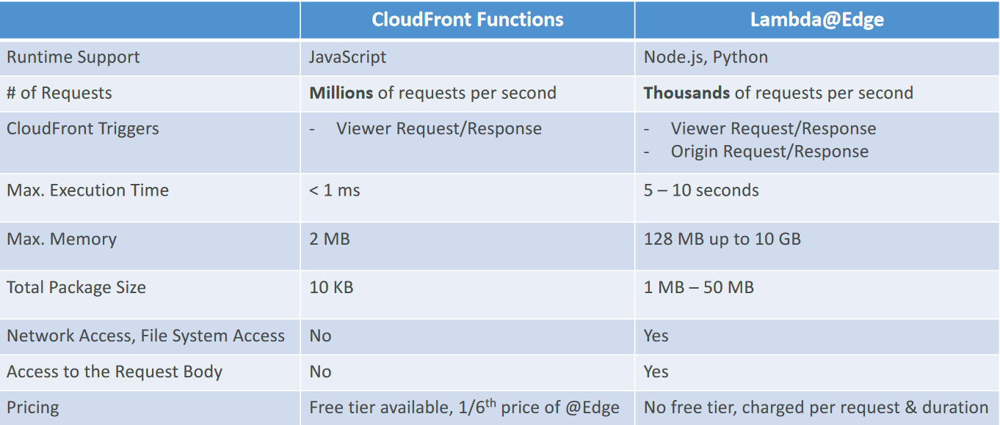

# CloudFront Functions vs. Lambda@Edge

# CloudFront Functions vs. Lambda@Edge - Use Cases
## CloudFront Functions
- Cache key normalization
    - Transform request attributes (headers,
    cookies, query strings, URL) to create an
    optimal Cache Key
- Header manipulation
    - Insert/modify/delete HTTP headers in the
    request or response
- URL rewrites or redirects
- Request authentication & authorization
    - Create and validate user-generated
    tokens (e.g., JWT) to allow/deny requests
##Lambda@Edge
- Longer execution time (several ms)
- Adjustable CPU or memory
- Your code depends on a 3rd
libraries (e.g., AWS SDK to access
other AWS services)
- Network access to use external
services for processing
- File system access or access to the
body of HTTP requests