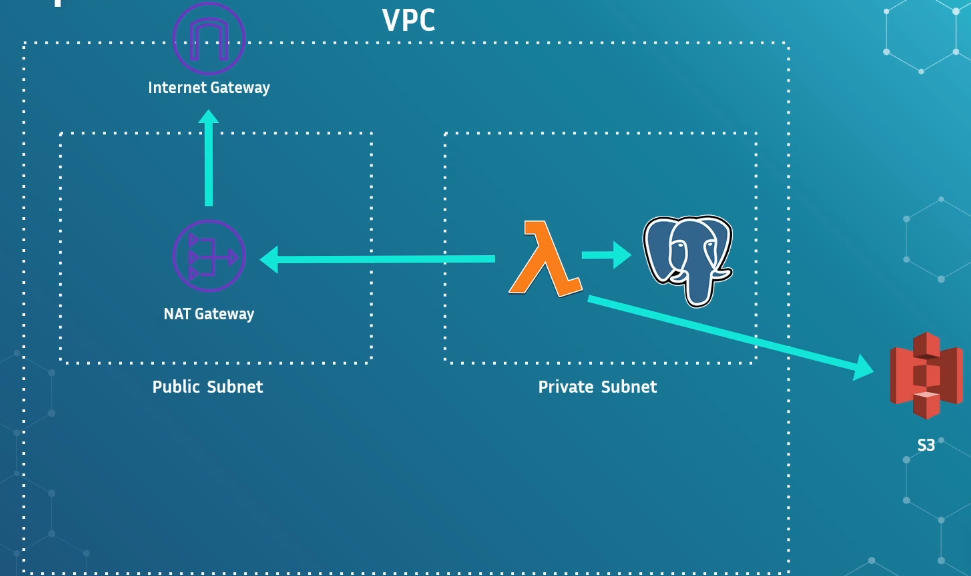

# Lambda AWS

- Lambda is a compute service
- run code at scale without worrying about servers
- Function is primary unit of lambda
- useful in many applications such as
    - api hosting
    - event processing
    - Ad-hoc or time based jobs

## Typical workflow

1. Create a function
2. Write and upload your code 
3. Run your function

## Why lambda is useful?

- No servers to manage
- Autoscaling
- Pay for what you use
- Performance
- Service integration
- Easy to use

with AWS lambda you gain flexibility at the expense of control

## Key concepts

#### **Trigger**
- means to invoke your funtion
- SDK, CLI, Console, Service Integration
- Can have many triggers
- Similar concept called Event Source Mapping
- Different triggers have diferent scaling / retry behaviour

#### Common Trigers/ event Soutrce Mapping

- Cloudwatch event for timer based jobs
- API gateway for REST APIs
- SNS or SQS for event processing
- DynamoDB Streams for record changes
- s3 for object Creation/updates

#### **Synchronous and Asynchronous Invocations**

- synchronous can have cost implications
- asynchronous can be more suitable for fault tolerant use causes
- Different failure behaviours

#### **Maximum duration and timeouts**

- Maximum 15 minutes before automatic timeout
- this means lambda are not suitable for long running processes
- Lambdas will automatically timeout when the configured limit is reached
- default is 3 second- configurable via console

- longer timeouts aren't always better
- background (asynchronous) processes are also terminated

#### **Memory**

- Defines the amount of memory available to your function at runtime
- Range between 128 MB and 10240 MB
- Changing memory is the most significant performance lever available to you
- Increasing memory determines instance type behind the scenes

- increasing memory settimgs can reducethe impact of cold start
- Can also help with networking connectivity speed
- Memory increase doesn't result in linear performance gain

#### **Pricing**

- Invocation Count: The number of times you invoke the function

- Memory: the amount of memory you provision

- Duration: How long your invocations run for

- Start with low memory settings

- Once you collect enough invocation history, use the compute optimizer tool

- 1 million free requests per month and 400000GB seconds

#### **The anatomy of a function execution**

**Strategies to minimize Cold start**

- Minimize number of library dependencies
- Only import what you need
- Raise memory configuration
- Utilize provisioned concurrency

#### **Concurrency and Throttling**

**Concurrency**
- Number of requests being served at a given moment
- New containers are spawned for each concurrent request
- concurrency is a major scaling consideration, and can cause applications to fail due to Throttling 
- Default 1000 units of concurrency per AWS account per Region
- Unreserved, reserved and provisioned

you need an alarm to concurrency

**Unreserved Concurrency**
- free for all among all functions in an aacount per region
- If one function consumes all concurrency, the other will get throttled
- Limit can be raised via AWS support Ticket 

**Reserved Concurrency**
- A portion is always reserved for a specific function, even if there are no invocations 
- You can use reserved concurrency to minimize or maximize your processing rate

**Provisioned Concurrency**
- Pool of concurrency that is 'always on'
- Solves the cold start problem, kinda
- Support autoscaling policies based on usage
- Very expensive (34$/ month for 5 units alway on)
- Blurs the line between serverless and metal

**PRO tips**

- Alarm on throttles for early inidcator of issues
- Evaluate your concurrency needs and plan accordingly
- Have your clients use exponential Backoff to avoid retry storms
- Raising your memory limit can help, but be careful
- Use small amount of provisioned concurrency to mitigate old starts for latency sensitive apps

**Throttling** rate exceeded
- Throttling when lambda rejects a request
- Ocurrs when in flight invocations exceeds available concurrency

## Configuration

### Versions

- Versions are snapshots of the code and settings of a function
- Code and settings get locked to a version on publish
- Allow you to have multiple 'versions' of a function at the same time - useful for quick rollbacks
- New uploads default to $LATEST version

### Aliases

- An alias is a named pointer to a specific Version
- Useful for 'beta' testing, or 'pre-prod' environments

### Version/Alias weights

- You can assign weights to different versions using a Version/Alias
- 90% of traffic to version 1, 10% to Version 2
- useful for version validation prior to full blown deployment

### Environment Varibles

- Pairs of string with a key and value
- Allow you to adjust function behavior without touching your code
- examples
    - stage
    - Clients_endpoint_url
    - Database_connection_string

### Virtual Private CLoud (VPC) Integration

- VPC es a isolated and private network within AWS
- Public and Private subnets
- Critical for security and apps with compliance guidelines

**VPC and Lambda**

- Only necessary when your function needs to access resources not accesible over public internet
- Example: RDS or elasticsearch in private subnet
- Behind the scenes, Lambda creates ENIs for each subnet the function is deployed into
- No longer contributes to cold start latency
- VPC endpoints can be used to comunicate with some AWS services privately

for conect lambda with S3 you can use VPC endpoint

## Monitoring Lambda

#### Key metrics to monitor

- Invocations
- Error count and succes rate
- Duration
- Throttles
- Iterator age
- Concurrent executions
- Unservered Concurrent execution

#### Logging and Metric filters

- Writing to stout automatically writes logs to cloudwatch
- log lines by default include metadata about the execution

**Metric Filters**

- Allow you to write patterns (think regex) to extract metrics from log lines
- Much cheaper than using PutMetric
- More suitable for high TPS aplication

