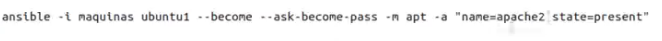
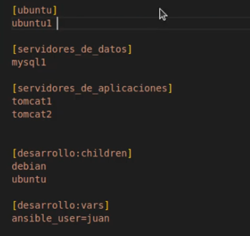

# Ansible

Ansible is a suite of software tools that enables infrastructure as code. It is open-source and the suite includes software provisioning, configuration management, and application deployment functionality

Ansible is agentless

## Ansible Inventory

/etc/ansible/hosts

Inventory parameters
- ansible_connection -ssh/winrm/localhost ssh para linux winrm para windows
- ansible_port - 22/5986
- ansible_user - root/administrator
- ansible_ssh_pass - Password

        # Sample Inventory File

        # Web Servers
        web1 ansible_host=server1.company.com ansible_connection=ssh ansible_user=root ansible_ssh_pass=Password123!
        web2 ansible_host=server2.company.com ansible_connection=ssh ansible_user=root ansible_ssh_pass=Password123!
        web3 ansible_host=server3.company.com ansible_connection=ssh ansible_user=root ansible_ssh_pass=Password123!

        # Database Servers
        db1 ansible_host=server4.company.com ansible_connection=winrm ansible_user=administrator ansible_password=Password123!


```
# Sample Inventory File

# Web Servers
web1 ansible_host=server1.company.com ansible_connection=ssh ansible_user=root ansible_ssh_pass=Password123!
web2 ansible_host=server2.company.com ansible_connection=ssh ansible_user=root ansible_ssh_pass=Password123!
web3 ansible_host=server3.company.com ansible_connection=ssh ansible_user=root ansible_ssh_pass=Password123!

# Database Servers
db1 ansible_host=server4.company.com ansible_connection=winrm ansible_user=administrator ansible_password=Password123!


[web_servers]
web1
web2
web3

[db_servers]
db1

[all_servers:children]
web_servers
db_servers

```

## Playbooks

Ansible Playbooks offer a repeatable, re-usable, simple configuration management and multi-machine deployment system, one that is well suited to deploying complex applications. If you need to execute a task with Ansible more than once, write a playbook and put it under source control. Then you can use the playbook to push out new configuration or confirm the configuration of remote systems.

Play defines a set of activities (tasks (an action to be performed on the host like execute command, run a script, install package, etc)) to be run on hosts

- plays have name, hosts and tasks
- properties of dictionary the order doesn't matter
- a list or array is an order collection and order matter


ansible-playbook <NAMEPLAYBOOK.yaml> -i inventory.txt

## Ansible Modules

- System
- Commands: execute commands
- Script: execute scripts
- files: work with files
- Database: work with database mongo, postgresql
- cloud:  aws., azurw, docker
- windows ansible in windows environment

```
-
    name: 'Stop the web services on web server nodes'
    hosts: web_nodes
    tasks:
        -
            name: 'Stop the web services on web server nodes'
            command: 'service httpd stop'
-
    name: 'Shutdown the database services on db server nodes'
    hosts: db_nodes
    tasks:
        -
            name: 'Shutdown the database services on db server nodes'
            command: 'service mysql stop'
-
    name: 'Restart all servers (web and db) at once'
    hosts: all_nodes
    tasks:
        -
            name: 'Restart all servers (web and db) at once'
            command: '/sbin/shutdown -r'
-
    name: 'Start the database services on db server nodes'
    hosts: db_nodes
    tasks:
        -
            name: 'Start the database services on db server nodes'
            command: 'service mysql start'
-
    name: 'Start the web services on web server nodes'
    hosts: web_nodes
    tasks:
        -
            name: 'Start the web services on web server nodes'
            command: 'service httpd start'


```

```
-
    name: 'Execute a script on all web server nodes'
    hosts: web_nodes
    tasks:
        -
            name: 'Execute a script on all web server nodes'
            script: /tmp/install_script.sh
        -
            name:  'Start httpd service'
            service: 'name=httpd state=started'


```

```
-
    name: 'Execute a script on all web server nodes and start httpd service'
    hosts: web_nodes
    tasks:
        -
            name: 'Update entry into /etc/resolv.conf'
            lineinfile:
                path: /etc/resolv.conf
                line: 'nameserver 10.1.250.10'
        - 
            user:
                uid: 1040
                group: developers
        -
            name: 'Execute a script'
            script: /tmp/install_script.sh
        -
            name: 'Start httpd service'
            service:
                name: httpd
                state: present


```

## Ansible Variables

- Stores information that varies with each host
```
-
    name: 'Update nameserver entry into resolv.conf file on localhost'
    hosts: localhost
    tasks:
        -
            name: 'Update nameserver entry into resolv.conf file'
            lineinfile:
                path: /etc/resolv.conf
                line: 'nameserver {{nameserver_ip}}'
```

```
-
    name: 'Update nameserver entry into resolv.conf file on localhost'
    hosts: localhost
    vars:
        car_model: 'BMWM3'
        country_name: 'USA'
        title: 'SystemsEngineer'
    tasks:
        -
            name: 'Print my car model'
            command: 'echo "My car''s model is {{car_model}}"'
        -
            name: 'Print my country'
            command: 'echo "I live in the {{country_name}}"'
        -
            name: 'Print my title'
            command: 'echo "I work as a {{title}}"'
```


## Conditionals

```
-
    name: 'Execute a script on all web server nodes'
    hosts: all_servers
    tasks:
        -
            service: 'name=mysql state=started'
            when: ansible_host =='server4.company.com'
```

```
-
    name: 'Am I an Adult or a Child?'
    hosts: localhost
    vars:
        age: 25
    tasks:
        -
            command: 'echo "I am a Child"'
            when: age<18
        -
            command: 'echo "I am an Adult"'
            when: age >= 18
```
```
-
    name: 'Add name server entry if not already entered'
    hosts: localhost
    tasks:
        -
            shell: 'cat /etc/resolv.conf'
            register: command_output
        -
            shell: 'echo "nameserver 10.0.250.10" >> /etc/resolv.conf'
            when: 'command_output.stdout.find("10.0.250.10") == -1'


```

## Loops

Ansible offers the **loop**, **with_\<lookup\>**, and **until** keywords to execute a task multiple times. Examples of commonly-used loops include changing ownership on several files and/or directories with the file module, creating multiple users with the user module, and repeating a polling step until a certain result is reached.
```
-
    name: 'Print list of fruits'
    hosts: localhost
    vars:
        fruits:
            - Apple
            - Banana
            - Grapes
            - Orange
    tasks:
        -
            command: 'echo "{{ item }}"'
            with_items: '{{ fruits }}'

```
```
-
    name: 'Install required packages'
    hosts: localhost
    vars:
        packages:
            - httpd
            - binutils
            - glibc
            - ksh
            - libaio
            - libXext
            - gcc
            - make
            - sysstat
            - unixODBC
            - mongodb
            - nodejs
            - grunt
    tasks:
        -
            yum: 'name={{ item }} state=present'
            with_items: "{{ packages}}"

```

## Ansible Roles

Roles let you automatically load related vars, files, tasks, handlers, and other Ansible artifacts based on a known file structure. After you group your content in roles, you can easily reuse them and share them with other users.

etc/ansible/roles is default location ansible search for roles

## Preparing windows

- Ansible control machine can only be a linux and not windows
- Windows machines can be targets of ansible and thus be part of automation
- Ansible connects to a windows machine using winrm
- Requirements
    - pywinrm module installed on the ansible control machine- pip install "pywinrm>=0.2.2"
    - setup WinRM- examples/scripts/configureRemotingFor Ansible.ps1
    - Diffetent modes of authentication:
        - Basic/Certificate/Kerberos/NTML/CredSSP

## Ansible Galaxy

Ansible Galaxy is essentially a large public repository of Ansible roles. Roles ship with READMEs detailing the role's use and available variables. Galaxy contains a large number of roles that are constantly evolving and increasing. Galaxy can use git to add other role sources, such as GitHub.

https://galaxy.ansible.com/ 

## Patterns

When you execute Ansible through an ad hoc command or by running a playbook, you must choose which managed nodes or groups you want to execute against. Patterns let you run commands and playbooks against specific hosts and/or groups in your inventory. An Ansible pattern can refer to a single host, an IP address, an inventory group, a set of groups, or all hosts in your inventory. Patterns are highly flexible - you can exclude or require subsets of hosts, use wildcards or regular expressions, and more. Ansible executes on all inventory hosts included in the pattern.

### Common patterns
This table lists common patterns for targeting inventory hosts and groups.

Description|Pattern(s)|Targets
|-|-|-|
All hosts|all (or *)|
One host	|host1
Multiple hosts	|host1:host2 (or host1,host2)
One group	|webservers
Multiple groups	|webservers:dbservers|all hosts in webservers plus all hosts in dbservers
Excluding groups	|webservers:!atlanta|all hosts in webservers except those in atlanta
Intersection of groups	|webservers:&staging|any hosts in webservers that are also in staging

You can use either a comma (,) or a colon (:) to separate a list of hosts. The comma is preferred when dealing with ranges and IPv6 addresses.

## Dynamic inventory

If your Ansible inventory fluctuates over time, with hosts spinning up and shutting down in response to business demands, the static inventory solutions described in How to build your inventory will not serve your needs. You may need to track hosts from multiple sources: cloud providers, LDAP, Cobbler, and/or enterprise CMDB systems.

Ansible integrates all of these options through a dynamic external inventory system. Ansible supports two ways to connect with external inventory: Inventory plugins and inventory scripts.

Inventory plugins take advantage of the most recent updates to the Ansible core code. We recommend plugins over scripts for dynamic inventory. You can write your own plugin to connect to additional dynamic inventory sources.

You can still use inventory scripts if you choose. When we implemented inventory plugins, we ensured backwards compatibility through the script inventory plugin. The examples below illustrate how to use inventory scripts.

If you prefer a GUI for handling dynamic inventory, the inventory database on AWX or Red Hat Ansible Automation Platform syncs with all your dynamic inventory sources, provides web and REST access to the results, and offers a graphical inventory editor. With a database record of all of your hosts, you can correlate past event history and see which hosts have had failures on their last playbook runs

## Custom modules

A module is a reusable, standalone script that Ansible runs on your behalf, either locally or remotely. Modules interact with your local machine, an API, or a remote system to perform specific tasks like changing a database password or spinning up a cloud instance. Each module can be used by the Ansible API, or by the ansible or ansible-playbook programs. A module provides a defined interface, accepts arguments, and returns information to Ansible by printing a JSON string to stdout before exiting.

https://docs.ansible.com/ansible/latest/dev_guide/developing_modules_general.html


_____

https://www.interviewbit.com/ansible-interview-questions/
__________

# Ansible advanced


____________________________

# Ansible desde Cero

**Crear maquinas con docker**
```
docker pull apasoft/debian11-ansible
docker pull apasoft/rocky9-ansible
docker pull apasoft/ubuntu22-ansible

```


```
172.18.0.2  debian1
172.18.0.3  debian2
172.18.0.5 rocky1
172.18.0.6 rocky2
172.18.0.8 ubuntu1
172.18.0.10 mysql1
172.18.0.12 tomcat1
172.18.0.13 tomcat2
```

## Configurar SSH usuario root

- primero generar un ssh key
    ```
    ssh-keygen
    ```
se genera una clave privada y una publica se comparte la .pub con los servidores a administrar

para copiar la clave publica a los servidores administrados

- crear directorio .ssh
```
 mkdir .ssh
```

- copiar la clave publica al servidor administrado

```
ssh-copy-id <serveradministrado>
```
aceptar fingerprint y luego dar el password del server administrado

y se copia la clave publica en la carpeta authorized_keys dentro de la carpeta .ssh

## Cofigurar usuario ansible

crear usuario ansible en el server administrado

```
- useradd ansible crear usuario ansible
- passwd ansible darle una password al usuario ansible
```

en /home/ansible aca debe estar la clave publica dle usuario ansible desde el servidor controlador

crear usuario ansible en el server controlador

```
- useradd ansible crear usuario ansible
- passwd ansible darle una password al usuario ansible
```

primero generar un ssh key
    ```
    ssh-keygen
    ```
se genera una clave privada y una publica se comparte la .pub con los servidores a administrar

opiar la clave publica al servidor administrado

```
ssh-copy-id <serveradministrado>
```

aceptar fingerprint y luego dar el password del server administrado

y se copia la clave publica en la carpeta authorized_keys dentro de la carpeta .ssh

## Dar permisos a usuario para hacer SUDO

con usuario root ingresar a /etc y editar el file sudoers en el server admnistrado


quitar el password cuando se vuelve sudo editaR SUDOERS y escribir NOPASSWD:ALL


Configure el acceso de sudo para el usuario recién creado:
```
cat << EOF >/etc/sudoers.d/USER_NAME
$USER_NAME ALL = (root) NOPASSWD:ALL
EOF
```
Sustituya USER_NAME por el nuevo nombre de usuario para el usuario Ansible .

Asigne los permisos de archivo correctos al archivo nuevo:

```
chmod 0440 /etc/sudoers.d/USER_NAME
```

Sustituya USER_NAME por el nuevo nombre de usuario para el usuario Ansible .

## Escalada privilegios

La escalada de privilegios en Ansible se refiere a la capacidad de ejecutar tareas o comandos con permisos elevados en sistemas remotos. Esto es particularmente relevante en entornos de gestión de infraestructura donde es necesario realizar acciones administrativas que requieren privilegios adicionales, como instalar paquetes, reiniciar servicios, modificar archivos de configuración, entre otros.

En Ansible, la escalada de privilegios se puede lograr de varias maneras:

**Uso de sudo**: sudo es un comando de Unix/Linux que permite a los usuarios ejecutar comandos con los privilegios de otro usuario, comúnmente el superusuario (root). Ansible puede aprovechar sudo para ejecutar tareas con privilegios elevados en los sistemas remotos.

**Uso de become**: Ansible proporciona un parámetro llamado become que permite especificar que una tarea debe ejecutarse con privilegios elevados. El parámetro become puede tomar diferentes formas, como **become: yes** para usar sudo de forma predeterminada o **become: true** para indicar que se requiere la escalada de privilegios sin necesariamente usar sudo.

Uso de **become_user**:** Además del parámetro become, Ansible proporciona become_user para especificar el usuario con el que se debe ejecutar la tarea con privilegios elevados. Esto es útil cuando se necesita ejecutar comandos como un usuario específico con privilegios de sudo.




## Ficheros de Configuracion

- Ansible tiene un fichero denominado "ansible.cfg" donde ponemos los valores por defecto de nuestro ansible
- En realidad esta formado por un conjunto de opciones y propiedades que ya tienen un valor predefinido y que yo necesito cambiar a través de este fichero
- Por tanto solo necesito modificar el fichero si quiero cambiar algún valor original

**Donde encontrar el fichero de config**

Este fichero se puede encontrar en los siguientes sitios:

 - ANSIBLE_CONFIG variable de entorno
 - Ansible.cfg en el directorio actual
 - ~/.ansible.cfg En el directorio home del usuario
 - /etc/ansible/ansible.cfg


Para crear un fichero config se puede usar este comnado
```
ansible-config init --disabled > ansible.cfg
```
o con todos los plugins
```
ansible-config init --disabled -t all > ansible.cfg
```


## Inventarios


se pueden usar varios formatos como ejemplo ini o YAML


## Validar inventario

```
ansible -i <inventoryfile> all --list-host
```

## PLAYBOOKS

- es una especie de plantilla qque nos permite ejecutar entornos complejos dentro de ansible sin necesidad de intervencion humana
- De esta forma se pueden automatizar multiples procesos de manera sencilla
- se utilizan ficheros YAML


```
---
- name: Primer play de el curso
  hosts: servidores_de_aplicaciones

  tasks:
  - name: Hacer un ping
    ansible.builtin.ping:
  - name: Crfear un fichero
    ansible.builtin.shell:
      touch /tmp/fichero1.txt

- name: Instalar Nginx
  hosts: debian

  tasks:
  - name: Parar Apache
    ansible.builtin.service:
      name : apache2 
      state: stopped
  - name: Instalar Nginx
    ansible.builtin.apt:
      name: nginx
      state: present
      update_cache: true
  - name: Arrancar  Nginx
    ansible.builtin.service:
      name: nginx
      state: started
  - name: copiar index.html
    ansible.builtin.copy:
      src: ./recursos/index.html
      dest: /var/www/html
      owner: root
      group: root
      mode: '0644'  
   

```

para ejecutar un playbook se usa

```
ansible-playbook <nameplaybook.yaml>
```

Incluir tareas es decir agregar fichero a una tarea

```
---
- name: Primer play de el curso
  hosts: servidores_de_aplicaciones

  tasks:
  - name: Hacer un ping
    ansible.builtin.ping:
  - name: Crfear un fichero
    ansible.builtin.shell:
      touch /tmp/fichero1.txt

- name: Instalar Nginx
  hosts: debian

  tasks:
  - name: Parar Apache
    include_tasks: parar_apache.yaml      
  
  - name: Instalar Nginx
    ansible.builtin.apt:
      name: nginx
      state: present
      update_cache: true
  
  - name: Arrancar  Nginx
    ansible.builtin.service:
      name: nginx
      state: started
  
  - name: copiar index.html
    ansible.builtin.copy:
      src: ./recursos/index.html
      dest: /var/www/html
      owner: root
      group: root
      mode: '0644'  
   
```
parar_apache.yaml

```
- name: Parar Apache Debian
  ansible.builtin.service:
      name : apache2 
      state: stopped
```

## Variables


### Variables en inventarios


### variables grupo





### Variables en ficheros externos

la variabels se pueden poner en ficheros externos y deben estar en la misma ruta de inventario y deben tener los siguientes nombres

directorio :host_vars y dentro la variable en extension .yaml


directorio :group_vars y dentro la variable en extension .yaml con el nombre del grupo


## Variables Fact

Ansible facts are data related to your remote systems, including operating systems, IP addresses, attached filesystems, and more

```
ansible <maquinacontorlada> -m setup -a 'filter=ansible_system'
```

```
ansible <maquinacontorlada> -m setup -a 'filter=ansible_system,ansible_os_family' 
```

## Variables Playbook

```
---
- name: Prueba con Variables
  hosts: debian1
  vars: 
    - mensaje: "Esto es otro  mensaje de Ansible"
    - curso: "dentro del curso de Ansible"

  tasks:
  - name: Ver variables
    debug:
      msg: "En este caso es : {{mensaje}}   {{curso}}"
...
```

listas y array en playbooks
```
---
- name: Prueba con Variables
  hosts: debian1
  vars: 
    - mensaje: "Esto es otro  mensaje de Ansible"
    - curso: "dentro del curso de Ansible"
    - entornos:
      - desasrollo
      - testing
      - produccion
    - responsables: ["Pepe", "juan"]


    
  tasks:
  - name: Ver variables
    debug:
      msg: "entornos disponible {{entornos}} {{entornos[1:3]}} {{responsables}}"

...

```

diccionarios en palaybooks

```
---
- name: Prueba con Variables
  hosts: debian1
  vars: 
    - mensaje: "Esto es otro  mensaje de Ansible"
    - curso: "dentro del curso de Ansible"
    - desarrollo:
       tipo: linux
       memoria: 4GB
       disco: 500GB

    
  tasks:
  - name: Ver variables
    debug:
      msg: "los ordenadores de desarrollo son: {{desarrollo}} y su memoria es {{desarrollo.memoria}}"

...
```

Varibales en task

```
---
- name: Prueba con Variables
  hosts: debian1
  vars:
    - v1: "varialbe global"
    
  tasks:
  - name: Variable local
    vars:
      v1: "prueba"
    debug:
      msg: "Este valor es local {{v1}}"

  - name: Variable local 2
    vars:
       v1: "adios"
    debug:
      msg: "Este valor es local {{v1}}"
  
  - name: Variable local 3
    debug:
      msg: "Este valor es local {{v1}}"
```
## variables de inventarios en playbooks

```
---
- name: Prueba con Variables del fichero de inventario
  hosts: debian1
  
  tasks:
  - name: Variable local
    vars:
      v1: "prueba"
    debug:
      msg: "Este valor es local {{v1}}"

  - name: Variable que viene del inventario
    debug:
      msg: "Este valor es local {{v2}}"
  
```
crear variable en inventario


## Variables ficheros externos

```
---
- name: Prueba con Variables deficheros externos
  hosts: debian1
  vars_files:
     - recursos/fichero1.yaml
     - recursos/fichero2.yaml
  tasks:
  - name: Variable primer fichero
    debug:
      msg: "Este valor es del primer fichero --> {{f1}}"

  - name: Variable del segundo fichero
    debug:
      msg: "Este valor es del segundo fichero --> {{f2}}"
```


## Variables desde linea de comando

```
---
- name: Prueba con Variables desde linea de comandos
  hosts: debian1
  
  tasks:
  - name: Variables de línea de comandos
    debug:
      msg: "En este caso es me has pasado el mensaje: {{mensaje}} "
```

se ejecuta con:
```
ansible-playbook  <nombreplaybook> --extra-vars "mensaje='esto es una prueba'"

```

## Variables FACT en playbook

```
---
- name: Prueba con Variables FACT
  hosts: debian1
  
  tasks:
  - name: Ver variables FACT
    debug:
      msg: "Arquitectura  {{ansible_facts.architecture}} {{ansible_facts['bios_vendor']}} {{ansible_facts['all_ipv4_addresses'][0]}} "

```
facts de diccionarios
```
---
- name: Prueba con Variables FACT
  hosts: servidores_de_aplicaciones
  
  tasks:
  - name: Ver variables FACT
    debug:
      msg: "Arquitectura  {{ansible_facts.architecture}} {{ansible_facts['bios_vendor']}} {{ansible_facts['all_ipv4_addresses'][0]}} "

  - name: Usar diccionarios FACT
    debug:
      var: ansible_facts.date_time.day

```

Desactivar la recopilación de FACTS
Hay veces que no queremos recopilar las variables FACTS, sobre todo si no las necesitamos y tenemos muchos entornos.

Para ello podemo susar la opción "gather_facts=no"
```
- hosts: all
  gather_facts: no
  tasks:
  - name: Instalar Apache
    yum:
      name: httpd
      state: present
```

## Variables registradas

```
---
- name: Prueba con Variables Registradas
  hosts: debian1

  tasks:
  - name: Capturar fecha
    shell:
     cmd: date
    register: fecha

  - name: Visualizar fecha
    ansible.builtin.debug:
      var: fecha
  
  - name: Visualizar fecha
    ansible.builtin.debug:
      msg: "{{fecha.stdout}}"

```
## Otros modulos

### modulo file
- permite trabajar con ficheros, directorios, enlaces, etc
- pertenece a la coleccion ansible.builtin y por tanto forma parte del core de ansible

```
---
- name: Trabajar con ficheros
  hosts: debian
      
  tasks:
  - name: Crear un fichero vacío
    file:
      path: "/tmp/prueba.txt"
      state: "touch"

  - name: Borrar el fichero anterior
    file: 
      path: "/tmp/prueba.txt"
      state: "absent"
...

```

```
---
- name: Trabajar con ficheros
  hosts: debian
  vars:
    - fichero: /tmp/prueba1.txt
      
  tasks:
  - name: Crear un fichero vacío
    file:
      path: "{{fichero}}"
      state: "touch"

  - name: cambiar persmisos y propietario
    file: 
      path: "{{fichero}}"
      owner: ansible
      group: ansible
      mode: '0777'
```

```
---
- name: Trabajar con ficheros
  hosts: debian
  vars:
    - fichero: /tmp/prueba1.txt
      
  tasks:
  - name: Crear un fichero vacío
    file:
      path: "{{fichero}}"
      state: "touch"

  - name: cambiar permisos y propietario
    file: 
      path: "{{fichero}}"
      owner: ansible
      group: ansible
      mode: '0777'


- name: Trabajar con directorios
  hosts: rocky
  vars:
    directorio: /tmp/dir1

  tasks:
  - name: Crear directorio
    file:
      path: "{{directorio}}"
      state: directory
      mode: '0755'
  - name: Crear fichero
    file:
      path: "{{directorio}}/p1.txt"
      state: touch
  - name: Borrar directorio
    file:  
      path: "{{directorio}}"
      state: "absent"
...

```

### modulo usuarios y grupos

```
---
- name: Trabajar con usuarios
  hosts: debian
      
  tasks:
  - name: Crear un usuario simple
    user:
      name: usu1

  - name: Crear un grupo
    group:
      name: grupo1
      state: present

  - name: Crear un usuario del grupo grupo1
    user:
      name: usu2
      group: grupo1
      shell: /bin/bash
      home: /home/usuario1
```

### Instalar tomcat
```
---
# 1- Crear usuario y grupo
# 2- Instalar JAVA
# 3- Crear directorio para Tomcat
# 4- Descargar y decomprimir el software
# 5- Asociar el usurio y el grupo
# 6- Crear un fichero para el arranque con SYSTEMD
# 7- Arrancar el servicio

- name: Intalar Tomcat 10
  hosts: servidores_de_aplicaciones
  vars:
    url_descarga: https://dlcdn.apache.org/tomcat/tomcat-10/v10.1.7/bin/apache-tomcat-10.1.7.tar.gz
    
  tasks:
     
    - name: Crear usuario
      user:
        name: tomcat
 
    - name: Crear grupo
      group:
        name: tomcat
 
    - name: Instalar JAVA
      apt:
        name: default-jdk
        state: present
  
    - name: Crea un directorio para guardar TOMCAT
      file:
        path: /opt/tomcat
        owner: tomcat
        group: tomcat
        mode: 755
        recurse: yes
 
    - name: descargamos y descomprimimos 
      unarchive:
        src: "{{url_descarga}}"
        dest: /opt/tomcat
        remote_src: yes
        extra_opts: [--strip-components=1]
 
    - name: Cambiar el propietario del directorio de Tomcat
      file:
        path: /opt/tomcat
        owner: tomcat
        group: tomcat
        mode: "u+rwx,g+rx,o=rx"
        recurse: yes
        state: directory

      
    - name: Cambiar el propietario del directorio de Tomcat
      file:
        path: /opt/tomcat
        owner: tomcat
        group: tomcat
    
    - name: Crear uin fichero de servicio
      copy: 
        content: |-
          [Unit]
          Description=Mi Servicio de TOMCAT
          Requires=network.target
          After=network.target
          
          [Service]
          Type=forking
          User=tomcat
          Environment="CATALINA_PID=/opt/tomcat/logs/tomcat.pid"
          Environment="CATALINA_BASE=/opt/tomcat"
          Environment="CATALINA_HOME=/opt/tomcat"
          Environment="CATALINA_OPTS=-Xms512M -Xmx1024M -server -XX:+UseParallelGC"
          ExecStart=/opt/tomcat/bin/startup.sh
          ExecStop=/opt/tomcat/bin/shutdown.sh
          Restart=on-abnormal
          
          [Install]
          WantedBy=multi-user.target
        dest: /etc/systemd/system/tomcat.service

    - name: Arrancar Tomcat
      service:
        name: tomcat
        state: started
```

## Desplegar WAr en tomcat

```
--
# 1- Crear usuario y grupo
# 2- Instalar JAVA
# 3- Crear directorio para Tomcat
# 4- Descargar y decomprimir el software
# 5- Asociar el usurio y el grupo
# 6- Crear un fichero para el arranque con SYSTEMD
# 7- Arrancar el servicio

- name: Intalar Tomcat 10
  hosts: servidores_de_aplicaciones
  vars:
    url_descarga: https://dlcdn.apache.org/tomcat/tomcat-10/v10.1.7/bin/apache-tomcat-10.1.7.tar.gz
    
  tasks:
     
    - name: Crear usuario
      user:
        name: tomcat
 
    - name: Crear grupo
      group:
        name: tomcat
 
    - name: Instalar JAVA
      apt:
        name: default-jdk
        state: present
  
    - name: Crea un directorio para guardar TOMCAT
      file:
        path: /opt/tomcat
        owner: tomcat
        group: tomcat
        mode: 755
        recurse: yes
 
    - name: descargamos y descomprimimos 
      unarchive:
        src: "{{url_descarga}}"
        dest: /opt/tomcat
        remote_src: yes
        extra_opts: [--strip-components=1]
 
    - name: Cambiar el propietario del directorio de Tomcat
      file:
        path: /opt/tomcat
        owner: tomcat
        group: tomcat
        mode: "u+rwx,g+rx,o=rx"
        recurse: yes
        state: directory

    - name: copiar el WAR de la aplicación
      copy:
        src: ejemplo.war 
        dest: /opt/tomcat/webapps
    
    - name: Cambiar el propietario del WAR
      file:
        path: /opt/tomcat/webapps/ejemplo.war
        owner: tomcat
        group: tomcat
    
    - name: Crear un fichero de servicio
      copy: 
        content: |-
          [Unit]
          Description=Mi Servicio de TOMCAT
          Requires=network.target
          After=network.target
          
          [Service]
          Type=forking
          User=tomcat
          Environment="CATALINA_PID=/opt/tomcat/logs/tomcat.pid"
          Environment="CATALINA_BASE=/opt/tomcat"
          Environment="CATALINA_HOME=/opt/tomcat"
          Environment="CATALINA_OPTS=-Xms512M -Xmx1024M -server -XX:+UseParallelGC"
          ExecStart=/opt/tomcat/bin/startup.sh
          ExecStop=/opt/tomcat/bin/shutdown.sh
          Restart=on-abnormal
          
          [Install]
          WantedBy=multi-user.target
        dest: /etc/systemd/system/tomcat.service

    - name: Arrancar Tomcat
      service:
        name: tomcat
        state: started
        
```

### modulo lineinfile

sirve para cambair un file

```
---
- name: Trabajar con lineinfile
  hosts: ubuntu1
      
  tasks:
  - name: Copiar un fichero sencillo de ejemplo
    copy:
      src: ejemplo.txt
      dest: /tmp/ejemplo.txt

  - name: Añadir un línea al fichero
    ansible.builtin.lineinfile:
      path: /tmp/ejemplo.txt
      line: linea 4

  - name: Cambiar la línea1
    ansible.builtin.lineinfile:
      path: /tmp/ejemplo.txt
      search_string: linea 1
      line: He cambiado la linea 1

  - name: Borrar la línea 2
    ansible.builtin.lineinfile:
      path: /tmp/ejemplo.txt
      search_string: linea 2
      state: absent

  - name: Reemplazar la linea 4
    ansible.builtin.lineinfile:
      path: /tmp/ejemplo.txt
      regexp: '^linea 4'
      line: "Cambiado con REGEX"
```

### Modulo SET_FACT

este modulo permite crear variables de forma dinamica

```
---
- name: Probar con set_fact
  hosts: debian1
  
  tasks:
  - name: Crear una variable
    ansible.builtin.set_fact:
      fichero: ejemplo.txt

  - name: Usar la variable en un módulo
    ansible.builtin.file:
      path: /tmp/{{fichero}}
      state: touch

  - name: Crear una variable con una expresion
    ansible.builtin.set_fact:
      nombre: "{{ansible_facts['hostname'] | upper }}"

  - name: Visualizar la variable
    ansible.builtin.debug:
      msg: El nombre de la maquina en mayusculas es {{nombre}}
```

### Instalar LAMP

```
---
- name: Playbook para instalar la pila LAMP
  hosts: debian1
  become: yes

  tasks:

    - name: Actualizar los repositorios
      apt:
        update_cache: yes

    - name: Instalar el servidor web Apache
      apt:
        name: apache2
        state: present

    - name: Instalar el sistema gestor de bases de datos MariaDB
      apt:
        name: mariadb-server
        state: present

    - name: Instalar PHP y los módulos necesarios
      apt:
        name:
          - php
          - php-mysql
          - libapache2-mod-php
        state: present

    - name: Reiniciar el servidor web Apache
      service:
        name: apache2
        state: restarted

    - name: Copiar el archivo phpinfo.php
      copy:
        src: phpinfo.php
        dest: /var/www/html/
        mode: 0755
```

## Ansible con windows


requisitos maquinas windows


### configurar un host de windows

https://docs.ansible.com/ansible/latest/os_guide/windows_setup.html

abrir windows powershell en modo administrador

### inventario windows

```
[windows]
192.168.27.130
192.168.27.129

[windows:vars]
ansible_user=vagrant
ansible_password="vagrant"
ansible_port=5986
ansible_connection=winrm
ansible_winrm_server_cert_validation=ignore
```

### comandos en windows


### instalar ejecutable

```
---
- name: Trabajar con windows. Instalar un paquete
  hosts: 
      - 192.168.27.129
  
  tasks:

  - name: Descargar GIT
    ansible.windows.win_get_url:
      url: https://github.com/git-for-windows/git/releases/download/v2.40.0.windows.1/Git-2.40.0-64-bit.exe
      dest: c:\prueba\git.exe


  - name: Instalar  GIT
    ansible.windows.win_package:
      path: c:\prueba\git.exe
      state: present
      arguments: 
        - /VERYSILENT
        - /NORESTART
```
### servicios windows

```
---
- name: Trabajar con windows. Prar servicio
  hosts: 
      - 192.168.27.129
  
  tasks:

  - name: Parar servicio de Audio
    ansible.windows.win_service:
      name: Audiosrv
      state: stopped
  
  - name: Arrancar servicio de Audio
    ansible.windows.win_service:
      name: Audiosrv
      state: started
```
### Desinstalar ejecutables

```
---
- name: Trabajar con windows. Desinstalar software
  hosts: 
      - 192.168.27.129
  
  tasks:

  - name: Desisntalar GIT 
    ansible.windows.win_package:
     path: C:\Program Files\Git\unins000.exe
     state: absent
     arguments: 
         - /VERYSILENT
         - /NORESTART
```

### Facts en Windows

```
---
- name: Trabajar con windows. Variables FACT
  hosts:
      - 192.168.27.129
  
  tasks:

  - name: Distribución
    debug:
      var:  ansible_facts['distribution']
  
  - name: Memoeira libre
    debug:
      var:  ansible_facts['memfree_mb']

```

## Control de flujo

### When

```
# WHEN  Condicional básico de Ansible
# Se trata de una expresión Jinja2
# No se utilizan doble llaves
# Se evalua para todos los hosts


# Los operadores son los habituales: < > >= <= !=  
# La comparación es con ==
# "is defined"  permite saber si una variable existe
# "not" permite usar la negación
# para buscar en un array se puede usar el operador "in"

---
- name: Prueba con WHEN. visualizar la fecha en los debian
  hosts: all

  tasks:
  - name: Capturar fecha
    shell:
     cmd: date
    register: fecha
    when: ansible_distribution=='Debian'

  - name: Visualizar fecha
    ansible.builtin.debug:
      msg: "{{fecha.stdout}}"
    when: ansible_distribution=='Debian'

```

```
---
- name: Prueba con WHEN. visualizar la fecha en los debian
  hosts: all

  tasks:
  - name: Capturar fecha
    shell:
     cmd: date
    register: fecha
    when: ansible_distribution=='Debian' or ansible_facts['distribution']=='Rocky'

  - name: Visualizar fecha
    ansible.builtin.debug:
      msg: "{{fecha.stdout}}"
    when: ansible_distribution=='Debian' or ansible_facts['distribution']=='Rocky'
```

```
---
- name: Prueba con WHEN. Uso con Variables
  hosts: debian1
  vars:
      ejecutar: True

  tasks:
  - name: Instalar GIT
    ansible.builtin.apt:
     name: git
     state: present
    when:  not ejecutar

```

```
---
- name: Prueba con WHEN. Crear un fichero en un directorio si está vacio
  hosts: debian1

  tasks:
  - name: Ver si el directorio está vacio
    ansible.builtin.command:
     cmd: ls /tmp/dir1     
    register: resultado
    

  - name: Crear el fichero si no existe nada en el directorio
    ansible.builtin.file:
      path: /tmp/dir1/f1.txt
      state: touch
    when: resultado.stdout==""
```

instalar php version antigua para UBUNTU

```
---
- name: Prueba con WHEN. Instalar PHP antiguo
  hosts: ubuntu1

  tasks:

  - name: instalar gpg
    ansible.builtin.apt:
      name: gpg
        
  - name: Actualizar repositorio de php
    ansible.builtin.shell:
      cmd: add-apt-repository ppa:ondrej/php  -y

  - name: Actualizar cache apt
    ansible.builtin.apt:
      update_cache: true
      force_apt_get: true
  
  - name: Instalar version antigua de PHP
    ansible.builtin.apt:
      name: php7.4


```

Actualizar PHP

```
---
- name: Prueba con WHEN. Actualizar PHP si es menor de 8.1
  hosts: ubuntu1

  tasks:

  - name: Comprobar versión de PHP
    ansible.builtin.shell:
      cmd: php -v | php --version | head -n 1 | cut -c 5-10
    register: resultado
    
  - name: Visualizar resultado. Solo como ejemplo
    ansible.builtin.debug:
      msg: "{{resultado.stdout}}"
    when: resultado.stdout != "8.1.17"
    
  - name: Actualizar PHP
    ansible.builtin.apt:
      name: php8.1
    when: resultado.stdout != "8.1.17"
```

## Ignorar Errores

sirve para ignorar errores en pasos que no son criticos

```
---
- name: Prueba con WHEN. Ignorar errores
  hosts: debian1

  tasks:
  - name: acceder a un firectorio incorrecto
    ansible.builtin.command:
     cmd: ls /temporal
    register: resultado
    ignore_errors: true
  
  - name: Visualizar Resultado
    ansible.builtin.debug:
      msg: "{{resultado.stderr}}"
    when: resultado.stderr !=""
```

## Ignorar servidores parados

ignore_unreachable se puede usar a nivel de play o task

```
---
- name: Control de errores
  hosts: debian
  

  tasks:
  - name: Visualizar un mensaje
    ansible.builtin.debug:
      msg: Mensaje del servidor    

  - name: Visualizar directorio principal
    ansible.builtin.command:
      cmd: ls -l /
    ignore_unreachable: true
```

## Failed_when


```
---
- name: Control de errores. Failed When
  hosts: debian1
  
  tasks: 
  - name: Localizar directorio temporal
    ansible.builtin.command:
      cmd: ls -l /temporal
    register: salida
    failed_when: salida.rc==0

  - name: visualizar salida
    ansible.builtin.debug:
      var: salida
```

## Activar log y opcion depuracion

se puede crear en el ansible.cfg  crear un logh_path= directoriodelog


o la otra es usar la variable de entorno $ANSIBLE_LOG_PATH


ansible-playbook prueba.yaml -v

## Bucles


```
####  BUCLES
### Disponemos de varios BUCLES
#
#  - loop  Desde la versión 2.5 es el recomendado
#  - whit_<lookup>   whit_items, whit_list,  with_sequence ......
#  - until

---
- name: Prueba básica con LOOP
  hosts: debian1

  tasks:
  - name: Visualizar contenido con loop
    ansible.builtin.debug:
      msg: "{{item}}"    
    loop:
       - valor1
       - valor2
       - valor3

  - name: Visualizar contenido con with_items
    ansible.builtin.debug:
      msg: "{{item}}"    
    with_items:
       - valor1
       - valor2
       - valor3
```


```
---
- name: Prueba básica con LOOP
  hosts: debian1

  tasks:
  - name: Crear varios grupos en el Sistema Operativo
    ansible.builtin.group:
     name: "{{item}}"
     state: present
    loop:
       - grupo1
       - grupo2
       - grupo3

  - name: Crear varios grupos en el Sistema Operativo
    vars:
      grupos:
        - grupo4
        - grupo5
        - grupo6
    ansible.builtin.group:
     name: "{{item}}"
     state: present
    loop: "{{grupos}}"
```

### Bucles creando usuarios
list_usu.yaml
```
usuarios:
  - usu1
  - usu2
  - usu 3

```

```
---
- name: Crear usuarios con bucles
  hosts: debian1
  vars_files: list_usu.yaml
  tasks:
  - name: Crear varios usuarios en el Sistema Operativo con un fichero externo
    
    ansible.builtin.user:
     name: "{{item}}"
     state: present
    loop: "{{usuarios}}"
```

### Bucles con diccionarios
 loop requieres que sea lista por ello es necesario usar un filtro dict2items

```
---
- name: Otras pruebas con LOOP
  hosts: debian1

  tasks:
  - name: Diccionarios
    vars:
         entorno:
           nombre: desarrollo
           responsable: Pedro
           personas: 10
    ansible.builtin.debug:
      msg: "{{item.key}} {{item.value}}"    
    loop:  "{{entorno | dict2items}}"
          
  - name: Diccionarios with_item
    vars:
        entorno:
           nombre: desarrollo
           responsable: Pedro
           personas: 10}
    ansible.builtin.debug:
      msg: "{{item.key}}  -- {{item.value}}"
    with_dict: "{{entorno}}"
```
### Bucles con inventario

```
--
- name: Otras pruebas con LOOP
  hosts: debian1

  tasks:
  - name: Ver las máquinas del inventario
    ansible.builtin.debug:
      msg: "{{ item }}"
    loop: "{{ groups['all'] }}" 
    register: resultado

  - name: Copiar el resultado en mi debian1
    ansible.builtin.copy:
      content: "{{resultado}}"
      dest: /tmp/resultado.txt

  - name: recuperar fichero
    ansible.builtin.fetch:
      src: /tmp/resultado.txt
      dest: /tmp/resultado.txt
      flat: true

```

### Indices con loops

loop_control permite usar el index_var para saber la posicion de un elemento

```
---
- name: Bucle con indice
  hosts: debian1

  tasks:
  - name: Índices
    ansible.builtin.debug:
      msg: "{{item}} esta en la posicion {{indice}}"    
    loop:  
       - pepe
       - juan
       - antonio
    loop_control: 
      index_var: indice
    when: indice == 1
```

### Bucle until

delay en segundos, hacer 5 reintentos y cada reintento cada 2 segundos

```
---
- name: Until
  hosts: debian1

  tasks:
  
  - name: Repite una tarea has que se cumple la condición
    ansible.builtin.shell: 
      cmd: cat /tmp/tarea1
    register: result
    until: result.stdout=="Fin de Proceso"
    retries: 5
    delay: 2
```

### ejemplo

```
software_debian:
    - apache2
    - nginx
    - git
```

```
software_rocky:
    - httpd
    - nginx
    - git
```
```
---
- name: Instalar software 
  hosts: all
  vars_files:
     - software_rocky.yaml
     - software_debian.yaml

  tasks:
  - name: Instalar debian
    ansible.builtin.apt:
      name: "{{item}}"
      state: present
    loop: "{{software_debian}}"
    when: ansible_distribution=='Debian' 
  
  
  - name: Instalar rocky
    ansible.builtin.yum:
      name: "{{item}}"
      state: present
    loop: "{{software_rocky}}"
    when: ansible_distribution=='Rocky'
       
```

## Handlers

```
###   HANDLERS  ####
## 
## se utiliza para invocar una determinada tarea 
## Se usa el comando notify
## Se ejecutan despues de todas las tareas del PLAY
## No pueden repetirse nombres en el playbook, ya que son globales
## Solo se ejecutan una vez, aunque haya 2 tareas que los invoquen
## se pueden notificar mas de una accion

---
- name: Ejemplo con un handler
  hosts: debian1
  
  tasks:
  - name: Copiar index1.html a /var/www/html
    ansible.builtin.copy:
      src: index1.html
      dest: /var/www/html
    notify: 
      - rebotar_apache

  handlers:
  - name: rebotar_apache
    ansible.builtin.service:
        name: apache2
        state: restarted
       
```

### Practica

script.ssh
```
#!/bin/bash
## Borrar el resultado del backup anterior
rm /tmp/backup.terminado
rm /tmp/copia.tar

### Hacer el backup 
tar cvf /tmp/copia.tar /usr/*

### Indicar que ha terminado
echo "Fin de Backup" >/tmp/backup.terminado
```

```
###   PRACTICA  ####
## 
## Vamos hacer un backup del directorio /usr del destino y traer la copia a la máquina de control
## Tenemos un script llamado backup.sh que hay que copiar al destino y que hace la copia
## Una vez terminada se genera un fichero llamado "backup.terminado" con  el contenido "Fin de Backup"  
## Mientras se hace la copia, con un bucle until esperamos a que se genere el fichero con ese texto
## Cuando se genera, lanzamos un handler para copiar el backup del destino a la maquina de control

---
- name: Ejemplo con un handler
  hosts: debian1
  
  tasks:

  - name: Copiar el programa de backup al destino
    ansible.builtin.copy:
      src: backup.sh
      dest: /tmp/backup.sh
      mode: '0744'
  
  - name: Lanzar el programa de backup en modo background
    ansible.builtin.shell: nohup /tmp/backup.sh </dev/null >/dev/null 2>&1 &      
    
  - name: Esperar a que termine
    shell:
         cmd: cat /tmp/backup.terminado
    register: result
    until: result.stdout=="Fin de Backup"     
    retries: 5
    delay: 10
    notify: 
      - guardar_backup

  handlers:
  
  # Traer Backup a la maquina de control
  - name: guardar_backup
    ansible.builtin.fetch:
        src: /tmp/copia.tar 
        dest: /tmp/copia.tar 
        flat: true

```

### Bloques

Es una agrupacion logica de tareas

```
###   BLOQUES  ####
## 
## Permiten la agrupación de tareas

---
- name: Ejemplo de bloques
  hosts: all
  
  tasks:
  #### PRIMER BLOQUE
  - name: Instalar y arrancar  MariaDB en Debian
    block:
      - name: Instalar MariaDB
        ansible.builtin.apt: 
          name: mariadb-server
          state: present
       
      - name: arrancar MariaDB
        ansible.builtin.service:
          name: mariadb
          state: started
    when: ansible_facts['distribution'] | lower =='debian'     
    ignore_errors: true
  
  #### SEGUNDO BLOQUE
  - name: Instalar y arrancar  MySQL en Rocky Linux
    block:
      - name: Instalar mysql
        ansible.builtin.yum: 
          name: mysql-server
          state: present
       
      - name: arrancar Mysql
        ansible.builtin.service:
          name: mysqld
          state: started
    when: ansible_facts['distribution'] | lower =='rocky'     
    ignore_errors: true
```

### Control de errores bloques

se tienen dos clausuals 

RESCUE: tareas a ejecutar cuando falla el bloque

ALWAYS: se ejecuta la tarea independientemente de la salida del bloque

```
---
- name: ejemplo de control bloques
  hosts: debian1

  tasks:
  ### primer bloque
  - name: ejemplo control
    block:
      - name: programa que falla
        ansible.builtin.shell:
          cmd: ls /tmp/no_existe.txt

      - name: esto no llega a pintarse    
        ansible.builtin.debug:
          msg: "he terminado"

### RESCUE
    rescue:
    - name: Visualizar ignore_error  
      ansible.builtin.debug:
        msg: "se ha producido un error"     
### ALWAYS
    always:
      - name: siempre visualizo el mensaje
        ansible.builtin.debug:
        msg: "siempre me pinto"              

```

## FILTROS

Filters let you transform JSON data into YAML data, split a URL to extract the hostname, get the SHA1 hash of a string, add or multiply integers, and much more. You can use the Ansible-specific filters documented here to manipulate your data, or use any of the standard filters shipped with Jinja2 - see the list of built-in filters in the official Jinja2 template documentation. You can also use Python methods to transform data. You can create custom Ansible filters as plugins, though we generally welcome new filters into the ansible-core repo so everyone can use them.

### Tipo de datos de una variable

con type_debug nos muestra el tipo de una variable

```
###   FILTROS  ####
## 
## Permiten realizar distintas operaciones como pueden ser
##      - conversion
##      - transformacion
##      - extracciones
##      - manipular datos
##      - etc...
##
##  NOTA: los filtros se ejecutan en el Controller no en la máquina remota
## Se usa el símbolo | (pipe-tuberia) para indicarlos

---
- name: Ejemplos varios de filtros
  hosts: debian1
  vars:
       cadena: "hola"
       numero: 10
       verdad: true
       lista:
          - pepe
          - juan
          - antonio
       lista1: ['pepe','juan','antonio']  
       diccionario:
           nombre: juan
           edad: 27  
 
  tasks:
  - name: Averiguar el tipo de una variable
    ansible.builtin.debug:
      var: diccionario | type_debug
    
       
```

### Conversiones


```
---
- name: Ejemplos varios de filtros
  hosts: all
  vars:
       cadena: "true"
       numero: 10
       verdad: true
       lista:
          - pepe
          - juan
          - antonio
       lista1: ['pepe','juan','antonio']  
       diccionario:
           nombre: juan
           edad: 27  
 
  tasks:
  
  - name: Convertir a cadena
    ansible.builtin.debug:
      var: numero 

  - name: Convertir a cadena
    ansible.builtin.debug:
      var: numero | string 

  - name: Convertir a entero
    ansible.builtin.debug:
      var: cadena | int

  - name: Convertir a entero
    ansible.builtin.debug:
      var: cadena | bool

  - name: visualizar version
    ansible.builtin.debug:
      msg: "{{ansible_facts['distribution_version']}}"
    when: ansible_distribution_version | int > 10

```

### Cadenas

```
####  EJEMPLOS CON CADENAS
---
- name: Ejemplos varios de filtros con CADENAS
  hosts: debian1
  vars:
       cadena: "Esto es una cadena"
       
  tasks:
  
  - name: Mayusculas
    ansible.builtin.debug:
      var: cadena | upper  

  - name: Minusculas
    ansible.builtin.debug:
      var: cadena  | lower

  - name: Reemplazar
    ansible.builtin.debug:
      var: cadena | replace("e","*")

  - name: Longitud de cadena
    ansible.builtin.debug:
      var: cadena | length
```

### Numeros

```
####  EJEMPLOS CON NUMEROS
---
- name: Ejemplos varios de filtros con NUMEROS
  hosts: debian1
  vars:
       numero: 10.40
       
  tasks:
  
  - name: Potencia
    ansible.builtin.debug:
      var: numero | pow(4)
  
  - name: Raiz cuadrada
    ansible.builtin.debug:
      var: numero  | root()
  
  - name: Redondear
    ansible.builtin.debug:
      var: numero  | round()

  - name: Numero aleatorio
    ansible.builtin.debug:
      var: numero  | int | random
```

### Listas

```
####  EJEMPLOS CON LISTAS
---
- name: Ejemplos varios de filtros con LISTAS
  hosts: debian1
  vars:
       lista_numero:
         - 2
         - 10
         - 9
         - 1
       lista_cadena:
         - Pedro
         - Juan
         - Rosa
         - Antonio
       cadena: "Esto es una cadena"
  tasks:
  
  - name: Valor menor numero
    ansible.builtin.debug:
      msg: "{{lista_numero | min }} --- {{lista_numero | max }} "
  
  - name: Valor menor  cadena
    ansible.builtin.debug:
      msg: "{{lista_cadena | min }} --- {{lista_cadena | max }}" 

  - name: Unir elementos de una lista
    ansible.builtin.debug:
      msg: "{{lista_cadena | join(',')}}" 

  - name: Convertir cadena en lista
    ansible.builtin.debug:
      msg: "{{cadena | split()}}" 
```

## Roles

- Los roles contienen variables, archivos, tareas, controladores y otros artefactos de Ansible .
- Pueden ser reutilizarlos fácilmente y compartidos con otros usuarios y proyectos. 
- Permiten dividir el trabajo en distintos archivos, de forma que es más fácil su uso y reutilización
- Es lo que podemos llamar una especie de librería

Disponen de una estructura de archivos conocida.
Tiene 8 directorios principales 


### ¿Dónde podemos incluir los Roles?

- Plays. Se usa la claúsula “roles”
Es un import de tipo estático
Se cargan y ejecutan antes que el resto de tareas

```
---
- hosts: desarrollo
  roles:
    - entorno
    - software

```

- Tasks de forma dinámica con include_role
Esto permite ejecutarlos en el orden y lugar donde han sido definidos 

```
- name: ejemplo en un task
      include_role:
        name: limpieza_entorno

```

- Tasks de forma estática con import_role
Se comportan igual que los definidos a nivel del play

```
- name: ejemplo en un task
      import_role:
        name: role1

```

Podemos crear una estructura de rol con el siguiente comando
```
ansible-galaxy  init  nombre_de_role
```

### Crear un rol

en un rol solo se pueden poner tareas no playbooks

 crea la estructura para el rol
```
ansible-galaxy  init  nombre_de_role
```

task role Maria DB

```
---
# tasks file for mariadb
- name: Instalar MariaDB
  ansible.builtin.apt: 
     name: mariadb-server
     state: present
  when: ansible_facts['distribution'] | lower =='debian' 

- name: arrancar MariaDB
  ansible.builtin.service:
          name: mariadb
          state: started
  when: ansible_facts['distribution'] | lower =='debian' 
```

playbook usando role

```
--
- name: Ejemplos de un role
  hosts: debian1
  roles:
     - mariadb
  
  tasks:
  
  - name: Ultima tarea
    ansible.builtin.debug:
      msg: "Primero se ejecutan las tareas del role"
```

### Variables en roles

La precedencia en la varibels en un rol son:

1. en el default role
2. en group_var
3. en hosts_var
4. en plays
5. en vars del role
6. desde linea de comandos

default var del rol

```
---
# default file for mariadb
software: mariadb-server
servicio: mariadb

```

task role

```
---
# tasks file for mariadb
- name: Instalar {{software}}
  ansible.builtin.apt: 
     name: "{{software}}"
     state: present
  when: ansible_facts['distribution'] | lower =='debian' 

- name: arrancar el servicio {{servicio}}
  ansible.builtin.service:
          name: "{{servicio}}"
          state: started
  when: ansible_facts['distribution'] | lower =='debian' 
```

```
---
- name: Ejemplos de un role
  hosts: debian1
  roles:
     - mariadb
  vars:
     software: apache2
     servicio: apache2
  tasks:

  - name: Ultima tarea
    ansible.builtin.debug:
      msg: "Se ha instalado el software {{software}}"
```

### Handlers y ficheros en roles

defaults

```
---
# defaults file for mariadb
software: mariadb-server
servicio: mariadb
```

Files crear_db.sql
```
create database db_curso;
```

Handlers

```
---
# handlers file for mariadb
- name: copiar_script_sql
  ansible.builtin.copy:
    src: files/crear_db.sql
    dest: /tmp/crear_db.sql

- name: crear_bd
  ansible.builtin.shell:
    cmd: mysql < /tmp/crear_db.sql
```


Task

```
---
# tasks file for mariadb
- name: Instalar {{software}}
  ansible.builtin.apt: 
     name: "{{software}}"
     state: present
  when: ansible_facts['distribution'] | lower =='debian' 

- name: arrancar el servicio {{servicio}}
  ansible.builtin.service:
          name: "{{servicio}}"
          state: started
  when: ansible_facts['distribution'] | lower =='debian' 
  notify: 
    - copiar_script_sql
    - crear_bd

```

### Pre Post Task

pre task hacer tareas antes incluso de roles

```
---
- name: Ejemplos de un role con handlers y files
  hosts: debian1
  roles:
     - mariadb
  
  
  pre_tasks:
  - name: Hacer un Upgrade del sistema
    ansible.builtin.apt:
      update_cache: true
  tasks:

  - name: Ultima tarea del PLAY
    ansible.builtin.debug:
      msg: "Se ha instalado el software {{software}}"


  post_tasks:
  - name: Informar de finalzación
    ansible.builtin.debug:
      msg: "Proceso Terminado"
```

### Roles a nivel de tarea

el import_role permite acceder a las variables porque es definido a  manera global cosa que no pasa en el include_role

```
---
- name: Ejemplos de un role con handlers y files
  hosts: debian1
  
  tasks: 

  - name: Primera tarea del play del PLAY
    ansible.builtin.debug:
      msg: "Comienzo el juego"
  
  - name: Incluir el role
    import_role:
      name: mariadb

  - name: Ultima tarea del PLAY
    ansible.builtin.debug:
      msg: "Se ha terminado el proceso {{software}}"
```

## TAGS

nos permite ejecutar o saltar tareas, se hacen con la palabra tags

```
---
- name: Trabajar con TAGS
  hosts: debian1
  
  tasks:

  - name: Preparar desarrollo
    ansible.builtin.debug:
      msg: Preparar el entorno de desarrollo
    tags:
        - desarrollo
  
  - name: Preparar producción
    ansible.builtin.debug:
      msg: Preparar el entorno de produccion
    tags:
       - produccion

  - name: Instalar mysql
    ansible.builtin.debug:
      msg: "Instalando mysql"
    tags:
      - desarrollo
      - produccion

  - name: Instalar herramientas desarrollo
    ansible.builtin.debug:
      msg: "Proceso Terminado"
    tags:
        - desarrollo

  - name: Instalar la seguridad de producción
    ansible.builtin.debug:
      msg: "Instalar el entornod de seguridad"
    tags:
       - produccion

  - name: Desplegar aplicacion 
    ansible.builtin.debug:
      msg: "Desplegar aplicación"
    tags:
      - desarrollo
      - produccion
```
Para ejecutarlo se usa --tags o -t y la etiqueta necesaria

```
ansible-playbook <nombre_playbook.yaml> --tags all

or 

ansible-playbook <nombre_playbook.yaml> -t desarrollo
```

### Multiples etiquetas

```
---
- name: Trabajar con TAGS multiples
  hosts: debian1
  
  tasks:

  - name: Preparar desarrollo
    ansible.builtin.debug:
      msg: Preparar el entorno de desarrollo
    tags:
        - desarrollo
  
  - name: Preparar test
    ansible.builtin.debug:
      msg: Preparar el entorno de test
    tags:
        - test

  - name: Preparar producción
    ansible.builtin.debug:
      msg: Preparar el entorno de produccion
    tags:
       - produccion

  - name: Instalar mysql
    ansible.builtin.debug:
      msg: "Instalando mysql"
    tags:
      - desarrollo
      - produccion
      - test

  - name: Instalar herramientas desarrollo
    ansible.builtin.debug:
      msg: "Proceso Terminado"
    tags:
        - desarrollo

  - name: Instalar los productos de testing
    ansible.builtin.debug:
      msg: "Proceso Terminado"
    tags:
        - test

  - name: Instalar la seguridad de producción
    ansible.builtin.debug:
      msg: "Instalar el entornod de seguridad"
    tags:
       - produccion

  - name: Desplegar aplicacion 
    ansible.builtin.debug:
      msg: "Desplegar aplicación"
    tags:
      - desarrollo
      - produccion
      - test
```

para ejecutar multiples etiquetas
```
ansible-playbook <nombre_playbook.yaml> --tags "desarrollo,test"

or 

ansible-playbook <nombre_playbook.yaml> -t "desarrollo,test"
```

### Listar etiquetas y tareas

para listar las etiquetas que se tienen
```
ansible-playbook <nombre_playbook.yaml> --list-tags
```

validar que tareas se lanzaran con determinada etiqueta
```
ansible-playbook <nombre_playbook.yaml> --list-task -t <etiqueta>
```

### Saltar etiquetas y otras opciones
saltar tags

```
ansible-playbook <nombre_playbook.yaml> --skip-tags <valores que no se quieren>
```

ejecutar solo las tareas que tienen tags
```
ansible-playbook <nombre_playbook.yaml> --tags tagged
```

ejecutar solo las tareas que no tienen tags
```
ansible-playbook <nombre_playbook.yaml> --tags untagged
```

### Always y Never

never no se ejecuta nunca, always se ejecuta siempre

```
---
- name: Trabajar con TAGS always y never
  hosts: debian1
  
  tasks:

  - name: Con Never
    ansible.builtin.debug:
      msg: Etiqueta never
    tags:
        - never
  
  - name: Con Always
    ansible.builtin.debug:
      msg: Etiqueta always
    tags:
        - always

  - name: Tarea normal
    ansible.builtin.debug:
      msg: tarea normal
         
```
si se ejecuta el siguiente comando se ejecuta la tarea con el tag never y la que tien el tag always
```
ansible-playbook <nombre_playbook.yaml> -t never
```

para saltar las tareas always se puede usar el siguiente  comando

```
ansible-playbook <nombre_playbook.yaml> --skip-tags always
```

### Etiquetar en plays


```
--
- name: Primer play
  hosts: debian1
  tags: debian
  
  tasks:

  - name: Estoy en DEBIAN
    ansible.builtin.debug:
      msg: Estoy en DEBIAN
    
- name: Segundo play
  hosts: rocky1
  tags: rocky
  
  tasks: 
  - name: Estoy en Rocky
    ansible.builtin.debug:
      msg: Estoy en Rocky
  
  
```
### Etiquetas en roles

```
---
- name: Prueba con roles
  hosts: debian1
  roles: 
     - role: desarrollo
       tags: tag1

  
  tasks:

  - name: Ejemplo con role
    import_role:
      name: Prueba
    tags: tag2
    ansible.builtin.debug:
      msg: Estoy en DEBIAN
    
```


## Plantillas JINJA

- Jinja es un motor de plantillas que se usa dentro
de ANSIBLE
-  Es rápido, efectivo y muy potente
- Dispone de unos placeholders que permiten
escribir código similar a la sintaxis de Python, con bucles, condiciones, etc..
- Esto permite generar documentos y ficheros de
forma dinámica, sencilla y potente
- Jinja se puede utilizar en muchos entornos, como
Ansible, Django, Flask, etc…
- Dentro de Ansible, esto permite generar ficheros de texto o configuración cuando hay entornos diferentes basados en la misma estructura
- De hecho, ya hemos utilizado JINJA2 de forma
habitual, con variables, condiciones, etc….
- Funciona de un modo similar a los de otros motores de plantillas


Para evaluar e imprimir algo se utiliza las doble llave,
tal y como hemos visto con las variables.
- JINJA espera que el contenido sea suministrado por el entorno correspondiente, en este caso ANSIBLE


Para poner comentarios en una plantilla podemos usar la siguiente expresión 


- Estas expresiones son ignoradas por el motor JINJA y solo sirven para entender el documento

Para usar comandos de control, como condicionales o
bucles se usa la siguiente expresión


- No tiene demasiadas estructuras de control, pero son
suficientes para el propósito del motor
- También disponemos de filtros, que ya hemos usado
durante el curso
- Se pueden usar macros para facilitar el trabajo

### Jinja2 en ansible

plantilla.j2

```
Hola {{ansible_hostname}}
Hoy es {{ansible_date_time.date}}
```

playbook ansible
```
---
- name: Trabajar con JINJA2
  hosts: debian1
  
  tasks:

  - name: Preparar desarrollo
    ansible.builtin.template:
     src: plantilla.j2
     dest: /tmp/salida.txt
```

### Condiciones en jinja

condicionales.j2

```
{# Se utilizan las mismas que en Ansible 
   ==   !=  >  <  >=  <=

   Se utiliza 
       if  
       else
       endif
#}

<h1> BINVENIDO A MI PAGINA WEB DE ANSIBLE </h1>

  <h2> ESTOY EN UNA MAQUINA DEBIAN </h2>

  <h2> ESTOY EN UNA MAQUINA ROCKY </h2>

```

Ansible playbook
```
---
- name: Trabajar con JINJA2. Montar APACHE
  hosts: 
      - debian1
      - rocky1
  
  tasks:

  - name: Instalar Apache
    ansible.builtin.apt:
      name: apache2
      state: present
    when: ansible_distribution=='Debian' 

  - name: Instalar Apache en Rocky
    ansible.builtin.yum:
      name: httpd
      state: present
    when: ansible_distribution=='Rocky'
  
  - name: copiar pagina WEB  
    ansible.builtin.template:
     src: condicionales.j2
     dest: /var/www/html/index.html
      
  - name: arrancar Apache
    ansible.builtin.service:
      name: apache2
      state: started
    when: ansible_distribution=='Debian' 

  - name: arrancar Apache
    ansible.builtin.service:
      name: httpd
      state: started
    when: ansible_distribution=='Rocky'
```

### Operadores logicos

operadores.j2
```
{# Para operadores lógicos se usa

    and 
    or  
    not
   
#}



     VOY A INSTALAR EL SERVIDOR WEB {{software}}

     
         VOY A INSTALAR {{software}} CON LA VERSION {{version}}
     
         VOY A INSTALAR {{software}} SIN VERSION
     


```

```
---
- name: Trabajar con JINJA2. Montar APACHE
  hosts: 
      - debian1
  vars:
      software: git
      version:  3
  tasks:

  - name: Instalar {{software}}
    ansible.builtin.apt:
      name: "{{software}}"
      state: present
      
  - name: copiar resultado
    ansible.builtin.template:
     src: operadores.j2
     dest: /tmp/resultado.txt
```
### BUCLES

bucles.j2

```
{# Se utilizan las mismas que en Ansible 
   loop con una coleccion

   for variable in Lista
     operaciones
   endfo 

#}

<h1>ESTOY EN UN BUCLE</h1>
<h2>Lista de productos
<ol>

  <li> {{producto}} </li>

</ol>
```
playbook
```
---
- name: Trabajar con JINJA2. Montar APACHE
  hosts: 
      - debian1
  vars:
      productos:
        - pera 
        - manzana
        - fresa
        - kiwi
  tasks:

      
  - name: copiar resultado
    ansible.builtin.template:
     src: bucles.j2
     dest: /var/www/html/index.html

```

### Filtros

filtros.j2
```
{# 
FILTROS. SIMILARES A LOS DE ANSIBLE

#}

<h1> LISTA DE PRODUCTOS </h1>
<h2> Estos son los productos de la tienda </h2>
<ol>
 
    <li> {{producto | upper  }} </li>
  

  <li> {{ productos | join(' ') | upper }} </li>

  <li> {{ 4.35 * 10 | abs }} </li>

</ol>
```


playbook
```
---
- name: Trabajar con JINJA2. Montar APACHE
  hosts: 
      - debian1
  vars:
      productos:
        - pera 
        - manzana
        - fresa
        - kiwi
  tasks:

      
  - name: copiar resultado
    ansible.builtin.template:
     src: filtros.j2
     dest: /var/www/html/index.html
```

## Colecciones y roles en Ansible Galaxy

Ansible galaxy es un tipo de repositorio donde se encuentran roles y colecciones

https://galaxy.ansible.com/ui/

el comando para usar galaxy es 

```
ansible-galaxy list
```

### Descargar e instalar un role con ansible galaxy

```
ansibe-galaxy install <nombre del rol de ansible galaxy>
```

para usar el rol descargado

```
--
- name: Instalar NodeJS
  hosts: debian1
  
  roles:
    - geerlingguy.nodejs

  pre_tasks:
  - name: Instalar Node.js
    ansible.builtin.debug:
      msg: Voy a instalar Node.js a través de un rol de Galaxy
```
 para sacar info del role

 ```
 ansible-galaxy role info <nombrerol> 
 ```

  para buscar roles en ansible galaxy

 ```
 ansible-galaxy role search <buscar lafo> 
 ```
eliminarlo de local  s epuede usar delete para vorrar los roles subidos a ansible-galxy si soy el propietario
 ```
 ansible-galaxy role remove <nombrerol> 
 ```

### Colecciones vs Roles

Las colecciones y los roles en Ansible son conceptos diferentes pero relacionados en la gestión y organización del contenido y la automatización. Aquí hay una descripción de cada uno y las diferencias entre ellos:

Roles:

Los roles en Ansible son unidades de organización y reutilización de tareas, variables, archivos y otras funcionalidades relacionadas con la configuración y la automatización.
Los roles permiten dividir las tareas en funciones lógicas y reutilizables, lo que facilita la modularización y la gestión de la configuración.
Un rol típicamente contiene directorios estructurados que contienen tareas (en forma de archivos YAML), plantillas de archivos, archivos de variables, archivos de tareas y otros recursos necesarios para la automatización.
Los roles se pueden compartir y reutilizar en diferentes proyectos y playbooks de Ansible.

Colecciones:

Las colecciones en Ansible son conjuntos de contenido agrupado y distribuido que incluyen playbooks, roles, módulos, plugins y documentación.
Las colecciones proporcionan una forma de organizar y distribuir contenido de Ansible de manera más modular y manejable.
Además de los roles, las colecciones pueden contener otros componentes como módulos personalizados, plugins y documentación.
Las colecciones se pueden distribuir y consumir a través de Ansible Galaxy u otros repositorios, y admiten versionado y dependencias.
Diferencias:

Los roles son unidades más específicas y centradas en tareas dentro de la automatización de Ansible, mientras que las colecciones son contenedores más amplios que pueden incluir múltiples roles, módulos, plugins y otros componentes.
Los roles son más específicos y están orientados a tareas, mientras que las colecciones son más generales y pueden incluir una variedad más amplia de contenido relacionado con Ansible.
Los roles pueden ser parte de una colección más grande, pero las colecciones no necesariamente se basan exclusivamente en roles.
En resumen, mientras que los roles son unidades de organización y reutilización específicas dentro de la automatización de Ansible, las colecciones son conjuntos más amplios y modulares de contenido que pueden incluir roles, módulos, plugins y otros componentes relacionados con Ansible.

### descaragr colecciones desde ansible galaxy

```
ansible-galaxy collection install <nombre del rol de ansible galaxy>
```


### usar una coleccion

```
---
- name: Instalar MongoDB a través de una colección de Galaxy
  hosts: debian1
  roles:
   - community.mongodb.mongodb_linux
   - community.mongodb.mongodb_repository
   - community.mongodb.mongodb_install
   - community.mongodb.mongodb_mongos
   - community.mongodb.mongodb_auth
   

  collections:
   - community.mongodb
  
  pre_tasks:
  - name: Instalar pymongo
    ansible.builtin.shell:
      cmd: pip install pymongo

```

Insertar un  usuario en una BD de mongo
```
---
- name: Insertar un nuevo empleado
  hosts: debian1
  
  collections:
   - community.mongodb
  
  tasks:
  - name: Insertar empleado
    community.mongodb.mongodb_shell:
      login_user: admin
      login_password: admin
      eval:  'db.Employee.insert({"Employeeid" : 2,"EmployeeName" : "pedro"}) '
      db: db1
```

### crear una coleccion con un modulo

modulo.py

```
#!/usr/bin/python

ANSIBLE_METADATA = {
    'metadata_version': '1.0',
    'status': ['preview'],
    'supported_by': 'community'
}

DOCUMENTATION = '''
---
module: modulo
short_description: Visualiza un texto 
version_added: "2.8"
description:
  - "Este modulo visualiza un texto que se pasa como argumento"
options:
    texto:
        description:
          - Texto a visualizar.
        required: false
        type: str
        default: Esto es una prueba
author:
    - Apasoft Training
'''

EXAMPLES = '''
# Pasa cualquier texto
- name: Pasa un texto
  ejemplo:
    texto: "Estoy pasando un texto al modulo"
'''

RETURN = '''
fact:
  description: Has puesto el texto: cadena
  type: str
  sample: Has puesto el texto: esto es una prueba
'''

import random
from ansible.module_utils.basic import AnsibleModule


FACTS = "Has puesto el texto {texto}!"


def run_module():
    module_args = dict(
        texto=dict(type='str', default='Esto es una prueba'),
    )

    module = AnsibleModule(
        argument_spec=module_args,
        supports_check_mode=True
    )

    result = dict(
        changed=False,
        fact=''
    )

    result['fact'] = FACTS.format(
        texto=module.params['texto']
    )

    if module.check_mode:
        return result

    module.exit_json(**result)


def main():
    run_module()


if __name__ == '__main__':
    main()

```

1. crear coleccion

```
ansible-galaxy collection init <namespace.nombrecoleccion>
```

2. crear directorio modules dentro de plugin y ahi copiar el modulo.py

3. estar en la carptea namespace/nombrecoleccion

4. ejecutar
```
ansible-galaxy collection build
```
se generara un targz para poder instalar esta collecion

5. para instalar  ( se puede poner --force si ya se habia instalado)

```
ansible-galaxy collection install <nombredeltargz> 
```

### Probar la coleccion

```
---
- name: Probar mi coleccion
  hosts: debian1

  collections:
     - apasoft.c1

  tasks: 
  - name: Llamar al modulo
    apasoft.c1.modulo:
      texto: Voy a probar mi coleccion
    register: v1

  - name: Visualizar la salida
    ansible.builtin.debug:
      msg:  "{{v1}}"

```

## Almacenamiento

- Hay distintos módulos que nos permiten trabajar
con el almacenamiento de nuestros servidores.
- Hay módulos muy generalistas que permiten
trabajar con distintos tipos de disco y otros que
están orientados a diferentes fabricantes y tipos
de infraestructura.
- También existen módulos preparados para Linux y
otros para Windows

Entre los generalistas podemos usar los
siguientes:
- ansible_facts
- Parted
- Filesystem
- Mount
- Lvg y lvol
- Win_partition, win_initialize, win_format, wind_disk_facts
- Etc…

Entre los específicos podemos mencionar:
- Emc
- Glusterfs
-  Zfs
- Ibm
- Netapp
- Vexadata
- Etc….

ver datos con ansible facts

```
---

- name: ver datos de los discos ansible_facts
  hosts: ubuntu_server

  tasks:

  - name: modulo para recopilar devices usando el filtro reject de Jinja 2
    ansible.builtin.set_fact:
      dispositivos: "{{ ansible_facts['devices'].keys()  | reject('match','^loop(.*)$') | list }}" 

  - name: Visualizar los dispositivos
    ansible.builtin.debug:
    var: dispositivos
```

```
---

- name: ver datos de los discos ansible_facts
  hosts: ubuntu_server

  tasks:

  - name: modulo para recopilar devices usando el filtro reject de Jinja 2
    ansible.builtin.set_fact:
      dispositivos: "{{ ansible_facts['devices'].keys()  | reject('match','^loop(.*)$') | list }}" 

  - name: Visualizar los dispositivos
    ansible.builtin.debug:
     var: dispositivos

  - name: Ver solo los dispositivos sd usando el filtro select  de Jinja 2
    ansible.builtin.set_fact:
      discos: "{{ansible_facts['devices'].keys()  | select('match','^sd(.*)$') | list }}"
  
  - name: Visualizar los discos
    ansible.builtin.debug:
      var: discos

  - name: ver informacion de Particiones
    ansible.builtin.debug:
      msg: "Particion {{item}} --> {{ansible_devices[item].partitions}}"
    loop: "{{discos}}"

  - name: ver nombre de las particiones de cada disco
    ansible.builtin.debug:
      msg: "Particion {{item}} --> {{ansible_devices[item].partitions.keys()}}"
    loop: "{{discos}}"
```

ver dispositivos por comando

```
---

- name: ver datos de los discos con comandos
  hosts: ubuntu_server

  tasks:

  - name: Ver los discos a través de comandos
    ansible.builtin.shell:
      cmd:  ls /dev/sd*
    register: discos

  - name: Visualizar discos y particiones
    ansible.builtin.debug:
      msg: "{{discos.stdout | split('\n')}}"
 
```

### uso modulo parted

visualizar discos con parted

```
---

- name: Trabajar con el módulos parted
  hosts: ubuntu_server

  tasks:

  - name: Ver datos de sdb
    community.general.parted:
      device: /dev/sdb
      state: info
    register: datos
      

  - name: Visualizar datos de la particion
    ansible.builtin.debug:
      var: datos
```

crear particion con parted

```
---

- name: Trabajar con el módulos parted
  hosts: ubuntu_server

  tasks:
   
  - name: Crear una particion en sdb
    community.general.parted:
      device: /dev/sdb
      number: 1
      part_end: 5GiB
      state: present
   

  
  - name: Ver datos de sdb
    community.general.parted:
      device: /dev/sdb
      state: info
    register: datos
      
  - name: ver los datos
    ansible.builtin.debug:
      var: datos

 
 ```
### Crear sistema de ficheros con filesystem

```
--

- name: Crear un sistema de ficheros
  hosts: ubuntu_server

  tasks:
  
  - name: Crear sistema de ficheros
    community.general.filesystem:
      dev: /dev/sdb1
      fstype: ext4
      state: present
      
```
### montar un sistema de ficheros con FILESYSTEM

```
- name: Montar un sistema de ficheros
  hosts: ubuntu_server

  tasks:
  
  - name: Crear punto de montaje
    ansible.builtin.file:
      path: /datos
      state: directory

   - name: Montar el sistema de ficheros
    ansible.posix.mount:
      path: /datos
      src: /dev/sdb1
      fstype: ext4
      state: mounted
```

### Volumenes logicos

- Los volúmenes lógicos (LVM Logical Volume
Manager) son una tecnología de gestión de
almacenamiento que se utiliza en sistemas
operativos Linux y Unix para proporcionar una
capa de abstracción entre el almacenamiento
físico y los sistemas de archivos del sistema
operativo.

- Los volúmenes lógicos se crean a partir de grupos
de volúmenes, que son conjuntos de uno o más
discos físicos o particiones que se han agrupado
para formar una sola entidad de almacenamiento.
⬥ Los volúmenes lógicos se pueden redimensionar al
agregar o quitar discos físicos o particiones de los
grupos de volúmenes.


### Crear una particion en el disco para LVM

```
---

- name: Trabajar con vOLUMENES LOGICOS
  hosts: rocky_server

  tasks:
  
  - name: Crear una particion en el disco nvme0n2
    community.general.parted:
      device: /dev/nvme0n2
      number: 1
      part_end: 5GiB
      state: present

  - name: Ver el disco
    community.general.parted:
      device: /dev/nvme0n2
      state: info
    register: datos


  - name: Visualizar resultado
    ansible.builtin.debug:
      var: datos
```

### Crear volumen group

```
---

- name: Trabajar con vOLUMENES LOGICOS
  hosts: rocky_server

  tasks:
  
  - name: Crear un Volume Group en las particiones
    community.general.lvg:
      vg: grupo1
      pvs:
        - /dev/nvme0n2p1
        - /dev/nvme0n3p1

  - name: Recuperar informacion de los vg
    ansible.builtin.shell:
      cmd: 'vgdisplay | grep "VG Name"'
    register: datos

  - name: Ver informacion
    ansible.builtin.debug:
      var: datos 
```
### Crear un volumne logicos

```
---

- name: Trabajar con vOLUMENES LOGICOS
  hosts: rocky_server

  tasks:
  - name: Crear un volumen logico en el grupo grupo1
    community.general.lvol:
      vg: grupo1
      lv: vol1
      size: 512

 
  - name: Ver datos del volumen
    ansible.builtin.shell: 
     cmd: 'lvdisplay | grep "LV Name"'
    register: datos
      
  - name: ver los datos
    ansible.builtin.debug:
      var: datos.stdout_lines

```

### Crear y montar el sistema de ficheros

```
--

- name: Crear un sistema de ficheros
  hosts: rocky_server

  tasks:
  
  - name: Crear sistema de ficheros
    community.general.filesystem:
      dev: /dev/grupo1/vol1
      fstype: ext4
      state: present

  - name: Crear un punto de montaje
    ansible.builtin.file:
      path: /documentos
      state: directory

  - name: Montar el sistema de ficheros
    ansible.posix.mount:
      path: /documentos
      src: /dev/grupo1/vol1
      fstype: ext4
      state: mounted
      
```

## Ansible Vault

- Este componente nos permite encriptado ficheros
y variables de forma que podemos proteger
contenido que pueda ser considerado sensible.
- Por ejemplo si yo quiero proteger una contraseña
o alguna clave privada, hasta ahora lo hemos
hecho siempre en modo plano.
- Con Ansible Vault puedo hacerlo de forma sencilla
y potente

- Para ello utilizamos el comando ansible-vault que
dispone de varias opciones para incrementar
desinfectar y realizar otras operaciones
relacionadas.
- Cada vez que queramos encriptar algo debemos
facilitar una contraseña, que luego será utilizada
para poder desencriptar el contenido
- Podemos encriptar tanto variables como ficheros:

VARIABLE 
```
ansible-vault encrypt_string 'ejemplo' --name 'v1'
```
FICHERO

```
ansible-vault encrypt fichero.yaml
```
- Tenemos otros comandos, como por ejemplo
  - Create: crear un nuevo fichero encriptado
  - View: ver el contenido encriptado
  - Edit: editar un fichero encriptado
  - Rekey: Modificar la password inicial

- Para desencriptar podemos:
  - Pasar desde línea de comandos
  - Desde un fichero
  - Desde un script

### Running ansible playbook with vault

1. Run the playbook with --ask-vault-pass (--ask-vault-pass)
2. Run the plñaybook with -vault-password-fiule( --vault-password-file)
3. Environment variable (export ANSIBLE_VAULT_PASSWORD_FILE=./ansible-vault-pass)

## Ansible con docker

### descargar una ./Images/imagen 

```
---
- name: Descargar ./Images/imagen Docker
  hosts: ubuntu_server
  

  tasks:
  - name: Descargar Tomcat 
    community.docker.docker_./Images/image:
      name: tomcat
      source: pull
```

### cambiar tag a una ./Images/imagen

```
---
- name: Descargar ./Images/imagen Docker
  hosts: ubuntu_server
  

  tasks:
  - name: Descargar Tomcat 
    community.docker.docker_./Images/image:
      name: tomcat
      source: pull

  - name: Etiquetar de nuevo el tomcat
    community.docker.docker_./Images/image:
      name: tomcat
      repository: mi-tomcat
      source: local
```

### crear un contenedor

```
---
- name: Descargar ./Images/imagen Docker
  hosts: ubuntu_server
  

  tasks:
  - name: Crear un contenedor con Busybox
    community.docker.docker_container:
      name: contenedor1
      ./Images/image: busybox
      state: started
```

### crear contenedor interactivo

```
---
- name: Descargar ./Images/imagen Docker
  hosts: ubuntu_server
  

  tasks:
  - name: Crear un contenedor interactivo con Debian
    community.docker.docker_container:
      name: contenedor_debian
      ./Images/image: debian
      state: started
      interactive: true
```

### crear contenedor en background

```

---
- name: Descargar ./Images/imagen Docker
  hosts: ubuntu_server
  

  tasks:
  - name: Crear un contenedor en backgroud
    community.docker.docker_container:
      name: contenedor_tomcat
      ./Images/image: mi-tomcat
      state: started
      detach: true
```

### Borrar un contenedor y configurar un puerto

```
---
- name: Descargar ./Images/imagen Docker
  hosts: ubuntu_server
  

  tasks:
  - name: Borrar el contenedor
    community.docker.docker_container:
      name: contenedor_tomcat
      state: absent

  - name: Crear tomcat con puertos asociados
    community.docker.docker_container:
      name: contenedor_tomcat
      state: started
      detach: true
      ./Images/image: mi-tomcat
      ports:
        - 9000:8080

```
### Crear una red de docker

```
---
- name: Descargar ./Images/imagen Docker
  hosts: ubuntu_server
  

  tasks:
  - name: Crear una red de Docker
    community.docker.docker_network:
      name: red1
      ipam_config:
        - subnet: 172.3.27.0/16
          gateway: 172.3.27.1

```

### Crear un contenedor asociado a una red

```

---
- name: Crear un contenedor asociado a una red
  hosts: ubuntu_server

  tasks:
  - name: Crear contenedor en red
    community.docker.docker_container:
      name: nginx1
      ./Images/image: nginx 
      ports:
        - 9090:80
      networks:
        - name: red1 
      detach: true
```

### bind en docker volumenes

```

---
- name: Trabajar con un volumen bind
  hosts: ubuntu_server
  

  tasks:
  - name: Crear un contenedor nginx
    community.docker.docker_container:
      name: nginx3
      ./Images/image: nginx
      ports:
        - 9191:80
      detach: true
      volumes:
        - "/datos:/usr/share/nginx/html"

  - name: Copiar a /datos la pagina WEB
    ansible.builtin.copy:
      src: index.html
      dest: /datos
```
### Variables
```
---
- name: Trabajar con variables
  hosts: ubuntu_server
  

  tasks:
  - name: Crear un contenedor Mariadb
    community.docker.docker_container:
      name: mariadb1
      ./Images/image: mariadb
      detach: true
      env:
        MARIADB_ROOT_PASSWORD: "lepanto"
        MARIADB_DATABASE: "db1"
        MARIADB_USER: "usu1"
        MARIADB_PASSWORD: "lepanto"

```

### Docker con ansible con un registry de AWS
```
---
- name: Build and push Docker ./Images/image to AWS ECR
  hosts: localhost
  gather_facts: false

  tasks:
    - name: Log into AWS ECR
      command: "aws ecr get-login-password --region {{ aws_region }}"
      register: ecr_login
      changed_when: false

    - name: Build Docker ./Images/image
      community.docker.docker_./Images/image:
        name: my-docker-./Images/image
        path: /path/to/dockerfile/directory
        tag: latest

    - name: Tag Docker ./Images/image
      community.docker.docker_./Images/image:
        name: my-docker-./Images/image
        tag: latest
        repository: "{{ aws_account_id }}.dkr.ecr.{{ aws_region }}.amazonaws.com/my-docker-./Images/image"

    - name: Push Docker ./Images/image to AWS ECR
      community.docker.docker_./Images/image:
        name: "{{ aws_account_id }}.dkr.ecr.{{ aws_region }}.amazonaws.com/my-docker-./Images/image"
        tag: latest
        source: build
        push: yes

  vars:
    aws_region: your-aws-region
    aws_account_id: your-aws-account-id

```

### ansible y kubernetes

```
---
- name: Deploy Nginx app to Kubernetes cluster
  hosts: localhost
  tasks:
    - name: Create Namespace
      community.kubernetes.k8s:
        api_version: v1
        kind: Namespace
        name: nginx-app
        state: present

    - name: Deploy Nginx Pod
      community.kubernetes.k8s:
        definition:
          apiVersion: v1
          kind: Pod
          metadata:
            name: nginx-pod
            namespace: nginx-app
          spec:
            containers:
              - name: nginx-container
                ./Images/image: nginx:latest
                ports:
                  - containerPort: 80
        state: present

```

## Inventario dinamico

Aquí hay un ejemplo de cómo podrías configurar un inventario dinámico utilizando un script Python para recuperar información sobre los hosts desde una fuente externa, como un proveedor de nube:

Supongamos que tienes un script Python llamado aws_ec2_inventory.py que recupera información sobre las instancias de EC2 en tu cuenta de AWS y genera un inventario en formato JSON:

```
#!/usr/bin/env python
import boto3
import json

def get_ec2_instances():
    ec2 = boto3.client('ec2', region_name='us-east-1')
    instances = ec2.describe_instances()

    inventory = {
        'all': {
            'hosts': []
        },
        '_meta': {
            'hostvars': {}
        }
    }

    for reservation in instances['Reservations']:
        for instance in reservation['Instances']:
            instance_id = instance['InstanceId']
            public_ip = instance.get('PublicIpAddress', '')
            private_ip = instance.get('PrivateIpAddress', '')
            tags = {tag['Key']: tag['Value'] for tag in instance.get('Tags', [])}

            inventory['all']['hosts'].append(instance_id)
            inventory['_meta']['hostvars'][instance_id] = {
                'ansible_host': public_ip,
                'private_ip': private_ip,
                'tags': tags
            }

    print(json.dumps(inventory))

if __name__ == '__main__':
    get_ec2_instances()

```

Este script utiliza la biblioteca Boto3 de Python para interactuar con la API de EC2 de AWS y recopilar información sobre las instancias de EC2 en tu cuenta. Luego, genera un inventario en formato JSON que contiene información sobre los hosts y sus variables.

Para usar este script como inventario dinámico en Ansible, puedes configurar tu archivo ansible.cfg para que apunte a este script:

```
[defaults]
inventory = /path/to/aws_ec2_inventory.py

```

## Ansible AWX

AWX es una plataforma de código abierto que proporciona una interfaz web y un conjunto de herramientas para la automatización de la infraestructura y la gestión de configuraciones. Es básicamente una versión de la comunidad de la plataforma de automatización de TI de Red Hat, Ansible Tower.

AWX proporciona una interfaz de usuario
basada en web, API REST y motor de tareas
creado sobre Ansible

### Componentes de AWX


### Instalar AWX

https://github.com/ansible/awx/blob/devel/INSTALL.md

[Instalar](03-instalar+awx_minikube.pdf) pagian con mas detalles.


_______________________________

## Keep vaulted variables safely visible
You should encrypt sensitive or secret variables with Ansible Vault. However, encrypting the variable names as well as the variable values makes it hard to find the source of the values. To circumvent this, you can encrypt the variables individually using ansible-vault encrypt_string, or add the following layer of indirection to keep the names of your variables accessible (by grep, for example) without exposing any secrets:

Create a group_vars/ subdirectory named after the group.

Inside this subdirectory, create two files named vars and vault.

In the vars file, define all of the variables needed, including any sensitive ones.

Copy all of the sensitive variables over to the vault file and prefix these variables with vault_.

Adjust the variables in the vars file to point to the matching vault_ variables using jinja2 syntax: db_password: "{{ vault_db_password }}".

Encrypt the vault file to protect its contents.

Use the variable name from the vars file in your playbooks.

When running a playbook, Ansible finds the variables in the unencrypted file, which pulls the sensitive variable values from the encrypted file. There is no limit to the number of variable and vault files or their names.

Note that using this strategy in your inventory still requires all vault passwords to be available (for example for ansible-playbook or AWX/Ansible Tower) when run with that inventory.

https://docs.ansible.com/ansible/latest/tips_tricks/ansible_tips_tricks.html#playbook-tips
