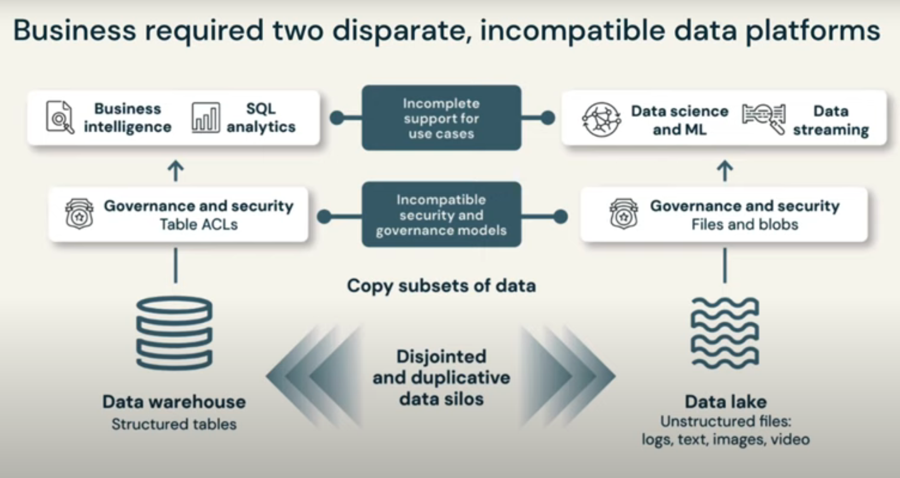
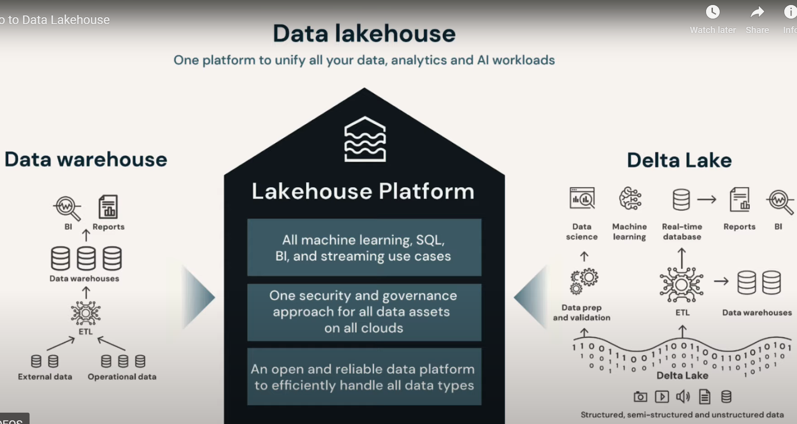
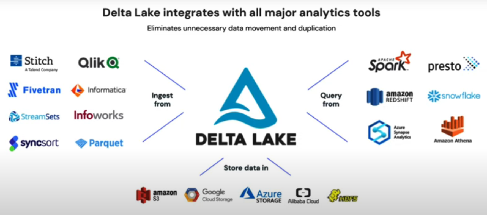
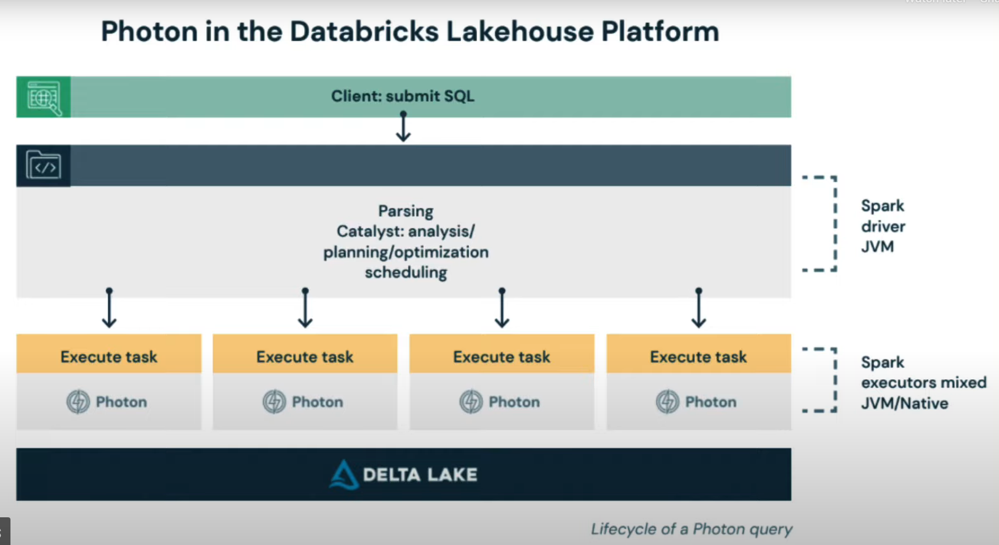
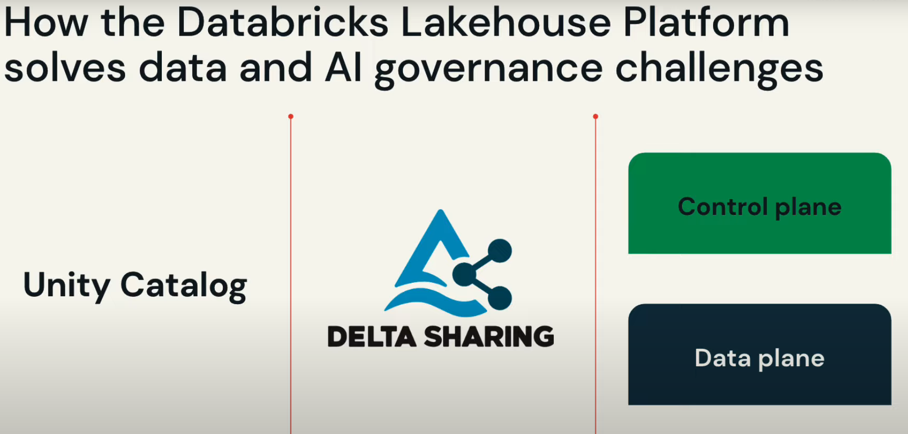
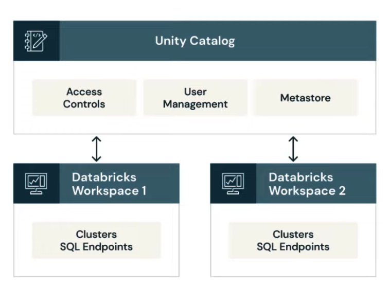
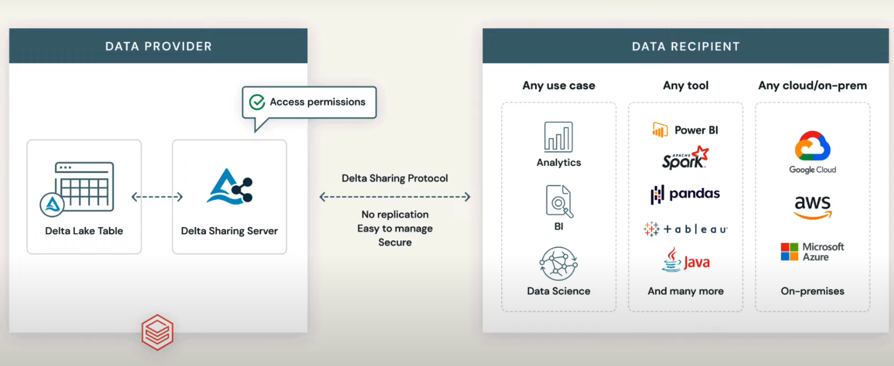
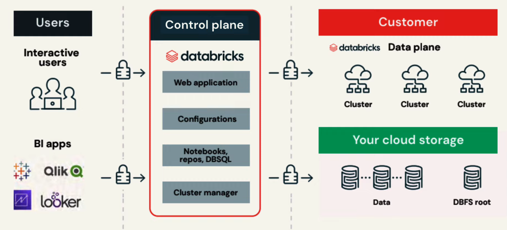
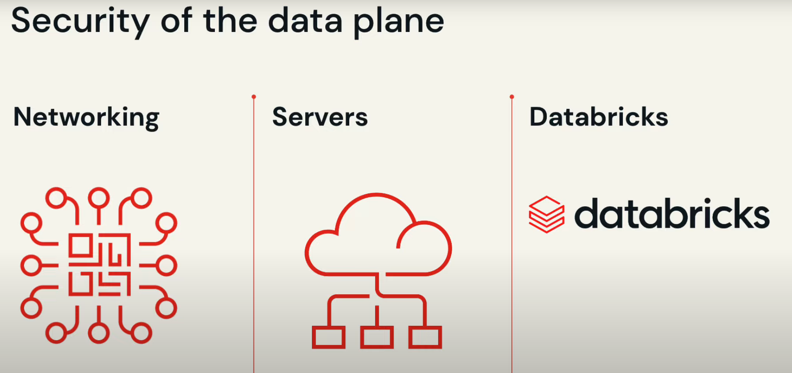

# Lakehouse Fundamentals

## Data warehouse
Pros
- Business intelligence (BI)
- Analytics
- Structured and clean data
- predefiend schemas

cons
- No support for semi or unstructured data
- Infelexible schemas
- Struggle with volume and velocity upticks
- Long procesing time

## Data Lake:

pros
- flexible data storage
- streaming support
- cost efficient in the cloud
- suport for AI and machin learning

Cons
- No transactional support
- porr data realiability
- slow analysis performance
- data governance concerns
- data warehouse still need

## DATA lakehouse

key features

- Transaction support
- Schema enforcement and governance
- Data governance
- BI support
- Decoupled storage from compute
- Open storage formats
- Support for driverse data types
- support for diverse workloads
- ent-to-end streaming

# Databricks

The Databricks Lakehouse Platform has created a paradigm shift by unifying data, analytics, and AI on a single, open platform. 

## Delta lake

- ACID transactions 
- Scalable data and metadata handling
- Audit histroy and time travel
- Schema enforcement and schema evolution
- support for deletes, updates and merges
- Unified streaming and batch data processing

- compatible with apache saprk
- uses delta tables parquet tables
- Has a transaction log
- is an open source project

## Photon

- sql.based jobs
- iot use cases
- data privacy and compliance
- loafing data into delta and parquet

## Unity Catalog and Delta sharing

### Unity catalog

### Data sharing with  Delta Sharing

- open cross platform hsharing
- share live data without copying it
- centralized administration and governance
- marketplace for data products
- privacy-safe data clean rooms

### Control plan and data plae

