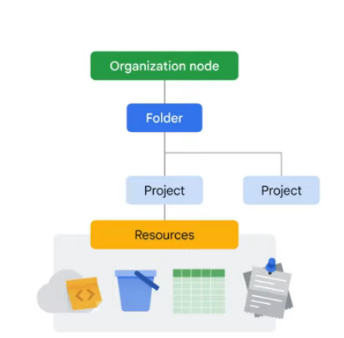
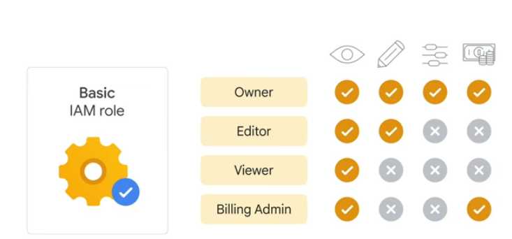
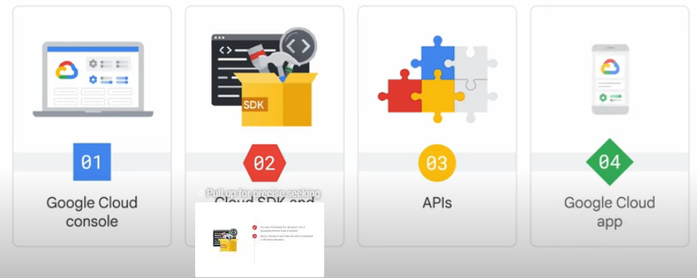
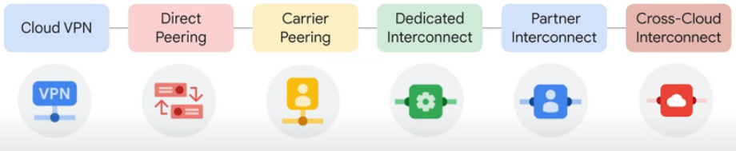
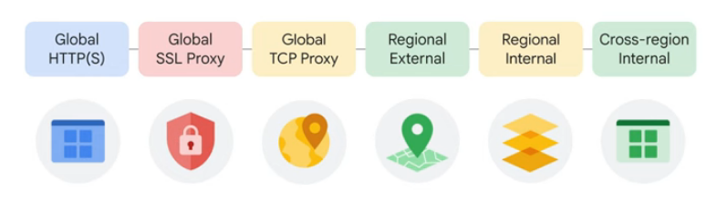
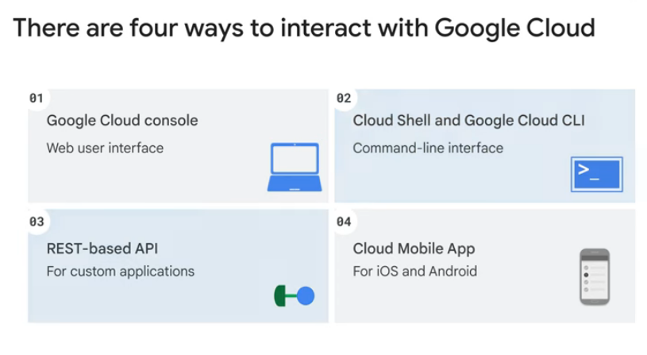
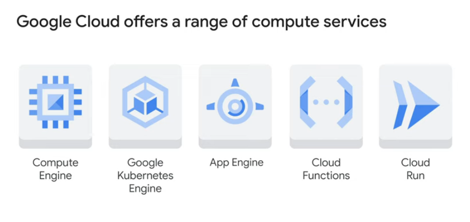

# GCP

Google Cloud’s resource hierarchy contains four levels, and starting from the bottom up they are: resources, projects, folders, and an organization node.

At the first level are resources.
These represent virtual machines, Cloud Storage buckets, tables in BigQuery, or anything else in Google Cloud.

Resources are organized into projects, which sit on the second level.

Projects can be organized into folders, or even subfolders. These sit at the third level.

And then at the top level is an organization node, which encompasses all the projects, folders, and resources in your organization.

Policies can be defined at the project, folder, and organization node levels.

Policies are also inherited downward.
This means that if you apply a policy to a folder, it will also apply to all of the projects within that folder.

Each Google Cloud project has three identifying attributes: a project ID, a project name, and a project number

The project ID is a globally unique identifier assigned by Google that can’t be changed after creation. They’re what we refer to as being immutable.

Project names, however, are user-created. They don’t have to be unique and they can be changed at any time, so they are not immutable.

Google Cloud also assigns each project a unique project number.It’s helpful to know that these Google-generated numbers exist

Google Cloud’s Resource Manager tool is designed to programmatically help you manage projects.

The third level of the Google Cloud resource hierarchy is folders. Folders let you assign policies to resources at a level of granularity you choose. You can use folders to group projects under an organization in a hierarchy.

To use folders, you must have an organization node, which is the very topmost resource in the Google Cloud hierarchy.

There are some special roles associated with this top-level organization node

For example, you can designate an organization policy administrator so that only people with privilege can change policies.

You can also assign a project creator role, which is a great way to control who can create projects and, therefore, who can spend money.

How a new organization node is created depends on whether your company is also a Google Workspace customer.

If you have a Workspace domain, Google Cloud projects will automatically belong to your organization node.

Otherwise, you can use Cloud Identity, Google’s identity, access, application, and endpoint management platform, to generate one.

## IAM

With IAM, administrators can apply policies that define who can do what and on which resources.

The “who” part of an IAM policy can be a Google account, a Google group, a service account, or a Cloud Identity domain.

A “who” is also called a “principal.”

The “can do what” part of an IAM policy is defined by a role.

An IAM role is a collection of permissions.

When a principal is given a role on a specific element of the resource hierarchy, the resulting policy applies to both the chosen element and all the elements below it in the hierarchy.

There are three kinds of roles in IAM: basic, predefined, and custom.

Basic roles are quite broad in scope. Basic roles include owner, editor, viewer, and billing administrator. Project viewers can access resources but can’t make changes.
Project editors can access and make changes to a resource.
And project owners can also access and make changes to a resource.

he second type of role, predefined roles. Specific Google Cloud services offer sets of predefined roles, and they even define where those roles can be applied. This then allows whoever has these roles to perform a specific set of predefined actions.

 custom role. Custom roles will allow you to define those exact permissions. Before you start creating custom roles, please note two important details.

First, you’ll need to manage the permissions that define the custom role you’ve created.
Because of this, some organizations decide they’d rather use the predefined roles.
And second, custom roles can only be applied to either the project level or organization level.
They can’t be applied to the folder level.

## Service Accounts

A service account is a special kind of account typically used by an application or compute workload, such as a Compute Engine instance, rather than a person. A service account is identified by its email address, which is unique to the account.
Service accounts are named with an email address, but instead of passwords they use cryptographic keys to access resources.
in addition to being an identity, a service account is also a resource, so it can have IAM policies of its own attached to it.

## Cloud Identity

With a tool called Cloud Identity, organizations can define policies and manage their users and groups using the Google Admin Console.
Admins can log in and manage Google Cloud resources using the same usernames and passwords they already use in existing Active Directory or LDAP systems.
Using Cloud Identity also means that when someone leaves an organization, an administrator can use the Google Admin Console to disable their account and remove them from groups.

# Interactivng with google cloud

There are four ways to access and interact with Google Cloud.The Cloud Console, the Cloud SDK and Cloud Shell, the APIs, and the Google Cloud App.

## Google Cloud Console
First is the Google Cloud Console, which is Google Cloud’s graphical user interface, or GUI, that helps you deploy, scale, and diagnose production issues in a simple web-based interface.

With the Cloud Console, you can easily find your resources, check their health, have full management control over them, and set budgets to control how much you spend on them.

The Cloud Console also provides a search facility to quickly find resources and connect to instances via SSH in the browser.
## Cloud SDK and Cloud shell
Second is through the Cloud SDK and Cloud Shell. The Cloud SDK is a set of tools that you can use to manage resources and applications hosted on Google Cloud. These include the Google Cloud CLI, which provides the main command-line interface for Google Cloud products and services, and bq, a command-line tool for BigQuery. Cloud Shell provides command-line access to cloud resources directly from a browser. With Cloud Shell, the Cloud SDK gcloud command and other utilities are always installed, available, up to date, and fully authenticated
## API
The third way to access Google Cloud is through application programming interfaces, or APIs 
The services that make up Google Cloud offer APIs so that code you write can control them. The Cloud Console includes a tool called the Google APIs Explorer that shows which APIs are available, and in which versions.

Google provides Cloud Client libraries and Google API Client libraries in many popular languages to take Languages currently represented in these libraries are Java, Python, PHP, C#, Go, Node.js, Ruby, and C++.

## Google cloud App
the fourth way to access and interact with Google Cloud is with the Google Cloud app, which can be used to start, stop, and use SSH to connect to Compute Engine instances and see logs from each instance.

It also lets you stop and start Cloud SQL instances.

Additionally, you can administer applications deployed on App Engine by viewing errors, rolling back deployments, and changing traffic splitting.

The Google Cloud app provides up-to-date billing information for your projects and billing alerts for projects that are going over budget.

You can set up customizable graphs showing key metrics such as CPU usage, network usage, requests per second, and server errors.

The app also offers alerts and incident management. You can download the Google Cloud app at cloud.google.com/app.

# VPC
A virtual private cloud, or VPC, is a secure, individual, private cloud-computing model hosted within a public cloud – like Google Cloud!

On a VPC, customers can run code, store data, host websites, and do anything else they could
do in an ordinary private cloud, but this private cloud is hosted remotely by a public cloud provider.

This means that VPCs combine the scalability and convenience of public cloud computing with the data isolation of private cloud computing.

VPC networks connect Google Cloud resources to each other and to the internet.

This includes segmenting networks, using firewall rules to restrict access to instances, and creating static routes to forward traffic to specific destinations

They can also have subnets, which is a segmented piece of the larger network, in any Google Cloud region worldwide.

Subnets can span the zones that make up a region.

Resources can even be in different zones on the same subnet.

The size of a subnet can be increased by expanding the range of IP addresses allocated to it, and doing so won’t affect virtual machines that are already configured.

## VPC routing 
VPC routing tables are built-in so you don’t have to provision or manage a router.

They’re used to forward traffic from one instance to another within the same network, across subnetworks, or even between Google Cloud zones, without requiring an external IP address.

## Firewall
Another thing you don’t have to provision or manage for Google Cloud is a firewall.

VPCs provide a global distributed firewall, which can be controlled to restrict access to instances through both incoming and outgoing traffic.

Firewall rules can be defined through network tags on Compute Engine instances, which is really convenient.

## VPC Peering

With VPC Peering, a relationship between two VPCs can be established to exchange traffic.

## Conecting networks
Many Google Cloud customers want to connect their Google Virtual Private Cloud networks to other networks in their system, such as on-premises networks or networks in other clouds.

There are several effective ways to accomplish this.

One option is to start with a Virtual Private Network connection over the internet and use Cloud VPN to create a “tunnel” connection.

To make the connection dynamic, a Google Cloud feature called Cloud Router can be used.

Cloud Router lets other networks and Google VPC, exchange route information over the VPN using the Border Gateway Protocol.

Using this method, if you add a new subnet to your Google VPC, your on-premises network will automatically get routes to it.

But using the internet to connect networks isn't always the best option for everyone, either because of security concerns or because of bandwidth reliability.

a second option is to consider “peering” with Google using Direct Peering.

Peering means putting a router in the same public data center as a Google point of presence and using it to exchange traffic between networks.

Google has more than 100 points of presence around the world.

Customers who aren’t already in a point of presence can work with a partner in the Carrier Peering program to get connected.

Carrier peering gives you direct access from your on-premises network through a service provider's network to Google

Workspace and to Google Cloud products that can be exposed through one or more public IP addresses.

One downside of peering, though, is that it isn’t covered by a Google Service Level Agreement.

If getting the highest uptimes for interconnection is important, using Dedicated Interconnect would be a good solution.

This option allows for one or more direct, private connections to Google.

If these connections have topologies that meet Google’s specifications, they can be covered by an SLA of up to 99.99%.

Also, these connections can be backed up by a VPN for even greater reliability.

Another option we’ll explore is Partner Interconnect, which provides connectivity between an on-premises network and a VPC network through a supported service provider.

A Partner Interconnect connection is useful if a data center is in a physical location that can't reach

a Dedicated Interconnect colocation facility, or if the data needs don’t warrant an entire 10 GigaBytes per second connection.

Depending on availability needs, Partner Interconnect can be configured to support mission-critical services or applications that can tolerate some downtime.

As with Dedicated Interconnect, if these connections have topologies that meet Google’s specifications, they can be covered by an SLA of up to 99.99%,

but note that Google isn’t responsible for any aspects of Partner Interconnect provided by the third-party service provider, nor any issues outside of Google's network.

And the final option is Cross-Cloud Interconnect.

Cross-Cloud Interconnect helps you establish high-bandwidth dedicated connectivity between Google Cloud and another cloud service provider.

Google provisions a dedicated physical connection between the Google network and that of another cloud service provider.

You can use this connection to peer your Google Virtual Private Cloud network with your network that's hosted by a supported cloud service provider.

Cross-Cloud Interconnect supports your adoption of an integrated multicloud strategy.

In addition to supporting various cloud service providers, Cross-Cloud Interconnect offers reduced complexity, site-to-site data transfer, and encryption.

Cross-Cloud Interconnect connections are available in two sizes: 10 Gbps or 100 Gbps.

# Compute Engine

With Compute Engine, users can create and run virtual machines on Google infrastructure.

There are no upfront investments, and thousands of virtual CPUs can run on a system that’s designed to be fast and to offer consistent performance. 

Each virtual machine contains the power and functionality of a full-fledged operating system.

This means a virtual machine can be configured much like a physical server: by specifying the amount of CPU power and memory needed, the amount and type of storage needed, and the operating system.

The instance can run Linux and Windows Server images provided by Google or any customized versions of these images.

You can also build and run images of other operating systems and flexibly reconfigure virtual machines.

For the use of virtual machines, Compute Engine bills by the second with a one-minute minimum, and sustained-use discounts start to apply automatically to virtual machines the longer they run.

So, for each VM that runs for more than 25% of a month, Compute Engine automatically applies a discount for every additional minute.

This means that for stable and predictable workloads, a specific amount of vCPUs and memory can be purchased for up to

a 57% discount off of normal prices in return for committing to a usage term of one year or three years.

And then there are Preemptible and Spot VMs.

Let’s say you have a workload that doesn’t require a human to sit and wait for it to finish–such as a batch job analyzing a large dataset.

You can save money, in some cases up to 90%, by choosing Preemptible or Spot VMs to run the job.

A Preemptible or Spot VM is different from an ordinary Compute Engine VM in only one respect: Compute Engine has permission to terminate a job if its resources are needed elsewhere.

Although savings are possible with preemptible or spot VMs, you'll need to ensure that your job can be stopped and restarted.

Spot VMs differ from Preemptible VMs by offering more features.

For example, preemptible VMs can only run for up to 24 hours at a time, but Spot VMs do not have a maximum runtime.

However, the pricing is, currently the same for both.

Compute Engine lets you choose the machine properties of your instances, like the number of virtual CPUs and the

amount of memory, by using a set of predefined machine types or by creating your own custom machine types.

# Scaling virtual machines

Compute Engine has a feature called Autoscaling, where VMs can be added to or subtracted from an application based on load metrics.

The other part of making that work is balancing the incoming traffic among the VMs.

# Load balancing
The job of a load balancer is to distribute user traffic across multiple instances of an application.

By spreading the load, load balancing reduces the risk that applications experience performance issues.

Cloud Load Balancing is a fully distributed, software-defined, managed service for all your traffic.

Cloud Load Balancing provides cross-region load balancing, including automatic multi-region failover, which gently moves traffic in fractions if backends become unhealthy.

You can put Cloud Load Balancing in front of all of your traffic: HTTP or HTTPS, other TCP and SSL traffic, and UDP traffic too.

Google’s Virtual Private Cloud (VPC) supports several different kinds of load balancing

- If you need cross-regional load balancing for a web application, use Global HTTP(S) load balancing.

- For Secure Sockets Layer traffic that is not HTTP, use the Global SSL Proxy load balancer.

- If it’s other TCP traffic that doesn’t use SSL, use the Global TCP Proxy load balancer.

Those last two proxy services only work for specific port numbers, and they only work for TCP.

If you want to load balance UDP traffic, or traffic on any port number, you can

still load balance across a Google Cloud region with the Regional External Passthrough Network load balancer.

On top of that, you can also deploy Regional External Application load balancer and Proxy Network load balancer.

What all those services have in common is that they’re intended for traffic coming into the Google network from the internet.

- But what if you want to load balance traffic inside your project, say, between the presentation layer and the business layer of your application?

For that, use the Regional Internal load balancer that supports Proxy Network load balancer, Passthrough Network load balancer, and Application load balancer.

It accepts traffic on a Google Cloud internal IP address and load balances it across Compute Engine VMs.

Finally, the Google Cloud Cross-region Internal load balancer is a Layer 7 load balancer that enables you to load balance

traffic to backend services that are globally distributed, including traffic management that ensures traffic is directed to the closest backend.

# Cloud DNS

One of the most famous free Google services is 8.8.8.8, which provides a public Domain Name Service to the world

DNS is what translates internet hostnames to addresses, and as you might imagine, Google has a highly developed DNS infrastructure.

It’s a managed DNS service that runs on the same infrastructure as Google.

It has low latency and high availability, and it’s a cost-effective way to make your applications and services available to your users.

The DNS information you publish is served from redundant locations around the world.

Cloud DNS is also programmable.

You can publish and manage millions of DNS zones and records using the Cloud Console, the command-line interface, or the API.

# Cloud CDN

Edge caching refers to the use of caching servers to store content closer to end users.

You can use this system to accelerate content delivery in your application by using Cloud CDN - Content Delivery Network.

This means your customers will experience lower network latency, the origins of your content will experience reduced load, and you can even save money.

After HTTP(S) Load Balancing is set up, Cloud CDN can be enabled with a single checkbox.

There are many other CDNs available out there, of course.

If you are already using one, chances are, it’s a part of Google Cloud’s CDN Interconnect partner program, and you can continue to use it.

## Essential Google Cloud Infrastructure: Foundation

