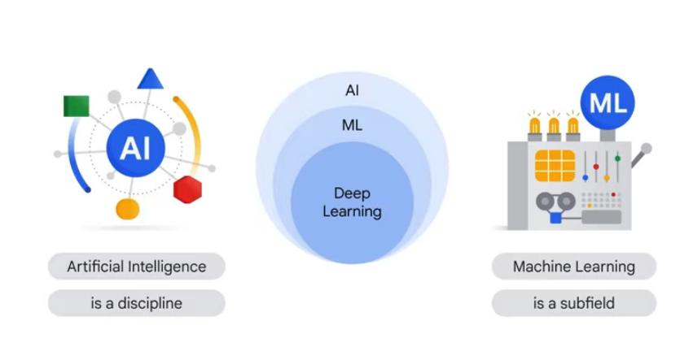
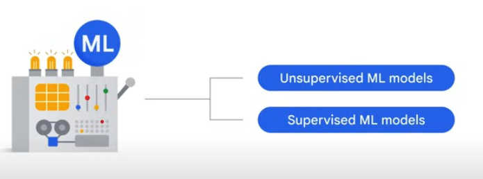

AI is the theory and development of computer systems able to perform tasks normally requiring human intelligence

ML gives computers the ability to learn without explicit programming 

Two of the most common classes of machine learning models are unsupervised and supervised ML models.

The key difference between the two is that, with supervised models, we have labels.

Labeled data is data that comes with a tag like a name, a type, or a number.

Supervised learning implies the data is already labeled. in supervised learning from past examples to predict future values
