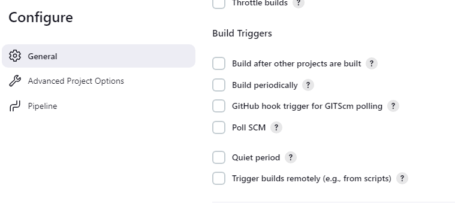

# Install Jenkins using Docker Compose

## Docker Installation
Step 1
Install Docker locally (probably using Docker Desktop is the easiest approach).

Step 2
Clone this repository or download it's contents.

Step 2
Open a terminal window in the same directory where the Dockerfile from this repository is located. Build the Jenkins Docker image:

```
docker build -t my-jenkins .
```

Step 3
```
docker compose up -d
```

Step 4
Open Jenkins by going to: http://localhost:8080/ and finish the installation process.

Step 5
If you wish to stop Jenkins and get back to it later, run:

```
docker compose down
```
If you wish to start Jenkins again later, just run the same comand from Step 3.

Removing Jenkins
Once you are done playing with Jenkins maybe it is time to clean things up.

Run the following comand to terminate Jenkins and to remove all volumes and images used:
```
docker compose down --volumes --rmi all 
```

## Dockerfile

```
FROM jenkins/jenkins:lts-jdk17
USER root
RUN apt-get update && apt-get install -y lsb-release
RUN curl -fsSLo /usr/share/keyrings/docker-archive-keyring.asc \
  https://download.docker.com/linux/debian/gpg
RUN echo "deb [arch=$(dpkg --print-architecture) \
  signed-by=/usr/share/keyrings/docker-archive-keyring.asc] \
  https://download.docker.com/linux/debian \
  $(lsb_release -cs) stable" > /etc/apt/sources.list.d/docker.list
RUN apt-get update && apt-get install -y docker-ce-cli
USER jenkins
```

## Docker Compose

```
version: '3.7'

services:
  jenkins-docker:
    image: docker:dind
    container_name: jenkins-docker
    privileged: true
    environment:
      - DOCKER_TLS_CERTDIR=/certs
    volumes:
      - jenkins-docker-certs:/certs/client
      - jenkins-data:/var/jenkins_home
    ports:
      - "2376:2376"
    networks:
      jenkins:
        aliases:
          - docker
    command: --storage-driver overlay2

  my-jenkins:
    image: my-jenkins
    container_name: my-jenkins
    restart: on-failure
    environment:
      - DOCKER_HOST=tcp://docker:2376
      - DOCKER_CERT_PATH=/certs/client
      - DOCKER_TLS_VERIFY=1
    volumes:
      - jenkins-data:/var/jenkins_home
      - jenkins-docker-certs:/certs/client:ro
    ports:
      - "8080:8080"
      - "50000:50000"
    networks:
      - jenkins

networks:
  jenkins:
    driver: bridge

volumes:
  jenkins-docker-certs:
  jenkins-data:
```

version: '3.7'

services:
  jenkins-docker:
    image: docker:dind
    container_name: jenkins-docker
    privileged: true
    environment:
      - DOCKER_TLS_CERTDIR=/certs
    volumes:
      - jenkins-docker-certs:/certs/client
      - jenkins-data:/var/jenkins_home
    ports:
      - "2376:2376"
    networks:
      jenkins:
        aliases:
          - docker
    command: --storage-driver overlay2

  my-jenkins:
    image: my-jenkins
    container_name: my-jenkins
    restart: on-failure
    environment:
      - DOCKER_HOST=tcp://docker:2376
      - DOCKER_CERT_PATH=/certs/client
      - DOCKER_TLS_VERIFY=1
    volumes:
      - jenkins-data:/var/jenkins_home
      - jenkins-docker-certs:/certs/client:ro
    ports:
      - "8080:8080"
      - "50000:50000"
    networks:
      - jenkins

networks:
  jenkins:
    driver: bridge

volumes:
  jenkins-docker-certs:

# Jenkins file

```
pipeline {
    agent any

    stages {
        stage('Build') {
            steps {
                echo 'Building a new laptop ...'
                sh 'mkdir -p build'
                sh 'touch build/computer.txt'
                sh 'echo "Mainboard" >> build/computer.txt'
                sh 'cat build/computer.txt'
                sh 'echo "Display" >> build/computer.txt'
                sh 'cat build/computer.txt'
                sh 'echo "Keyboard" >> build/computer.txt'
                sh 'cat build/computer.txt'
            }
        }
    }
}

```

# jenkins workspace

```
pipeline {
    agent any

    stages {
        stage('Build') {
            steps {
                echo 'Building a new laptop ...'
                sh 'mkdir -p build'
                sh 'touch build/computer.txt'
                sh 'echo "Mainboard" >> build/computer.txt'
                sh 'cat build/computer.txt'
                sh 'echo "Display" >> build/computer.txt'
                sh 'cat build/computer.txt'
                sh 'echo "Keyboard" >> build/computer.txt'
                sh 'cat build/computer.txt'
            }
        }
    }

    post {
        always {
            cleanWs()
        }
    }
}
```

# Storing build artifacts in jenkins

```
pipeline {
    agent any

    stages {
        stage('Build') {
            steps {
                cleanWs()
                echo 'Building a new laptop ...'
                sh 'mkdir -p build'
                sh 'touch build/computer.txt'
                sh 'echo "Mainboard" >> build/computer.txt'
                sh 'cat build/computer.txt'
                sh 'echo "Display" >> build/computer.txt'
                sh 'cat build/computer.txt'
                sh 'echo "Keyboard" >> build/computer.txt'
                sh 'cat build/computer.txt'
            }
        }
    }

    post {
        success {
            archiveArtifacts artifacts: 'build/**'
        }

    }
}
```

# Combining multiple shell steps (sh) into one

```
pipeline {
    agent any

    stages {
        stage('Build') {
            steps {
                cleanWs()
                echo 'Building a new laptop ...'
                sh '''
                    mkdir -p build
                    touch build/computer.txt
                    echo "Mainboard" >> build/computer.txt
                    cat build/computer.txt
                    echo "Display" >> build/computer.txt
                    cat build/computer.txt
                    echo "Keyboard" >> build/computer.txt
                    cat build/computer.txt
                '''
            }
        }
    }

    post {
        success {
            archiveArtifacts artifacts: 'build/**'
        }
    }
}

```

# Pipelines Stages
```
pipeline {
    agent any

    stages {
        stage('Build') {
            steps {
                cleanWs()
                echo 'Building a new laptop ...'
                sh '''
                    mkdir -p build
                    touch build/computer.txt
                    echo "Mainboard" >> build/computer.txt
                    cat build/computer.txt
                    echo "Display" >> build/computer.txt
                    cat build/computer.txt
                    echo "Keyboard" >> build/computer.txt
                    cat build/computer.txt
                    rm build/computer.txt # test fails
                '''
            }
        }
        stage('Test') {
            steps {
                echo 'Testing the new laptop ...'
                sh 'test -f build/computer.txt'
            }
        }
    }

    post {
        success {
            archiveArtifacts artifacts: 'build/**'
        }
    }
}

```

# Testing build artifacts

```
pipeline {
    agent any

    environment {
        BUILD_FILE_NAME = 'laptop.txt'
    }

    stages {
        stage('Build') {
            steps {
                cleanWs()
                echo 'Building a new laptop ...'
                sh '''
                    echo $BUILD_FILE_NAME
                    mkdir -p build
                    echo "Mainboard" >> build/$BUILD_FILE_NAME
                    cat build/$BUILD_FILE_NAME
                    echo "Display" >> build/$BUILD_FILE_NAME
                    cat build/$BUILD_FILE_NAME
                    echo "Keyboard" >> build/$BUILD_FILE_NAME
                    cat build/$BUILD_FILE_NAME
                '''
            }
        }
        stage('Test') {
            steps {
                echo 'Testing the new laptop ...'
                sh '''
                    test -f build/$BUILD_FILE_NAME
                    grep "Mainboard" build/$BUILD_FILE_NAME
                    grep "Display" build/$BUILD_FILE_NAME
                    grep "Keyboard" build/$BUILD_FILE_NAME
                '''
            }
        }
    }

    post {
        success {
            archiveArtifacts artifacts: 'build/**'
        }
    }
}

```

# Defining environments variables

```
pipeline {
    agent any

    environment {
        BUILD_FILE_NAME = 'laptop.txt'
    }

    stages {
        stage('Build') {
            steps {
                cleanWs()
                echo 'Building a new laptop ...'
                sh '''
                    echo $BUILD_FILE_NAME
                    mkdir -p build
                    echo "Mainboard" >> build/$BUILD_FILE_NAME
                    cat build/$BUILD_FILE_NAME
                    echo "Display" >> build/$BUILD_FILE_NAME
                    cat build/$BUILD_FILE_NAME
                    echo "Keyboard" >> build/$BUILD_FILE_NAME
                    cat build/$BUILD_FILE_NAME
                '''
            }
        }
        stage('Test') {
            steps {
                echo 'Testing the new laptop ...'
                sh '''
                    test -f build/$BUILD_FILE_NAME
                    grep "Mainboard" build/$BUILD_FILE_NAME
                    grep "Display" build/$BUILD_FILE_NAME
                    grep "Keyboard" build/$BUILD_FILE_NAME
                '''
            }
        }
    }

    post {
        success {
            archiveArtifacts artifacts: 'build/**'
        }
    }
}

```

# implementing CI

## jenkins build enviornment

1. install all tools needed (like Node.js/ npm) on the Jenkins agent
2. use docker with containers

to use docker agent you need to manage jenkins -> plugins -> available plugins -> Docker pipeline -> install -> restart jenkins

```
pipeline {
    agent any

    stages {
        stage('w/o docker') {
            steps {
                sh 'echo "Without docker"'
            }
        }

        stage('w/ docker') {
            agent {
                docker {
                    image 'node:18-alpine'
                }
            }
            steps {
                sh 'echo "With docker"'
                sh 'npm --version'
            }
        }
    }
}

```

# workspace synchronisation

If it is important to keep the workspace synchronized with other stages, use reuseNode true. Otherwise, a dockerized stage can be run on the same agent or any other agent, but in a temporary workspace.

```
pipeline {
    agent any

    stages {
        stage('w/o docker') {
            steps {
                sh '''
                  echo "Without docker"
                  ls -la
                  touch container-yes.txt 
                '''
            }
        }

        stage('w/ docker') {
            agent {
                docker {
                    image 'node:18-alpine'
                    reuseNode true
                }
            }
            steps {
                sh '''
                  echo "With docker"
                  ls -la
                  touch container-yes.txt 
                '''
            }
        }
    }
}

```
# using a Git repository in Jenkins

## comments in jenkinsfile

```
pipeline {
    agent any
      // one line comment

    stages {
        /*

        stage('Build') {
            agent {
                docker {
                    image 'node:18-alpine'
                    reuseNode true
                }
            }
            steps {
                sh '''
                    ls -la
                    node --version
                    npm --version
                    npm ci
                    npm run build
                    ls -la
                '''
            }
        }
        */

        stage('Test') {
            agent {
                docker {
                    image 'node:18-alpine'
                    reuseNode true
                }
            }

            steps {
                sh '''
                    #test -f build/index.html
                    npm test
                '''
            }
        }
    }

    post {
        always {
            junit 'test-results/junit.xml'
        }
    }
}

```

# Security policies

Try to run this script in Jenkins Dashboard > Manage Jenkins > section “Tools and actions” > Script Console:

System.setProperty("hudson.model.DirectoryBrowserSupport.CSP", "sandbox allow-scripts;")

https://www.jenkins.io/doc/book/security/configuring-content-security-policy/

# Running stages in parallel

```
pipeline {
    agent any

    stages {
        /*

        stage('Build') {
            agent {
                docker {
                    image 'node:18-alpine'
                    reuseNode true
                }
            }
            steps {
                sh '''
                    ls -la
                    node --version
                    npm --version
                    npm ci
                    npm run build
                    ls -la
                '''
            }
        }
        */

        stage('Tests') {
            parallel {
                stage('Unit tests') {
                    agent {
                        docker {
                            image 'node:18-alpine'
                            reuseNode true
                        }
                    }

                    steps {
                        sh '''
                            #test -f build/index.html
                            npm test
                        '''
                    }
                    post {
                        always {
                            junit 'jest-results/junit.xml'
                        }
                    }
                }

                stage('E2E') {
                    agent {
                        docker {
                            image 'mcr.microsoft.com/playwright:v1.39.0-jammy'
                            reuseNode true
                        }
                    }

                    steps {
                        sh '''
                            npm install serve
                            node_modules/.bin/serve -s build &
                            sleep 10
                            npx playwright test  --reporter=html
                        '''
                    }

                    post {
                        always {
                            publishHTML([allowMissing: false, alwaysLinkToLastBuild: false, keepAll: false, reportDir: 'playwright-report', reportFiles: 'index.html', reportName: 'Playwright HTML Report', reportTitles: '', useWrapperFileDirectly: true])
                        }
                    }
                }
            }
        }
    }
}

```

# update jenkins


# Configuration environment varibles

```
pipeline {
    agent any

    environment {
        NETLIFY_SITE_ID = '03d4042d-476c-4668-9ce8-34352dad73e4'
    }

    stages {

        stage('Build') {
            agent {
                docker {
                    image 'node:18-alpine'
                    reuseNode true
                }
            }
            steps {
                sh '''
                    ls -la
                    node --version
                    npm --version
                    npm ci
                    npm run build
                    ls -la
                '''
            }
        }

        stage('Tests') {
            parallel {
                stage('Unit tests') {
                    agent {
                        docker {
                            image 'node:18-alpine'
                            reuseNode true
                        }
                    }

                    steps {
                        sh '''
                            #test -f build/index.html
                            npm test
                        '''
                    }
                    post {
                        always {
                            junit 'jest-results/junit.xml'
                        }
                    }
                }

                stage('E2E') {
                    agent {
                        docker {
                            image 'mcr.microsoft.com/playwright:v1.39.0-jammy'
                            reuseNode true
                        }
                    }

                    steps {
                        sh '''
                            npm install serve
                            node_modules/.bin/serve -s build &
                            sleep 10
                            npx playwright test  --reporter=html
                        '''
                    }

                    post {
                        always {
                            publishHTML([allowMissing: false, alwaysLinkToLastBuild: false, keepAll: false, reportDir: 'playwright-report', reportFiles: 'index.html', reportName: 'Playwright HTML Report', reportTitles: '', useWrapperFileDirectly: true])
                        }
                    }
                }
            }
        }

        stage('Deploy') {
            agent {
                docker {
                    image 'node:18-alpine'
                    reuseNode true
                }
            }
            steps {
                sh '''
                    npm install netlify-cli
                    node_modules/.bin/netlify --version
                    echo "Deploying to production. Site ID: $NETLIFY_SITE_ID"
                '''
            }
        }
    }
}

```

# Managing secets in jenkins

manage jenkins-> credentials-> global credentilas-> add credentials

# Using credential in pipelines

```
pipeline {
    agent any

    environment {
        NETLIFY_SITE_ID = '!!! FIXME: YOUR-SITE-ID !!!'
        NETLIFY_AUTH_TOKEN = credentials('netlify-token')
    }

    stages {

        stage('Build') {
            agent {
                docker {
                    image 'node:18-alpine'
                    reuseNode true
                }
            }
            steps {
                sh '''
                    ls -la
                    node --version
                    npm --version
                    npm ci
                    npm run build
                    ls -la
                '''
            }
        }

        stage('Tests') {
            parallel {
                stage('Unit tests') {
                    agent {
                        docker {
                            image 'node:18-alpine'
                            reuseNode true
                        }
                    }

                    steps {
                        sh '''
                            #test -f build/index.html
                            npm test
                        '''
                    }
                    post {
                        always {
                            junit 'jest-results/junit.xml'
                        }
                    }
                }

                stage('E2E') {
                    agent {
                        docker {
                            image 'mcr.microsoft.com/playwright:v1.39.0-jammy'
                            reuseNode true
                        }
                    }

                    steps {
                        sh '''
                            npm install serve
                            node_modules/.bin/serve -s build &
                            sleep 10
                            npx playwright test  --reporter=html
                        '''
                    }

                    post {
                        always {
                            publishHTML([allowMissing: false, alwaysLinkToLastBuild: false, keepAll: false, reportDir: 'playwright-report', reportFiles: 'index.html', reportName: 'Playwright HTML Report', reportTitles: '', useWrapperFileDirectly: true])
                        }
                    }
                }
            }
        }

        stage('Deploy') {
            agent {
                docker {
                    image 'node:18-alpine'
                    reuseNode true
                }
            }
            steps {
                sh '''
                    npm install netlify-cli
                    node_modules/.bin/netlify --version
                    echo "Deploying to production. Site ID: $NETLIFY_SITE_ID"
                    node_modules/.bin/netlify status
                '''
            }
        }
    }
}

```

# Build triggers



- build periodically

This field follows the syntax of cron (with minor differences). Specifically, each line consists of 5 fields separated by TAB or whitespace:
MINUTE HOUR DOM MONTH DOW
MINUTE	Minutes within the hour (0–59)
HOUR	The hour of the day (0–23)
DOM	The day of the month (1–31)
MONTH	The month (1–12)
DOW	The day of the week (0–7) where 0 and 7 are Sunday.

To specify multiple values for one field, the following operators are available. In the order of precedence,

* specifies all valid values
M-N specifies a range of values
M-N/X or */X steps by intervals of X through the specified range or whole valid range
A,B,...,Z enumerates multiple values

To allow periodically scheduled tasks to produce even load on the system, the symbol H (for “hash”) should be used wherever possible. For example, using 0 0 * * * for a dozen daily jobs will cause a large spike at midnight. In contrast, using H H * * * would still execute each job once a day, but not all at the same time, better using limited resources.

The H symbol can be used with a range. For example, H H(0-7) * * * means some time between 12:00 AM (midnight) to 7:59 AM. You can also use step intervals with H, with or without ranges.

The H symbol can be thought of as a random value over a range, but it actually is a hash of the job name, not a random function, so that the value remains stable for any given project.

In addition, @yearly, @annually, @monthly, @weekly, @daily, @midnight, and @hourly are supported as convenient aliases. These use the hash system for automatic balancing. For example, @hourly is the same as H * * * * and could mean at any time during the hour. @midnight actually means some time between 12:00 AM and 2:59 AM.

# Build triggers - SCM Polling

Poll SCM: A feature in Jenkins that periodically checks the version control system for changes.

How Does Jenkins Poll SCM Work?

Jenkins periodically checks the version control system by comparing the current state with the previous state. If changes are detected, a build will trigger.

What Is The Cron Syntax For Poll SCM Frequency?

The cron expression defines the frequency of polling. For example, */10 * * * * means every 10 minutes. Each * represent minute, hour, day, month, week respectively. 

# post deployment test

```
pipeline {
    agent any

    environment {
        NETLIFY_SITE_ID = 'PUT YOUR NETLIFY SITE ID HERE'
        NETLIFY_AUTH_TOKEN = credentials('netlify-token')
    }

    stages {

        stage('Build') {
            agent {
                docker {
                    image 'node:18-alpine'
                    reuseNode true
                }
            }
            steps {
                sh '''
                    ls -la
                    node --version
                    npm --version
                    npm ci
                    npm run build
                    ls -la
                '''
            }
        }

        stage('Tests') {
            parallel {
                stage('Unit tests') {
                    agent {
                        docker {
                            image 'node:18-alpine'
                            reuseNode true
                        }
                    }

                    steps {
                        sh '''
                            #test -f build/index.html
                            npm test
                        '''
                    }
                    post {
                        always {
                            junit 'jest-results/junit.xml'
                        }
                    }
                }

                stage('E2E') {
                    agent {
                        docker {
                            image 'mcr.microsoft.com/playwright:v1.39.0-jammy'
                            reuseNode true
                        }
                    }

                    steps {
                        sh '''
                            npm install serve
                            node_modules/.bin/serve -s build &
                            sleep 10
                            npx playwright test  --reporter=html
                        '''
                    }

                    post {
                        always {
                            publishHTML([allowMissing: false, alwaysLinkToLastBuild: false, keepAll: false, reportDir: 'playwright-report', reportFiles: 'index.html', reportName: 'Playwright Local', reportTitles: '', useWrapperFileDirectly: true])
                        }
                    }
                }
            }
        }

        stage('Deploy') {
            agent {
                docker {
                    image 'node:18-alpine'
                    reuseNode true
                }
            }
            steps {
                sh '''
                    npm install netlify-cli
                    node_modules/.bin/netlify --version
                    echo "Deploying to production. Site ID: $NETLIFY_SITE_ID"
                    node_modules/.bin/netlify status
                    node_modules/.bin/netlify deploy --dir=build --prod
                '''
            }
        }

        stage('Prod E2E') {
            agent {
                docker {
                    image 'mcr.microsoft.com/playwright:v1.39.0-jammy'
                    reuseNode true
                }
            }

            environment {
                CI_ENVIRONMENT_URL = 'PUT YOUR NETLIFY SITE URL HERE'  #environment stage
            }

            steps {
                sh '''
                    npx playwright test  --reporter=html
                '''
            }

            post {
                always {
                    publishHTML([allowMissing: false, alwaysLinkToLastBuild: false, keepAll: false, reportDir: 'playwright-report', reportFiles: 'index.html', reportName: 'Playwright E2E', reportTitles: '', useWrapperFileDirectly: true])
                }
            }
        }
    }
}

```
# Manual Approval

```
pipeline {
    agent any

    stages {
        stage('Build') {
            steps {
                echo 'Building ...'
            }
        }
        stage('Approval') {
            steps {
                timeout(time: 1, unit: 'MINUTES') {
                    input message: 'Ready to deploy?', ok: 'Yes, I am sure I want to deploy!'
                }
            }
        }
        stage('Deploy') {
            steps {
                echo 'Deploying ...'
            }
        }
    }
}

```

other example

```
pipeline {
    agent any

    environment {
        NETLIFY_SITE_ID = 'PUT YOUR NETLIFY SITE ID HERE'
        NETLIFY_AUTH_TOKEN = credentials('netlify-token')
    }

    stages {

        stage('Build') {
            agent {
                docker {
                    image 'node:18-alpine'
                    reuseNode true
                }
            }
            steps {
                sh '''
                    ls -la
                    node --version
                    npm --version
                    npm ci
                    npm run build
                    ls -la
                '''
            }
        }

        stage('Tests') {
            parallel {
                stage('Unit tests') {
                    agent {
                        docker {
                            image 'node:18-alpine'
                            reuseNode true
                        }
                    }

                    steps {
                        sh '''
                            #test -f build/index.html
                            npm test
                        '''
                    }
                    post {
                        always {
                            junit 'jest-results/junit.xml'
                        }
                    }
                }

                stage('E2E') {
                    agent {
                        docker {
                            image 'mcr.microsoft.com/playwright:v1.39.0-jammy'
                            reuseNode true
                        }
                    }

                    steps {
                        sh '''
                            npm install serve
                            node_modules/.bin/serve -s build &
                            sleep 10
                            npx playwright test  --reporter=html
                        '''
                    }

                    post {
                        always {
                            publishHTML([allowMissing: false, alwaysLinkToLastBuild: false, keepAll: false, reportDir: 'playwright-report', reportFiles: 'index.html', reportName: 'Playwright Local', reportTitles: '', useWrapperFileDirectly: true])
                        }
                    }
                }
            }
        }

        stage('Deploy staging') {
            agent {
                docker {
                    image 'node:18-alpine'
                    reuseNode true
                }
            }
            steps {
                sh '''
                    npm install netlify-cli
                    node_modules/.bin/netlify --version
                    echo "Deploying to staging. Site ID: $NETLIFY_SITE_ID"
                    node_modules/.bin/netlify status
                    node_modules/.bin/netlify deploy --dir=build
                '''
            }
        }

        stage('Approval') {
            steps {
                timeout(time: 15, unit: 'MINUTES') {
                    input message: 'Do you wish to deploy to production?', ok: 'Yes, I am sure!'
                }
            }
        }

        stage('Deploy prod') {
            agent {
                docker {
                    image 'node:18-alpine'
                    reuseNode true
                }
            }
            steps {
                sh '''
                    npm install netlify-cli
                    node_modules/.bin/netlify --version
                    echo "Deploying to production. Site ID: $NETLIFY_SITE_ID"
                    node_modules/.bin/netlify status
                    node_modules/.bin/netlify deploy --dir=build --prod
                '''
            }
        }

        stage('Prod E2E') {
            agent {
                docker {
                    image 'mcr.microsoft.com/playwright:v1.39.0-jammy'
                    reuseNode true
                }
            }

            environment {
                CI_ENVIRONMENT_URL = 'PUT YOUR NETLIFY SITE URL HERE'
            }

            steps {
                sh '''
                    npx playwright test  --reporter=html
                '''
            }

            post {
                always {
                    publishHTML([allowMissing: false, alwaysLinkToLastBuild: false, keepAll: false, reportDir: 'playwright-report', reportFiles: 'index.html', reportName: 'Playwright E2E', reportTitles: '', useWrapperFileDirectly: true])
                }
            }
        }
    }
}

```

# Parsing Response data

```
pipeline {
    agent any

    environment {
        NETLIFY_SITE_ID = '03d4042d-476c-4668-9ce8-34352dad73e4'
        NETLIFY_AUTH_TOKEN = credentials('netlify-token')
    }

    stages {

        stage('Build') {
            agent {
                docker {
                    image 'node:18-alpine'
                    reuseNode true
                }
            }
            steps {
                sh '''
                    ls -la
                    node --version
                    npm --version
                    npm ci
                    npm run build
                    ls -la
                '''
            }
        }

        stage('Tests') {
            parallel {
                stage('Unit tests') {
                    agent {
                        docker {
                            image 'node:18-alpine'
                            reuseNode true
                        }
                    }

                    steps {
                        sh '''
                            #test -f build/index.html
                            npm test
                        '''
                    }
                    post {
                        always {
                            junit 'jest-results/junit.xml'
                        }
                    }
                }

                stage('E2E') {
                    agent {
                        docker {
                            image 'mcr.microsoft.com/playwright:v1.39.0-jammy'
                            reuseNode true
                        }
                    }

                    steps {
                        sh '''
                            npm install serve
                            node_modules/.bin/serve -s build &
                            sleep 10
                            npx playwright test  --reporter=html
                        '''
                    }

                    post {
                        always {
                            publishHTML([allowMissing: false, alwaysLinkToLastBuild: false, keepAll: false, reportDir: 'playwright-report', reportFiles: 'index.html', reportName: 'Playwright Local', reportTitles: '', useWrapperFileDirectly: true])
                        }
                    }
                }
            }
        }

        stage('Deploy staging') {
            agent {
                docker {
                    image 'node:18-alpine'
                    reuseNode true
                }
            }
            steps {
                sh '''
                    npm install netlify-cli node-jq
                    node_modules/.bin/netlify --version
                    echo "Deploying to staging. Site ID: $NETLIFY_SITE_ID"
                    node_modules/.bin/netlify status
                    node_modules/.bin/netlify deploy --dir=build --json > deploy-output.json
                    node_modules/.bin/node-jq -r '.deploy_url' deploy-output.json
                '''
            }
        }

        stage('Approval') {
            steps {
                timeout(time: 15, unit: 'MINUTES') {
                    input message: 'Do you wish to deploy to production?', ok: 'Yes, I am sure!'
                }
            }
        }

        stage('Deploy prod') {
            agent {
                docker {
                    image 'node:18-alpine'
                    reuseNode true
                }
            }
            steps {
                sh '''
                    npm install netlify-cli
                    node_modules/.bin/netlify --version
                    echo "Deploying to production. Site ID: $NETLIFY_SITE_ID"
                    node_modules/.bin/netlify status
                    node_modules/.bin/netlify deploy --dir=build --prod
                '''
            }
        }

        stage('Prod E2E') {
            agent {
                docker {
                    image 'mcr.microsoft.com/playwright:v1.39.0-jammy'
                    reuseNode true
                }
            }

            environment {
                CI_ENVIRONMENT_URL = 'https://peaceful-daffodil-303af5.netlify.app'
            }

            steps {
                sh '''
                    npx playwright test  --reporter=html
                '''
            }

            post {
                always {
                    publishHTML([allowMissing: false, alwaysLinkToLastBuild: false, keepAll: false, reportDir: 'playwright-report', reportFiles: 'index.html', reportName: 'Playwright E2E', reportTitles: '', useWrapperFileDirectly: true])
                }
            }
        }
    }
}

```
# Passing dynamic data between stages

```
pipeline {
    agent any

    stages {
        stage('Deploy') {
            steps {
                echo 'Deploying ...'
                script {
                    env.MY_VAR = sh(script: 'date', returnStdout: true)
                }
            }
        }

        stage('E2E') {
            steps {
                echo 'E2E ...'
                echo "MY_VAR is: ${env.MY_VAR}"
                echo "MY_VAR is: $env.MY_VAR" // This syntax should work as well
            }
        }
    }
}

```

other example

```
pipeline {
    agent any

    environment {
        NETLIFY_SITE_ID = 'YOUR NETLIFY SITE ID'
        NETLIFY_AUTH_TOKEN = credentials('netlify-token')
    }

    stages {

        stage('Build') {
            agent {
                docker {
                    image 'node:18-alpine'
                    reuseNode true
                }
            }
            steps {
                sh '''
                    ls -la
                    node --version
                    npm --version
                    npm ci
                    npm run build
                    ls -la
                '''
            }
        }

        stage('Tests') {
            parallel {
                stage('Unit tests') {
                    agent {
                        docker {
                            image 'node:18-alpine'
                            reuseNode true
                        }
                    }

                    steps {
                        sh '''
                            #test -f build/index.html
                            npm test
                        '''
                    }
                    post {
                        always {
                            junit 'jest-results/junit.xml'
                        }
                    }
                }

                stage('E2E') {
                    agent {
                        docker {
                            image 'mcr.microsoft.com/playwright:v1.39.0-jammy'
                            reuseNode true
                        }
                    }

                    steps {
                        sh '''
                            npm install serve
                            node_modules/.bin/serve -s build &
                            sleep 10
                            npx playwright test  --reporter=html
                        '''
                    }

                    post {
                        always {
                            publishHTML([allowMissing: false, alwaysLinkToLastBuild: false, keepAll: false, reportDir: 'playwright-report', reportFiles: 'index.html', reportName: 'Local E2E', reportTitles: '', useWrapperFileDirectly: true])
                        }
                    }
                }
            }
        }

        stage('Deploy staging') {
            agent {
                docker {
                    image 'node:18-alpine'
                    reuseNode true
                }
            }
            steps {
                sh '''
                    npm install netlify-cli node-jq
                    node_modules/.bin/netlify --version
                    echo "Deploying to staging. Site ID: $NETLIFY_SITE_ID"
                    node_modules/.bin/netlify status
                    node_modules/.bin/netlify deploy --dir=build --json > deploy-output.json
                '''
                script {
                    env.STAGING_URL = sh(script: "node_modules/.bin/node-jq -r '.deploy_url' deploy-output.json", returnStdout: true)
                }
            }
        }

        stage('Staging E2E') {
            agent {
                docker {
                    image 'mcr.microsoft.com/playwright:v1.39.0-jammy'
                    reuseNode true
                }
            }

            environment {
                CI_ENVIRONMENT_URL = "${env.STAGING_URL}"
            }

            steps {
                sh '''
                    npx playwright test  --reporter=html
                '''
            }

            post {
                always {
                    publishHTML([allowMissing: false, alwaysLinkToLastBuild: false, keepAll: false, reportDir: 'playwright-report', reportFiles: 'index.html', reportName: 'Staging E2E', reportTitles: '', useWrapperFileDirectly: true])
                }
            }
        }

        stage('Approval') {
            steps {
                timeout(time: 15, unit: 'MINUTES') {
                    input message: 'Do you wish to deploy to production?', ok: 'Yes, I am sure!'
                }
            }
        }

        stage('Deploy prod') {
            agent {
                docker {
                    image 'node:18-alpine'
                    reuseNode true
                }
            }
            steps {
                sh '''
                    npm install netlify-cli
                    node_modules/.bin/netlify --version
                    echo "Deploying to production. Site ID: $NETLIFY_SITE_ID"
                    node_modules/.bin/netlify status
                    node_modules/.bin/netlify deploy --dir=build --prod
                '''
            }
        }

        stage('Prod E2E') {
            agent {
                docker {
                    image 'mcr.microsoft.com/playwright:v1.39.0-jammy'
                    reuseNode true
                }
            }

            environment {
                CI_ENVIRONMENT_URL = 'YOUR NETLIFY URL'
            }

            steps {
                sh '''
                    npx playwright test  --reporter=html
                '''
            }

            post {
                always {
                    publishHTML([allowMissing: false, alwaysLinkToLastBuild: false, keepAll: false, reportDir: 'playwright-report', reportFiles: 'index.html', reportName: 'Prod E2E', reportTitles: '', useWrapperFileDirectly: true])
                }
            }
        }
    }
}

```

# Combining pipelines stage if is possible

```
pipeline {
    agent any

    environment {
        NETLIFY_SITE_ID = 'YOUR NETLIFY SITE ID'
        NETLIFY_AUTH_TOKEN = credentials('netlify-token')
    }

    stages {

        stage('Build') {
            agent {
                docker {
                    image 'node:18-alpine'
                    reuseNode true
                }
            }
            steps {
                sh '''
                    ls -la
                    node --version
                    npm --version
                    npm ci
                    npm run build
                    ls -la
                '''
            }
        }

        stage('Tests') {
            parallel {
                stage('Unit tests') {
                    agent {
                        docker {
                            image 'node:18-alpine'
                            reuseNode true
                        }
                    }

                    steps {
                        sh '''
                            #test -f build/index.html
                            npm test
                        '''
                    }
                    post {
                        always {
                            junit 'jest-results/junit.xml'
                        }
                    }
                }

                stage('E2E') {
                    agent {
                        docker {
                            image 'mcr.microsoft.com/playwright:v1.39.0-jammy'
                            reuseNode true
                        }
                    }

                    steps {
                        sh '''
                            npm install serve
                            node_modules/.bin/serve -s build &
                            sleep 10
                            npx playwright test  --reporter=html
                        '''
                    }

                    post {
                        always {
                            publishHTML([allowMissing: false, alwaysLinkToLastBuild: false, keepAll: false, reportDir: 'playwright-report', reportFiles: 'index.html', reportName: 'Local E2E', reportTitles: '', useWrapperFileDirectly: true])
                        }
                    }
                }
            }
        }

        stage('Deploy staging') {
            agent {
                docker {
                    image 'mcr.microsoft.com/playwright:v1.39.0-jammy'
                    reuseNode true
                }
            }

            environment {
                CI_ENVIRONMENT_URL = 'STAGING_URL_TO_BE_SET'
            }

            steps {
                sh '''
                    npm install netlify-cli node-jq
                    node_modules/.bin/netlify --version
                    echo "Deploying to staging. Site ID: $NETLIFY_SITE_ID"
                    node_modules/.bin/netlify status
                    node_modules/.bin/netlify deploy --dir=build --json > deploy-output.json
                    CI_ENVIRONMENT_URL=$(node_modules/.bin/node-jq -r '.deploy_url' deploy-output.json)
                    npx playwright test  --reporter=html
                '''
            }

            post {
                always {
                    publishHTML([allowMissing: false, alwaysLinkToLastBuild: false, keepAll: false, reportDir: 'playwright-report', reportFiles: 'index.html', reportName: 'Staging E2E', reportTitles: '', useWrapperFileDirectly: true])
                }
            }
        }

        stage('Approval') {
            steps {
                timeout(time: 15, unit: 'MINUTES') {
                    input message: 'Do you wish to deploy to production?', ok: 'Yes, I am sure!'
                }
            }
        }

        stage('Deploy prod') {
            agent {
                docker {
                    image 'mcr.microsoft.com/playwright:v1.39.0-jammy'
                    reuseNode true
                }
            }

            environment {
                CI_ENVIRONMENT_URL = 'YOUR NETLIFY URL'
            }

            steps {
                sh '''
                    node --version
                    npm install netlify-cli
                    node_modules/.bin/netlify --version
                    echo "Deploying to production. Site ID: $NETLIFY_SITE_ID"
                    node_modules/.bin/netlify status
                    node_modules/.bin/netlify deploy --dir=build --prod
                    npx playwright test  --reporter=html
                '''
            }

            post {
                always {
                    publishHTML([allowMissing: false, alwaysLinkToLastBuild: false, keepAll: false, reportDir: 'playwright-report', reportFiles: 'index.html', reportName: 'Prod E2E', reportTitles: '', useWrapperFileDirectly: true])
                }
            }
        }
    }
}


```

# setting a build version

```
pipeline {
    agent any

    environment {
        NETLIFY_SITE_ID = 'YOUR NETLIFY SITE ID'
        NETLIFY_AUTH_TOKEN = credentials('netlify-token')
        REACT_APP_VERSION = "1.0.$BUILD_ID"
    }

    stages {

        stage('Build') {
            agent {
                docker {
                    image 'node:18-alpine'
                    reuseNode true
                }
            }
            steps {
                sh '''
                    ls -la
                    node --version
                    npm --version
                    npm ci
                    npm run build
                    ls -la
                '''
            }
        }

        stage('Tests') {
            parallel {
                stage('Unit tests') {
                    agent {
                        docker {
                            image 'node:18-alpine'
                            reuseNode true
                        }
                    }

                    steps {
                        sh '''
                            #test -f build/index.html
                            npm test
                        '''
                    }
                    post {
                        always {
                            junit 'jest-results/junit.xml'
                        }
                    }
                }

                stage('E2E') {
                    agent {
                        docker {
                            image 'mcr.microsoft.com/playwright:v1.39.0-jammy'
                            reuseNode true
                        }
                    }

                    steps {
                        sh '''
                            npm install serve
                            node_modules/.bin/serve -s build &
                            sleep 10
                            npx playwright test  --reporter=html
                        '''
                    }

                    post {
                        always {
                            publishHTML([allowMissing: false, alwaysLinkToLastBuild: false, keepAll: false, reportDir: 'playwright-report', reportFiles: 'index.html', reportName: 'Local E2E', reportTitles: '', useWrapperFileDirectly: true])
                        }
                    }
                }
            }
        }

        stage('Deploy staging') {
            agent {
                docker {
                    image 'mcr.microsoft.com/playwright:v1.39.0-jammy'
                    reuseNode true
                }
            }

            environment {
                CI_ENVIRONMENT_URL = 'STAGING_URL_TO_BE_SET'
            }

            steps {
                sh '''
                    npm install netlify-cli node-jq
                    node_modules/.bin/netlify --version
                    echo "Deploying to staging. Site ID: $NETLIFY_SITE_ID"
                    node_modules/.bin/netlify status
                    node_modules/.bin/netlify deploy --dir=build --json > deploy-output.json
                    CI_ENVIRONMENT_URL=$(node_modules/.bin/node-jq -r '.deploy_url' deploy-output.json)
                    npx playwright test  --reporter=html
                '''
            }

            post {
                always {
                    publishHTML([allowMissing: false, alwaysLinkToLastBuild: false, keepAll: false, reportDir: 'playwright-report', reportFiles: 'index.html', reportName: 'Staging E2E', reportTitles: '', useWrapperFileDirectly: true])
                }
            }
        }

        stage('Deploy prod') {
            agent {
                docker {
                    image 'mcr.microsoft.com/playwright:v1.39.0-jammy'
                    reuseNode true
                }
            }

            environment {
                CI_ENVIRONMENT_URL = 'YOUR NETLIFY SITE URL'
            }

            steps {
                sh '''
                    node --version
                    npm install netlify-cli
                    node_modules/.bin/netlify --version
                    echo "Deploying to production. Site ID: $NETLIFY_SITE_ID"
                    node_modules/.bin/netlify status
                    node_modules/.bin/netlify deploy --dir=build --prod
                    npx playwright test  --reporter=html
                '''
            }

            post {
                always {
                    publishHTML([allowMissing: false, alwaysLinkToLastBuild: false, keepAll: false, reportDir: 'playwright-report', reportFiles: 'index.html', reportName: 'Prod E2E', reportTitles: '', useWrapperFileDirectly: true])
                }
            }
        }
    }
}

```

# AWS CLI in docker

```
pipeline {
    agent any

    environment {
        NETLIFY_SITE_ID = 'YOUR NETLIFY SITE ID'
        NETLIFY_AUTH_TOKEN = credentials('netlify-token')
        REACT_APP_VERSION = "1.0.$BUILD_ID"
    }

    stages {

        stage('AWS') {
            agent {
                docker {
                    image 'amazon/aws-cli'
                    args "--entrypoint=''"
                }
            }
            steps {
                sh '''
                    aws --version
                '''
            }
        }

        stage('Build') {
            agent {
                docker {
                    image 'node:18-alpine'
                    reuseNode true
                }
            }
            steps {
                sh '''
                    ls -la
                    node --version
                    npm --version
                    npm ci
                    npm run build
                    ls -la
                '''
            }
        }

        stage('Tests') {
            parallel {
                stage('Unit tests') {
                    agent {
                        docker {
                            image 'node:18-alpine'
                            reuseNode true
                        }
                    }

                    steps {
                        sh '''
                            #test -f build/index.html
                            npm test
                        '''
                    }
                    post {
                        always {
                            junit 'jest-results/junit.xml'
                        }
                    }
                }

                stage('E2E') {
                    agent {
                        docker {
                            image 'my-playwright'
                            reuseNode true
                        }
                    }

                    steps {
                        sh '''
                            serve -s build &
                            sleep 10
                            npx playwright test  --reporter=html
                        '''
                    }

                    post {
                        always {
                            publishHTML([allowMissing: false, alwaysLinkToLastBuild: false, keepAll: false, reportDir: 'playwright-report', reportFiles: 'index.html', reportName: 'Local E2E', reportTitles: '', useWrapperFileDirectly: true])
                        }
                    }
                }
            }
        }

        stage('Deploy staging') {
            agent {
                docker {
                    image 'my-playwright'
                    reuseNode true
                }
            }

            environment {
                CI_ENVIRONMENT_URL = 'STAGING_URL_TO_BE_SET'
            }

            steps {
                sh '''
                    netlify --version
                    echo "Deploying to staging. Site ID: $NETLIFY_SITE_ID"
                    netlify status
                    netlify deploy --dir=build --json > deploy-output.json
                    CI_ENVIRONMENT_URL=$(jq -r '.deploy_url' deploy-output.json)
                    npx playwright test  --reporter=html
                '''
            }

            post {
                always {
                    publishHTML([allowMissing: false, alwaysLinkToLastBuild: false, keepAll: false, reportDir: 'playwright-report', reportFiles: 'index.html', reportName: 'Staging E2E', reportTitles: '', useWrapperFileDirectly: true])
                }
            }
        }

        stage('Deploy prod') {
            agent {
                docker {
                    image 'my-playwright'
                    reuseNode true
                }
            }

            environment {
                CI_ENVIRONMENT_URL = 'YOUR NETLIFY SITE URL'
            }

            steps {
                sh '''
                    node --version
                    netlify --version
                    echo "Deploying to production. Site ID: $NETLIFY_SITE_ID"
                    netlify status
                    netlify deploy --dir=build --prod
                    npx playwright test  --reporter=html
                '''
            }

            post {
                always {
                    publishHTML([allowMissing: false, alwaysLinkToLastBuild: false, keepAll: false, reportDir: 'playwright-report', reportFiles: 'index.html', reportName: 'Prod E2E', reportTitles: '', useWrapperFileDirectly: true])
                }
            }
        }
    }
}

```

# Managin AWS credentials in jenkins

```
pipeline {
    agent any

    environment {
        NETLIFY_SITE_ID = 'YOUR NETLIFY SITE ID'
        NETLIFY_AUTH_TOKEN = credentials('netlify-token')
        REACT_APP_VERSION = "1.0.$BUILD_ID"
    }

    stages {

        stage('AWS') {
            agent {
                docker {
                    image 'amazon/aws-cli'
                    args "--entrypoint=''"
                }
            }
            steps {
                withCredentials([usernamePassword(credentialsId: 'my-aws', passwordVariable: 'AWS_SECRET_ACCESS_KEY', usernameVariable: 'AWS_ACCESS_KEY_ID')]) {
                    sh '''
                        aws --version
                        aws s3 ls
                    '''
                }
            }
        }

        stage('Build') {
            agent {
                docker {
                    image 'node:18-alpine'
                    reuseNode true
                }
            }
            steps {
                sh '''
                    ls -la
                    node --version
                    npm --version
                    npm ci
                    npm run build
                    ls -la
                '''
            }
        }

        stage('Tests') {
            parallel {
                stage('Unit tests') {
                    agent {
                        docker {
                            image 'node:18-alpine'
                            reuseNode true
                        }
                    }

                    steps {
                        sh '''
                            #test -f build/index.html
                            npm test
                        '''
                    }
                    post {
                        always {
                            junit 'jest-results/junit.xml'
                        }
                    }
                }

                stage('E2E') {
                    agent {
                        docker {
                            image 'my-playwright'
                            reuseNode true
                        }
                    }

                    steps {
                        sh '''
                            serve -s build &
                            sleep 10
                            npx playwright test  --reporter=html
                        '''
                    }

                    post {
                        always {
                            publishHTML([allowMissing: false, alwaysLinkToLastBuild: false, keepAll: false, reportDir: 'playwright-report', reportFiles: 'index.html', reportName: 'Local E2E', reportTitles: '', useWrapperFileDirectly: true])
                        }
                    }
                }
            }
        }

        stage('Deploy staging') {
            agent {
                docker {
                    image 'my-playwright'
                    reuseNode true
                }
            }

            environment {
                CI_ENVIRONMENT_URL = 'STAGING_URL_TO_BE_SET'
            }

            steps {
                sh '''
                    netlify --version
                    echo "Deploying to staging. Site ID: $NETLIFY_SITE_ID"
                    netlify status
                    netlify deploy --dir=build --json > deploy-output.json
                    CI_ENVIRONMENT_URL=$(jq -r '.deploy_url' deploy-output.json)
                    npx playwright test  --reporter=html
                '''
            }

            post {
                always {
                    publishHTML([allowMissing: false, alwaysLinkToLastBuild: false, keepAll: false, reportDir: 'playwright-report', reportFiles: 'index.html', reportName: 'Staging E2E', reportTitles: '', useWrapperFileDirectly: true])
                }
            }
        }

        stage('Deploy prod') {
            agent {
                docker {
                    image 'my-playwright'
                    reuseNode true
                }
            }

            environment {
                CI_ENVIRONMENT_URL = 'YOUR NETLIFY SITE URL'
            }

            steps {
                sh '''
                    node --version
                    netlify --version
                    echo "Deploying to production. Site ID: $NETLIFY_SITE_ID"
                    netlify status
                    netlify deploy --dir=build --prod
                    npx playwright test  --reporter=html
                '''
            }

            post {
                always {
                    publishHTML([allowMissing: false, alwaysLinkToLastBuild: false, keepAll: false, reportDir: 'playwright-report', reportFiles: 'index.html', reportName: 'Prod E2E', reportTitles: '', useWrapperFileDirectly: true])
                }
            }
        }
    }
}

```

# Uploading a file to S3

```
pipeline {
    agent any

    environment {
        NETLIFY_SITE_ID = 'YOUR NETLIFY SITE ID'
        NETLIFY_AUTH_TOKEN = credentials('netlify-token')
        REACT_APP_VERSION = "1.0.$BUILD_ID"
    }

    stages {

        stage('AWS') {
            agent {
                docker {
                    image 'amazon/aws-cli'
                    args "--entrypoint=''"
                }
            }
            environment {
                AWS_S3_BUCKET = 'your-aws-bucket-name'
            }
            steps {
                withCredentials([usernamePassword(credentialsId: 'my-aws', passwordVariable: 'AWS_SECRET_ACCESS_KEY', usernameVariable: 'AWS_ACCESS_KEY_ID')]) {
                    sh '''
                        aws --version
                        echo "Hello S3!" > index.html
                        aws s3 cp index.html s3://$AWS_S3_BUCKET/index.html
                    '''
                }
            }
        }

        stage('Build') {
            agent {
                docker {
                    image 'node:18-alpine'
                    reuseNode true
                }
            }
            steps {
                sh '''
                    ls -la
                    node --version
                    npm --version
                    npm ci
                    npm run build
                    ls -la
                '''
            }
        }

        stage('Tests') {
            parallel {
                stage('Unit tests') {
                    agent {
                        docker {
                            image 'node:18-alpine'
                            reuseNode true
                        }
                    }

                    steps {
                        sh '''
                            #test -f build/index.html
                            npm test
                        '''
                    }
                    post {
                        always {
                            junit 'jest-results/junit.xml'
                        }
                    }
                }

                stage('E2E') {
                    agent {
                        docker {
                            image 'my-playwright'
                            reuseNode true
                        }
                    }

                    steps {
                        sh '''
                            serve -s build &
                            sleep 10
                            npx playwright test  --reporter=html
                        '''
                    }

                    post {
                        always {
                            publishHTML([allowMissing: false, alwaysLinkToLastBuild: false, keepAll: false, reportDir: 'playwright-report', reportFiles: 'index.html', reportName: 'Local E2E', reportTitles: '', useWrapperFileDirectly: true])
                        }
                    }
                }
            }
        }

        stage('Deploy staging') {
            agent {
                docker {
                    image 'my-playwright'
                    reuseNode true
                }
            }

            environment {
                CI_ENVIRONMENT_URL = 'STAGING_URL_TO_BE_SET'
            }

            steps {
                sh '''
                    netlify --version
                    echo "Deploying to staging. Site ID: $NETLIFY_SITE_ID"
                    netlify status
                    netlify deploy --dir=build --json > deploy-output.json
                    CI_ENVIRONMENT_URL=$(jq -r '.deploy_url' deploy-output.json)
                    npx playwright test  --reporter=html
                '''
            }

            post {
                always {
                    publishHTML([allowMissing: false, alwaysLinkToLastBuild: false, keepAll: false, reportDir: 'playwright-report', reportFiles: 'index.html', reportName: 'Staging E2E', reportTitles: '', useWrapperFileDirectly: true])
                }
            }
        }

        stage('Deploy prod') {
            agent {
                docker {
                    image 'my-playwright'
                    reuseNode true
                }
            }

            environment {
                CI_ENVIRONMENT_URL = 'YOUR NETLIFY SITE URL'
            }

            steps {
                sh '''
                    node --version
                    netlify --version
                    echo "Deploying to production. Site ID: $NETLIFY_SITE_ID"
                    netlify status
                    netlify deploy --dir=build --prod
                    npx playwright test  --reporter=html
                '''
            }

            post {
                always {
                    publishHTML([allowMissing: false, alwaysLinkToLastBuild: false, keepAll: false, reportDir: 'playwright-report', reportFiles: 'index.html', reportName: 'Prod E2E', reportTitles: '', useWrapperFileDirectly: true])
                }
            }
        }
    }
}

```