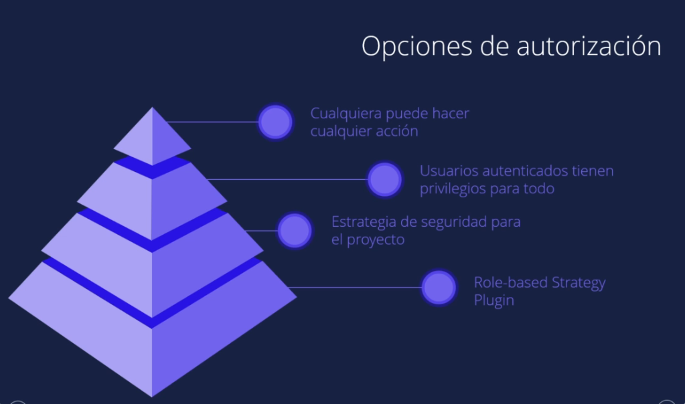

## Jenkins install

Long Term Support release
```
curl -fsSL https://pkg.jenkins.io/debian-stable/jenkins.io-2023.key | sudo tee \
  /usr/share/keyrings/jenkins-keyring.asc > /dev/null
echo deb [signed-by=/usr/share/keyrings/jenkins-keyring.asc] \
  https://pkg.jenkins.io/debian-stable binary/ | sudo tee \
  /etc/apt/sources.list.d/jenkins.list > /dev/null
sudo apt-get update
sudo apt-get install jenkins
´´´´

service jenkins start

```
Installation of Java

```
$ sudo apt update
$ sudo apt install openjdk-11-jre
$ java -version
openjdk version "11.0.12" 2021-07-20
OpenJDK Runtime Environment (build 11.0.12+7-post-Debian-2)
OpenJDK 64-Bit Server VM (build 11.0.12+7-post-Debian-2, mixed mode, sharing)
```

Unlocking Jenkins

The command: sudo cat /var/lib/jenkins/secrets/initialAdminPassword will print the password at console.

If you are running Jenkins in Docker using the official jenkins/jenkins image you can use sudo docker exec ${CONTAINER_ID or CONTAINER_NAME} cat /var/jenkins_home/secrets/initialAdminPassword to print the password in the console without having to exec into the container.

**USER DATA install jenkins EC2**

```
#!bin/bash
sudo apt update
sudo apt install openjdk-11-jdk -y

curl -fsSL https://pkg.jenkins.io/debian-stable/jenkins.io-2023.key | sudo tee \
  /usr/share/keyrings/jenkins-keyring.asc > /dev/null
echo deb [signed-by=/usr/share/keyrings/jenkins-keyring.asc] \
  https://pkg.jenkins.io/debian-stable binary/ | sudo tee \
  /etc/apt/sources.list.d/jenkins.list > /dev/null
  sudo apt-get update
  sudo apt-get install jenkins -y
```


# JENKINS #

Open source governance and community
Stability
Extensible
Visibility
Pipelines

JOB or BUILD


Pipeline

A Pipeline is a user-defined model of a CD pipeline. A Pipeline’s code defines your entire build process, which typically includes stages for building an application, testing it and then delivering it.

Also, a pipeline block is a key part of Declarative Pipeline syntax.
Node

A node is a machine which is part of the Jenkins environment and is capable of executing a Pipeline.

Also, a node block is a key part of Scripted Pipeline syntax.
Stage

A stage block defines a conceptually distinct subset of tasks performed through the entire Pipeline (e.g. "Build", "Test" and "Deploy" stages), which is used by many plugins to visualize or present Jenkins Pipeline status/progress. [6]
Step

A single task. Fundamentally, a step tells Jenkins what to do at a particular point in time (or "step" in the process). For example, to execute the shell command make use the sh step: sh 'make'. When a plugin extends the Pipeline DSL, [1] that typically means the plugin has implemented a new step.


Jenkinsfile (Declarative Pipeline)
```
pipeline {
    agent any 
    stages {
        stage('Build') { 
            steps {
                // 
            }
        }
        stage('Test') { 
            steps {
                // 
            }
        }
        stage('Deploy') { 
            steps {
                // 
            }
        }
    }
}


pipeline {
    agent any
    stages {
        stage ("Hello World"){
            steps {
                echo "Hello World"
            }
        }   
    }
}

``` 

## PIPELINE PARAMETRIZED

build with parameter
```
pipeline {
    agent any
    parameters {
        string(name: 'Greeting', defaultValue: 'Hello', description: 'How should I greet the world?')
    }
    stages {
        stage('Example') {
            steps {
                echo "${params.Greeting} World!"
            }
        }
    }
}
```
### MULTI_STEP  ###
```
pipeline {
    agent any
    stages {
        stage('Build') {
            steps {
                sh 'echo "Hello World"'
                sh '''  ### tres comillas multilinea
                    echo "Multiline shell steps works too"
                    ls -lah
                '''
            }
        }
    }
}

pipeline {
    agent any
    stages {
        stage('Build') {
            steps {
                sh 'echo "Hello World"'
            }
        }
        stage ('Build More'){
            steps {
                sh '''
                echo "Multiline shell steps works too"
                ls -lah
                '''
            }
        }
    }
}
```
## TIME OUT
```
pipeline {
    agent any
    stages {
        stage('Deploy') {
            steps {
                timeout(time: 1, unit: 'MINUTES') {
                    sh '/var/jenkins_home/scripts/fibonacci.sh 5'
                }
                timeout(time: 1, unit: 'MINUTES') {
                    sh '/var/jenkins_home/scripts/fibonacci.sh 32'
                }
            }
        }
    }
}
```
##  TRACKIN BUILD STATE

ingresar al build revisar console output or logs

## SCM POLL

Pipeline definition Pipeline script from SCM
SCM Git
URL
credentials if no public
branch

BUILD TRIGGER = POLLING SCM
y poner formato crontab

MIN HOUR DOM MON DOW CMD

Crontab Fields and Allowed Ranges (Linux Crontab Syntax)

|Field  |  Description |   Allowed Value|
|-|-|-|
|MIN     | Minute field |   0 to 59
|HOUR   |  Hour field    |  0 to 23
|DOM   |   Day of Month   | 1-31
|MON  |    Month field     |1-12
|DOW |     Day Of Week    | 0-6
|CMD|      Command        | Any command to be executed.

## WEBHOOK BUILD TRIGGEring

se debe agregar plan text del github con permisos en el repo y en el webhook

branch source bil configuration jenkinsfile


Cómo hacer Reset de la contraseña de Jenkins

En este procedimiento vamos a ver como resetear la clave del administrador de Jenkins, por si algunos se le ha olvidado, es un procedimiento bastante simple así que con solo seguir los pasos lo lograremos sin mayores dificultades.

1- Antes que nada vamos a tocar el archivo config.xml así que te recomiendo hacer una copia por las dudas que algo se rompa.

cp /var/lib/jenkins/config.xml /var/lib/jenkins/config.xml.back

2- Editamos el archivo

nano /var/lib/jenkins/config.xml

Y vamos a cambiar un valor, true por false

<useSecurity>false</useSecurity>

Guardamos y reiniciamos el servicio de jenkins

systemctl restart jenkins

3- Vamos a la interface web y colocamos la dirección nuevamente, en mi caso http://localhost:8080

    Vamos a"Manage Jenkins" > "Security" > "Configure Global Security" > "Security"
    Seleccionamos use Jenkins user database click en "Save"
    Ahora vamos a "People" > Click en el usuario admin por ejemplo, colocamos la nueva contraseña y clic en "Save"
na vez terminado podemos volvar a usar el archivo original /var/lib/jenkins/config.xml y reiniciar el servicio de Jenkins:

mv /var/lib/jenkins/config.xml.back /var/lib/jenkins/config.xml
systemctl restart jenkins

Volvemos a iniciar la aplicación para validar que todo este correcto.
__________________________

Q1: Explain the master-slave architecture in Jenkins

Jenkins master pulls the code from the remote GitHub repository every time there is a code commit
Every slave node has a label associate with it
Master distributes the workload to all the Jenkins slaves
We can run a specific pipeline on a particular node by defining a label in the pipeline code

Q2: What is Jenkinsfile?

Jenkinsfile contains the definition of a Jenkins pipeline and is checked into the source control repository. It is a text file.

Q3: Explain the two types of pipelines in Jenkins

- Scripted Pipeline: It is based on Groovy script as their Domain Specific Language. One or more node blocks do the core work throughout the entire pipeline.
Executes the pipeline or any of its stages on any available agent
Defines the build stage
Performs steps related to the building stage
- Declarative Pipeline: It provides a simple and friendly syntax to define a pipeline. Here, the pipeline block represents the work done throughout the pipeline.
Executes the pipeline or any of its stages on any available agent
Defines the build stage
Performs steps related to the build stage
Q4: What is build in Jenkins?

In Jenkins, a “build” refers to the process of compiling, testing, and packaging source code to create a deliverable software artifact.
Source Code Retrieval: Fetch the code from the git repository
Build Execution: Start executing the code
Testing: Start testing the code
Packaging: Start packaging the code and store it in the artifactory
Artifact Archiving: Archive the artifactes after sometime
Notification: Send notification in the slack channel or over mail
Q5: How you will check the generated artifact/logs/Zar file in Jenkins?

If the Jenkins job has generated any artifacts then it has an Artifacts section in that
Alternatively, you can ssh into the Jenkins server, and from JENKINS_HOME/workspace/<Your_Job_Name>/ path you can download the artifact

Q6: How Jenkins can fetch the github or GitLab’s repository?

In order for Jenkins to checkout the github or GitLab’s repository we need to install the Git plugin.
We need to create the access token in the github or Gitlab and for that token we need to provide the credentials in Jenkins so that using that token Jenkins can perform the action.

Q7: How to automate the access token rotation in the GitLab and apply the new token in Jenkins?

We can use the GitLab’s API and use the GET method to get the access token and we can implement a script in which we need to rotate the token and then we need to use the Jenkins API and perform the POST method to apply the new token over there.

Q8: What is Jenkins’s shared library?

A Jenkins Shared Library is a powerful feature of the Jenkins automation server that allows you to define reusable code and functionality that can be shared across multiple Jenkins pipelines and projects.

Q9: What is the significance of stages in Jenkins?

Stages allow you to organize your pipeline into logical sections. For example, you might have stages like “Build,” “Test,” “Deploy to Staging,” and “Deploy to Production.” Each stage represents a specific phase of your software delivery process.
Within a pipeline, stages can be defined to run in parallel. This is useful when you have tasks that can be executed simultaneously, thus speeding up the overall pipeline execution time.
Stages can also be used to implement conditional logic. Depending on the outcome of a previous stage, you can decide whether to proceed with the subsequent stages or terminate the pipeline.
By breaking down the pipeline into stages, it becomes easier to identify which stage failed if a failure occurs during pipeline execution. This helps in quickly diagnosing and fixing issues.
Stages can be configured to send notifications when they start or complete, making it easier to track the progress of the pipeline. Additionally, you can generate reports or artifacts at different stages to capture relevant information.
Q10: What are the general plugins in Jenkins?

Source Code Management (SCM) Plugins: These plugins enable Jenkins to integrate with version control systems like Git, Subversion, Mercurial, etc., allowing it to pull source code from repositories for building and testing.
Build Tool Plugins: Jenkins can be integrated with build tools such as Apache Maven, Gradle, Ant, and others.
Testing and Reporting Plugins: Jenkins offers plugins for various testing frameworks like JUnit, TestNG, NUnit, and more.
Deployment Plugins: Plugins for deploying applications to different environments, including application servers, cloud platforms, and container orchestration systems like Docker, Kubernetes, AWS, etc.
Notification Plugins: These plugins provide options for sending notifications and alerts via email, Slack, HipChat, or other messaging platforms to inform team members about build and deployment statuses.
Authentication and Authorization Plugins: Jenkins supports various authentication mechanisms, and plugins can be used to integrate with external authentication providers, like LDAP, Active Directory, OAuth, etc.
Monitoring and Visualization Plugins: Plugins that offer monitoring dashboards, visualizations, and reporting for build and deployment activities.
Artifacts and Dependency Management Plugins: Plugins for managing build artifacts, dependencies, and publishing artifacts to artifact repositories.
Integration Plugins: Plugins to integrate Jenkins with other tools, services, and platforms, such as GitHub, Bitbucket, JIRA, SonarQube, Artifactory, etc.
Q11: What are some of the default environmental variables in Jenkins?

$JOB_NAME — The name that you give your job when it is first set up.
$NODE_NAME — This is the name of the node on which the current build is running.
$WORKSPACE — Refers to the path of the workspace
$BUILD_URL — Indicates the URL where the results of the builds can be found.
$JENKINS_URL — This is set to the URL of the Jenkins master that is responsible for running the build.
Q12: How do you store credentials in Jenkins securely?

Credentials can be stored securely in Jenkins using the Credentials plugin, which stores different types of credentials like — Username with a password, SSH username with the private key, AWS Credentials, Jenkins Build Token, Secret File/Text, X509 & other certificates, Vault related credentials securely with proper encryption & decryption as and when required.
Q13: How does Jenkins know when to execute a Scheduled job/pipeline and how it is triggered?

The Jenkins master will have the cron entries set up for the jobs as per the scheduled job configurations. As and when the time for a particular job comes, it commands agents (based on the configuration of the job) to execute the job with the required configurations.
Q14: What are executors and how many executors do we get by default?

Executors define how many jobs we can run in parallel. By default we get 2 executors but we can also increase that number

Q15: From one server to another, how do you copy or move your Jenkins jobs?

First, we need to copy our jobs directory from the old to the new server. There are multiple ways to do it. We can either move the job from the installation by simply copying the corresponding job directory or we can make a clone of the job directory by making an existing job’s copy. For this, we need to have a different name, which we can rename later.
________________

|| Questions ||
What’s the difference between continuous integration, continuous delivery, and continuous deployment?
Continuous IntegrationContinuous DeliveryContinuous DeploymentThe practice of merging development work with the main branch continuously.Continuous delivery of code to an environment once the code is ready to ship. This could be staging or production. The idea is the product is delivered to a user base, which can be QAs or customers for review and inspection.The deployment or release of code to production as soon as it is ready.

2. Benefits of CI/CD

CI/CD (Continuous Integration/Continuous Deployment) streamlines development and delivery processes, offering benefits like faster releases, reduced manual errors, increased collaboration and improved quality through automated testing.

3.What is meant by CI-CD?

CI/CD stands for Continuous Integration and Continuous Deployment. It’s a set of practices that automate software build, testing, and deployment processes, ensuring frequent and reliable releases.

4. What is Jenkins Pipeline?
Jenkins Pipeline is a suite of plugins that allows defining and automating a CI/CD process in code. It enables building, testing, and deploying applications using declarative or scripted pipelines.

5.How do you configure the job in Jenkins?

In Jenkins, you configure a job by specifying the project details, source code repository, build steps, triggers, post-build actions, and other settings through the Jenkins web interface.

6. Where do you find errors in Jenkins?

Errors in Jenkins can be found in the console output of the build jobs. Navigate to the build job’s page and check the console output for error messages.

7. In Jenkins how can you find log files?

Jenkins build logs can be found in the build job’s workspace. Navigate to the specific build, and you’ll find a “Console Output” link. Additional logs might be available based on your job’s configuration.

8. Jenkins workflow and write a script for this workflow?

Jenkins workflow refers to the sequence of stages, steps, and actions that automate the software delivery process. Writing a Jenkins pipeline script involves defining stages, steps, and using Jenkinsfile to automate the workflow.

9. How to create a continuous deployment in Jenkins?

Continuous deployment in Jenkins involves creating a pipeline that automates the entire deployment process. Define stages for building, testing, and deploying the application. Trigger the pipeline on code changes or other events.

10. How to build a job in Jenkins?

To build a job in Jenkins, define the job’s configuration, including source code repository, build steps, triggers, and post-build actions. Jenkins will automatically build the job based on the configuration.

11. Why do we use a pipeline in Jenkins?

Pipelines in Jenkins provide a structured and automated way to define, visualize, and manage the entire CI/CD process. It allows versioning, code review, and easy replication of complex workflows.

12.Is Only Jenkins enough for automation?

Jenkins is a powerful automation tool, but depending on your needs, you might use it in conjunction with other tools like version control systems, testing frameworks, containerization, and orchestration tools for a complete automation solution.

13.How will you handle secrets?

Secrets should be managed securely. Jenkins provides plugins like “Credentials Plugin” to store and manage secrets, passwords, and API keys. Use these plugins to ensure sensitive data is properly encrypted.

14. Explain diff stages in CI-CD setup.

CI/CD stages typically include building, testing, packaging, deploying, and monitoring. Each stage represents a specific step in the software delivery pipeline.

15. Name some of the plugins in Jenkins.

Some popular Jenkins plugins include:
- Git Plugin
- Docker Pipeline
- Slack Notification
- JUnit Plugin
- SonarQube Scanner
- Blue Ocean (for enhanced pipeline visualization).

_______________________


_______________________________

# La guia de Jenkins de cero a experto 

Jenkins es una herramienta CI/CD de fuente abierta escrita en java

es una aplicacion basada en servidor y requiere un servicdor web como apache tomcat


## Arquitectura jenkins

**jenkins job:** tareas ejecutables qeu son supervisadas y controladas por jenkins

### Master and Slave


jenkins executor


un nodo puede tener uno o más ejecutores

https://automatenow.io/jenkins-master-slave-architecture/#:~:text=Jenkins%20Master%2DSlave%20architecture%20allows,and%20accelerating%20the%20build%20process.

https://medium.com/edureka/jenkins-interview-questions-7bb54bc8c679

**Throttle Build** es una característica útil en Jenkins que te permite gestionar de manera eficiente la ejecución de construcciones, evitando la sobrecarga del servidor y optimizando el uso de recursos compartidos.

La función Throttle Build se basa en la configuración de "períodos de espera" (wait periods) y "capacidades" (capacities) para cada tipo de build o proyecto. Veamos cómo funciona con un ejemplo:

Supongamos que tienes dos proyectos en Jenkins que comparten recursos y quieres limitar la cantidad de construcciones simultáneas que pueden ejecutarse en ellos.

Ejemplo:
Proyecto A:
Debe permitirse solo una construcción simultánea.
Si una construcción está en curso, la siguiente debe esperar.
Proyecto B:
Puede tener hasta tres construcciones simultáneas.
Si las tres construcciones están en curso, las siguientes deben esperar.
Para lograr esto, configurarías Throttle Build de la siguiente manera:

Configuración de Throttle Build para Proyecto A:

Capacity: 1
Throttle Category: Proyecto_A
Configuración de Throttle Build para Proyecto B:

Capacity: 3
Throttle Category: Proyecto_B
Ahora, cuando se inicia una construcción en cualquiera de los proyectos:

Si Proyecto A está en construcción y alguien intenta iniciar otra construcción, la segunda construcción se quedará en espera hasta que la construcción en Proyecto A se complete.
Si Proyecto B ya tiene tres construcciones en curso y alguien intenta iniciar una cuarta construcción, la cuarta construcción se quedará en espera hasta que al menos una de las construcciones en Proyecto B se complete y se libere una ranura de construcción.


## Seguridad Jenkins





para cambair autorizacion


remover estrategias de autorizacion para abrir todo a todos


la recomendable


## Automatizando con jenkins


### Jenkins job DSL

Jenkins DSL es una manera de programar con codigo el job

el plugin jenkin job DSL es utilizado para definir y construir jobs en una forma programable con los archivos de codigo

los usuarios pueden describir su job utilizando groovy base script lo que simplifica la manera d emanejar los jobs

#### Seed Job and description

para utilizar el plugin DSL, primerop se debe crear un seed job

**Seed Job** es un job de jenkins que ejecuta un codigo DSL y por medio de ese código se genera un nuevo job con los requerimientos establecidos

En Jenkins, un "job seed" se refiere a un tipo especial de trabajo (o job) que se utiliza para crear y configurar dinámicamente otros trabajos en Jenkins. En lugar de tener que crear manualmente cada trabajo y configurar sus características, un job seed automatiza este proceso al definir un conjunto de reglas y plantillas para la creación de trabajos.

Aquí te explico cómo se usa un job seed y te doy un ejemplo básico:

Uso de un Job Seed en Jenkins:
Definir el Job Seed: En Jenkins, creas un nuevo job y lo configuras como un job seed. Este job seed contendrá el código o la lógica que se utilizará para crear otros trabajos.

Escribir el código de configuración: En el job seed, puedes utilizar scripts, configuración en DSL (Domain Specific Language), o cualquier otro método compatible con Jenkins para definir cómo se deben crear y configurar los trabajos secundarios. Puedes incluir lógica condicional, bucles y cualquier otra funcionalidad que necesites para personalizar la creación de trabajos.

Ejecutar el Job Seed: Después de definir el job seed y su lógica de configuración, lo ejecutas. Durante la ejecución, el job seed creará dinámicamente los trabajos secundarios según las reglas que hayas definido.

Actualización y mantenimiento: Puedes actualizar y mantener el job seed según sea necesario. Si cambian los requisitos para la creación de trabajos, puedes modificar el job seed en lugar de actualizar manualmente cada trabajo individualmente.

https://jenkinsci.github.io/job-dsl-plugin/#

## Pipelines

jenkins pipeline nos da la capacidad de escribir los build steps en forma de codigo (build, test, deploy)

jenkins job dsl crea nuevos jobs basados en el codio proporcionado mientras jenkins pipeline es un tipo de job que se puede encargar del ciclo completo de : buid, test, deploy de un proyecto

se puede utilizar DSL para crear nuevos pipelines jobs


### Jenkins file

jenkinsfile es un archivo en forma de codigo que contiene el flujo completo del proceso y puede ser manejado con control de version (SCM)


**PIPELINE** es el bloque que define todo el contenido, el proceso entero de las etapas de un jenkinsfile

**AGENT** se encarga de indicarle a jenkins que asigne un ejecutor a las compilaciones y un espacio de trabajo para el pipeline

**Node** es una maquina que ejecuta el flujo de trabajo completo del pipeline

**Any** referido a ejecutar el pipeline o la etapa determinada en cualqueir agente disponible

**Stages** este bloque del archivo contiene todo el trabajo necesario para el proyecto, puede constar de diferentes etapas, donde en cada una se llevará a cabo una tarea o tareas especificas

**Steps** dentro de una etapa, tenemos los pasos definidos para llevar a cabo la tarea del bloque,  puede ser 1 paso o mas y se especifican en orden para su ejecucion


https://www.jenkins.io/doc/pipeline/tour/running-multiple-steps/

### Sequential Stages
Stages in Declarative Pipeline may have a stages section containing a list of nested stages to be run in sequential order.

A stage must have one and only one of steps, stages, parallel, or matrix. It is not possible to nest a parallel or matrix block within a stage directive if that stage directive is nested within a parallel or matrix block itself. However, a stage directive within a parallel or matrix block can use all other functionality of a stage, including agent, tools, when, etc.


### Parallel
Stages in Declarative Pipeline may have a parallel section containing a list of nested stages to be run in parallel.

A stage must have one and only one of steps, stages, parallel, or matrix. It is not possible to nest a parallel or matrix block within a stage directive if that stage directive is nested within a parallel or matrix block itself. However, a stage directive within a parallel or matrix block can use all other functionality of a stage, including agent, tools, when, etc.
In addition, you can force your parallel stages to all be aborted when any one of them fails, by adding failFast true to the stage containing the parallel. Another option for adding failfast is adding an option to the pipeline definition: parallelsAlwaysFailFast().

### Option: timeout and retry

The "Deploy" stage retries the flakey-deploy.sh script 3 times, and then waits for up to 3 minutes for the health-check.sh script to execute. If the health check script does not complete in 3 minutes, the Pipeline will be marked as having failed in the "Deploy" stage.

```
Jenkinsfile (Declarative Pipeline)
pipeline {
    agent any
    stages {
        stage('Deploy') {
            steps {
                retry(3) {
                    sh './flakey-deploy.sh'
                }

                timeout(time: 3, unit: 'MINUTES') {
                    sh './health-check.sh'
                }
            }
        }
    }
}
```
### ENV Variable and credentials

The environment directive specifies a sequence of key-value pairs which will be defined as environment variables for all steps, or stage-specific steps, depending on where the environment directive is located within the Pipeline.

This directive supports a special helper method credentials() which can be used to access pre-defined Credentials by their identifier in the Jenkins environment.

Supported Credentials Type
Secret Text
The environment variable specified will be set to the Secret Text content.

Secret File
The environment variable specified will be set to the location of the File file that is temporarily created.

Username and password
The environment variable specified will be set to username:password and two additional environment variables will be automatically defined: MYVARNAME_USR and MYVARNAME_PSW respectively.

SSH with Private Key
The environment variable specified will be set to the location of the SSH key file that is temporarily created and two additional environment variables will be automatically defined: MYVARNAME_USR and MYVARNAME_PSW (holding the passphrase).

Unsupported credentials type causes the pipeline to fail with the message: org.jenkinsci.plugins.credentialsbinding.impl.CredentialNotFoundException: No suitable binding handler could be found for type <unsupportedType>.

```
pipeline {
    agent any
    environment { 
        SECRET_TEXT = credentials('USUARIO50')
    }
    stages {
        stage('Ejemplo para Secret Text') {
            steps {
                sh 'echo $SECRET_TEXT'
            }
        }
    }
}
```
### Params and Input

- **Params** the parameters directive provides a list of parameters that a user should provide when triggering the Pipeline. The values for these user-specified parameters are made available to Pipeline steps via the params object, refer to the Parameters, Declarative Pipeline for its specific usage.

Each parameter has a Name and Value, depending on the parameter type. This information is exported as environment variables when the build starts, allowing subsequent parts of the build configuration to access those values. For example, use the ${PARAMETER_NAME} syntax with POSIX shells like bash and ksh, the ${Env:PARAMETER_NAME} syntax with PowerShell, or the %PARAMETER_NAME% syntax with

Available Parameters
string
A parameter of a string type, for example: parameters { string(name: 'DEPLOY_ENV', defaultValue: 'staging', description: '') }.

text
A text parameter, which can contain multiple lines, for example: parameters { text(name: 'DEPLOY_TEXT', defaultValue: 'One\nTwo\nThree\n', description: '') }.

booleanParam
A boolean parameter, for example: parameters { booleanParam(name: 'DEBUG_BUILD', defaultValue: true, description: '') }.

choice
A choice parameter, for example: parameters { choice(name: 'CHOICES', choices: ['one', 'two', 'three'], description: '') }. The first value is the default.

password
A password parameter, for example: parameters { password(name: 'PASSWORD', defaultValue: 'SECRET', description: 'A secret password') }.

```
pipeline {
    agent any
    parameters {
        string(name: 'PERSON', defaultValue: 'Mr Jenkins', description: 'Who should I say hello to?')

        text(name: 'BIOGRAPHY', defaultValue: '', description: 'Enter some information about the person')

        booleanParam(name: 'TOGGLE', defaultValue: true, description: 'Toggle this value')

        choice(name: 'CHOICE', choices: ['One', 'Two', 'Three'], description: 'Pick something')

        password(name: 'PASSWORD', defaultValue: 'SECRET', description: 'Enter a password')
    }
    stages {
        stage('Example') {
            steps {
                echo "Hello ${params.PERSON}"

                echo "Biography: ${params.BIOGRAPHY}"

                echo "Toggle: ${params.TOGGLE}"

                echo "Choice: ${params.CHOICE}"

                echo "Password: ${params.PASSWORD}"
            }
        }
    }
}
```
- **input** 
The input directive on a stage allows you to prompt for input, using the input step. The stage will pause after any options have been applied, and before entering the agent block for that stage or evaluating the when condition of the stage. If the input is approved, the stage will then continue. Any parameters provided as part of the input submission will be available in the environment for the rest of the stage.

Configuration options
message
Required. This will be presented to the user when they go to submit the input.

id
An optional identifier for this input. The default value is based on the stage name.

ok
Optional text for the "ok" button on the input form.

submitter
An optional comma-separated list of users or external group names who are allowed to submit this input. Defaults to allowing any user.

submitterParameter
An optional name of an environment variable to set with the submitter name, if present.

parameters
An optional list of parameters to prompt the submitter to provide. Refer to parameters for more information.

```
pipeline {
    agent any
    stages {
        stage('Example') {
            input {
                message "Should we continue?"
                ok "Yes, we should."
                submitter "alice,bob"
                parameters {
                    string(name: 'PERSON', defaultValue: 'Mr Jenkins', description: 'Who should I say hello to?')
                }
            }
            steps {
                echo "Hello, ${PERSON}, nice to meet you."
            }
        }
    }
}
```

_________________

¡Claro! Jenkins es una herramienta de automatización de código abierto que se utiliza principalmente para automatizar tareas relacionadas con la construcción, prueba y despliegue de software. Los "items" en Jenkins son los elementos fundamentales que permiten configurar y ejecutar diferentes tipos de tareas en Jenkins. Aquí tienes una explicación detallada de algunos de los items más comunes en Jenkins:

1. **Freestyle Project:**
   - Este es el tipo de item más básico en Jenkins.
   - Permite configurar acciones personalizadas y tareas de construcción.
   - Ejemplo: Puedes configurar un proyecto Freestyle para compilar un código fuente, ejecutar pruebas unitarias y desplegar la aplicación en un servidor de pruebas.

2. **Pipeline:**
   - Una pipeline en Jenkins es una serie de pasos que permiten definir, construir, probar y desplegar aplicaciones de forma automatizada.
   - Las pipelines pueden definirse utilizando un script declarativo o un script de estilo Groovy.
   - Ejemplo: Una pipeline puede incluir pasos como clonar un repositorio de código, compilar el código, ejecutar pruebas automatizadas, y si las pruebas pasan, desplegar la aplicación en un entorno de producción.

3. **Multibranch Pipeline:**
   - Este item está diseñado para proyectos que tienen múltiples ramas de código.
   - Crea una pipeline para cada rama del repositorio, lo que permite construir, probar y desplegar cada rama de forma independiente.
   - Ejemplo: Si tienes un repositorio Git con ramas para desarrollo, pruebas y producción, puedes configurar un Multibranch Pipeline para que Jenkins construya y pruebe cada rama automáticamente.

4. **GitHub Organization:**
   - Permite que Jenkins descubra, construya y pruebe automáticamente los repositorios dentro de una organización de GitHub.
   - Crea pipelines para cada repositorio dentro de la organización de GitHub.
   - Ejemplo: Si tienes una organización de GitHub con varios repositorios para diferentes proyectos, puedes configurar un GitHub Organization item para automatizar el proceso de construcción y prueba de cada repositorio.

5. **Agente (Agent):**
   - Los agentes en Jenkins son máquinas o entornos que ejecutan las tareas definidas en los items de Jenkins.
   - Pueden ser máquinas físicas, máquinas virtuales o contenedores.
   - Ejemplo: Puedes configurar un agente en una máquina con ciertas herramientas y dependencias específicas para que Jenkins pueda ejecutar tareas de construcción y prueba en ese entorno aislado.

Estos son solo algunos ejemplos de items comunes en Jenkins y cómo se utilizan en escenarios típicos de desarrollo de software. Cada uno de estos items ofrece diferentes capacidades y flexibilidad para automatizar el proceso de desarrollo y despliegue de aplicaciones.
_________________________
¡Claro! Configurar un agente de Docker para Jenkins te permite ejecutar tareas de construcción y prueba en contenedores Docker de forma aislada y reproducible. Aquí te explico cómo hacerlo:

1. **Instala Docker:**
   - Asegúrate de tener Docker instalado en la máquina donde estás ejecutando Jenkins. Puedes instalar Docker siguiendo las instrucciones en el sitio web oficial de Docker.

2. **Configura el entorno de Jenkins:**
   - Accede al panel de administración de Jenkins en tu navegador web.
   - Ve a "Manage Jenkins" (Administrar Jenkins) > "Manage Nodes and Clouds" (Administrar nodos y nubes).

3. **Agrega un nuevo nodo:**
   - Haz clic en "New Node" (Nuevo nodo) o "New Agent" (Nuevo agente), dependiendo de la versión de Jenkins que estés utilizando.

4. **Configura el nodo de Docker:**
   - Proporciona un nombre para el nodo y selecciona "Permanent Agent" (Agente permanente).
   - Haz clic en "OK" (Aceptar) para continuar.

5. **Configura las propiedades del agente:**
   - En la sección "Remote root directory" (Directorio raíz remoto), puedes dejar el valor predeterminado o especificar un directorio personalizado donde Jenkins almacenará los archivos del proyecto en el agente.

6. **Especifica el método de lanzamiento:**
   - Selecciona "Launch agent via execution of command on the master" (Lanzar agente a través de la ejecución de un comando en el maestro).
   - En el campo "Command" (Comando), ingresa el comando para iniciar el agente Docker. Por ejemplo:
     ```
     docker run -i --rm -v /var/run/docker.sock:/var/run/docker.sock jenkins/inbound-agent
     ```

   - Este comando ejecutará un contenedor Docker que actuará como agente de Jenkins y se conectará al servidor principal de Jenkins.

7. **Guarda la configuración del nodo:**
   - Haz clic en "Save" (Guardar) para guardar la configuración del nodo.

Una vez configurado, Jenkins iniciará el contenedor Docker cuando sea necesario para ejecutar tareas de construcción y prueba. El agente Docker estará disponible para realizar trabajos según sea necesario y se detendrá automáticamente cuando no esté en uso.

Es importante tener en cuenta que este ejemplo utiliza la imagen `jenkins/inbound-agent` como base para el agente Docker. Puedes ajustar la configuración según tus necesidades específicas, como montar volúmenes adicionales o utilizar imágenes de agentes personalizadas.

### Triggers and tools

**triggers** 
The triggers directive defines the automated ways in which the Pipeline should be re-triggered. For Pipelines which are integrated with a source such as GitHub or BitBucket, triggers may not be necessary as webhooks-based integration will likely already be present. The triggers currently available are cron, pollSCM and upstream.

cron
Accepts a cron-style string to define a regular interval at which the Pipeline should be re-triggered, for example: triggers { cron('H */4 * * 1-5') }.

pollSCM
Accepts a cron-style string to define a regular interval at which Jenkins should check for new source changes. If new changes exist, the Pipeline will be re-triggered. For example: triggers { pollSCM('H */4 * * 1-5') }

upstream
Accepts a comma-separated string of jobs and a threshold. When any job in the string finishes with the minimum threshold, the Pipeline will be re-triggered. For example: triggers { upstream(upstreamProjects: 'job1,job2', threshold: hudson.model.Result.SUCCESS) }

**tools**
A section defining tools to auto-install and put on the PATH. This is ignored if agent none is specified.

Supported Tools

maven
jdk
gradle

	The tool name must be pre-configured in Jenkins under Manage Jenkins → Tools.

```
pipeline {
    agent any
    tools {
        maven 'apache-maven-3.0.1'
    }
    stages {
        stage('Example') {
            steps {
                sh 'mvn --version'
            }
        }
    }
}
```

### Post

The post section defines one or more additional steps that are run upon the completion of a Pipeline’s or stage’s run (depending on the location of the post section within the Pipeline). post can support any of the following post-condition blocks: always, changed, fixed, regression, aborted, failure, success, unstable, unsuccessful, and cleanup. These condition blocks allow the execution of steps inside each condition depending on the completion status of the Pipeline or stage. The condition blocks are executed in the order shown below.

Conditions

always
Run the steps in the post section regardless of the completion status of the Pipeline’s or stage’s run.

changed
Only run the steps in post if the current Pipeline’s run has a different completion status from its previous run.

fixed
Only run the steps in post if the current Pipeline’s run is successful and the previous run failed or was unstable.

regression
Only run the steps in post if the current Pipeline’s or status is failure, unstable, or aborted and the previous run was successful.

aborted
Only run the steps in post if the current Pipeline’s run has an "aborted" status, usually due to the Pipeline being manually aborted. This is typically denoted by gray in the web UI.

failure
Only run the steps in post if the current Pipeline’s or stage’s run has a "failed" status, typically denoted by red in the web UI.

success
Only run the steps in post if the current Pipeline’s or stage’s run has a "success" status, typically denoted by blue or green in the web UI.

unstable
Only run the steps in post if the current Pipeline’s run has an "unstable" status, usually caused by test failures, code violations, etc. This is typically denoted by yellow in the web UI.

unsuccessful
Only run the steps in post if the current Pipeline’s or stage’s run has not a "success" status. This is typically denoted in the web UI depending on the status previously mentioned (for stages this may fire if the build itself is unstable).

cleanup
Run the steps in this post condition after every other post condition has been evaluated, regardless of the Pipeline or stage’s status.

```
pipeline {
    agent any
    stages {
        stage('Example') {
            steps {
                echo 'Hello World'
            }
        }
    }
    post {
        always {
            echo 'I will always say Hello again!'
        }
    }
}
```

## Configuracion Slaves


cat id_rsa.pub > authorized_keys

### Configurar JNLP

Para instalar un nodo esclavo de Jenkins utilizando JNLP (Java Network Launch Protocol), sigue estos pasos:

1. **Descargar e instalar Java**: Asegúrate de que Java esté instalado en la máquina donde deseas configurar el nodo esclavo. Jenkins requiere Java para ejecutar tanto el servidor principal como los nodos esclavos.

2. **Configurar el entorno del nodo esclavo**:
   - Abre un terminal o símbolo del sistema en la máquina donde deseas instalar el nodo esclavo.
   - Descarga la versión del agente de Jenkins que corresponda con la versión del servidor principal de Jenkins. Puedes encontrarlo en la página de descargas de Jenkins.
   - Descomprime el archivo del agente en una ubicación de tu elección en el sistema.

3. **Configurar el nodo esclavo en Jenkins**:
   - En el servidor principal de Jenkins, ve a la página de administración.
   - Haz clic en "Administrar nodos".
   - Haz clic en "Nuevo nodo".
   - Ingresa un nombre para el nodo esclavo y selecciona "Esclavo con conexión a través de Java Web Start".
   - Haz clic en "OK".

4. **Configurar el cliente JNLP en el nodo esclavo**:
   - En la máquina donde instalaste el nodo esclavo, navega al directorio donde descomprimiste el archivo del agente de Jenkins.
   - Dentro de este directorio, encontrarás un archivo JAR llamado `agent.jar`. Ejecuta este archivo usando Java. Por ejemplo:
     ```
     java -jar agent.jar -jnlpUrl http://<URL del servidor de Jenkins>/computer/<nombre del nodo esclavo>/slave-agent.jnlp -secret <clave secreta>
     ```
     Reemplaza `<URL del servidor de Jenkins>` con la URL de tu servidor principal de Jenkins y `<nombre del nodo esclavo>` con el nombre que le diste al nodo esclavo en Jenkins. La `<clave secreta>` es proporcionada durante la configuración del nodo esclavo en Jenkins.

5. **Verificar la conexión**: Una vez que ejecutes el comando, el nodo esclavo intentará conectarse al servidor principal de Jenkins utilizando JNLP. Si la configuración es correcta, deberías ver que el nodo esclavo aparece en la página de administración de nodos de Jenkins y se muestra como "Online".

Este proceso instalará y configurará un nodo esclavo de Jenkins que se conecta al servidor principal utilizando JNLP. Es importante asegurarte de que los puertos necesarios estén abiertos en tu entorno para permitir la comunicación entre el nodo esclavo y el servidor principal.

________________________

## Job

un "job" en Jenkins es una unidad básica de trabajo que ejecuta un conjunto de acciones automatizadas. Estas acciones pueden incluir tareas como la compilación de código fuente, la ejecución de pruebas automatizadas, el análisis estático de código, la generación de artefactos, el despliegue de aplicaciones, entre otros.

Los jobs en Jenkins son esenciales para establecer prácticas de integración continua (CI) y entrega continua (CD), ya que permiten automatizar y gestionar todo el proceso de desarrollo de software, desde la compilación hasta el despliegue, de manera eficiente y reproducible.

Cada job en Jenkins tiene su propia configuración, que incluye detalles como la ubicación del repositorio de código fuente, las instrucciones para la compilación y las pruebas, los pasos de post-procesamiento, las notificaciones, y más. Estas configuraciones se definen en el panel de configuración del job dentro del entorno de Jenkins.

Los jobs se pueden ejecutar manualmente por un usuario o pueden ser activados automáticamente por eventos, como cambios en el repositorio de código fuente (utilizando la opción "poll SCM"), temporizadores programados, o desencadenadores externos.

En resumen, un job en Jenkins representa una tarea automatizada que lleva a cabo una serie de acciones específicas dentro del proceso de desarrollo de software, contribuyendo así a la automatización y mejora de la eficiencia en el ciclo de vida del desarrollo de software.

________________

## POLL SCM

Claro, "poll SCM" en Jenkins es una característica que permite a Jenkins verificar periódicamente un repositorio de control de versiones (como Git, Subversion, Mercurial) en busca de cambios. Cuando se habilita la opción "poll SCM" para un job específico, Jenkins consulta el repositorio según el horario configurado y verifica si ha habido cambios desde la última construcción. Si se detectan cambios, Jenkins inicia una nueva construcción del job.

El propósito de "poll SCM" es automatizar el proceso de construcción y pruebas en respuesta a los cambios en el código fuente. Esto ayuda a garantizar que las nuevas implementaciones se integren de manera rápida y eficiente en el ciclo de desarrollo y pruebas.

Aquí tienes un ejemplo de cómo se usa "poll SCM" en Jenkins:

Supongamos que tienes un proyecto de desarrollo de software almacenado en un repositorio Git. Quieres configurar un job en Jenkins para que construya y pruebe automáticamente el proyecto cada vez que se realicen cambios en el repositorio.

1. Creas un job en Jenkins para el proyecto y configurarlo para que utilice Git como el sistema de control de versiones.

2. En la configuración del job, activas la opción "Poll SCM" y estableces un intervalo de tiempo (por ejemplo, cada 5 minutos).

3. Cuando se activa el job, Jenkins consulta el repositorio Git cada 5 minutos para ver si ha habido cambios desde la última construcción.

4. Si Jenkins detecta cambios en el repositorio (por ejemplo, nuevos commits), inicia una nueva construcción del job automáticamente.

5. El job ejecuta las tareas de compilación, pruebas y cualquier otra acción definida en su configuración.

Este es un ejemplo básico de cómo se utiliza "poll SCM" en Jenkins para automatizar la integración continua en un proyecto de desarrollo de software. Esta característica es útil para garantizar que los equipos de desarrollo puedan mantenerse al tanto de los cambios en el código y realizar pruebas regulares para garantizar la estabilidad y la calidad del software.