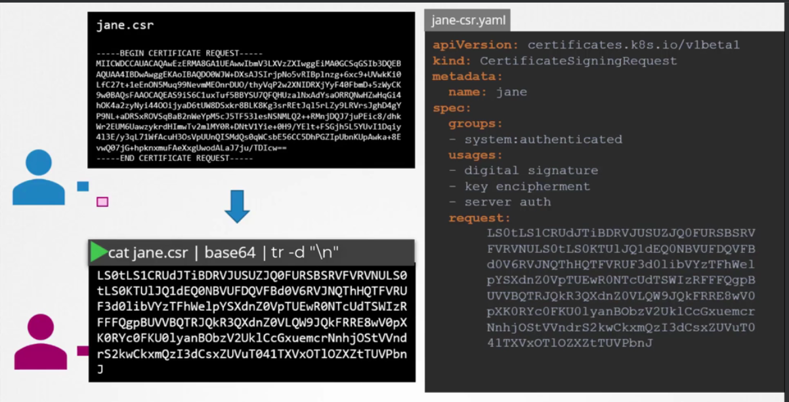
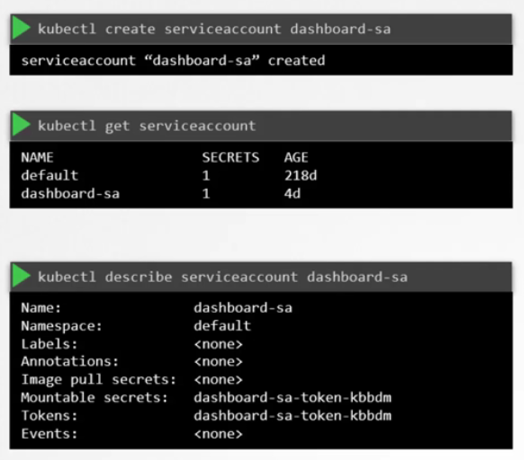

# Kubernetes

Open source container orchestration tool

developed by google
helps manage containerized applications in differen deployment environment

high availability or no dowtime

scalability or high performance

disaster recovery backuo and restore

## KUBERNETES ARCHITECTURE

- api server: entrypoint to K8s cluster, expose Kubernetes API

- controller manager: keeps track of whats happening in the cluster (node controller, replication controller, endpoint controller, service account and token controllers)

- Scheduler: ensures pods placement

- etcd: kubernetes backing store, key value store for critical cluster info

- si se desplega en nube se adiciona un nuevo elemento el cloud controller manager 

NODE PROCESS

each node has multiple POD in it

3 processes must be installed on every node

Worker Node do the actual work

  - CONTAINER RUNTIME (for example docker)
  - KUBELET interact with both the container runtime and node, starts the pod with a container inside
  - KUBEPROXY forwards the request, allow network communications

MASTER NODES

  4 processes run on every master node

  - API SERVER is like a cluster gateway queries and updates acts as a gatekeeper for authentication
  
  - SCHEDULER where to put the POD A scheduler watches for newly created Pods that have no Node assigned. For every Pod that the scheduler discovers, the scheduler becomes responsible for finding the best Node for that Pod to run on. The scheduler reaches this placement decision taking into account the scheduling principles described below.
  
  - CONTROLLER MANAGER in Kubernetes, a controller is a control loop that watches the shared state of the cluster through the apiserver and makes changes attempting to move the current state towards the desired state. Examples of controllers that ship with Kubernetes today are the replication controller, endpoints controller, namespace controller, and serviceaccounts controller. 
  detects cluster state changes

  - ETCD etcd is a consistent and highly-available key value store used as Kubernetes' backing store for all cluster data.
  cluster brain, cluster changes get stored in the key value store
  application data is not stored in ETCD

  when we have 2 master nodes de api server is load balance and etcd is distributed storage across all master nodes

EXAMPLE CLUSTER SET UP

master have less resource 

2 MASTER NODES
3 WORKER NODES

ADD NEW MASTER/ NODE SERVER

1- get new bare server
2- install all the master/worker node process
3- add it to the cluster

## YAML in kubernetes

always have 4 fields
- apiVersion: version create object (v1, apps/v1)
- kind: refers type of objects (pod, replicaset, deployment, service)
- metadata: is data about the object form or dictionary (name, labels) you can specify names or lables that k8s expect
- specs: aditional information to k8s esepcification depend on object (dictionary) - is a item in the list

is recommended two spaces to indent

**NODES**
Node=virtual or pysical machine

Kubernetes runs your workload by placing containers into Pods to run on Nodes. A node may be a virtual or physical machine, depending on the cluster. Each node is managed by the control plane and contains the services necessary to run Pods.

Typically you have several nodes in a cluster; in a learning or resource-limited environment, you might have only one node.

The components on a node include the kubelet, a container runtime, and the kube-proxy.
```
{
  "kind": "Node",
  "apiVersion": "v1",
  "metadata": {
    "name": "10.240.79.157",
    "labels": {
      "name": "my-first-k8s-node"
    }
  }
}
```

**POD**


Pods are the smallest deployable units of computing that you can create and manage in Kubernetes.

Abstraction over container

usually 1 application per POD 

pods are ephemeral

A Pod (as in a pod of whales or pea pod) is a group of one or more containers, with shared storage and network resources, and a specification for how to run the containers. A Pod's contents are always co-located and co-scheduled, and run in a shared context. A Pod models an application-specific "logical host": it contains one or more application containers which are relatively tightly coupled. In non-cloud contexts, applications executed on the same physical or virtual machine are analogous to cloud applications executed on the same logical host.

The shared context of a Pod is a set of Linux namespaces, cgroups, and potentially other facets of isolation - the same things that isolate a Docker container. Within a Pod's context, the individual applications may have further sub-isolations applied.

In terms of Docker concepts, a Pod is similar to a group of Docker containers with shared namespaces and shared filesystem volumes.


```
apiVersion: v1
kind: Pod
metadata:
  name: nginx
  label:
    app:nginx
    tier: frontend
spec:
  containers:
  - name: nginx
    image: nginx:1.14.2
    ports:
    - containerPort: 80
  - name: busybox
    image: busybox
```


**NAMESPACES**
In Kubernetes, namespaces provides a mechanism for isolating groups of resources within a single cluster. Names of resources need to be unique within a namespace, but not across namespaces. Namespace-based scoping is applicable only for namespaced objects (e.g. Deployments, Services, etc) and not for cluster-wide objects (e.g. StorageClass, Nodes, PersistentVolumes, etc).

-Organise resources in namespaces
-virtual cluster inside a cluster


4 namespaces per default
*KUBERNETES-DASHBOARD only with minikube
 
  1 KUBE SYSTEM do not create or modify in kube system system processes master and kubectl processes
  1 KUBE PUBLIC public accesible data a configmap which contains cluster information
  3 KUBE NODE LEASE heartbeats of node each node has associated lease object in namespace, determines the availability of a node
  4 DEFAULT  resource you create are located here


resource grouped in Namespaces you don't use namespaces if small projects or less tha 10 users

conflict many teams same application

resource sharing: staging and development

resouce sharing Blue/green Deployment

acces and resource limits on namespaces

--------------------------
you cant acces most of resources from another namespaces

each namespaces must defines own CongfigMaps ans Secrets

services can uses from another namespaces

volumes and node live globally in a cluster you can isolate them

namespace can defines in metadata in configuration file yaml
 or in  apply $ kubectl apply -f [filename] --namespace=[namespacecreated]

 Change active namespaces with kubens other app  kubectx


**SERVICES**

permanent IP addrees can attach to a POD

lifecylce of POD and service not connected

An abstract way to expose an application running on a set of Pods as a network service.

With Kubernetes you don't need to modify your application to use an unfamiliar service discovery mechanism. Kubernetes gives Pods their own IP addresses and a single DNS name for a set of Pods, and can load-balance across them.
```
apiVersion: v1
kind: Service
metadata:
  name: my-service
spec:
  selector:
    app: MyApp
  ports:
    - protocol: TCP
      port: 80
      targetPort: 9376
```
This specification creates a new Service object named "my-service", which targets TCP port 9376 on any Pod with the app=MyApp label.

existe internal Service and external service

external service open de ip and port 

the configuration of external service need in specs type:load blanacer and the third port nodePort in ports section
```
apiVersion: v1
kind: Service
metadata:
  name: mongo-express-service
spec:
  selector:
    app: mongo-express
  type: LoadBalancer  
  ports:
  - port: 8081
    targetPort: 8081
    nodePort: 30000
```

### Service Types
- node port (range 30000-32767)
  - Accesible from outside cluster
  - Creates cluster wide port
  - nodexport exposed to all nodes in cluster
- clusterIP:
  - Default kind of service
  - Only accesible from within cluster
  - By default protocol is TCP
- load balancer
  - Cloud specific implementation
  - Accesible from outside cluster
  - Has DNS name
  - SSL termination, WAF integration, Access Logs, Health Check, etc


#### **ClusterIP**
A ClusterIP service is the default Kubernetes service. It gives you a service inside your cluster that other apps inside your cluster can access. There is no external access.

The YAML for a ClusterIP service looks like this:
```
apiVersion: v1
kind: Service
metadata:  
  name: my-internal-service
spec:
  selector:    
    app: my-app
  type: ClusterIP
  ports:  
  - name: http
    port: 80
    targetPort: 80
    protocol: TCP

```
If you can’t access a ClusterIP service from the internet, why am I talking about it? Turns out you can access it using the Kubernetes proxy!

Start the Kubernetes Proxy:
```
$ kubectl proxy --port=8080
```
Now, you can navigate through the Kubernetes API to access this service using this scheme:

http://localhost:8080/api/v1/proxy/namespaces/<NAMESPACE>/services/<SERVICE-NAME>:<PORT-NAME>/

So to access the service we defined above, you could use the following address:

http://localhost:8080/api/v1/proxy/namespaces/default/services/my-internal-service:http/

- When would you use this?
There are a few scenarios where you would use the Kubernetes proxy to access your services.

  Debugging your services, or connecting to them directly from your laptop for some reason

  Allowing internal traffic, displaying internal dashboards, etc.
  Because this method requires you to run kubectl as an authenticated user, you should NOT use this to expose your service to the internet or use it for production services.

#### NodePort
A NodePort service is the most primitive way to get external traffic directly to your service. NodePort, as the name implies, opens a specific port on all the Nodes (the VMs), and any traffic that is sent to this port is forwarded to the service.

The YAML for a NodePort service looks like this:
```
apiVersion: v1
kind: Service
metadata:  
  name: my-nodeport-service
spec:
  selector:    
    app: my-app
  type: NodePort
  ports:  
  - name: http
    port: 80
    targetPort: 80
    nodePort: 30036
    protocol: TCP
```

Basically, a NodePort service has two differences from a normal “ClusterIP” service. First, the type is “NodePort.” There is also an additional port called the nodePort that specifies which port to open on the nodes. If you don’t specify this port, it will pick a random port. Most of the time you should let Kubernetes choose the port; as 
thockin
 says, there are many caveats to what ports are available for you to use.

- When would you use this?
  There are many downsides to this method:

  You can only have one service per port
  You can only use ports 30000–32767
  If your Node/VM IP address change, you need to deal with that
  For these reasons, I don’t recommend using this method in production to directly expose your service. If you are running a service that doesn’t have to be always available, or you are very cost sensitive, this method will work for you. A good example of such an application is a demo app or something temporary.

#### LoadBalancer
A LoadBalancer service is the standard way to expose a service to the internet. On GKE, this will spin up a Network Load Balancer that will give you a single IP address that will forward all traffic to your service.

- When would you use this?
  If you want to directly expose a service, this is the default method. All traffic on the port you specify will be forwarded to the service. There is no filtering, no routing, etc. This means you can send almost any kind of traffic to it, like HTTP, TCP, UDP, Websockets, gRPC, or whatever.

  The big downside is that each service you expose with a LoadBalancer will get its own IP address, and you have to pay for a LoadBalancer per exposed service, which can get expensive!

#### Ingress
Unlike all the above examples, Ingress is actually NOT a type of service. Instead, it sits in front of multiple services and act as a “smart router” or entrypoint into your cluster.

You can do a lot of different things with an Ingress, and there are many types of Ingress controllers that have different capabilities.

The default GKE ingress controller will spin up a HTTP(S) Load Balancer for you. This will let you do both path based and subdomain based routing to backend services. For example, you can send everything on foo.yourdomain.com to the foo service, and everything under the yourdomain.com/bar/ path to the bar service.

The YAML for a Ingress object on GKE with a L7 HTTP Load Balancer might look like this:
```
apiVersion: extensions/v1beta1
kind: Ingress
metadata:
  name: my-ingress
spec:
  backend:
    serviceName: other
    servicePort: 8080
  rules:
  - host: foo.mydomain.com
    http:
      paths:
      - backend:
          serviceName: foo
          servicePort: 8080
  - host: mydomain.com
    http:
      paths:
      - path: /bar/*
        backend:
          serviceName: bar
          servicePort: 8080
```
- When would you use this?
Ingress is probably the most powerful way to expose your services, but can also be the most complicated. There are many types of Ingress controllers, from the Google Cloud Load Balancer, Nginx, Contour, Istio, and more. There are also plugins for Ingress controllers, like the cert-manager, that can automatically provision SSL certificates for your services.

  Ingress is the most useful if you want to expose multiple services under the same IP address, and these services all use the same L7 protocol (typically HTTP). You only pay for one load balancer if you are using the native GCP integration, and because Ingress is “smart” you can get a lot of features out of the box (like SSL, Auth, Routing, etc)


**STATEFULSET**

for stateful apps like databases

StatefulSet is the workload API object used to manage stateful applications.

Manages the deployment and scaling of a set of Pods, and provides guarantees about the ordering and uniqueness of these Pods.

Like a Deployment, a StatefulSet manages Pods that are based on an identical container spec. Unlike a Deployment, a StatefulSet maintains a sticky identity for each of their Pods. These pods are created from the same spec, but are not interchangeable: each has a persistent identifier that it maintains across any rescheduling.

If you want to use storage volumes to provide persistence for your workload, you can use a StatefulSet as part of the solution. Although individual Pods in a StatefulSet are susceptible to failure, the persistent Pod identifiers make it easier to match existing volumes to the new Pods that replace any that have failed

DB are often hosted outside of K8 cluster because statefulset is more complicated to do


**DEPLOYMENT**
 
DB can't be replicated via Deployment shared same storage and give some data inconsistences

Deployment is for stateLESS

blueprint for pods, abstraction of pods

A Deployment provides declarative updates for Pods and ReplicaSets.

You describe a desired state in a Deployment, and the Deployment Controller changes the actual state to the desired state at a controlled rate. You can define Deployments to create new ReplicaSets, or to remove existing Deployments and adopt all their resources with new Deployments.
```
apiVersion: apps/v1
kind: Deployment
metadata:
  name: nginx-deployment
  labels:
    app: nginx
spec:
  replicas: 3
  selector:
    matchLabels:
      app: nginx
  template:
    metadata:
      labels:
        app: nginx
    spec:
      containers:
      - name: nginx
        image: nginx:1.14.2
        ports:
        - containerPort: 80

```

**DAEMONSETS**
A DaemonSet ensures that all (or some) Nodes run a copy of a Pod. As nodes are added to the cluster, Pods are added to them. As nodes are removed from the cluster, those Pods are garbage collected. Deleting a DaemonSet will clean up the Pods it created.

Some typical uses of a DaemonSet are:

    running a cluster storage daemon on every node
    running a logs collection daemon on every node
    running a node monitoring daemon on every node

kubectl create -f daemon-set-definition.yaml

kubectl get daemonsets

```
apiVersion: apps/v1
kind: DaemonSet
metadata:
  name: fluentd-elasticsearch
  namespace: kube-system
  labels:
    k8s-app: fluentd-logging
spec:
  selector:
    matchLabels:
      name: fluentd-elasticsearch
  template:
    metadata:
      labels:
        name: fluentd-elasticsearch
    spec:
      tolerations:
      # this toleration is to have the daemonset runnable on master nodes
      # remove it if your masters can't run pods
      - key: node-role.kubernetes.io/master
        operator: Exists
        effect: NoSchedule
      containers:
      - name: fluentd-elasticsearch
        image: quay.io/fluentd_elasticsearch/fluentd:v2.5.2
        resources:
          limits:
            memory: 200Mi
          requests:
            cpu: 100m
            memory: 200Mi
        volumeMounts:
        - name: varlog
          mountPath: /var/log
        - name: varlibdockercontainers
          mountPath: /var/lib/docker/containers
          readOnly: true
      terminationGracePeriodSeconds: 30
      volumes:
      - name: varlog
        hostPath:
          path: /var/log
      - name: varlibdockercontainers
        hostPath:
          path: /var/lib/docker/containers
```
A daemonSet ensure that all (or some) nodes run a copy of a Pod. You can not control its replica using scale option. You have to use node selector to control replicas


**EVENTS**


**LOGS**

**VOLUMES**

attach phisycal hard disk coiuld be local or remote


**REPLICASET**
A ReplicaSet's purpose is to maintain a stable set of replica Pods running at any given time. As such, it is often used to guarantee the availability of a specified number of identical Pods
```
apiVersion: apps/v1
kind: ReplicaSet
metadata:
  name: frontend
  labels:
    app: guestbook
    tier: frontend
spec:
  # modify replicas according to your case
  replicas: 3
  selector:
    matchLabels:
      tier: frontend
  template:
    metadata:
      labels:
        tier: frontend
    spec:
      containers:
      - name: php-redis
        image: gcr.io/google_samples/gb-frontend:v3
```
A ReplicaSet ensures that a specified number of pod replicas are running at any given time. However, a Deployment is a higher-level concept that manages ReplicaSets and provides declarative updates to Pods along with a lot of other useful features. Therefore, we recommend using Deployments instead of directly using ReplicaSets, unless you require custom update orchestration or don't require updates at all.

This actually means that you may never need to manipulate ReplicaSet objects: use a Deployment instead, and define your application in the spec section

scale replica set
- chenge replicaset yaml and run kubectl replace -f replicaset.yanl
- kubectl scale --replicas=6 -f replicaset.yaml
- kubectl scale --replicas=6 replicaset myapp-replicaset

**ROLES**

**SECRETS**
used to store secret data like credentials, certificates

reference Secret in Deployment /POD

A Secret is an object that contains a small amount of sensitive data such as a password, a token, or a key. Such information might otherwise be put in a Pod specification or in a container image. Using a Secret means that you don't need to include confidential data in your application code.


**ConfigMaps**

external configuration of your application like DB_URL

A ConfigMap is an API object used to store non-confidential data in key-value pairs. Pods can consume ConfigMaps as environment variables, command-line arguments, or as configuration files in a volume.

A ConfigMap allows you to decouple environment-specific configuration from your container images, so that your applications are easily portable.

A ConfigMap is not designed to hold large chunks of data. The data stored in a ConfigMap cannot exceed 1 MiB. If you need to store settings that are larger than this limit, you may want to consider mounting a volume or use a separate database or file service.
```
apiVersion: v1
kind: ConfigMap
metadata:
  name: game-demo
data:
  # property-like keys; each key maps to a simple value
  player_initial_lives: "3"
  ui_properties_file_name: "user-interface.properties"

  # file-like keys
  game.properties: |
    enemy.types=aliens,monsters
    player.maximum-lives=5    
  user-interface.properties: |
    color.good=purple
    color.bad=yellow
    allow.textmode=true    

```

**INGRESS**

An API object that manages external access to the services in a cluster, typically HTTP.

Ingress may provide load balancing, SSL termination and name-based virtual hosting.

You must have an Ingress controller to satisfy an Ingress. Only creating an Ingress resource has no effect.

You may need to deploy an Ingress controller such as ingress-nginx. You can choose from a number of Ingress controllers.

Ideally, all Ingress controllers should fit the reference specification. In reality, the various Ingress controllers operate slightly differently.

INGRESS CONTROLLER pod
  evaluates all the rules
  manages redirections
  entrypoint to cluster
  many third partu impementations K8s NGINX Ingress ControllerapiVersion: v1
kind: Service
metadata:
  name: mongo-express-service
spec:
  selector:
    app: mongo-express
  type: LoadBalancer  
  ports:
  - port: 8081
    targetPort: 8081
    nodePort: 30000


**PERSISTENT VOLUMES**


## Commands 

What is Kubernetes?

Kubernetes is a platform for managingcontainerized
workloads.Kubernetes orchestrates computing,
networkingand storage to provide a seamless portability
across infrastructure providers.

Nodes
```
$ kubectl get nodes
$ kubectl get nodes -o wide
$ kubectl describe nodes
$ kubectl get nodes -o yaml
$ kubectl get nodes --selector =[label _name]
$ kubectl top nodes [ node_name]
$ kubectl get nodes -o jsonpath='{.items[*].statusaddresses[?(@.type==" External IP")].address}'
```

Pods
```
$ kubectl get pod
$ kubectl get pod -o wide
$ kubectl describe pod
$ kubectl get pod --show-labels
$ kubectl get pod -l app=nginx
$ kubectl get pod -o yaml
$ kubectl get pod [pod_name] -o yaml --export
$ kubectl get pod [pod_name] -o yaml --export > nameoffile.yaml
$ kubectl get pod --field -selectorstatus.phase=Running
$ kubectl describe pod [podname]
```
Namespaces
```
$ kubectl get namespaces
$ kubectl get ns -o yaml
$ kubectl describe ns

kubectl creare namespaces {NAMESPACE}
```
Deployments
```
$ kubectl create deployment NAME --image=image [--dry-run] [options]
$ kubectl edit deployment [NAME]
$ kubectl get deployment
$ kubectl describe deployment
$ kubectl get deployment [NAME] -o wide
$ kubectl get deployment [NAME] -o yaml
$ kubectl delete deployment [NAME]
```
Services
```
$ kubectl get service
$ kubectl describe service [SERVICENAME]
$ kubectl get service [SERVICENAME] -o wide
$ kubectl get service [SERVICENAME] -o yaml
$ kubectl get service --show-labels
```
DaemonSets
```
$ kubectl get ds
$ kubectl get ds --all-namespaces
$ kubectl describe ds [daemonset _name] - n
[namespace_name]
$ kubectl get ds [ds_name] -n [ ns_name] -o yaml
```
Events
```
$ kubectl get events
$ kubectl get events -n kube-system
$ kubectl get events -w
```
Logs
```
$ kubectl logs [pod_name]
$ kubectl logs --since=1h [ pod_name]
$ kubectl logs --tail=20 [ pod_name]
$ kubectl logs -f -c [container _name] [pod_name]
$ kubectl logs [ pod_name] > pod.log
```
Service Accounts
```
$ kubectl get sa
$ kubectl get sa -o yaml
$ kubectl get serviceaccount s default -o yaml > . /sa.yaml
$ kubectl replace serviceaccount default -f. /sa.yaml
```
ReplicaSets
```
$ kubectl get replicaset
$ kubectl describe replicaset
$ kubectl get replicaset -o wide
$ kubectl get replicaset -o yaml
Roles
$ kubectl get roles --all-namespaces
$ kubectl get roles --all-namespaces -o yaml
Secrets
$ kubectl get secret
$ kubectl get secret --all -namespaces
$ kubectl get secret -o yaml
ConfigMaps
$ kubectl get cm
$ kubectl get cm --all -namespaces
$ kubectl get cm --all -namespaces -o yaml
Ingress
$ kubectl get ing
$ kubectl get ing --all -namespaces
PersistentVolume
$ kubectl get pv
$ kubectl describe pv
PersistentVolumeClaim
$ kubectl get pvc
$ kubectl describe pvc 

kubectl get all | grep LABEL

kubectl get pods --all-namespaces

$ kubectl exec -it [pod name] -- bin/bash or -- bin/sh inside the container

$ kubectl apply -f https://k8s.io/examples/controllers/nginx-deployment.yaml
$ kubectl apply -f [filename]

kubectl apply create or update

kubectl delete -f [filename]

kubectl replace --froce -f nginx.yaml  delete and replace pod nginx in this case

kubectl get pods --selector app=App1

kubectl get all --selector env=prod --no-headers | wc -l exact number of object with  env=rod

kubectl get all --selector env=prod,bu=finance,tier=frontend

kubectl describe node Node-Name | grep Taint see the taints aplied in the node

kubectl taint node node-name key-values:taint-effect  | apply a taint to a node

kubectl taint nodes controlplane node-role.kubernetes.io/control-plane:NoSchedule-  remove the taint on controlplane

kubectl label nodes <node-name> <label-key>=<label-value>

```
## CONFIGURATION FILE ##

each configuration file has 3 parts

1. Metadata : name
2. Specification attribute of "spec" are specific to the kind
3. Status automatically generates and adde by kubernetes desired state and actual state

store the config file with your code or own git repository

deployment manages a replicaset and reĺica set manages a POD and pod is abstarction of containers

LABELS AND SELECTOR

metadata part contains the labels and specs part contains the selectors

continer port has match with target port of the service

## Deployment strategy

- recreate (application down)
- rolling update (default deployment strategy)


### TIPS
Tip of the day: if you want to improve the speed  that application takes to start in any kubernetes cluster not hosted in cloud you can set up the following flags in the kubelet
--serialize-image-pulls (by default true which means all images are downloaded one after another)
--image-pull-progress-deadline (by default unset which mean there is not timeout configured)
if you want to set a max limit in the qty of images downloaded at the same time you can set at docker daemon
max-concurrent-downloads
this doesn't applied for cloud environment since this setting are already enabled by default , for example in the amazon eks ami image :
https://github.com/awslabs/amazon-eks-ami/blob/master/files/docker-daemon.json
https://github.com/awslabs/amazon-eks-ami/blob/master/files/kubelet-config.json

# Certified Kubernetes Administrator (CKA) Udemy Course

## Cluster Arquitecture

### Worker  NODES

3 processes must be installed on every node

Worker Node do the actual work

  - CONTAINER RUNTIME (for example docker)
  - KUBELET interact with both the container runtime and node, starts the pod with a container inside
    - register node, create pods, monitor node and pods
  - KUBEPROXY forwards the request, allow network communications

### MASTER NODES

  4 processes run on every master node

  - API SERVER is like a cluster gateway queries and updates acts as a gatekeeper for authentication
   - API SERVER is  responsible for ( Authenticate User, Validate request, retrieve data, Update ETCD, scheduler and kubelet)
  
  - SCHEDULER where to put the POD A scheduler watches for newly created Pods that have no Node assigned. For every Pod that the scheduler discovers, the scheduler becomes responsible for finding the best Node for that Pod to run on. The scheduler reaches this placement decision taking into account the scheduling principles described below.
    - filter nodes
    - rank nodes
  
  - CONTROLLER MANAGER in Kubernetes, a controller is a control loop that watches the shared state of the cluster through the apiserver and makes changes attempting to move the current state towards the desired state. Examples of controllers that ship with Kubernetes today are the replication controller, endpoints controller, namespace controller, and serviceaccounts controller. 
  detects cluster state changes

  - ETCD etcd is a consistent and highly-available key value store used as Kubernetes' backing store for all cluster data.
    - cluster brain, cluster changes get stored in the key value store
    - ETCD port  listens 2379
    - application data is not stored in ETCD

## Scheduling

### Manual scheduling

add node name in pod definition if dont have scheduler

```
apiVersion: v1
kind: Pod
metadata:
  name: ngnix
  labels:
    name: nginx
spec:
  containers:
  -  name: nginx
     image: nginx
     ports:
       -  containerPort: 8080
  nodeName: node02     
```
binding object mimic shceduler does

```
apiVersion: v1
kind: binding
metadata:
  name: nginx
target:
  apiVersion: v1
  kind: Node
  name: node02  

```

### Label and selectors

Labels are properties attach to each item, selector help to filters this items
annotation are use for other purpouse, detail, version, etc

### Taints and Tolerations

Node affinity is a property of Pods that attracts them to a set of nodes (either as a preference or a hard requirement). Taints are the opposite -- they allow a node to repel a set of pods.

Tolerations are applied to pods. Tolerations allow the scheduler to schedule pods with matching taints. Tolerations allow scheduling but don't guarantee scheduling: the scheduler also evaluates other parameters as part of its function.

Taints and tolerations work together to ensure that pods are not scheduled onto inappropriate nodes. One or more taints are applied to a node; this marks that the node should not accept any pods that do not tolerate the taints.


taint are set on node and tolerations are set on pods

```
kubectl taint nodes node-name key-values:taint-effect

kubectl taint nodes node01 app=blue :NoSchedule

```
**Taint effects:**
- NoSchedule:

 The Kubernetes scheduler will only allow scheduling pods that have tolerations for the tainted nodes.

- PreferNoSchedule

The Kubernetes scheduler will try to avoid scheduling pods that don’t have tolerations for the tainted nodes.
- NoExecute

Kubernetes will evict the running pods from the nodes if the pods don’t have tolerations for the tainted nodes.

**Tolerations - PODS**

```
apiVersion:
kind: Pod
metadata:
  name: myapp-pod
spec:
  containers:
  - name: nginx-container
  image: nginx

  tolerations:
  - key: "app"
  operator: "Equal"
  value: "blue"
  effect: "NoSchedule  
```

toleration not implify that node only be deploy in taint node for thath task your need node affinity

### Node Selectors

label Nodes
```
kubectl lable nodes <node-name> <label-key>=<label-value>

kubectl label node node-1 size=Large

```

now the node is labeled yo can use this to selector in pod


```
apiVersion:
kind: Pod
metadata:
  name: myapp-pod
spec:
  containers:
  - name: data-processor
  image: data-processor
  nodeSelector:
    size: Large
 
```

Node selector Limitations you only one label dont have OR  NOT in the logic

### Node Affinity

Node affinity is conceptually similar to nodeSelector, allowing you to constrain which nodes your Pod can be scheduled on based on node labels. There are two types of node affinity:

- requiredDuringSchedulingIgnoredDuringExecution: The scheduler can't schedule the Pod unless the rule is met. This functions like nodeSelector, but with a more expressive syntax.
- preferredDuringSchedulingIgnoredDuringExecution: The scheduler tries to find a node that meets the rule. If a matching node is not available, the scheduler still schedules the Pod.
Note: In the preceding types, IgnoredDuringExecution means that if the node labels change after Kubernetes schedules the Pod, the Pod continues to run.

You can specify node affinities using the .spec.affinity.nodeAffinity field in your Pod spec.

You can use the operator field to specify a logical operator for Kubernetes to use when interpreting the rules. You can use In, NotIn, Exists, DoesNotExist, Gt and Lt.

NotIn and DoesNotExist allow you to define node anti-affinity behavior. Alternatively, you can use node taints to repel Pods from specific nodes.

```
apiVersion: v1
kind: Pod
metadata:
  name: with-node-affinity
spec:
  affinity:
    nodeAffinity:
      requiredDuringSchedulingIgnoredDuringExecution:
        nodeSelectorTerms:
        - matchExpressions:
          - key: topology.kubernetes.io/zone
            operator: In
            values:
            - antarctica-east1
            - antarctica-west1
      preferredDuringSchedulingIgnoredDuringExecution:
      - weight: 1
        preference:
          matchExpressions:
          - key: another-node-label-key
            operator: In
            values:
            - another-node-label-value
  containers:
  - name: with-node-affinity
    image: registry.k8s.io/pause:2.0

```

### Resource requeriments limits

by default the limits of CPU is 1vCPU and 512 Mi

Throttle

terminate

What is OOMKilled (exit code 137) The OOMKilled error, also indicated by exit code 137, means that a container or pod was terminated because they used more memory than allowed. OOM stands for “Out Of Memory”. Kubernetes allows pods to limit the resources their containers are allowed to utilize on the host machine.

CPU throttling is an approach to automatically slow down the CPU so as to consume fewer resources, and is a side effect of setting resource usage limits. Whenever an application is running close to the maximum CPU utilization that it’s permitted, it is throttled. This cuts down the CPU cycles and slows down the response rate.

When a pod is created the containers are assigned a default CPU request of .5 and memory of 256Mi". For the POD to pick up those defaults you must have first set those as default values for request and limit by creating a LimitRange in that namespace.

```
apiVersion: v1
kind: LimitRange
metadata:
  name: mem-limit-range
spec:
  limits:
  - default:
      memory: 512Mi
    defaultRequest:
      memory: 256Mi
    type: Container
```
```
apiVersion: v1
kind: LimitRange
metadata:
  name: cpu-limit-range
spec:
  limits:
  - default:
      cpu: 1
    defaultRequest:
      cpu: 0.5
    type: Container
```


### Edit a POD
Remember, you CANNOT edit specifications of an existing POD other than the below.

- spec.containers[*].image
- spec.initContainers[*].image
- spec.activeDeadlineSeconds
- spec.tolerations

For example you cannot edit the environment variables, service accounts, resource limits (all of which we will discuss later) of a running pod. But if you really want to, you have 2 options:

1. Run the kubectl edit pod <pod name> command.  This will open the pod specification in an editor (vi editor). Then edit the required properties. When you try to save it, you will be denied. This is because you are attempting to edit a field on the pod that is not editable.


A copy of the file with your changes is saved in a temporary location as shown above.

You can then delete the existing pod by running the command:

kubectl delete pod webapp


Then create a new pod with your changes using the temporary file

kubectl create -f /tmp/kubectl-edit-ccvrq.yaml


2. The second option is to extract the pod definition in YAML format to a file using the command

kubectl get pod webapp -o yaml > my-new-pod.yaml

Then make the changes to the exported file using an editor (vi editor). Save the changes

vi my-new-pod.yaml

Then delete the existing pod

kubectl delete pod webapp

Then create a new pod with the edited file

kubectl create -f my-new-pod.yaml


### Edit Deployments
With Deployments you can easily edit any field/property of the POD template. Since the pod template is a child of the deployment specification,  with every change the deployment will automatically delete and create a new pod with the new changes. So if you are asked to edit a property of a POD part of a deployment you may do that simply by running the command

kubectl edit deployment my-deployment

The status OOMKilled indicates that it is failing because the pod ran out of memory. Identify the memory limit set on the POD.

### Static Pods

Static Pods are managed directly by the kubelet daemon on a specific node, without the API server observing them. Unlike Pods that are managed by the control plane (for example, a Deployment); instead, the kubelet watches each static Pod (and restarts it if it fails).

Static Pods are always bound to one Kubelet on a specific node.

The kubelet automatically tries to create a mirror Pod on the Kubernetes API server for each static Pod. This means that the Pods running on a node are visible on the API server, but cannot be controlled from there. The Pod names will be suffixed with the node hostname with a leading hyphen.

https://kubernetes.io/docs/tasks/configure-pod-container/static-pod/

Use case
- controller-manager, apiserver in master node

### static POD vs Daemos Set

|Static POD| DaemonSet|
|-|-|
|Created by kubelet| created by Kube-Api server (DaemonSet Controller|
|Deploy Control plane component as Satatic pod| Deploy monitoring agents, logging agents and nodes|
| both are Ignore by the kube-Scheduler|

Create a static pod named static-busybox that uses the busybox image and the command sleep 1000:

kubectl run --restart=Never --image=busybox static-busybox --dry-run=client -o yaml --command -- sleep 1000 > /etc/kubernetes/manifests/static-busybox.yaml

Edit the image on the static pod to use busybox:1.28.4

kubectl run --restart=Never --image=busybox:1.28.4 static-busybox --dry-run=client -o yaml --command -- sleep 1000 > /etc/kubernetes/manifests/static-busybox.yaml

### Delete static pod

If you don't know the IP of the node, run the kubectl get nodes -o wide command and identify the IP.
Then, SSH to the node using that IP. For static pod manifest path look at the file /var/lib/kubelet/config.yaml on node01

First, let's identify the node in which the pod called static-greenbox is created. To do this, run:

kubectl get pods --all-namespaces -o wide  | grep static-greenbox

From the result of this command, we can see that the pod is running on node01.


Next, SSH to node01 and identify the path configured for static pods in this node.
Important: The path need not be /etc/kubernetes/manifests. Make sure to check the path configured in the kubelet configuration file.

ssh node01

ps -ef |  grep /usr/bin/kubelet


grep -i staticpod /var/lib/kubelet/config.yaml

Here the staticPodPath is /etc/just-to-mess-with-you


Navigate to this directory and delete the YAML file:

 rm -rf greenbox.yaml

 ### Multiple schedulers

 Kubernetes ships with a default scheduler. If the default scheduler does not suit your needs you can implement your own scheduler. Moreover, you can even run multiple schedulers simultaneously alongside the default scheduler and instruct Kubernetes what scheduler to use for each of your pods. 

#### Deply aditional Scheduler as a POD

my-custom-scheduler.yaml
```
apiVersion: v1
kind: Pod
metadata:
  name: my-custom-scheduler
  namespace: kube-system
spec:
  containers:
  - command:
    - kube-scheduler
    - --address=127.0.0.1
    - --kubeconfig=/etc/kubernetes/scheduler.conf
    - --config=/etc/kubernetes/my-scheduler-config.yaml
    image: k8.gcr.io/kube-scheduler-amd64:v1.11.3
    name: kube-scheduler

```

my-scheduler-config.yaml
```
apiVersion: kubescheduler.config.k8s.io/v1
kind: KubeSchedulerConfiguration
profiles:
- schedulerName: my-scheduler
leaderElection
  leaderElect: true
  resourceNamescpace: kube-system
  resourceName: lock-object-my-scheduler
```

#### **Specify schedulers for pods**
Now that your second scheduler is running, create some pods, and direct them to be scheduled by either the default scheduler or the one you deployed. In order to schedule a given pod using a specific scheduler, specify the name of the scheduler in that pod spec. Let's look at three examples.

Pod spec without any scheduler name

```
apiVersion: v1
  
kind: Pod
  
metadata:
  
  name: no-annotation
  
  labels:
  
    name: multischeduler-example
  
spec:
  
  containers:
  
  - name: pod-with-no-annotation-container
  
    image: registry.k8s.io/pause:2.0
  
  ```

  When no scheduler name is supplied, the pod is automatically scheduled using the default-scheduler.

  ```
apiVersion: v1
  
kind: Pod
  
metadata:
  
  name: annotation-default-scheduler
  
  labels:
  
    name: multischeduler-example
  
spec:
  
  schedulerName: default-scheduler
  containers:
  
  - name: pod-with-default-annotation-container
    image: registry.k8s.io/pause:2.0
  
  ```
A scheduler is specified by supplying the scheduler name as a value to spec.schedulerName. In this case, we supply the name of the default scheduler which is default-scheduler.

```
apiVersion: v1
kind: Pod
metadata:
  name: annotation-second-scheduler
  labels:
    name: multischeduler-example
  
spec:  
  schedulerName: my-scheduler
  containers:
  - name: pod-with-second-annotation-container
    image: registry.k8s.io/pause:2.0
  
```

In this case, we specify that this pod should be scheduled using the scheduler that we deployed - my-scheduler. Note that the value of spec.schedulerName should match the name supplied for the scheduler in the schedulerName field of the mapping KubeSchedulerProfile.

to see which scheduler put the pod you can use

```
kubectl get events -o wide
``` 
### Configuring Scheduler Profiles

**Scheduling Plugins**
scheduling queue :  PrioritySort
filtering: NodeResourcesFit, NodeName, NodeUnschedulable
scoring: NodeResourcesFit, ImageLocality
binding: DefaultBinder

The following plugins, enabled by default, implement one or more of these extension points:

- ImageLocality: Favors nodes that already have the container images that the Pod runs. Extension points: score.
- TaintToleration: Implements taints and tolerations. Implements extension points: filter, preScore, score.
- NodeName: Checks if a Pod spec node name matches the current node. Extension points: filter.
- NodePorts: Checks if a node has free ports for the requested Pod ports. Extension points: preFilter, filter.
- NodeAffinity: Implements node selectors and node affinity. Extension points: filter, score.
- PodTopologySpread: Implements Pod topology spread. Extension points: preFilter, filter, preScore, score.
- NodeUnschedulable: Filters out nodes that have .spec.unschedulable set to true. Extension points: filter.
- NodeResourcesFit: Checks if the node has all the resources that the Pod is requesting. The score can use one of three strategies: LeastAllocated (default), MostAllocated and RequestedToCapacityRatio. Extension points: preFilter, filter, score.
- NodeResourcesBalancedAllocation: Favors nodes that would obtain a more balanced resource usage if the Pod is scheduled there. Extension points: score.
VolumeBinding: Checks if the node has or if it can bind the requested volumes. Extension points: preFilter, filter, reserve, preBind, score.
-   **Note:** 
score extension point is enabled when VolumeCapacityPriority feature is enabled. It prioritizes the smallest PVs that can fit the requested volume size.
- VolumeRestrictions: Checks that volumes mounted in the node satisfy restrictions that are specific to the volume provider. Extension points: filter.
- VolumeZone: Checks that volumes requested satisfy any zone requirements they might have. Extension points: filter.
- NodeVolumeLimits: Checks that CSI volume limits can be satisfied for the node. Extension points: filter.
- EBSLimits: Checks that AWS EBS volume limits can be satisfied for the node. Extension points: filter.
- GCEPDLimits: Checks that GCP-PD volume limits can be satisfied for the node. Extension points: filter.
- AzureDiskLimits: Checks that Azure disk volume limits can be satisfied for the node. Extension points: filter.
- InterPodAffinity: Implements inter-Pod affinity and anti-affinity. Extension points: preFilter, filter, preScore, score.
- PrioritySort: Provides the default priority based sorting. Extension points: queueSort.
- DefaultBinder: Provides the default binding mechanism. Extension points: bind.
- DefaultPreemption: Provides the default preemption mechanism. Extension points: postFilter.

You can also enable the following plugins, through the component config APIs, that are not enabled by default:

- CinderLimits: Checks that OpenStack Cinder volume limits can be satisfied for the node. Extension points: filter.

**Extension Point**
scheduling queue :  queueSort
filtering: prefilter,filter, podtfilter
scoring: presscore,score, reserve
binding: permit,prebind,bind,postBind


https://kubernetes.io/docs/concepts/scheduling-eviction/scheduling-framework/

Scheduling happens in a series of stages that are exposed through the following extension points:

- queueSort: These plugins provide an ordering function that is used to sort pending Pods in the scheduling queue. Exactly one queue sort plugin may be enabled at a time.
- preFilter: These plugins are used to pre-process or check information about a Pod or the cluster before filtering. They can mark a pod as unschedulable.
- filter: These plugins are the equivalent of Predicates in a scheduling Policy and are used to filter out nodes that can not run the Pod. Filters are called in the configured order. A pod is marked as unschedulable if no nodes pass all the filters.
- postFilter: These plugins are called in their configured order when no feasible nodes were found for the pod. If any postFilter plugin marks the Pod schedulable, the remaining plugins are not called.
- preScore: This is an informational extension point that can be used for doing pre-scoring work.
- score: These plugins provide a score to each node that has passed the filtering phase. The scheduler will then select the node with the highest weighted scores sum.
- reserve: This is an informational extension point that notifies plugins when resources have been reserved for a given Pod. Plugins also implement an Unreserve call that gets called in the case of failure during or after Reserve.
- permit: These plugins can prevent or delay the binding of a Pod.
- preBind: These plugins perform any work required before a Pod is bound.
- bind: The plugins bind a Pod to a Node. bind plugins are called in order and once one has done the binding, the remaining plugins are skipped. At least one bind plugin is required.
- postBind: This is an informational extension point that is called after a Pod has been bound.
- multiPoint: This is a config-only field that allows plugins to be enabled or disabled for all of their applicable extension points simultaneously.

### Scheduler profile

For each extension point, you could disable specific default plugins or enable your own. For example:

```
apiVersion: kubescheduler.config.k8s.io/v1
kind: KubeSchedulerConfiguration
profiles:
  - plugins:
      score:
        disabled:
        - name: PodTopologySpread
        enabled:
        - name: MyCustomPluginA
          weight: 2
        - name: MyCustomPluginB
          weight: 1
```

You can use * as name in the disabled array to disable all default plugins for that extension point. This can also be used to rearrange plugins order, if desired

## Logging and Monitoring

kubectl top node performance metrics(CPU, MEMORY (bytes), MEMORY%) of the node

kubectl top pod performance metrics CPU, MEMORY (bytes), MEMORY%) of the pods

kubernetes-metric-server

```
git clone https://github.com/kodekloudhub/kubernetes-metrics-server.git
```
kubectl logs -f [pod_name] -c [container _name]

## aplication lifecycle management

### Rolling updates and Rollbacks

Users expect applications to be available all the time and developers are expected to deploy new versions of them several times a day. In Kubernetes this is done with rolling updates. Rolling updates allow Deployments' update to take place with zero downtime by incrementally updating Pods instances with new ones. The new Pods will be scheduled on Nodes with available resources.

```
kubectl rollout status deployment/my-app-deployment
```

**Deployment strategy**

- Recreate This is a basic deployment pattern which simply shuts down all the old pods and replaces them with new ones. You define it by setting the spec:strategy:type section of your manifest to Recreate
The Recreate strategy can result in downtime, because old pods are deleted before ensuring that new pods are rolled out with the new version of the application.

- Rolling Update A rolling deployment is the default deployment strategy in Kubernetes. It replaces the existing version of pods with a new version, updating pods slowly one by one, without cluster downtime. 

  The rolling update uses a readiness probe to check if a new pod is ready, before starting to scale down pods with the old version. If there is a problem, you can stop an update and roll it back, without stopping the entire cluster. 

  To perform a rolling update, simply update the image of your pods using kubectl set image. This will automatically trigger a rolling update.

  To refine your deployment strategy, change the parameters in the spec:strategy section of your manifest file. There are two optional parameters—maxSurge and maxUnavailable: 

  **MaxSurge** specifies the maximum number of pods the Deployment is allowed to create at one time. You can specify this as a whole number (e.g. 5), or as a percentage of the total required number of pods (e.g. 10%, always rounded up to the next whole number). If you do not set MaxSurge, the implicit, default value is 25%.
  **MaxUnavailable** specifies the maximum number of pods that are allowed to be unavailable during the rollout. Like MaxSurge, you can define it as an absolute number or a percentage. 
  At least one of these parameters must be larger than zero. By changing the values of these parameters, you can define other deployment strategies, as shown below.

- Ramped Slow Rollout: A ramped rollout updates pods gradually, by creating new replicas while removing old ones. You can choose the number of replicas to roll out each time. You also need to make sure that no pods become unavailable. 

  The difference between this strategy and a regular rolling deployment is you can control the pace at which new replicas are rolled out. For example, you can define that only 1 or 2 nodes should be updated at any one time, to reduce the risk of an update.

   To define this behavior, set maxSurge to 1 and maxUnvailable to 0. This means the Deployment will roll one pod at a time, while ensuring no pods are unavailable. So, for example, if there are ten pods, the Deployment will ensure at least ten pods are available at one time. 

   

- Best-Effort Controlled Rollout 

The downside of a ramped rollout is that it takes time to roll out the application, especially at large scale. An alternative is a “best-effort controlled rollout”. This enables a faster rollout, but with a tradeoff of higher risk, by tolerating a certain percentage of downtime among your nodes.

  This involves:

  Setting maxUnavailable to a certain percentage, meaning your update can tolerate a certain amount of pods with downtime.
  Setting maxSurge to 0, to ensure that there are always the same number of pods in the Deployment. This provides the best possible resource utilization during the update.
  This has the effect of rapidly replacing pods, as quickly as possible, while ensuring a limited number of pods down at any given time. 

  

- Canary Deployment

Canary deployments are typically used to test some new features on the backend of an application. Two or more services or versions of an application are deployed in parallel, one running an existing version, and one with new features. Users are gradually shifted to the new version, allowing the new version to be validated by exposing it to real users. If no errors are reported, one of the new versions can be gradually deployed to all users.


Rollback generate other replicaset

```
CREATE: kubectl create -f deployment-definition.yaml
GET: kubectl get deployment
UPDATE: kubectl apply -f deployment-definition.yaml
        kubectl edit deployment fronten
STATUS: kubectl rollout status deployment/myapp-deployment
        kubectl rollout history deployment/myapp-deployment
ROLLBACK: kubectl rollout undo deployment/myapp-deployment

```

### Commands and arguments

FROM ubuntu
ENTRYPOINT ["sleep"]
CMD["5"]


to change de CMD value you can use args in pod definition
´´´
apiVersion: v1
kind: Pod
metadata:
  name: ubuntu-sleeper-pod
specs:
  container:
    - name: ubuntu-sleeper
      image: ubuntu-sleeper
      arg: ["10"]
´´´

to change ENTRYPOINT you can use command in pod definition

´´´
apiVersion: v1
kind: Pod
metadata:
  name: ubuntu-sleeper-pod
specs:
  container:
    - name: ubuntu-sleeper
      image: ubuntu-sleeper
      command: ["sleep2.0"]
´´´

´´´
apiVersion: v1
kind: Pod
metadata:
  name: ubuntu-sleeper-pod
specs:
  container:
    - name: ubuntu-sleeper
      image: ubuntu-sleeper
      command: 
        - "sleep"
        - "1200"
´´´

### Env variables in kubernetes

When you create a Pod, you can set environment variables for the containers that run in the Pod. To set environment variables, include the env or envFrom field in the configuration file.


docker run -e APP_COLOR=pink simple-webapp-color

POD DEFINITION
```
apiVersion: v1
kind: Pod
metadata:
  name: simple-webapp-color
Spec:
  container:
  - name: simple-webapp-color
    image: simple-webapp-color
    ports:
      - containerPort: 8080
    env:
     - name: APP_COLOR
       value: pink  
```

env is an array

thera are 3 types of env value types

- Play Key-value
```
env:
  - name: APP_COLOR
    value: pink
```
- ConfigMap
```
env:
  - name: APP_COLOR
    valueFrom:
      configMapKeyRef:
```

- Secrets
```
env:
  - name: APP_COLOR
    valueFrom: 
      secretKeyRef:
```

### Configuring ConfigMaps in Applications

A ConfigMap is an API object used to store non-confidential data in key-value pairs. Pods can consume ConfigMaps as environment variables, command-line arguments, or as configuration files in a volume.

A ConfigMap allows you to decouple environment-specific configuration from your container images, so that your applications are easily portable.

There are four different ways that you can use a ConfigMap to configure a container inside a Pod:

1. Inside a container command and args
2. Environment variables for a container
3. Add a file in read-only volume, for the application to read
4. Write code to run inside the Pod that uses the Kubernetes API to read a ConfigMap

These different methods lend themselves to different ways of modeling the data being consumed. For the first three methods, the kubelet uses the data from the ConfigMap when it launches container(s) for a Pod.

The fourth method means you have to write code to read the ConfigMap and its data. However, because you're using the Kubernetes API directly, your application can subscribe to get updates whenever the ConfigMap changes, and react when that happens. By accessing the Kubernetes API directly, this technique also lets you access a ConfigMap in a different namespace.

Thera are two face to configure a configmap:

- Create ConfigMap
  - imperative way: kubectl create configmap <config-name> --from-literal=<key>=<value>
  ```
  kubectl create configmap app-config --from-literal=APP_COLOR=blue
  ```
  kubectl create configmap <config-name> --from-file=<path-to-file>
  ```
  kubectl create configmap app-config --from-file=app_config.properties
  ```
  - declarative way: kubectl create -f config-map.yaml

  CONFIG-MAP.YAML
  ```
  apiVersion:v1
  kind: ConfigMap
  metadata:
    name: app-config
  data:
    APP_COLOR: blue
    APP_MODE: prod
  ```

to see config maps you can use:
```
kubectl get configmaps
kubectl describe configmaps
```

- inject into the pod

in envFrom section you can reference by name

```
apiversion: v1
kind: pod
metadata:
  name: simple-webapp-color
  lables:
    name: simple-webapp-color
spec:
  containers:
  - name: simple-webapp-color
    image: simple-webapp-color
    ports:
     - containerPort: 8080
    envFrom:
      - configMapRef:
          name: app-config 
```


### Configure Secrets in Application

Secrets are use to store sensitive data like passwords or keys

Thera are two face to configure a configmap:

1. Create Secret

    - imperative way: kubectl create secret generic <secret-name> --from-literal=<key>=<value> or kubectl create secret generic <secret-name> --from-file=<path-to-file>
    ```
    kubectl create secret generic app-secret --from-literal=DB_Host=mysql

    kubectl create secret generic app-secret --from-file=app_secret.properties

    ```

    - declarative way: kubectl create -f secret-data.yaml but you need encode data because is a plain text in linux you can use echo -n 'mysql' | base64 to encode in base64, to decode you can use echo -n 'bXlzcWw=' |base64 --decode


    ```
    apiVersion: v1
    kind: Secret
    metadata:
      name: app-secret
    data:
      DB_Host: mysql
      DB_User: root
      DB_Password : pasword 
    ```

  to see the secret you can use kubectl get secret app.secret -o yaml

2. Inject into Pod

  in envFrom section you can reference by name

```
apiversion: v1
kind: pod
metadata:
  name: simple-webapp-color
  lables:
    name: simple-webapp-color
spec:
  containers:
  - name: simple-webapp-color
    image: simple-webapp-color
    ports:
     - containerPort: 8080
    envFrom:
      - secretRef:
          name: app-config 
```


- secrets are not encrypted. only encoded
  - Do not check-in secret objects to SCM along with code
- secret are not encrypted in ETCD
https://kubernetes.io/docs/tasks/administer-cluster/encrypt-data/
- Afeter you do the encrypt procees you can use this command ``` kubectl get secrets --all-namespaces -o json | kubectl replace -f - ```  to encrypt the previous secrets

- Anyone able to create pods/deployments in the same namespace can acces the secrets
  - Configure least-privilege acces to secret - RBAC
- Consider third party secret stroe providers, AWs, AZURE, GCP, VAULT

Secrets are not encrypted, so it is not safer in that sense. However, some best practices around using secrets make it safer. As in best practices like:

Not checking-in secret object definition files to source code repositories.

Enabling Encryption at Rest for Secrets so they are stored encrypted in ETCD. 

Also the way kubernetes handles secrets. Such as:

A secret is only sent to a node if a pod on that node requires it.

Kubelet stores the secret into a tmpfs so that the secret is not written to disk storage.

Once the Pod that depends on the secret is deleted, kubelet will delete its local copy of the secret data as well.

Read about the protections and risks of using secrets https://kubernetes.io/docs/concepts/configuration/secret/#risks

Having said that, there are other better ways of handling sensitive data like passwords in Kubernetes, such as using tools like Helm Secrets, HashiCorp Vault.

### Multicontainer Pods

There are 3 common patterns, when it comes to designing multi-container PODs. The first with the logging service example is known as a side car pattern. The others are the adapter and the ambassador pattern.

```
apiversion: v1
kind: pod
metadata:
  name: simple-webapp-color
  lables:
    name: simple-webapp-color
spec:
  containers:
  - name: simple-webapp-color
    image: simple-webapp-color
    ports:
     - containerPort: 8080
  - name: log-agent
    image: log-agent
```

The application outputs logs to the file /log/app.log. View the logs and try to identify the user having issues with Login.
```
kubectl -n elastic-stack exec -it app -- cat /log/app.log
```

#### Sidecar pattern
The sidecar pattern consists of a main application—i.e. your web application—plus a helper container with a responsibility that is essential to your application, but is not necessarily part of the application itself.

The most common sidecar containers are logging utilities, sync services, watchers, and monitoring agents. It wouldn't make sense for a logging container to run while the application itself isn't running, so we create a pod that has the main application and the sidecar container. Another benefit of moving the logging work is that if the logging code is faulty, the fault will be isolated to that container—an exception thrown in the nonessential logging code won't bring down the main application.

#### Adapter pattern
The adapter pattern is used to standardize and normalize application output or monitoring data for aggregation.

As a simple example, we have a cluster-level monitoring agent that tracks response times. Say we have a Ruby application in our cluster that writes request timing in the format [DATE] - [HOST] - [DURATION], while another Node.js application writes the same information in [HOST] - [START_DATE] - [END_DATE].

The monitoring agent can only accept output in the format [RUBY|NODE] - [HOST] - [DATE] - [DURATION]. We could force the applications to write output in the format we need, but that burdens the application developer, and there might be other things depending on this format. The better alternative is to provide adapter containers that adjust the output into the desired format. Then the application developer can simply update the pod definition to add the adapter container and they get this monitoring for free.

#### Ambassador pattern
The ambassador pattern is a useful way to connect containers with the outside world. An ambassador container is essentially a proxy that allows other containers to connect to a port on localhost while the ambassador container can proxy these connections to different environments depending on the cluster's needs.

One of the best use-cases for the ambassador pattern is for providing access to a database. When developing locally, you probably want to use your local database, while your test and production deployments want different databases again.

Managing which database you connect to could be done through environment variables, but will mean your application changes connection URLs depending on the environment. A better solution is for the application to always connect to localhost, and let the responsibility of mapping this connecting to the right database fall to an ambassador container. Alternatively, the ambassador could be sending requests to different shards of the database—the application itself doesn't need to worry.

### InitContainers

In a multi-container pod, each container is expected to run a process that stays alive as long as the POD's lifecycle. For example in the multi-container pod that we talked about earlier that has a web application and logging agent, both the containers are expected to stay alive at all times. The process running in the log agent container is expected to stay alive as long as the web application is running. If any of them fails, the POD restarts.


But at times you may want to run a process that runs to completion in a container. For example a process that pulls a code or binary from a repository that will be used by the main web application. That is a task that will be run only  one time when the pod is first created. Or a process that waits  for an external service or database to be up before the actual application starts. That's where initContainers comes in.

An initContainer is configured in a pod like all other containers, except that it is specified inside a initContainers section,  like this:

```
apiVersion: v1
kind: Pod
metadata:
  name: myapp-pod
  labels:
    app: myapp
spec:
  containers:
  - name: myapp-container
    image: busybox:1.28
    command: ['sh', '-c', 'echo The app is running! && sleep 3600']
  initContainers:
  - name: init-myservice
    image: busybox
    command: ['sh', '-c', 'git clone <some-repository-that-will-be-used-by-application> ; done;']
```

When a POD is first created the initContainer is run, and the process in the initContainer must run to a completion before the real container hosting the application starts. 

You can configure multiple such initContainers as well, like how we did for multi-pod containers. In that case each init container is run one at a time in sequential order.

If any of the initContainers fail to complete, Kubernetes restarts the Pod repeatedly until the Init Container succeeds.

```
apiVersion: v1
kind: Pod
metadata:
  name: myapp-pod
  labels:
    app: myapp
spec:
  containers:
  - name: myapp-container
    image: busybox:1.28
    command: ['sh', '-c', 'echo The app is running! && sleep 3600']
  initContainers:
  - name: init-myservice
    image: busybox:1.28
    command: ['sh', '-c', 'until nslookup myservice; do echo waiting for myservice; sleep 2; done;']
  - name: init-mydb
    image: busybox:1.28
    command: ['sh', '-c', 'until nslookup mydb; do echo waiting for mydb; sleep 2; done;']
```


https://kubernetes.io/docs/concepts/workloads/pods/init-containers/


### Self Heaqling Application

Kubernetes provides additional support to check the health of applications running within PODs and take necessary actions through Liveness and Readiness Probes

## Cluster Maintenance

### OS Upgrades

pod eviction

drain de node: the workload go to other node if is part of replicaset and the node is mark unschedule

kubectl drain node-1

kubectl cordon node-2 node unschedule but not move the pods

Do not drain node01, instead use the kubectl cordon node01 command. This will ensure that no new pods are scheduled on this node and the existing pods will not be affected by this operation.

kubectl uncordon node-1 makes the node is schedulable

We need to take node01 out for maintenance. Empty the node of all applications and mark it unschedulable.
```
kubectl drain node01 --ignore-daemonsets
```


Run: kubectl get pods -o wide and you will see that there is a single pod scheduled on node01 which is not part of a replicaset.
The drain command will not work in this case. To forcefully drain the node we now have to use the --force flag.

### Cluster Upgrade process


### Backup and Restore methods

resource configuration, etcd cluster and persitent volumes are candaites for backups

resource configuration: store this yaml in vsc like github or gitlab

you can use commands like:

```
kubectl get all -all-namespaces -o yaml > all-deploy-services.yaml

```

ETCD CLuster: you can backup the etcd.service dat-dir

ETCDTL_API=3 etcdtl snapshot save snapshot.db

ETCDTL_API=3 etcdtl \ snapchot status snapshot.db

to restore de ETCDTL you need
  - service kube-apiserver stop
  - ETCDCTL_API=3 etcdctl snapshot restore snapshot.db --dat-dir va/lib/etcd-from-backup  
  - systemctl daemon-reload
  - service etcd restart
  - service kube-apiserver start

  Since our ETCD database is TLS-Enabled, the following options are mandatory:

--cacert                                                verify certificates of TLS-enabled secure servers using this CA bundle

--cert                                                    identify secure client using this TLS certificate file

--endpoints=[127.0.0.1:2379]          This is the default as ETCD is running on master node and exposed on localhost 2379.

--key                                                      identify secure client using this TLS key file

  

https://kubernetes.io/docs/tasks/administer-cluster/configure-upgrade-etcd/#backing-up-an-etcd-cluster

## Security

### Security Primitives

- secure host
- secure kubernetes


- Authentication (who can acces)
  - files - Username and Passwords
  - files - username and tokens
  - certtficates
  - external authentication providers -LDAP
  - service account

- Authorization (what can they do?)
  - RBAC Authorization
  - ABAC
  - Node
  - Webhook

## TLS in kubernetes


### Certificates API




Contorller manager is the component that sign this certificate


para negar un cartificado se utiliza el comando: 

kubectl certificate deny <nombrecertificado>

CSR certificateSigningRequest

### Kubeconfig

kubeConfig file is by default on $HOME/.kube/config


to see de config file you cna use

kubctl config view

to change the current context you can use

kubectl config use-context \<nameUser>@\<nameCluster>


### Authorization


### RBAC


kubectl create -f developer-role.yaml


### Cluster roles


### Service account
A service account is a type of non-human account that, in Kubernetes, provides a distinct identity in a Kubernetes cluster. Application Pods, system components, and entities inside and outside the cluster can use a specific ServiceAccount's credentials to identify as that ServiceAccount. This identity is useful in various situations, including authenticating to the API server or implementing identity-based security policies.



 

_____________________

kubectl api-resources  lista todos los recursos 

Kubernetes Deployment
Kubernetes Deployment is a resource that manages a set of identical pods. It provides declarative updates for pods and their associated ReplicaSets. Deployments allow you to manage the desired state of your application and ensure that the correct number of replicas is running at all times.

Deployments provide the following benefits:

Scalability: Deployments can scale up and down the number of replicas based on demand, ensuring that your application can handle increasing traffic loads.
Rolling Updates: Deployments can update the pods in a rolling fashion, allowing you to perform updates without any downtime.
Automatic Rollbacks: Deployments can automatically roll back to the previous version if an update fails, ensuring that your application remains available.
Kubernetes StatefulSet
Kubernetes StatefulSet is a resource that manages a set of identical stateful pods. StatefulSets are useful for managing stateful applications that require stable network identities and persistent storage. StatefulSets provide guarantees about the ordering and uniqueness of pod creation, deletion, and scaling.

StatefulSets provides the following benefits:
Ordered Pod Creation: StatefulSets ensure that each pod is created in a specific order, allowing applications to rely on the order of pod creation for initialization tasks.
Stable Network Identities: StatefulSets provide stable network identities for each pod, making it easy to communicate with specific pods in the set.
Persistent Storage: StatefulSets can manage the creation and deletion of PersistentVolumeClaims (PVCs), ensuring that each pod has a unique persistent storage.
Deployment vs. StatefulSet: Key Differences
Ordering: Kubernetes StatefulSets ensure that each pod is created in a specific order, while Deployments do not.
Network Identities: Kubernetes StatefulSets provide stable network identities for each pod, while Deployments do not.
Persistent Storage: Kubernetes StatefulSets can manage the creation and deletion of PersistentVolumeClaims (PVCs), while Deployments do not.
Use Cases: Kubernetes Deployments are useful for managing stateless applications, while Kubernetes StatefulSets are useful for managing stateful applications that require stable network identities and persistent storage.
When to Use Deployment and StatefulSet
Use Kubernetes Deployment when:
You need to manage stateless applications
You need to scale your application up and down based on demand
You need to perform rolling updates without any downtime
Use Kubernetes StatefulSet when:
You need to manage stateful applications that require stable network identities and persistent storage
You need to manage the ordering of pod creation for initialization tasks
You need to manage persistent storage for each pod in the set

Conclusion

Kubernetes Deployment and Kubernetes StatefulSet are two powerful resources for managing containerized applications on Kubernetes. Deployments are useful for managing stateless applications, while StatefulSets are useful for managing stateful applications that require stable network identities and persistent storage. By understanding their differences and use cases, you can decide which one to use for your application and ensure that your application is reliable, scalable, and consistent.

## Contenedores de Inicialización
Esta página proporciona una descripción general de los contenedores de inicialización (init containers): contenedores especializados que se ejecutan antes de los contenedores de aplicación en un Pod. Los contenedores de inicialización pueden contener utilidades o scripts de instalación no presentes en una imagen de aplicación.

Un Pod puede tener múltiples contenedores ejecutando aplicaciones dentro de él, pero también puede tener uno o más contenedores de inicialización que se ejecutan antes de que se inicien los contenedores de aplicación.

Los contenedores de inicialización son exactamente iguales a los contenedores regulares excepto por:

Los contenedores de inicialización siempre se ejecutan hasta su finalización.
Cada contenedor de inicialiación debe completarse correctamente antes de que comience el siguiente.
Si el contenedor de inicialización de un Pod falla, kubelet reinicia repetidamente ese contenedor de inicialización hasta que tenga éxito. Sin embargo, si el Pod tiene una restartPolicy de Never y un contenedor de inicialización falla durante el inicio de ese Pod, Kubernetes trata al Pod en general como fallido

Los contenedores de inicialización admiten todos los campos y características de los contenedores de aplicaciones, incluidos los límites de recursos, los volúmenes y la configuración de seguridad. Sin embargo, las solicitudes de recursos y los límites para un contenedor de inicialización se manejan de manera diferente, como se documenta en Recursos.

Además, los contenedores de inicialización no admiten lifecycle, livenessProbe, readinessProbe o startupProbe porque deben de ejecutarse hasta su finalización antes de que el Pod pueda estar listo.

____________________

https://www.turing.com/interview-questions/kubernetes

Rolling Update Deployment
The rolling deployment is the default deployment strategy in Kubernetes. It replaces pods, one by one, of the previous version of our application with pods of the new version without any cluster downtime. A rolling deployment slowly replaces instances of the previous version of an application with instances of the new version of the application.

maxSurge: The number of pods that can be created above the desired amount of pods during an update. This can be an absolute number or percentage of the replicas count. The default is 25%.

maxUnavailable: The number of pods that can be unavailable during the update process. This can be an absolute number or a percentage of the replicas count; the default is 25%.

# delete OOMKilele dpod

$ kubectl get pods -A -o json |jq '.items[] | select(.status.containerStatuses[].lastState.terminated.reason == "OOMKilled") | {namespace: .metadata.namespace, name:.metadata.name}'