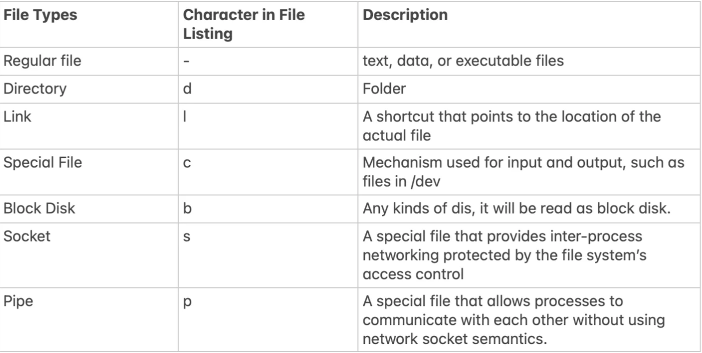
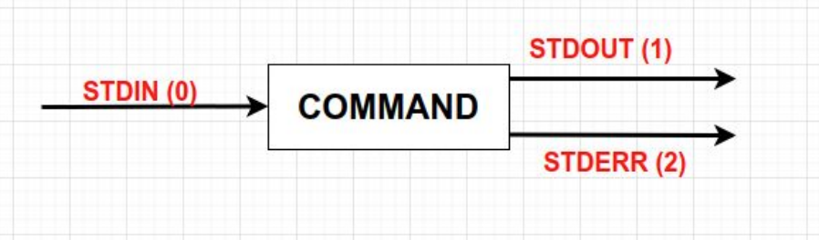
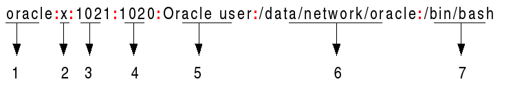
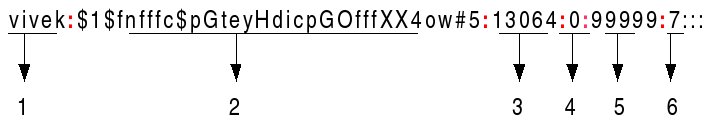
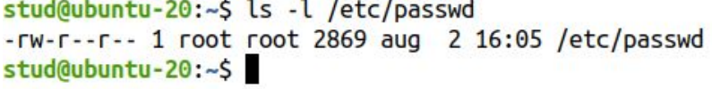
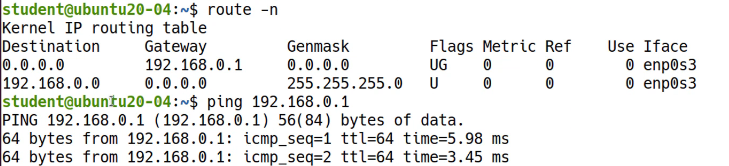

# LINUX

# Commands - Getting Help
```
##########################
## Getting Help in Linux
##########################
 
# MAN Pages
man command     # => Ex: man ls
 
# The man page is displayed with the less command
# SHORTCUTS:
# h         => getting help
# q         => quit
# enter     => show next line
# space     => show next screen
# /string   => search forward for a string
# ?string   => search backwards for a string
# n / N     => next/previous appearance
 
# checking if a command is shell built-in or executable file
type rm        # => rm is /usr/bin/rm
type cd        # => cd is a shell builtin
 
# getting help for shell built-in commands
help command    # => Ex: help cd
command --help  # => Ex: rm --help
 
# searching for a command, feature or keyword in all man Pages
man -k uname
man -k "copy files"
apropos passwd
```


# Keyboard Shortcuts
```
##########################
TAB  # autocompletes the command or the filename if its unique
TAB TAB (press twice)   # displays all commands or filenames that start with those letters
 
# clearing the terminal
CTRL + L
 
# closing the shell (exit)
CTRL + D
 
# cutting (removing) the current line 
CTRL + U
 
# moving the cursor to the start of the line
CTRL + A
 
# moving the cursor to the end of the line
Ctrl + E
 
# stopping the current command
CTRL + C
 
# sleeping a the running program
CTRL + Z
 
# opening a terminal 
CTRL + ALT + T
```

# Bash History
```
 
# showing the history
history
 
# removing a line (ex: 100) from the history
history -d 100
 
# removing the entire history
history -c
 
# printing the no. of commands saved in the history file (~/.bash_history)
echo $HISTFILESIZE
 
# printing the no. of history commands saved in the memory
echo $HISTSIZE
 
# rerunning the last command from the history
!!
 
# running  a specific command from the history (ex: the 20th command)
!20
 
# running the last nth (10th) command from the history
!-10
 
# running the last command starting with abc 
!abc
 
# printing the last command starting with abc 
!abc:p
 
# reverse searching into the history
CTRL + R
 
# recording the date and time of each command in the history
HISTTIMEFORMAT="%d/%m/%y %T"
 
# making it persistent after reboot
echo "HISTTIMEFORMAT=\"%d/%m/%y %T\"" >> ~/.bashrc
# or
echo 'HISTTIMEFORMAT="%d/%m/%y %T"' >> ~/.bashrc
```

## WSL 

wsl --user root
You should be logged in as root into your WSL. Now, use the passwd command to change the password for your user:

passwd username
Replace username with your actual Linux username.

https://askubuntu.com/questions/1365074/trying-to-use-sudo-in-wsl-but-my-microsoft-account-which-im-logged-into-as-adm

# Getting root Access

On Linux there are 2 main categories of users:
1. non-privileged users - have no special rights on the system.
2. The root user (superuser or the administrator).

- Root privileges are the powers that the root account has on the system. The root
account is the most privileged on the system and has absolute power over it.

- Root exists on any Linux system is there’s only one.

- It’s not recommended to use root for ordinary tasks. When root permissions are needed
you simply become root only to perform that particular administrative task.

## Running commands as root (sudo, su)
```
 
# running a command as root (only users that belong to sudo group [Ubuntu] or wheel [CentOS])
sudo command
 
# becoming root temporarily in the terminal
sudo su      # => enter the user's password
 
# setting the root password
sudo passwd root
 
# changing a user's password
passwd username
 
# becoming root temporarily in the terminal
su     # => enter the root password
```

# The Linux File System

- A file system controls how data is stored and retrieved.
- Each group of data is called a file and the structure and the logic rules used to manage
files and their names are called file systems.
- A file system is a logical collection of files on a partition or disk.
- On a Linux system, everything is considered to be a file.
- On Linux file and directory names are case-sensitive.

# The Filesystem Hierarchy Standard

- /bin contains binaries or user executable files which are available to all users.
- /sbin contains applications that only the superuser (hence the initial s) will need.
- /boot contains files required for starting your system.
- /home is where you will find your users’ home directories. Under this directory there is another
directory for each user, if that particular user has a home directory.
root has its home directory separated from the rest of the users’ home directories and is /root
- /dev contains device files.
- /etc contains most, if not all system-wide configuration files.
- /lib contains shared library files used by different applications.
- /media is used for external storage will be automatically mounted.
- /mnt is like /media but it’s not very often used these days
- /tmp contains temporary files, usually saved there by applications that are running.
Non-privileged users may also store files here temporarily.
- /proc is a virtual directory. It contains information about your computer hardware, such as
information about your CPU, RAM memory or Kernel. The files and directories are generated
when your computer starts, or on the fly, as your system is running and things change.
- /sys contains information about devices, drivers, and some kernel features.
- /srv contains data for servers.
- /run is a temporary file system which runs in RAM.
- /usr contains many other subdirectories binaries files, shared libraries and so on. On some
distributions like CentOS many commands are saved in /usr/bin and /usr/sbin instead of /bin
and /sbin.
- /var typically contains variable-length files such as logs which are files that register events that
happen on the system.

# Linux Paths
```
 
.       # => the current working directory
..      # => the parent directory
~       # => the user's home directory
 
cd      # => changing the current directory to user's home directory
cd ~    # => changing the current directory to user's home directory
cd -    # => changing the current directory to the last directory
cd /path_to_dir    # => changing the current directory to path_to_dir 
pwd     # => printing the current working directory


# installing tree
sudo apt install tree
 
tree directory/     # => Ex: tree .
tree -d .           # => prints only directories
tree -f .           # => prints absolute paths
```

# The ls Command
```
## ls [OPTIONS] [FILES]

##########################


# listing the current directory

# ~ => user's home directory

# . => current directory

# .. => parent directory

ls

ls .


# listing more directories

ls ~ /var /


# -l => long listing

ls -l ~


# -a => listing all files and directories including hidden ones

ls -la ~


# -1 => listing on a single column

ls -1 /etc


# -d => displaying information about the directory, not about its contents

ls -ld /etc


# -h => displaying the size in human readable format

ls -h /etc


# -S => displaying sorting by size

ls -Sh /var/log


# Note: ls does not display the size of a directory and all its contents. Use du instead

du -sh ~


# -X => displaying sorting by extension

ls -lX /etc


# --hide => hiding some files

ls --hide=*.log /var/log


# -R => displaying a directory recursively

ls -lR ~


# -i => displaying the inode number

ls -li /etc

```

# File Timestamps

Every file on Linux has three timestamps:
1. The access timestamp or atime is the last time the file was read (ls -lu)
2. The modified timestamp or mtime is the last time the contents of the file was modified
(ls -l, ls -lt)
3. The changed timestamp ctime is the last time when some metadata related to the file
was changed (ls -lc)

# File Types linux

File Types: Regular file(), Dictionary(/), Link(@), Character, Disk, Socket(=), Pipe(|)




# File Timestamps and Date

```
 
# displaying atime
ls -lu
 
# displaying mtime
ls -l
ls -lt
 
# displaying ctime
ls -lc
 
# displaying all timestamps
stat file.txt
 
# displaying the full timestamp
ls -l --full-time /etc/
 
# creating an empty file if it does not exist, update the timestamps if the file exists
touch file.txt
 
# changing only the access time to current time
touch -a file
 
# changing only the modification time to current time
touch -m file
 
# changing the modification time to a specific date and time
touch -m -t 201812301530.45 a.txt
 
# changing both atime and mtime to a specific date and time
touch -d "2010-10-31 15:45:30" a.txt
 
# changing the timestamp of a.txt to those of b.txt
touch a.txt -r b.txt
 
# displaying the date and time
date
 
# showing this month's calendar
cal
 
# showing the calendar of a specific year
cal 2021
 
# showing the calendar of a specific month and year
cal 7 2021
 
# showing the calendar of previous, current and next month
cal -3
 
# setting the date and time
date --set="2 OCT 2020 18:00:00"
 
# displaying the modification time and sorting the output by name.
ls -l
 
# displaying the output sorted by modification time, newest files first
ls -lt
 
# displaying and sorting by atime
ls -ltu
 
# reversing the sorting order
ls -ltu --reverse
```

# Viewing files (cat, less, more, head, tail, watch)

```
 
# displaying the contents of a file
cat filename
 
# displaying more files
cat filename1 filename2
 
# displaying the line numbers
can -n filename
 
# concatenating 2 files
cat filename1 filename2 > filename3
 
# viewing a file using less
less filename
 
# less shortcuts:
# h         => getting help
# q         => quit
# enter     => show next line
# space     => show next screen
# /string   => search forward for a string
# ?string   => search backwards for a string
# n / N     => next/previous appearance
 
 
# showing the last 10 lines of a file
tail filename
 
# showing the last 15 lines of a file
tail -n 15 filename
 
# showing the last lines of a file starting with line no. 5
tail -n +5 filename
 
# showing the last 10 lines of the file in real-time
tail -f filename
 
 
# showing the first 10 lines of a file
head filename
 
# showing the first 15 lines of a file
head -n 15 filename
 
# running repeatedly a command with refresh of 3 seconds
watch -n 3 ls -l

```

# Working with files and directory (touch, mkdir, cp, mv, rm, shred)
```
 
# creating a new file or updating the timestamps if the file already exists
touch filename
 
# creating a new directory
mkdir dir1
 
# creating a directory and its parents as well
mkdir -p mydir1/mydir2/mydir3
 
######################
### The cp command ###
######################
# copying file1 to file2 in the current directory
cp file1 file2
 
# copying file1 to dir1 as another name (file2)
cp file1 dir1/file2
 
# copying a file prompting the user if it overwrites the destination
cp -i file1 file2
 
# preserving the file permissions, group and ownership when copying
cp -p file1 file2
 
# being verbose
cp -v file1 file2
 
# recursively copying dir1 to dir2 in the current directory
cp -r dir1 dir2/
 
# copy more source files and directories to a destination directory
cp -r file1 file2 dir1 dir2 destination_directory/
 
 
######################
### The mv command ###
######################
# renaming file1 to file2
mv file1 file2
 
# moving file1 to dir1 
mv file1 dir1/
 
# moving a file prompting the user if it overwrites the destination file
mv -i file1 dir1/
 
# preventing a existing file from being overwritten
mv -n file1 dir1/
 
# moving only if the source file is newer than the destination file or when the destination file is missing
mv -u file1 dir1/
 
# moving file1 to dir1 as file2
mv file1 dir1/file2
 
# moving more source files and directories to a destination directory
mv file1 file2 dir1/ dir2/ destination_directory/
 
######################
### The rm command ###
######################
# removing a file
rm file1
 
# being verbose when removing a file
rm -v file1
 
# removing a directory
rm -r dir1/
 
# removing a directory without prompting
rm -rf dir1/
 
# removing a file and a directory prompting the user for confirmation
rm -ri fil1 dir1/
 
# secure removal of a file (verbose with 100 rounds of overwriting)
shred -vu -n 100 file1

#SHRED 
Shred –help

Aquí listamos las opciones para ejecutar la herramienta:

• f: force. cambia los permisos del archivo si fuera necesario
• n: número de veces a sobrescribir el archivo o partición (3 veces por defecto). Cuanto mayor sea este número, más difícil será su recuperación
• u: trunca y elimina el archivo después de sobrescribirlo
• v: verbose o verborragico, muestra el progreso en pantalla
• z: zero, sobreescribe 0 para evitar dejar rastro

shred -n 10 -uvz <nombrearchivo o particion>

Con este comando se ejecuta la herramienta, borrando 10 veces el archivo (letra n), luego de el borrado del archivo sobrescribirlo (letra u), muestra el progreso del borrado en pantalla (letra v) y sobre escribe con 0 para evitar dejar rastros (letra z), todo esto seguido del archivo a eliminar, en este caso un documento de texto.
```

# Piping and Command Redirection
Every Linux command or program we run has three data streams connected to it:
1. STDIN (0) - Standard Input
2. STDOUT (1) - Standard Output
3. STDERR (2) - Standard Error



# Piping and Command Redirection
```
 
## Piping Examples:
 
ls -lSh /etc/ | head            # see the first 10 files by size
ps -ef | grep sshd              # checking if sshd is running
ps aux --sort=-%mem | head -n 3  # showing the first 3 process by memory consumption
 
## Command Redirection
 
# output redirection
ps aux > running_processes.txt
who -H > loggedin_users.txt
 
# appending to a file
id >> loggedin_users.txt
 
# output and error redirection
tail -n 10 /var/log/*.log > output.txt 2> errors.txt
 
# redirecting both the output and errors to the same file
tail -n 2 /etc/passwd /etc/shadow > output_errors.txt 2>&1
 
cat -n /var/log/auth.log | grep -ai "authentication failure" | wc -l
cat -n /var/log/auth.log | grep -ai "authentication failure" > auth.txt     # => piping and redirection
```
tee is for show bot in screen and create a file by default tee overwrite to appen you need to use -a option

who | tee -a m.txt 
ifconfig | grep ether | tee mac.txt

# # Finding Files (find, plocate)
```
 
## LOCATE ##
# locate is a symlink (shortcut) to plocate
 
# updating the plocate db
sudo updatedb
 
# finding file by name
locate filename # => filename is expanded to *filename*
locate -i filename # => the filename is case insensitive
locate -r '/filename$' # => finding by exact name
 
# finding using the basename
locate -b filename
 
# finding using regular expressions
locate -r 'regex'
 
# checking that the file exists
locate -e filename
 
# showing command path
which command
which -a command
 
 
## FIND ##
find PATH OPTIONS
 
# Example: find ~ -type f -size +1M # => finding all files in ~ bigger than 1 MB
 
## Options:
# -type f, d, l, s, p 
# -name filename
# -iname filename # => case-insensitive
# -size n, +n, -n
# -perm permissions
# -links n, +n, -n
# -atime n, -mtime n, ctime n
# -user owner
# -group group_owner


example

find . -name "todo*"
find . -name "*re*"
find . -name todo.txt -delete
find . -type d -maxdepth 2 -perm 755
sudo find . -type f size +5M - size -10M -ls

# Exec

diplay the contect all the files

sudo find /etc -type f -mtime 0 -exec cat {} \;

make backuo files modify last 7 days

sudo find /etc/ -mtime -7 -type f -exec cp {} /root/backup \;

sudo find /etc/ -mtime -7 -type f -ok cp {} /root/backup \; # ask in the interactive way

```

# Searching for text patterns (grep)

``` 
grep [OPTIONS] pattern file
 
Options:
-n          # => print line number
-i          # => case insensitive
-v          # inverse the match
-w          # search for whole words
-a          # search in binary files
-R          # search in directory recursively
-c          # display only the no. of matches
-C n        # display a context (n lines before and after the match)
 
 
# printing ASCII chars from a binary file
strings binary_file
```

# The Inode Structure
- Each file on the disk has a data structure called index node or inode associated with it.
- This structure stores metadata information about the file such as the type, file’s
permission, file’s owner and group owner, timestamp information, file size and so on.
- It actually contains all file information except the file contents and the name.
- Each inode is uniquely identified by an integer number called inode number (ls -i).


# hardlink symlink

ypu can't create a hard link to directory but you can create a symlink to a directory
hardlink have the same inode structure and number but symlink ha diferent

# etc/passwd

 file stores essential information required during login. In other words, it stores user account information

 The /etc/passwd contains one entry per line for each user (user account) of the system. All fields are separated by a colon (:) symbol. Total of seven fields as follows. Generally, /etc/passwd file entry looks as follows:



1. Username: It is used when user logs in. It should be between 1 and 32 characters in length.
2. Password: An x character indicates that encrypted and salted password is stored in /etc/shadow file. Please note that you need to use the passwd command to computes the hash of a password typed at the CLI or to store/update the hash of the password in /etc/shadow file.
3. User ID (UID): Each user must be assigned a user ID (UID). UID 0 (zero) is reserved for root and UIDs 1-99 are reserved for other predefined accounts. Further UID 100-999 are reserved by system for administrative and system accounts/groups.
4. Group ID (GID): The primary group ID (stored in /etc/group file)
5.User ID Info (GECOS): The comment field. It allow you to add extra information about the users such as user’s full name, phone number etc. This field use by finger command.
6. Home directory: The absolute path to the directory the user will be in when they log in. If this directory does not exists then users directory becomes /
7. Command/shell: The absolute path of a command or shell (/bin/bash). Typically, this is a shell. Please note that it does not have to be a shell. For example, sysadmin can use the nologin shell, which acts as a replacement shell for the user accounts. If shell set to /sbin/nologin and the user tries to log in to the Linux system directly, the /sbin/nologin shell closes the connection.

# /etc/shadow 

Is a text-based password file. The shadow file stores the hashed passphrase (or “hash”) format for Linux user account with additional properties related to the user password. This shadow file is directly accessible only to the root user. However, some commands or programs (e.g., su, passwd, and others) with unique SetUID (SUID) are set on them to grant them access to the shadow file. Understanding /etc/shadow file format is essential for sysadmins and developers to debug user account issues. Hence, we are going to learn about it.

Basically, the /etc/shadow file stores secure user account information. All fields are separated by a colon (:) symbol. It contains one entry per line for each user listed in /etc/passwd file. Generally, shadow file entry looks as follows (click to enlarge image):



1. Username : A valid account name, which exist on the system.
2. Password : Your encrypted password is in hash format. The password should be minimum 15-20 characters long including special characters, digits, lower case alphabetic and more. Usually password format is set to $id$salt$hashed, The $id is the algorithm prefix used On GNU/Linux as follows
    $1$ is MD5
    $2a$ is Blowfish
    $2y$ is EksBlowfish
    $5$ is SHA-256
    $6$ is SHA-512
    $y$ is yescrypt
3. Last password change (lastchanged) : The date of the last password change, expressed as the number of days since Jan 1, 1970 (Unix time). The value 0 has a special meaning, which is that the user should change her password the next time she will log in the system. An empty field means that password aging features are disabled.
4. Minimum : The minimum number of days required between password changes i.e. the number of days left before the user is allowed to change her password again. An empty field and value 0 mean that there are no minimum password age.
5. Maximum : The maximum number of days the password is valid, after that user is forced to change her password again.
6. Warn : The number of days before password is to expire that user is warned that his/her password must be changed
7. Inactive : The number of days after password expires that account is disabled.
8. Expire : The date of expiration of the account, expressed as the number of days since Jan 1, 1970.

# Groups

There are two types of groups that a user can belong to:
1. The primary group: the id is stored in /etc/passwd and the group name in /etc/group
2. Secondary groups: stored in /etc/group
tail -n 3 /etc/group
geoclue:x:127:
pulse:x:128:
pulse-access:x:129:
gdm:x:130:
lxd:x:131:student, john
student:x:1000:

  The /etc/login.defs file defines the site-specific configuration
       for the shadow password suite.

# File Permissions 

- File permissions (file modes) specify who can access, change or execute a file on a
Linux System.
- It ensures that only authorized users and processes can access files and directories.
- Each file or directory has an owner and a group. By default, the owner is the user who
creates the file and the group is the primary group of that user.
- The ownership of a file or a directory can be changed only by root using the chown and
chgrp commands.
For each file the permissions are assigned to three different categories of users:
1. The file owner.
2. The group owner.
3. Others (anyone else or the whole world).

There are three file permissions types that apply to each category:
- The read permission (r)
- The write permission (w)
- The execute permission (x)
To view the files permission run: ls -l or stat.



# The Octal Notation
- The number that represents the permission in base-8 can be a either a 3 or a 4-digit
number with digits from 0 to 7. The leading zero (0) can be omitted.
- 0755 = 755 and 0644 = 644.
- When a 3 digit number is used, the first digit represents the permissions of the file’s
owner, the second one the file’s group, and the last one the permissions of the others
class.
- r, w, and x have their own fixed number value:
○ r (read) = 4
○ w (write) = 2
○ x (execute) = 1
○ - (no permissions) = 0
○ The permissions number of a specific user class is represented by the sum of the
values of the permissions for that group.

# Changing File Permissions (chmod)
- chmod is the command used to change the permissions of a file or a directory using
either the symbolic or the numeric notation.
- Only the root, or the file’s owner, can change the file’s permissions.
chmod [who][OPERATION][permissions] filename

who signifies the user category whose permissions will be changed.
- u: the user that owns the file.
- g: the group that the file belongs to.
- o: the other users.
 The OPERATION flags define whether the permissions are to be removed, added, or set:
- - : a hyphen means remove the specified permissions.
- + : the plus sign means Add the specified permissions.
- = : equals means change the current permissions to the specified permissions.
The permissions are specified using the letters r, w and x.

# Changing File Ownership (chown, chgrp)
- In Linux, all files are associated with an owner and a group owner.
- The chown and chgrp commands are used to change the files owner and group.
- Only root can change the file owner.
-  Normal users can change the group of the file only if they own the file and only to a
group of which they are a member of. root can change the group ownership of all files.
ls -l hello.c
-rw-r--r-- 1 root root 81 iul 18 12:49 hello.c
chown james hello.c
ls -l hello.c
-rw-r--r-- 1 james root 81 iul 18 12:49 hello.c
chgrp adm hello.c
ls -l hello.c
-rw-r--r-- 1 james adm 81 iul 18 12:49 hello.c

# Special Permissions - SUID (Set User ID)
- Besides r, w and x for the owner, group and others there are 3 extra special permissions
for each file or directory: SUID or Set User ID, SGID or Set Group ID and Sticky Bit.
- These special permissions are for a file or directory overall, not just for a user category.
- When an executable file with SUID is executed then the resulting process will have the
permissions of the owner of the command, not the permissions of the user who
executes the command.
Setting SUID:
- Absolute Mode: chmod 4XXX file
- Relative Mode: chmod u+s file
 ls -l /usr/bin/passwd
-rwsr-xr-x 1 root root 68208 apr 16 15:36 /usr/bin/passwd

# Special Permissions - SGID (Set Group ID)
- SGID is set mainly to directories.
- If you set SGID on directories, all files or directories created inside that directory will be
owned by the same group owner of the directory where SGID was configured.
- This is useful in creating shared directories, which are directories that are writable at
the group level.
Setting SGID:
- Absolute Mode: chmod 2XXX directory
- Relative Mode: chmod g+s directory
 ls -ld /programming/
drwxrws--- 2 pr1 programmers 4096 iul 14 13:15 /programming/

# Special Permissions - The Sticky Bit
- The Sticky Bit is applied to directories.
- A user may only delete files that he owns or for which he has explicit write permission
granted, even when he has write access to the directory.
- The sticky bit allows you to create a directory that everyone can use as a shared file
storage. The files are protected because, no one can delete anyone else’s files.
Setting the sticky bit:
- Absolute Mode: chmod 1XXX directory
- Relative Mode: chmod o+t directory
 ls -ld /temp/
drwxrwxrwt 2 root root 4096 iul 14 13:45 /temp/

# Umask

The umask acts as a set of permissions that applications cannot set on files. It's a file mode creation mask for processes and cannot be set for directories itself. Most applications would not create files with execute permissions set, so they would have a default of 666, which is then modified by the umask.

0666 for files default values
0777 for directories default values

beacuse UMASK = 0002
0777-0002=0775
0666-0002=0664

# lsattr and chattr

El omando chattr, comando no muy conocido, que sirve para cambiar los atributos de un archivo en un sistema GNU/Linux. 

Además es genial ya que proporciona más seguridad a nuestros archivos, frente a cambios y eliminaciones no deseados.

El operador + hace que los atributos seleccionados se agreguen a los atributos existentes de los archivos; - hace que se eliminen; y = hace que sean los únicos atributos que tienen los archivos.

Las letras aAcCdDeFijPsStTu seleccionan los nuevos atributos para los archivos: anexar solo (a), sin actualizaciones temporales (A), comprimido (c), sin copia al escribir (C), sin volcado (d), actualizaciones de directorio sincrónicas (D), formato de extensión (e), búsquedas de directorio que no distinguen entre mayúsculas y minúsculas (F), inmutable (i), registro de datos (j), jerarquía del proyecto (P), seguro eliminación (e), actualizaciones síncronas (S), sin fusión de cola (t), parte superior de la jerarquía de directorios (T) e indeleble (u)

Los siguientes atributos son de solo lectura y pueden ser enumerados por lsattr pero no modificados por chattr: cifrado (E), directorio indexado (I) y datos en línea (N).

# File Permissions
``` 
## LEGEND
u = User
g = Group
o = Others/World
a = all
 
r = Read
w = write
x = execute
- = no access
 
# displaying the permissions (ls and stat)
ls -l /etc/passwd
    -rw-r--r-- 1 root root 2871 aug 22 14:43 /etc/passwd
 
stat /etc/shadow
    File: /etc/shadow
    Size: 1721      	Blocks: 8          IO Block: 4096   regular file
    Device: 805h/2053d	Inode: 524451      Links: 1
    Access: (0640/-rw-r-----)  Uid: (    0/    root)   Gid: (   42/  shadow)
    Access: 2020-08-24 11:31:49.506277118 +0300
    Modify: 2020-08-22 14:43:36.326651384 +0300
    Change: 2020-08-22 14:43:36.342652202 +0300
    Birth: -
 
# changing the permissions using the relative (symbolic) mode
chmod u+r filename
chmod u+r,g-wx,o-rwx filename
chmod ug+rwx,o-wx filename
chmod ugo+x filename
chmod a+r,a-wx filename
 
# changing the permissions using the absolute (octal) mode
PERMISSIONS      EXAMPLE
u   g   o
rwx rwx rwx     chmod 777 filename
rwx rwx r-x     chmod 775 filename
rwx r-x r-x     chmod 755 filename
rwx r-x ---     chmod 750 filename
rw- rw- r--     chmod 664 filename
rw- r-- r--     chmod 644 filename
rw- r-- ---     chmod 640 filename
 
# setting the permissions as of a reference file
chmod --reference=file1 file2
 
# changing permissions recursively
chmod -R u+rw,o-rwx filename
 
## SUID (Set User ID)
 
# displaying the SUID permission
ls -l /usr/bin/umount 
    -rwsr-xr-x 1 root root 39144 apr  2 18:29 /usr/bin/umount
 
stat /usr/bin/umount 
    File: /usr/bin/umount
    Size: 39144     	Blocks: 80         IO Block: 4096   regular file
    Device: 805h/2053d	Inode: 918756      Links: 1
    Access: (4755/-rwsr-xr-x)  Uid: (    0/    root)   Gid: (    0/    root)
    Access: 2020-08-22 14:35:46.763999798 +0300
    Modify: 2020-04-02 18:29:40.000000000 +0300
    Change: 2020-06-30 18:27:32.851134521 +0300
    Birth: -
 
# setting SUID
chmod u+s executable_file
chmod 4XXX executable_file      # => Ex: chmod 4755 script.sh
 
 
## SGID (Set Group ID)
 
# displaying the SGID permission
ls -ld projects/
    drwxr-s--- 2 student student 4096 aug 25 11:02 projects/
 
stat projects/
    File: projects/
    Size: 4096      	Blocks: 8          IO Block: 4096   directory
    Device: 805h/2053d	Inode: 266193      Links: 2
    Access: (2750/drwxr-s---)  Uid: ( 1001/ student)   Gid: ( 1002/ student)
    Access: 2020-08-25 11:02:15.013355559 +0300
    Modify: 2020-08-25 11:02:15.013355559 +0300
    Change: 2020-08-25 11:02:19.157290764 +0300
    Birth: -
 
# setting SGID
chmod 2750 projects/
chmod g+s projects/
 
 
## The Sticky Bit 
 
# displaying the sticky bit permission
ls -ld /tmp/
    drwxrwxrwt 20 root root 4096 aug 25 10:49 /tmp/
 
stat /tmp/
    File: /tmp/
    Size: 4096      	Blocks: 8          IO Block: 4096   directory
    Device: 805h/2053d	Inode: 786434      Links: 20
    Access: (1777/drwxrwxrwt)  Uid: (    0/    root)   Gid: (    0/    root)
    Access: 2020-08-22 14:46:03.259455125 +0300
    Modify: 2020-08-25 10:49:53.756211470 +0300
    Change: 2020-08-25 10:49:53.756211470 +0300
    Birth: -
 
# setting the sticky bit
mkdir temp
chmod 1777 temp/
chmod o+t temp/
ls -ld temp/
    drwxrwxrwt 2 student student 4096 aug 25 11:04 temp/
 
 
## UMASK
# displaying the UMASK
umask 
 
# setting a new umask value
umask new_value     # => Ex: umask 0022
 
## Changing File Ownership (root only)
 
# changing the owner
chown new_owner file/directory      # => Ex: sudo chown john a.txt
 
# changing the group owner
chgrp new_group file/directory
 
# changing both the owner and the group owner
chown new_owner:new_group file/directory
 
# changing recursively the owner or the group owner
chown -R new-owner file/directory
 
# displaying the file attributes
lsattr filename
 
#changing the file attributes
chattr +-attribute filename     # => Ex: sudo chattr +i report.txt

```

# Processes
- A running instance of a program is called a process and it runs in its own memory
space. Each time you execute a command, a new process starts.
- A process is an active entity as opposed to a program, which is considered to be a
passive entity.
- A new process is created only when running an executable file (not when running Shell
builtin commands).
Process properties:
- PID (Process ID) - a unique positive integer number
- User
- Group
- Priority / Nice

Type of Processes:
- Parent
- Child
- Daemon
- Zombie (defunct)
- Orphan

# Zombie porcess
Zombie process is also known as "dead" process. Ideally, when a process completes its execution, its entry from the process table should be removed but this does not happen in the case of zombie a process.

Analogy: Zombie, mythological, is a dead person revived physically. Similarly, a zombie process in os is a dead process (completed its execution) but is still revived (its entry is present in memory).

https://www.scaler.com/topics/operating-system/zombie-and-orphan-process-in-os/

Why are lots of zombie processes harmful to the system?
A lot of zombie processes in OS are harmful as

The OS has one process table of finite size, so lots of zombie processes will result in a full process table.
A full process table means that OS cannot create a new process when required and Zombie processes in OS are of no use as the process has died but its entry is occupying the space in memory
PIDs in os are finite, when all the PIDs have been consumed by Zombie Process, no new process can be created.
Solution: Reboot the system

# What is the Orphan Process?
We'll again use real-life analogy to understand the orphan process.

In the real world orphans are those children whose parents are dead.
Similarly, a process which is executing (is alive) but it's parent process has terminated (dead) is called an orphan process.
What will happen with the orphan processes?
In the real world orphans are adopted by guardians who look after them.
Similarly, the orphan process in Linux is adopted by a new process, which is mostly init process (pid=1). This is called re-parenting.
Reparenting is done by the kernel, when the kernel detects an orphan process in OS and assigns a new parent process.
The new parent process asks the kernel for cleaning of the PCB of the orphan process and the new parent waits till the child completes its execution.

Why are too many Orphan processes harmful to the system?
Orphan processes in OS hold resources when present in the system.
Orphan processes in a large number can overload the init process and hang up a system.

# # Process Viewing (ps, pstree, pgrep)
```
# checking if a command is shell built-in or executable file
type rm        # => rm is /usr/bin/rm
type cd        # => cd is a shell built-in
 
# displaying all processes started in the current terminal
ps
 
# displaying all processes running in the system
ps -ef 
ps aux
ps aux | less       # => piping to less
 
# sorting by memory and piping to less
ps aux --sort=%mem | less
 
# ASCII art process tree
ps -ef --forest
 
# displaying all processes of a specific user
ps -f -u username
 
# checking if a process called sshd is running
pgrep -l sshd
ps -ef | grep sshd
 
#displaying a hierarchical tree structure of all running processes
pstree
 
# prevent merging identical branches
pstree -c
```

# Dynamic Real-Time View of Processes(top)
```
 
# starting top
top
 
## top shortcuts while it's running
h       # => getting help
space   # => manual refresh
d       # => setting the refresh delay in seconds
q       # => quitting top
u       # => display processes of a user
m       # => changing the display for the memory
1       # => individual statistics for each CPU
x/y     # => highlighting the running process and the sorting column
b       # => toggle between bold and text highlighting
<       # => move the sorting column to the left
>       # => move the sorting column to the right
F       # => entering the Field Management screen 
W       # => saving top settings
 
# running top in batch mode (3 refreshes, 1 second delay)
top -d 1 -n 3 -b > top_processes.txt
 
# Interactive process viewer (top alternative)
sudo apt update && sudo apt install htop    # => Installing htop
htop

```

# job control

Job control is a collection of features in the shell and the tty driver which allow the user to manage multiple jobs from a single interactive shell.

A job is a single command or a pipeline. If you run ls, that's a job. If you run ls|more, that's still just one job. If the command you run starts subprocesses of its own, then they will also belong to the same job unless they are intentionally detached.

Without job control, you have the ability to put a job in the background by adding & to the command line. And that's about all the control you have.

With job control, you can additionally:

Suspend a running foreground job with CtrlZ
Resume a suspended job in the foreground with fg
Resume a suspend job in the background with bg
Bring a running background job into the foreground with fg
The shell maintains a list of jobs which you can see by running the jobs command. Each one is assigned a job number (distinct from the PIDs of the process(es) that make up the job). You can use the job number, prefixed with %, as an argument to fg or bg to select a job to foreground or background. The %jobnumber notation is also acceptable to the shell's builtin kill command. This can be convenient because the job numbers are assigned starting from 1, so they're shorter than PIDs.

There are also shortcuts %+ for the most recently foregrounded job and %- for the previously foregrounded job, so you can switch back and forth rapidly between two jobs with CtrlZ followed by fg %- (suspend the current one, resume the other one) without having to remember the numbers. Or you can use the beginning of the command itself. If you have suspended an ffmpeg command, resuming it is as easy as fg %ff (assuming no other active jobs start with "ff"). And as one last shortcut, you don't have to type the fg. Just entering %- as a command foregrounds the previous job.

"But why do we need this?" I can hear you asking. "I can just start another shell if I want to run another command." True, there are many ways of multitasking. On a normal day I have login shells running on tty1 through tty10 (yes there are more than 6, you just have to activate them), one of which will be running a screen session with 4 screens in it, another might have an ssh running on it in which there is another screen session running on the remote machine, plus my X session with 3 or 4 xterms. And I still use job control.

If I'm in the middle of vi or less or aptitude or any other interactive thing, and I need to run a couple of other quick commands to decide how to proceed, CtrlZ, run the commands, and fg is natural and quick. (In lots of cases an interactive program has a ! keybinding to run an external command for you; I don't think that's as good because you don't get the benefit of your shell's history, command line editor, and completion system.) I find it sad whenever I see someone launch a secondary xterm/screen/whatever to run one command, look at it for two seconds, and then exit.

Now about this script of yours. In general it does not appear to be competently written. The line in question:

bash -i -c "ssh -D 7070 -N user@my-ssh.example.com > /dev/null"
is confusing. I can't figure out why the ssh command is being passed down to a separate shell instead of just being executed straight from the main script, let alone why someone added -i to it. The -i option tells the shell to run interactively, which activates job control (among other things). But it isn't actually being used interactively. Whatever the purpose was behind the separate shell and the -i, the warning about job control was a side effect. I'm guessing it was a hack to get around some undesirable feature of ssh. That's the kind of thing that when you do it, you should comment it.


# # Killing processes (kill, pkill, killall)
```
 
# listing all signals
kill -l
 
# sending a signal (default SIGTERM - 15) to a process by pid 
kill pid        # => Ex: kill 12547
 
# sending a signal to more processes
kill -SIGNAL pid1 pid2 pid3 ...
 
# sending a specific signal (SIGHUP - 1) to a process by pid
kill -1 pid
kill -HUP pid
kill -SIGHUP pid
 
# sending a signal (default SIGTERM - 15) to process by process name
pkill process_name          # => Ex: pkill sleep
killall process_name
kill $(pidof process_name)  # => Ex: kill -HUP $(pidof sshd)
 
# running a process in the background
command &   # => Ex: sleep 100 &
 
# Showing running jobs
jobs
 
# Stopping (pausing) the running process
Ctrl + Z
 
# resuming and bringing to the foreground a process by job_d
fg %job_id
 
# resuming in the background a process by job_d
bg %job_id
 
# starting a process immune to SIGHUP
nohup command &     # => Ex: nohup wget http://site.com &

```

# Systemd vs. SysVInit
- Most modern Linux distributions are using SystemD as the default init system and
service manager.
- It replaced the old SysVinit script system, but it’s backward compatible with SysVinit.
- systemd starts with PID 1 as the first process, then takes over and continues to mount
the host’s file systems and starts services.
- systemd starts the services in parallel.
Statistics:
 systemd-analyze
 systemd-analyze blame

# # Service Management using systemd and systemctl
```
# showing info about the boot process
systemd-analyze
systemd-analyze blame
 
# listing all active units systemd knows about
systemctl list-units
systemctl list-units | grep ssh
 
# checking the status of a service
sudo systemctl status nginx.service
 
# stopping a service
sudo systemctl stop nginx
 
# starting a service
sudo systemctl start nginx
 
# restarting a service
sudo systemctl restart nginx
 
# reloading the configuration of a service
sudo systemctl reload nginx
sudo systemctl reload-or-restart nginx
 
# enabling to start at boot time
sudo systemctl enable nginx
 
# disabling at boot time
sudo systemctl disable nginx
 
# checking if it starts automatically at boot time
sudo systemctl is-enabled nginx
 
# masking a service (stopping and disabling it)
sudo systemctl mask nginx
 
# unmasking a service
sudo systemctl unmask nginx
```

# Getting info about the network interfaces (ifconfig, ip, route)
```
 
# displaying information about enabled interfaces
ifconfig
 
# displaying information about all interfaces (enabled and disabled)
ifconfig -a
ip address show
 
# displaying info about a specific interface
ifconfig enp0s3
ip addr show dev enp0s3
 
# showing only IPv4 info
ip -4 address
 
# showing only IPv6 info
ip -6 address
 
# displaying L2 info (including the MAC address)
ip link show
ip link show dev enp0s3
 
# displaying the default gateway
route 
route -n    # numerical addresses
ip route show
 
# displaying the DNS servers
resolvectl status
 
 
##########################
## Setting the network interfaces (ifconfig, ip, route)
##########################
# disabling an interface
ifconfig enp0s3 down
ip link set enp0s3 down
 
# activating an interface
ifconfig enp0s3 up
ip link set enp0s3 up
 
# checking its status
ifconfig -a
ip link show dev enp0s3
 
# setting an ip address on an interface
ifconfig enp0s3 192.168.0.222/24 up
ip address del 192.168.0.111/24 dev enp0s3
ip address add 192.168.0.112/24 dev enp0s3
 
# setting a secondary ip address on sub-interface
ifconfig enp0s3:1 10.0.0.1/24
 
# deleting and setting a new default gateway
route del default gw 192.168.0.1
route add default gw 192.168.0.2
 
# deleting and setting a new default gateway
ip route del default
ip route add default via 192.168.0.1 	
 
# changing the MAC address
ifconfig enp0s3 down
ifconfig enp0s3 hw ether 08:00:27:51:05:a1
ifconfig enp0s3 up
 
# changing the MAC address
ip link set dev enp0s3 address 08:00:27:51:05:a3

# display the DNS Servers used by the system
Run resolvctl status

# displaying the default gateway
route
```

# Network Static configuration using Netplan (Ubuntu)
```
 
# 1. Stop and disable the Network Manager
 
sudo systemctl stop NetworkManager
sudo systemctl disable NetworkManager
sudo systemctl status NetworkManager
sudo systemctl is-enabled NetworkManager
 
# 2. Create a YAML file in /etc/netplan
 
network:
  version: 2
  renderer: networkd
  ethernets:
    enp0s3:
      dhcp4: false
      addresses:
        - 192.168.0.20/24
      gateway4: "192.168.0.1"
      nameservers:
        addresses:
          - "8.8.8.8"
          - "8.8.4.4"
 
# 3. Apply the new config
sudo netplan apply
 
# 4. Check the configuration
ifconfig
route -a

some examples https://github.com/canonical/netplan/tree/main/examples
```
# Test Connection

first validate your gateway and ping this gatewayip
route -n
ping 192.168.0.1



if you have some error the problem is in our LAN


# SSH (Secure Shell)
- The SSH protocol is used for:
○ Secure Remote Management of Servers, Routers, other Networking Devices
○ Network File Copy: rsync, scp, sftp, winscp
○ Tunneling, SSH Port Forwarding
- sshd is the SSH server (daemon) and ssh or putty is the client
Installation:
○ Ubuntu: sudo apt update && sudo apt install openssh-server openssh-client
○ CentOS: sudo dnf install openssh-server openssh-clients
○ Checking its status: sudo systemctl status ssh
- Service Stop, Restart, Start: sudo systemctl [start|restart|stop] ssh
- Enable, Disable auto booting: sudo systemctl [enable|disable] ssh
Server config file: /etc/ssh/sshd_config
Client Config file: /etc/ssh/ssh_config


# OpenSSH
```
 
# 1. Installing OpenSSH (client and server)
# Ubuntu
sudo apt update && sudo apt install openssh-server openssh-client
 
# CentOS
sudo dnf install openssh-server openssh-clients
 
# connecting to the server
ssh -p 22 username@server_ip        # => Ex: ssh -p 2267 john@192.168.0.100
ssh -p 22 -l username server_ip
ssh -v -p 22 username@server_ip     # => verbose
 
# 2. Controlling the SSHd daemon
# checking its status
sudo systemctl status ssh       # => Ubuntu
sudo systemctl status sshd      # => CentOS
 
# stopping the daemon
sudo systemctl stop ssh       # => Ubuntu
sudo systemctl stop sshd      # => CentOS
 
# restarting the daemon
sudo systemctl restart ssh       # => Ubuntu
sudo systemctl restart sshd      # => CentOS
 
# enabling at boot time 
sudo systemctl enable ssh       # => Ubuntu
sudo systemctl enable sshd      # => CentOS
 
sudo systemctl is-enabled ssh       # => Ubuntu
sudo systemctl is-enabled sshd      # => CentOS
 
# ssh kniwn host
cat .ssh/known_hosts

# ip firewall
sudo iptables -vnL

# manage firewall
sudo ufw status verbose
sudo ufw enable/disable
sudo ufw app list
sudo ufw allow ssh

# logs ssh
sudo tail -f /var/log/auth.log      # => Ubuntu
sudo tail -f /var/log/secure      # => CentOS f de follow


# 3. Securing the SSHd daemon
# change the configuration file (/etc/ssh/sshd_config) and then restart the server
man sshd_config
 
a) Change the port
Port 2278
 
b) Disable direct root login
PermitRootLogin no
 
c) Limit Users’ SSH access
AllowUsers stud u1 u2 john
 
d) Filter SSH access at the firewall level (iptables)
sudo su
iptables -A INPUT -p tcp --dport 22 -s <ip or network adress need access 2.2.4.5> -j ACCEPT
iptables -A INPUT -p tcp --dport 22 -j DROP

 
e) Activate Public Key Authentication and Disable Password Authentication
 
f) Use only SSH Protocol version 2
 
g) Other configurations:
ClientAliveInterval 300
ClientAliveCountMax 0
MaxAuthTries 2
MaxStartUps 3
LoginGraceTime 20

```

# SCP and Rsync

```
##########################
## Copying files using SCP and RSYNC
##########################
 
### SCP ###
# copying a local file to a remote destination
scp a.txt john@80.0.0.1:~
scp -P 2288 a.txt john@80.0.0.1:~       # using a custom port
 
# copying a local file from a remote destination to the current directory
scp -P 2290 john@80.0.0.1:~/a.txt .
 
# copying a local directory to a remote destination (-r)
scp -P 2290 -r projects/ john@80.0.0.1:~

# copying files betwen 2 remotes server 
scp user@IP1:/path_to_source_file user2@IP2:/path_to_destination_dir
 
 
### RSYNC ###
# synchronizing a directory
sudo rsync -av /etc/ ~/etc-backup/
 
# mirroring (deleting from destination the files that were deleting from source)
sudo rsync -av --delete /etc/ ~/etc-backup/
 
# excluding files
rsync -av --exclude-from='~/exclude.txt' source_directory/ destination_directory/
# exclude.txt:
# *.avi
# music/
# abc.mkv
 
rsync -av --exclude='*.mkv' --exclude='movie1.avi' source_directory/ destination_directory/
 
# synchronizing a directory over the network using SSH
sudo rsync -av -e ssh /etc/ student@192.168.0.108:~/etc-backup/ 
 
# using a custom port
sudo rsync -av -e 'ssh -p 2267' /etc/ student@192.168.0.108:~/etc-backup/ 


```

# wget, netstat, ss, nmap

```
##########################
## WGET
##########################
# installing wget
apt install wget        # => Ubuntu
dnf install wget        # => CentOS
 
# download a file in the current directory
wget https://cdimage.kali.org/kali-2020.2/kali-linux-2020.2-installer-amd64.iso
 
# resuming the download 
wget -c https://cdimage.kali.org/kali-2020.2/kali-linux-2020.2-installer-amd64.iso
 
# saving the file into a specific directory
mkdir kali
wget -P kali/ https://cdimage.kali.org/kali-2020.2/kali-linux-2020.2-installer-amd64.iso
 
# limiting the rate (bandwidth)
wget --limit-rate=100k -P kali/ https://cdimage.kali.org/kali-2020.2/kali-linux-2020.2-installer-amd64.iso
 
# downloading more files 
wget -i urls.txt      # urls.txt contains urls
 
# starting the download in the background
wget -b -P kali/ https://cdimage.kali.org/kali-2020.2/kali-linux-2020.2-installer-amd64.iso
tail -f wget-log        # => checking its status
 
# getting an offline copy of a website
wget --mirror --convert-links --adjust-extension --page-requisites --no-parent http://example.org
wget -mkEpnp http://example.org
 
 
##########################
## NETSTAT and SS
##########################
# displaying all open ports and connections
sudo netstat -tupan
sudo ss -tupan
netstat -tupan | grep :80   # => checking if port 80 is open
 
##########################
## LSOF
##########################
# listing all files that are open
lsof
 
# listing all files opened by the processes of a specific user
lsof -u username
 
# listing all files opened by a specific process
lsof -c sshd
 
# listing all files that have opened TCP ports
lsof -iTCP -sTCP:LISTEN
lsof -iTCP -sTCP:LISTEN -nP
 
 
##########################
## Scanning hosts and networks using nmap
##########################
##** SCAN ONLY YOUR OWN HOSTS AND SERVERS !!! **##
## Scanning Networks is your own responsibility ##
 
# Syn Scan - Half Open Scanning (root only)
nmap -sS 192.168.0.1
 
# Connect Scan
nmap -sT 192.168.0.1
 
# Scanning all ports (0-65535)
nmap -p- 192.168.0.1
 
# Specifying the ports to scan
nmap -p 20,22-100,443,1000-2000 192.168.0.1
 
# Scan Version
nmap -p 22,80 -sV 192.168.0.1
 
# Ping scanning (entire Network)
nmap -sP 192.168.0.0/24
 
# Treat all hosts as online -- skip host discovery
nmap -Pn 192.168.0.0/24
 
# Excluding an IP
nmap -sS 192.168.0.0/24 --exclude 192.168.0.10
 
# Saving the scanning report to a file
nmap -oN output.txt 192.168.0.1
 
# OS Detection
nmap -O 192.168.0.1
 
# Enable OS detection, version detection, script scanning, and traceroute
nmap -A 192.168.0.1
 
# reading the targets from a file (ip/name/network separated by a new line or a whitespace)
nmap -p 80 -iL hosts.txt 
 
# exporting to out output file and disabling reverse DNS
nmap -n -iL hosts.txt -p 80 -oN output.txt
```

https://www.digitalocean.com/community/tutorials/linux-commands#the-df-and-mount-commands

# Top 50 Linux Commands You Must Know as a Regular User
ls - The most frequently used command in Linux to list directories
pwd - Print working directory command in Linux
cd - Linux command to navigate through directories
mkdir - Command used to create directories in Linux
mv - Move or rename files in Linux
cp - Similar usage as mv but for copying files in Linux
rm - Delete files or directories
touch - Create blank/empty files
ln - Create symbolic links (shortcuts) to other files
clear - Clear the terminal display
cat - Display file contents on the terminal
echo - Print any text that follows the command
less - Linux command to display paged outputs in the terminal
man - Access manual pages for all Linux commands
uname - Linux command to get basic information about the OS
whoami - Get the active username
tar - Command to extract and compress files in linux
grep - Search for a string within an output
head - Return the specified number of lines from the top
tail - Return the specified number of lines from the bottom
diff - Find the difference between two files
cmp - Allows you to check if two files are identical
comm - Combines the functionality of diff and cmp
sort - Linux command to sort the content of a file while outputting
export - Export environment variables in Linux
zip - Zip files in Linux
unzip - Unzip files in Linux
ssh - Secure Shell command in Linux
service - Linux command to start and stop services
ps - Display active processes
kill and killall - Kill active processes by process ID or name
df - Display disk filesystem information
mount - Mount file systems in Linux
chmod - Command to change file permissions
chown - Command for granting ownership of files or folders
ifconfig - Display network interfaces and IP addresses
traceroute - Trace all the network hops to reach the destination
wget - Direct download files from the internet
ufw - Firewall command
iptables - Base firewall for all other firewall utilities to interface with
apt, pacman, yum, rpm - Package managers depending on the distribution
sudo - Command to escalate privileges in Linux
cal - View a command-line calendar
alias - Create custom shortcuts for your regularly used commands
dd - Majorly used for creating bootable USB sticks
whereis - Locate the binary, source, and manual pages for a command
whatis - Find what a command is used for
top - View active processes live with their system usage
useradd and usermod - Add a new user or change existing user data
passwd - Create or update passwords for existing users