# Maven

- herramienta de compilacion
- herramienta para la gestion de dependencias en un proyecto
- herramienta de documentacion de proyectos

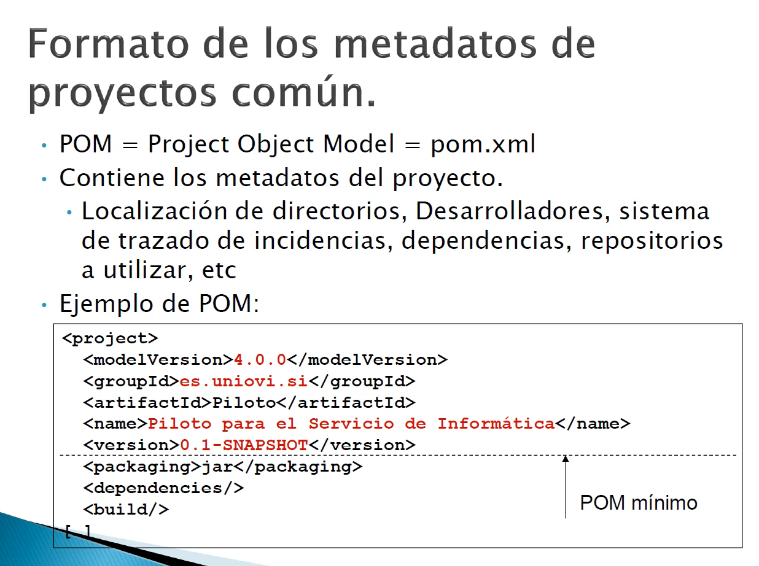

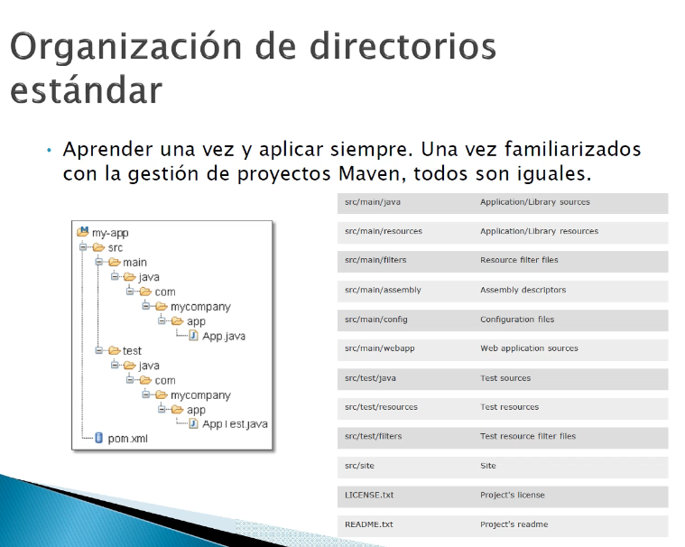

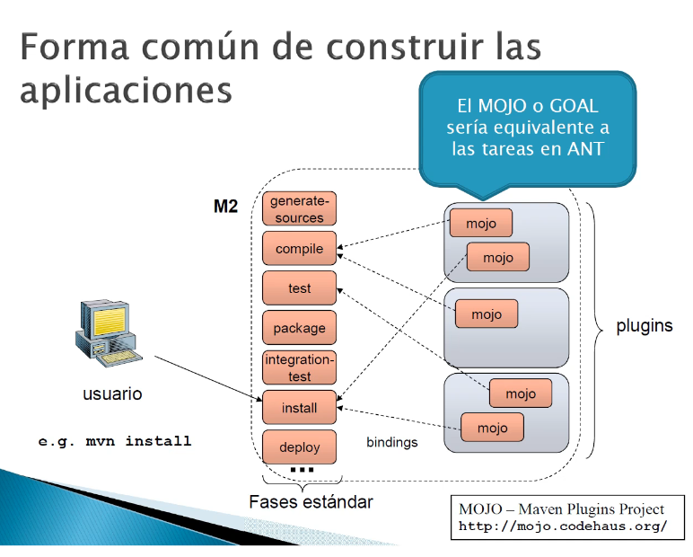

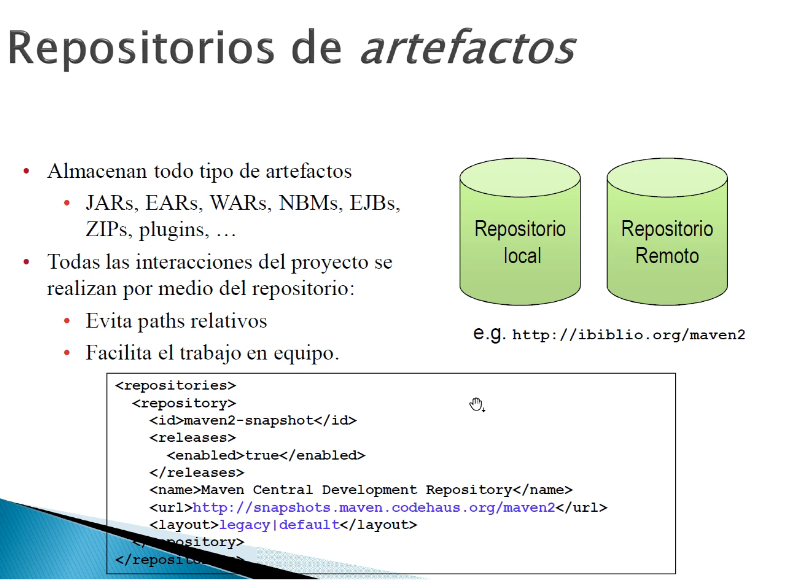

## Maven repository

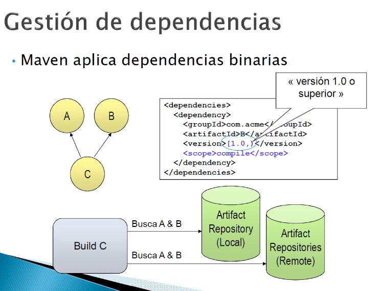

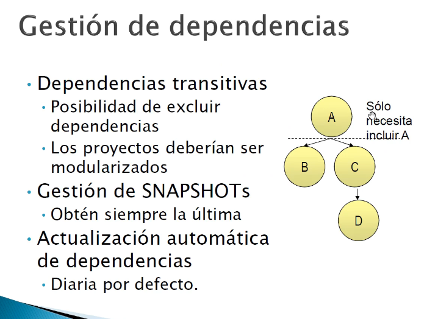

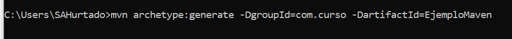

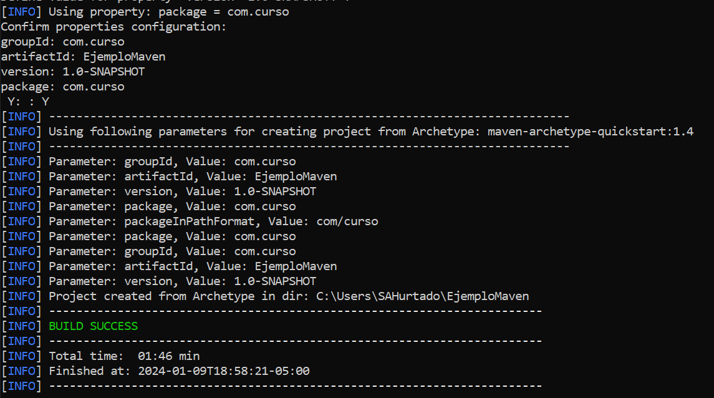

generar documentacion con plugin javadoc:javadoc

para mirar informacion del paquete se usa site:siste plugin

## Arbol de dependencias

mvn dependency:tree
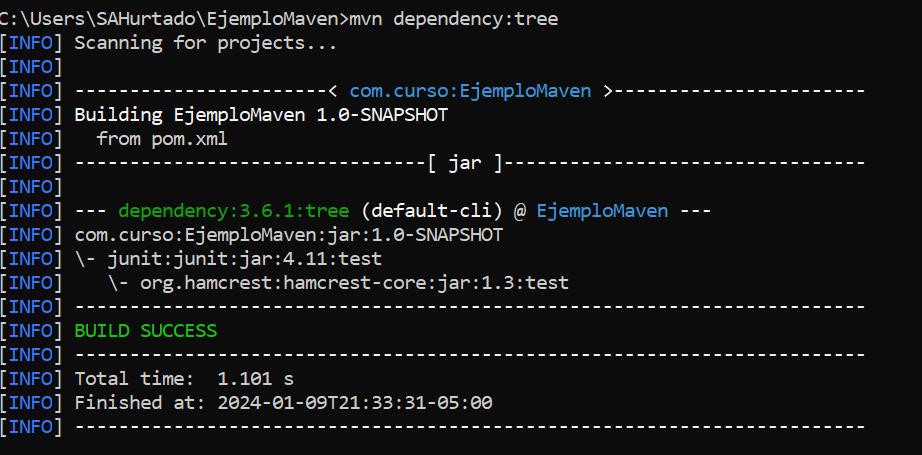

mvn dependency:resolve

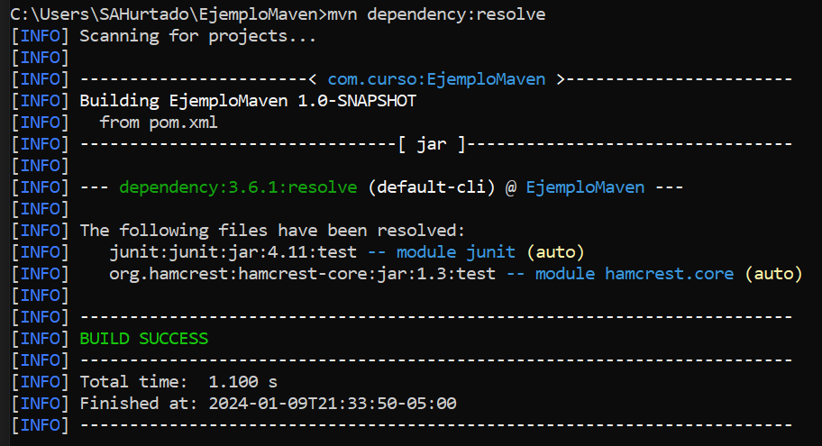

mvn dependency:analyze 

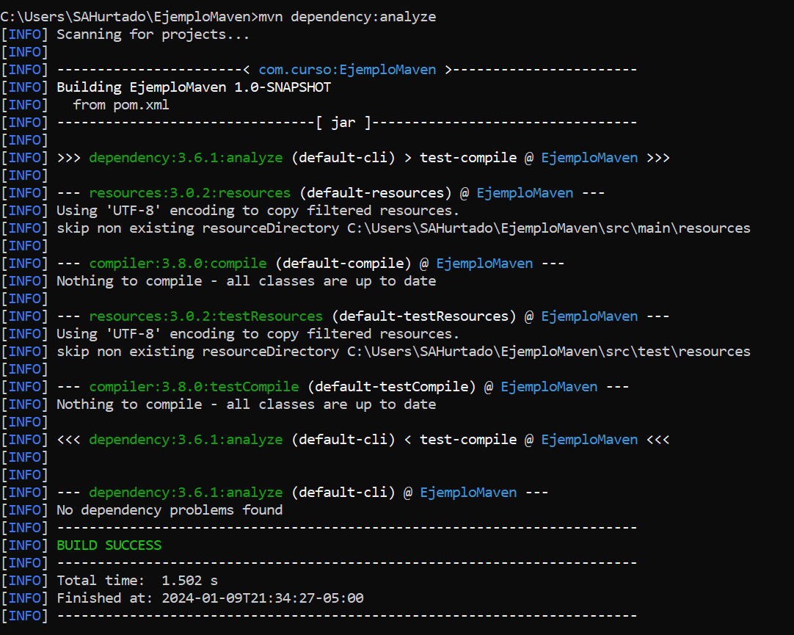

## Maven webapp

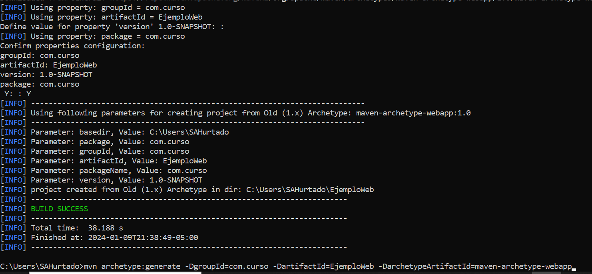

### perfiles

Por supuesto. Los perfiles en Maven son una característica poderosa que te permite personalizar la construcción de tu proyecto según diferentes entornos, configuraciones específicas del usuario o cualquier otro criterio que desees. Aquí tienes una explicación más detallada sobre los perfiles en Maven y cómo se utilizan:

¿Qué son los Perfiles en Maven?
Los perfiles en Maven son conjuntos de configuraciones que pueden ser activadas o desactivadas según ciertas condiciones. Estas condiciones pueden ser propiedades específicas, variables de entorno, o incluso la presencia de ciertos archivos en el sistema. Los perfiles pueden contener cualquier configuración válida de Maven, como dependencias, plugins, propiedades, etc.

Creación de Perfiles en Maven:
Los perfiles en Maven se definen en el archivo pom.xml del proyecto. Aquí tienes un ejemplo de cómo se ve la definición de un perfil en el archivo pom.xml:

    <profiles>
        <profile>
            <id>desarrollo</id>
            <properties>
                <environment>desarrollo</environment>
            </properties>
            <activation>
                <activeByDefault>true</activeByDefault>
            </activation>
        </profile>
        <profile>
            <id>produccion</id>
            <properties>
                <environment>produccion</environment>
            </properties>
        </profile>
    </profiles>
Activación de Perfiles:
Los perfiles pueden ser activados de diferentes maneras:

Activación por Defecto (activeByDefault): Si se establece a true, el perfil se activará automáticamente a menos que otro perfil con mayor prioridad sea activado explícitamente.

Activación por Propiedad: Se puede activar un perfil según el valor de una propiedad definida en el archivo pom.xml, en las opciones de línea de comandos, o en el archivo de configuración de Maven (settings.xml).

Activación por JDK: Se pueden activar perfiles según la versión del JDK que se esté utilizando.

Activación por Sistema Operativo: Los perfiles pueden activarse según el sistema operativo en el que se esté ejecutando Maven.

Ejemplo Práctico:
Supongamos que tienes un proyecto Java y quieres diferenciar la configuración entre un entorno de desarrollo y un entorno de producción. Aquí tienes un ejemplo de cómo puedes definir y utilizar perfiles en tu proyecto Maven:

    <profiles>
        <profile>
            <id>desarrollo</id>
            <properties>
                <environment>desarrollo</environment>
                <db.url>jdbc:mysql://localhost:3306/dev_db</db.url>
            </properties>
            <activation>
                <activeByDefault>true</activeByDefault>
            </activation>
        </profile>
        <profile>
            <id>produccion</id>
            <properties>
                <environment>produccion</environment>
                <db.url>jdbc:mysql://produccion_db_server:3306/prod_db</db.url>
            </properties>
        </profile>
    </profiles>
En este ejemplo, el perfil de desarrollo está activado por defecto y define la URL de la base de datos para el entorno de desarrollo. El perfil de producción, por otro lado, define la URL de la base de datos para el entorno de producción.

Al compilar y empaquetar tu proyecto Maven, puedes activar el perfil deseado utilizando la opción -P seguida del nombre del perfil. Por ejemplo:

    mvn clean install -Pproduccion
Este comando activará el perfil de producción y utilizará la configuración definida en ese perfil durante el proceso de construcción.