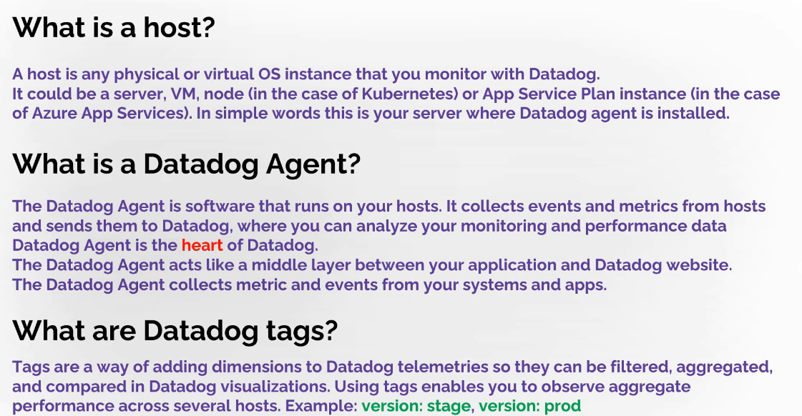
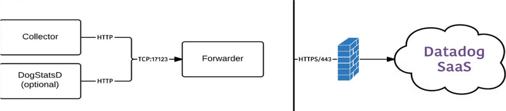

# Datadog

Aplication performance management

Datadog is an observability service for cloud-scale applications, providing monitoring of servers, databases, tools, and services, through a SaaS-based data analytics platform.

there are multiple ways of sending data to datadog:

1. from datadog agent
2. using datadog api
3. integration

The Datadog Agent is software that runs on your hosts. After installation it automatically starts to collects events and metrics from hosts and sends them to Datadog, where you can search, filter, aggregate and alert on information. The Datadog Agent acts like a middle layer between your application and Datadog website.

The main components are two:
1. Collector – which collects data from your host on every 15 seconds
2. Forwarder – which sends data to Datadog over https

The main configuration file is: C:\ProgramData\Datadog\datadog.yaml
Configuration files for Integrations are in: C:\ProgramData\Datadog\conf.d

# Fundamentals of Datadog

Datadog is a performance monitoring and analytics tool that helps you observe and gain insights into your systems, applications, and infrastructure. Here are the fundamentals of Datadog broken down into steps:

1. Registration and Agent Installation:

To get started, you need to register on the Datadog website. After registration, you'll have a 14-day trial period to explore the platform.
You'll need to fill out fields, such as your email, full name, company name, and password.
2. Understanding the Datadog Agent:

The Datadog Agent is a software that runs on your hosts (servers, virtual machines, etc.). Once installed, it automatically begins collecting metrics and events.
The Agent acts as a middle layer, gathering data from your applications and sending it to Datadog's servers for analysis.
3. Main Components of the Agent:

The Agent has two primary components:
Collector: This collects data every 15 seconds from your host.
Code Forwarder: This sends the collected data to the Datadog platform over HTTPS.

4. Configuration:

After installation, a configuration folder is created, containing the main configuration file and other files necessary for integrations with additional services.

5. Data Metrics:

The Agent provides access to various system metrics, such as CPU usage, disk performance, memory consumption, and specific application metrics through integrations.
6. Integration and Alerts:

For expanded monitoring capabilities, you might need to set up specific integrations depending on the applications you wish to monitor, such as web servers or databases.
Datadog not only enhances observability but also allows for configurations that enable alerting based on metrics that matter to your infrastructure and applications. This proactive approach helps in maintaining performance and reliability.

# AWS and datadog 

https://docs.datadoghq.com/integrations/amazon_web_services/
https://docs.datadoghq.com/integrations/guide/aws-terraform-setup/

