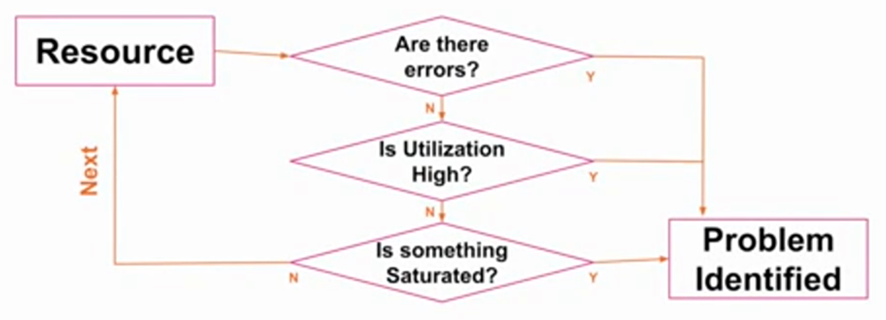

# Adopting monitoring frameworks - RED and USE

When something goes wrong and you need to troubleshoot it, common questions you should be looking to answer include:

- What makes you think there is a problem?
- Has this system ever performed well?
- What is the environment?
- What changed? Software? Hardware? Load?
- Can the performance issue be expressed in latency?
- Does the problem affect other people or applications?

But as well as this, modern monitoring frameworks can help you make the most of your tools, understand the signals and all of the noise to reduce MTTR (Mean-Time-To-Resolve) before customers get affected.

There are three main frameworks that you can follow which act as checklists when something goes wrong. One of these is Google's Golden Signals, which covers the metrics you should always be tracking in a microservices environment:

- Latency, or how long it takes to service a request. Define a benchmark for successful request and monitor that against failed requests. Additionally, by tracking the latency of errors, you can address concerns about the speed of identifying incidents and how quickly you can respond.
- Errors, whether they're defined based through manual logic you set up or explicit events like failed HTTP requests.
- Saturation, or the utilization of systems. You should define a saturation metric that indicates when your service is maxed out.
- Traffic, or how much stress your system is taking on from the number of users or transactions running through your service. Depending on your business type, this can vary a lot - for example, in an ecommerce environment, seasonality seen through events like Black Friday can impact what benchmarks are appropriate. By monitoring real user interactions, you can better understand the end user's experience.
While Google's Golden Signals are applicable in microservice environments, hybrid environments may find more value from the USE and RED frameworks.

## USE monitoring - utilization, saturation, errors

USE monitoring is resource-scoped, and focuses more on infrastructure. It's intended to be used early in an investigation to identify bottlenecks. It requires that for every resource, you'll need to check:

- Utilization. how busy is the resource or amount in use?
- Saturation. how much extra work is not being processed due to lack of resource?
- Errors. count all error events.

This approach requires you to ask questions to focus down on a problem area, rather than starting from the perspective of a set metric. It's especially appropriate for finding root cause within a microservices environment, since a service with an error or problem might not be the culprit - for example, a change to another service, or an infrastructure issue.

The resources tracked within USE can be physical or virtual - for example, CPUs, memory, networks, storage, controllers or interconnects. These resources are not consumed directly by applications. One objective of system monitoring is to know how resources are utilized. Typical questions you might ask include:

- Is your CPU fully utilized?
- Is your application running out of memory?
- Do you have enough disk capacity left?

While fully-utilized resources are be an indication of a bottleneck, they might not present real problems - for example, a fully-utilized CPU means you're making good use of the system, and problems only start when incoming requests start queuing or producing errors affecting app performance. Monitoring systems use queuing in a lot of areas to optimize system performance and distribute load, which is where saturation comes in.

To begin using USE, you need a list of resources to iterate through, and a data path with interdependencies to interrogate. Every component in the data path is a resource to be checked.

So at the point you receive an alert informing you of an error, you can follow this workflow. Start with a resource, for example, CPUs or memory. Ask whether there are errors, what utilization looks like, and whether the resource is saturated. Repeat with each resource until the problem is identified.

USE's strength is its speed and visibility - by considering all resources, you're unlikely to overlook any issues. It will, however, find only certain types of issues - for example, bottlenecks and errors - so should not be relied upon alone, but rather used as one tool in a toolbox.

## RED monitoring - rate, errors, duration
RED is request-scoped - that is, it focuses more on end-user satisfaction. 

- Rate, or how many requests come through. In some cases, how big they are also has an impact. For example, if you're running a photo hosting site, you'll probably also want to know the size of the photos uploaded to your site. Relevant rates for you depend on what exactly your system looks like. Examples of this could be the rate of HTTP requests, REST calls, items being queued, or API calls. Any environment that can fail on peak traffic is a good environment to monitor rate on. It's useful to note that both spikes and drops in requests are valuable pieces of information to pay attention to.
- Errors, or problems that cause an incomplete, incorrect or unexpected result. Where errors occur, they have to be fixed.
- Durations help you bring events into a causal order. This can sometimes be hard in modern microservices environments, so having durations for requests help you figure out what order things happened in. Both client-side and server-side durations are important for both you and your customers.

In modern applications, there are usually a lot of services involved. Where a problem occurs, one of these services are usually to blame, either because the service or the infrastructure it was on had a problem. Pinpointing where things went wrong requires instrumentation and requires you to be able to work out how long requests spent in each service, whether services have errors, and how many requests each service has seen. That's why RED is so useful in a microservices-based model.

### Why use USE and RED?
USE and RED are good frameworks to adopt for a number of reasons:

- They are easy to remember.
- They help reduce decision fatigue.
- They help drive standardization and consistency, giving your team and other people throughout your organization a common language.
- They can help drive automation.
- Even team members responding to an issue who weren't involved with instrumenting or building the system can use these frameworks.
- They serve as a proxy for user happiness, tracking the things that affect your customers the most. 

# LOGS
the application story

# METRICs
Overall system health

# TRACEs

The context, the distributed path between apps
