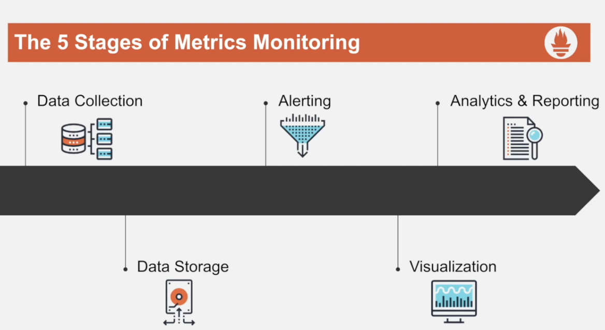
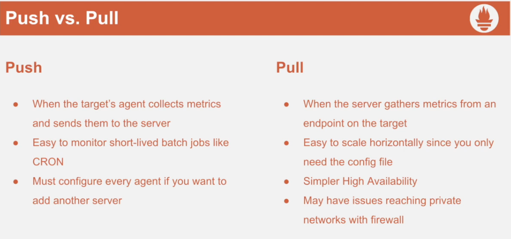
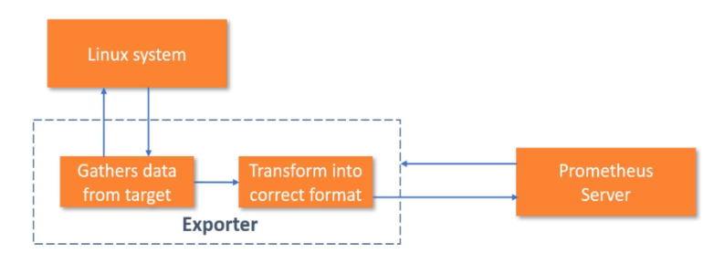
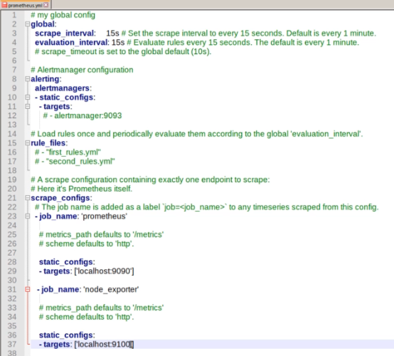
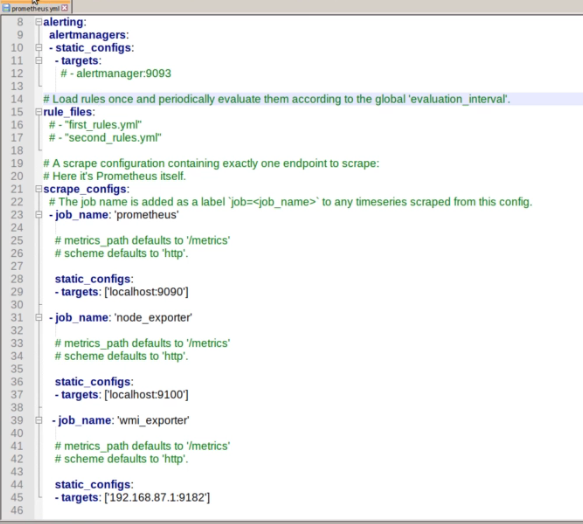
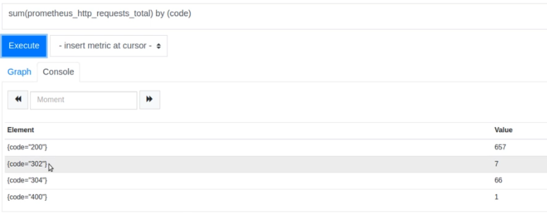
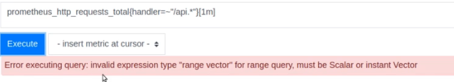
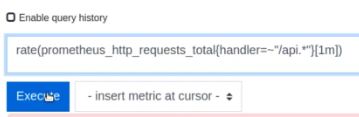

# Prometheus

Is an open source system monitoring and alerting toolkit with an active ecosystem

uses a multidimensional dat amodel with time series data identified by metric name and key/value pairs

EX: http_request_total {method="get"}

- uses a very simple query language "PromQL"
- no reliance on distributed storage; single server nodes are autonomous

## Architecture of prometheus server


The Prometheus ecosystem consists of multiple components, many of which are optional:

- the main Prometheus server which scrapes and stores time series data
- client libraries for instrumenting application code
- a push gateway for supporting short-lived jobs
- special-purpose exporters for services like HAProxy, StatsD, Graphite, etc.
- an alertmanager to handle alerts
- various support tools

Most Prometheus components are written in Go, making them easy to build and deploy as static binaries.





## Dimensional Data model
```
<aggregators> <functions> metric_name{key="value", ...}

```

## Overview of the prometheus service package

- **Console_libraries** prometheus expresion browser
- **Consoles** prometheus expresion browser
- **./tsdb** tool interact with time series
- **./promt** run queries from command line
- **prometheus.yml** configurations of prometheus
- **./prometheus**

```
./prometheus --storage.tsdb.retention.time=13d --config.file="./prometheus.yml" &
```

## Node exporter

La herramienta de node exporter en Prometheus también es conocida como Prometheus Node Exporter y una de sus características principales es que puede ser implementada en los procesos para obtener métricas de los nodos e información del sistema.

Además de esto, la opción de node exporter en Prometheus se encarga de ofrecer información útil para supervisar el rendimiento de un servidor o de un nodo.

```
kill -HUP %numero proceso prometheus para cargar nueva configuracion
```

## Prometheus as a Systemd Service

- Prometheus user
    ```
    sudo useradd -r -s /bin/false prometheus
    ```

- New directories
    - sudo mkdir /prom_data
    - sudo mkdir /etc/prometheus
    - sudo chown prometheus:prometheus /prom_data
- Extract and move files
    - cd prometheus*
    - mv console* , prometheus.yml /etc/prometheus
    - sudo chown -R prometheus:prometheus /etc/prometheus
- Move binaries
    - sudo mv prom* /usr/local/bin
    - sudo chown prometheus:prometheus /usr/local/bin/prom* 
- Create service file
    - sudo vim /etc/systemd/system/<service_name>.service

```
[Unit]
Description=Prometheus
Wants=network-online.target
After=neteork-online.target

[Service]
User=prometheus
Group=prometheus
Type=simple

ExecStart=/usr/local/bin/prometheus \
  --config.file /etc/prometheus/prometheus.yml \
  --storage.tsdb.path /prom_data \
  --web.console.templates=/etc/prometheus/consoles \
  --web.console.libraries=/etc/prometheus/console_libraries \
  --web.enable-lifecycle


[Install]
WantedBy=multi-user.target

```

## Node Exporter as a Systemd Service

- Nodeexporter user

  sudo useradd -r -s /bin/false nodeexporter
- move binaries
    - sudo mv node* /usr/local/bin
    - sudo chown nodeexporter:nodeexporter /usr/local/bin/node*
- create service file
    - sudo vim /etc/systemd/system/\<service_name>.service

```
[Unit]
Description=NodeExporter
Wants=network-online.target
After=network-online.target

[Service]
User=nodeexporter
Group=nodeexporter
Type=simple

ExecStart=/usr/local/bin/node_exporter

[Install]
WantedBy=multi-user.target
```

sudo systemctl daemon-reload
sudo systemctl start nodeexporter
sudo systemctl status nodeexporter

## Prometheus as a Docker Service


## Metrics

### Prometheus Metrics Format

- Summary: Tracks the size and number of events
    - values must be non negative
    - used to track latency
    - obsrve()
- Gauge: Can go both up and down
    - essentially a snapshot of the current state
    - inc(), dec(), set()
- Counter: Goes up and resets when the process resets
    - Needed to track rates
    - track how often a specific code path is executed
    - inc()  

- Histagram: track the size and number of events with buckets
    - Used to tracks the size and number of events with buckets
    - bucket = counter set

### Service types

- Online-serving systems: Has a human or other service waitin on a response
    - key Metrics
        - Request
        - Errors
        - Duration
- Offline-serving systems: Has no response requests- usaually pipelines
    - Key metrics:
        - Utilization
        - Saturation
        - Errors
- Batch jobs:Run on a regular schedule, use the push gateway
    - key metrics:
        - Total run duration
        - Duration per Stage
        - Job success Timestamp

### Metric Name Structure

- Do
    - Format: library_name_unit_suffix
    - snake_case
    - Be specific e.g cron_job_duration
    - Start with a letter
    - Use base units w/ no prefix. Prometheus uses base units
- Don'ts
    - Use names already in use e.g process
    - Use official suffixes: _total, _count, _sum, _bucket
    - start with an underscore or use colons

### Limitations to monitoring metrics

- There's a poinnt where operational and resource cost outweigh the benefits of instrumentions

RESOURCE COST(%)= Metric INSTANCES /SERVER Threshold *100

- Cardinality is the amount of metrics that you have


## Infraestrucutre Monitoring

There are a number of libraries and servers which help in exporting existing metrics from third-party systems as Prometheus metrics. This is useful for cases where it is not feasible to instrument a given system with Prometheus metrics directly (for example, HAProxy or Linux system stats).

Exporters job is to basically translte or act like proxy between promethesus sytem an third party system

[exporters prometheus](https://prometheus.io/docs/instrumenting/exporters/)

### WMI Exporter Monitoring Windows Systems

https://github.com/prometheus-community/windows_exporter

Configure the Prometheus WMI exporter to collect Windows system metrics.

The Prometheus WMI exporter runs as a Windows service. You configure the metrics that you want to monitor by enabling collectors.

### Docker Engine Metrics

Prometheus is an open-source systems monitoring and alerting toolkit. You can configure Docker as a Prometheus target. This topic shows you how to configure Docker, set up Prometheus to run as a Docker container, and monitor your Docker instance using Prometheus.

Currently, you can only monitor Docker itself. You cannot currently monitor your application using the Docker target.

To configure the Docker daemon as a Prometheus target, you need to specify the metrics-address. The best way to do this is via the daemon.json, which is located at one of the following locations by default. If the file does not exist, create it.

Linux: /etc/docker/daemon.json
Windows Server: C:\ProgramData\docker\config\daemon.json
Docker Desktop for Mac / Docker Desktop for Windows: Click the Docker icon in the toolbar, select Settings, then select Docker Engine.
If the file is currently empty, paste the following:

{
  "metrics-addr" : "127.0.0.1:9323"
}

If the file is not empty, add the new key, making sure that the resulting file is valid JSON. Be careful that every line ends with a comma (,) except for the last line.

Save the file, or in the case of Docker Desktop for Mac or Docker Desktop for Windows, save the configuration. Restart Docker.

Docker now exposes Prometheus-compatible metrics on port 9323.

[https://docs.docker.com/config/daemon/prometheus/ ](https://docs.docker.com/config/daemon/prometheus/)


__________________

DEV/QA/STAG

Si deseas realizar dos consultas distintas, una con count() y otra con sum() en Prometheus, puedes combinarlas en una sola consulta utilizando operadores y agrupadores. Aquí tienes un ejemplo genérico:


    sum(metrico_total) by (etiqueta_comun) + count(metrico_distinto) by (etiqueta_comun)
En este ejemplo:

metrico_total y metrico_distinto son métricas diferentes que podrían representar diferentes tipos de datos.
etiqueta_comun es una etiqueta que ambas métricas comparten y por la cual deseas agrupar los resultados.
Asegúrate de reemplazar metrico_total y metrico_distinto con las métricas reales que estás utilizando y ajusta etiqueta_comun según las etiquetas compartidas que quieras usar para agrupar.

Aquí hay un ejemplo más concreto utilizando métricas de Kubernetes:


    sum(container_cpu_usage_seconds_total) by (namespace) + count(kube_pod_info) by (namespace)
    
En este caso, la consulta suma el tiempo total de CPU utilizado por los contenedores y cuenta el número de pods, ambos agrupados por el espacio de nombres (namespace).

Ajusta las consultas según tus necesidades específicas y las métricas que estés utilizando en tu entorno.

______________________


La consulta PromQL que proporcionaste tiene dos partes:

sum(tenants_number_of_broken{service_name="$serviceName", pod=~"$pod"}): Esta parte de la consulta utiliza la función sum() para agregar el valor de la métrica tenants_number_of_broken que cumple ciertas condiciones. Estas condiciones son:

El service_name debe coincidir con el valor de la variable $serviceName.
El pod debe coincidir con un valor que coincida con el patrón especificado en la variable $pod (usando coincidencia de expresiones regulares con =~).
Esta parte de la consulta suma todos los valores de tenants_number_of_broken que cumplen estas condiciones.

OR on() vector(0): Esta parte de la consulta es interesante. En PromQL, OR no es un operador lógico que se use típicamente como lo sería en un lenguaje de programación, sino que se utiliza para realizar operaciones de combinación de series temporales. En este caso, OR está combinando el resultado de la operación sum() con un vector de longitud cero.

on(): La cláusula on() se utiliza para especificar las etiquetas de las series temporales a las que se aplica la operación. En este caso, está vacía, lo que significa que no se aplica a ninguna etiqueta en particular.

vector(0): vector(0) es una función que crea una serie temporal con un solo punto que tiene un valor de 0. En este caso, se está creando un vector con un solo punto que tiene un valor de 0.

La combinación de estas dos partes de la consulta significa que si no hay datos disponibles que cumplan con las condiciones de la primera parte (sum()), la consulta devolverá un vector con un único punto que tiene un valor de 0. Esto podría ser útil para representar un valor predeterminado en caso de que no haya datos disponibles en la primera parte de la consulta.

___________________

# Promethues config file

https://prometheus.io/docs/prometheus/latest/configuration/configuration/

# Prometheus Exporters

There are a number of libraries and servers which help in exporting existing metrics from third-party systems as Prometheus metrics. This is useful for cases where it is not feasible to instrument a given system with Prometheus metrics directly (for example, HAProxy or Linux system stats).



## Node exporter

the node exporter is a prometheus exporter for hardware and OS metrics exposed by unix kernels

node exporter expose metric in 9100 port

to scrap this metrics with promethues you need to edit de config prometheus.yaml add new scrape_config



restar prometheus to get the changes

https://prometheus.io/docs/instrumenting/exporters/

## WMI exporter (Windows Management Instrumentation)

windows exporter expose metric in 9182 port

 first you nned to conect the windows machine with the machine you have the prometheus server

to scrap this metrics with promethues you need to edit de config prometheus.yaml add new scrape_config



# PROMQL

## Data types

### instant vector:

A set of time series containing a single sample for each time series, all sharing the same timestamp

### range vector
A set of time series containing a range of data points over time for each time series

### scalar

A simple numeric floating point value

### string

A simple string value, currently unused

## Selector and Matchers

process_cpu_seconds_total{job='node_exporter'}

### MAtcher types

#### Equality matcher(=)

Select labels that are exactly equal to the provide string

Ex: process_cpu_seconds_total{job='node_exporter'}

#### Negative Equality matcher(!=)

Select labels that are not equal to the provided string
Ex: process_cpu_seconds_total{job!='node_exporter'}

#### Regualr expression matcher (=~)

tilda alt+126

Select labels that regex-match with the provided string

Ex: prometheus_http_requests_total{handler=~"api.*"}

#### Negative Regular expression matcher (!~)

Select labels that do not regex-match with the provided string

Ex: prometheus_http_requests_total{handler!~"api.*"}

## Operators

### Binary operator

are the operators that take two operands and performs the speified calculations on them

#### Arithmetic binary operator
are the symbol that represents arithmetic math operations

+,-,*,/,%,^

binary arithmetic operators are defined between scalar/scalar, vector/scalar and vector/vector value pairs

#### Comparison binary operator

is a mathematical symbol whic is used to compare

    == equal
    != not equal
    > greater than
    < less than
    >= greater or equal 
    <= less or equal

comparison operators are defined between scalar/scalar, vector/scalar and vector/vector value pairs

#### Logical/set binary operators

are use to combine simple relational expression into more complex expression

and (intersection)
or (union)
unless (complement)

logical operator are defined between instan vector only


https://prometheus.io/docs/prometheus/latest/querying/operators/

### Ignoring and on keywords

These vector matching keywords allow for matching between series with different label sets providing:

on
ignoring

Label lists provided to matching keywords will determine how vectors are combined.


### Agregation operators

are special mathematical functions that are used to combine information

- sum (calculate sum over dimensions)
- min (select minimum over dimensions)
- max (select maximum over dimensions)
- avg (calculate the average over dimensions)
- group (all values in the resulting vector are 1)
- stddev (calculate population standard deviation over dimensions)
- stdvar (calculate population standard variance over dimensions)
- count (count number of elements in the vector)
- count_values (count number of elements with the same value)
- bottomk (smallest k elements by sample value)
- topk (largest k elements by sample value)
- quantile (calculate φ-quantile (0 ≤ φ ≤ 1) over dimensions)



topk(3, sum (node_cpu_seconds_total) by (mode))

this query bring the top 3 modes sopend most time

bottomk(3, sum (node_cpu_seconds_total) by (mode))

this query bring the top 3 modes spend less time

### rate y irate

rate calculete the per second average rate increase of the tiem series in the range vector

outputs the rate at which particular counter is increasing

rate should only be used with counters and native histograms where the components behave like counters. It is best suited for alerting, and for graphing of slow-moving counters.

Note that when combining rate() with an aggregation operator (e.g. sum()) or a function aggregating over time (any function ending in _over_time), always take a rate() first, then aggregate. Otherwise rate() cannot detect counter resets when your target restarts.

you can solve "error executing query: invalid expression type "range vector" for range query, must be scalar or instanct vector" use rate






irate calculates the instant rate of increase of the time series in the range vector

irate should only be used when graphing volatile, fast-moving counters. Use rate for alerts and slow-moving counters, as brief changes in the rate can reset the FOR clause and graphs consisting entirely of rare spikes are hard to read.

The following example expression returns the per-second rate of HTTP requests looking up to 5 minutes back for the two most recent data points, per time series in the range vector:

irate(http_requests_total{job="api-server"}[5m])

Note that when combining irate() with an aggregation operator (e.g. sum()) or a function aggregating over time (any function ending in _over_time), always take a irate() first, then aggregate. Otherwise irate() cannot detect counter resets when your target restarts.

# Chnages, Deriv, predict_linear

changes()
For each input time series, changes(v range-vector) returns the number of times its value has changed within the provided time range as an instant vector.

```
changes(process_start_time_seconds{job="node_exporter"}[1h])
```

deriv()
deriv(v range-vector) calculates the per-second derivative of the time series in a range vector v, using simple linear regression. The range vector must have at least two samples in order to perform the calculation. When +Inf or -Inf are found in the range vector, the slope and offset value calculated will be NaN.

deriv should only be used with gauges.

how is resident memory changing per-second based on past hour

```
deriv(process_resident_memory_bytes{job="prometheus"}[1h])

```
predict_linear()
predict_linear(v range-vector, t scalar) predicts the value of time series t seconds from now, based on the range vector v, using simple linear regression. The range vector must have at least two samples in order to perform the calculation. When +Inf or -Inf are found in the range vector, the slope and offset value calculated will be NaN.

predict_linear should only be used with gauges.

```
predict_linear(node_memory_MemFree_bytes{job="node_exporter}[1h],2*60*60)/1024
```
https://prometheus.io/docs/prometheus/latest/querying/functions/#changes

# <aggregation>_over_time()
The following functions allow aggregating each series of a given range vector over time and return an instant vector with per-series aggregation results:

- avg_over_time(range-vector): the average value of all points in the specified interval.
- min_over_time(range-vector): the minimum value of all points in the specified interval.
- max_over_time(range-vector): the maximum value of all points in the specified interval.
- sum_over_time(range-vector): the sum of all values in the specified interval.
- count_over_time(range-vector): the count of all values in the specified interval.
-quantile_over_time(scalar, range-vector): the φ-quantile (0 ≤ φ ≤ 1) of the values in the specified interval.
- stddev_over_time(range-vector): the population standard deviation of the values in the specified interval.
- stdvar_over_time(range-vector): the population standard variance of the values in the specified interval.
- last_over_time(range-vector): the most recent point value in the specified interval.
- present_over_time(range-vector): the value 1 for any series in the specified interval.

If the feature flag --enable-feature=promql-experimental-functions is set, the following additional functions are available:

mad_over_time(range-vector): the median absolute deviation of all points in the specified interval.
Note that all values in the specified interval have the same weight in the aggregation even if the values are not equally spaced throughout the interval.

avg_over_time, sum_over_time, count_over_time, last_over_time, and present_over_time handle native histograms as expected. All other functions ignore histogram samples.

