os# PYTHON


## VARIABLES

### Creating Variables

Python has no command for declaring a variable.

A variable is created the moment you first assign a value to it. are case sensitive

 x = 5
y = "John"
print(x)
print(y)

### Casting

If you want to specify the data type of a variable, this can be done with casting.
Example
x = str(3)    # x will be '3'
y = int(3)    # y will be 3
z = float(3)  # z will be 3.0 

a=eval(input("enter a value: "))

### Get the Type

You can get the data type of a variable with the type() function.

x = 5
y = "John"
print(type(x))
print(type(y)) 

### Variable Names
A variable can have a short name (like x and y) or a more descriptive name (age, carname, total_volume). Rules for Python variables:

  - A variable name must start with a letter or the underscore - character
  - A variable name cannot start with a number
  - A variable name can only contain alpha-numeric characters and underscores (A-z, 0-9, and _ )
  - Variable names are case-sensitive (age, Age and AGE are three different variables)

### Many Values to Multiple Variables

Python allows you to assign values to multiple variables in one line:
Example
x, y, z = "Orange", "Banana", "Cherry"
print(x)
print(y)
print(z)

And you can assign the same value to multiple variables in one line:
Example
x = y = z = "Orange"
print(x)
print(y)
print(z)

### Output Variables

The Python print() function is often used to output variables.

x = "Python"
y = "is"
z = "awesome"
print(x, y, z)

You can also use the + operator to output multiple variables:
Example
x = "Python "
y = "is "
z = "awesome"
print(x + y + z)

x=3
y=5.7
lang_name="python"
print("{} {} {}".format(x,y,lang_name))
print("{} \n{} \n{}".format(x,y,lang_name))
print(f"xa values is: {x} the y values is:{y} \nthe lang  is:  {lang_name}")

### Python Data Types

Variables can store data of different types, and different types can do different things.

Python has the following data types built-in by default, in these categories:
- Text Type: 	str
- Numeric Types: 	int, float, complex
- Sequence Types: 	list, tuple, range
- Mapping Type: 	dict
- Set Types: 	set, frozenset
- Boolean Type: 	bool
- Binary Types: 	bytes, bytearray, memoryview

| Syntax | Description |
| ----------- | ----------- |
| x = "Hello World" |	str 	|
| x = 20 	   |int |	
| x = 20.5 	|float 	|
| x = 1j 	|complex 	|
| x = ["apple", "banana", "cherry"] 	|list 	|
|x = ("apple", "banana", "cherry") 	|tuple 	|
|x = range(6) 	|range 	|
|x = {"name" : "John", "age" : 36} |	dict |	
|x = {"apple", "banana", "cherry"} 	|set |	
|x = frozenset({"apple", "banana", "cherry"}) |	frozenset| 	
|x = True |	bool 	|
|x = b"Hello" |	bytes 	|
|x = bytearray(5) |	bytearray | 	 
|x = memoryview(bytes(5)) |	memoryview |

### Python Collections (Arrays)

There are four collection data types in the Python programming language:

  -  List is a collection which is ordered and changeable. Allows duplicate members. []
  - Tuple is a collection which is ordered and unchangeable. Allows duplicate members. ()
  - Set is a collection which is unordered, unchangeable*, and unindexed. No duplicate members. {}
  - Dictionary is a collection which is ordered** and changeable. No duplicate members. {}with key value pair

*Set items are unchangeable, but you can remove and/or add items whenever you like.

**As of Python version 3.7, dictionaries are ordered. In Python 3.6 and earlier, dictionaries are unordered.

When choosing a collection type, it is useful to understand the properties of that type. Choosing the right type for a particular data set could mean retention of meaning, and, it could mean an increase in efficiency or security.


## List []

Lists are used to store multiple items in a single variable.

Lists are one of 4 built-in data types in Python used to store collections of data, the other 3 are Tuple, Set, and Dictionary, all with different qualities and usage.

Lists are created using square brackets:
Example

Create a List:
thislist = ["apple", "banana", "cherry"]
print(thislist)
List Items

List items are ordered, changeable, and allow duplicate values.

List items are indexed, the first item has index [0], the second item has index [1] etc.
Ordered

When we say that lists are ordered, it means that the items have a defined order, and that order will not change.

If you add new items to a list, the new items will be placed at the end of the list.

The list() Constructor

It is also possible to use the list() constructor when creating a new list.
Example

Using the list() constructor to make a List:
thislist = list(("apple", "banana", "cherry")) # note the double round-brackets
print(thislist)

Python has a set of built-in methods that you can use on lists/arrays.

|Method	|Description|
|-|-|
append()	|Adds an element at the end of the list
clear()	|Removes all the elements from the list
copy()	|Returns a copy of the list
count()	|Returns the number of elements with the specified value
extend()	|Add the elements of a list (or any iterable), to the end of the current list
index()	|Returns the index of the first element with the specified value
insert()	|Adds an element at the specified position mylist.insert(posicion,valor a insertar)
pop()	|Removes the element at the specified position mylist.pop(posicion) si no se pone posicion elimina ultimo
remove()	|Removes the first item with the specified value
reverse()	|Reverses the order of the list
sort()	|Sorts the list|

### TUPLE ()

Tuple

Tuples are used to store multiple items in a single variable.

A tuple is a collection which is ordered and unchangeable.

Tuples are written with round brackets.
Example

Create a Tuple:
thistuple = ("apple", "banana", "cherry")
print(thistuple)

|Method|	Description|
|-|-|
|count()	|Returns the number of times a specified value occurs in a tuple
|index()	|Searches the tuple for a specified value and returns the position of where it was found

### SET {}
 
Sets are used to store multiple items in a single variable.

Set is one of 4 built-in data types in Python used to store collections of data, the other 3 are List, Tuple, and Dictionary, all with different qualities and usage.

A set is a collection which is unordered, unchangeable*, and unindexed.

* Note: Set items are unchangeable, but you can remove items and add new items.

Sets are written with curly brackets.
Example

Create a Set:
thisset = {"apple", "banana", "cherry"}
print(thisset) 

Method|	Description|
|-|-|
add()|	Adds an element to the set
clear()	|Removes all the elements from the set
copy()|	Returns a copy of the set
difference()|	Returns a set containing the difference between two or more sets
difference_update()|	Removes the items in this set that are also included in another, specified set
discard()|	Remove the specified item
intersection()|	Returns a set, that is the intersection of two or more sets
intersection_update()|	Removes the items in this set that are not present in other, specified set(s)
isdisjoint()|	Returns whether two sets have a intersection or not
issubset()|	Returns whether another set contains this set or not
issuperset()|	Returns whether this set contains another set or not
pop()|	Removes an element from the set
remove()|	Removes the specified element
symmetric_difference()|	Returns a set with the symmetric differences of two sets
symmetric_difference_update()	|inserts the symmetric differences from this set and another
union()|	Return a set containing the union of sets
update()|	Update the set with another set, or any other iterable

### Dictionary {} key-value

Dictionaries are used to store data values in key:value pairs.

A dictionary is a collection which is ordered*, changeable and do not allow duplicates.

As of Python version 3.7, dictionaries are ordered. In Python 3.6 and earlier, dictionaries are unordered.

Dictionaries are written with curly brackets, and have keys and values:
Example

Create and print a dictionary:
thisdict =	{
  "brand": "Ford",
  "model": "Mustang",
  "year": 1964
}
print(thisdict)

Method	|Description|
|-|-|
clear()	|Removes all the elements from the dictionary
copy()|	Returns a copy of the dictionary
fromkeys()|	Returns a dictionary with the specified keys and value
get()|	Returns the value of the specified key
items()	|Returns a list containing a tuple for each key value pair
keys()|	Returns a list containing the dictionary's keys
pop()	|Removes the element with the specified key
popitem()|	Removes the last inserted key-value pair
setdefault()|	Returns the value of the specified key. If the key does not exist: insert the key, with the specified value
update()|	Updates the dictionary with the specified key-value pairs
values()|	Returns a list of all the values in the dictionary

## Python If ... Else
Python Conditions and If statements

Python supports the usual logical conditions from mathematics:

    Equals: a == b
    Not Equals: a != b
    Less than: a < b
    Less than or equal to: a <= b
    Greater than: a > b
    Greater than or equal to: a >= b

These conditions can be used in several ways, most commonly in "if statements" and loops.

An "if statement" is written by using the if keyword.
Example

If statement:
````
a = 33
b = 200
if b > a:
  print("b is greater than a")
````

In this example we use two variables, a and b, which are used as part of the if statement to test whether b is greater than a. As a is 33, and b is 200, we know that 200 is greater than 33, and so we print to screen that "b is greater than a".
Indentation

Python relies on indentation (whitespace at the beginning of a line) to define scope in the code. Other programming languages often use curly-brackets for this purpose.
Example

If statement, without indentation (will raise an error):
a = 33
b = 200
if b > a:
print("b is greater than a") # you will get an error

Elif

The elif keyword is pythons way of saying "if the previous conditions were not true, then try this condition".
Example
````
a = 33
b = 33
if b > a:
  print("b is greater than a")
elif a == b:
  print("a and b are equal")
  ````

In this example a is equal to b, so the first condition is not true, but the elif condition is true, so we print to screen that "a and b are equal".

Else

The else keyword catches anything which isn't caught by the preceding conditions.
Example
````
a = 200
b = 33
if b > a:
  print("b is greater than a")
elif a == b:
  print("a and b are equal")
else:
  print("a is greater than b")
````


Example

````
num=eval(input("ingrese un numero del 1 al 3: "))

num_word={1:'uno', 2:'dos',3:'tres'}
if num in [1,2,3]:
  print(num_word.get(num))
else:
  print("numero por fuera del rango")

````

## Python While Loops


Python has two primitive loop commands:

    while loops
    for loops

The while Loop

With the while loop we can execute a set of statements as long as a condition is true.
Example

Print i as long as i is less than 6:
i = 1
while i < 6:
  print(i)
  i += 1

Note: remember to increment i, or else the loop will continue forever.

## Python For Loops

A for loop is used for iterating over a sequence (that is either a list, a tuple, a dictionary, a set, or a string).

This is less like the for keyword in other programming languages, and works more like an iterator method as found in other object-orientated programming languages.

With the for loop we can execute a set of statements, once for each item in a list, tuple, set etc.
Example

Print each fruit in a fruit list:
fruits = ["apple", "banana", "cherry"]
for x in fruits:
  print(x)

The for loop does not require an indexing variable to set beforehand.
Looping Through a String

Even strings are iterable objects, they contain a sequence of characters:
Example

Loop through the letters in the word "banana":
for x in "banana":
  print(x)

````
usr_str=input("ingrese palabra: ")
index=0
for letter in usr_str:
    print(f'{letter} --> {index}')
    index=index+1
````
FIND ALL FILES IN A DIRECTORY WITH REQUEIRED EXTENSION
````
#!/usr/local/bin/python3
import os
req_path=input("Enter your directory path: ")
#req_ex=input("Enter the required files extention .py/.sh/.log/.txt: ")

if os.path.isfile(req_path):
  print(f"The given path {req_path} is a file. Please pass only directory path")
else:
  all_f_ds=os.listdir(req_path)
  if len(all_f_ds)==0:
     print(f"The given path is {req_path} an empty path")
  else:
     req_ex=input("Enter the required files extention .py/.sh/.log/.txt: ")
     req_files=[]
     for each_f in all_f_ds:
        if each_f.endswith(req_ex):
           req_files.append(each_f)
     if len(req_files)==0:
        print(f"There are no {req_ex} files in the logcation of {req_path}")
     else:
        print(f"There are {len(req_files)} files in the location of {req_path} with an extention of {req_ex}")
        print(f"So, the files are: {req_files}")
````

### The break Statement

With the break statement we can stop the loop before it has looped through all the items:

Example

Exit the loop when x is "banana":
fruits = ["apple", "banana", "cherry"]
for x in fruits:
  print(x)
  if x == "banana":
    break
Example

Exit the loop when x is "banana", but this time the break comes before the print:
fruits = ["apple", "banana", "cherry"]
for x in fruits:
  if x == "banana":
    break
  print(x)

  ### the continue statement

The continue keyword is used to end the current iteration in a for loop (or a while loop), and continues to the next iteration.

  ### the pass statemenet

The pass statement is used as a placeholder for future code.

When the pass statement is executed, nothing happens, but you avoid getting an error when empty code is not allowed.

Empty code is not allowed in loops, function definitions, class definitions, or in if statements.

##  Python Functions

A function is a block of code which only runs when it is called.

You can pass data, known as parameters, into a function.

A function can return data as a result.

### Creating a Function

In Python a function is defined using the def keyword:
Example
```
def my_function():
  print("Hello from a function")`
 ```

### Calling a Function

To call a function, use the function name followed by parenthesis:

Example
````
def my_function():
  print("Hello from a function")

my_function()
````

 Exmaple function in ptyhon to clear screen and list of directories in windows or linux
```
import os
import time
import platform
def mycode(cmd1,cmd2):
	print("Please wait. Cleaning the screen....")
	time.sleep(2)
	os.system(cmd1)
	print("Please wait finding the list of dir and files")
	time.sleep(2)
	os.system(cmd2)
if platform.system()=="Windows":
	mycode("cls","dir")
else:
	mycode('clear','ls -lrt')
```

### Arguments

Information can be passed into functions as arguments.

Arguments are specified after the function name, inside the parentheses. You can add as many arguments as you want, just separate them with a comma.

The following example has a function with one argument (fname). When the function is called, we pass along a first name, which is used inside the function to print the full name:
Example
```
def my_function(fname):
  print(fname + " Refsnes")

my_function("Emil")
my_function("Tobias")
my_function("Linus")
```
Arguments are often shortened to args in Python documentations.
Parameters or Arguments?

The terms parameter and argument can be used for the same thing: information that are passed into a function.

From a function's perspective:

A parameter is the variable listed inside the parentheses in the function definition.

An argument is the value that is sent to the function when it is called.


### Number of Arguments

By default, a function must be called with the correct number of arguments. Meaning that if your function expects 2 arguments, you have to call the function with 2 arguments, not more, and not less.
Example

This function expects 2 arguments, and gets 2 arguments:

```
def my_function(fname, lname):
  print(fname + " " + lname)

my_function("Emil", "Refsnes")

```
If you try to call the function with 1 or 3 arguments, you will get an error:
Example

This function expects 2 arguments, but gets only 1:
```
def my_function(fname, lname):
  print(fname + " " + lname)

my_function("Emil")
```
### Arbitrary Arguments, *args

If you do not know how many arguments that will be passed into your function, add a * before the parameter name in the function definition.

This way the function will receive a tuple of arguments, and can access the items accordingly:
Example

If the number of arguments is unknown, add a * before the parameter name:
```
def my_function(*kids):
  print("The youngest child is " + kids[2])

my_function("Emil", "Tobias", "Linus")
```
Arbitrary Arguments are often shortened to *args in Python documentations.

### Keyword Arguments

You can also send arguments with the key = value syntax.

This way the order of the arguments does not matter.
Example
```
def my_function(child3, child2, child1):
  print("The youngest child is " + child3)

my_function(child1 = "Emil", child2 = "Tobias", child3 = "Linus")
```
The phrase Keyword Arguments are often shortened to kwargs in Python documentations.

### Arbitrary Keyword Arguments, **kwargs

If you do not know how many keyword arguments that will be passed into your function, add two asterisk: ** before the parameter name in the function definition.

This way the function will receive a dictionary of arguments, and can access the items accordingly:
Example

If the number of keyword arguments is unknown, add a double ** before the parameter name:
```
def my_function(**kid):
  print("His last name is " + kid["lname"])

my_function(fname = "Tobias", lname = "Refsnes")
```

Arbitrary Kword Arguments are often shortened to **kwargs in Python documentations.

### Default Parameter Value

The following example shows how to use a default parameter value.

If we call the function without argument, it uses the default value:
Example
```
def my_function(country = "Norway"):
  print("I am from " + country)

my_function("Sweden")
my_function("India")
my_function()
my_function("Brazil")
```
### Passing a List as an Argument

You can send any data types of argument to a function (string, number, list, dictionary etc.), and it will be treated as the same data type inside the function.

E.g. if you send a List as an argument, it will still be a List when it reaches the function:
Example
```
def my_function(food):
  for x in food:
    print(x)

fruits = ["apple", "banana", "cherry"]

my_function(fruits)
```

### Return Values

To let a function return a value, use the return statement:
Example
```
def my_function(x):
  return 5 * x

print(my_function(3))
print(my_function(5))
print(my_function(9))
```

### The pass Statement

function definitions cannot be empty, but if you for some reason have a function definition with no content, put in the pass statement to avoid getting an error.
Example
```
def myfunction():
  pass
```
### Recursion

Python also accepts function recursion, which means a defined function can call itself.

Recursion is a common mathematical and programming concept. It means that a function calls itself. This has the benefit of meaning that you can loop through data to reach a result.

The developer should be very careful with recursion as it can be quite easy to slip into writing a function which never terminates, or one that uses excess amounts of memory or processor power. However, when written correctly recursion can be a very efficient and mathematically-elegant approach to programming.

In this example, tri_recursion() is a function that we have defined to call itself ("recurse"). We use the k variable as the data, which decrements (-1) every time we recurse. The recursion ends when the condition is not greater than 0 (i.e. when it is 0).

To a new developer it can take some time to work out how exactly this works, best way to find out is by testing and modifying it.
Example

Recursion Example
```
def tri_recursion(k):
  if(k > 0):
    result = k + tri_recursion(k - 1)
    print(result)
  else:
    result = 0
  return result

print("\n\nRecursion Example Results")
tri_recursion(6)
````

### How to use \_\_name__
```
if __name__="__main__"
````

```
#!/usr/local/bin/python3
import os

def main():
  req_path=input("Enter path to change working dir: ")
  print("The current working dir is: ",os.getcwd())
  try:
    os.chdir(req_path)
    print("Now your new working dir is: ",os.getcwd())
  except FileNotFoundError:
    print("Given path is not a valid path. So cant change working directory")
  except NotADirectoryError:
    print("Given path is a file path. So cant change working directory")
  except PermissionError:
    print("Sorry you dont have access for the given path. So cant chagne working directory")
  except Exception as e:
    print(e)
  return None


if __name__=="__main__":
   main()

```

## Operation with String

- word="Python"
- print(word)
- print(word[0]) print first character in the string
- print(word[-1]) print las character in the string
- print(word[2:5]) print range 2 to 5 
- print(word[0:]) print range 0 to end 
- print(word[:5]) print range 0 to 5

word_len=len(word) lenght of the word

- my_string="Python Scripting"
- print(my_string.lower())
- print(my_string.upper())
- print(my_string.swapcase())
- print(my_string.title()) start letters was capitalize
- print(my_string.capitalize()) first letter capitalize
- print(my_string.casefold()) lower letters in a string
- print(my_string.starswith('p')) boolean result
- print(my_string.endswith('g')) boolean result
- print(my_string.islower()) boolean result
- print(my_string.isupper()) boolean result
- x="python"
- y="-".join (x)
- print(y)   p-y-t-h-o-n
- print(x.center(20)) In 20 spaces center the words in x
- prin(x.zfill(10)) llena con ceros hasta completar los 10 caracteres 0000python
- print(x.strip()) remove space left and right end and final
-  print(x.strip('n')) remove if letter in the end or begin
- x= "python is easy"
x.split() the result is ['python','is','easy']
- x.split('is)  ['python','easy']
- x.count('is') cuenta cuantas veces esta la pabara o letra esta en un string
- x.index('p') ubicacion de una letra la primera que encuentre
- x.index('p',1) la letra p saltando la posicion 0 si no encuentra la letra o palabra sale error
- x.find('p') trae la posicion de la primer p que encuentre si sale -1 es que no encontro la letra o palabra


## Requirements File

A requirements file is a list of all of a project’s dependencies. This includes the dependencies needed by the dependencies. It also contains the specific version of each dependency, specified with a double equals sign (==).

pip freeze will list the current projects dependencies to stdout.

This shell command will export this as a file named requirements.txt:

````
$ pip freeze > requirements.txt
````
Once you’ve got your requirements file, you can head over to a different computer or new virtual environment and run the following:
````
$ pip install -r requirements.txt
````

That’s assuming you are working in the directory containing requirements.txt. This tells pip to install the specific versions of all the dependencies listed.

By modifying the requirements file to use >= instead of ==, you can tell pip to install the latest stable version of the dependency, with the version specified acting as a minimum. This line would tell pip to install the latest version of requests, but never version 2.23.0: requests>=2.22.0, != 2.23.0.

To upgrade your installed packages, run the following:
````
$ pip install --upgrade -r requirements.txt
````

## Operator of Python

### Arithmetic
Assignment operators are used to assign values to variables:

Operator|	Example	|Same As	|
|-|-|-|
=|	x = 5|	x = 5	
+=|	x += 3|	x = x + 3	
-=|	x -= 3|	x = x - 3	
*=|	x *= 3|	x = x * 3	
/=|	x /= 3|	x = x / 3	
%=|	x %= 3|	x = x % 3	
\//=|	x //= 3|	x = x // 3	
**=|	x **= 3	|x = x ** 3	
&=|	x &= 3|	x = x & 3	
\|=|	x \|= 3|	x = x \| 3	
^=|	x ^= 3|	x = x ^ 3	
|>>=|	x >>= 3	|x = x >> 3	
|<<=|	x <<= 3|	x = x << 3

### Comparison

Comparison operators are used to compare two values:

|Operator	|Name	|Example|
|-|-|-|
==	|Equal|	x == y	
!=	|Not equal|	x != y	
|>	|Greater than|	x > y	
|<	|Less than|	x < y	
|>=	|Greater than or equal to|	x >= y	
|<=	|Less than or equal to	x| <= y

### Identity and memebership 
- Python Identity Operators
Identity operators are used to compare the objects, not if they are equal, but if they are actually the same object, with the same memory location:

|Operator|	Description|	Example	|
|-|-|-|
is |	Returns True if both variables are the same object|	x is y	
is not|	Returns True if both variables are not the same object|	x is not y	

- Python Membership Operators
Membership operators are used to test if a sequence is presented in an object:

Operator|	Description|	Example|
|-|-|-|
in 	|Returns True if a sequence with the specified value is present in the object|	x in y	
not in|	Returns True if a sequence with the specified value is not present in the object|	x not in y

### Logical
Logical operators are used to combine conditional statements:

Operator	|Description	|Example|
|-|-|-|
and| 	Returns True if both statements are true	|x < 5 and  x < 10	
or|	Returns True if one of the statements is true|	x < 5 or x < 4	
not|	Reverse the result, returns False if the result is true	| not(x < 5 and x < 10)

### Python Bitwise Operators
Bitwise operators are used to compare (binary) numbers:

Operator|	Name	|Description|
|-|-|-|
& |	AND	|Sets each bit to 1 if both bits are 1
|\||	OR|	Sets each bit to 1 if one of two bits is 1
 ^|	XOR|	Sets each bit to 1 if only one of two bits is 1
~ |	NOT|	Inverts all the bits
<<|	Zero fill left shift|	Shift left by pushing zeros in from the right and let the leftmost bits fall off
|>>|	Signed right shift|	Shift right by pushing copies of the leftmost bit in from the left, and let the rightmost bits fall off

## Switch Case in Python (Replacement)

- Method 1:  Switch Case implement in Python using Dictionary Mapping

````
# Function to convert number into string
# Switcher is dictionary data type here
def numbers_to_strings(argument):
    switcher = {
        0: "zero",
        1: "one",
        2: "two",
    }
 
    # get() method of dictionary data type returns
    # value of passed argument if it is present
    # in dictionary otherwise second argument will
    # be assigned as default value of passed argument
    return switcher.get(argument, "nothing")
 
# Driver program
if __name__ == "__main__":
    argument=0
    print (numbers_to_strings(argument))
````

- Method 2: Switch Case implement in Python using if-else
 ````
 bike = 'Yamaha'
 
if fruit == 'Hero':
    print("letter is Hero")
 
elif fruit == "Suzuki":
    print("letter is Suzuki")
 
elif fruit == "Yamaha":
    print("fruit is Yamaha")
 
else:
    print("Please choose correct answer")
 ````

- Method 3: Switch Case implement in Python using Class

````
class Python_Switch:
    def day(self, month):
 
        default = "Incorrect day"
 
        return getattr(self, 'case_' + str(month), lambda: default)()
 
    def case_1(self):
        return "Jan"
 
    def case_2(self):
        return "Feb"
 
    def case_3(self):
        return "Mar"
 
 
my_switch = Python_Switch()
 
print(my_switch.day(1))
 
print(my_switch.day(3))
````

- Switch Case in Python

In Python 3.10 and after that, Python will support this by using match in place of switch:

````

def number_to_string(argument):
    match argument:
        case 0:
            return "zero"
        case 1:
            return "one"
        case 2:
            return "two"
        case default:
            return "something"
 
 
if __name__ = "__main__":
    argument = 0
    number_to_string(argument)
````

## Module in Python

A module is a file containing Python definitions and statements. That means, module contain python function, classes and variables

from math import *
print(pi)

from math import pi
print(pi)

import math
print(math.pi)

import math as m
print(m.pi)

import platform,math,sys,os,subprocess

- PLATFORM MODULE

Is used to acces the underlying platform's data such as hardware, operating system and interpreter version info

import platform
print(f"el sistema operativo es: {platform.system()} os")
print (f'Python version es {platform.python_version()}')

- GETPASS MODULE

  - getpass() prompts the user for a password without echoing. The getpass module 
  provides a secure way to handle the password prompts where programs interact with 
  the users via the terminal.
  ````
  import getpass
  db_pass=getpass.getpass()
  print(f"la contraseña es : {db_pass}")
  ````


    - getuser() function displays the login name of the user. This function checks the 
  environment variables LOGNAME, USER, LNAME and USERNAME, in order, and returns 
  the value of the first non-empty string. 

- SYS MODULE

is used to work with python runtime environment
    
- sys.exit() para salir de python

- sys.argv returns a list of command line arguments passed to python script, the args be strings, the first element in the list is de script name

````
  import sys

import sys
if len(sys.argv) !=3:
    print(f'{sys.argv[0]} <your require string> <lower|upper|title>')
    sys.exit()

usr_strg=sys.argv[1]
usr_action=sys.argv[2]

if usr_action=='lower':
  print(usr_strg.lower())
elif usr_action=='upper':
  print(usr_strg.upper())
elif usr_action=='title':
  print(usr_strg.title())
else:
  print("escoga una opcion adecuada")

````

- OS MODULE

this module is used to work/interact with operating system to automate many more tasks like creating directoy, removing directory, identifying current directory and many more

os.sep separador del sistema operativo \ windows / linux para windows usa \\\\

|||
|-|-|
os.getcwd()| obtener el directorio actual
os.chdir(path)| cambiar directorio
os.listdir()| listar directorios y archivos
os.mkdir(nombre_archivo)| crear archivos o directorios
os.makedirs(path)| recursive directory creation function
os.remove(path)|
os.removedirs(path)| remove directories recursively
os.rmdir(path)|
os.environ| variables environment
os.getuid()| user id
os.getgid()| group id
os.getpid()| proccess id


  - os path

os.path.sep separador de las rutas del sistema operativo
os.path.basename(path) 
os .path dirname(path)

example home/user/test.py  basename test.py, dirname home/user

os.path.join(path1,path2)
os.path.split(path) is used to split the path into a pair head and tail
os.path.getsize(path) tamaño en bytes
os.path.exists(path) 
os.pat.isfile(path)
os.path.isdir(path)
os.path.islink(path)

os.system(comandos del sistema) example

os.system("ls") or os.system("dir")

````
import os
import platform
if platform.system()=="Windows":
    os.system("cls")
else:
    os.system("clear")
````

os.walk(path) used to generate directory and file names ina a directory tree by walking
 list(os.walk(path)) devuelve como respuesta una lista de tuplas con el primer argumento nombre del path, segundo directorios en ese path y el tercero files en ese path, si encuentra directorios arma otrsa tuplas

 ````
import os
import string
import platform
req_file=input("Enter your file name to search: ")

if platform.system()=="Windows":
	pd_names=string.ascii_uppercase
	vd_names=[]
	for each_drive in pd_names:
		if os.path.exists(each_drive+":\\"):
			#print(each_drive)
			vd_names.append(each_drive+":\\")
	print(vd_names)
	for each_drive in vd_names:
		for r,d,f in os.walk(each_drive):
			for each_f in f:
				if each_f==req_file:
					print(os.path.join(r,each_f))
else:
	for r,d,f in os.walk("/"):
		for each_file in f:
			if each_file==req_file:
				print(os.path.join(r,each_file))

 ````

Range()
 - built in function
 - generate integer as list
- syntax: range(start,stop,step)
  3 arguments by default start=0, step=1
the final value is stop-1
  print(list(range(5))) = [0,1,2,3,4]

### Data module

python built in or default module and used to work with dates and times

````
import datetime
print(datatime.datetime.today())
print(datatime.datatime.now().year)
print(datatime.datatime.now().month)
print(datatime.datatime.now().day)
print(datatime.datatime.now().hour)
print(datatime.datatime.now().minute)
print(datatime.datatime.now().strftime("%y-%m-%d"))
print(datatime.datatime.now().strftime("%Y-%m-%d"))

strftime.org pagina de formateo de horas en string

import datetime
import pytz
req_time=pyts.timezone("Asia/Kolkata")
print(datatime.datatime.now(req_time) ##Hora y fecha lugar especifico

````
Eliminar archvio que tengan mas de cierta cantidad de dias
````
import os
import sys
import datetime
req_path=input("Enter your path: ")
age=3
if not os.path.exists(req_path):
   print("Please provide valid path ")
   sys.exit(1)
if os.path.isfile(req_path):
   print("Please provide directory path ")
   sys.exit(2)
today=datetime.datetime.now()
for each_file in os.listdir(req_path):
   each_file_path=os.path.join(req_path,each_file)
   if os.path.isfile(each_file_path):
      file_cre_date=datetime.datetime.fromtimestamp(os.path.getctime(each_file_path))
      #print(dir(today-file_cre_date))
      dif_days=(today-file_cre_date).days
      if dif_days > age:
         print(each_file_path,dif_days)
````

## Subprocess module 

used to execute operating system commands

import subprocess
sp=subprocess.Popen(cmd,shell=True/False,stdout=subprocess.PIPE,stderr=subprocess.PIPE,universal_newlines=True)
rc=sp.wait()
out,err=sp.communicate()
print(f'OUTPUT IS: {out}')
print(f'Error is: {err}')
==================================>
if shell=True then your cmd is a string (as your os command)
if shell=False then your cmd is a list

Note: shell=False dont work on your os environment variables
      
ex: cmd="ls -lrt" ==>shell=True
    shell=False ==> cmd="ls -lrt".split()  or ['ls','-lrt']
 
shell=True always on windows

cmd is a string

## Working with text files

Open  --> w write mode
      -->  a append mode
      -->    r read mode

````
'''
fo=open('newdemo.txt','w')
#print(fo.mode)
#print(fo.readable())
#print(fo.writable())
fo.close()
'''
'''

fo=open("random.txt",'w')
fo.write("This is a first line\n")
fo.write("This is a second line\n")
fo.write("This is a third line")
fo.close()
'''
'''
my_content=['This is using loop-iteratioin-1','This is using loop-iterantion-2','This is using loop-iteratioin-3']

fo=open("with_loop.txt",'a')

for each_line in my_content:
	fo.write(each_line+"\n")
fo.close()
'''
'''

fo=open("with_loop.txt","r")
data=fo.read()
fo.close()

print(data)
'''
'''
fo=open("with_loop.txt","r")
print(fo.readline())
print(fo.readline())
fo.close()
'''

fo=open("with_loop.txt","r")
data=fo.readlines()
fo.close()
'''
for each in range(3):
	print(data[each])   #data[0], data[1],data[2]
'''
print(data[-1])

````

Copy content of a source file into a detination file

```
sfile=input("Enter your source file: ")
dfile=input("Enter your destination file: ")
sfo=open(sfile,'r')
content=sfo.read()
sfo.close()

dfo=open(dfile,'w')
dfo.write(content)
dfo.close()
```

### Working with CSV

read CSV files

```
import csv 
req_file="C:\\Users\\Automation\\Desktop\\hi\\new_info.csv"

fo=open(req_file,"r")
content=csv.reader(fo,delimiter="|")
for each in content:
	print(each)

fo.close()
```

Read only header of a csv file and finding the numbers of row in a csv file
```
import csv 
req_file="C:\\Users\\Automation\\Desktop\\hi\\new_info.csv"

fo=open(req_file,"r")
content=csv.reader(fo,delimiter="|")
#print(list(content))
#print(f'The header is:\n {list(content)[0]}')
#header=next(content)
#print("The header is: ",header)
print("The no of rows are: ",len(list(content))-1)
'''
for each in content:
	print(each)
'''
fo.close()
```

### Create CSV file

```
import csv
#req_file="C:\\Users\\Automation\\Desktop\\hi\\new_info.csv"
'''
fo=open(req_file,'r')
csv_reader=csv.reader(fo,delimiter="|")
for each_row in csv_reader:
	print(each_row)
fo.close()
'''
req_file="C:\\Users\\Automation\\Desktop\\hi\\demo.csv"
fo=open(req_file,'w',newline="")
csv_writer=csv.writer(fo,delimiter=",")
'''
csv_writer.writerow(['S_No',"Name",'Age'])
csv_writer.writerow([1,"John",23])
csv_writer.writerow([2,"Cliton",24])
'''
my_data=[['S_No',"Name",'Age'],[1,"John",23],[2,"Cliton",24]]
csv_writer.writerows(my_data)
fo.close()
```

### Working with JSON files

```
import json 
#Read a json file
'''
req_file="myjson.json"

fo=open(req_file,'r')
print(json.load(fo))

fo.close()
'''
#Write data(dictionary data) into a json file
my_dict={'Name':'Narendra','skills':['Python','shell','yaml','AWS']}

req_file="myinfo.json"

fo=open(req_file,'w')
json.dump(my_dict,fo,indent=4)

fo.close()
```
###  Exception Handling

When an error occurs, or exception as we call it, Python will normally stop and generate an error message.

These exceptions can be handled using the try statement:

```
try:
  print(x)
except:
  print("An exception occurred")
```

You can define as many exception blocks as you want, e.g. if you want to execute a special block of code for a special kind of error:
```
try:
  print(x)
except NameError:
  print("Variable x is not defined")
except:
  print("Something else went wrong")

  ```
  - Known Exceptions
    - NameError
    - TypeError
    - FileNotFoundError
    - ZeroDivisionError
    - MpduleNotFoundError

### Custom exception

we can create custom exceptions using:
- raise (used to raise an existing exceptions)
- assert (used to create an AssestionError)

```
'''

age=23


if age>30:
	print("Valid age")
else:
	raise ValueError("Age is less than 30")

'''
age=20

try:
	assert age>30
	print("Valid age")
except AssertionError:
	print("Raised with assert because age is lessthan 30")
except:
	print("Exception occured")
```

## Regular expression with re module


- a,X, p -> Ordinary characters that match themselves
- [abc] matches a or b or c
- [a-c] matches a or b or c
- [a-zA-Z0-9] mathes any letter from (a to z) or (A to Z) or (0 to 9)
- \w  matches any single letter , digit or underscore
- \W matches any character not part of \w
- \d Matches decimal digit 0-9
- . matches any single character except newline character
- \\. mathce with dot only
- [^abc] A negated or complemented character class. That is, it matches anything that is not enclosed in the brackets. 
- ^  beggining of input and star of the line in- case multiline string
- $  Matches the end of input.
- \b empty string at the beginning or end of a word
- \B empty string not at thhe beggining or end of a word
- \t, \n,\r mathes tab, newline, return respectively
- {2} exactly two times
- {2,4} 2,3 or 4 times
- {2,} two or more times
- \+ one or more
- \* 0 or more times
- ? once or none

### REGEX with flags


First, refer to the below table for available regex flags.

Flag|	long syntax	|Meaning|
|-|-|-|
re.A|	re.ASCII|	Perform ASCII-only matching instead of full Unicode matching
re.I|	re.IGNORECASE|	Perform case-insensitive matching
re.M|	re.MULTILINE|	This flag is used with metacharacter ^ (caret) and \$ (dollar).When this flag is specified, the metacharacter ^ matches the pattern at beginning of the string and each newline’s beginning (\\n). And the metacharacter $ matches pattern at the end of the string and the end of each new line (\\n)
re.S|	re.DOTALL|	Make the DOT (.) special character match any character at all, including a newline. Without this flag, DOT(.) will match anything except a newline
re.X	|re.VERBOSE|	Allow comment in the regex. This flag is useful to make regex more readable by allowing comments in the regex.
re.L|	re.LOCALE|	Perform case-insensitive matching dependent on the current locale. Use only with bytes patterns

``` 
text="""this is a string
this a secon line
This is third line
asdf this"""

my_pat=r'^this'
print(re.findall(my_pat,text,re.M|re.I))
```

### Search and match operstions from re module

search operation: It looks throughtout the entire string and returns the first match

match operations: It looks only in the first line

````
import re
text= "This is for python and ther are two major vers python2 and python3 in future python4"
pat=r'\bpython\d?\b'
#print(re.findall(pat,text))
match_ob=re.search(pat,text)
#print(match_ob)
if match_ob:
  print("match from our pattern: ",match_ob.group())
  print('Starting index: ',match_ob.start())
  print('ending index: ', match_ob.end()-1)
  print("lenght: ",match_ob.end()-match_ob.start())
else:
  print("Not match found")
````

### Find all and finiter 

findall list of result

finiter retur an object iterable

````
import re
my_str="This is python and we are having python2 and python3 version"
my_pat=r'\bpython[23]?\b'
#print(re.search(my_pat,my_str))
#print(len(re.findall(my_pat,my_str)))
print(re.findall(my_pat,my_str))

for each_ob in re.finditer(my_pat,my_str):
	print(f'The match is: {each_ob.group()} starting index: {each_ob.start()}, ending index {each_ob.end()-1}')
````

### Compile operation re Module

```
import re
my_str="This is about python. Python is easy to learn  and we have two major versions: python2 and python3 "

my_pat=r'\bPython[23]?\b'

#print(re.search(my_pat,my_str))
#print(re.findall(my_pat,my_str,flags=re.I))
#print(re.split(my_pat,my_str))


pat_ob=re.compile(my_pat,flags=re.I)
print(pat_ob)
print(pat_ob.search(my_str))
print(pat_ob.findall(my_str))


#re.findall(my_pat,my_str)===> re.complie(my_pat).findall(my_str)


```

## Parmiko module

Paramiko(used to work with remote servers)
you need ssh v2 installed 

- Paramiko module will create a SSH client and by using this it will connect to remote server and executes commands
- We can also tranfer files from the remote machine to the local or viceversa using paramiko
- two ways to connect with remote server:
  - using username and password
  - using username and criptographic key
- we connect to linux to (windows or linux) <-> windows to (linux or linux)

````
#!/bin/python
import paramiko
ssh = paramiko.SSHClient()
ssh.set_missing_host_key_policy(paramiko.AutoAddPolicy())
#ssh.connect(hostname='3.92.79.119',username='ec2-user',password='paramiko123',port=22)
ssh.connect(hostname='3.92.79.119',username='ec2-user',key_filename='/home/Automation/.ssh/id_rsa',port=22)
#stdin, stdout, stderr = ssh.exec_command('whoami')
#stdin, stdout, stderr = ssh.exec_command('uptime')
stdin, stdout, stderr = ssh.exec_command('free -m')
print("The output is: ")
print(stdout.readlines())


print("THe error is: ")
print(stderr.readlines())
ssh.close()

````
Transfer fiel from local service to remote server using paramiko

````
import paramiko
ssh = paramiko.SSHClient()
ssh.set_missing_host_key_policy(paramiko.AutoAddPolicy())
ssh.connect(hostname='54.165.97.91',username='ec2-user',password='paramiko123',port=22)
sftp_client=ssh.open_sftp()

#sftp_client.get('/home/ec2-user/paramiko_download.txt','paramiko_downloaded_file.txt')
#sftp_client.chdir("/home/ec2-user")
#print(sftp_client.getcwd())
#sftp_client.get('demo.txt','C:\\Users\\Automation\\Desktop\\download_file.txt')
sftp_client.put("transfer_files.py",'/home/ec2-user/transfer_files.py')
sftp_client.close()
ssh.close()

````


## Shutil module

Python Sutil Module provide us a number of high-level operations on files and folders/directories like copy, move, remove and much more

````
#!/usr/local/bin/python3
import shutil
#copy', 'copy2', 'copyfile', 'copyfileobj', 'copymode', 'copystat', 'copytree'

#copyfile-->copy --> copy2
#src="/home/Automation/working_with_remote_server.py"
src="/home/Automation/shutil_part_1.py"
dest="/home/Automation/working_with_remote_server.py_bkp"
#shutil.copyfile(src,dest)
#shutil.copy(src,dest)   #same permissions for src and dest
#shutil.copy2(src,dest)   #same meta data for dest as well
#shutil.copymode(src,dest)
#shutil.copystat(src,dest)

#f1=open('xyz.txt','r')
#f2=open('pqr.txt','w')
#shutil.copyfileobj(f1,f2)

#src="/home/Automation/tomcat7"
#shutil.copytree(src,'/tmp/tomcat')

shutil.rmtree('/tmp/tomcat')

````


## OOPS python (Polymorphism,Encapsulation, Data Abstraction,Inheritance )

Class: is a template/blueprint to create object, is a combination of attributes and methods

```
class emp:
	count=0
	def get_name_age_salary(self,name,age,salary):
		self.name=name
		self.age=age 
		self.salary=salary
		self.increase_count_for_emp()
		#self.display_details()
		return None
	def increase_count_for_emp(self):
		emp.count=emp.count+1
		return None
	def display_details(self):
		print(f'The name is: {self.name}\nThe age is: {self.age}\nThe salary is: {self.salary}')
		return None

emp1=emp()
emp2=emp()

emp1.get_name_age_salary('John',34,45000)
#emp1.increase_count_for_emp()
emp2.get_name_age_salary('Cliton',25,54000)
#emp2.increase_count_for_emp()

print(emp.count)
```
Constructor: is a special method that is called by default whenever you create an object from a class

```
class Emp(object):
	def __init__(self,name,salary):
		self.name=name
		self.salary=salary
		return None
	def display(self):
		print(f"The name is: {self.name}\nThe salary is: {self.salary}")
		return None		


emp1=Emp('Ramu',56000)
emp2=Emp("Naren",90000)

emp1.display()
#emp2.display()
````


**Destructor** are called when an objects gets destroyed, in python destructors are not needed as much needed in C++ because python has a garbage collector

```
class Person(object):
	def __init__(self,name,age):
		print("an object has been created")
		self.name=name
		self.age=age		
		return None
	def __del__(self):
		print("object has been deleted")
		return None


per1=Person('Jhon',26)
```

### Polymorphism

allows us to define same methods in different classes. This process is also known as method Overriding

````
class Tomcat(object):
	def __init__(self,home,ver):
		self.home=home
		self.version=ver
		return None 
	def display(self):
		print("This is from tocmat class")
		print(self.home)
		print(self.version)
		return None 
class Apache(object):
	def __init__(self,home,ver):
		self.home=home
		self.version=ver
		return None 
	def display(self):
		print("This is from apache class")
		print(self.home)
		print(self.version)
		return None 

tom_ob=Tomcat('/home/tomcat9','7.6')
apa_ob=Apache("/etc/httpd",'2.4')

tom_ob.display()
apa_ob.display()

````

### Inheritance

is mechanism that allows us to create a new classs- known as child class - that is based upon an existing class- the parent class

````
class Tomcat(object):
	def __init__(self,home,ver):
		self.home=home
		self.version=ver
		return None 
	def display(self):
		print(self.home)
		print(self.version)
		return None 
class Apache(Tomcat):
	def __init__(self,home,ver):
		self.home=home
		self.version=ver
		return None 
tom_ob=Tomcat('/home/tomcat9','7.6')
apa_ob=Apache("/etc/httpd",'2.4')


tom_ob.display()
apa_ob.display()

````

### Encapsulation

Using OOP in python, we can restrict acces to m,ethods and variables. This prevent data from direct modification which is called encapsulation

```
class Person(object):
	def assing_name_and_age(self,name,age):
		self.name=name
		self.__age=age
		self.__display()
		return None
	def __display(self):
		print(self.name,self.__age)
		return None

per1=Person()
per1.assing_name_and_age('John',32)

#per1.__display()
#print(per1.name)
#print(per1.__age)

```


______________________


## Python Lists

Lists are created using square brackets:

mylist = ["apple", "banana", "cherry"]

List items are ordered, changeable, and allow duplicate values.

List items are indexed, the first item has index [0], the second item has index [1] etc.

## Python Collections (Arrays)
There are four collection data types in the Python programming language:

- **List** is a collection which is ordered and changeable. Allows duplicate members. []
- **Tuple** is a collection which is ordered and unchangeable. Allows duplicate members. ()
- **Set** is a collection which is unordered, unchangeable*, and unindexed. No duplicate members.
- **Dictionary** is a collection which is ordered** and changeable. No duplicate members. {}

*Set items are unchangeable, but you can remove and/or add items whenever you like.

**As of Python version 3.7, dictionaries are ordered. In Python 3.6 and earlier, dictionaries are unordered.


Change Tuple Values
Once a tuple is created, you cannot change its values. Tuples are unchangeable, or immutable as it also is called.

But there is a workaround. You can convert the tuple into a list, change the list, and convert the list back into a tuple.

```
x = ("apple", "banana", "cherry")
y = list(x)
y[1] = "kiwi"
x = tuple(y)

print(x)
```

Add Items
Since tuples are immutable, they do not have a built-in append() method, but there are other ways to add items to a tuple.

1. Convert into a list: Just like the workaround for changing a tuple, you can convert it into a list, add your item(s), and convert it back into a tuple.

```
# Convert the tuple into a list, add "orange", and convert it back into a tuple:

thistuple = ("apple", "banana", "cherry")
y = list(thistuple)
y.append("orange")
thistuple = tuple(y)
```

2. Add tuple to a tuple. You are allowed to add tuples to tuples, so if you want to add one item, (or many), create a new tuple with the item(s), and add it to the existing tuple:

```
# Create a new tuple with the value "orange", and add that tuple:

thistuple = ("apple", "banana", "cherry")
y = ("orange",)
thistuple += y

print(thistuple)
```

Remove Items
Note: You cannot remove items in a tuple.

Tuples are unchangeable, so you cannot remove items from it, but you can use the same workaround as we used for changing and adding tuple items:

```
Convert the tuple into a list, remove "apple", and convert it back into a tuple:

thistuple = ("apple", "banana", "cherry")
y = list(thistuple)
y.remove("apple")
thistuple = tuple(y)
```

Or you can delete the tuple completely:

```
The del keyword can delete the tuple completely:

thistuple = ("apple", "banana", "cherry")
del thistuple
print(thistuple) #this will raise an error because the tuple no longer exists

```
### SET

A set is an unordered and unindexed collection of unique elements. Sets are mutable, you can change the elements using a built-in function like add(), remove(), etc. Since the elements are mutable and not in order, they don’t have hash values. So you can’t access the elements with the help of index numbers.

 Sets are written with curly brackets.

 ```
 thisset = {"apple", "banana", "cherry"}
print(thisset)
 ```

Remove Item
To remove an item in a set, use the remove(), or the discard() method.

If the item to remove does not exist, remove() will raise an error.

If the item to remove does not exist, discard() will NOT raise an error.

Frozenset is similar to set in Python, except that frozensets are immutable, which implies that once generated, elements from the frozenset cannot be added or removed. This function accepts any iterable object as input and transforms it into an immutable object.

_____________________


```
# Utilizamos una imagen oficial de Python como base
FROM python:3.9-slim

# Establecemos el directorio de trabajo en /app
WORKDIR /app

# Copiamos el archivo de requisitos a la imagen
COPY requirements.txt requirements.txt

# Instalamos las dependencias
RUN pip install --no-cache-dir -r requirements.txt

# Copiamos solo el archivo ejecutable de Python a la imagen
COPY app.py .

# Configuramos un usuario no root para la imagen por motivos de seguridad
RUN useradd appuser && chown -R appuser /app
USER appuser

# Exponemos el puerto 8080 para que la aplicación sea accesible desde fuera del contenedor
EXPOSE 8080

# Comando por defecto para ejecutar la aplicación
CMD ["python", "app.py"]

```
________________________________


__________________
# The complete Python bootcamp from zero to hero in Python

ejecutar un programa de python se usa el comando

```
python <nombreprograma>.py
```

python is dynamic typing

## Python datatypes

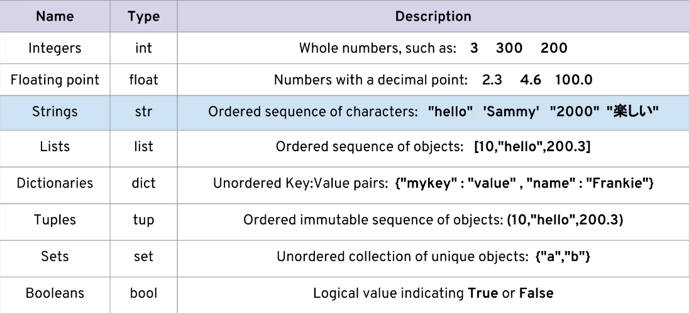

## Arithmetic Operator

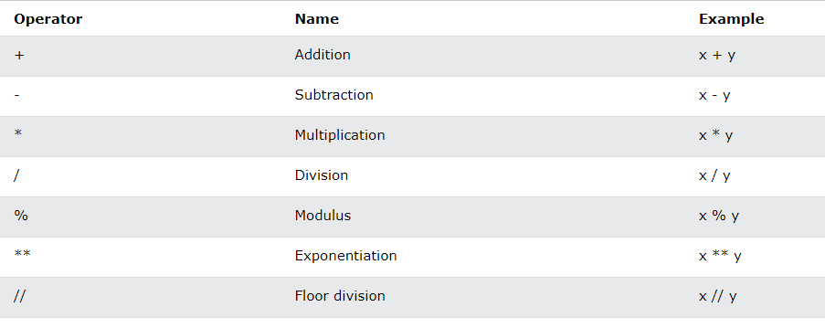

### Assignment Operators

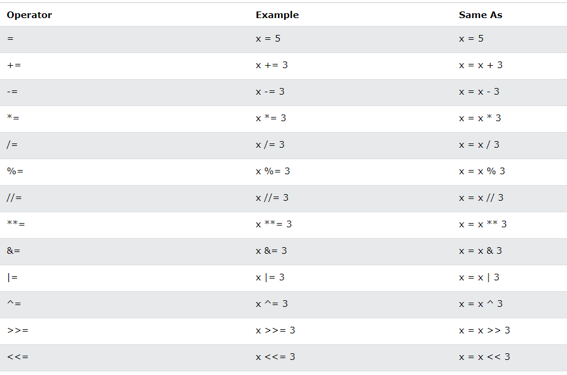


## Python Strings

Strings in python are surrounded by either single quotation marks, or double quotation marks.

```
print("Hello")
print('Hello')
```
### Multiline Strings
You can assign a multiline string to a variable by using three quotes:

```
a = """Lorem ipsum dolor sit amet,
consectetur adipiscing elit,
sed do eiusmod tempor incididunt
ut labore et dolore magna aliqua."""
print(a)
```

### Slicing Strings

You can return a range of characters by using the slice syntax.

Specify the start index and the end index, separated by a colon, to return a part of the string.

Get the characters from position 2 to position 5 (not included):

```
b = "Hello, World!"
print(b[2:5])

OUTPUT: llo
```

[start:stop:step] 

- start is a numerical index for the slice start
- stop is the index you will go up to (but not include)
- step is the size of the "jump" you take


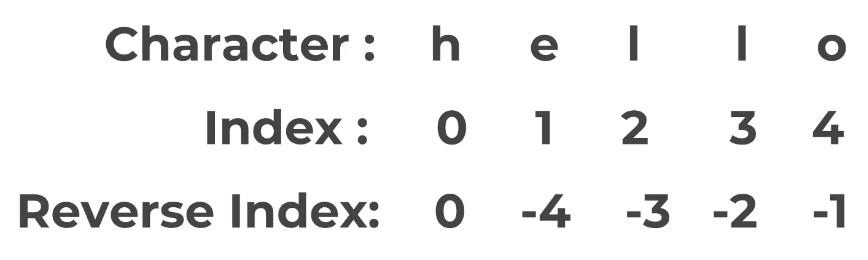

### String Properties and methods

String are inmutable

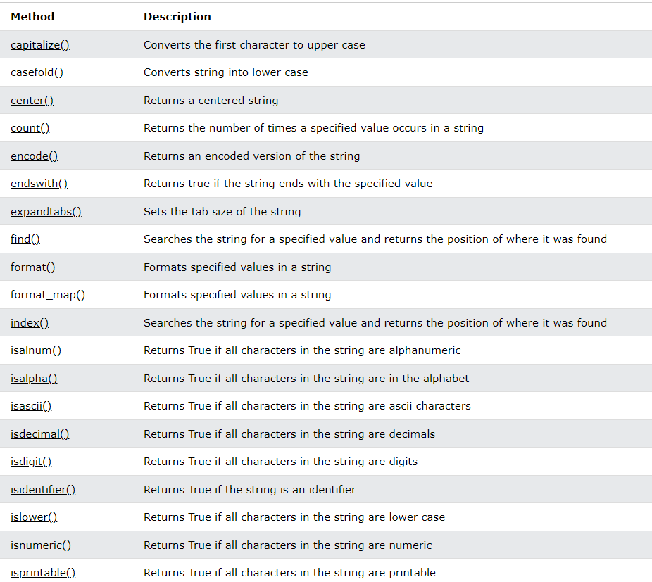
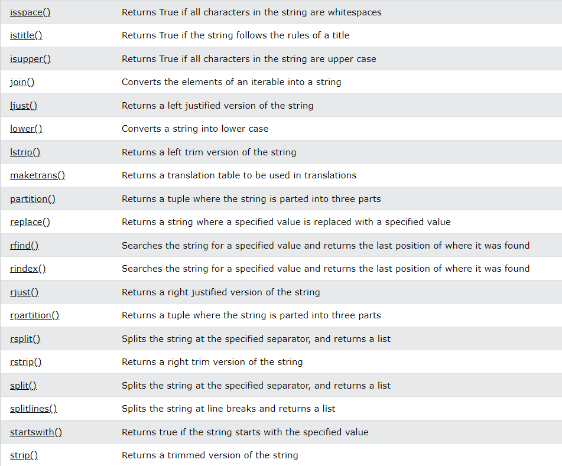
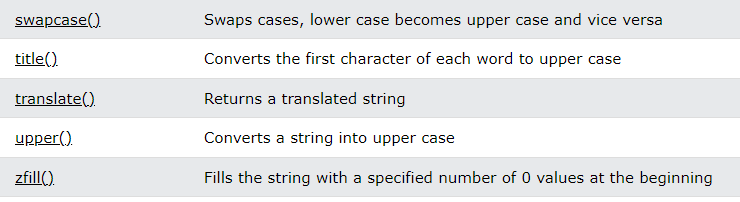

### String Format

The format() method takes the passed arguments, formats them, and places them in the string where the placeholders {} are:

```
age = 36
txt = "My name is John, and I am {}"
print(txt.format(age))

OUTPUT: My name is John, and I am 36
```

The format() method takes unlimited number of arguments, and are placed into the respective placeholders:

```
quantity = 3
itemno = 567
price = 49.95
myorder = "I want {} pieces of item {} for {} dollars."
print(myorder.format(quantity, itemno, price))

OUTPUT: I want 3 pieces of item 567 for 49.95 dollars.
```

You can use index numbers {0} to be sure the arguments are placed in the correct placeholders:

```
quantity = 3
itemno = 567
price = 49.95
myorder = "I want to pay {2} dollars for {0} pieces of item {1}."
print(myorder.format(quantity, itemno, price))

OUTPUT: I want to pay 49.95 dollars for 3 pieces of item 567
```

You can also use named indexes by entering a name inside the curly brackets {carname}, but then you must use names when you pass the parameter values txt.format(carname = "Ford"):

```
myorder = "I have a {carname}, it is a {model}."
print(myorder.format(carname = "Ford", model = "Mustang"))

OUTPUT=I have a Ford, it is a Mustang.
```

```
quantity = 3
itemno = 567
price = 49.95
print(f'I want to pay {price} dollars for {quantity} pieces of item {itemno}.')

```

## Python list

Lists are used to store multiple items in a single variable.

List items can be of any data type

A list can contain different data types

Lists are created using square brackets:

```
thislist = ["apple", "banana", "cherry"]
print(thislist)

OUTPUT: ['apple', 'banana', 'cherry']
```

List items are ordered, changeable, and allow duplicate values.

List items are indexed, the first item has index [0], the second item has index [1] etc.

### The list() Constructor

It is also possible to use the list() constructor when creating a new list.

```
thislist = list(("apple", "banana", "cherry")) # note the double round-brackets
print(thislist)
```

### Change Item Value

To change the value of a specific item, refer to the index number:

Change the second item:
```

thislist = ["apple", "banana", "cherry"]
thislist[1] = "blackcurrant"
print(thislist)

OUTPUT: ['apple', 'blackcurrant', 'cherry']
```


### List Methods

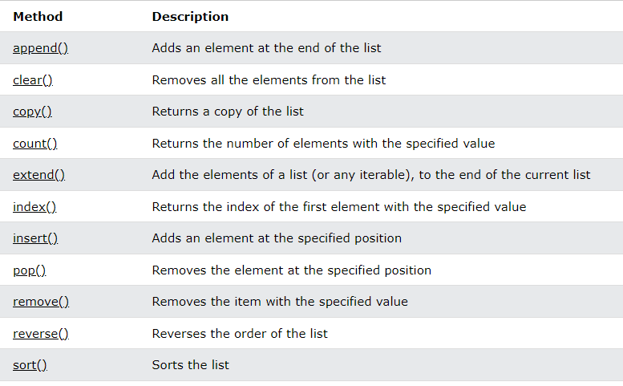

If there are more than one item with the specified value, the remove() method removes the first occurance

```
thislist = ["apple", "banana", "cherry", "banana", "kiwi"]
thislist.remove("banana")
print(thislist)
```

The pop() method removes the specified index. If you do not specify the index, the pop() method removes the last item.

The del keyword also removes the specified index:

```
thislist = ["apple", "banana", "cherry"]
del thislist[0]
print(thislist)
```

The del keyword can also delete the list completely.

```
thislist = ["apple", "banana", "cherry"]
del thislist
```

The clear() method empties the list. The list still remains, but it has no content.
### Loop Lists

You can loop through the list items by using a for loop:

```
thislist = ["apple", "banana", "cherry"]
for x in thislist:
  print(x)
```

You can also loop through the list items by referring to their index number.

Use the range() and len() functions to create a suitable iterable.

```
thislist = ["apple", "banana", "cherry"]
for i in range(len(thislist)):
  print(thislist[i])
```

You can loop through the list items by using a while loop.

Use the len() function to determine the length of the list, then start at 0 and loop your way through the list items by referring to their indexes.

Remember to increase the index by 1 after each iteration.

```
thislist = ["apple", "banana", "cherry"]
i = 0
while i < len(thislist):
  print(thislist[i])
  i = i + 1
```

List Comprehension offers the shortest syntax for looping through lists:
```
thislist = ["apple", "banana", "cherry"]
[print(x) for x in thislist]
```

#### list Comprehension

List comprehension offers a shorter syntax when you want to create a new list based on the values of an existing list.

Based on a list of fruits, you want a new list, containing only the fruits with the letter "a" in the name.

With list comprehension you can do all that with only one line of code:

```
fruits = ["apple", "banana", "cherry", "kiwi", "mango"]

newlist = [x for x in fruits if "a" in x]

print(newlist)
```
## Dictionaries

Dictionaries are used to store data values in key:value pairs.

A dictionary is a collection which is ordered*, changeable and do not allow duplicates.

As of Python version 3.7, dictionaries are ordered. In Python 3.6 and earlier, dictionaries are unordered.

Dictionaries are written with curly brackets, and have keys and values

```
thisdict = {
  "brand": "Ford",
  "model": "Mustang",
  "year": 1964
}
print(thisdict)

```

You can access the items of a dictionary by referring to its key name, inside square brackets

```
thisdict = {
  "brand": "Ford",
  "model": "Mustang",
  "year": 1964
}
x = thisdict["model"]

OUTPUT: Mustang
```

There is also a method called get() that will give you the same result:

```
x = thisdict.get("model")
```

**Get keys** The keys() method will return a list of all the keys in the dictionary.
```
x = thisdict.keys()
```

**Get Values** The values() method will return a list of all the values in the dictionary.

```
x = thisdict.values()
```

**Get Items** The items() method will return each item in a dictionary, as tuples in a list.

```
x = thisdict.items()
```

**change values** You can change the value of a specific item by referring to its key name:

```
thisdict = {
  "brand": "Ford",
  "model": "Mustang",
  "year": 1964
}
thisdict["year"] = 2018

```

**Update Dictionary** The update() method will update the dictionary with the items from the given argument.

The argument must be a dictionary, or an iterable object with key:value pairs.

```
thisdict = {
  "brand": "Ford",
  "model": "Mustang",
  "year": 1964
}
thisdict.update({"year": 2020})
```

#### loop dictionaries

You can loop through a dictionary by using a for loop.

When looping through a dictionary, the return value are the keys of the dictionary, but there are methods to return the values as well.

Print all key names in the dictionary, one by one:

```
for x in thisdict:
  print(x)
```

Print all values in the dictionary, one by one:

```
for x in thisdict:
  print(thisdict[x])
```

You can also use the values() method to return values of a dictionary:

```
for x in thisdict.values():
  print(x)
```

You can use the keys() method to return the keys of a dictionary:

```
for x in thisdict.keys():
  print(x)
```

Loop through both keys and values, by using the items() method:

```
for x, y in thisdict.items():
  print(x, y)
```

#### Dictionaries methods

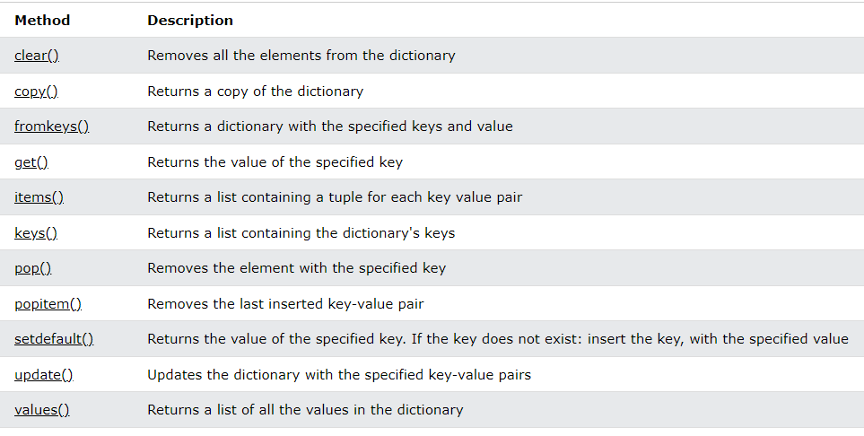

## Tuples

Tuples are used to store multiple items in a single variable.

A tuple is a collection which is ordered and unchangeable.

Tuples are written with round brackets.

```
thistuple = ("apple", "banana", "cherry")
print(thistuple)
```
Tuple items are ordered, unchangeable, and allow duplicate values.

Tuple items are indexed, the first item has index [0], the second item has index [1] etc.

### Change Tuple Values
Once a tuple is created, you cannot change its values. Tuples are unchangeable, or immutable as it also is called.

But there is a workaround. You can convert the tuple into a list, change the list, and convert the list back into a tuple.

```
x = ("apple", "banana", "cherry")
y = list(x)
y[1] = "kiwi"
x = tuple(y)

print(x)
```

### Loop Through a Tuple
You can loop through the tuple items by using a for loop.

```
thistuple = ("apple", "banana", "cherry")
for x in thistuple:
  print(x)
```

### Loop Through the Index Numbers
You can also loop through the tuple items by referring to their index number.

Use the range() and len() functions to create a suitable iterable.

```
thistuple = ("apple", "banana", "cherry")
for i in range(len(thistuple)):
  print(thistuple[i])
```

#### Using a While Loop
You can loop through the tuple items by using a while loop.

Use the len() function to determine the length of the tuple, then start at 0 and loop your way through the tuple items by referring to their indexes.

Remember to increase the index by 1 after each iteration.

```
thistuple = ("apple", "banana", "cherry")
i = 0
while i < len(thistuple):
  print(thistuple[i])
  i = i + 1
```

### Tuple methods

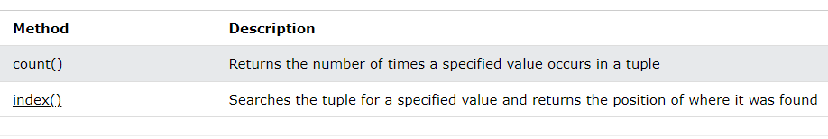


### unpacking a tuple

When we create a tuple, we normally assign values to it. This is called "packing" a tuple:

```
fruits = ("apple", "banana", "cherry")
```
But, in Python, we are also allowed to extract the values back into variables. This is called "unpacking":

```
fruits = ("apple", "banana", "cherry")

(green, yellow, red) = fruits

print(green)
print(yellow)
print(red)
```
The number of variables must match the number of values in the tuple, if not, you must use an asterisk to collect the remaining values as a list.

If the number of variables is less than the number of values, you can add an * to the variable name and the values will be assigned to the variable as a list:

```
fruits = ("apple", "banana", "cherry", "strawberry", "raspberry")

# Assign the rest of the values as a list called "red":
(green, yellow, *red) = fruits

print(green)
print(yellow)
print(red)

OUTPUT: apple
banana
['cherry', 'strawberry', 'raspberry']
```
If the asterisk is added to another variable name than the last, Python will assign values to the variable until the number of values left matches the number of variables left.

```
fruits = ("apple", "mango", "papaya", "pineapple", "cherry")
# Add a list of values the "tropic" variable:
(green, *tropic, red) = fruits

print(green)
print(tropic)
print(red)

OUTPUT: apple
['mango', 'papaya', 'pineapple']
cherry
```

## Sets

Sets are used to store multiple items in a single variable.

A set is a collection which is unordered, unchangeable*, and unindexed.

Sets are written with curly brackets.

```
thisset = {"apple", "banana", "cherry"}
print(thisset)
```

Set items are unordered, unchangeable, and do not allow duplicate values.

True and 1 is considered the same value. False and 0 is considered the same value

### Access Items

You cannot access items in a set by referring to an index or a key.

But you can loop through the set items using a for loop, or ask if a specified value is present in a set, by using the in keyword.

```
thisset = {"apple", "banana", "cherry"}

for x in thisset:
  print(x)


thisset = {"apple", "banana", "cherry"}

print("banana" in thisset)
```
### Remove Item

To remove an item in a set, use the remove(), or the discard() method.

If the item to remove does not exist, remove() will raise an error. If the item to remove does not exist, discard() will NOT raise an error.

You can also use the pop() method to remove an item, but this method will remove a random item, so you cannot be sure what item that gets removed.

The return value of the pop() method is the removed item.

The object in the update() method does not have to be a set, it can be any iterable object (tuples, lists, dictionaries etc.).

### Set Methods

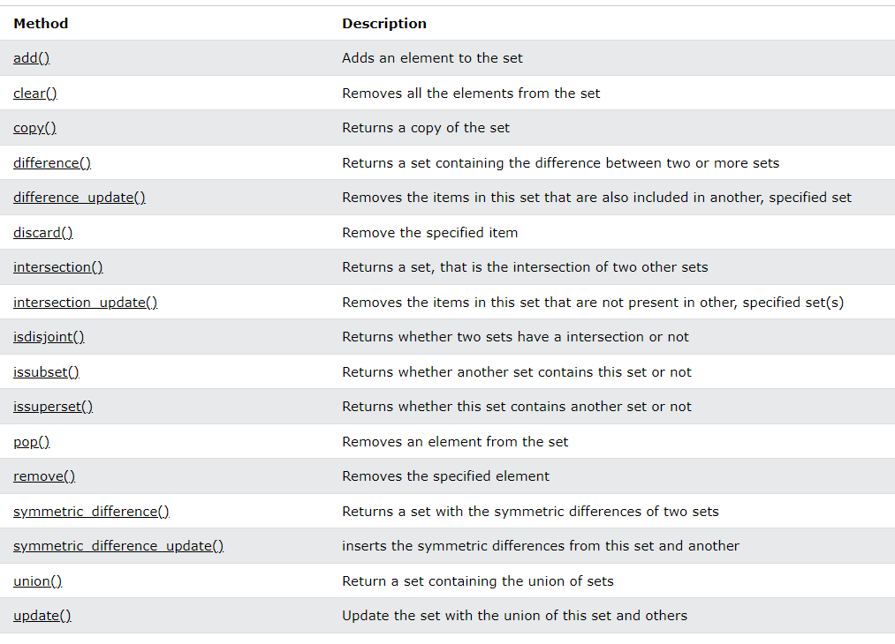

## Python Booleans

Booleans represent one of two values: True or False.

The bool() function allows you to evaluate any value, and give you True or False in return,

Almost any value is evaluated to True if it has some sort of content.

Any string is True, except empty strings.

Any number is True, except 0.

Any list, tuple, set, and dictionary are True, except empty ones.

In fact, there are not many values that evaluate to False, except empty values, such as (), [], {}, "", the number 0, and the value None. And of course the value False evaluates to False.

## I/O with basics Files in python

The key function for working with files in Python is the open() function.

The open() function takes two parameters; filename, and mode.

There are four different methods (modes) for opening a file:

"r" - Read - Default value. Opens a file for reading, error if the file does not exist

"a" - Append - Opens a file for appending, creates the file if it does not exist

"w" - Write - Opens a file for writing, creates the file if it does not exist

"x" - Create - Creates the specified file, returns an error if the file exists

In addition you can specify if the file should be handled as binary or text mode

"t" - Text - Default value. Text mode

"b" - Binary - Binary mode (e.g. images)

```
f = open("demofile.txt")
```

### File Open

To open the file, use the built-in open() function.

The open() function returns a file object, which has a read() method for reading the content of the file:

```
f = open("demofile.txt", "r")
print(f.read())
```

If the file is located in a different location, you will have to specify the file path, like this:

```
f = open("D:\\myfiles\\welcome.txt", "r")
print(f.read())

# for windows you need to use double \
# for mac or linux you use /
```

for windows you need to use double \
 the .read() show all in one large string with tabulators and spaces

 if you use twice yo nned to use the seek function to place the cursor again in the first position of the file
```
 myfile.read()

 myfile.seek(0)
```
### Read Lines
You can return one line by using the readline() method:

```
f = open("demofile.txt", "r")
print(f.readline())
```

By looping through the lines of the file, you can read the whole file, line by line:

```
f = open("demofile.txt", "r")
for x in f:
  print(x)

```

### Close Files

It is a good practice to always close the file when you are done with it.

```
f = open("demofile.txt", "r")
print(f.readline())
f.close()
```

### Create a New File
To create a new file in Python, use the open() method, with one of the following parameters:

"x" - Create - will create a file, returns an error if the file exist

"a" - Append - will create a file if the specified file does not exist

"w" - Write - will create a file if the specified file does not exist

Modo "x" (crear): Este modo se utiliza para crear un nuevo archivo. Si el archivo ya existe, la función open() lanzará un error (FileExistsError). Por lo tanto, el modo "x" es útil cuando deseas asegurarte de que estás creando un archivo nuevo y no sobrescribiendo uno existente.

Modo "w" (escribir): Este modo se utiliza para escribir en un archivo. Si el archivo no existe, se creará. Si el archivo ya existe, su contenido se eliminará y se escribirá el nuevo contenido desde cero. Es importante tener en cuenta que el modo "w" sobrescribirá cualquier contenido existente en el archivo.

Modo "a" (anexar): Este modo se utiliza para agregar contenido al final de un archivo existente. Si el archivo no existe, se creará uno nuevo. Sin embargo, si el archivo existe, el nuevo contenido se agregará al final del archivo sin eliminar el contenido existente.

## Python Comparison Operators


## Python logical Operator
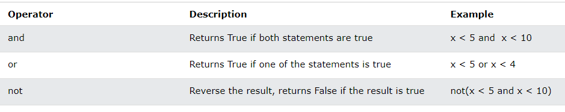

## Python Bitwise operator

Bitwise operators are used to compare (binary) numbers:
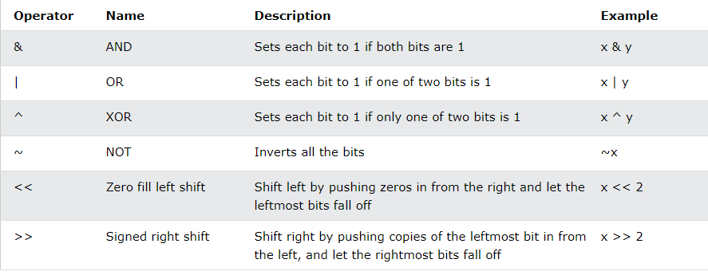

## Python Statements

### If, elif, else

An "if statement" is written by using the if keyword.

```
a = 33
b = 200
if b > a:
  print("b is greater than a")
```
Python relies on indentation (whitespace at the beginning of a line) to define scope in the code. Other programming languages often use curly-brackets for this purpose.

The elif keyword is Python's way of saying "if the previous conditions were not true, then try this condition".

```
a = 33
b = 33
if b > a:
  print("b is greater than a")
elif a == b:
  print("a and b are equal")
```

The else keyword catches anything which isn't caught by the preceding conditions.

```
a = 200
b = 33
if b > a:
  print("b is greater than a")
elif a == b:
  print("a and b are equal")
else:
  print("a is greater than b")
```

If you have only one statement to execute, you can put it on the same line as the if statement.

```
if a > b: print("a is greater than b")
```

If you have only one statement to execute, one for if, and one for else, you can put it all on the same line:

```
a = 2
b = 330
print("A") if a > b else print("B")
```

```
a = 330
b = 330
print("A") if a > b else print("=") if a == b else print("B")
```
if statements cannot be empty, but if you for some reason have an if statement with no content, put in the pass statement to avoid getting an error.

```
a = 33
b = 200

if b > a:
  pass
```

### For

A for loop is used for iterating over a sequence (that is either a list, a tuple, a dictionary, a set, or a string).

This is less like the for keyword in other programming languages, and works more like an iterator method as found in other object-orientated programming languages.

With the for loop we can execute a set of statements, once for each item in a list, tuple, set etc.

```
fruits = ["apple", "banana", "cherry"]
for x in fruits:
  print(x)
```

With the **break** statement we can stop the loop before it has looped through all the items:

```
fruits = ["apple", "banana", "cherry"]
for x in fruits:
  print(x)
  if x == "banana":
    break
```

With the **continue** statement we can stop the current iteration of the loop, and continue with the next:

```
fruits = ["apple", "banana", "cherry"]
for x in fruits:
  if x == "banana":
    continue
  print(x)
```
#### Range() Function
To loop through a set of code a specified number of times, we can use the range() function,
The range() function returns a sequence of numbers, starting from 0 by default, and increments by 1 (by default), and ends at a specified number.

```
for x in range(6):
  print(x)
```
Note that range(6) is not the values of 0 to 6, but the values 0 to 5.

The range() function defaults to 0 as a starting value, however it is possible to specify the starting value by adding a parameter: range(2, 6), which means values from 2 to 6 (but not including 6):

```
for x in range(2, 6):
  print(x)
```

The range() function defaults to increment the sequence by 1, however it is possible to specify the increment value by adding a third parameter: range(2, 30, 3)

```
for x in range(2, 30, 3):
  print(x)
```

#### Else in for loop

The else keyword in a for loop specifies a block of code to be executed when the loop is finished

The else block will NOT be executed if the loop is stopped by a break statement.

#### use or FOR _

En Python, el guion bajo (_) a menudo se usa como una convención para indicar que una variable no se usará realmente en el contexto en el que se declara. Se utiliza principalmente cuando no necesitas usar el valor de una variable en un bucle o en una expresión, pero aún necesitas iterar sobre una secuencia un número determinado de veces.

```
for _ in range(5):
    print("Hola")

```
Aquí, el guion bajo se utiliza para indicar que no nos importa el valor de la variable que normalmente se utilizaría en un bucle for. En lugar de eso, estamos simplemente iterando cinco veces y ejecutando el bloque de código en cada iteración.

Otra situación común donde se usa _ es al desempaquetar valores de una tupla cuando solo nos interesan algunos de ellos:

```
tupla = (1, 2, 3)
_, b, _ = tupla

```
Aquí, solo estamos interesados en el segundo elemento de la tupla, por lo que utilizamos _ para ignorar los elementos que no necesitamos. Esto puede mejorar la legibilidad del código al indicar claramente que esos valores no son relevantes para el contexto actual.

En resumen, el guion bajo (_) en Python se utiliza generalmente para indicar que una variable no se va a utilizar realmente en el contexto en el que se declara, mejorando así la legibilidad del código.

### While Loops

With the while loop we can execute a set of statements as long as a condition is true.

```
i = 1
while i < 6:
  print(i)
  i += 1
```
The while loop requires relevant variables to be ready, in this example we need to define an indexing variable, i, which we set to 1. remember to increment i, or else the loop will continue forever.

With the else statement we can run a block of code once when the condition no longer is true

```
i = 1
while i < 6:
  print(i)
  i += 1
else:
  print("i is no longer less than 6")
```
### match Statements

A match statement takes an expression and compares its value to successive patterns given as one or more case blocks. This is superficially similar to a switch statement in C, Java or JavaScript (and many other languages), but it’s more similar to pattern matching in languages like Rust or Haskell. Only the first pattern that matches gets executed and it can also extract components (sequence elements or object attributes) from the value into variables

```
def http_error(status):
    match status:
        case 400:
            return "Bad request"
        case 404:
            return "Not found"
        case 418:
            return "I'm a teapot"
        case _:
            return "Something's wrong with the internet"
        
print(http_error(400))


```

## Useful operator

### Enumerate

The enumerate() function takes a collection (e.g. a tuple) and returns it as an enumerate object.

The enumerate() function adds a counter as the key of the enumerate object.

enumerate(iterable, start)

En Python, enumerate es una función incorporada que se utiliza para agregar un contador a un iterable y retornar un objeto enumerado. Este objeto genera tuplas que contienen el índice de un elemento y el elemento en sí mismo mientras se itera sobre el iterable. La función enumerate toma un iterable como argumento y opcionalmente un parámetro para especificar el índice de inicio.

enumerate es útil cuando necesitas tanto el índice como el valor de los elementos de un iterable durante la iteración. Es especialmente útil en bucles for donde necesitas rastrear la posición de los elementos mientras los recorres.

```
frutas = ['manzana', 'banana', 'cereza', 'dátiles']
for indice, fruta in enumerate(frutas):
    print(f'Índice: {indice}, Fruta: {fruta}')

OUTPUT: Índice: 0, Fruta: manzana
Índice: 1, Fruta: banana
Índice: 2, Fruta: cereza
Índice: 3, Fruta: dátiles

```

### Zip

The zip() function returns a zip object, which is an iterator of tuples where the first item in each passed iterator is paired together, and then the second item in each passed iterator are paired together etc.

If the passed iterables have different lengths, the iterable with the least items decides the length of the new iterator.

If one tuple contains more items, these items are ignored:

```
a = ("John", "Charles", "Mike")
b = ("Jenny", "Christy", "Monica", "Vicky")

x = zip(a, b)

OUTPUT (('John', 'Jenny'), ('Charles', 'Christy'), ('Mike', 'Monica'))
```
### isinstance

The isinstance() function returns True if the specified object is of the specified type, otherwise False.

If the type parameter is a tuple, this function will return True if the object is one of the types in the tuple.

SYNTAX isinstance(object, type)

```
x = isinstance(5, int)
x = isinstance(5, int)
```


### List comprehension

List comprehension offers a shorter syntax when you want to create a new list based on the values of an existing list.

If you find yourself using a for loop along with .append() to create a list, list comprehensions are good alternative

Syntax 
```
newlist = [expression for item in iterable if condition == True]
```

```
fruits = ["apple", "banana", "cherry", "kiwi", "mango"]

newlist = [x for x in fruits if "a" in x]

print(newlist)
```

## Methods and Functions

you can use help word to know about some methods information
```
mylist= [1,2,3]

help(mylist.insert)

OUTPUT: Help on built-in function insert:

insert(index, object, /) method of builtins.list instance
    Insert object before index.

```

https://docs.python.org/3/library/index.html

### Functions

A function is a block of code which only runs when it is called.

You can pass data, known as parameters, into a function.

A function can return data as a result.

In Python a function is defined using the def keyword:

```
def my_function():
  print("Hello from a function")
```

To call a function, use the function name followed by parenthesis:

```
def my_function():
  print("Hello from a function")

my_function()
```

To let a function return a value, use the return statement:

```
def my_function(x):
  return 5 * x

print(my_function(3))
print(my_function(5))
print(my_function(9))
```

### *args and *kwargs

**Arbitrary Arguments**, *args
If you do not know how many arguments that will be passed into your function, add a * before the parameter name in the function definition.
This way the function will receive a tuple of arguments, and can access the items accordingly:

```
def my_function(*kids):
  print("The youngest child is " + kids[2])

my_function("Emil", "Tobias", "Linus")
```

**Arbitrary Keyword Arguments**, **kwargs
If you do not know how many keyword arguments that will be passed into your function, add two asterisk: ** before the parameter name in the function definition.

This way the function will receive a dictionary of arguments, and can access the items accordingly:

```
def my_function(**kid):
  print("His last name is " + kid["lname"])

my_function(fname = "Tobias", lname = "Refsnes")
```

### Lambda Expressions Map and Filter

En Python, la función map nos permite aplicar una función sobre los items de un objeto iterable (lista, tupla, etc...).

SYNTAX map(function, objeto iterable)

```
def square(num):
    return num**2

my_nums= [1,2,3,4,5]

for item in map(square, my_nums):
    print(item)

```

The Python built-in filter() function can be used to create a new iterator from an existing iterable (like a list or dictionary) that will efficiently filter out elements using a function that we provide. An iterable is a Python object that can be “iterated over”, that is, it will return items in a sequence such that we can use it in a for loop.

The basic syntax for the filter() function is: filter(function, iterable)

```
def check_even(num):
    return num%2==0

mynums= [1,2,3,4,5,6]

for n in filter(check_even, mynums):
    print(n)
```

A lambda function is a small anonymous function.

A lambda function can take any number of arguments, but can only have one expression.

SYNTAX lambda arguments : expression

```
lambda num: num ** 2

mynums= [1,2,3,4,5,6]

mp=list(map(lambda num:num**2, mynums))
print(mp)

flt= list(filter(lambda num:num%2 == 0, mynums))
print (flt)

OUTPUT: [1, 4, 9, 16, 25, 36]
[2, 4, 6]
```

### Nested Statements and scope

This idea of scope in your code is very important to understand in order to properly assign and call variable names.

In simple terms, the idea of scope can be described by 3 general rules:

Name assignments will create or change local names by default.
Name references search (at most) four scopes, these are:
- local
- enclosing functions
- global
- built-in
Names declared in global and nonlocal statements map assigned names to enclosing module and function scopes.
The statement in #2 above can be defined by the LEGB rule.

LEGB Rule:

L: Local — Names assigned in any way within a function (def or lambda), and not declared global in that function.

E: Enclosing function locals — Names in the local scope of any and all enclosing functions (def or lambda), from inner to outer.

G: Global (module) — Names assigned at the top-level of a module file, or declared global in a def within the file.

B: Built-in (Python) — Names preassigned in the built-in names module : open, range, SyntaxError,...

#### The global statement
If you want to assign a value to a name defined at the top level of the program (i.e. not inside any kind of scope such as functions or classes), then you have to tell Python that the name is not local, but it is global. We do this using the global statement. It is impossible to assign a value to a variable defined outside a function without the global statement.

```
x = 50

def func():
    global x
    print('This function is now using the global x!')
    print('Because of global x is: ', x)
    x = 2
    print('Ran func(), changed global x to', x)

print('Before calling func(), x is: ', x)
func()
print('Value of x (outside of func()) is: ', x)
```

## validating user input

```
def user_choice():
    
    # This original choice value can be anything that isn't an integer
    choice = 'wrong'
    
    # While the choice is not a digit, keep asking for input.
    while choice not in ['0','1','2']:
        
        # we shouldn't convert here, otherwise we get an error on a wrong input
        choice = input("Choose one of these numbers (0,1,2): ")
        
        if choice not in ['0','1','2']:
            # THIS CLEARS THE CURRENT OUTPUT BELOW THE CELL
            clear_output()
            
            print("Sorry, but you did not choose a value in the correct range (0,1,2)")
            
    
    # Optionally you can clear everything after running the function
    # clear_output()
    
    # We can convert once the while loop above has confirmed we have a digit.
    return int(choice)
```
## Python OOP

Python is an object oriented programming language.

Almost everything in Python is an object, with its properties and methods.

A Class is like an object constructor, or a "blueprint" for creating objects.

### The __init__() Function

The examples above are classes and objects in their simplest form, and are not really useful in real life applications.

To understand the meaning of classes we have to understand the built-in __init__() function.

All classes have a function called __init__(), which is always executed when the class is being initiated.

Use the __init__() function to assign values to object properties, or other operations that are necessary to do when the object is being created

```
class Person:
  def __init__(self, name, age):
    self.name = name
    self.age = age

p1 = Person("John", 36)

print(p1.name)
print(p1.age)
```

### The __str__() Function
The __str__() function controls what should be returned when the class object is represented as a string.

If the __str__() function is not set, the string representation of the object is returned:

```
class Person:
  def __init__(self, name, age):
    self.name = name
    self.age = age

  def __str__(self):
    return f"{self.name}({self.age})"

p1 = Person("John", 36)

print(p1)
```

### The __len__() Function

es un método especial que se utiliza para devolver la longitud de un objeto. Este método es invocado automáticamente cuando se llama a la función len() en un objeto.

Por ejemplo, puedes implementar __len__ en tus propias clases para que puedan ser utilizadas con la función len(). Aquí tienes un ejemplo simple:

```
class MiLista:
    def __init__(self, elementos):
        self.elementos = elementos

    def __len__(self):
        return len(self.elementos)

# Crear una instancia de MiLista
mi_lista = MiLista([1, 2, 3, 4, 5])

# Usar len() en mi_lista
print(len(mi_lista))  # Esto imprimirá 5, la longitud de la lista dentro de mi_lista

```
En este ejemplo, __len__ está definido en la clase MiLista. Cuando se llama a len(mi_lista), Python invoca automáticamente el método __len__ de mi_lista, que devuelve la longitud de la lista elementos dentro de mi_lista.

Es importante destacar que puedes implementar __len__ en tus propias clases para definir qué significa "longitud" para esa clase en particular. Esto permite que objetos de tu clase sean utilizados de manera coherente con las funciones y métodos estándar de Python que esperan obtener la longitud de un objeto.


### Object Methods
Objects can also contain methods. Methods in objects are functions that belong to the object.

Let us create a method in the Person class:

```
class Person:
  def __init__(self, name, age):
    self.name = name
    self.age = age

  def myfunc(self):
    print("Hello my name is " + self.name)

p1 = Person("John", 36)
p1.myfunc()
```

### The self Parameter

The self parameter is a reference to the current instance of the class, and is used to access variables that belongs to the class.

It does not have to be named self , you can call it whatever you like, but it has to be the first parameter of any function in the class:

```
# Use the words mysillyobject and abc instead of self:

class Person:
  def __init__(mysillyobject, name, age):
    mysillyobject.name = name
    mysillyobject.age = age

  def myfunc(abc):
    print("Hello my name is " + abc.name)

p1 = Person("John", 36)
p1.myfunc()
```

### Atributes and Methods

Los métodos y los atributos son dos conceptos fundamentales en la programación orientada a objetos, como en Python.

Atributos: Los atributos son variables que pertenecen a un objeto específico. Pueden ser de dos tipos:

Atributos de instancia: Estos son específicos de cada objeto individual creado a partir de una clase. Cada objeto tiene su propia copia de estos atributos, y pueden variar entre diferentes instancias de la misma clase.

Atributos de clase: Estos son compartidos por todas las instancias de la clase. Son como variables globales dentro de una clase, pero se accede a ellas mediante la clase en lugar de a través de una instancia específica.

Métodos: Los métodos son funciones asociadas a un objeto o una clase. Hay dos tipos principales de métodos:

Métodos de instancia: Estos métodos operan en instancias específicas de una clase. Tienen acceso a los atributos de esa instancia utilizando self.

Métodos de clase: Estos métodos operan en toda la clase en lugar de instancias individuales. Pueden acceder a los atributos de clase, pero no a los atributos de instancia directamente.

En resumen, los atributos son como datos almacenados dentro de un objeto, mientras que los métodos son funciones que operan en esos datos o realizan acciones relacionadas con el objeto. Los atributos describen el estado de un objeto, mientras que los métodos definen su comportamiento.

#### Abstract methods

n método abstracto es un tipo especial de método que se define en una clase pero no se implementa en esa clase en particular. En su lugar, se espera que las clases hijas proporcionen una implementación concreta para este método. Los métodos abstractos son parte de un concepto más amplio conocido como clases abstractas.

En Python, las clases abstractas y los métodos abstractos se pueden definir utilizando el módulo abc (Abstract Base Classes) que proporciona una forma de crear clases y métodos abstractos. Aquí hay un ejemplo:

```
from abc import ABC, abstractmethod

class FiguraGeometrica(ABC):
    @abstractmethod
    def area(self):
        pass

class Rectangulo(FiguraGeometrica):
    def __init__(self, base, altura):
        self.base = base
        self.altura = altura
    
    def area(self):
        return self.base * self.altura

class Triangulo(FiguraGeometrica):
    def __init__(self, base, altura):
        self.base = base
        self.altura = altura
    
    def area(self):
        return (self.base * self.altura) / 2

# No se puede instanciar directamente una FiguraGeometrica porque es abstracta
# figura = FiguraGeometrica() # Esto daría un error

rectangulo = Rectangulo(5, 4)
triangulo = Triangulo(3, 6)

print("Área del rectángulo:", rectangulo.area())
print("Área del triángulo:", triangulo.area())

```

En este ejemplo, FiguraGeometrica es una clase abstracta que tiene un método abstracto area(). Las clases Rectangulo y Triangulo heredan de FiguraGeometrica y proporcionan una implementación concreta del método area(). Es importante destacar que cualquier clase que herede de FiguraGeometrica debe proporcionar una implementación para el método area(), de lo contrario, Python generará un error. Esto garantiza que todas las clases derivadas cumplan con ciertas expectativas de comportamiento.

### Python Inheritance
Inheritance allows us to define a class that inherits all the methods and properties from another class.

Parent class is the class being inherited from, also called base class.

Child class is the class that inherits from another class, also called derived class.

Any class can be a parent class, so the syntax is the same as creating any other class

#### Create a Child Class
To create a class that inherits the functionality from another class, send the parent class as a parameter when creating the child class:

Use the pass keyword when you do not want to add any other properties or methods to the class.

Now the Student class has the same properties and methods as the Person class.
```
# Create a class named Student, which will inherit the properties and methods from the Person class:

class Student(Person):
  pass
```

#### Add the __init__() Function

So far we have created a child class that inherits the properties and methods from its parent.

We want to add the __init__() function to the child class (instead of the pass keyword)

When you add the __init__() function, the child class will no longer inherit the parent's __init__() function

To keep the inheritance of the parent's __init__() function, add a call to the parent's __init__() function

```
class Student(Person):
  def __init__(self, fname, lname):
    Person.__init__(self, fname, lname)
```
Now we have successfully added the __init__() function, and kept the inheritance of the parent class, and we are ready to add functionality in the __init__() function

#### Use the super() Function
Python also has a super() function that will make the child class inherit all the methods and properties from its parent:

By using the super() function, you do not have to use the name of the parent element, it will automatically inherit the methods and properties from its parent.

```
class Student(Person):
  def __init__(self, fname, lname):
    super().__init__(fname, lname)
```

#### Add Properties

Add a property called graduationyear to the Student class. dd another parameter in the __init__() function

```
class Student(Person):
  def __init__(self, fname, lname, year):
    super().__init__(fname, lname)
    self.graduationyear = year

x = Student("Mike", "Olsen", 2019)
```

#### Add methods

If you add a method in the child class with the same name as a function in the parent class, the inheritance of the parent method will be overridden.

Add a method called welcome to the Student class:

```
class Student(Person):
  def __init__(self, fname, lname, year):
    super().__init__(fname, lname)
    self.graduationyear = year

  def welcome(self):
    print("Welcome", self.firstname, self.lastname, "to the class of", self.graduationyear)
```

### Python Polymorphism

The word "polymorphism" means "many forms", and in programming it refers to methods/functions/operators with the same name that can be executed on many objects or classes.

Polymorphism is often used in Class methods, where we can have multiple classes with the same method name.

For example, say we have three classes: Car, Boat, and Plane, and they all have a method called move():

```
class Car:
  def __init__(self, brand, model):
    self.brand = brand
    self.model = model

  def move(self):
    print("Drive!")

class Boat:
  def __init__(self, brand, model):
    self.brand = brand
    self.model = model

  def move(self):
    print("Sail!")

class Plane:
  def __init__(self, brand, model):
    self.brand = brand
    self.model = model

  def move(self):
    print("Fly!")

car1 = Car("Ford", "Mustang")       #Create a Car class
boat1 = Boat("Ibiza", "Touring 20") #Create a Boat class
plane1 = Plane("Boeing", "747")     #Create a Plane class

for x in (car1, boat1, plane1):
  x.move()
```

What about classes with child classes with the same name? Can we use polymorphism there?

Yes. If we use the example above and make a parent class called Vehicle, and make Car, Boat, Plane child classes of Vehicle, the child classes inherits the Vehicle methods, but can override them:

```
class Vehicle:
  def __init__(self, brand, model):
    self.brand = brand
    self.model = model

  def move(self):
    print("Move!")

class Car(Vehicle):
  pass

class Boat(Vehicle):
  def move(self):
    print("Sail!")

class Plane(Vehicle):
  def move(self):
    print("Fly!")

car1 = Car("Ford", "Mustang") #Create a Car object
boat1 = Boat("Ibiza", "Touring 20") #Create a Boat object
plane1 = Plane("Boeing", "747") #Create a Plane object

for x in (car1, boat1, plane1):
  print(x.brand)
  print(x.model)
  x.move()
```

Child classes inherits the properties and methods from the parent class.

In the example above you can see that the Car class is empty, but it inherits brand, model, and move() from Vehicle.

The Boat and Plane classes also inherit brand, model, and move() from Vehicle, but they both override the move() method.

Because of polymorphism we can execute the same method for all classes.

## Modules and Package

Consider a module to be the same as a code library.

A file containing a set of functions you want to include in your application.

To create a module just save the code you want in a file with the file extension .py:

```
# Save this code in a file named mymodule.py

def greeting(name):
  print("Hello, " + name)
```

Now we can use the module we just created, by using the import statement:

```
import mymodule

mymodule.greeting("Jonathan")
```

The module can contain functions, as already described, but also variables of all types (arrays, dictionaries, objects etc)

## __name__ and __main__

En Python, __main__ y __name__ están relacionados y se utilizan principalmente cuando tienes un script de Python que puede ser ejecutado directamente o importado como un módulo en otro script.

__main__: Esto se refiere al ámbito principal de tu programa. Cuando ejecutas un script de Python directamente (no lo importas desde otro script), el intérprete de Python asigna el valor __main__ al atributo __name__ dentro del script que estás ejecutando directamente.

__name__: Este es un atributo especial que se asigna automáticamente por Python. Si un script es ejecutado directamente, __name__ se establece en __main__. Si el script es importado como un módulo en otro script, __name__ se establece con el nombre del módulo.

Entonces, ¿por qué es útil? Bueno, permite que un script de Python pueda actuar de diferentes maneras dependiendo de cómo se esté utilizando. Por ejemplo, puedes tener un bloque de código que se ejecute solo si el script es ejecutado directamente y no cuando es importado como un módulo.

Aquí hay un ejemplo simple para ilustrarlo:

```
# Ejemplo de script.py

def saludar():
    print("Hola, soy un script de Python!")

# Si se ejecuta directamente este script, se ejecutará lo siguiente:
if __name__ == "__main__":
    print("Este mensaje solo se mostrará si ejecutas este script directamente.")
    saludar()

```
Si ejecutas script.py directamente, verás ambos mensajes impresos en la consola. Pero si importas script.py en otro script, solo verás el mensaje dentro del bloque if __name__ == "__main__":, y la función saludar() no se ejecutará automáticamente. Esto proporciona flexibilidad y modularidad en tu código.

## Errros and exception

The try block lets you test a block of code for errors.

The except block lets you handle the error.

The else block lets you execute code when there is no error.

The finally block lets you execute code, regardless of the result of the try- and except blocks.

When an error occurs, or exception as we call it, Python will normally stop and generate an error message.

These exceptions can be handled using the try statement:

```
try:
  print(x)
except:
  print("An exception occurred")
```

You can define as many exception blocks as you want, e.g. if you want to execute a special block of code for a special kind of error:

```
try:
  print(x)
except NameError:
  print("Variable x is not defined")
except:
  print("Something else went wrong")
```

You can use the else keyword to define a block of code to be executed if no errors were raised:

```
try:
  print("Hello")
except:
  print("Something went wrong")
else:
  print("Nothing went wrong")

```

The finally block, if specified, will be executed regardless if the try block raises an error or not.

```
try:
  print(x)
except:
  print("Something went wrong")
finally:
  print("The 'try except' is finished")
```

This can be useful to close objects and clean up resources:

```
try:
  f = open("demofile.txt")
  try:
    f.write("Lorum Ipsum")
  except:
    print("Something went wrong when writing to the file")
  finally:
    f.close()
except:
  print("Something went wrong when opening the file")
```

### Raise an exception
As a Python developer you can choose to throw an exception if a condition occurs.

To throw (or raise) an exception, use the raise keyword.

```
x = -1

if x < 0:
  raise Exception("Sorry, no numbers below zero")
```

The raise keyword is used to raise an exception.

You can define what kind of error to raise, and the text to print to the user.

```
x = "hello"

if not type(x) is int:
  raise TypeError("Only integers are allowed")
```

```
try:
    result= 10 +10
except:
    print ("you arent't adding correctly)
else:
    print("add went well")
    print(result)
```

```
def ask_for_int():
   while True:
       try:
           result = int(input("please provide a number: "))
       except:
          print ("Whoops! that is not a number")
          continue
       else:
          print("yes thank you")
          break
       finally:
          print("End of try/except/finally block")   

ask_for_int() 
```

## Pylint

install pylint: pip instla pylint

to execute pylint you can use the next command:

pylint -r y .\test_oop.py

## Unittest

## Python decorators

Los decoradores en Python son una característica poderosa que permite modificar o extender el comportamiento de funciones o métodos sin modificar su código interno. Los decoradores son funciones que toman otra función como argumento y devuelven una función modificada.

Aquí tienes un ejemplo básico para entender cómo funcionan:

```
def mi_decorador(funcion):
    def funcion_modificada():
        print("Antes de llamar a la función...")
        funcion()
        print("Después de llamar a la función...")
    return funcion_modificada

@mi_decorador
def saludo():
    print("Hola!")

saludo()

```

En este ejemplo, mi_decorador es un decorador que toma una función (funcion) como argumento y devuelve una función modificada (funcion_modificada). Cuando llamamos a saludo(), en realidad estamos llamando a funcion_modificada, que envuelve la función original saludo() y agrega impresiones antes y después de llamarla.

Los decoradores son útiles para agregar funcionalidades comunes a múltiples funciones, como registro, validación de argumentos, control de acceso, entre otros. También se utilizan en marcos y bibliotecas populares de Python, como Flask y Django, para extender su funcionalidad de manera fácil y elegante.

python has decorators that allow you to tack on extra functionality to an already existing function

they use the @ operator and are then placed on top of the original function

## Python Generators

os generadores en Python son una forma poderosa de trabajar con secuencias de datos de manera eficiente y con bajo consumo de memoria. En lugar de crear una lista completa de elementos en la memoria, los generadores generan elementos sobre la marcha, uno a la vez, lo que los hace ideales para trabajar con conjuntos de datos grandes o infinitos.

Los generadores se definen utilizando funciones normales de Python, pero en lugar de usar la declaración return para devolver un valor, utilizan la declaración yield. Cuando una función con yield es llamada, no se ejecuta completamente de una vez; en cambio, la función se detiene en cada yield, devolviendo el valor especificado y suspendiendo su estado hasta que se solicite el próximo valor.

Veamos un ejemplo simple para entender mejor cómo funcionan los generadores:
```
def mi_generador():
    yield 1
    yield 2
    yield 3

# Usando el generador
gen = mi_generador()

print(next(gen))  # Imprime: 1
print(next(gen))  # Imprime: 2
print(next(gen))  # Imprime: 3

```
En este ejemplo, mi_generador() es una función que devuelve un generador. Cada vez que llamamos a next(gen), el generador devuelve el siguiente valor en la secuencia, comenzando desde donde se detuvo la última vez que se llamó next(). Cuando no hay más valores que generar, se genera una excepción StopIteration.

Los generadores son especialmente útiles cuando se trabaja con grandes conjuntos de datos o cuando se necesita generar una secuencia de valores bajo demanda, ya que evitan la necesidad de almacenar todos los valores en la memoria a la vez. Esto puede resultar en un ahorro significativo de memoria y mejorar el rendimiento de las aplicaciones.

```
def gen_fibon(number):
    '''
    generar la seri de fibonnaci
    '''
    value1=1
    value2=1
    for _ in range (number):
        yield value1
        value1,value2= value2,value1+value2

for number in gen_fibon(10):
    print(number)
```

## Python Iterators
An iterator is an object that contains a countable number of values.

An iterator is an object that can be iterated upon, meaning that you can traverse through all the values.

Technically, in Python, an iterator is an object which implements the iterator protocol, which consist of the methods __iter__() and __next__().

Lists, tuples, dictionaries, and sets are all iterable objects. They are iterable containers which you can get an iterator from.

All these objects have a iter() method which is used to get an iterator:

```
mytuple = ("apple", "banana", "cherry")
myit = iter(mytuple)

print(next(myit))
print(next(myit))
print(next(myit))
```

Even strings are iterable objects, and can return an iterator:

```
mystr = "banana"
myit = iter(mystr)

print(next(myit))
print(next(myit))
print(next(myit))
print(next(myit))
print(next(myit))
print(next(myit))
```

### Create an Iterator
To create an object/class as an iterator you have to implement the methods __iter__() and __next__() to your object.

As you have learned in the Python Classes/Objects chapter, all classes have a function called __init__(), which allows you to do some initializing when the object is being created.

The __iter__() method acts similar, you can do operations (initializing etc.), but must always return the iterator object itself.

The __next__() method also allows you to do operations, and must return the next item in the sequence.

```
# Create an iterator that returns numbers, starting with 1, and each sequence will increase by one (returning 1,2,3,4,5 etc.):

class MyNumbers:
  def __iter__(self):
    self.a = 1
    return self

  def __next__(self):
    x = self.a
    self.a += 1
    return x

myclass = MyNumbers()
myiter = iter(myclass)

print(next(myiter))
print(next(myiter))
print(next(myiter))
print(next(myiter))
print(next(myiter))
```

StopIteration
The example above would continue forever if you had enough next() statements, or if it was used in a for loop.

To prevent the iteration from going on forever, we can use the StopIteration statement.

In the __next__() method, we can add a terminating condition to raise an error if the iteration is done a specified number of times:

```
# Stop after 20 iterations:

class MyNumbers:
  def __iter__(self):
    self.a = 1
    return self

  def __next__(self):
    if self.a <= 20:
      x = self.a
      self.a += 1
      return x
    else:
      raise StopIteration

myclass = MyNumbers()
myiter = iter(myclass)

for x in myiter:
  print(x)
```

## Other Modules

### Collection modules

```
# cuenta las veces que se repite un elemento 
from collections import Counter
mylist=[1,1,1,1,1,2,2,2,2,2,3,3,3,3]
print(Counter(mylist))

OUTPUT: Counter({1: 5, 2: 5, 3: 4})
```

### Shutil and  OS module


The shutil module offers a number of high-level operations on files and collections of files. In particular, functions are provided which support file copying and removal.
### Subprocess

### Pathlib

### Tempfile

### Signal

### Syslog


_____________________________

Stack LIFO

QUEUE FIFO

# __INIT__
En Python, __init__ es un método especial que se utiliza para inicializar objetos de una clase. Es conocido como el método de inicialización o constructor de la clase. Cuando se crea una nueva instancia de una clase, el método __init__ se llama automáticamente, permitiendo la inicialización de los atributos de la instancia.

# Inmutables

tuple and frozenset

# Mutables

list, dict and set

# Time complexity  accesing python list

In Python, accessing an element in a list by index has a time complexity of O(1). This means that the time it takes to access an element from a list is constant and does not depend on the size of the list. Whether the list has 10 elements or 10 million elements, accessing an element by index will typically take the same amount of time.

# SUPER CLASS

In Python, the super() function is used within a subclass to call methods and constructors from its parent class (also known as the superclass or base class). It allows the subclass to access and invoke methods defined in the parent class.

# Instance variable and Class Variable


In Python, instance variables and class variables are both types of variables used in object-oriented programming, but they serve different purposes and have different scopes.

**Instance Variables:**

- Instance variables are variables that are specific to each instance (object) of a class.
They are defined within the methods of a class using the self keyword.
- Each object of the class maintains its own copy of instance variables.
- Instance variables hold data that are unique to each instance/object.
They are typically initialized in the constructor (__init__ method) of the class.
- Instance variables are accessed using dot notation (self.variable_name) within methods of the class or through instances of the class.

**Class Variables:**

- Class variables are variables that are shared across all instances of a class.
- They are defined within the class but outside of any method, usually at the top of the class definition.
- Class variables are accessed using the class name itself or through instances of the class.
- Class variables hold data that is shared among all instances of the class.
- They are typically used to store data that is common to all instances of the class.
- Modifying a class variable affects all instances of the class.

 class_variable is a class variable shared by all instances of MyClass, while instance_variable is an instance variable unique to each instance of MyClass.

 # Metaclass

 En Python, un metaclass (metaclase) es una clase cuyas instancias son clases. Es decir, mientras que una clase es un molde para crear objetos, una metaclase es un molde para crear clases. Puedes pensar en una metaclase como una "clase de clases".

 Una de las aplicaciones más comunes de las metaclases es la personalización del comportamiento de la creación de clases. Por ejemplo, puedes usar una metaclase para modificar la creación de clases de tal manera que todas las clases creadas con esa metaclase tengan ciertas características o métodos adicionales.

 # CLousure

 
Un closure en Python es una función que hace referencia a variables de un ámbito exterior en el cual no fue definida. La función puede "recordar" el ámbito en el que fue creada y acceder a las variables de ese ámbito, incluso después de que dicho ámbito ya no esté activo.

Los closures son útiles para crear funciones que encapsulan datos y comportamientos relacionados. Se utilizan frecuentemente en programación funcional y en el diseño de APIs donde se desean funciones que mantengan un estado interno.

# GIL


GIL (Global Interpreter Lock) es un mecanismo de bloqueo en el intérprete de Python que garantiza que solo un subproceso (thread) ejecute código Python a la vez en un proceso Python. Esto significa que, aunque Python tiene soporte para la concurrencia mediante subprocesos, el GIL limita efectivamente la ejecución simultánea de múltiples subprocesos que ejecutan código Python dentro del mismo proceso.

# ASYNCIO


asyncio es un módulo de Python que proporciona una infraestructura para escribir código concurrente utilizando la sintaxis async/await. Permite la ejecución concurrente de tareas asíncronas, lo que es útil para realizar operaciones de entrada/salida (I/O) de manera eficiente, como solicitudes de red, operaciones de archivo o interacciones con bases de datos, sin bloquear el hilo principal de ejecución.

# ASYNC AND AWAIT


async y await son dos palabras clave introducidas en Python 3.5 para facilitar la escritura de código asíncrono y aprovechar el modelo de programación asíncrona de Python.

async: Se utiliza para definir funciones asincrónicas, es decir, funciones que pueden pausarse y reanudarse en puntos específicos sin bloquear el hilo de ejecución principal. Las funciones definidas con async def son corutinas, que pueden contener llamadas asíncronas (operaciones que pueden tomar tiempo) y pueden ser esperadas utilizando await.

await: Se utiliza dentro de corutinas para esperar la finalización de una operación asíncrona. Cuando se encuentra una expresión await, la ejecución de la corutina se suspende hasta que la operación asincrónica haya completado su ejecución. Mientras la operación espera, el control se devuelve al bucle de eventos asyncio para que otras tareas puedan ejecutarse.

# PYTHON DESCRIPTOR

Un descriptor en Python es un protocolo que define cómo los atributos de una clase interactúan con la asignación y recuperación de valores. Los descriptores son objetos que pueden personalizar la forma en que se acceden, establecen y eliminan los valores de los atributos en Python. Son útiles para implementar comportamientos específicos en los atributos de una clase, como la validación de datos, la creación de propiedades computadas o el control de acceso a los atributos.

Un descriptor debe implementar al menos uno de los siguientes métodos especiales:

__get__(self, instance, owner): Se llama cuando se accede al atributo. instance es la instancia de la clase que contiene el atributo, y owner es la clase que contiene el atributo.

__set__(self, instance, value): Se llama cuando se establece el valor del atributo. instance es la instancia de la clase que contiene el atributo, y value es el valor que se está asignando al atributo.

__delete__(self, instance): Se llama cuando se elimina el atributo. instance es la instancia de la clase que contiene el atributo.

Los descriptores son una característica avanzada de Python que se utilizan en bibliotecas y marcos de trabajo para crear una sintaxis más limpia y expresiva al interactuar con atributos de clase.

# CONTEXTLIB


contextlib es un módulo de la biblioteca estándar de Python que proporciona utilidades para trabajar con contextos de ejecución (context managers) de manera más concisa y expresiva. Los contextos de ejecución se utilizan para definir acciones que deben realizarse antes y después de una sección de código.

El módulo contextlib incluye varias funciones y clases útiles para trabajar con context managers, pero una de las más comunes es contextmanager. Esta función decoradora permite definir un generador que actúa como un context manager de manera más concisa que crear una clase de contexto completa.

# Generator Expression

Una expresión de generador (generator expression) en Python es una construcción sintáctica que permite crear generadores de manera concisa y eficiente. Al igual que las listas por comprensión, las expresiones de generador proporcionan una forma de crear secuencias de elementos, pero en lugar de crear una lista completa en memoria, generan los elementos uno a la vez a medida que se solicitan.

La sintaxis básica de una expresión de generador es similar a la de una lista por comprensión, pero en lugar de usar corchetes ([]), se utilizan paréntesis () o, a veces, se pueden omitir para crear un generador.

Las expresiones de generador son útiles cuando necesitas iterar sobre una secuencia de elementos y no necesitas almacenar todos los elementos en memoria a la vez, lo que puede ser útil cuando trabajas con grandes conjuntos de datos o cuando la memoria es limitada.

# Hinting


El "hinting" en Python, también conocido como "type hinting", se refiere a la capacidad de proporcionar información sobre los tipos de datos esperados (anotaciones de tipo) en la definición de funciones, variables y clases. Aunque Python es un lenguaje de programación dinámico y no requiere declaraciones de tipo, el hinting de tipo proporciona una forma opcional de especificar los tipos de datos que se esperan en una función o método.

El "hinting" de tipo se introdujo en Python 3.5 y se puede usar con cualquier editor de texto o IDE que admita la sintaxis de Python, aunque su interpretación es completamente opcional y no afecta al tiempo de ejecución del código.

El hinting de tipo proporciona los siguientes beneficios:

Documentación mejorada: Las anotaciones de tipo pueden servir como documentación para el código, ayudando a comprender la intención del programador sobre los tipos de datos esperados y devueltos por una función.

Ayuda para el desarrollo: Las herramientas de desarrollo pueden utilizar las anotaciones de tipo para proporcionar sugerencias y advertencias sobre posibles errores en el código, como la llamada incorrecta a una función con tipos de datos incompatibles.

Mejora la legibilidad y el mantenimiento del código: Al especificar explícitamente los tipos de datos esperados, el código puede ser más legible y menos propenso a errores, lo que facilita su mantenimiento y colaboración en proyectos más grandes.

Es importante tener en cuenta que las anotaciones de tipo en Python son opcionales y no afectan al comportamiento o rendimiento del código en tiempo de ejecución.

# Python virtual environment

1. instalar virtualenv
```
pip install virtualenv
`````

2. Crear una carpeta que albergara el entorno virtual
3. En la carpeta creada en el paso anterior ejecutar el comando
```
virtualenv p1
```
donde p1 es el nombre del entorno a crear
4. Activar el virtual environment
en la carpeta creada ingresar a \p1\Scripts\activate

desactivar entorno virtual se usa \p1\Scripts\deactivate

# FUNCION ANONIMA LAMBDA
En Python, las funciones lambda son también conocidas como funciones anónimas porque se definen sin un nombre.

A continuación, te detallo las características principales de una función anónima:

Son funciones que pueden definir cualquier número de parámetros pero una única expresión. Esta expresión es evaluada y devuelta.
Se pueden usar en cualquier lugar en el que una función sea requerida.
Estas funciones están restringidas al uso de una sola expresión.
Se suelen usar en combinación con otras funciones, generalmente como argumentos de otra función.

# YIELD

Los generadores se definen utilizando funciones normales de Python, pero en lugar de usar la declaración return para devolver un valor, utilizan la declaración yield. Cuando una función con yield es llamada, no se ejecuta completamente de una vez; en cambio, la función se detiene en cada yield, devolviendo el valor especificado y suspendiendo su estado hasta que se solicite el próximo valor.

