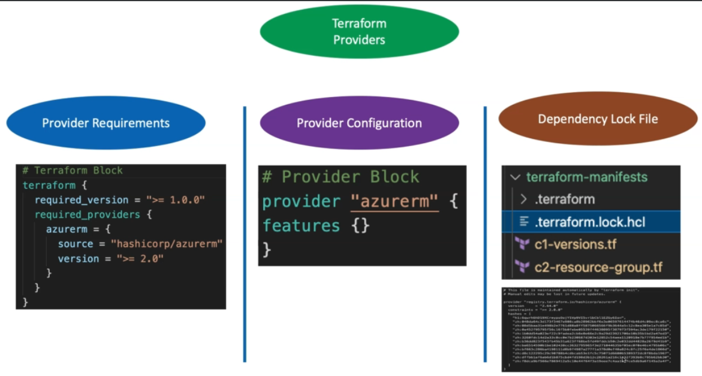

# TERRAFORM

Infrastructure as code (IaC) tools allow you to manage infrastructure with configuration files rather than through a graphical user interface. IaC allows you to build, change, and manage your infrastructure in a safe, consistent, and repeatable way by defining resource configurations that you can version, reuse, and share.

Terraform is HashiCorp's infrastructure as code tool. It lets you define resources and infrastructure in human-readable, declarative configuration files, and manages your infrastructure's lifecycle

some advantages using terraform are:

- Terraform can manage infrastructure on multiple cloud platforms.
- The human-readable configuration language helps you write infrastructure code quickly.
- Terraform's state allows you to track resource changes throughout your deployments.
- You can commit your configurations to version control to safely collaborate on infrastructure.

## TERRAFORM WORKFLOW


## TERRAFORM COMMAND

| COMMAND | Description |
| ----------- | ----------- |
|Terrafom init |descarga provider|
|terraform init -upgrade |actualiza provider descaragndolo segun lo indicado en la version |
  |console     | Try Terraform expressions at an interactive command prompt|
  |fmt |          Reformat your configuration in the standard style|
  |force-unlock | Release a stuck lock on the current workspace|
  |get           |Install or upgrade remote Terraform modules
  |graph         |Generate a Graphviz graph of the steps in an operation|
  |import    |    Associate existing infrastructure with a Terraform resource|
  |login        | Obtain and save credentials for a remote host|
  |logout       | Remove locally-stored credentials for a remote host|
  |output       | Show output values from your root module|
  |providers    | Show the providers required for this configuration|
  |refresh      | Update the state to match remote systems|
  |show         | Show the current state or a saved plan|
  |state        | Advanced state management|
  |taint        | Mark a resource instance as not fully functional|
  |test         | Experimental support for module integration testing|
  |untaint      | Remove the 'tainted' state from a resource instance|
  |version      |Show the current Terraform version|
  |workspace    | Workspace management|
  |init         | Prepare your working directory for other commands|
  |validate      |Check whether the configuration is valid|
  |plan          |Show changes required by the current configuration|
  |apply         |Create or update infrastructure|
  |destroy       |Destroy previously-created infrastructure  This command is a convenience alias for: terraform apply -destroy |
  
  PLAN -out=path           Write a plan file to the given path. This can be used as
									input to the "apply" command.
									

terraform plan -var instance_type="t2.nano"  cuando se define una mvariable en  el main.tf

## Terraform modules

A local value assigns a name to an expression, so you can use it multiple times within a module without repeating it.

If you're familiar with traditional programming languages, it can be useful to compare Terraform modules to function definitions:

    Input variables are like function arguments.
    Output values are like function return values.
    Local values are like a function's temporary local variables.

benefits modules: reduce complexity, reduce risk, avoid repetition, increase readibility and mantainability, consistency

Types odf modules:

- Local modules

- Remote modules: this modules are outside of your omputer (terraform repository, git,etc)


## Manejo string 
	
manejo string terraform https://www.terraform.io/language/expressions/strings


terraform apply -auto-approve  par no responder yes no es recomendado

para los modulos es necesario hacer el terraform init

## Key concepts


### Resource
Resource is aws_vpc, aws_db_instance, etc. A resource belongs to a provider, accepts arguments, outputs attributes, and has lifecycles. A resource can be created, retrieved, updated, and deleted.
### Resource module
Resource module is a collection of connected resources which together perform the common action (for eg, 
 creates VPC, subnets, NAT gateway, etc). It depends on provider configuration, which can be defined in it, or in higher-level structures (eg, in infrastructure module).
### Infrastructure module
An infrastructure module is a collection of resource modules, which can be logically not connected, but in the current situation/project/setup serves the same purpose. It defines the configuration for providers, which is passed to the downstream resource modules and to resources. It is normally limited to work in one entity per logical separator (eg, AWS Region, Google Project).
For example,  module uses resource modules like  and  to manage the infrastructure required for running  on 
.
Another example is  module where multiple modules by 
 are being used together to manage the infrastructure as well as using Docker resources to build, push, and deploy Docker images. All in one set.

### Composition
Composition is a collection of infrastructure modules, which can span across several logically separated areas (eg., AWS Regions, several AWS accounts). Composition is used to describe the complete infrastructure required for the whole organization or project.
A composition consists of infrastructure modules, which consist of resources modules, which implement individual resources.
Simple infrastructure composition

### Data source
Data source performs a read-only operation and is dependant on provider configuration, it is used in a resource module and an infrastructure module.
Data source terraform_remote_state acts as a glue for higher-level modules and compositions.
The  data source allows an external program to act as a data source, exposing arbitrary data for use elsewhere in the Terraform configuration. Here is an example from the 
 where the filename is computed by calling an external Python script.
The 
 data source makes an HTTP GET request to the given URL and exports information about the response which is often useful to get information from endpoints where a native Terraform provider does not exist.
### Remote state
Infrastructure modules and compositions should persist their 
 in a remote location where it can be retrieved by others in a controllable way (e.g. specify ACL, versioning, logging).

### Provider, provisioner, etc

Providers, provisioners, and a few other terms are described very well on the official documentation and there is no point to repeat it here. To my opinion, they have little to do with writing good Terraform modules.

### Why so difficult?
While individual resources are like atoms in the infrastructure, resource modules are molecules. A module is the smallest versioned and shareable unit. It has an exact list of arguments, implement basic logic for such a unit to do the required function. Eg. 
 module creates aws_security_group and aws_security_group_rule resources based on input. This resource module by itself can be used together with other modules to create the infrastructure module.
Access to data across mo
lecules (resource modules and infrastructure modules) is performed using the modules' outputs and data sources.
Access between compositions is often performed using remote state data sources. There are 
.

## Code structure


Putting all code in main.tf is a good idea when you are getting started or writing an example code. In all other cases you will be better having several files split logically like this:

 - main.tf - call modules, locals, and data sources to create all resources
- variables.tf - contains declarations of variables used in main.tf
- outputs.tf - contains outputs from the resources created in main.tf
- versions.tf - contains version requirements for Terraform and providers


## Variable

````
variable "myvar"{
  type="string"
  default = "hello terraform"
}

variable "mymap" {
  type = map(string)
  default ={
    mykey = "my value"
  }
}

variable "mylist" {
  type = list
  default =[1,2,3]
}

````
 las variabel se puede llmar en consola de terraform usando terrafrom console para abrir la consolo y luego escribir var.myvar o "${var.myvar}para map se puede llamar var.mymap ["mykey"]


 ### Terraform Variable types

 #### Simple

  - String
  - Number
  - Bool

#### Complex

- list [0,1,5,2] always orderes
- set is like a list but dopesn't keep the order you put it in, and can only contain unique values
- map
- object is like a map but each element can have a different type
- tuple is like a list, but each element can have a different type


## Terraform with Azure

### Terraform Basic blocks

#### **Terraform BlocK**
  - Special block used to configure some behaviors
  - Specifying a required Terraform CLI version
  - Specifying Provider requirements and versions
  - Configure a teraform backend( terrafrom state)
  - only constant values can be used

        terraform {
          # Requiered Terraform version
          required_version = ">=1.0.0"
          # Required Providers and their versions
          required_providers{
            azurerm = {
              source  = "hashicorp/azurerm"
              version = ">= 2.0" # optional but recommend
            }
          }
          # Terraform state Storage to azure Storage Container
          backend "azurerm" {
            resource_group_name  = "terrafor-storage-rg
            storage_account_name = "terraformstate201"
            container_name       = "tfstatefiles"
            key                  = "terraform.tfstate"
          }
          # Experimental Language features
          experiments = [ example ] #Experimental (Not required)
          # Passing metadata to providers
          provider_meta "my-provider" { #Super Advanced (not requiered)
            hello= "world"
          }
        }

Version Constraint Syntax

Terraform's syntax for version constraints is very similar to the syntax used by other dependency management systems like Bundler and NPM.

The following operators are valid:

- = (or no operator): Allows only one exact version number. Cannot be combined with other conditions.

- !=: Excludes an exact version number.

- \>, >=, <, <=: Comparisons against a specified version, allowing versions for which the comparison is true. "Greater-than" requests newer versions, and "less-than" requests older versions.

- ~>: Allows only the rightmost version component to increment. For example, to allow new patch releases within a specific minor release, use the full version number: ~> 1.0.4 will allow installation of 1.0.5 and 1.0.10 but not 1.1.0. This is usually called the pessimistic constraint operator.

Best Practices

- Module Versions

  - When depending on third-party modules, require specific versions to ensure that updates only happen when convenient to you.

  - For modules maintained within your organization, specifying version ranges may be appropriate if semantic versioning is used consistently or if there is a well-defined release process that avoids unwanted updates.

#### **Provider Block**
  - Heart of terrafomr
  - Terraform relies on providers to interact with remote systems
  - Declare providers for terraform to install providers and use them
  - Provider configuration belong to root module

We can use the alternate provider in a resource, data or module by referencing it as \<PROVIDER NAME>.\<ALIAS>

```
# Terraform Block
terraform {
  required_version = ">= 0.15"
  required_providers {
    azurerm = {
      source = "hashicorp/azurerm"
      version = ">= 2.0"
    }
  }
}

# Provider-1 for EastUS (Default Provider)
provider "azurerm" {
  features {}
}

# Provider-2 for WestUS
provider "azurerm" {
  features {
    virtual_machine {
      delete_os_disk_on_deletion = false # This will ensure when the Virtual Machine is destroyed, Disk is not deleted, default is true and we can alter it at provider level
    }
  }
  alias = "provider2-westus"
  #client_id = "XXXX"
  #client_secret = "YYY"
  #environment = "german"
  #subscription_id = "JJJJ"
}


# Provider Documentation for Reference
# https://registry.terraform.io/providers/hashicorp/azurerm/latest/docs


# Create a resource group in EastUS region - Uses Default Provider
resource "azurerm_resource_group" "myrg1" {
  name = "myrg-1"
  location = "East US"
}

#Create a resource group in WestUS region - Uses "provider2-westus" provider
resource "azurerm_resource_group" "myrg2" {
  name = "myrg-2"
  location = "West US"
  provider = azurerm.provider2-westus
}


/*
Additional Note: 
provider = <PROVIDER NAME>.<ALIAS NAME>  # This is a Meta-Argument from Resources Section nothing but a Special Argument
*/

```

#### **resource Block**
  - Each resource block describes one or more infraestructure objects

### Meta-Arguments

  - Depend on:

  The depends_on meta-argument instructs Terraform to complete all actions on the dependency object (including Read actions) before performing actions on the object declaring the dependency. When the dependency object is an entire module, depends_on affects the order in which Terraform processes all of the resources and data sources associated with that module

  - count:

  The count meta-argument accepts a whole number, and creates that many instances of the resource or module.

  - for each

  If a resource or module block includes a for_each argument whose value is a map or a set of strings, Terraform creates one instance for each member of that map or set.

  - Povider

The provider meta-argument specifies which provider configuration to use for a resource, overriding Terraform's default behavior of selecting one based on the resource type name.


  - lifecycle The Resource Behavior page describes the general lifecycle for resources. Some details of that behavior can be customized using the special nested lifecycle block within a resource block body:

    The arguments available within a lifecycle block are 

    - **create_before_destroy** meta-argument changes this behavior so that the new replacement object is created first, and the prior object is destroyed after the replacement is created.

    - **prevent_destroy** This meta-argument, when set to true, will cause Terraform to reject with an error any plan that would destroy the infrastructure object associated with the resource, as long as the argument remains present in the configuration.

    - **ignore_changes** feature is intended to be used when a resource is created with references to data that may change in the future, but should not affect said resource after its creation

    - **Replace_triggered_by** Replaces the resource when any of the referenced items change. Supply a list of expressions referencing managed resources, instances, or instance attributes. 

## Dependency Lock File

A Terraform configuration may refer to two different kinds of external dependency that come from outside of its own codebase:

- Providers, which are plugins for Terraform that extend it with support for interacting with various external systems.
- Modules, which allow splitting out groups of Terraform configuration constructs (written in the Terraform language) into reusable abstractions.

The dependency lock file is a file that belongs to the configuration as a whole, rather than to each separate module in the configuration. For that reason Terraform creates it and expects to find it in your current working directory when you run Terraform, which is also the directory containing the .tf files for the root module of your configuration.

The lock file is always named .terraform.lock.hcl, and this name is intended to signify that it is a lock file for various items that Terraform caches in the .terraform subdirectory of your working directory.

Terraform automatically creates or updates the dependency lock file each time you run the terraform init

## terraform state

the primary purpose of terraform state is to store bindings between objects in a remote system and resource instances declared in your configuration

Benefits of remote state:

- Working in a team
- Keeping sensitive information off your local disck
- Remote operations
- Locking while running terraform
  - prevents concurrent state operations
  - Automatically locked
  - Encryption at rest in Azure Blob Storage

## Conditionals

- Format: conition ? true_val: false_val

## Functions

- Vast amount of built-in functions
- No support for user defined functions

https://developer.hashicorp.com/terraform/language/functions

## For and Foreach loops

- The foor-loop features can help you to loop over variables, transform it, and output it in different formats
- You can loop over a list [1,2,3,4] or even a map like {"key"="value"}
- You can transform them by doping a calculation or a string operation


- For example

  - [for s in ["this is a","list"]:upper(s)]


https://github.com/in4it/terraform-azure-course


 
# Terraform for the absolute Beginners with labs


Configuration Managment:
  - Designed to install and manage software
  - Maintains Standard Structure
  - Version control
  - Idempotent

Server templating tools:
  - Pre installed software and dependencies
  - virtual machine or docker images
  - inmutable infraestructure

Provisioning tools
  - Deploy inmutable infraestructure resources
  - Server, databases, network components, etc
  - multiple providers


### HCL basic

```
<block> <parameters>{
  key1= value1
  key2 = value2
}
```


## Configuration directory

|File Name| Purpose|
|-|-|
|main.tf| Main configuration file containing resource definition| 
variables.tf| Contains variable declarations
outputs.tf| Contains outputs from resources
provider.tf| Contain provider definition

## Using input variables


## Variable block

The variable block has 3 arguments default, type and description


The types are:


set is similar to list but set has not duplicates elements


tuples are similar to list the difference list use the same type but in tuples you can use differetne types of elements


## Variable definition Files


### Variable definition precedence


4  method has the highest priority in Variable Definition Precedence

### Resources Attributes


### Resources Dependencies

- Implicit dependency terrform figure out reference expression

- Explicit deepndency


### Output Variables


terraform output show the outputs

## Terraform state

Terraform must store state about your managed infrastructure and configuration. This state is used by Terraform to map real world resources to your configuration, keep track of metadata, and to improve performance for large infrastructures.

This state is stored by default in a local file named "terraform.tfstate", but it can also be stored remotely, which works better in a team environment.

Terraform uses this local state to create plans and make changes to your infrastructure. Prior to any operation, Terraform does a refresh to update the state with the real infrastructure.

The primary purpose of Terraform state is to store bindings between objects in a remote system and resource instances declared in your configuration. When Terraform creates a remote object in response to a change of configuration, it will record the identity of that remote object against a particular resource instance, and then potentially update or delete that object in response to future configuration changes.

## Inmutable infraestructure

Immutable infrastructure is an approach to managing services and software deployments on IT resources wherein components are replaced rather than changed.

## Lifecycle Rules

lifecycle is a nested block that can appear within a resource block. The lifecycle block and its contents are meta-arguments, available for all resource blocks regardless of type.

The arguments available within a lifecycle block are create_before_destroy, prevent_destroy, ignore_changes, and replace_triggered_by.

- The create_before_destroy (bool) meta-argument changes this behavior so that the new replacement object is created first, and the prior object is destroyed after the replacement is created.

- prevent_destroy (bool) - This meta-argument, when set to true, will cause Terraform to reject with an error any plan that would destroy the infrastructure object associated with the resource, as long as the argument remains present in the configuration.

But the resource can be deleted by terraform destroy

- ignore_changes (list of attribute names) - By default, Terraform detects any difference in the current settings of a real infrastructure object and plans to update the remote object to match configuration.

  The ignore_changes feature is intended to be used when a resource is created with references to data that may change in the future, but should not affect said resource after its creation.

- replace_triggered_by (list of resource or attribute references) - Added in Terraform 1.2. Replaces the resource when any of the referenced items change. Supply a list of expressions referencing managed resources, instances, or instance attributes. When used in a resource that uses count or for_each, you can use count.index or each.key in the expression to reference specific instances of other resources that are configured with the same count or collection.

  References trigger replacement in the following conditions:

  - If the reference is to a resource with multiple instances, a plan to update or replace any instance will trigger replacement.
  - If the reference is to a single resource instance, a plan to update or replace that instance will trigger replacement.
  - If the reference is to a single attribute of a resource instance, any change to the attribute value will trigger replacement.

  You can only reference managed resources in replace_triggered_by expressions. This lets you modify these expressions without forcing replacement.

  


If you observe the output of the previous apply (scroll up!), you will see that the lifecycle rule we applied caused the local file to the created first and the same file to be destroyed during the recreate operation.

This goes to show that it is not always advisable to use this rule!

In this example, the filename argument for the local_file resource has to be unique which means that we cannot have two instances of the same file created at the same time!
The random_string resource on the other hand is a logical resource that is only recorded in the state and does not have such a restriction.

## Datasource

Data sources allow Terraform to use information defined outside of Terraform, defined by another separate Terraform configuration, or modified by functions.

A data source is accessed via a special kind of resource known as a data resource, declared using a data block:

```
data "aws_ami" "example" {
  most_recent = true

  owners = ["self"]
  tags = {
    Name   = "app-server"
    Tested = "true"
  }
}

```

A data block requests that Terraform read from a given data source ("aws_ami") and export the result under the given local name ("example"). The name is used to refer to this resource from elsewhere in the same Terraform module, but has no significance outside of the scope of a module.

The data source and name together serve as an identifier for a given resource and so must be unique within a module.

### Resources vs datasources

|Resource|Data source|
|-|-|
|keyword: **resource**| keyword: **data**|
|Creates, updates, destroys infraestructure|Only reads Infraestructure|
|Also called: **Managed Resources**| Also Called **Data Resources**|

## Meta Arguments

There are 5 Meta-Arguments in Terraform which are as follows:

- depends_on
- count
- for_each
- provider
- lifecycle

### Count

count is a meta-argument defined by the Terraform language. It can be used with modules and with every resource type.

The count meta-argument accepts a whole number, and creates that many instances of the resource or module. Each instance has a distinct infrastructure object associated with it, and each is separately created, updated, or destroyed when the configuration is applied.

 


the output is created as a list

### For Each

for_each is a meta-argument defined by the Terraform language. It can be used with modules and with every resource type.

The for_each meta-argument accepts a map or a set of strings, and creates an instance for each item in that map or set. Each instance has a distinct infrastructure object associated with it, and each is separately created, updated, or destroyed when the configuration is applied.


the output is created like a map

## Version Constraints

Terraform's syntax for version constraints is very similar to the syntax used by other dependency management systems like Bundler and NPM.

The following operators are valid:

- = (or no operator): Allows only one exact version number. Cannot be combined with other conditions.

- !=: Excludes an exact version number.

- \>, >=, <, <=: Comparisons against a specified version, allowing versions for which the comparison is true. "Greater-than" requests newer versions, and "less-than" requests older versions.

- ~>: Allows only the rightmost version component to increment. For example, to allow new patch releases within a specific minor release, use the full version number: ~> 1.0.4 will allow installation of 1.0.5 and 1.0.10 but not 1.1.0. This is usually called the pessimistic constraint operator.

## Remote State

## state locking

## Remote backend S3


### Terraform state command


## Terraform provisioners

You can use provisioners to model specific actions on the local machine or on a remote machine in order to prepare servers or other infrastructure objects for service.

- remote exec

The remote-exec provisioner invokes a script on a remote resource after it is created. This can be used to run a configuration management tool, bootstrap into a cluster, etc. To invoke a local process, see the local-exec provisioner instead. The remote-exec provisioner requires a connection and supports both ssh and winrm.
connection

- local exec

The local-exec provisioner invokes a local executable after a resource is created. This invokes a process on the machine running Terraform, not on the resource. See the remote-exec provisioner to run commands on the resource.

- file provisioner

The file provisioner copies files or directories from the machine running Terraform to the newly created resource. The file provisioner supports both ssh and winrm type connections.

- destroy time provisioner

- failure behavior
 on_failure = fail is by default

 on_failure = continue salta los errores

 ## Terraform taint and untaint

The terraform taint command informs Terraform that a particular object has become degraded or damaged. Terraform represents this by marking the object as "tainted" in the Terraform state, and Terraform will propose to replace it in the next plan you create.

**For Terraform v0.15.2 and later, we recommend using the -replace option with terraform apply to force Terraform to replace an object even though there are no configuration changes that would require it.**

## Debugging terraform

log level 

export TF_LOG=TRACE

export TF_LOG_PATH=/tmp/terrafom.log

## Terraform import

terraform import <resource_type>.<resource_name> <attribute>

## Terraform Modules

## Terrafrom Functions

The Terraform language includes a number of built-in functions that you can call from within expressions to transform and combine values. The general syntax for function calls is a function name followed by comma-separated arguments in parentheses:
```
<FUNCTION NAME>(<ARGUMENT 1>, <ARGUMENT 2>)
```

## Terraform workspaces (OSS)

terraform workspace new <NAMEPROJECT>

terraform workspace list

terraform workspace select <NAMEPROJECT>

______________________________

# Terraform en Azure


```
#####################################################################
# Block-1: Terraform Settings Block
terraform {
  required_version = ">= 1.0.0"
  required_providers {
    azurerm = {
      source = "hashicorp/azurerm"
      version = ">= 2.0"
    }
  }
# Terraform State Storage to Azure Storage Container
  backend "azurerm" {
    resource_group_name   = "terraform-storage-rg"
    storage_account_name  = "terraformstate201"
    container_name        = "tfstatefiles"
    key                   = "terraform.tfstate"
  }   
}

#####################################################################
# Block-2: Provider Block
provider "azurerm" {
  features {}
}
#####################################################################
# Block-3: Resource Block
# Create a resource group
resource "azurerm_resource_group" "myrg" {
  name = "myrg-1"
  location = var.azure_region 
}
# Create Virtual Network
resource "azurerm_virtual_network" "myvnet" {
  name                = "myvnet-1"
  address_space       = ["10.0.0.0/16"]
  location            = azurerm_resource_group.myrg.location
  resource_group_name = azurerm_resource_group.myrg.name
}
#####################################################################
# Block-4: Input Variables Block
# Define a Input Variable for Azure Region 
variable "azure_region" {
  default = "eastus"
  description = "Azure Region where resources to be created"
  type = string
}
#####################################################################
# Block-5: Output Values Block
# Output the Azure Resource Group ID 
output "azure_resourcegroup_id" {
  description = "My Azure Resource Group ID"
  value = azurerm_resource_group.myrg.id 
}
#####################################################################
# Block-6: Local Values Block
# Define Local Value with Business Unit and Environment Name combined
locals {
  name = "${var.business_unit}-${var.environment_name}"
}
#####################################################################
# Block-7: Data sources Block
# Use this data source to access information about an existing Resource Group.
data "azurerm_resource_group" "example" {
  name = "existing"
}
output "id" {
  value = data.azurerm_resource_group.example.id
}
#####################################################################
# Block-8: Modules Block
# Azure Virtual Network Block using Terraform Modules (https://registry.terraform.io/modules/Azure/network/azurerm/latest)
module "network" {
  source              = "Azure/network/azurerm"
  resource_group_name = azurerm_resource_group.example.name
  address_spaces      = ["10.0.0.0/16", "10.2.0.0/16"]
  subnet_prefixes     = ["10.0.1.0/24", "10.0.2.0/24", "10.0.3.0/24"]
  subnet_names        = ["subnet1", "subnet2", "subnet3"]

  tags = {
    environment = "dev"
    costcenter  = "it"
  }

  depends_on = [azurerm_resource_group.example]
}
#####################################################################

```

## Terraform Fundamental blocks


### Terraform block

- This block can be called in 3 ways. All means the same. 
  - Terraform Block
  - Terraform Settings Block
  - Terraform Configuration Block
- Each terraform block can contain a number of settings related to Terraform's behavior. 
- Within a terraform block, only constant values can be used; arguments may not refer to named objects such as resources, input variables, etc, and may not use any of the Terraform language built-in functions.


### versionconstraints

Version numbers should be a series of numbers separated by periods (like 1.2.0), optionally with a suffix to indicate a beta release.

The following operators are valid:

= (or no operator): Allows only one exact version number. Cannot be combined with other conditions.

!=: Excludes an exact version number.

>, >=, <, <=: Comparisons against a specified version, allowing versions for which the comparison is true. "Greater-than" requests newer versions, and "less-than" requests older versions.

~>: Allows only the rightmost version component to increment. This format is referred to as the pessimistic constraint operator. For example, to allow new patch releases within a specific minor release, use the full version number:

~> 1.0.4: Allows Terraform to install 1.0.5 and 1.0.10 but not 1.1.0.
~> 1.1: Allows Terraform to install 1.2 and 1.10 but not 2.0.

## Terraform providers




## Terraform multiple providers


## Terraform dependency lock file


If terraform did not find a lock file, it would download the latest version of the providers that fulfill the version constraints you defined in the requiered_providers block inside terraform setting blocks

If we have lock file, the lock file causes terraform to always install the same provider versio, ensuring that runs across your team or remote sessions will be consistent

## Resources syntax


## Terraform resource behavior


## Terraform state


## Input variables

Input variables serve as parameters for a terraform module, allowing aspects of the module to bve customized without altering the module's own source code, and allowing modules to be shared between different configurations

## Local Values


## Meta arguments


### Depends on


### Count


#### ELement function

element retrieves a single element from a list.

element(list, index)

The index is zero-based. This function produces an error if used with an empty list. The index must be a non-negative integer.

Use the built-in index syntax list[index] in most cases. Use this function only for the special additional "wrap-around" behavior described below.

> element(["a", "b", "c"], 1)
b


To get the last element from the list use length to find the size of the list (minus 1 as the list is zero-based) and then pick the last element:

> element(["a", "b", "c"], length(["a", "b", "c"])-1)
c


#### length Function

length determines the length of a given list, map, or string.

If given a list or map, the result is the number of elements in that collection. If given a string, the result is the number of characters in the string.

#### Splat Expressions

A splat expression provides a more concise way to express a common operation that could otherwise be performed with a for expression.

If var.list is a list of objects that all have an attribute id, then a list of the ids could be produced with the following for expression:

    [for o in var.list : o.id]

This is equivalent to the following splat expression:

    var.list[*].id

The special [*] symbol iterates over all of the elements of the list given to its left and accesses from each one the attribute name given on its right. A splat expression can also be used to access attributes and indexes from lists of complex types by extending the sequence of operations to the right of the symbol:

    var.list[*].interfaces[0].name

The above expression is equivalent to the following for expression:

    [for o in var.list : o.interfaces[0].name]


_______________________

