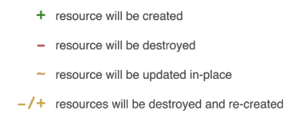
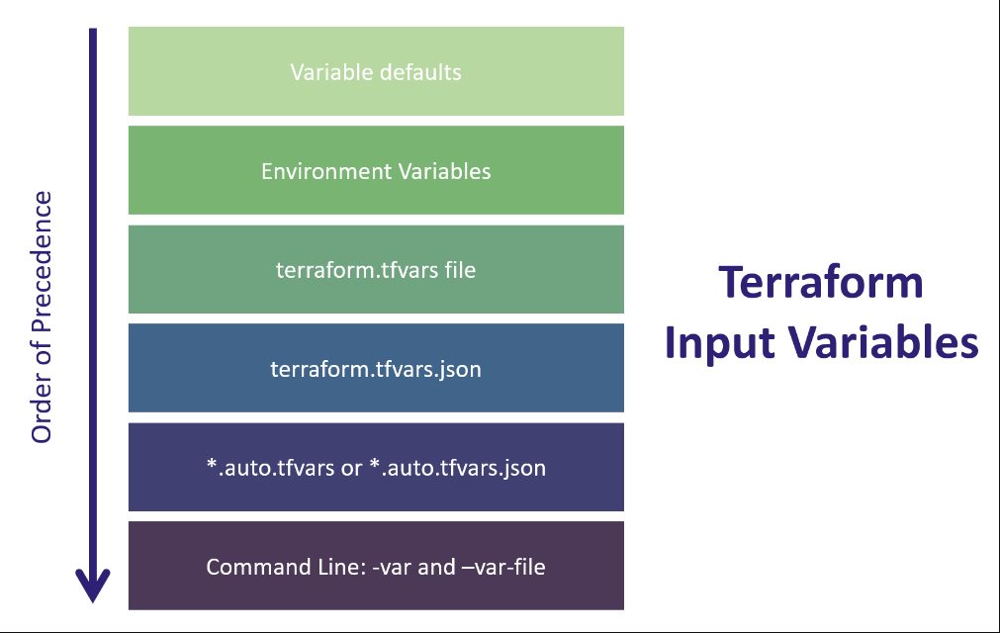

# terraform

Terraform Code Configuration block types include:

Terraform Settings Block
Terraform Provider Block
Terraform Resource Block
Terraform Data Block
Terraform Input Variables Block
Terraform Local Variables Block
Terraform Output Values Block
Terraform Modules Block

If you ever would like to know which providers are installed in your working directory and those required by the configuration, you can issue a terraform version and terraform providers command.


________


En Terraform, la tilde (~) en la salida de terraform plan indica un cambio planeado pero no aplicado. Esto significa que Terraform detectó un cambio en la configuración que necesita ser aplicado, pero debido a diversas razones, como dependencias o restricciones de estado, el cambio no se aplicará directamente en esta ejecución.

Por lo general, esto ocurre cuando se modifica un recurso y Terraform determina que el cambio no puede aplicarse de manera independiente, sino que depende de otros recursos que también necesitan cambios. Terraform mostrará estos cambios planeados con tilde (~) para informarte de que se ha detectado un cambio, pero no se aplicará inmediatamente debido a su dependencia de otros cambios.

Por ejemplo, si modificas un recurso de red y también cambias la configuración de un recurso de instancia, Terraform mostrará ambos cambios planeados con una tilde (~) para indicar que están relacionados y que se aplicarán juntos en la siguiente ejecución. Esto ayuda a entender las relaciones entre los recursos y cómo se aplicarán los cambios en conjunto.

_______________

Comenzando con la estructuración de la configuración de Terraform
Poner todo el código en main.tf es una buena idea de cuando estás comenzando o escribiendo un código ejemplo. Para cualquier otro caso será mejor tener varios archivos en una separación lógica como a continuación se presenta:

main.tf - llama a los módulos, locals y data-sources para crear todos los recursos.

variables.tf - contiene declaraciones de variables utilizadas en el main.tf.

outputs.tf - contiene outputs de recursos creados en main.tf.

versions.tf - contiene requerimientos de versión para Terraform y proveedores.

terraform.tfvars no debe ser utilizado en ningún otro lugar más que en la composición.

_______________________________

Cuando ejecutas el comando terraform plan en Terraform, obtendrás una salida que contiene una serie de símbolos y colores que te proporcionan información sobre los cambios que Terraform planea realizar en tu infraestructura. Aquí tienes una explicación de los símbolos más comunes que puedes encontrar:

"+" (verde): Indica que Terraform planea crear un nuevo recurso.

"-" (rojo): Indica que Terraform planea eliminar un recurso existente.

"~" (amarillo): Indica que Terraform planea modificar un recurso existente. Esto puede incluir cambios en las propiedades del recurso, como la actualización de configuraciones o la reasignación de atributos.

"-" (gris): Indica que Terraform planea reemplazar un recurso existente. Esto significa que el recurso actual será eliminado y luego recreado con una configuración actualizada. Esto puede ocurrir cuando se cambia un atributo que no puede ser modificado sin recrear el recurso, como el ID del recurso.

"?" (azul): Indica que Terraform no está seguro de qué acción tomar con respecto a un recurso. Esto puede ocurrir cuando se cambian configuraciones en un recurso que no son manejadas directamente por Terraform, o cuando Terraform no puede determinar con certeza si un cambio específico requerirá la creación, modificación o eliminación de un recurso.

"!" (morado): Indica que Terraform ha detectado un error al planificar los cambios. Esto puede ocurrir cuando hay conflictos en la configuración, dependencias faltantes o problemas de sintaxis en los archivos de configuración.



# Partial backend

El concepto de "partial backend configuration" en Terraform se refiere a la capacidad de definir solo una parte de la configuración del backend en un archivo de configuración de Terraform, mientras que el resto de la configuración se proporciona mediante otros medios, como variables de entorno, argumentos de línea de comandos u otros archivos de configuración.

Esto es útil en situaciones donde deseas mantener ciertos aspectos de la configuración del backend en un lugar centralizado, como un archivo compartido o una variable de entorno común, pero quieres permitir la personalización de ciertos valores específicos para cada entorno o usuario.

Por ejemplo, imagina que estás trabajando en un equipo donde todos comparten la misma configuración de backend de Terraform para almacenar el estado remoto en AWS S3, pero cada desarrollador necesita tener su propio bucket de S3 para trabajar de manera independiente. En este caso, podrías definir la configuración del backend de la siguiente manera:

```
terraform {
  backend "s3" {
    # Solo se proporciona la configuración parcial
    # El resto de la configuración se proporcionará mediante variables de entorno o argumentos de línea de comandos
    bucket         = var.backend_bucket
    key            = "terraform.tfstate"
    region         = var.backend_region
    dynamodb_table = var.backend_dynamodb_table
  }
}

```
Luego, cada desarrollador puede definir sus propias variables de entorno o pasar los valores correspondientes como argumentos de línea de comandos al ejecutar Terraform:

```
export TF_VAR_backend_bucket=my-unique-bucket-name
export TF_VAR_backend_region=us-west-2
export TF_VAR_backend_dynamodb_table=terraform-state-lock
terraform init
terraform apply

```

De esta manera, la configuración centralizada del backend de Terraform se mantiene en el archivo de configuración compartido, pero los valores específicos pueden ser personalizados según las necesidades individuales de cada usuario o entorno. Esto proporciona flexibilidad y reutilización de la configuración mientras permite la personalización según sea necesario.

# Locals vs variables


En Terraform, así como en la programación en general, es importante comprender la diferencia entre las variables locales y las variables en un sentido más amplio. Permíteme explicarte:

Variables en Terraform:
Variables Locales: Son variables que se definen dentro de un módulo o un bloque de recursos y se utilizan para almacenar valores temporales o para simplificar la configuración. Se definen con la palabra clave locals y son accesibles solo dentro del contexto en el que se definen.
Variables de Entrada: Son valores que se pasan a través de la interfaz de Terraform, ya sea mediante archivos de configuración (tfvars) o mediante la línea de comandos. Estas variables son definidas por el usuario y se pueden utilizar en todo el código Terraform.
Variables de Salida: Son valores que se exponen después de que Terraform haya aplicado la configuración. Estas variables se pueden usar para proporcionar información útil a otros recursos o sistemas externos.
Uso, Ventajas y Desventajas:
Variables Locales:
Uso: Se utilizan principalmente para almacenar valores que se repiten en varias partes del código o para simplificar la configuración al calcular valores derivados de otras variables.
Ventajas:
Ayudan a mantener el código más limpio y legible al evitar repeticiones.
Permiten realizar cálculos simples o manipulaciones de datos dentro del código.
Desventajas:
Su alcance está limitado al contexto en el que se definen, por lo que no se pueden utilizar fuera de ese contexto.
Pueden hacer que el código sea más difícil de entender si se abusa de ellas o si se utilizan de manera inapropiada.
Variables de Entrada:
Uso: Se utilizan para parametrizar la configuración de Terraform, permitiendo que el mismo código se utilice en diferentes entornos o configuraciones.
Ventajas:
Facilitan la reutilización del código al permitir la configuración dinámica.
Permiten una mayor flexibilidad al adaptar el comportamiento del código a diferentes contextos.
Desventajas:
Si no se gestionan adecuadamente, pueden introducir complejidad adicional en la configuración.
Requieren una gestión cuidadosa para garantizar la consistencia y seguridad de los valores proporcionados por el usuario.
En resumen, las variables locales son útiles para simplificar y limpiar el código al definir valores temporales o derivados, mientras que las variables de entrada son fundamentales para parametrizar la configuración y hacer que el código sea más flexible y reutilizable. Ambos tipos de variables tienen su lugar en la configuración de Terraform y deben utilizarse según las necesidades específicas del proyecto.

# variables precedence



# Dynamic block

dynamic block allows you to generate multiple blocks of configuration dynamically based on a list, map, or set of values. This is particularly useful when you want to create multiple instances of a resource or when you need to repeat a block of configuration for different items.

```
dynamic "block_type" {
  for_each = expression
  content {
    # Configuration for the block
  }
}

```

Let's break down this syntax:

- dynamic "block_type": This declares a dynamic block where "block_type" is the name of the block to generate. You replace "block_type" with the name of the block you want to generate dynamically, such as "resource" or "provider".

- for_each = expression: This is where you define the expression that determines how many instances of the block will be created and what their attributes will be. The expression can be a list, map, or set.

- content { }: Inside the content block, you specify the configuration for each dynamically generated block. This configuration will be applied to each instance of the block.

Here's a simple example of using a dynamic block to create multiple instances of a resource:


```
resource "aws_instance" "example" {
  count = 3
  instance_type = "t2.micro"
  
  dynamic "ebs_block_device" {
    for_each = toset(["/dev/sdb", "/dev/sdc", "/dev/sdd"])
    content {
      device_name = ebs_block_device.key
      volume_type = "gp2"
      volume_size = 20
    }
  }
}

```

In this example, we're creating three AWS instances, each with an additional EBS volume attached. The dynamic block generates multiple ebs_block_device blocks based on the values in the toset(["/dev/sdb", "/dev/sdc", "/dev/sdd"]) list. For each value in the list, Terraform will create a separate ebs_block_device block with the specified configuration.

Dynamic blocks are powerful because they allow you to generate configuration blocks dynamically based on changing conditions or data, making your Terraform configurations more flexible and reusable.

# Count vs for each


Of course! In Terraform, for_each and count are both used to create multiple instances of a resource, but they have different functionalities.

## count:
- It's a simple integer value that defines how many instances of a resource to create.
- The instances are indexed numerically starting from 0.
- You typically use count when you have a fixed number of instances you want to create.

```
resource "aws_instance" "example" {
  count = 3
  // Other configuration options...
}

```

## for_each:
- It allows you to create multiple instances based on a map or set of strings.
- It's more flexible than count because you can specify unique identifiers for each instance.
- It's useful when you have a variable number of instances or when you want more control over each instance.

```
variable "instance_names" {
  type = set(string)
  default = ["instance1", "instance2", "instance3"]
}

resource "aws_instance" "example" {
  for_each = var.instance_names
  // Other configuration options...
}
```

In this example, Terraform will create three instances of aws_instance, each with a unique identifier corresponding to the elements in the instance_names set.

In summary, count is simpler and more suitable when you have a fixed number of instances, while for_each provides more flexibility when you need unique identifiers or variable numbers of instances.

# Meta arguments https://developer.hashicorp.com/terraform/language/meta-arguments/resource-provider

## depends on

## count

## for_each

## provider

## lifecycle


# Alias en terraform

You can optionally define multiple configurations for the same provider, and select which one to use on a per-resource or per-module basis. The primary reason for this is to support multiple regions for a cloud platform; other examples include targeting multiple Docker hosts, multiple Consul hosts, etc.

To create multiple configurations for a given provider, include multiple provider blocks with the same provider name. For each additional non-default configuration, use the alias meta-argument to provide an extra name segment. For example:

```
# The default provider configuration; resources that begin with `aws_` will use
# it as the default, and it can be referenced as `aws`.
provider "aws" {
  region = "us-east-1"
}

# Additional provider configuration for west coast region; resources can
# reference this as `aws.west`.
provider "aws" {
  alias  = "west"
  region = "us-west-2"
}

```

To declare a configuration alias within a module in order to receive an alternate provider configuration from the parent module, add the configuration_aliases argument to that provider's required_providers entry. The following example declares both the mycloud and mycloud.alternate provider configuration names within the containing module:

```
terraform {
  required_providers {
    mycloud = {
      source  = "mycorp/mycloud"
      version = "~> 1.0"
      configuration_aliases = [ mycloud.alternate ]
    }
  }
}

```

## Referring to Alternate Provider Configurations
When Terraform needs the name of a provider configuration, it expects a reference of the form <PROVIDER NAME>.<ALIAS>. In the example above, aws.west would refer to the provider with the us-west-2 region.

These references are special expressions. Like references to other named entities (for example, var.image_id), they aren't strings and don't need to be quoted. But they are only valid in specific meta-arguments of resource, data, and module blocks, and can't be used in arbitrary expressions.

## Selecting Alternate Provider Configurations
By default, resources use a default provider configuration (one without an alias argument) inferred from the first word of the resource type name.

To use an alternate provider configuration for a resource or data source, set its provider meta-argument to a <PROVIDER NAME>.<ALIAS> reference:

```
resource "aws_instance" "foo" {
  provider = aws.west

  # ...
}

```

To select alternate provider configurations for a child module, use its providers meta-argument to specify which provider configurations should be mapped to which local provider names inside the module:

```
module "aws_vpc" {
  source = "./aws_vpc"
  providers = {
    aws = aws.west
  }
}

```

## Dynamic blocks

