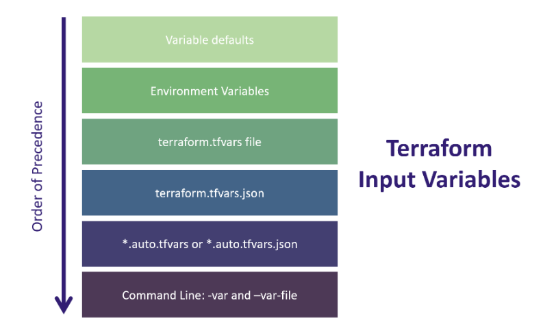

# Terraform

terraform init
•terraform validate
•terraform plan
•terraform apply
•terraform destroy

If you ever would like to know which providers are installed in your working directory and those
required by the configuration, you can issue a terraform version and terraform providers
command.

## Terraform Variables Block
```
variable “<VARIABLE_NAME>” {
# Block body
type = <VARIABLE_TYPE>
description = <DESCRIPTION>
default = <EXPRESSION>
sensitive = <BOOLEAN>
validation = <RULES>
}
```
Example
```
variable "aws_region" {
type = string
description = "region used to deploy workloads"
default = "us-east-1"
validation {
condition = can(regex("^us-", var.aws_region))
error_message = "The aws_region value must be a valid region in the
USA, starting with \"us-\"."
}
}
```



## Terraform Locals Block

Locals blocks (often referred to as locals) are defined values in Terraform that are used to reduce
repetitive references to expressions or values. Locals are very similar to traditional input variables and
can be referred to throughout your Terraform configuration. Locals are often used to give a name to
the result of an expression to simplify your code and make it easier to read.

Template
```
locals {
# Block body
local_variable_name = <EXPRESSION OR VALUE>
local_variable_name = <EXPRESSION OR VALUE>
}
```
Example
```
locals {
time = timestamp()
application = "api_server"
server_name = "${var.account}-${local.application}"
}
```

## Terraform Data Block

Data sources are used in Terraform to load or query data from APIs or other Terraform workspaces.
You can use this data to make your project’s configuration more flexible, and to connect workspaces
that manage different parts of your infrastructure. You can also use data sources to connect and share
data between workspaces in Terraform Cloud and Terraform Enterprise.

## Terraform Output Block
Terraform output values allow you to export structured data about your resources. You can use this
data to configure other parts of your infrastructure with automation tools, or as a data source for
another Terraform workspace. Outputs are also necessary to share data from a child module to your
root module.

Template
```
output “<NAME>” {
# Block body
value= <EXPRESSION> # Argument
}
```
Example
```
output "web_server_ip" {
description = "Public IP Address of Web Server on EC2"
value = aws_instance.web_server.public_ip
sensitive = true
}

output "public_url" {
description = "Public URL for our Web Server"
value = "https://${aws_instance.web_server.private_ip}:8080/index.html"
}
output "vpc_information" {
description = "VPC Information about Environment"
value = "Your ${aws_vpc.vpc.tags.Environment} VPC has an ID of ${aws_vpc
.vpc.id}"
}
```

Generate Machine-Readable Outputs in JSON
When working with Terraform in your organization, it is common practice to use an automation tool
to automate your terraform deployments. But don’t fret! We can still use outputs and make them
“machine-readable” so other automation tools can parse the information, if needed.
Run a terraform output -jsonand view the list of outputs in JSON format from your configura-
tion:

## Dynamic Blocks
A dynamic block acts much like a for expression, but produces nested blocks instead of a complex
typed value. It iterates over a given complex value, and generates a nested block for each element of
that complex value. You can dynamically construct repeatable nested blocks using a special dynamic
block type, which is supported inside resource, data, provider, and provisioner blocks

