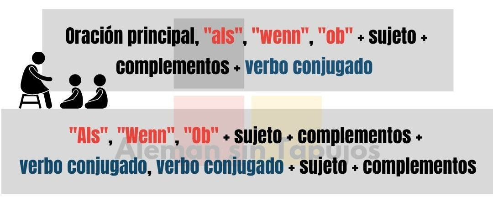

# Kurse1

# Das Verb SEIN

Konjugiere das unregelmäßige Verb „sein“

Ich bin …
Du bist …
Er/Sie/Es ist …
Wir sind …
Ihr seid …
Sie/sie sind …

____________________

# Das Präsens: Position des Verbs in einem Satz

Das Präsens – Position des Verbs in einem Satz

Er spielt Fußball.
Ich heiße Frau Heinemann.
Wir haben einen Sohn.
Die Wohnung ist in Berlin.
Der Schreibtisch ist im Büro.
Sie sitzen auf dem Sofa.

Das Prädikat (das Verb) steht in einem Satz immer an zweiter Stelle:

Ich spiele Fußball.
Sie heißt Frau Heinemann.
Wir sitzen auf dem Sofa.
Du hast einen Sohn.
Das Haus ist in Berlin.

# Das Präsens: Position des Verbs in einer Frage


Fragen mit Fragewörtern:

Wie heißen Sie?
Wo wohnst du?
Wann gehen wir nach Hause?

Fragen ohne Fragewörter:

Sprichst du Deutsch?
Wohnen Sie in Amerika?
Hat er einen Sohn?

Mit einem Fragewort steht das Personalpronomen (ich, du er, sie, es, wir, ihr, sie) nach dem Verb.

Wie machst du das?
Wann seid ihr da?
Wo wohnen sie?
Ohne Fragewort steht das Verb am Anfang der Frage.

Wohnst du … ?
Sprecht ihr … ?
Haben sie … ?

# Leute grüßen und Fragen stellen

Wie begrüßt man informell (Freunde, Bekannte)

Hallo
Hi
Grüß dich
Tag
Wie begrüßt man formell (Unbekannte, Ältere Leute)

Guten Morgen
Guten Tag
Guten Abend
Fragen stellen (informell)

Wie geht’s? (Singular)/Wie geht’s euch? (Plural)
Alles klar?
Fragen stellen (formell)

Wie geht es Ihnen?
Antworten und danke sagen

Es geht mir gut, danke.
Sehr gut, danke.
Ausgezeichnet, danke.
Alles in Ordnung.

# Sich vorstellen (formell und informell)

Wie Sie informell nach dem Namen fragen

Wie heiβt du?
Wer bist du?
Wie Sie formell nach dem Namen fragen

Wie heiβen Sie?
Wer sind Sie?
Wie Sie sich informell vorstellen

Ich bin …
Mein Name ist …
Ich heiβe …
Wie Sie sich formell vorstellen

Mein Name ist …
Ich heiβe …

# Grundlegende persönliche Informationen geben
Lernen Sie, die wichtigsten Dinge über sich selbst zu sagen.

Im Folgenden finden Sie grundlegende Informationen, die Sie bereitstellen können, wenn Sie sich vorstellen

Name und Alter

Mein Name ist Tina.
Ich bin 34 Jahre alt.
Adresse und Nationalität

Ich bin Französin.
Ich wohne in der Lindenstraße 19.
Telefonnummer

Meine Telefonnummer ist 0170 / 1234 567.

# Sich verabschieden
Lernen Sie wie man sich formell und informell verabschiedet.

Wie man sich informell verabschiedet:

Tschüss
Bis bald
Wir sehen uns
Bis dann
Tschau
Wie man sich formell verabschiedet:

Auf Wiedersehen

# Die Verben „kommen" und „wohnen"
Lernen Sie die Verben „kommen" und „wohnen" zu konjugieren.

Wir kommen aus einem Land.

ich komme …
du kommst …
er/sie/es kommt …
wir kommen …
ihr kommt …
Sie/sie kommen …
Wir wohnen in einer Stadt.

ich wohne …
du wohnst …
er/sie/es wohnt …
wir wohnen …
ihr wohnt …
Sie/sie wohnen …

# Bestimmte Artikel
Lernen Sie maskuline, feminine und neutrale bestimmte Artikel kennen.

Bestimmte Artikel sind der (maskulin), die (feminin/Plural) und das (neutral). Diese Artikel werden verwendet:

wenn wir von etwas Bestimmten sprechen
Beispiel:
Lena ist die Freundin von Franz. (die einzige – sie sind ein Paar)
 
wenn wir etwas als bekannt voraussetzen
Beispiel:
Das Eis schmeckt sehr gut.

# Unbestimmte Artikel
Lernen Sie maskuline, feminine und neutrale unbestimmte Artikel anzuwenden.

Unbestimmte Artikel sind ein(maskulin), eine(feminin/Plural) und ein (neutral). Diese Artikel werden verwendet:

wenn etwas nicht näher bestimmt ist.
Beispiel:
Lena ist eine Freundin von Lara. (eine von mehreren)
 
wenn wir etwas zum ersten Mal erwähnen.
Beispiel:
Lena hat ein Eis gekauft.


Ein Stift
Ein Schreibtisch
Ein Computer
Ein Block
Ein Radiergummi
Eine Lampe
Eine Maus
Eine Schere
Eine Tastatur
Eine Liste
Ein Handy
Ein Telefon
Ein Büro
Ein Internet
Ein Regal

# Die Farben


rot
orange
gelb
blau
grün
rosa
violett
braun
grau
schwarz
weiß

Das Sofa im Wohnzimmer ist rot.

Das Bild im Schlafzimmer ist gelb und violett.

Das Kissen im Bett ist weiß.

Der Teppich im Flur ist orange.

Das Radio in der Küche ist blau.

#  Menschen

Mit den folgenden Wörtern können Sie über Menschen sprechen:

Wörter, die sich auf Frauen beziehen

weiblich
die Frau
das Mädchen
Wörter, die sich auf Männer beziehen

männlich
der Mann
der Junge

Die Lehrerin ist weiblich.
Die Lehrerin ist eine Frau.
Die Schülerin ist ein Mädchen.
Der Lehrer ist männlich.
Der Lehrer ist ein Mann.
Der Schüler ist ein Junge.

Der CEO ist eine Frau. Ihr Name ist Bettina Weiß.
Der Koch ist ein Mann. Sein Name ist Arnold.

Der Schüler ist ein Junge. Sein Name ist Ralf.
Die Studentin ist ein Mädchen. Ihr Name ist Kati.

Der Arzt ist männlich. Er ist Dr. Emil Braun.
Die Lehrerin ist weiblich. Sie ist Frau Dr. Elena Möller.

# Die Berufe


Ein Architekt
Eine Architektin
Ein Arzt
Eine Ärztin
Ein Bäcker
Eine Bäckerin
Ein Buchhalter
Eine Buchhalterin
Ein Fotograf
Eine Fotografin
Ein Geschäftsmann
Eine Geschäftsfrau
Ein Informatiker
Eine Informatikerin
Ein Ingenieur
Eine Ingenieurin
Ein Journalist
Eine Journalistin
Ein Lehrer
Eine Lehrerin
Ein Pilot
Eine Pilotin
Ein Rechtsanwalt
Eine Rechtsanwältin

Ich bin Arzt.

Du bist Rechtsanwalt.

Er ist Journalist.

Sie ist Pilotin.

Wir sind Lehrer.

Ihr seid Informatiker.

Sie/sie sind Ingenieure.

Die feminine Form (f) folgt meistens der maskuline Form (m) mit der Endung -in (Singular) oder -innen (Plural)

Singular

Der Ingenieur/Die Ingenieurin
Ein Ingenieur/Eine Ingenieurin
Plural

Die Ingenieure/Die Ingenieurinnen
Es gibt auch einige feminine Berufsbezeichnungen, die ganz anders gebildet werden:

Der Geschäftsmann/Die Geschäftsfrau
Der Krankenpfleger/Die Krankenschwester

# Das Verb „sprechen"

Konjugiere das unregelmäßige Verb „sprechen“

Ich spreche …
Du sprichst …
Er/Sie/Es spricht …
Wir sprechen …
Ihr sprecht …
Sie/sie sprechen …

Ich spreche Deutsch.
Du sprichst Englisch.
Er spricht Französisch.
Sie spricht Italienisch.
Wir sprechen Japanisch.
Ihr sprecht Russisch.
Sie/sie sprechen Spanisch.

# Länder und Nationalitäten

Die feminine Form (f) folgt meistens der maskulinen Form (m) mit der Endung -in (Singular)

Maskulin

Der Spanier
Der Italiener
Der Belgier
Der Norweger
Der Schweizer
Feminin

Die Spanierin
Die Italienerin
Die Belgierin
Die Norwegerin
Die Schweizerin
Plural  

Die Spanier
Die Italiener
Die Belgier
Die Norweger
Die Schweizer
Land

Spanien
Italien
Belgien
Norwegen
Schweiz

Land

Deutschland
Nationalität (m/f)

Deutscher/Deutsche

Land

Frankreich


Nationalität (m/f)

Franzose/Französin

Land

England


Nationalität (m/f)

Engländer/Engländerin


Land

Spanien


Nationalität (m/f)

Spanier/Spanierin

Land

Italien


Nationalität (m/f)

Italiener/Italienerin

Land

Belgien


Nationalität (m/f)

Belgier/Belgierin


Land

Die Schweiz


Nationalität (m/f)

Schweizer/Schweizerin


Land

Dänemark


Nationalität (m/f)

Däne/Dänin


Land

Norwegen


Nationalität (m/f)

Norweger/Norwegerin

Land

Schweden


Nationalität (m/f)

Schwede/Schwedin

Land

Finnland


Nationalität (m/f)

Finne/Finnin

Land

Russland


Nationalität (m/f)

Russe/Russin

Land

Japan


Nationalität (m/f)

Japaner/Japanerin

Land

China


Nationalität (m/f)

Chinese/Chinesin


Land

Indien


Nationalität (m/f)

Inder/Inderin


Land

Amerika


Nationalität (m/f)

Amerikaner/Amerikanerin


Ich komme aus Amerika. Ich bin Amerikaner.
Du kommst aus Russland. Du bist Russin.
Er kommt aus Japan. Er ist Japaner.
Sie sind aus England. Sie sind Engländerinnen.

# Sprachen

Ich komme aus Deutschland und ich spreche Deutsch.
Du kommst aus Spanien und du sprichst Spanisch.
Er kommt aus Frankreich und er spricht Französisch.
Sie kommt aus Italien und sie spricht Italienisch.
Ich komme aus England und ich spreche Englisch.
Wir kommen aus Russland und wir sprechen Russisch.
Ihr kommt aus Japan und ihr sprecht Japanisch.
Sie kommen aus China und Sie sprechen Chinesisch.
Du kommst aus Norwegen und du sprichst Norwegisch.

Sprachen sind Substantive/Nomen und werden deshalb groß geschrieben.

Ich spreche Englisch.
Du sprichst Deutsch.
Er spricht Russisch.
Sie spricht Japanisch.
Wir sprechen Italienisch.
Ihr sprecht Französisch.
Sie/sie sprechen Spanisch.

# Das Indefinitpronomen „man"

Man bezeichnet allgemeine, unbestimmte Personen im Singular oder Plural. Das Verb ist immer im Singular. 

Beispiel: Bedeutung von man = Singular
Wenn man (jemand) krank ist, sollte man (er/sie) zum Arzt gehen.
 
Beispiel: Bedeutung von man = Plural
In Spanien spricht man (alle Leute) Spanish.


In Deutschland spricht man Deutsch.
Man spricht Deutsch in Deutschland

In Frankreich spricht man Französisch.
Man spricht Französisch in Frankreich.

In England, Amerika und Australien spricht man Englisch.
Man spricht Englisch in England, Amerika und Australian.

In Russland spricht man Russisch.
Man spricht Russisch in Russland.

In Japan spricht man Japanisch.
Man spricht Japanisch in Japan.

# Konjugation von „unterrichten" und „lernen"

Das Verb „unterrichten“

ich unterrichte
du unterrichtest
er unterrichtet
sie unterrichtet
wir unterrichten
ihr unterrichtet
Sie unterrichten
sie unterrichten


Das Verb „lernen“

ich lerne
du lernst
er lernt
sie lernt
wir lernen
ihr lernt
Sie lernen
sie lernen

# Personalpronomen im Akkusativ und die Verben „suchen" und „sehen"

Das Verb „sehen“

Ich sehe mich
Du siehst dich
Er sieht ihn
Sie sieht sie
Wir sehen uns
Ihr seht euch
Sie/sie sehen sie


Das Verb „suchen“

Ich suche mich
Du suchst dich
Er sucht ihn
Sie sucht sie
Wir suchen uns
Ihr sucht euch
Sie/sie suchen sie

Dies sind die Personalpronomen im Nominativ und Akkusativ:

- Nominativ

ich
du
er/sie/es
wir
ihr
Sie/sie

- Akkusativ

mich
dich
ihn, sie, es
uns
euch
Sie, sie

# Die Zahlen

1 eins
2 zwei
3 drei
4 vier
5 fünf
6 sechs
7 sieben
8 acht
9 neun
10 zehn
11 elf
12 zwölf
13 dreizehn
14 vierzehn
15 fünfzehn
16 sechzehn
17 siebzehn
18 achtzehn
19 neunzehn
20 zwanzig

20 zwanzig
21 einundzwanzig
22 zweiundzwanzig
 
30 dreißig
31 einunddreißig
32 zweiunddreißig
 
40 vierzig
41 einundvierzig
42 zweiundvierzig

50 fünfzig
51 einundfünfzig
52 zweiundfünfzig
 

60 sechzig
63 dreiundsechzig
68 achtundsechzig
70 siebzig
73 dreiundsiebzig
78 achtundsiebzig
80 achtzig
83 dreiundachtzig
88 achtundachtzig
89 neunundachtzig
90 neunzig
93 dreiundneunzig
100 (ein)hundert

200 zweihundert
202 zweihundertzwei
220 zweihundertzwanzig
 
300 dreihundert
303 dreihundertdrei
330 dreihundertdreißig
 
400 vierhundert
404 vierhundertvier
440 vierhundertvierzig
 
500 fünfhundert
505 fünfhundertfünf
550 fünfhundertfünfzig
 
600 sechshundert
606 sechshundertsechs
660 sechshundertsechzig
 
700 siebenhundert
707 siebenhundertsieben
770 siebenhundertsiebzig
 
800 achthundert
808 achthundertacht
880 achthunderachtzig
 
900 neunhundert
909 neunhundertneun
990 neunhundertneunzig
 
1000 (ein)tausend

# Die Uhrzeit

Es ist zwölf Uhr.

Es ist ein Uhr.

Es ist zwei Uhr.

Es ist drei Uhr.

Es ist vier Uhr.

Es ist fünf Uhr.

Es ist sechs Uhr.

Es ist sieben Uhr.

Es ist acht Uhr.

Es ist neun Uhr.

Es ist zehn Uhr.

Es ist elf Uhr.

Es ist halb zwölf.

Es ist halb eins.

Es ist halb zwei.

Es ist halb drei.

Es ist halb vier.

Es ist halb fünf.

Es ist halb sechs.

Es ist halb sieben.

Es ist halb acht.

Es ist halb neun.

Es ist halb zehn.

Es ist halb elf.

Es ist Viertel vor vier.

Es ist Viertel vor acht.

Es ist zehn vor sieben.

Es ist zwanzig vor neun.

Es ist Viertel nach zwei.

Es ist Viertel nach sechs.

Es ist zehn nach fünf.

Es ist zwanzig nach acht.

- Es ist elf Uhr.
- Es ist zwei Uhr.
- Es ist halb sieben.
- Es ist halb neun.
- Es ist Viertel vor zehn.
- Es ist zwanzig vor acht.
- Es ist Viertel nach elf.
- Es ist zehn nach vier.

# Familienmitglieder

Mein Vater heiβt Manfred.

Meine Tochter heiβt Annika.

Mein Sohn heiβt Joachim.

Meine Frau heiβt Kerstin.

Mein Mann heiβt Lukas.

Das Possessivpronomen bekommt eine Endung. Die Endung richtet sich nach dem Geschlecht des Nomens.

- Meine Mutter (f)
- Mein Vater (m)
- Mein Bruder (m)
- Meine Schwester (f)
- Mein Großvater (Opa) (m)
- Meine Großmutter (Oma) (f)
- Meine Frau (f)
- Mein Mann (m)
- Mein Sohn (m)
- Meine Tochter (f)

Im Plural (Mehrzahl) ist die Form immer gleich.

- Meine Töchter (f) heißen Andrea und Sandra.
- Meine Söhne (m) heißen Markus und Rene.

# Der Akkusativ

## Der 4. Fall

Der Bruder

Ich habe den Bruder.

Ein Bruder

Ich habe einen Bruder.
Der/ein Bruder wohnt in Hamburg.
Ich habe den/einen Bruder.

Die Lampe

Ich habe die Lampe.

Eine Lampe

Ich habe eine Lampe.
Die/eine Lampe ist auf dem Tisch.
Sie hat die/eine Lampe.

Das Telefon

Ich habe das Telefon.

Ein Telefon

Ich habe ein Telefon.
Das/ein Telefon ist im Wohnzimmer.
Du hast das/ein Telefon.

Der Akkusativ können Sie mit der Frage „Wen oder was …?“ bestimmen.

Die Schwester
Ich habe eine Schwester.
Frage: Wen hast du? - Antwort: Eine Schwester.
 
Der Stift
Ich habe den Stift.
Frage: Was hast du? - Antwort: Einen Stift.

# Das Verb „haben"

- Ich habe einen Bruder.
- Du hast eine Tochter.
- Er hat eine Frau.
- Sie hat einen Mann.
- Wir haben eine Großmutter
- Ihr habt einen Großvater.
- Sie/sie haben einen Sohn.

Konjugation des unregelmäßigen Verbs „haben“

Ich habe …
Du hast …
Er/Sie/Es hat …
Wir haben …
Ihr habt …
sie/Sie haben …

# Es gibt

Es gibt viele Touristen in Berlin.

Es gibt viele Menschen in München.

Es gibt viele Deutsche in Deutschland.

Es gibt viele Städte in Amerika.

Gibt es viele Touristen in Berlin?

Gibt es viele Menschen in München?

Gibt es viele Deutsche in Deutschland?

Gibt es viele Städte in Amerika?

Es gibt + Akkusativ drückt aus, dass etwas vorhanden ist oder präsentiert wird.

Es gibt …!
Gibt es …?
Hay + Acusativo expresa que algo está presente o se presenta.

Hay …!
Hay …?

# Präpositionen

Ich wohne in Berlin.

Du kommst aus Deutschland.

Er fliegt von England nach Frankreich.

Der Mann sitzt zwischen zwei Frauen.

Die Frau sitzt auf dem Sofa.

Die Katze ist unter dem Stuhl.

Der Mann sitzt vor dem Sofa.

Sie stehen hinter dem Schreibtisch.

Wo …?

… in der Bahn.
… aus Spanien.
… von Berlin.
… nach Hause.
… zwischen dem Haus und dem Garten.
… auf der Mauer.
… unter dem Tisch.
… vor dem Stuhl.
… hinter dem Schrank.

# Hobbys und Interessen

Ich interessiere mich für Sport.

Du interessierst dich für Musik.

Er interessiert sich für Filme.

Sie interessiert sich für Tiere.

Wir interessieren uns für Reisen.

Ihr interessiert euch für Sprachen.

Sie/sie interessieren sich für Mode.

Um Hobbys und Interessen zu äußern, benutzt man das reflexive Verb „sich interessieren“ mit der Präposition „für“.

Ich interessiere mich für Tiere.
Er interessiert sich für Sprachen.
Wir interessieren uns für Mode.
Sie/sie interessieren sich für Sport.

# Personalpronomen im Akkusativ und die Verben „suchen" und „sehen"

Das Verb „sehen“

Ich sehe mich
Du siehst dich
Er sieht ihn
Sie sieht sie
Wir sehen uns
Ihr seht euch
Sie/sie sehen sie

Das Verb „suchen“

Ich suche mich
Du suchst dich
Er sucht ihn
Sie sucht sie
Wir suchen uns
Ihr sucht euch
Sie/sie suchen sie

Dies sind die Personalpronomen im Nominativ und Akkusativ:

**Nominativ**

ich
du
er/sie/es
wir
ihr
Sie/sie

**Akkusativ**

mich
dich
ihn, sie, es
uns
euch
Sie, sie

# Personalpronomen im Dativ

Personalpronomen im Dativ und das Verb „helfen“

Ich helfe mir
Du hilfst dir
Er hilft ihm
Sie hilft ihr
Wir helfen uns
Ihr helft euch
Sie/sie helfen ihnen

Die Personalpronomen werden auch persönliche Fürwörter genannt.

Dies sind die Personalpronomen im Nominativ und Dativ

**Nominativ*

ich
du
er/sie/es
wir
ihr
Sie/sie

**Dativ*

mir
dir
ihm, ihr, ihm
uns
euch
ihnen

# Nebenordnende Konjunktionen (und, oder, aber)

- Wir spielen gern Fußball und Federball.
- Ihr sprecht Deutsch und Englisch.
- Du hast einen Sohn und eine Tochter.

Du gehst nach Deutschland oder Frankreich.
Sie sprechen Italienisch oder Spanisch.
Wir arbeiten im Büro oder zu Hause.

ch interessiere mich für Fußball, aber ich spiele nicht.
Er wohnt in Stuttgart, aber er spricht kein Deutsch.
Wir arbeiten am Computer, aber wir haben kein Internet.

Konjunktionen verbinden Wörter, Wortgruppen oder Teilsätze.

Du gehst weg und ich bleibe hier.
Sie sind nach Hamburg oder (nach) Bremen gefahren.
Wir wollen Äpfel, aber keine Birnen kaufen.

# Die Negative „nicht" und „kein"

Nicht steht vor dem Adjektiv. 

Ich finde Deutsch nicht einfach.
Er findet seinen Bruder nicht nett.
Wir finden Spanisch nicht interessant.

Kein steht vor dem Substantiv. 

Sie hört keine Musik.
Du bist kein Architekt.
Ihr seid keine Franzosen.

Die Negation eines Nomens mit bestimmtem Artikel lautet „nicht“.

Ich spiele nicht gerne.
La negación de un sustantivo con artículo definido es "no".

No me gusta jugar.
Die Negation eines Nomens mit unbestimmtem Artikel lautet „kein“.

Das ist kein Auto.
kein (maskulin, neutral)
keine (feminin, Plural)
La negación de un sustantivo con artículo indefinido es “no”.

Eso no es un auto.
ninguno (masculino, neutral)
ninguno (femenino, plural)

La diferencia clave entre "nicht" y "kein" es que "nicht" se usa para negar el verbo o el sustantivo, mientras que "kein" se utiliza para negar la existencia o cantidad de algo. Además, "kein" debe concordar en género y número con el sustantivo al que se refiere.

# Possessivpronomen im Nominativ

Das ist mein Vater.
Das ist meine Mutter.
Das sind meine Eltern.
Das ist dein Bruder.
Das ist deine Schwester.
Das sind deine Geschwister.
Das ist ihr Großvater.
Das ist ihre Großmutter.
Das sind ihre Großeltern.
Das ist sein Freund.
Das ist seine Freundin.
Das sind seine Freunde.
Das ist unser Vater.
Das ist unsere Mutter.
Das sind unsere Eltern.
Das ist euer Großvater.
Das ist eure Großmutter.
Das sind eure Großeltern
Das ist ihre Tochter.
Das ist ihr Sohn.
Das sind ihre Kinder.

Das Possessivpronomen drückt einen Besitz oder eine Zugehörigkeit aus.

Singular Maskulin/Neutrum

ich - mein
du - dein
er - sein
sie - ihr
es - sein
Singular Feminim

ich - meine
du - deine
er - seine
sie - ihre
es - seine
Plural Maskulin/Neutrum

wir - unser
ihr - euer
sie/Sie - ihr/Ihr
Plural Feminim

wir - unsere
ihr - eure
sie/Sie - ihre/Ihre

# Reflexive Verben

Infinitiv = sich duschen

ich dusche mich
du duschst dich
er duscht sich
sie duscht sich
wir duschen uns
ihr duscht euch
Sie/sie duschen sich


Infinitiv = sich kämmen

ich kämme mich
du kämmst dich
er kämmt sich
sie kämmt sich
wir kämmen uns
ihr kämmt euch
Sie/sie kämmen sich


Infinitiv = sich rasieren

ich rasiere mich
du rasierst dich
er rasiert sich
sie rasiert sich
wir rasieren uns
ihr rasiert euch
Sie/sie rasieren sich

# Fragen stellen und beantworten (formell)

**Fragen stellen**

Wie ist Ihr Name?
Wie geht es Ihnen?
Sprechen Sie Englisch?
Wohnen Sie in Deutschland?
Interessieren Sie sich für Sprachen?

**Fragen beantworten**

Mein Name ist …
Sehr gut, danke. 
Ja, ich spreche Deutsch und Englisch.
Nein, mein Mann und ich wohnen in London.

## Fragen stellen und beantworten (informell)

**Fragen stellen**

Wie heißt du?
Wo wohnst du?
Hast du Hobbys?
Sprichst du Deutsch?
Interessierst du dich für Sprachen?
Und du?

**Fragen beantworten**

Ich heiße …
Ich wohne in einer Wohnung in Berlin.
Ich spreche Deutsch.
Ich interessiere mich für Filme und Tiere.

# Fragen, was jemand von Beruf macht

**Formell**

Was machen Sie beruflich?
Was arbeiten Sie?

**Informell**

Was machst du beruflich? 
Was arbeitest du?

# Nach der Uhrzeit fragen und darauf antworten

**Nach der Uhrzeit fragen**

Wissen Sie, wie spät es ist?
Können Sie mir bitte sagen, wie spät es ist?
Entschuldigung, wie viel Uhr ist es?

**Antworten geben**

Ja sicher, es ist halb vier.
Sicher, es ist zehn vor acht.
Es ist Viertel vor zehn.

# Kurse 2

## Gebäude (1)

Was suchst du?

Ich suche ein Museum.
Ich suche ein Restaurant.
Ich suche einen Bahnhof.
Ich suche eine Bank.

Was siehst du am Alexanderplatz?

Am Alexanderplatz sehe ich eine Post.
Am Alexanderplatz sehe ich eine Kirche.
Am Alexanderplatz sehe ich ein Café.
Am Alexanderplatz sehe ich ein Geschäft.

Was gibt es hier?

Es gibt hier eine Schule.
Es gibt hier ein Krankenhaus.
Es gibt hier ein Theater.
Es gibt hier ein Kino.

Die Post
Ich suche eine Post
 
Das Theater
Ich suche ein Theater
 
Das Krankenhaus
Am Alexanderplatz sehe ich ein Krankenhaus
 
Die Schule
Am Alexanderplatz sehe ich eine Schule
 
Der Bahnhof
Es gibt hier einen Bahnhof
 
Die Kirche
Es gibt hier eine Kirche

## Häuser und Wohnungen

Es gibt hier ein Hochhaus.

Ich suche eine Wohnung.

Er sieht ein Penthouse.

Sie finden den Bauernhof schön.

Wir sehen ein Bungalow.

Das Einfamilienhaus ist groß.

In München gibt es eine Villa.

Bestimmter/Unbestimmter Artikel + Eigenheim

Der/Ein Bungalow
Der/Ein Bauernhof
Die/Eine Wohnung
Die/Eine Villa
Das/Ein Haus/Einfamilienhaus
Das/Ein Hochhaus
Das/Ein Penthouse

## Läden und Geschäfte

Wohin gehst du heute?

Ich gehe heute in die Bäckerei.

Ich gehe heute in die Metzgerei.

Ich gehe heute in die Konditorei.

Was sucht er?

Er sucht einen Supermarkt.

Er sucht eine Boutique.

Er sucht ein Blumengeschäft.

Was ist das?

Das ist ein Kiosk.

Das ist ein Markt.

Das ist eine Apotheke.

Ich gehe heute in das Blumengeschäft.
Ich gehe heute in ein Blumengeschäft.
 
Er sucht die Metzgerei.
Er sucht eine Metzgerei.
 
Das ist die Konditorei.
Das ist eine Konditorei.

## Gebäude (2)

Wohin gehen Sie?

Ich gehe ins Reisebüro.

Ich gehe in die Bibliothek.

Ich gehe ins Fitnessstudio.

Ich gehe ins Hotel.

Was sucht ihr?

Wir suchen einen Park.

Wir suchen eine Kneipe.

Wir suchen die Polizeidienststelle.

Wir suchen den Flughafen.

Gibt es hier ein Schwimmbad?

Ja, es gibt hier ein Schwimmbad.

Gibt es hier eine Tankstelle?

Nein, es gibt hier leider keine Tankstelle.

Gibt es hier einen Friseursalon?

Ja, es gibt hier einen Friseursalon.

Gibt es hier ein Tourist-Informationszentrum?

Nein, es gibt hier leider kein Tourist-Informationszentrum.

Das Hotel
Der Flughafen
Das Schwimmbad
Die Bibliothek
Die Tankstelle
Die Polizeidienststelle
Das Reisebüro
Der Friseursalon
Der Park
Das Tourist-Informationszentrum
Die Kneipe
Das Fitnessstudio

## Essen und Trinken

Was kaufen Sie heute?

Heute kaufe ich Reis.

Heute kaufe ich einen Kuchen.

Heute kaufe ich Obst.

Heute kaufe ich Gemüse.

Heute kaufe ich einen/ein Joghurt.

Gehen Sie in die Bäckerei?

Ja, ich brauche Brot.

Ja, ich brauche Brötchen.

Gehen Sie in die Apotheke?

Nein, ich gehe in die Metzgerei. Ich brauche Fleisch, Schinken und Würstchen.

Was trinkst du?

Ich trinke Wasser.

Ich trinke Tee mit Milch.

Ich trinke Kaffee.

Ich trinke Bier.

Was sucht sie?

Sie sucht Mehl und Öl.

Sie sucht Schokolade.

Sie sucht Eis und Käse.

Allgemeine Lebensmittel

Das Brot
Das Brötchen
Der Käse
Der Kuchen
Das Fleisch
Das Öl
Das Wasser
Der Tee
Der Kaffee
Das Bier
Die Milch
Der/Das Joghurt
Das Obst
Das Gemüse
Die Schokolade
Der Schinken
Das Eis
Der Reis
Das Mehl
Die Wurst
Das Würstchen

## Fragewörter

Wo wohnen Sie?
Ich wohne in Bremen.

Wo wohnen Sie?
Ich wohne in Bremen.

Wer ist das?
Das ist Frau Kellner.

Welche Sprachen sprechen Sie?
Ich spreche Englisch und Deutsch.

Wie viele Kinder haben Sie?
Ich habe drei Kinder: Einen Sohn und zwei Töchter.

Warum haben wir kein Internet im Büro?
Wir haben im Moment keinen Strom.

Wann gehen wir nach Hause?
Um sieben Uhr gehen wir nach Hause.

Was ist das?
Das ist ein Stift.

W-Fragen

Wo wohnst du?
Wie heißt du?
Wer bist du?
Welche Sprachen sprichst du?
Wie viele Schwestern hast du?
Warum lachst du?
Wann gehst du ins Kino?
Was machst du?
Preguntas W

¿Dónde vive?
¿Cómo te llamas?
¿Quién eres?
¿Qué idiomas hablas?
¿Cuantas hermanas tienes?
¿Por qué te ríes?
¿Cuándo vas al cine?
¿Qué estás haciendo?

## Die Präpositionen „bei" und „in"

Die Präpositionen „bei” und „in”  geben eine Antwort auf die Frage „wo?”

„Bei” benutzt man zur Ortsangabe bei: Angaben in der Nähe von, einem Aufenthalt bei Personen, Arbeitsplätzen.

Die kleine Stadt Garching liegt bei München.

Bei mir zu Hause ist es schön.

Ich bin bei Eva zu Hause.

Ich stehe beim Kopierer.

„In” benutzt man für regelmäßige oder längere Aufenthalte in einem Gebäude, Ortsangaben, Regionen, Landschaften, Gebirge, Länder, Bewegung in einen geschlossenen Raum hinein, Straßennamen.

Ich bin in der Schule (im Büro, in der Bücherei, im Café, in der Disko, in einer Fabrik, im Geschäft, im Kino, in der Kirche, im Krankenhaus, im Museum, im Restaurant, im Theater, in der Uni, in der Vorlesung, im Zoo, …).

Ich bin in der Türkei (in Deutschland, im Iran, im Libanon, in den Niederlanden, in der Schweiz, in den USA, …).

Ich arbeite im Ausland (in den Alpen, in den Bergen, im Gebirge, in der Stadt, …).

Ich bleibe im Haus (im Bad, im Bett, im Garten, im Hotel, im Keller, im Park, im Zimmer, im Zelt, …).

Ich wohne in der Merowingerstraße.

Die Präpositionen „bei” und „in”  geben eine Antwort auf die Frage „wo?”

„Bei” benutzt man zur Ortsangabe bei: Angaben in der Nähe von,  einem Aufenthalt bei Personen, Arbeitsplätzen.

„In” benutzt man für regelmäßige oder längere Aufenthalte in einem Gebäude, Ortsangaben, Regionen, Landschaften, Gebirge, Länder, Bewegung in einen geschlossenen Raum hinein, Straßennamen.

## Maß- und Mengenangaben


Die Flasche
Der Becher
Die Dose
Die Kiste
Die Tafel (Schokolade)
Die Packung
Der Sack
Das Pfund
Das Dutzend (Eier)
Das Kilo(gramm)
Das Paar (Schuhe)
Das Stück (Kuchen)
Die Tüte
Das Glas

Ich trinke drei Gläser Wasser.

Du trinkst einen Becher Milch.

Wir nehmen eine Flasche Öl.

Sie nehmen vier Cola-Dosen.

Es gibt eine Kiste Wein hier.

Es gibt eine Tafel Schokolade dort.

Ihr kauft eine Packung Tee.

Er kauft ein Pfund Butter.

Mengenangaben mit unbestimmten Artikel:

Ich esse ein Stück Kuchen.
Du trinkst eine Flasche Wasser.

Wir kaufen ein Dutzend Eier.
Sie kaufen eine Packung Milch.

Es gibt ein Kilo Wurst hier.
Es gibt ein Sack Reis dort.

Ihr kauft eine Kiste Bier.
Er kauft eine Tüte Chips.

## Im Laden nach etwas/nach dem Preis fragen

Wo finde ich …?
Wo finde ich Mehl und Reis?
Haben Sie … bitte?
Haben Sie frisches Gemüse bitte?
Ich suche …
Ich suche Fleisch.
Ich brauche …
Ich brauche Schinken und Fleisch.
Wo haben Sie … bitte?
Wo haben Sie Kuchen und Schokolade bitte?
Wie viel kostet/kosten …?
Wie viel kosten Wiener Würstchen?
Ich nehme … Kilo/Packungen/Flaschen.
Ich nehme drei Flaschen Milch.

Dónde puedo encontrar …?
¿Dónde puedo encontrar harina y arroz?
¿Tienes... por favor?
¿Tiene alguna verdura fresca, por favor?
Estoy buscando …
Estoy buscando carne.
Necesito …
Necesito jamón y carne.
¿Dónde... por favor?
¿Dónde está el pastel y el chocolate, por favor?
Cuánto cuesta…?
¿Cuánto cuestan las salchichas vienesas?
Tomo... kilos/paquetes/botellas.
Tomo tres botellas de leche.

## Pluralformen von Substantiven

Pluralendungen

-(e)n:

Singular

der Architekt
die Frau
der Name
Plural

die Architekten
die Frauen
die Namen
Pluralendungen

-e:

Singular

der Tisch
der Fisch
das Brot
Plural

die Tische
die Fische
die Brote

Pluralendungen

-e (mit Umlaut)

Singular

der Arzt
die Wurst
der Bahnhof
Plural

die Ärzte
die Würste
die Bahnhöfe
Pluralendungen

-er:

Singular

das Kind
das Ei
das Feld
Plural

die Kinder
die Eier
die Felder

Pluralendungen

-er (mit Umlaut):

Singular

das Haus
das Land
der Mann
Plural

die Häuser
die Länder
die Männer
Pluralendungen

-s:

Singular

das Kino
das Café
das Restaurant
Plural

die Kinos
die Cafés
die Restaurants

Pluralendungen

- (keine Endung):

Singular

das Mädchen
der Lehrer
der Bäcker
Plural

die Mädchen
die Lehrer
die Bäcker
Pluralendungen

-+ (Umlaut):

Singular

der Apfel

Plural

die Äpfel

Bei der Pluralbildung gibt es keine allgemeingültige Regel.

No existe una regla general a la hora de formar plurales.
Die meisten Nomen bilden ihre Pluralform mit „en“(m), „er“ (m) oder „e“ (f). Einige bilden einen Umlaut ( ä/ö/ü ).

La mayoría de los sustantivos forman su forma plural con “en” (m), “er” (m) o “e” (f). Algunos forman una diéresis (ä/ö/ü).
Neutrale Nomen, die auf –er, –en, –el , –chen und –lein enden haben keine Pluralendung.

Los sustantivos neutros que terminan en –er, –en, –el, –chen y –lein no tienen terminación plural.
Die meisten Nomen, die auf –a, –i oder –o enden, bilden den Plural mit einem „s“.

La mayoría de los sustantivos que terminan en –a, –i o –o forman el plural con una “s”.

## Trennbare Verben 1


Ich probiere den Pullover an.
Du probierst den Pullover an.
Er/Sie/Es probiert den Pullover an.

Wir probieren den Pullover an.
Ihr probiert den Pullover an.
Sie probieren den Pullover an.


Das Verb anziehen:

Zuerst zieht er das Hemd an. Dann geht er zur Arbeit. 

Ich ziehe das Hemd an.
Du ziehst das Hemd an.
Er/Sie/Es zieht das Hemd an.

Wir ziehen das Hemd an.
Ihr zieht das Hemd an.
Sie ziehen das Hemd an.

Das Verb ausziehen:

Wir kommen nach Hause und wir ziehen die Jacke aus.      

Ich ziehe die Jacke aus.
Du ziehst die Jacke aus.
Er/Sie/Es zieht die Jacke aus.

Wir ziehendie Jacke aus.
Ihr zieht die Jacke aus.
Sie ziehen die Jacke aus.

Verbzusätze geben dem Verb eine völlig neue Bedeutung.

an | probieren
Ich probiere den Pullover an.
 
an | ziehen
Ich ziehe den Pullover an.
 
aus | ziehen
Ich ziehe den Pullover aus.
Las adiciones verbales le dan al verbo un significado completamente nuevo.

a | probar
Me pruebo el suéter.
a | jalar
Me puse el suéter.
de | jalar
Me quito el suéter.

## Trennbare Verben 2


Ich rufe die Kollegin an.
Du rufst die Kollegin an.
Er/Sie/Es ruft die Kollegin an.

Wir rufen die Kollegin an.
Ihr ruft die Kollegin an.
Sie rufen die Kollegin an.

Das Verb aufmachen:

Ich mache das Fenster auf.
Du machst das Fenster auf.
Er/Sie/Es macht das Fenster auf.

Wir machen das Fenster auf.
Ihr macht das Fenster auf.
Sie machen das Fenster auf.

Das Verb zumachen:

Ich mache das Fenster zu.
Du machst das Fenster zu.
Er/Sie/Es macht das Fenster zu.

Wir machen das Fenster zu.
Ihr macht das Fenster zu.
Sie machen das Fenster zu.

Verbzusätze geben dem Verb eine völlig neue Bedeutung.

an | rufen
Ich rufe die Kollegin an.
 
auf | machen
Ich mache das Fenster auf.
 
zu | machen
Ich mache das Fenster zu.

## Konjugation von Verben „anhaben" und „tragen"

Das trennbare Verb anhaben

Sie hat heute einen Pullover an = Sie trägt heute einen Pullover.

Ich habe einen Pullover an.
Du hast einen Pullover an.
Er/Sie/Es hat einen Pullover an.

Wir haben einen Pullover an.
Ihr habt einen Pullover an.
Sie haben einen Pullover an.

Das Verb tragen

Er trägt Hemden und Jeans sehr gern.

Ich trage ein Hemd.
Du trägst ein Hemd.
Er/Sie/Es trägt ein Hemd.

Wir tragen ein Hemd.
Ihr tragt das Hemd.
Sie tragen das Hemd.

an | haben

Ich habe … an
Du hast … an
Er/Sie/Es hat … an
Wir haben … an
Ihr habt … an
Sie haben … an
tragen

Ich trage …
Du trägst …
Er/Sie/Es trägt …
Wir tragen …
Ihr tragt …
Sie tragen …

## Kleidung

Das T-Shirt
Die T-Shirts

Der Anzug
Die Anzüge

Der Mantel
Die Mäntel

Die Mütze
Die Mützen

Die Hose
Die Hosen

Die Krawatte
Die Krawatten

Der Pullover
Die Pullover

Die Jacke
Die Jacken

Der Schal
Die Schals

Das Kleid
Die Kleider

Die Bluse
Die Blusen

Der Rock
Die Röcke

Was tragen Sie gern?

Ich trage gern T-Shirts.

Ich trage gern Kleider.

Ich trage gern Pullover.

Ich trage gern Anzüge.

Was hat sie heute an?

Sie hat einen Mantel an.

Sie hat einen Rock an.

Sie hat eine Bluse an.

Sie hat eine Jacke an.

Was ist das?

Das ist eine Hose.

Das ist ein Schal.

Das ist eine Mütze.

Das ist eine Krawatte.

## Kleidung (2)

Die Badehose
Die Badehosen

Der Bikini
Die Bikinis

Der Gürtel
Die Gürtel

Die Socke
Die Socken

Der Schuh
Die Schuhe

Die Jeans

Der Handschuh
Die Handschuhe

Die Shorts

Der Hut
Die Hüte

Das Hemd
Die Hemden

Das Unterhemd
Die Unterhemden

Der Stiefel
Die Stiefel

Was sucht ihr?

Wir suchen einen Hut.

Wir suchen Handschuhe.

Wir suchen einen Gürtel.

Wir suchen ein Hemd.

Was brauchst du?

Ich brauche Schuhe.

Ich brauche Stiefel.

Ich brauche ein Unterhemd.

Ich brauche Socken.

Was kaufst du heute?

Heute kaufe ich eine Jeans.

Heute kaufe ich ein Paar Shorts.

Heute kaufe ich eine Badehose.

Heute kaufe ich einen Bikini.


## Modalverb KÖNNEN


Ich kann Deutsch sprechen
Du kannst das Fenster aufmachen.
Er/Sie/Es kann gut singen.
Wir können dir helfen.
Ihr könnt kein Englisch sprechen.
Sie können nach Hause gehen.

Fragen

Kann ich Ihnen helfen?
Kannst du Fußball spielen?
Kann er Spanisch sprechen?

Können wir den Pullover anprobieren?
Könnt ihr die Tür zumachen?
Können sie/Sie lesen und schreiben?

„Können“ ist ein Modalverb und verändert in Kombination mit einem zweiten Verb den Sinn des Satzes. 

Ich kann Englisch sprechen.
Du kannst nach Hause gehen.
Wir können Fußball spielen.
 
Kann ich heute nach Hause kommen?
Kannst du die Tür aufmachen?
Können wir Pizza essen?

## Kleidung kaufen und über Kleidung sprechen


Kann ich Ihnen helfen?
Ich suche …
Ich suche eine Hose.
Welche Größe brauchen Sie?
Wie finden Sie den/die/das hier?
Wie finden Sie den Anzug hier?
Wie finden Sie die Jacke hier?
Wie finden Sie das Kleid hier?
Den/die/das finde ich …
Den finde ich sehr schön/sehr gut.
Die finde ich zu groß/zu klein/zu eng.
Kann ich … anprobieren?
Kann ich das T-Shirt anprobieren?
Kann ich die Stiefel anprobieren?
Passt …?
Passt die Hose?
… ist mir leider zu …
Die Hose ist mir leider zu groß.
Haben Sie die Jacke in Klein/Medium/Groß?
Haben Sie den Mantel auch in Rot/Schwarz/Braun?

## Der Dativ

Subjekt +  Verb +  indirektes Objekt im Dativ +  direktes Objekt im Akkusativ

Er kauft ein Buch.
Er kauft mir ein Buch.
Er kauft dem Bruder (m.) ein Buch.
Er kauft der Schwester (f.) ein Buch.
Er kauft dem Kind (nt.) ein Buch.
Er kauft den Freunden (Pl.)  ein Buch.

MASKULINUM: Der Mann

Nominativ: Das ist ein/der Mann.
Akkusativ: Ich sehe einen/den Mann.
Dativ: Ich helfe einem/dem Mann.

FEMININUM: Die Frau

Nominativ: Das ist eine/die Frau.
Akkusativ: Ich sehe eine/die Frau.
Dativ: Ich helfe einer/der Frau.

PLURAL: Die Freunde

Nominativ: Das sind die Freunde.
Akkusativ: Ich sehe die Freunde.
Dativ: Ich helfe den Freunden.

NEUTRUM: Das Kind

Nominativ: Das ist ein/das Kind.
Akkusativ: Ich sehe ein/das Kind.
Dativ: Ich helfe einem/dem Kind.

## Präpositionen- Akkusativ und Dativ

### Akkusativ

FÜR para

Das Buch ist für dich.

DURCH a mtraves de

Wir gehen durch den Park.

OHNE sin

Ich trinke Kaffee ohne Milch.

### Dativ

MIT con

Ich spreche mit dem Mann.

AUS fuera de

Sie kommen aus der Schweiz.

VON de

Wir sprechen von dir.

NACH despues

Nach dem Konzert gehen wir nach Hause.

BEI en

Er wohnt bei den Eltern.

ZU a

Ich gehe zur (zu der) Arbeit.

### Akkusativ und Dativ

IN, VOR, HINTER
(AUF, AN, NEBEN, UNTER, ÜBER, ZWISCHEN)
WOHIN? = Akkusativ

DENTRO, DELANTE, DETRÁS
(EN, EN, AL LADO, DEBAJO, SOBRE, ENTRE)
¿DÓNDE? = acusativo

Wohin gehen Sie?
Ich gehe in DEN Supermarkt.
Ich gehe in DIE Schule.
Ich gehe in DAS Geschäft.

WO? = Dativ

Wo sind Sie?
Ich bin in DEM Supermarkt.
Ich bin in DER Schule.
Ich bin in DEM Geschäft.

Ich fahre das Auto vor DAS Haus.
= WOHIN? = Akkusativ

Das Auto steht vor DEM Haus.
= WO? = Dativ

ch fahre das Auto hinter DAS Haus.
= WOHIN? = Akkusativ

Das Auto steht hinter DEM Mann
= WO? = Dativ

## Reisen


Die Reise buchen/reservieren (Verb)

Sie bucht eine Reise nach Österreich.

Die Weltreise
Die Weltreisen

Er macht eine Weltreise.

Das Reisebüro
Die Reisebüros

Wir gehen ins Reisebüro und reservieren eine Reise nach Amerika.

Das Ausland

Wir fahren sehr gern ins Ausland.

Der Urlaub
Die Urlaube

Sie haben viel Spaß am Strand. Sie sind im Urlaub.

Der Campingplatz
Die Campingplätze

Wo ist hier der Campingplatz?

Der Reisepass
Die Reisepässe

Man braucht den Reisepass im Ausland.

Der Koffer
Die Koffer

Das ist mein Koffer.

packen (Verb)

Ich gehe in den Urlaub. Ich packe den Koffer.

Das Gepäck

Das ist mein Gepäck.

Was ist das?

Das ist mein Reisepass.
Das ist das Gepäck.
Das ist der Campingplatz.

Wohin fahren Sie?

Ich fahre in den Urlaub.

Was macht ihr?

Wir buchen eine Reise ins Ausland.
Wir gehen ins Reisebüro.
Wir reservieren eine Weltreise.
Wir packen den Koffer.


## Touristenattraktionen

Das Schloss
Die Schlösser

Die Burg
Die Burgen

Die Kathedrale
Die Kathedralen

Die Galerie
Die Galerien

Der Strand
Die Strände

Das Meer = Die See
Die Meere = Die Seen

Das Museum
Die Museen

Der See
Die Seen

Die Kirche
Die Kirchen

Der Zoo
Die Zoos

besichtigen (Verb)
Die Besichtigung

Das Einkaufszentrum
Die Einkaufszentren

Die Berge

Das Rathaus
Die Rathäuser

Wohin fahren Sie?

Ich fahre in die Berge.

Ich fahre ans Meer.

Wo steht …?

Wo steht das Haus? Das Haus steht am See.

Wo steht die Burg? Die Burg steht in der Nähe von der Kirche.

Was mögen Sie besichtigen?

Wir mögen die Kathedralen besichtigen.

Wie mögen die Schlösser besichtigen.

Wir mögen die Galerien besichtigen.

Was machen Sie gern im Urlaub?

Ich liege gern am Strand.

Ich gehe gern ins Einkaufszentrum.

Ich gehe gern in den Zoo.

Wo finde ich …?

Wo finde ich das Rathaus?

Wo finde ich das BMW Museum?

## Eine Eintrittskarte kaufen

Ich möchte gerne … Karten für …
Ich möchte gerne 4 Karten für Romeo und Julia.
Hier sind … Euro.
Hier sind 40 Euro.
Was kosten … Karten bitte?
Was kosten 3 Karten bitte?
Wie viel kostet die Jahreskarte?
Haben Sie spezielle Karten für Touristen?
Ich nehme …
Ich nehme 2 Tageskarten.
Ich möchte gerne wissen …
Ich möchte gerne wissen, wo der Souvenirladen ist.
Gibt es spezielle Eintrittspreise für Gruppen?

## Transportmittel

Das Auto/Der Wagen
Die Autos/Die Wagen

Das Taxi
Die Taxis

Der Bus
Die Busse

Das Fahrrad
Die Fahrräder

Der Zug
Die Züge

Die U-Bahn
Die U-Bahnen

Das Flugzeug
Die Flugzeuge

Der LKW
Die LKWs

Das Motorrad
Die Motorräder

Das Schiff
Die Schiffe

Die Straßenbahn
Die Straßenbahnen

Zu Fuß

Der Bahnhof
Die Bahnhöfe

Die Bushaltestelle
Die Bushaltestellen

einsteigen (Verb)

aussteigen (Verb)

Wie kommt er zur Arbeit?

Er kommt mit dem Auto/Wagen.
Er kommt mit dem Zug.
Er kommt mit dem Bus.
Er kommt zu Fuß.

Wie kommt ihr zur Party?

Wir kommen mit dem Taxi.
Wir kommen mit der U-Bahn.
Wir kommen mit der Straßenbahn.

Wie fahren Sie in Urlaub?

Ich fahre mit dem Schiff.
Ich fliege mit dem Flugzeug.

Wo nehmen Sie … ?

Wo nehmen Sie den Zug? Am Bahnhof.
Wo nehmen Sie den Bus? An der Bushaltestelle.

Kannst du … fahren?

Kannst du Motorrad fahren?
Kannst du (Fahr)Rad fahren?
Kannst du LKW fahren?

Wo steigt man in den Bus ein?

Man steigt an der Bushaltestelle ein.

Wo steigt man aus dem Bus aus?

Man steigt an der Bushaltestelle aus.

## Auf der Straße

Die Kreuzung
Die Kreuzungen

Die Ampel
Die Ampeln

Das Verkehrszeichen
Die Verkehrszeichen

Der Kreisel
Der Kreisverkehr/Die Kreisel

Der Zebrastreifen
Die Zebrastreifen


überqueren (Verb)

Die Fußgängerzone
Die Fußgängerzonen

stoppen (Verb)

Der Fahrradweg

parken (Verb)

Der Parkplatz
Die Parkplätze

Die Ampel zeigt Rot.

Das Auto stoppt an der Kreuzung. Sie können die Straße überqueren.

Benutzen Sie den Zebrastreifen.

Benutzen Sie den Fahrradweg.

Er parkt den Wagen hinter dem Haus.

Ich kenne alle Verkehrszeichen.

Sie stoppt am Kreisverkehr.

Es gibt viele Menschen in der Fußgängerzone.

Es gibt einen Parkplatz vor dem Supermarkt.

## „Woher?" und „wohin?"

- Das Fragewort „woher?” fragt Menschen, woher sie kommen - entweder in diesem Moment oder generell.

„Woher kommen Sie gerade?”
„Ich komme gerade vom Supermarkt.”

„Woher kommen Sie?”
„Ich komme aus Spanien.”

Auch kann das Fragewort „woher?” getrennt werden. In diesem Fall steht die Präposition am Satzende.

„Wo kommst du denn her?”
„Ich komme gerade vom Supermarkt.”

„Wo kommst du her?”
„Ich komme aus Spanien.”

Die Bedeutung ist bei beiden Varianten identisch.

- Das Fragewort „wohin?” fragt Menschen, wohin sie wollen. Normalerweise wird es mit den Verben möchten, wollen, gehen oder fahren verwendet.

„Wohin möchten Sie?”
„Ich möchte zum Supermarkt.”

„Wohin gehst du?”
„Ich gehe in den Park.”

Auch „wohin?” kann, genau wie „woher?”, getrennt werden. Die Bedeutung ändert sich nicht.

„Wo willst du hin?”
„Ich will zur Bibliothek.”

„Wo fahren Sie hin?”
„Ich fahre zum Büro.”

- Das Fragewort „woher?” fragt Menschen, woher sie kommen - entweder in diesem Moment oder generell.

Woher kommen Sie gerade?

Auch kann das Fragewort „woher?” getrennt werden. In diesem Fall steht die Präposition am Satzende. Die Bedeutung ist bei beiden Varianten identisch.

Wo kommst du denn her?

Das Fragewort „wohin?” fragt Menschen, wohin sie wollen. Normalerweise wird es mit den Verben möchten, wollen, gehen oder fahren verwendet.

Wohin möchten Sie?

Auch „wohin?” kann, genau wie „woher?”, getrennt werden. Die Bedeutung ändert sich nicht. 

Wo willst du hin?

## Präpositionen - Wo sind die Objekte?

vor + Dativ

Der Mann steht vor dem Haus.
Das Geschäft ist vor der Schule.

hinter + Dativ

Die Frau steht hinter dem Baum.
Das Restaurant ist hinter der Metzgerei.

neben + Dativ

Der Mann sitzt neben der Frau.
Die Post ist neben dem Kino.

zwischen + Dativ

Die Bücher sind zwischen den Lampen.
Die Bäckerei ist zwischen dem Café und dem Friseursalon.

gegenüber + Dativ

Die Geschäfte auf der linken Seite sind gegenüber den Geschäften auf der rechten Seite.
Der Park ist gegenüber der Polizeidienststelle.

in der Nähe von + Dativ
nahe/nicht weit von + Dativ

Die Häuser sind in der Nähe vom Park.
Das Schwimmbad ist in der Nähe von der Schule.

in der Friedrichstraße

Die Firma ist in der Friedrichstraße.

Die Frage Wo …?

vor …
hinter …
neben …
zwischen …
gegenüber …
in der Nähe von …
in der …

## Wegbeschreibung

geradeaus

Ich gehe geradeaus.

Die Straße entlang gehen

Sie geht die Schulstraße entlang.

an … vorbei

Die Männer gehen am Café vorbei.

nach rechts

Wir gehen nach rechts.

nach links

Ihr geht nach links.

abbiegen

Das Auto biegt links ab.

auf der linken Seite

Das Auto ist auf der linken Straßenseite.

auf der rechten Seite

Der Radfahrer ist auf der rechten Straßenseite.

Ich gehe geradeaus.

Du gehst die Manfredstraße entlang.

Er geht nach rechts/links.

Wir gehen an der Schule vorbei.

Klaus biegt rechts ab.

Das Auto biegt links ab.

Ulrike sieht die Kirche auf der linken Seite.

Markus sieht das Museum auf der rechten Seite.

## Wegbeschreibung 2

die Ecke

Das ist die Ecke zweier Straßen.

um die Ecke gehen

Sie geht um die Ecke.

an der Ecke

Es gibt eine Kneipe an der Ecke.

bis zur Kreuzung/an der Kreuzung

Sie gehen bis zur Kreuzung. Sie warten an der Kreuzung.

bis zur Ampel/an der Ampel

Sie fahren bis zur Ampel. Sie warten an der Ampel.

über die Brücke

Sie fahren über die Brücke.

über den Platz

Die Menschen gehen über den Altstadtplatz.

in Richtung … gehen/fahren

Wir fahren in Richtung Potsdam.

bis zum Kreisel/Kreisverkehr

Sie fahren bis zum Kreisel.

Sie geht um die Ecke.
Ihr geht über den Platz.
Sie gehen bis zur Ampel.
 
Elke wartet an der Ecke.
Silke wartet an der Ampel.
Hartmut wartet an der Kreuzung.

Du fährst bis zur Kreuzung.
Ich fahre über die Brücke.
Er fährt in Richtung Regensburg.
Sie fährt bis zum Kreisverkehr.

## Nach dem Weg fragen

Entschuldigung, können Sie mir helfen?
Ich suche …
Ich suche einen Friseursalon in der Nähe.
Gibt es … in der Nähe?
Gibt es einen Supermarkt in der Nähe?
Wo ist hier …?
Wo ist hier der Bebelplatz bitte?
Ich bin auf der Suche nach …
Ich bin auf der Suche nach einem Fitnessstudio.
Wie komme ich zum/zur …?
Entschuldigung, wie komme ich zum Hotel?
Wie kommen wir zur Bibliothek bitte?
Wo finde ich …?
Entschuldigen Sie, wo finde ich die Polizeidienststelle?

¿Disculpe, me podría ayudar?
Estoy buscando …
Estoy buscando una peluquería cerca.
¿Hay...cerca?
¿Hay algún supermercado cerca?
Donde es aquí …?
¿Dónde está Bebelplatz aquí, por favor?
Busco …
Estoy buscando un gimnasio.
Cómo llego a...?
Disculpe, ¿cómo llego al hotel?
¿Cómo llegamos a la biblioteca, por favor?
Dónde puedo encontrar …?
Disculpe, ¿dónde puedo encontrar la comisaría?

## Wegbeschreibungen verstehen und geben

Das ist (nicht) weit weg von hier.
Gehen Sie geradeaus.
Gehen Sie nach rechts/links.
Biegen Sie rechts/links ab.
Gehen Sie die Straße entlang.
Gehen Sie bis zum/zur …
Gehen Sie bis zum Bismarckplatz.
Gehen Sie an … vorbei.
Gehen Sie an der Post vorbei.
Gehen Sie über …
Gehen Sie über die Brücke/Straße/Platz.
Nehmen Sie die … Straße rechts/links.
Nehmen Sie die dritte Straße links.
Überqueren Sie die Straße. = Gehen Sie über die Straße.

Esto (no) está muy lejos de aquí.
Adelante.
Ir a la derecha/izquierda.
Gire a la derecha/izquierda.
Baja por la calle.
Ve a la...
Camine hasta Bismarckplatz.
Pasar por el frente...
Pase por delante de la oficina de correos.
Superalo…
Camine por el puente/calle/plaza.
Tome la calle... derecha/izquierda.
Tome la tercera a la izquierda.
Cruza la calle. = Cruzar la calle.

## Orte in der Stadt: Geschäfte und Ämter


die Bank

Wir bezahlen unsere Rechnungen bei einer Bank.

die Klinik

Wir suchen einen Arzt in einer Klinik auf.

der Supermarkt / das Lebensmittelgeschäft

Wir kaufen Lebensmittel und Getränke in einem Supermarkt / Lebensmittelgeschäft.

die Bäckerei

Brot kaufen wir in der Bäckerei.

die Apotheke
Wir kaufen Medikamente in einer Apotheke.

die Tankstelle

Wir kaufen Benzin an einer Tankstell

der Waschsalon

Wir waschen unsere Wäsche in einem Waschsalon.

## Orte in der Stadt: Öffentlicher Dienst


die Schule

Ein Lehrer arbeitet in einer Schule.

das Krankenhaus

Eine Krankenschwester arbeitet in einem Krankenhaus.

die Post

Ein Postbote arbeitet bei der Post.
Wir geben Briefe bei der Post ab.

der Flughafen

Wir nehmen einen Flug am Flughafen.


die Bushaltestelle / der Busbahnhof

Wir nehmen einen Bus am Busbahnhof.

der Bahnhof

Wir nehmen einen Zug am Bahnhof.

die Polizeiwache

Ein Polizist arbeitet in einer Polizeiwache.

die Feuerwehr

Ein Feuerwehrmann arbeitet bei der Feuerwehr.

das Rathaus

Wir heiraten im Rathaus.

## Über Orte sprechen

Jan ist in der Küche.


Er ist im Konferenzraum.


Sie sind im Speisesaal.

Martha ist im Park.


Sie ist bei der Bank.


Sie sind im Restaurant.


Markus geht ins Büro.


Sie geht nach Kanada.


Lina und Peter fahren zum Flughafen.

Wir verwenden das Verb sein und Ortspräpositionen, um zu sagen, wo wir sind:

Ich bin in der Küche.
Er ist bei der Bank.

Wir verwenden Verben der Bewegung und Ortspräpositionen, um zu sagen, wohin wir gehen:

Sie fahren zum Flughafen.
Wir gehen zum Supermarkt.

## Am Flughafen

fliegen (Verb)

Die Flugnummer

abfliegen (Verb)
Der Abflug

Die Abflughalle


Die Fluggesellschaft

Der/Das Terminal


Der Informationsschalter

Die Infotafel

Der Check-in Schalter

Das Gepäck

Die Bordkarte

Das Boarding

Das Gate

starten = beginnen (Verben)

Wir fliegen oft nach München.

Er fliegt um 18 Uhr von Terminal 3 ab.

Wir warten in der Abflughalle und suchen unsere Flugnummer auf der Infotafel.

Unsere Fluggesellschaft hat ihre Check-in Schalter vorne rechts.

Frau Richter arbeitet am Informationsschalter.

Sie haben nicht viel Gepäck.

Mit der Bordkarte geht man zum Gate.

Das Boarding beginnt um 20 Uhr.

## Orientierung am Flughafen 1

Wie komme ich zum Terminal …? Wo ist Terminal …? Wo finde ich Terminal …? Ich suche Terminal …
Wie komme ich zum Terminal 2 bitte? Wo ist hier Terminal 3? Wo finde ich Terminal 1A? Ich suche Terminal 1B.Von welchem Terminal fliege ich ab?
Wo sind die Infotafeln?
Wo finde ich den richtigen Check-in Schalter?
Wann öffnet mein Check-in Schalter?

## Orientierung am Flughafen 2

Wie viele Gepäckstücke haben Sie?
Ich habe ein Stück Handgepäck.
Von welchem Gate fliege ich ab?
Gehen Sie zum Gate …
Gehen Sie zum Gate C38.
Wann beginnt das Boarding?
Wann geht man zum Boarding?

¿Cuántas maletas tienes?
Tengo una pieza de equipaje de mano.
¿Por qué puerta salgo?
Ve a la puerta...
Vaya a la puerta C38.
¿Cuándo comienza el embarque?
¿Cuándo vas a embarcar?

## Am Bahnhof

Die Fahrkarte
Die Fahrkarten

einfach (einfache Fahrt)

Der Fahrplan
Die Fahrpläne

Das Gleis
Die Gleise

Die Gleisnummer
Die Gleisnummern

Der Bahnsteig
Die Bahnsteige

ankommen (Verb)
Die Ankunft

abfahren (Verb)
Die Abfahrt

Der Schalter
Die Schalter

Der Fahrkartenautomat
Die Fahrkartenautomaten

Der Wagen/Waggon
Die Wagen/Waggons

Der Schaffner
Die Schaffner

Wie kann ich Ihnen helfen?

Wir brauchen 2 Fahrkarten hin und zurück.

Eine einfache Fahrkarte, bitte!

Wo finde ich den Fahrplan?

Wo steht die Gleisnummer?

Von welchem Gleis fährt der Zug ab?

Der Zug fährt von Gleis 2 ab.

Wann kommt der Zug an?

Der Zug kommt in 20 Minuten an.

Wo kauft man die Fahrkarten?

Man kauft die Fahrkarten am Schalter.

Man kauft die Fahrkarten an den Fahrkartenautomaten.

Wo wartet man auf den Zug?

Man wartet an dem Bahnsteig.

Wie viele Wagen hat der Zug?

Der Zug hat 20 Wagen.

Was ist Herr Wagner von Beruf?

Er ist Schaffner von Beruf.

## Orientierung am Bahnhof

Eine Fahrkarte erster/zweiter Klasse nach …, bitte.
Erste oder zweite Klasse?
Einfach oder hin und zurück?|
Was/Wie viel kostet die Fahrkarte?
Was kostet die Fahrkarte hin und zurück?
Wie viel kostet die einfache Fahrt?
Wann fährt der Zug ab?
Wann kommt der Zug an?
Der Zug kommt um … Uhr an.
Der Zug kommt um 18 Uhr 45 in Berlin an.
Von welchem Gleis fährt der Zug ab?

Un billete de primera/segunda clase para..., por favor.
¿Primera o segunda clase?
¿Ida o ida y vuelta?|
¿Cuánto/cuánto cuesta el billete?
¿Cuánto cuesta el billete de ida y vuelta?
¿Cuánto cuesta el billete de ida?
¿A qué hora sale el tren?
¿Cuándo llegará el tren?
El tren llega a las... en punto.
El tren llega a Berlín a las 18:45.
¿De qué andén sale?

# Kurse 3

## Das Konditional - möchten

MÖCHTEN = einen Wunsch haben 
                   = Konjunktiv II von MÖGEN

Ich möchte (nicht) ins Kino gehen.
Du möchtest (nicht) ins Kino gehen.
Er/Sie/Es möchte (nicht) ins Kino gehen.

Wir möchten (nicht) ins Kino gehen.
Ihr möchtet (nicht) ins Kino gehen.
Sie/sie möchten (nicht) ins Kino gehen.

Ich möchte einen Kaffee. = Ich möchte einen Kaffee trinken.
Du möchtest ein Stück Kuchen. = Du möchtest ein Stück Kuchen essen.
Er möchte ein neues Auto. = Er möchte ein neues Auto haben.

Fragen

Möchten Sie ein Buch lesen?
Was möchtest du machen?
Wohin möchtet ihr gehen?

Das Modalverb möchten/mögen hat zwei Hauptbedeutungen, nämlich den Wunsch haben, etwas zu tun oder an etwas oder jemandem Gefallen finden. 

Ich möchte
Du möchtest
Er/Sie/Es möchte
Wir möchten
Ihr möchtet
Sie/sie möchten
El verbo modal querer/gustar tiene dos significados principales: tener el deseo de hacer algo o que le guste algo o alguien.

Me gustaría
Tú quieres
él/ella quiere
Nos gustaría
Quieres
tu/ellos quieren

## Ordinalzahlen

der, die, das erste
der, die, das, zweite
der, die, das dritte
der, die, das vierte
der, die, das fünfte
der, die, das sechste
der, die, das siebte
der, die, das achte
der, die, das neunte
der, die, das zehnte
der, die, das elfte
der, die, das zwölfte
der, die, das dreizehnte
der, die, das vierzehnte
der, die, das fünfzehnte
der, die, das sechzehnte
der, die, das siebzehnte
der, die, das achtzehnte
der, die, das neunzehnte
der, die, das zwanzigste
der, die, das einundzwanzigste
der, die, das zweiundzwanzigste
der, die, das dreißigste
der, die, das einunddreißigste
der, die, das vierzigste
der, die, das fünfzigste
der, die, das sechzigste
der, die, das siebzigste
der, die, das achtzigste
der, die, das (ein)hundertste
der, die, das (ein)tausendste
der, die, das zehntausendste
der, die, das (ein)hunderttausendste
der, die, das (ein)millionste
Eine Million
der, die, das (ein)milliardste
Eine Milliarde
der, die, das (ein)billionste
Eine Billion


der, die, das neunzigste

Ordinalzahl 1 – 19 = bestimmter Artikel + Kardinalzahl + -te
Ordinalzahl ab 20 = bestimmter Artikel + Kardinalzahl + -ste

Beispiel:

Kardinalzahl: 4 = vier
Ordinalzahl (<20): 4. = der (die, das) vierte
Ordinalzahl (>19): 24. = der (die, das) vierundzwanzigste

Bei den Ordinalzahlen 1 bis 19 treten wenige Unregelmäßigkeiten auf. Alle anderen Ordinalzahlen werden regelmäßig gebildet.

Unregelmäßigkeiten:

Kardinalzahl – Ordinalzahl
eins – erste
drei – dritte
sieben – siebte
acht – achte (ein –t)

## Wochentage

Die Woche
Die Wochen

Eine Woche hat 7 Tage.

Der Montag
Die Montage

Montag ist der erste Wochentag.

Der Dienstag
Die Dienstage

Dienstag ist der zweite Wochentag.

Der Mittwoch
Die Mittwoche

Mittwoch ist der dritte Wochentag.

Der Donnerstag
Die Donnerstage

Donnerstag ist der vierte Wochentag.


Der Freitag
Die Freitage

Freitag ist der fünfte Wochentag.

Der Samstag
Die Samstage

Samstag ist der sechste Wochentag.

Der Sonntag
Die Sonntage

Sonntag ist der siebte Wochentag.

Der Arbeitstag
Die Arbeitstage

Man arbeitet an den Arbeitstagen.

Das Wochenende
Die Wochenenden

Am Wochenende (Samstag und Sonntag) arbeitet man normalerweise nicht.

Die Woche beginnt am Montag.

Nach dem Montag kommt der Dienstag.

Nach dem Dienstag kommt der Mittwoch.

Nach dem Mittwoch kommt der Donnerstag.

Nach dem Donnerstag kommt der Freitag.

Am Arbeitstag arbeitet man.

Am Samstag und Sonntag ist Wochenende.

Eine Woche hat 7 Tage:

Montag
Dienstag
Mittwoch
Donnerstag
Freitag
Samstag
Sonntag
Am Wochenende arbeiten die meisten Leute nicht. Es wird nur an Arbeitstagen gearbeitet.

## Monate und Jahreszeiten

Das Jahr
Die Jahre

Der Monat
Die Monate


Der Januar
Der Februar
Der März
Der April
Der Mai
Der Juni
Der Juli
Der August
Der September
Der Oktober
Der November
Der Dezember

Die Jahreszeit
Die Jahreszeiten


Der Frühling
Der Sommer
Der Herbst
Der Winter

Das Jahr hat 12 Monate und 4 Jahreszeiten.

Der Dezember, Januar und Februar sind Wintermonate.

Der März, April und Mai sind Frühlingsmonate.

Der Juni, Juli und August sind Sommermonate.

Der September, Oktober und November sind Herbstmonate.

## Das Datum

Das Datum
Die Daten

Das heutige Datum ist der 1. Januar.

heute (hoy)

Heute ist der erste Januar.
Heute ist der erste Erste.

gestern (ayer)

Gestern war der einunddreißigste Dezember.
Gestern war der einunddreißigste Zwölfte.

vorgestern (antiayer)

Vorgestern war der dreißigste Dezember.
Vorgestern war der dreißigste Zwölfte.

morgen (mañana)

Morgen ist der zweite Januar.
Morgen ist der zweite Erste.

übermorgen (pasado mañana)

Übermorgen ist der dritte Januar.
Übermorgen ist der dritte Erste.

Das Jahr
Die Jahre

neunzehnhundertsiebzig

Im Jahre neunzehnhundertsiebzig(1970) war ich in Amerika.


neunzehnhundertdreiundachtzig (1983)


zweitausendzwölf(2012)

Das heutige Datum ist …

… ist der + Ordinalzahl + Monat

Heute ist der elfte Zehnte.

Morgen ist der zwölfte Zehnte.

Übermorgen ist der dreizehnte Oktober.

Gestern war der zehnte Oktober.

Vorgestern war der zehnte Oktober.

Im Jahre …

1652: sechzehnhundertzweiundfünfzig

1894: achtzehnhundertvierundneunzig

1950: neunzehnhundertfünfzig

2017: zweitausendsiebzehn

## Über das Datum sprechen

Frau Werner: Entschuldigen Sie bitte, der Wievielte ist heute?
Herr Hamman: Heute ist der zehnte August.

Frau Werner: Entschuldigen Sie bitte, den Wievielten haben wir heute?
Herr Hamman: Heute haben wir den zehnten August.

Herr Hamman: Entschuldigung, welchen Tag haben wir heute?
Frau Werner: Heute haben wir Montag, den siebten April.

Frau Werner: Wann haben Sie Geburtstag, Herr Hamman?
Herr Hamman: Ich habe am achtzehnten Dezember Geburtstag.

Herr Hamman: Wie lange waren Sie in Österreich, Frau Werner?
Frau Werner: In Österreich war ich vom dreißigsten Dezember bis zum siebten Januar.

Welches Datum haben wir heute?
Der Wievielte ist heute? = Den Wievielten haben wir heute?
Welcher Tag ist heute? = Welchen Tag haben wir heute?
 
Heute ist der + Ordinalzahl + Monat + Jahr
Heute ist der neunte März/Dritte 2017/zweitausendsiebzehn.
 
Heute haben wir den + Ordinalzahl-en + Monat + Jahr
Heute haben wir den neunten März/Dritten 2017/zweitausendsiebzehn.
 
am + Ordinalzahl-en + Monat
Wann hast du Geburtstag?
Ich habe am neunten Mai (Fünften) Geburtstag.
Der Termin ist am Freitag, dem neunten Mai (Fünften).
 
vom + Ordinalzahl + Monat + bis zum + Ordinalzahl + Monat
Wann habt ihr keinen Deutschkurs?
Vom siebenundzwanzigsten Juni bis zum dritten Juli haben wir keinen Deutschkurs.
 
von + Jahr + bis +Jahr
2012 - 2018: von zweitausendzwölf bis zweitausendachtzehn


## Wechselpräpositionen

AKKUSATIV
Wohin?

IN

Ich gehe in den Zoo.

DATIV
Wo?

IN

Ich bin im Zoo.

AKKUSATIV
Wohin?

VOR

Ich fahre das Auto vor das Haus.

DATIV
Wo?

VOR

Das Auto steht vor dem Haus.

AKKUSATIV
Wohin?

HINTER

Ich fahre das Auto hinter das Haus.


DATIV
Wo?

HINTER

Das Auto ist hinter dem Haus.

AKKUSATIV
Wohin?

AUF

Ulrike stellt die Vase auf den Tisch.

DATIV
Wo?

AUF

Die Vase steht auf dem Tisch.

AKKUSATIV
Wohin?

AN

Er hängt das Bild an die Wand.

DATIV
Wo?

AN

Das Bild hängt an der Wand. 

AKKUSATIV
Wohin?

NEBEN

Er stellt die Milch neben die Flasche Saft.

DATIV
Wo?

NEBEN

Der Kaffee ist neben dem Kuchen.

AKKUSATIV
Wohin?

UNTER

Sie stellt sich unter die Dusche.

DATIV
Wo?

UNTER

Der Hund ist unter dem Tisch.

AKKUSATIV
Wohin?

ÜBER

Sie zieht den Pullover über das T-shirt.

DATIV
Wo?

ÜBER

Die Lampen hängen über dem Tisch.

AKKUSATIV
Wohin?

ZWISCHEN

Er stellt den Wagen zwischen die Autos.

DATIV
Wo?

ZWISCHEN

Der Tisch steht zwischen den Sesseln.

Akkusativ
Wohin?

IN: in den... 
VOR: vor das …
HINTER: hinter das …
AUF: auf den …
AN: an die
NEBEN: neben die …
UNTER: unter die …
ÜBER: über das …
ZWISCHEN: zwischen die …
Dativ:
Wo?

IN: im
VOR: vor dem …
HINTER: hinter dem …
AUF: auf dem …
AN: an der
NEBEN: neben dem …
UNTER: unter dem …
ÜBER: über dem …
ZWISCHEN: zwischen den …

## Adverbien der Zeit

Immer = 100 %

Wir sprechen immer Deutsch im Deutschunterricht.

Nie = 0%

Wir sprechen nie Englisch im Deutschunterricht.

Meistens = 80%

Meistens trinke ich Kaffee ohne Zucker.

Oft = 60%

Wir gehen oft ins Kino.

Selten = 20%

Ich spiele nur selten Fußball.

Manchmal = 40%

Manchmal spiele ich Schach mit meinem Bruder.

Früh

Ich komme früh nach Hause.

Spät

Er kommt spät nach Hause.

Täglich = pro Tag

Ich esse dreimal täglich.

Wöchentlich = pro Woche

Er kauft zweimal wöchentlich ein.

Monatlich = pro Monat

Sie reist einmal monatlich nach Deutschland.

Jährlich = pro Jahr

Wir treffen uns zweimal jährlich.

Er bleibt immer zu Hause.

Meistens trinke ich Wasser.

Manchmal fahre ich mit der Straßenbahn.

Ich lese oft Bücher.

Sie geht nie ins Theater.

Wir sprechen selten Englisch.

Er geht früh in die Arbeit.

Sie kommen immer spät.

Sie waschen sich zweimal täglich.

Du rufst ihn zweimal wöchentlich an.

Sie besucht sie zweimal monatlich.

Ihr reist zweimal jährlich nach Frankreich.

## Tageszeiten

Der Morgen
Die Morgen

Am Morgen esse ich Brot mit Schinken. Das ist mein Frühstück.

Der Vormittag
Die Vormittage

Am Vormittag arbeite ich.

Der Mittag
Die Mittage

Gegen 12 Uhr esse ich zu Mittag. Mein heutiges Mittagessen ist sehr lecker.

Der Nachmittag
Die Nachmittage

Am Nachmittag gehe ich nach Hause.


Der Abend
Die Abende

Am Abend esse ich Abendessen mit meinen Freunden.

Die Nacht
Die Nächte

In der Nacht schläft man.

Die Mitternacht

Um Mitternacht gehe ich ins Bett.

Was machen Sie am Morgen/am Vormittag/am Nachmittag/am Abend/um Mitternacht/in der Nacht ?

Am Morgen gehe ich in die Arbeit.

Am Vormittag spreche ich mit meinem Chef.

Am Nachmittag trinke ich eine Tasse Kaffee.

Am Abend komme ich nach Hause.

Um Mitternacht lese ich ein Buch.

In der Nacht schlafe ich.

Am Morgen esse ich Frühstück.
(das Frühstück, die Frühstücke)

Um zwölf Uhr esse ich zu Mittag.

Morgen Mittag esse ich einen Salat. Das ist mein Mittagessen.
(das Mittagessen, die Mittagessen)

Am Abend esse ich Abendessen.
(das Abendessen, die Abendessen)

Tageszeiten

Am Morgen
Am Vormittag
Am Nachmittag
Am Abend
Um Mitternacht
In der Nacht
Mahlzeiten

Frühstück (desayuno)
Mittagessen (almuerzo)
Abendessen (cena)

## Tagesablauf


aufwachen (Verb)


aufstehen (Verb)

sich waschen (Verb)

Sich das Gesicht waschen

frühstücken (Verb)


sich rasieren (Verb)
sich putzen (Verb)

Sich die Zähne putzen
(sich) duschen (Verb)
baden (Verb)


sich schminken (Verb)

sich kämmen (Verb)

Sich die Haare kämmen

arbeiten (Verb)

Am Computer arbeiten

schicken (Verb)

Eine E-mail schicken


fernsehen (Verb)
sich ausruhen (Verb)

Was machen Inge und Martin jeden Tag?

Er wacht um 6 Uhr 30 auf.

Sie steht um 7 Uhr auf.

Er geht ins Badezimmer und wäscht sich das Gesicht.

Sie frühstückt Müsli mit Joghurt und Bananen.

Er rasiert sich.

Sie putzt sich die Zähne.

Er duscht (sich).

Sie badet.

Verben, um den Tagesablauf zu beschreiben

aufwachen
aufstehen
sich ausruhen
fernsehen
sich rasieren
sich kämmen
sich waschen
sich schminken
sich putzen
sich duschen
baden
frühstücken
arbeiten
schicken
Verbos para describir la rutina diaria.

despertar
ponerse de pie
descansar
ver TELEVISOR
afeitar
peinarse
Lavarse uno mismo
constituir
limpiate
tomar una ducha
bañarse
desayunar
trabajar
enviar

## Über Tagesroutine sprechen

Wie sieht ein typischer Tag bei Ihnen aus?
Um wie viel Uhr stehst du auf?
Was machst du dann?
Dann wasche ich mich.
Was essen Sie zum Frühstück?
Wann frühstücken Sie/essen Sie zu Mittag?
Wann/Wie gehst du in die Arbeit?
Um 7 Uhr./Mit dem Auto.
Wie ruhen Sie sich gern nach der Arbeit aus?
Nach der Arbeit/dem Frühstück/dem Mittagessen + Verb
Nach dem Mittagessen trinke ich einen Kaffee.

¿Cómo es un día típico para usted?
¿A qué hora te levantas?
¿Que haces entonces?
Luego me lavo.
¿Qué comes en el desayuno?
¿Cuándo desayunas/almuerzas?
¿Cuándo/cómo vas a trabajar?
A las 7 h/En coche.
¿Cómo te gusta descansar después del trabajo?
Después del trabajo/desayuno/almuerzo + verbo
Después del almuerzo tomo un café.

Um wie viel Uhr stehst du auf ?
Wann kommst du nach Hause?
Wie ruhst du dich aus?
Was essen Sie zum Frühstück? 
Nach dem Frühstück schminke ich mich
Wie gehen Sie zur Arbeit?
Um wie viel Uhr stehst du auf?

## Über den Wochenablauf sprechen

Wie sieht eine typische Woche bei dir aus?
Ich erzähle dir von meiner Woche.
Ich arbeite von … bis …
Ich arbeite von Montag bis Freitag.
Wann machst du Schluss?
Ich habe Zeit für meine Freizeitaktivitäten.
Was machst du gern nach der Arbeit?
Am Montag/Jeden Montag/Am Montagabend …
Jeden Freitag gehe ich in die Sauna.
Was machst du gern am Wochenende?
Ich gehe gern ins Kino/treibe gern Sport/treffe mich gern mit meinen Freunden.

¿Cómo es una semana típica para ti?
Les contaré sobre mi semana.
Trabajo de... a...
Trabajo de lunes a viernes.
¿Cuándo vas a romper?
Tengo tiempo para mis actividades de ocio.
¿Qué te gusta hacer después del trabajo?
Los lunes/Todos los lunes/El lunes por la noche...
Todos los viernes voy a la sauna.
¿Qué te gusta hacer el fin de semana?
Me gusta ir al cine/hacer deporte/reunirme con mis amigos.


Am Mittwoch lese ich ein Buch.
Was machst du gern am Wochenende?
Jeden Dienstag habe ich Deutschunterricht.
Er lernt Englisch am Donnerstag.
Mittwochabend
Nach der Arbeit gehe ich nach Hause.

## Das Wetter

Es ist sonnig.
Die Sonne scheint.

Es regnet.

Es ist neblig.

Es ist bewölkt.

Es ist heiß.

Es ist kalt.

Es schneit.

Das Wetter ist schön.

Das Wetter ist schrecklich.

Es gibt ein Gewitter.

Es ist 21°C (einundzwanzig Grad).

Es ist -11°C (minus elf Grad).

Wie ist das Wetter?

Adjektive

Es ist sonnig
Es ist heiß
Es ist kalt
Es ist neblig
Verb

Es regnet

## Modalverb DÜRFEN

Das Verb „dürfen“

Ich darf im Museum nicht fotografieren.
Du darfst im Museum nicht fotografieren.
Er/Sie/Es darf im Museum nicht fotografieren.

Wir dürfen im Museum nicht fotografieren.
Ihr dürft im Museum nicht fotografieren.
Sie dürfen im Museum nicht fotografieren.

Fragen:

Darf ich im Restaurant rauchen?
Darfst du im Restaurant rauchen?
Darf er im Restaurant rauchen?

Dürfen wir im Restaurant rauchen?
Dürft ihr im Restaurant rauchen?
Dürfen sie/Sie im Restaurant rauchen?

„Dürfen“ ist ein Modalverb und verändert in Kombination mit einem zweiten Verb den Sinn des Satzes, nicht aber die Handlung.

Ich darf
Du darfst 
Er/Sie/Es darf
Wir dürfen
Ihr dürft
Sie/sie dürfen
Fragen

Darf ich … ?
Darfst du … ?
Darf er/sie/es … ?
Dürfen wir … ?
Dürft ihr … ?
Dürfen Sie/sie … ?

Ich darf keinen Alkohol trinken.
Ihr dürft spät nach Hause kommen.
Darf ich Sie fragen?
Wir dürfen heute schwimmen gehen.
Darf sie Auto fahren?
Du darfst nicht laut sein
Sie dürfen uns anrufen.
Meine Tochter darf  nicht ins Kino gehen.

## Modalverb MÜSSEN

Jeden Morgen gehe ich ins Fitnessstudio. Ich muss früh aufstehen.

Ich muss jeden Tag früh aufstehen.
Du musst früh aufstehen.
Er/Sie/Es muss früh aufstehen.

Wir müssen früh aufstehen.
Ihr müsst früh aufstehen.
Sie müssen früh aufstehen.

Ich möchte viel Geld haben. Ich muss viel arbeiten.

Fragen:

Muss ich viel arbeiten?
Musst du viel arbeiten?
Muss er viel arbeiten?

Müssen wir viel arbeiten?
Müsst ihr viel arbeiten?
Müssen sie/Sie viel arbeiten?

„Müssen“ ist ein Modalverb und verändert in Kombination mit einem zweiten Verb den Sinn des Satzes, nicht aber die Handlung.

Ich muss
Du musst
Er/Sie/Es muss
Wir müssen
Ihr müsst
Sie/sie müssen
Fragen

Muss ich … ?
Musst du … ?
Muss er/sie/es … ?
Müssen wir … ?
Müsst ihr … ?
Müssen Sie/sie … ?

Ich muss heute Deutsch lernen.
Sie muss eine E-mail schicken.
Ihr müsst um 8 Uhr im Büro sein.
Wir müssen Einkäufe machen.
Er muss uns helfen.
Das musst du mir sagen
Müsst ihr zum Arzt gehen
Meine Kinder müssen in die Schule gehen

## Modalverb SOLLEN

Der Arzt sagt: Sie sollen mehr Gemüse essen!

Ich soll mehr Gemüse essen.
Du sollst mehr Gemüse essen.
Er/Sie/Es soll mehr Gemüse essen.

Wir sollen mehr Gemüse essen.
Ihr sollt mehr Gemüse essen.
Sie sollen mehr Gemüse essen.

Mein Chef sagt: Du sollst Frau Lenger anrufen!

Fragen:

Soll ich Frau Lenger anrufen?
Sollst du Frau Lenger anrufen?
Soll er Frau Lenger anrufen?

Sollen wir Frau Lenger anrufen?
Sollt ihr Frau Lenger anrufen?
Sollen sie/Sie Frau Lenger anrufen?

„Sollen“ ist ein Modalverb und verändert in Kombination mit einem zweiten Verb den Sinn des Satzes, nicht aber die Handlung.

Ich soll
Du sollst 
Er/Sie/Es soll
Wir sollen
Ihr sollt
Sie/sie sollen

Fragen

Soll ich … ?
Sollst du … ?
Soll er/sie/es … ?
Sollen wir … ?
Sollt ihr … ?
Sollen Sie/sie … ?

Wir sollen mehr Sport treiben.
Er soll einkaufen gehen.
Sie sollen mich fragen.
Ihr sollt zu Hause bleiben.
Ich soll ihm helfen.
Das sollen Sie uns erklären
sollen wir hier warten?
Wann sollt ihr nach Deutschland fahren?

## Modalverb MÖGEN

Ich mag Deutsch lernen.
Du magst Kaffee trinken.
Er/Sie/Es mag Pizza.
Wir mögen Bücher lesen.
Ihr mögt ins Restaurant gehen.
Sie mögen Filme.

Fragen

Mag ich Basketball spielen?
Magst du über Mode diskutieren?
Mag er reisen?
Mögen wir ins Kino gehen?
Mögt ihr Rad fahren?
Mögen sie/Sie Theater?

Das Modalverb „mögen“ hat zwei Hauptbedeutungen, nämlich den Wunsch haben, etwas zu tun oder an etwas/jemandem Gefallen finden.

Ich mag
Du magst
Er/Sie/Es mag
Wir mögen
Ihr mögt
Sie/sie mögen
Fragen

Mag ich … ?
Magst du … ?
Mag er/sie/es … ?
Mögen wir … ?
Mögt ihr … ?
Mögen Sie/sie … ?

Du magst einkaufen.
Ich mag mit dir diskutieren.
Wir mögen arbeiten.
Du magst Tiere.
mag Sie Pizza essen?
Du magst Kuchen essen und Cola trinken
Ihr Mögt Französisch lernen.
Mögen sie ihre Freunde besuchen?

## Modalverb WOLLEN

Ich will mit Peter sprechen.
Du willst nach Hause gehen.
Er/Sie/Es will Medizin studieren.
Wir wollen Urlaub machen.
Ihr wollt ein neues Haus kaufen.
Sie wollen den Großeltern helfen.

fragen 

Will ich mit Herrn Wagner sprechen?

Willst du nach Hause gehen?

Will er Medizin studieren?

Wollen wir Urlaub machen?

Wollt ihr ein neues Haus kaufen?

Wollen sie/Sie den Eltern helfen?

Das Modalverb „wollen“ drückt in seiner Hauptbedeutung aus, dass man den Wunsch, den Willen, die Absicht hat, etwas zu tun.

Ich will
Du willst
Er/Sie/Es will
Wir wollen
Ihr wollt
Sie/sie wollen
Fragen

Will ich … ?
Willst du … ?
Will er/sie/es … ?
Wollen wir … ?
Wollt ihr … ?
Wollen Sie/sie … ?

Sie will ein Eis.
Wollt ihr rauchen?
Wir wollen nicht ins Museum gehen.
Er will mit Klaus sprechen
Was willst du mir sagen?
Wann wollen Sie nach Hause gehen?

## Fragen, ob jemand seinen Namen buchstabieren kann

Hier ist, wie Sie jemanden fragen, ob er seinen Namen buchstabieren kann: 

formell
Können Sie das bitte buchstabieren?
 
informell
Kannst du das bitte buchstabieren?

## Essen: Fleisch

Das Rindfleisch

La carne de vacuno

Das Hähnchen

El pollo

Das Schweinefleisch

El puerco

Das Kalbfleisch

la ternera

Das Hackfleisch

la carne picada

Das Lammfleisch

El cordero

Die Pute

El pavo

Die Ente

El pato

Das Schnitzel

el schnitzel

Das Würstchen

la salchichita

Der Schinken

El jamón

Die Salami

el salami

Der Speck

La grasa

Das Steak

El filete

Welches Fleisch essen Sie gern?

¿Qué carne te gusta comer?
Ich esse gern Steaks, Rindfleisch, Hähnchen, Kalbfleisch und Lammfleisch.

Me gusta comer filetes, ternera, pollo, ternera y cordero.
Wie kann ich Ihnen helfen?

¿Le puedo ayudar en algo?
Geben Sie mir bitte 100 Gramm Schinken, 500 Gramm Salami und ein Kilo Wiener Würstchen.

Por favor, dame 100 gramos de jamón, 500 gramos de salami y un kilo de salchichas vienesas.
Was kann ich Ihnen bringen?

¿Qué puedo conseguirte?
Ich möchte Schweineschnitzel mit Gemüse und Kartoffeln.
Ich möchte Puten-Nuggets mit Guacamole.

Quiero escalope de cerdo con verduras y patatas.
Quiero nuggets de pavo con guacamole.

## Essen: Obst und Gemüse

Der Apfel
Die Äpfel

Die Birne
Die Birnen

Die Banane
Die Bananen

Die Zitrone
Die Zitronen

Die Kirsche
Die Kirschen

Der Pfirsich
Die Pfirsiche

Die Orange
Die Orangen

Die Erdbeere
Die Erdbeeren

Die Tomate
Die Tomaten

Die Gurke
Die Gurken

Der Paprika
Die Paprika(s)

Die Karotte
Die Karotten

Die Zwiebel
Die Zwiebeln

Der Knoblauch

Die Kartoffel
Die Kartoffeln

Die Erbse
Die Erbsen

Was ist Ihr Lieblingsobst?

¿Cuál es tu fruta favorita?
Ich liebe Erdbeeren und Kirschen.
Ich mag Äpfel, Orangen und Birnen.
Ich esse gern Bananen und Pfirsiche.

Me encantan las fresas y las cerezas.
Me gustan las manzanas, las naranjas y las peras.
Me gusta comer plátanos y melocotones.
Was ist Ihr Lieblingsgemüse?

¿Cual es tu vegetal favorito?
Ich liebe Tomaten, Gurken und Kartoffeln.
Ich mag Paprika, Karotten und Erbsen.

Me encantan los tomates, los pepinos y las patatas.
Me gustan los pimientos, las zanahorias y los guisantes.
Trinken Sie Tee mit Zitrone?

¿Bebes té con limón?
Ja, ich trinke Tee mit Zitrone.

Sí, tomo té con limón.
Wie finden Sie Zwiebeln und Knoblauch?

¿Cómo se encuentran las cebollas y el ajo?
Zwiebeln und Knoblauch finde ich gesund.

Creo que las cebollas y el ajo son saludables.

## Trinken: warme und kalte Getränke

Der Saft
Die Säfte


Der Eistee
Die Eistees

Die Cola
Die Colas

Das Mineralwasser
Die Mineralwässer

Die Limonade
Die Limonaden

Der Wein
Die Weine

Der Schnaps
Die Schnäpse

Der Sekt
Die Sekte

Der Kaffee
Die Kaffees

Die heiße Schokolade

Der Espresso
Die Espressos/Espressi

Der Cappuccino
Die Cappuccinos/Cappuccino

Der Kakao
Die Kakaos

Die heiße Zitrone

Was trinken Sie gern?

¿Qué te gusta beber?
Ich liebe Orangensaft, Eistee und Cola.
Ich mag Zitronenlimonade.
Ich trinke gern Mineralwasser.

Me encanta el jugo de naranja, el té helado y la cola.
Me gusta la limonada.
Me gusta beber agua mineral.
Mögen Sie warme Getränke?

¿Te gustan las bebidas calientes?
Ja, ich liebe Kaffee!
Ja, ich trinke gern Kakao und heiße Zitrone.
Nein, ich mag nur heiße Schokolade!

¡Sí, me encanta el café!
Sí, me gusta beber cacao y limón caliente.
¡No, sólo me gusta el chocolate caliente!
Was kann ich Ihnen bringen?

¿Qué puedo conseguirte?
Ein Glas Weißwein, bitte.
Einen Espresso, bitte.
Einen Cappuccino, bitte.

Una copa de vino blanco por favor.
Un espresso, por favor.
Un capuchino, por favor.
Darf man Sekt oder Schnaps im Kino trinken?

¿Se puede beber champán o aguardiente en el cine?
Nein, man darf weder Sekt noch Schnaps im Kino trinken.

No, no está permitido beber champán ni aguardiente en el cine.

## Besteck und Objekte auf dem Tisch

Das Besteck
Die Bestecke

Das Geschirr
Die Geschirre

Der Teelöffel/Kaffeelöffel/
kleiner Löffel

Die Teelöffel/Kaffeelöffel/
kleinen Löffel

Der Löffel
Die Löffel

Die Gabel
Die Gabeln

Das Messer
Die Messer

Der Teller
Die Teller

Die Tasse
Die Tassen


Die Untertasse
Die Untertassen

Die Serviette
Die Servietten

Den Tisch decken

Das Tischtuch
Die Tischtücher

Die Teekanne
Die Teekannen

Die Schüssel
Die Schüsseln

Was steht auf dem Tisch?

¿Qué hay sobre la mesa?
Auf dem Tisch stehen die Tassen mit den Untertassen, die Teekanne und die Schüssel.

Sobre la mesa están las tazas y los platillos, la tetera y el cuenco.
Was braucht man zum Essen und Trinken?

¿Qué necesitas comer y beber?
Man braucht einen Teller und ein Besteck: einen Löffel, eine Gabel und ein Messer. Manchmal braucht man auch einen Teelöffel.

Necesitas plato y cubiertos: cuchara, tenedor y cuchillo. A veces también necesitas una cucharadita.
Magst du Geschirr spülen?

¿Te gusta lavar platos?
Nein, ich spüle Geschirr nicht gern.

No, no me gusta lavar los platos.
Kannst du den Tisch decken?

¿Puedes poner la mesa?
Ja, wo ist das Tischtuch?

Sí, ¿dónde está el mantel?
Wo finde ich die Servietten?

¿Dónde puedo encontrar las servilletas?
Die sind doch auf dem Tisch!

¡Están sobre la mesa!

## Konjugation von regelmäβigen Verben: bestellen, bringen, schmecken


### bestellen Ordenar

Ich bestelle eine Schinkenpizza, wenn ich ins Restaurant gehe.

ich bestelle 
du bestellst
er/sie/es bestellt

wir bestellen
ihr bestellt
sie/Sie bestellen

### bringen traer

Können Sie mir ein Glas Wasser bringen?

ich bringe
du bringst
er/sie/es bringt

wir bringen
ihr bringt
sie/Sie bringen

### schmecken degustar, saborear

Die Tomatensuppe schmeckt mir leider nicht. 

ich schmecke
du schmeckst
er/sie/es schmeckt

wir schmecken
ihr schmeckt
sie/Sie schmecken

## Essen im Restaurant bestellen

Kellnerin: Guten Tag. Was kann ich Ihnen bringen?

Andreas: Guten Tag. Ich möchte gerne ein Glas Weißwein.

Kellnerin: Möchten Sie auch etwas essen?

Andreas: Ja, bringen Sie mir bitte die Speisekarte.

Kellnerin: Kommt sofort!


Sabine: Entschuldigung, ich möchte bestellen.

Kellner: Bitte, was bekommen Sie?

Sabine: Ich nehme eine Tomatensuppe und eine Salamipizza.

Kellner: Und zu trinken?

Sabine: Ich hätte gern einen Apfelsaft.


Ein/e Kellner/in fragt nach Ihrer Bestellung mit einer der folgenden Fragen:

Was kann ich Ihnen bringen?
Was möchten Sie bestellen?
Was bekommen Sie?
Un camarero pregunta sobre su pedido con una de las siguientes preguntas:

¿Qué puedo conseguirte?
¿Qué te gustaría pedir?
¿Qué te gustaría?
Sie können mit diesen Sätzen bestellen:

Ich möchte …
Ich möchte ein Wiener Schnitzel.
Bringen Sie mir/uns bitte die Speisekarte.
Entschuldigung, wir möchten bestellen.
Puedes ordenar con estas frases:

Me gustaría …
Quiero un Wiener Schnitzel.
Por favor, tráigame/nosotros el menú.
Lo sentimos, nos gustaría hacer un pedido.
Ich nehme …
Ich nehme eine Gemüsesuppe.
 
Ich hätte gern …
Ich hätte gern einen Tomatensalat.
Tomo …
Tomaré una sopa de verduras.
Me gustaría …
Me gustaría una ensalada de tomate.

## Im Restaurant nach etwas fragen

Haben Sie einen Tisch für … Personen?
Haben Sie einen Tisch für 2 Personen?
Entschuldigung, wo ist hier … ?
Entschuldigung, wo ist hier die Garderobe?
Haben Sie auch vegetarische Speisen/Gerichte?
Kann ich eine Extraportion … haben ?
Kann ich eine Extraportion Pommes Frites haben?
Können Sie mir bitte … bringen?
Können Sie mir bitte Ketchup bringen?
Können wir bezahlen?
Bezahlen, bitte.
Die Rechnung, bitte!

¿Tienes una mesa para... personas?
¿Tienes una mesa para 2 personas?
Disculpe, dónde está...?
Disculpe, ¿dónde está el guardarropa aquí?
¿También tienes opciones/platos vegetarianos?
¿Puedo tener una porción extra...?
¿Puedo tener una porción extra de papas fritas?
¿Puedes por favor traerme…?
¿Puedes traerme ketchup?
¿Podemos pagar?
Por favor pague.
¡Me trae la cuenta!

## Sich im Restaurant beschweren

… ist kalt / schmutzig …
Mein Essen ist total kalt.
Mein Glas ist schmutzig.
Ich warte … auf mein Essen. 
Ich warte eine Stunde auf mein Essen.
Der Wein schmeckt nach Kork. = Der Wein ist verkorkt.
Ich brauche …/Es fehlt …
Ich brauche noch eine Gabel.
Es fehlt eine Gabel. 
Das habe ich nicht bestellt.

...está frío/sucio...
Mi comida está totalmente fría.
Mi vaso está sucio.
Estoy esperando... por mi comida.
Espero una hora por mi comida.
El vino sabe a corcho. = El vino está tapado con corcho.
Necesito.../Falta...
Necesito otro tenedor.
Falta un tenedor.
Yo no ordené eso.

## Das Essen im Restaurant loben

Es war sehr gut/absolut genial.
Die Gerichte waren ausgezeichnet/hervorragend.
Das Essen war lecker/schmackhaft.
Das Essen finde ich …
Das Essen finde ich köstlich.
… hat eine hervorragende Küche.
Block House Friedrichstraße hat eine hervorragende Küche.
Geben Sie unser Lob dem Koch weiter!
Die Preise sind akzeptabel.
Ich kann … empfehlen.
Ich kann die Curry-Gerichte empfehlen.
Der Service ist sehr freundlich.

Fue muy bueno/absolutamente brillante.
Los platos eran excelentes/excelentes.
La comida era deliciosa/sabrosa.
Creo que la comida...
Creo que la comida es deliciosa.
... tiene una excelente cocina.
Block House Friedrichstrasse tiene una cocina excelente.
¡Pase nuestros elogios al chef!
Los precios son aceptables.
Puedo recomendar.
Puedo recomendar los platos de curry.
El servicio es muy amigable.


## Possessivpronomen im Akkusativ

### Nominativ

mein/dein/sein,ihr,sein/unser/euer/ihr,Ihr
mi/tu/su, ella, su/nuestro/tu/ella, tuyo

Das ist ...
mein/dein/sein,ihr,sein/unser/euer/ihr,Ihr
Kugelschreiber.
 
Das ist ...
meine/deine/seine,ihre,seine/unsere/eure/ihre,Ihre
Tasche.
 
Das ist ...
mein/dein/sein,ihr,sein/unser/euer/ihr,Ihr
Buch.
 
Das sind ...
meine/deine/seine,ihre,seine/unsere/eure/ihre,Ihre
Bücher.

### Akkusativ

M: Ich habe einen/den Kugelschreiber. 

Ich habe ...
meinen, deinen, seinen, ihren, seinen, unseren, euren, ihren/Ihren
Kugelschreiber.
M: Tengo un bolígrafo.

Tengo ...
mío, tuyo, de él, de ellos, de él, nuestro, tuyo, de ellos/de ellos
Bolígrafo.


F: Ich habe eine/die Tasche. 

Ich habe ...
meine/deine/seine,ihre,seine/unsere/eure/ihre,Ihre
Tasche.
P: Tengo una bolsa.

Tengo ...
mi/tu/él, de ella, de él/nuestro/tuyo/de ella, tuyo
Bolsa.

N: Ich habe ein/das Buch.

Ich habe ...
mein/dein/sein,ihr,sein/unser/euer/ihr,Ihr
Buch.
P: Tengo una bolsa.

Tengo ...
mi/tu/él, de ella, de él/nuestro/tuyo/de ella, tuyo
Bolsa.

Pl: Ich habe -/die Bücher.

Ich habe ...
meine/deine/seine,ihre,seine/unsere/eure/ihre,Ihre
Bücher.
N: Tengo un/el libro.

Tengo ...
mi/tu/su, ella, su/nuestro/tu/ella, tuyo
Libro.

Das Possessivpronomen drückt einen Besitz oder eine Zugehörigkeit aus.

Possessivpronomen Nominativ      

Maskulin: mein/dein/sein,ihr,sein/unser/euer/ihr,Ihr
Feminin: meine/deine/seine,ihre,seine/unsere/eure/ihre,Ihre
Neutral: mein/dein/sein,ihr,sein/unser/euer/ihr,Ihr
Plural: meine/deine/seine,ihre,seine/unsere/eure/ihre,Ihre

Possessivpronomen Akkusativ

Maskulin: meinen, deinen, seinen, ihren, seinen, unseren, euren, ihren/Ihren
Feminin: meine/deine/seine,ihre,seine/unsere/eure/ihre,Ihre
Neutral: mein/dein/sein,ihr,sein/unser/euer/ihr,Ihr
Plural: meine/deine/seine,ihre,seine/unsere/eure/ihre,Ihre

deinen
sein
ihren
meine
unseren
euer

## Possessivpronomen im Dativ

- dativ

M: Ich helfe einem/dem Bruder. 

Ich helfe ...
meinem/deinem/seinem, ihrem, seinem/unserem/eurem/ihrem, Ihrem
Buch.

F: Ich helfe einer/der Frau.  

Ich helfe ...
meiner/deiner/seiner,ihrer,seiner/unserer/eurer
Frau.

N: Ich helfe einem/dem Kind.

Ich helfe ... 
meinem/deinem/seinem,ihrem,seinem/unserem/eurem/ihrem, Ihrem
Kind.

Pl: Ich helfe -/den Freunden.

Ich helfe ...
meinen/deinen/seinen,ihren,seinen/unseren/euren /ihren,Ihren
Freunden.

Possessivpronomen Dativ

Maskulin: meinem/deinem/seinem, ihrem, seinem/unserem/eurem/ihrem, Ihrem
Feminin: er/eurer/unserer,seiner,ihrer/seiner/deinermein/ihrer,Ihrer
Neutral: em/unserem,seinem,ihrem/seinem/deinemmein/eurem/ihrem, Ihrem
Plural: meinen/deinen/seinen,ihren,seinen/unseren/euren /ihren,Ihren


Ich spreche mit ihrem Vater.
Klaus antwortet seiner Freundin.
Sie mögen von ihrer(sie Pl.) Familie erzählen.
Meinem  Kind schmeckt die Tomatensuppe.
Ihr helft euren(ihr) Geschwistern
Warum spricht sie mit deinem(du) Chef?

## Adjektivendungen im Nominativ

Maskulin/Feminin/Neutral

unbestimmter Artikel
+ Possessivpronomen 
+ kein   

bestimmter Artikel
Nullartikel

Plural

unbestimmter Artikel
+ Possessivpronomen
+ kein

bestimmter Artikel
Nullartikel


M: Der Mann ist nett.

Das ist ein/mein/kein netter Mann.
Der nette Mann.
Netter Mann.


F: Die Frau ist sympathisch.

Das ist eine/deine/keine sympathische Frau.
Die sympathische Frau.
Sympathische Frau.

N: Das Auto ist neu. 

Das ist ein/sein/kein neues Auto.
Das neue Auto.
Neues Auto.

Pl: Die Bücher sind interessant.

Das sind unsere/keine interessanten Bücher.
Die interessanten Bücher.
Interessante Bücher.

- Maskulin

Das ist ein/mein/kein netter Vater.
Der nette Vater.                          
Netter Vater.

- Feminium

Das ist eine/deine/keine nette Mutter.
Die nette Mutter.
Nette Mutter.

- Neutral

Das ist ein/sein/kein neues Auto.
Das neue Auto.
Neues Auto.

- Plural

Das sind unsere/keine neuen Bücher.
Die neuen Bücher.
Neue Bücher.

Das ist eine neue Bluse.
Das sind unsere netten Kollegen.
Mein schwarzes Hemd ist im Schrank.
Wo ist dein neuer Mantel?
Wir brauchen neue Schuhe
Der gelbe Rock ist sehr schön

## Unterordnende Konjunktionen

### WEIL
Warum lernen Sie Deutsch?

Ich lerne Deutsch, WEIL die deutsche Sprache sehr schön ist. 
WEIL die deutsche Sprache sehr schön ist, lerne ich Deutsch.

Warum gehen Sie in den Supermarkt?

Ich gehe in den Supermarkt, WEIL ich kein Essen zu Hause habe.
WEIL ich kein Essen zu Hause habe, gehe ich in den Supermarkt.

Warum fahren Sie nach Österreich?

Ich fahre nach Österreich, WEIL ich viele Freunde in Wien habe.
WEIL ich viele Freunde in Wien habe, fahre ich nach Österreich.

### OBWOHL
OBWOHL die Hose modern ist, kaufe ich sie nicht.
Ich kaufe die Hose nicht, OBWOHL sie modern ist.

OBWOHL er viel Geld hat, hat er kein Auto.
Er hat kein Auto, OBWOHL er viel Geld hat.

OBWOHL ich Fleisch mag, esse ich nur Obst und Gemüse.
Ich esse nur Obst und Gemüse, OBWOHL ich Fleisch mag.

### DASS
Was sagen Sie?

Ich sage, DASS ich sehr gern reise.
Ich sage, DASS ich aus Deutschland komme.

Was finden Sie interessant?

Ich finde interessant, DASS sie Chinesisch spricht.
Ich finde interessant, DASS er Klavier spielt.

Was ist sie von Beruf?

Ich meine, DASS sie Architektin ist.
Ich meine, DASS sie Ärztin ist.


Weil
Ich esse gern Waffeln, weil sie sehr gut schmecken.
Wei Waffeln sehr gut schmecken, esse ich gern Waffeln.
 
Obwohl
Obwohl Waffeln sehr gut schmecken, esse ich sie nicht.
Ich esse keine Waffeln, obwohl sie sehr gut schmecken.
 
Dass
Ich finde es toll, dass die Waffeln schmecken.
Ich sage, dass die Waffeln schmecken.
Porque
Me gusta comer gofres porque saben muy bien.
Como los gofres saben muy bien, me gusta comerlos.
A pesar de
Aunque los gofres saben muy bien, no los como.
No como gofres, aunque saben muy bien.
Eso
Me parece fantástico que los gofres sepan bien.
Yo digo que los gofres saben bien.

Ich reise viel, weil ich Reisen mag.
obwohl er alt ist, ist er aktiv
Sie sagen,dass sie keine Zeit haben.
Ich verstehe nicht, weil ich kein Französisch spreche.
Sie hilft uns,obwohl sie viel Arbeit hat.
Es ist sehr gut,dass Sie Deutsch lernen.

## Vorschläge machen
Hier sind einige Beispiele, die Sie nutzen können, um Vorschläge zu machen:

Wollen wir heute … ? Gehen wir …?
Wollen wir heute einkaufen gehen? Gehen wir heute einkaufen?
Ich habe eine andere Idee. Wir könnten vielleicht …
Wir könnten vielleicht Michael fragen.
Das ist mein Vorschlag: …
Das ist mein Vorschlag: Wir treffen uns heute Abend und besprechen die Details.
Ich möchte einen anderen Vorschlag machen. 
Ich habe einen anderen Vorschlag.
Ich schlage vor, … Ich bin dafür, dass …
Ich schlage vor, wir gehen heute Abend ins Theater.
Ich schlage vor, dass wir heute Abend ins Theater gehen.
Ich bin dafür, dass wir heute Abend ins Theater gehen.
Geht es … ? Passt es dir … ?
Geht es am Mittwoch? Passt es dir am Donnerstag?
A continuación se muestran algunos ejemplos que puede utilizar para hacer sugerencias:

¿Queremos hoy...? Vamos …?
¿Queremos ir de compras hoy? ¿Vamos de compras hoy?
Tengo otra idea. Quizás podríamos...
Quizás podríamos preguntarle a Michael.
Esa es mi sugerencia:…
Esta es mi sugerencia: nos reunimos esta noche y discutimos los detalles.
Me gustaría hacer otra sugerencia.
Tengo otra sugerencia.
Propongo... Estoy a favor de...
Sugiero que vayamos al teatro esta noche.
Sugiero que vayamos al teatro esta noche.
Estoy a favor de ir al teatro esta noche.
Está bien … ? Te queda bien … ?
¿Es el miércoles? ¿Te parece bien el jueves?


 
Geht es um 17 Uhr ?
Wollen wir heute ins Restaurant gehen?
Ich schlage vor , wir gehen nach Hause.
Passt es dir am Sonntag?
Ich habe eine andere Idee
Ich bin dafür, dass wir zu Hause bleiben.
Ich habe einen anderen Vorschlag
Passt es dir am Dienstag ?

## Einen Termin und Treffpunkt vereinbaren

Hier sind einige Beispiele, die Sie nutzen können, um einen Termin oder Treffpunkt zu vereinbaren.

Ich möchte gerne einen Termin mit Ihnen vereinbaren.
Ich schlage vor, wir treffen uns …
Ich schlage vor, wir treffen uns in unserem Café.
Geht es am … um … ?
Geht es am Montag um 15 Uhr?
Wann passt es dir/Ihnen am besten?
Leider kann ich erst … kommen. Am … geht es nicht.
Leider kann ich erst übermorgen Nachmittag kommen.
Am nächsten Dienstag geht es nicht.
Bitte sagen Sie, wann Sie können.
Bei mir ist … möglich. … geht auch.
Bei mir ist der nächste Mittwoch möglich. Donnerstag geht auch.
Ihr Terminvorschlag passt mir.
Wir treffen uns also am … um … in …
Wir treffen uns also am Freitag, dem 18. Juli, um 16 Uhr in unserer Firma, Am Olympiapark 2, 80809 München.
Bleibt es bei unserem Termin am …?
Bleibt es bei unserem Termin am 4. Juni?
A continuación se muestran algunos ejemplos que puede utilizar para concertar una cita o un punto de encuentro.

Me gustaría concertar una cita con usted.
Sugiero que nos encontremos...
Sugiero que nos reunamos en nuestro café.
¿Se trata de... de...?
¿Es el lunes a las 15 h?
¿Cuándo es mejor para ti?
Lamentablemente no puedo venir hasta... No funciona en...
Lamentablemente no puedo venir hasta pasado mañana por la tarde.
No funcionará el próximo martes.
Por favor dime cuando puedas.
Para mí es… posible. ... también funciona.
El próximo miércoles es posible para mí. El jueves también funciona.
La fecha sugerida me conviene.
Así que nos encontraremos el... en... en...
Nos reuniremos el viernes 18 de julio a las 16:00 horas en nuestra empresa, Am Olympiapark 2, 80809 Múnich.
¿Nuestra cita seguirá vigente...?
¿Se mantendrá nuestra fecha del 4 de junio?

Das geht leider nicht
Bleibt es bei unserem Termin? Bitte sagen Sie, wann Sie können . Ich schlage vor, wir treffen uns am Donnerstag.
Wann passt es dir am besten?
Das geht leider nicht.
Bei mir ist der nächste Dienstag möglich
Wann passt es Ihnen am besten? Ihr Terminvorschlag passt mir. Ich möchte gerne einen Termin mit Ihnen vereinbaren

## Was braucht man für ein Meeting?

Der Konferenzraum/Die Konferenzräume
Der Meetingraum/Die Meetingräume
Das Handout
Die Handouts
Der/Das Laptop
Die Laptops
Der Beamer
Die Beamer
Das Flipchart
Die Flipcharts
Das Namensschild
Die Namensschilder
Das Gerät
Die Geräte
Die Agenda
Die Agenden
Die Pinnwand
Die Pinnwände
Das Schreibwerkzeug
Die Schreibwerkzeuge
Der Kalender
Die Kalender

Buchen Sie einen Meetingraum für Ihr Meeting!

¡Reserve una sala de reuniones para su reunión!
Man bekommt Namensschilder und Handouts mit allen wichtigen Informationen.

Obtiene etiquetas de nombre y folletos con toda la información importante.
Man braucht viele Geräte für ein Meeting, z. B. einen Laptop und einen Beamer.

Necesita muchos dispositivos para una reunión, p. B. una computadora portátil y un proyector.
Man muss immer eine Agenda haben.

Siempre hay que tener una agenda.
Die Pinnwand, das Flipchart, der Kalender und die Schreibwerkzeuge sind sehr praktisch.

El tablero de notas, el rotafolio, el calendario y los útiles de escritura son muy prácticos.

## Sagen, was man mitbringen soll

Können Sie bitte … mitbringen?
Können Sie bitte die Namensschilder mitbringen?
Bringen Sie bitte … mit.
Bringen Sie bitte die Kopien der aktuellen Agenda mit!
Ich kann … mitbringen.
Ich kann die Getränke und Snacks mitbringen.
Wir brauchen noch …
Wir brauchen noch eine Pinnwand.
… finde ich besonders wichtig.
Den Laptop finde ich besonders wichtig.
Vergessen Sie bitte nicht, dass …
Vergessen Sie bitte nicht, dass wir ein Flipchart bestellen müssen!
Nehmen Sie … mit.
Nehmen Sie Ihren Notizblock mit ins Meeting.

¿Puedes por favor traer…?
¿Puedes traer las etiquetas con los nombres?
Por favor trae... contigo.
¡Por favor traiga copias de la agenda actual!
Puedo traer... conmigo.
Puedo traer las bebidas y snacks conmigo.
Todavía necesitamos …
Todavía necesitamos un tablero de anuncios.
... Lo encuentro particularmente importante.
Creo que la computadora portátil es particularmente importante.
Por favor no lo olvides...
¡No olvide que necesitamos pedir un rotafolio!
Llevatelo.
Lleve su libreta a la reunión.

Können Sie die Agenda mitbringen?
Wir brauchen noch einen Laptop
Bringen Sie bitte die Namensschilder mit
Können Sie die Getränke mitbringen?
Ich finde die Pinnwand besonders wichtig
Bringen Sie bitte die Notizblöcke mit.
Wer kann die Getränke mitbringen ?
Bringen Sie bitte Ihren Laptop mit

## Stayfriends darf Profilbilder nicht automatisch weitergeben

Das Schulfreunde-Portal Stayfriends darf persönliche Daten und Profilbilder seiner Nutzer nicht automatisch an Suchmaschinen weitergeben. Das darf Stayfriends nur machen, wenn die Nutzer damit auch einverstanden sind.

Im Moment gibt Stayfriends persönliche Daten und Profilbilder an Suchmaschinen weiter. Das heißt, dass auch Personen, die kein Profil bei dem Portal haben, die Daten von anderen Nutzern sehen können. Und die Nutzer wollen das nicht.

Stayfriends hat ca. 20 Millionen Mitglieder.

Basiert auf „Stayfriends darf Profilbilder nicht automatisch weitergeben


DIE DATEN
die Informationen

Können Sie mir bitte diese Daten geben?

DER NUTZER, DIE NUTZER (PL.)
der Benutzer, der Verbraucher

Diese Webseite hat sehr viele Nutzer.

DIE SUCHMASCHINE, DIE SUCHMASCHINEN (PL.)
eine Website, mit der man Informationen im Internet suchen kann

Ich benutze meistens die Suchmaschine Google, wenn ich Informationen suche.

WEITERGEBEN
etwas an eine andere Person geben

Kannst du dieses Paket bitte an Anna weitergeben?

EINVERSTANDEN SEIN
zu etwas ja sagen

Er ist einverstanden, dass wir morgen ins Theater gehen.

DAS MITGLIED, DIE MITGLIEDER (PL.)
der Teilnehmer

Der Tennisclub in unserer Stadt hat viele Mitglieder.

## Die beste Lehrerin der Welt kommt aus Großbritannien

Die beste Lehrerin der Welt kommt aus Großbritannien: Und als Preis bekommt sie jetzt eine Million Dollar!

Eine Organisation in Dubai organisiert den Wettbewerb für Lehrer.

Die Lehrerin Andria Zafirakou arbeitet in einer schwierigen Schule in London. In der Schule sind viele Kinder mit Problemen und aus dem Ausland.

Durch ihre Arbeit ist die Schule jetzt viel besser.

Sie bekommt das Geld, wenn sie mindestens noch fünf Jahre unterrichtet.

Basiert auf „Die beste Lehrerin der Welt kommt aus Großbritannien

DER PREIS
der Gewinn

Bei dem Quiz kann man einen Preis gewinnen.

DIE ORGANISATION
die Institution

Die Organisation hat ein Büro in Paris.

DER WETTBEWERB
der Kontest

Nur eine Person kann den Wettbewerb gewinnen.

SCHWIERIGEN
problematisch, kompliziert

Er arbeitet mit schwierigen Personen zusammen.

DAS AUSLAND
nicht das eigene Land

Sie arbeitet momentan im Ausland.

MINDESTENS
das Minimum, minimal

Du musst für mindestens zwei Tage ins Krankenhaus.

## Israelische Sängerin Netta gewinnt Eurovision Song Contest

Die israelische Sängerin Netta Barzilai gewinnt den Musikwettbewerb in der Nacht zum Sonntag in Lissabon deutlich vor Zypern und Österreich.

Auf Rang vier folgt Schulte, der damit den besten Platz für Deutschland seit dem Sieg von Lena Meyer-Landrut im Jahr 2010 holt.

Am ESC-Finale nehmen im Jahr 2018 insgesamt 26 Länder teil. Über den Sieg entscheiden zur Hälfte die Jury und die Zuschauer.

Basiert auf „Israelische Sängerin Netta gewinnt Eurovision Song Contest

DER MUSIKWETTBEWERB
ein Kampf für Musiker

Ich möchte gerne einmal in einem Musikwettbewerb das Klavier spielen.

DER RANG, DIE RÄNGE (PL.)
der Platz, die Position

Momentan steht der Tennisspieler auf dem zweiten Rang.

FOLGEN
nach etwas kommen

Zuerst haben wir eine Präsentation und danach folgt das Mittagessen.

ENTSCHEIDEN
einen Beschluss fassen

Wir müssen uns heute entscheiden, ob wir am Samstag ins Theater gehen.

DIE JURY
ein Komitee, das Entscheidungen trifft

Die Jury bei diesem Wettbewerb ist sehr streng!

DER ZUSCHAUER, DIE ZUSCHAUER (PL.)
das Publikum (Pl.)

Dem Publikum gefällt die Oper ausgezeichnet.

## Frankreichs Bahn schätzt Streikkosten auf mehr als 300 Millionen Euro

Die französische Bahngesellschaft SNCF schätzt die Kosten des dreimonatigen Streiks auf mehr als 300 Millionen Euro.

"Der Streik ist für uns sehr teuer", sagt Konzernchef Guillaume Pepy am Freitag dem Sender Franceinfo. Die Fluggesellschaft Air France klagt wegen des Streiks über sinkende Passagierzahlen.

Air France teilt mit, dass wegen der Streiks im April 2018 8,7 Prozent weniger Passagiere mit der Airline fliegen.

Auch bei Bei Air France streiken die Mitarbeiter seit Wochen für mehr Geld.

Basiert auf „Frankreichs Bahn schätzt Streikkosten auf mehr als 300 Millionen Euro“

DIE BAHNGESELLSCHAFT
Firma, welche die Züge in Frankreich betreibt

Bei der Bahngesellschaft kommt es immer wieder zu Problemen.

SCHÄTZEN
glauben, spekulieren

Ich schätze, dass du heute Abend keine Zeit hast.

DER STREIK, DIE STREIKS (PL.)
der Protest

Es kommt immer wieder zu Streiks, weil die Arbeiter mehr Geld wollen.

KLAGEN
beschweren

Er klagt ständig über die Nachbarn.

DIE PASSAGIERZAHLEN (PL.)
die Nummer an Gästen

Die Passagierzahlen sind dieses Jahr höher als letztes Jahr.

DER MITARBEITER, DIE MITARBEITER (PL.)
Arbeiter bei einer Firma

Unsere Firma hat 35 Mitarbeiter.

# Kurse 4

## Zimmer im Haus

Im Haus gibt es ein schönes Schlafzimmer.

Hay un hermoso dormitorio en la casa.
Das Haus hat ein Wohnzimmer und ein Esszimmer.

La casa tiene sala y comedor.
Das Kinderzimmer ist wirklich schön.

La habitación de los niños es realmente preciosa.
Auf dem Dachboden sind viele alte Sachen.

Hay muchas cosas viejas en el ático.
Im Keller stehen viele Flaschen Wein.

Hay muchas botellas de vino en la bodega.

In einem Haus gibt es folgende Zimmer:

Schlafzimmer
Wohnzimmer
Esszimmer
Büro
Küche
Abstellkammer
Keller
Dachboden
Kinderzimmer
Flur

Una casa tiene las siguientes estancias:

dormitorio
Sala de estar
comedor
Oficina
Cocina
trastero
sótano, bodega
ático
guardería
Pasillo

es gibt ein Bett im Schlafzimmer
 
im Esszimmer steht ein großer Tisch

## Möbel im Haus

Das Bett
Die Betten
Der Nachttisch
Die Nachttische
Der Kleiderschrank
Die Kleiderschränke
Die Kommode
Die Kommoden
Der Tisch
Die Tische
Der Stuhl
Die Stühle

Das Sofa
Die Sofas
Der Sessel
Die Sessel
Der Schreibtisch
Die Schreibtische

In unserem Wohnzimmer gibt es ein großes Sofa.

Hay un gran sofá en nuestra sala de estar.
Der Sessel im Schlafzimmer ist sehr bequem.

El sillón del dormitorio es muy cómodo.
Mein Schreibtisch ist sehr unordentlich.

Mi escritorio está muy desordenado.
Der Nachttisch steht direkt neben dem Bett.

La mesita de noche está justo al lado de la cama.
In meinem Kleiderschrank habe ich viele Klamotten.

Tengo mucha ropa en mi armario.

In meinem Kleiderschrank habe ich viele Klamotten

## Dekorationen im Haus

Das Bild
Die Bilder
Der Teppich
Die Teppiche
Das Kissen
Die Kissen
Die Blumenvase
Die Blumenvasen
Die Pflanze
Die Pflanzen
Der Spiegel
Die Spiegel
Der Fernseher
Die Fernseher
Das Radio
Die Radios
Die Lampe
Die Lampen
Die Porzellanfigur
Die Porzellanfiguren

Wir haben viele Pflanzen im Haus.

Tenemos muchas plantas en la casa.
Im Wohnzimmer sind ein großer Spiegel und zwei Porzellanfiguren.

En el salón hay un gran espejo y dos figuras de porcelana.
Die Bilder im Esszimmer finde ich nicht sehr schön.

No creo que los cuadros del comedor sean muy bonitos.
Meistens sitze ich abends vorm Fernseher.

La mayoría de las noches me siento frente al televisor.
Wir haben viele verschiedene Teppiche im Haus.

Tenemos muchas alfombras diferentes en la casa.

## Formen

Hier sind die grundlegenden Formen:

der Kreis
der Halbkreis
das Oval
das Dreieck
das Viereck
das Rechteck
das Quadrat
die Raute
das Fünfeck

El círculo
el semicírculo
el óvalo
el triangulo
la plaza
el rectángulo
la plaza
el diamante
el Pentagono

## Zimmer und Möbel beschreiben

Das Zimmer ist sehr groß und modern.
Das Zimmer ist sehr unordentlich.
Der Tisch ist riesig und hat acht Stühle.
Das Sofa ist gemütlich und hat viele Kissen.
Die Kissen sind ziemlich bunt/farbig.
Der Sessel ist sehr altmodisch und aus Leder.
Der Teppich ist sehr dreckig/schmutzig.
Der Fernseher ist sehr klein und altmodisch.
Die Vase ist sehr exotisch und teuer.

In unserer Wohnung haben wir ein gemütliches Sofa.

Disponemos de un cómodo sofá en nuestro apartamento.
Wir haben einen ziemlich großen und modernen Fernseher.

Disponemos de un televisor bastante grande y moderno.
Das Zimmer von meiner Tochter ist sehr unordentlich.

La habitación de mi hija está muy desordenada.
Wie haben einen Sessel aus Leder im Wohnzimmer.

Disponemos de un sillón de cuero en el salón.
Im Esszimmer gibt es einen riesigen Tisch aus Holz.

En el comedor hay una enorme mesa de madera.

## Seine Meinung zu Zimmern und Möbeln sagen

Anna: Wie findest du das Wohnzimmer, Jürgen?

Jürgen: Mir gefällt das Wohnzimmer, weil es sehr groß und hell ist.

Lukas: Gefällt dir das Sofa, Annika?

Annika: Ja, es ist sehr modern und farbig.

Kathrin: Was meinst du zu der Küche, Fabian?

Fabian: Also ich finde die Küche ziemlich klein!

Roman: Wie findest du den Ledersessel, Tamara?

Tamara: Meiner Meinung nach ist der Ledersessel sehr altmodisch!

Mir gefällt …, weil … ist.
Der/die/das … ist sehr … und …
Also ich finde … ziemlich …!
Meiner Meinung nach ist … sehr …!

## Körperteile (extern)

Das Auge
Die Augen
Die Nase
Die Nasen
Der Mund
Die Münder
Der Arm
Die Arme
Der Ellenbogen
Die Ellenbogen
Die Hand
Die Hände
Der Finger
Die Finger
Der Bauch
Die Bäuche
Das Bein
Die Beine
Das Knie
Die Knie
Der Fuß
Die Füße
Der Zeh
Die Zehen
Der Rücken
Die Rücken

Ich habe fünf Zehen an meinem Fuß.

Tengo cinco dedos en el pie.
Er arbeitet viel mit seinen Händen.

Trabaja mucho con las manos.
Sie macht viel Sport und hat starke Beine.

Hace mucho deporte y tiene piernas fuertes.
Nach der Arbeit sind meine Augen oft müde.

A menudo tengo los ojos cansados después del trabajo.
Nach dem Joggen tun mir meine Knie weh.

Me duelen las rodillas después de correr.

## Körperteile (intern)

Das Gehirn
Die Gehirne
Die Lunge
Die Lungen
Der Muskel
Die Muskeln
Das Herz
Die Herzen
Die Leber
Die Lebern
Die Niere
Die Nieren
Der Knochen
Die Knochen
Der Magen
Die Mägen
Das Blutgefäß
Die Blutgefäße
Der Darm
Die Därme
Die Blase
Die Blasen

Ich mache viel Sport und deshalb habe ich viele Muskeln.

Hago muchos deportes y por eso tengo muchos músculos.
Zu viel Alkohol ist schlecht für die Leber.

Demasiado alcohol es malo para el hígado.
Das Herz ist ein Muskel, der sehr wichtig ist.

El corazón es un músculo que es muy importante.
Gesundes Essen ist wichtig für das Gehirn und den Darm.

Comer sano es importante para el cerebro y el intestino.
Durch die Lungen nehmen wir Sauerstoff auf.

Recibimos oxígeno a través de nuestros pulmones.

## Krankheiten und Probleme

Mir geht es schlecht, denn ich habe Fieber.

Meine Frau hat Kopfschmerzen und muss zu Hause bleiben.

Mein Sohn hat starke Bauchschmerzen und Durchfall.

Im Sommer hat meine Tochter immer eine Allergie.

Ich glaube ich muss mich übergeben, weil das Essen nicht gut war.

Es gibt unter anderem folgende Krankheiten:

Kopfschmerzen
Ohrenschmerzen
Zahnschmerzen
Allergie
Erkältung
Grippe
Fieber
Bauchschmerzen
Durchfall
sich übergeben

## Medikamente

Die Kopfschmerztabletten
Das Aspirin
Die Ohrentropfen
Die Augentropfen
Das Nasenspray
Der Hustensaft
Das Zäpfchen
Die antibakterielle Salbe
Das Pflaster
Die Binde
Das Schlafmittel

Wenn ich nicht schlafen kann, nehme ich Schlaftabletten.

Si no puedo dormir, tomo pastillas para dormir.
Leider bin ich sehr krank und ich muss Hustensaft nehmen.

Lamentablemente estoy muy enferma y tengo que tomar jarabe para la tos.
Mein Sohn muss jeden Tag Augentropfen nehmen und er findet das nicht sehr angenehm.

Mi hijo tiene que ponerse colirios todos los días y no le resulta muy agradable.
Ich bin erkältet und muss Nasenspray und Hustensaft nehmen.

Estoy resfriado y tengo que tomar spray nasal y jarabe para la tos.
Meine Frau hat starke Kopfschmerzen und muss Aspirin nehmen.

Mi esposa tiene mucho dolor de cabeza y tiene que tomar aspirina.

Meine Frau nimmt eine Kopfschmerztablette

In der Apotheke kriegen Sie folgende Medikamente:

Kopfschmerztabletten (Aspirin)
Ohrentropfen
Augentropfen
Nasenspray
Hustensaft
Zäpfchen
Antibakterielle Salbe
Pflaster
Binde
Schlafmittel

Puede conseguir los siguientes medicamentos en la farmacia:

Pastillas para el dolor de cabeza (aspirina)
Gotas para el oído
gotas para los ojos
Aerosol nasal
Jarabe para la tos
Supositorios
Ungüento antibacteriano
Acera
Unir
pastillas para dormir

## In der Apotheke Medikamente kaufen

### Dialog 1

Apotheker: Wie kann ich Ihnen behilflich sein?

Kunde: Ich habe eine schreckliche Allergie. Haben Sie dagegen etwas?

Apotheker: Ja. Versuchen Sie dieses Nasenspray und nehmen Sie es dreimal am Tag. Das sollte helfen.

### Dialog 2

Apotheker: Guten Morgen. Was kann ich für Sie tun?

Kunde: Ich glaube, dass ich erkältet bin. Haben Sie etwas, damit die Symptome besser werden?

Apotheker: Wir haben hier diesen Hustensaft. Der ist sehr gut. Außerdem empfehle ich Ihnen auch noch diese Schlaftabletten, damit Sie ohne Probleme schlafen können.

### Dialog 3

Apotheker: Guten Tag. Wie kann ich Ihnen helfen?

Kunde: Ich habe schrecklichen Durchfall. Außerdem muss ich mich mehrmals am Tag übergeben. Ich glaube, dass ich etwas Schlechtes gegessen habe. Verkaufen Sie ein Medikament dagegen?

Apotheker: Oh, das tut mir leid. Wir haben hier eine Pille, die sie zweimal pro Tag einnehmen sollten und dann geht es Ihnen bestimmt schnell wieder besser!

Haben Sie etwas gegen …?

Ich glaube, dass ich … bin.
Ich glaube, dass ich … habe.
Haben Sie etwas, damit die Symptome besser werden?
Haben Sie …?
Verkaufen Sie ein Medikament dagegen?
Verkaufen Sie …?

## Beim Arzt

### Dialog 1

Arzt: Wie kann ich Ihnen helfen?

Patient: Ich habe sehr starke Kopfschmerzen, Halsschmerzen und auch Fieber.

Arzt: Das hört sich nach einer Grippe an. Ich verschreibe Ihnen ein Medikament und bald geht es Ihnen wieder besser.

### Dialog 2

Patient: Ich weiß nicht, was mit mir los ist. Immer wenn ich draußen bin, habe ich Probleme mit den Augen und meine Nase tropft. Aber ich habe keine Erkältung oder Grippe, denn im Haus geht es mir immer gut.

Arzt: Ah, das hört sich ganz nach einer Allergie an. Ich verschreibe Ihnen Augentropfen und ein Nasenspray und schon bald fühlen Sie sich wieder besser!

### Dialog 3

Arzt: Welche Symptome haben Sie?

Patient: Ich muss mich ständig übergeben und ich habe seit einer Woche Durchfall und es geht mir einfach nicht besser.

Arzt: Nehmen Sie Tabletten?

Patient: Ich nehme schon Medikamente, aber sie funktionieren nicht.

Arzt: Es kann sein, dass Sie etwas Schlechtes gegessen haben. Ich verschreibe Ihnen ein paar Tabletten und Zäpfchen und bald sollte es Ihnen wieder gut gehen.

Sagen, dass es einem nicht gut geht

Ich habe … und auch …
Ich weiß nicht, was mit mir los ist.
Aber ich habe keine …, denn im … geht es mir immer gut.
Ich muss mich ständig … und ich habe seit einer Woche …
Ich nehme schon …, aber sie …

diciendo que no te sientes bien

Yo tengo... y también...
No sé qué me pasa.
Pero no tengo... porque en... siempre estoy bien.
Tengo que hacerlo constantemente... y lo tengo desde hace una semana...
Lo aceptaré... pero ella...

## Im Krankenhaus

### Dialog 1

Patient: Mein ganzer Körper tut weh, ich kann fast nicht mehr atmen.

Arzt: Dann ist es am besten, dass wir Sie sofort röntgen.

### Dialog 2

Arzt: Ihr Arm ist gebrochen. Wir müssen ihn eingipsen.

Patient: Oh wirklich!

### Dialog 3

Patient: Ich bin die Treppe runtergefallen und jetzt blute ich an der Hand.

Arzt: Ja, das sehe ich. Wir müssen Ihren Finger nähen.

### Dialog 4

Sanitäter: Der Mann hatte einen schweren Autounfall.

Arzt: Wir dürfen keine Zeit verlieren. Wir müssen sofort operieren!


Den/das muss man … röntgen
Wir müssen den/das … eingipsen
Den/das … muss man nähen.
Wir müssen … operieren!
Tienes que... radiografiar eso.
Tenemos que poner el... en yeso.
Tienes que coser este.
¡Tenemos que... operar!

## Urlaub

Der Strand
Die Strände
Die Palme
Die Palmen
Das Meer
Die Meere
Die Welle
Die Wellen
Das Surfboard
Die Surfboards
Der Cocktail
Die Cocktails
Der Liegestuhl
Die Liegestühle
Das Handtuch
Die Handtücher
Die Sonnenbrille
Die Sonnenbrillen
Die Sonnencreme
Die Sonnencremes
sich sonnen (Verb)
schwimmen (Verb)

Wir entspannen uns gern am Strand unter Palmen.

Nos gusta relajarnos en la playa bajo las palmeras.
Mein Sohn schwimmt gerne im Meer, auch wenn es viele Wellen gibt.

A mi hijo le encanta nadar en el mar, incluso cuando hay muchas olas.
Die Sonne ist sehr stark und man braucht eine Sonnencreme und eine Sonnenbrille.

El sol es muy fuerte y necesitas protector solar y gafas de sol.
Meine Frau geht gerne im Meer schwimmen, doch ich bleibe lieber auf dem Liegestuhl.

A mi esposa le gusta nadar en el mar, pero yo prefiero quedarme en la tumbona.
Wir trinken abends gerne einen Cocktail am Strand.

Nos gusta tomar un cóctel en la playa por la noche.

 
Ich sonne mich auf dem Liegestuhl
Am Abend trinke ich einen Cocktail am Strand

## Menschen zu besonderen Anlässen begrüßen

Geburtstage


Alles Gute zum Geburtstag, Patrick!
Herzlichen Glückwunsch zum Geburtstag!

Weihnachten


Frohe Weihnachten!
Frohe Weihnachten euch allen!

Vor einem Urlaub

Schöne Ferien!
Schönen Urlaub!

Neujahr


Frohes neues Jahr!
Frohes Neues!

Feierlichkeiten


Herzlichen Glückwunsch zu Ihrer Beförderung!

Vor einem wichtigen Ereignis oder einer Prüfung


Viel Glück, Team!

Hier sind gängige Ausdrücke, die bei der Begrüßung von Menschen zu besonderen Anlässen verwendet werden:

Alles Gute zum Geburtstag!
Herzlichen Glückwunsch zum Geburtstag!
Frohe Weihnachten!
Frohe Weihnachten euch allen!
Schöne Ferien!
Schönen Urlaub!
Frohes neues Jahr!
Frohes Neues!
Herzlichen Glückwunsch zu Ihrer Beförderung!
Viel Glück!
A continuación se muestran expresiones comunes que se utilizan al saludar a las personas en ocasiones especiales:

¡Feliz cumpleaños!
¡Feliz cumpleaños!
¡Feliz navidad!
¡Feliz Navidad a todos!
¡Buenas vacaciones!
¡Que tengas unas hermosas vacaciones!
¡Feliz año nuevo!
¡Feliz nuevo!
¡Felicidades por su promoción!
¡Buena suerte!

## Informationen in einem Satz ordnen

### wann + wie/mit wem + wo?

¿cuándo + cómo/con quién + dónde?
Am Wochenende fahre ich mit dem Zug nach München.

Los fines de semana tomo el tren a Munich.
Morgen gehe ich mit meiner Familie in die Schweiz.

Mañana me voy a Suiza con mi familia.
In zwei Tagen fliege ich mit dem Flugzeug auf die Kanaren.

En dos días vuelo a Canarias en avión.
Übermorgen wandere ich mit meinem Verein in die Berge.

Pasado mañana me iré de excursión a las montañas con mi palo.
In einigen Tagen treffe ich mich mit meinen Arbeitskollegen in Wien.

Dentro de unos días me reuniré con mis compañeros de trabajo en Viena.
Nächste Woche fahre ich mit dem Fahrrad nach Rottweil.

La semana que viene voy a Rottweil en bicicleta.

### WANN + MIT WEM + WO

Am Samstag … mit … in …
Übermorgen … mit … nach …
In 3 Tagen … mit … auf …
CUÁNDO + CON QUIÉN + DÓNDE

El sábado... con... en...
Pasado mañana... con... después...
En 3 días… con… el…

Morgen fahre ich mit dem Zug nach Stuttgart

In zwei Tagen gehen wir in ein Schwimmbad

## Länder (2)


In Brasilien spricht man Portugiesisch.

En Brasil se habla portugués.
Chile liegt im Süden von Südamerika.

Chile está ubicado en el sur de América del Sur.
Marokko liegt im Norden von Afrika.

Marruecos está situado en el norte de África.
In Südafrika gibt es viele Tiere, wie Elefanten und Löwen.

Hay muchos animales en Sudáfrica, como elefantes y leones.
Auf den Philippinen ist es sehr heiß!

¡Hace mucho calor en Filipinas!

Drittländer

Brasilien
Argentinien
Peru
Chile
Uruguay
Marokko
Ägypten
Algerien
Südafrika
Uganda
China
Vietnam
Die Philippinen
Thailand

## Exotische Früchte (1)

Ananas und Papaya enthalten viele Vitamine.

La piña y la papaya contienen muchas vitaminas.
Zum Frühstück esse ich gerne Kiwi, weil sie etwas sauer ist.

Me gusta desayunar kiwi porque es un poco ácido.
Die Avocado ist eine der gesündesten Früchte auf der ganzen Welt!

¡El aguacate es una de las frutas más saludables del mundo!
Litschis und Maracujas sind sehr exotische Früchte.

Los lichis y las maracuyás son frutas muy exóticas.
Die Kaktusfeige kann man leider nicht oft im Supermarkt finden.

Desafortunadamente, la tuna no se encuentra a menudo en el supermercado.

Es gibt viele verschiedene exotische Früchte:

Ananas
Avocado
Feige
Granatapfel
Guave
Kaktusfeige
Kiwi
Kokosnuss
Litschi
Maracuja
Papaya
Hay muchas frutas exóticas diferentes:

piña
palta
Cobardemente
granada
Guayaba
Higo chumbo
kiwi
Coco
Lychee
Maracuyá
papaya

## Essen aus aller Welt (2)

Die Frühlingsrolle
Die Frühlingsrollen
Der gebratene Reis mit Hühnchen
Das thailändische Curry mit Reis
Das Sushi
Das Sushimi
Der Coq-au-vin
Fish and Chips
Der Hamburger
Die Hamburger
Die Pommes
Der Schwarzwälder Schinken
Der Emmentaler

Mein Lieblingsessen ist thailändisches Curry mit Reis.

Mi comida favorita es el curry tailandés con arroz.
In Japan isst man oft Sushi und Sushimi.

En Japón, la gente suele comer sushi y sushimi.
Der Emmentaler ist ein typischer Käse aus der Schweiz.

Emmentaler es un queso típico de Suiza.
Fish and Chips (Fisch und Pommes) isst man besonders gern in England.

El pescado y las patatas fritas son especialmente populares en Inglaterra.
Hamburger und Pommes ist etwas, was es auf der ganzen Welt gibt!

¡La hamburguesa con patatas fritas es algo que existe en todo el mundo!

## Urlaubsaktivitäten

Ich bin gerne im Wasser und dort schwimme, tauche oder surfe ich.

Me gusta estar en el agua y allí nado, buceo o surfeo.
Wenn es regnet, spielen wir oft Brettspiele zu Hause mit den Kindern.

Cuando llueve, solemos jugar juegos de mesa en casa con los niños.
Im Urlaub wollen sich die meisten Leute entspannen und sich sonnen.

Cuando está de vacaciones, la mayoría de la gente quiere relajarse y tomar el sol.
Mein Sohn findet Angeln langweilig und deshalb gehen wir nicht oft.

A mi hijo le resulta aburrido pescar y por eso no vamos a menudo.
In den Schweizer Bergen wandern zu gehen ist für mich das

Hacer senderismo en las montañas suizas es eso para mí.

Verben zum Thema Urlaubsaktivitäten:

sich entspannen
sich sonnen
schwimmen
surfen
tauchen
wandern gehen
Ski fahren
Fahrrad fahren
Skateboard fahren
reiten
angeln/fischen
Brettspiele spielen
Verbos sobre actividades festivas:

relajarse
tomar el sol
nadar
surf
bucear
practicar senderismo
esquiar
Montar en bicicleta
Ir a patinar
conducir
para los peces
jugar juegos de mesa

Wir gehen am Wochenende Fahrrad fahren

## Im Supermarkt


Der Einkaufswagen
Die Einkaufswagen

Die Zahnbürste
Die Zahnbürsten

Die Zahnpasta
Die Zahnpastas

Die Handcreme

Das Shampoo


Das Duschgel
Die Duschgels

Die Seife
Die Seifen


Die Haarbürste
Die Haarbürsten

Die Nagelschere
Die Nagelscheren


Das Toilettenpapier

Das Waschpulver

Das Putzmittel
Die Putzmittel


Der Schwamm
Die Schwämme

Meine Wohnung ist ziemlich dreckig und deshalb brauche ich viel Putzmittel und Schwämme.

Das Erste, was ich im Supermarkt kaufe, sind eine Zahnbürste und Zahnpasta.

Leider hat meine Frau ihre Haarbürste verloren und muss jetzt eine neue kaufen.

Wird sind 10 Minuten im Supermarkt und der Einkaufswagen ist schon voll!

Wir brauchen unbedingt Toilettenpapier und Waschpulver.

## Haustiere


Der Hund
Die Hunde


Die Katze
Die Katzen


Der Vogel
Die Vögel


Der Papagei
Die Papageien


Der Wellensittich
Die Wellensittiche


Der Hamster
Die Hamster


Das Kaninchen
Die Kaninchen


Das Meerschweinchen
Die Meerschweinchen

Die Maus
Die Mäuse


Die Ratte
Die Ratten

Meine Familie und ich wollen einen Hund haben.

Mi familia y yo queremos tener un perro.

Meine Tochter findet Meerschweinchen und Hamster sehr süß.

Mi hija piensa que los conejillos de indias y los hámsteres son muy lindos.

Wir haben eine Katze und sie ist sehr sauber.

Tenemos una gata y está muy limpia.
Leider dürfen wir in der Wohnung keine Haustiere haben.

Lamentablemente no podemos tener mascotas en el apartamento.
Der Papagei von meinem Freund kann schon einige Worte sagen.

El loro de mi amigo ya sabe decir algunas palabras.

## Zootiere


Der Affe
Die Affen


Der Gorilla
Die Gorillas


Der Löwe
Die Löwen


Der Jaguar
Die Jaguare


Der Leopard
Die Leoparden


Das Nashorn
Die Nashörner


Der Elefant
Die Elefanten


Die Gazelle
Die Gazellen


Das Zebra
Die Zebras


Das Krokodil
Die Krokodile


Das Nilpferd
Die Nilpferde


Die Schlange
Die Schlangen


Der Delfin
Die Delfine


Der Wal
Die Wale

Im Zoo gibt es gefährliche Tiere wie Krokodile und Schlangen.

En el zoológico hay animales peligrosos como cocodrilos y serpientes.
Ich finde die Löwen und die Jaguare wunderschön.

Creo que los leones y los jaguares son hermosos.
Meine Tochter besucht gerne die Delfine, weil sie so lustig sind.

A mi hija le gusta visitar a los delfines porque son muy divertidos.
Normalerweise gehen wir nicht oft in den Zoo.

Normalmente no vamos al zoológico a menudo.
Anna, meine Frau, ist von den Gorillas ganz fasziniert.

Anna, mi esposa, está fascinada con los gorilas.

## gern/lieber/am liebsten


Ich spreche gern Englisch.
Du spielst gern Fußball.
Wir arbeiten gern im Büro.

Ich spreche lieber Spanisch.
Du spielst lieber Tennis.
Wir arbeiten lieber im Team.

Ich spreche am liebsten Deutsch.
Du spielst am liebsten Federball.
Wir arbeiten am liebsten zu Hause.

Ich spiele gern Tennis
Ich spreche lieber Englisch
Ich wohne am liebsten in Munchen
du sprichst am liebsten Deutsch
wir wohnen gern in berlin

## Seine Meinung äußern (positiv)

### Dialog 1

Verkäufer: Wie gefällt Ihnen dieser Mantel?

Käuferin: Er ist wunderbar, er gefällt mir wirklich gut!

### Dialog 2

Kellner: Schmeckt Ihnen das Essen?

Gast: Ja! Das Essen schmeckt wirklich ausgezeichnet, danke!

### Dialog 3

Angestellter: Wie gefällt Ihnen die Kunstausstellung?

Besucher: Es ist eine hervorragende Ausstellung und ich empfehle sie meinen Freunden!

### Dialog 4

Angestellter: Sind Sie mit unserem Kundenservice zufrieden?

Kunde: Absolut! Ihre Ratschläge sind wirklich sehr hilfreich!

### Summary 
Er/es gefällt mir wirklich gut! - realmente me gusta
Das Essen schmeckt wirklich ausgezeichnet. - La comida sabe realmente excelente.
Es ist eine hervorragende Ausstellung. - Es una exposición excelente.
Ich empfehle sie meinen Freunden! - ¡Se los recomiendo a mis amigos!
Ihre Ratschläge sind wirklich sehr hilfreich! - ¡Tu consejo es realmente muy útil!


Positive Adjektive

ausgezeichnet
fantastisch
gut/sehr gut
hervorragend
hilfreich
nett
liebenswert
spitze
Adjetivos positivos

excelente
fantástico
bueno/muy bueno
fantástico
útil
lindo
adorable
excelente

## Seine Meinung äußern (negativ)

### Dialog 1

Kellner: Sind Sie mit Ihrem Essen zufrieden?

Gast: Leider nein – die Suppe ist sehr salzig.

### Dialog 2

Beraterin: Kann ich Ihnen sonst noch weiterhelfen?

Kunde: Leider bin ich mit dem Service hier sehr unzufrieden. Ich möchte mit Ihrem Manager sprechen.

### Dialog 3

Verkäufer: Wie finden Sie diese Schuhe hier?

Kunde: Also der Stil und auch die Farbe gefallen mir überhaupt nicht.

### Dialog 4

Verkäuferin: Es tut mir leid, leider haben wir diesen Mantel nicht in Ihrer Größe.

Kunde: Wie bitte? Aber im Internet steht, dass Sie ihn haben – das gibt es doch wohl nicht!

### Summary

Die Suppe ist sehr salzig. - La sopa está muy salada.
Leider bin ich mit dem Service hier sehr unzufrieden. - Lamentablemente estoy muy insatisfecho con el servicio aquí.
Ich möchte mit Ihrem Manager sprechen. - Me gustaría hablar con su gerente.
Der Stil und auch die Farbe gefallen mir überhaupt nicht. - No me gusta nada el estilo ni el color.
Das gibt es doch wohl nicht! - ¡Seguro que eso no existe!

Negative Adjektive

unzufrieden/nicht zufrieden
enttäuscht
schlecht
unglaublich
nicht akzeptabel/inakzeptabel
zu teuer
Adjetivos negativos

insatisfecho/no satisfecho
decepcionado
malo
increíble
no aceptable/inaceptable
demasiado caro

## Filme

Der Liebesfilm


Die Komödie


Der Actionfilm

Der Horrorfilm


Der Science-Fiction Film


Der Abenteuerfilm

Der Kriegsfilm


Der Western


Der Stummfilm


Der Fantasy-Film

Ich finde Horrorfilme nicht gut, weil ich immer Angst habe.

Am liebsten sehe ich Fantasy-Filme wie Der Herr der Ringe.

Liebesfilme sind eher etwas für Frauen finde ich.

Abenteuerfilme und Action-Filme gefallen mir am besten.

Science-Fiction Filme wie Star Wars sind mir zu unrealistisch.

## Adjektivendungen im Akkusativ (bestimmte Artikel) Terminaciones de adjetivo en caso acusativo (artículos definidos)


### Maskuline Artikel

Der Apfel

Ich esse den leckeren Apfel - yo como la deliciosa manzana


Der Brokkoli

Wir essen den grünen Brokkoli. - Comemos el brócoli verde.

### Feminine Artikel

Die Banane

Die Affen essen die gelbe Banane. - Los monos comen el plátano amarillo.


Die Karotte

Die Hasen essen die gesunde Karotte. - Los conejos comen la zanahoria sana.


### Neutraler Artikel


Das Brot

Morgens essen wir das frische Brot zum Frühstück. - Por la mañana desayunamos pan recién hecho. 


Das Pferd

Jeden Morgen bringen wir das braune Pferd auf die Wiese. - Todas las mañanas llevamos el caballo marrón al prado.

### Plural

Die Suppen

Am Sonntag essen wir die gekochten Suppen.-  El domingo comemos las sopas cocidas.


Die Früchte

Jeden Tag gibt es zum Nachtisch die leckeren Früchte aus dem Garten. - Todos los días hay deliciosas frutas del huerto como postre.

## Sich im Kino zurecht finden

Der Ticketschalter

Das Ticket/die Eintrittskarte

Die Reihe
Der Sitzplatz

Die Leinwand

Die Lichter

Das Popcorn

Die Getränke

Die Vorschau

Der Vorhang


Am Ticketschalter muss man Tickets für die Filme kaufen.

Tienes que comprar las entradas para las películas en la taquilla.
Normalerweise essen wir Popcorn im Kino.

Solemos comer palomitas en el cine.
Wenn der Vorhang aufgeht, fängt der Film an.

Cuando se abre el telón, comienza la película.
Ich habe gerne einen Sitzplatz weit hinten.

Me gusta sentarme muy atrás.
Die Getränke im Kino sind oft ziemlich teuer!

¡Las bebidas en el cine suelen ser bastante caras!

## Fernsehprogramme


Die Seifenoper

Die Quizsendung

Die Nachrichten


Das Reality-TV


Die Dokumentation

Die Spielesendung


Die Talk-Show


Das Sportprogramm


Die Kochsendung


Die Unterhaltungssendung für Kinder

Ich finde Talk-Shows nicht besonders gut, weil es zu viel Drama gibt.

No me gustan particularmente los programas de entrevistas porque hay demasiado drama.
Kochsendungen sind interessant, da man immer etwas lernen kann.

Los programas de cocina son interesantes porque siempre puedes aprender algo.
Ich liebe Quizsendungen, da ich gerne neue Dinge lerne.

Me encantan los concursos porque me gusta aprender cosas nuevas.
Meine Frau findet Seifenopern super, doch für mich sind sie eher langweilig.

Mi esposa piensa que las telenovelas son geniales, pero para mí son bastante aburridas.
Wir sehen die Nachrichten jeden Tag, da sie informativ sind.

Vemos las noticias todos los días porque son informativas.

## Musik


Die klassische Musik


Die Oper


Die religiöse Musik
Die Volksmusik


Die Popmusik


Die Rockmusik


Die Heavy Metal Musik


Die Punk Musik


Die Jazz Musik


Die Rap Musik


Die elektronische Musik

Ich höre gerne Musik, vor allem klassische Musik und Jazz.

Me gusta escuchar música, especialmente música clásica y jazz.
Heavy Metal und Hard Rock sind mir zu laut.

El heavy metal y el hard rock son demasiado ruidosos para mí.
Meine Kinder finden Rap Musik total super, doch ich finde es schrecklich!

Mis hijos piensan que la música rap es realmente genial, ¡pero yo creo que es terrible!
Meine Frau geht gerne in die Oper, doch ich finde es eher langweilig.

A mi esposa le gusta ir a la ópera, pero a mí me parece bastante aburrido.
Volksmusik ist sehr traditionell und etwas veraltet.

La música folklórica es muy tradicional y algo anticuada.


Meine Kinder finden die Oper sehr langweilig

## Instrumente in einem Orchester


Die Violine/Geige


Die Bratsche/Viola


Das Cello


Der Kontrabass


Die Klarinette


Die Oboe


Das Fagott


Die Querflöte


Die Tuba


Das Horn


Die Trompete


Die Pauke

Mein Vater spielt seit 15 Jahren das Fagott in einem Orchester.

Mi padre toca el fagot en una orquesta desde hace 15 años.
Ich spiele die Geige und ich muss jeden Tag eine Stunde üben.

Toco el violín y tengo que practicar una hora todos los días.
Die Querflöte ist mein Lieblingsinstrument, aber sie ist schwer zu spielen.

La flauta es mi instrumento favorito, pero es difícil de tocar.
Das Cello sieht aus wie eine große Violine.

El violonchelo parece un violín grande.
Die Trompete gefällt mir nicht so, weil sie so laut ist.

No me gusta la trompeta porque es muy ruidosa.

## Komparative (regelmäßig)

### Reguläre Komparative

Adjektiv
nett

Komparativ + als
netter

Das Mädchen ist netter als der Junge.

Adjektiv
billig

Komparativ + als
billiger

Die Hose ist billiger als der Pullover.

Adjektiv
klein

Komparativ + als
kleiner

Die Katze ist kleiner als der Hund.

Adjektiv
lieb

Komparativ + als
lieber

Der Junge ist lieber als das Mädchen.

Adjektiv
schnell

Komparativ + als
schneller

Das rote Auto fährt schneller als das gelbe Auto.

Adjektiv
schick

Komparativ + als
schicker

Die braune Jacke ist schicker als der schwarze Schal.

Adjektiv
lustig

Komparativ + als
lustiger

Der Komiker ist lustiger als der Clown.

Adjektiv
früh

Komparativ + als
früher

Am Montag stehe ich früher als am Sonntag auf.

Adjektiv
hell

Komparativ + als
heller

 Um sieben Uhr ist es heller als um vier Uhr.

 Adjektiv
realistisch

Komparativ + als
realistischer

Ein Dokumentarfilm ist realistischer als ein Fantasy-Film.

## Superlative (regelmäßig)

Steigerungsform

Adjektiv
nett

Superlativ  
am nettesten

Das Mädchen ist am nettesten. Sie ist die Netteste.

Adjektiv
billig

Superlativ
am billigsten

Die Hose ist am billigsten. Sie ist die Billigste.

Adjektiv
klein

Superlativ
am kleinsten

Die Katze ist am kleinsten. Sie ist die Kleinste.

Adjektiv
lieb

Superlativ
am liebsten

Der Junge ist am liebsten. Er ist der Liebste.

Adjektiv
schnell

Superlativ
am schnellsten

Das rote Auto fährt am schnellsten. Es ist das Schnellste.


Adjektiv
schick

Superlativ
am schicksten

Die braune Jacke ist am schicksten. Sie ist die Schickste.


Adjektiv
lustig

Superlativ
am lustigsten

Der Komiker ist am lustigsten. Er ist der Lustigste.

Adjektiv
früh

Superlativ
am frühesten

Am Montag stehe ich am frühesten auf. (Keine andere Option.)

Adjektiv
hell

Superlativ
am hellsten

Um sieben Uhr ist es am hellsten. (Keine andere Option.)

Adjektiv
realistisch

Superlativ
am realistischsten

Dokumentarfilme sind am realistischsten. Sie sind die Realistischsten.

Der Superlativ vergleicht mindestens drei oder mehr oder eine Gesamtheit von Personen oder Sachen und bezeichnet davon die einmalig höchste Stufe.

nett - am nettesten
billig - am billigsten
klein - am kleinsten
lieb- am liebsten
schnell - am schnellsten
schick -am schicksten
lustig - am lustigsten
früh - am frühesten
hell - am hellsten
realistisch - am realistischsten

## Musik beschreiben


Diese Oper ist einfach beeindruckend!
Dieses Lied von James Blunt finde ich sehr traurig.
Viele der elektronischen Musik ist sehr experimentell.
Einige Stücke von Chopin sind ziemlich melancholisch.
Es gibt einige Bands, die sehr humorvolle Texte in ihren Liedern haben.
Richard Wagners Musik ist oftmals pompös.

Heavy Metal Musik ist mir zu laut und zu aggressiv.

Viele Lieder aus der Popmusik sind sehr energisch.

Kirchenmusik kann sehr beruhigend sein.


Im Ballett ist die Musik oftmals sehr schwungvoll.

Adjektive

beeindruckend
traurig
experimentell
melancholisch
humorvoll
pompös
laut … aggressiv
energisch
beruhigend
schwungvoll
 
… kann sehr … sein.
Viele Lieder aus der … sind sehr …
Dieses Lied von … finde ich sehr …
Viele der … ist sehr …
… ist mir zu … und zu …

## Schwache n-Deklination Declinacion suave

Der Student

Der Lehrer sucht den Studenten aus, der die beste Note in Mathematik hat.


Der Experte

Der Manager fragt den Experten, der am meisten zu den Statistiken weiß.


Der Junge

Herr Maier findet den Jungen von seinem Nachbarn sehr frech.


Der Kollege

Meinen Kollegen finde ich sehr hilfsbereit.

Der Herr

Heute habe ich ein Treffen mit Herrn Müller.


Der Journalist

Den Journalisten von der Zeitung treffe ich um 17:00 Uhr.

Der Löwe

Einen Löwen in Afrika zu sehen ist mein Traum!

Manche maskuline Nomen bekommen ein -n oder ein -en am Ende vom Wort im Akkusativ.

Meinen Kollegen finde ich …
Den Studenten sucht …
Ich treffe den Journalisten … 
Ich finde den Jungen …
Ich würde gerne einen Löwen sehen.

Algunos sustantivos masculinos tienen una -n o una -en al final de la palabra en el caso acusativo.

Encuentro a mi colega...
Buscando al estudiante...
Me encuentro con el periodista...
Encuentro al chico...
Me gustaría ver un león.

## Berliner gewinnt 42-Millionen-Euro-Jackpot

Ein Mann aus Berlin gewinnt 42 Millionen Euro!

Ein Berliner gewinnt 42 Millionen Euro beim Eurojackpot.

Am Freitagabend erscheinen die Zahlen im Fernseher: 15, 23, 28, 33 und 36 sowie die Eurozahlen 4 und 7 – und der Mann hat alle Zahlen richtig! Er gewinnt insgesamt 42.670.719,30 Euro.

In der zweiten Runde gewinnen sechs Spieler aus Bayern, Nordrhein-Westfalen und Rheinland-Pfalz - insgesamt 317.860,60 Euro. Am Eurojackpot beteiligen sich 18 europäische Länder.

Basiert auf „Berliner knackt 42-Millionen-Euro-Jackpot“

der Berliner
Person, die in Berlin lebt

Er wohnt in Berlin – er ist ein Berliner.

der Eurojackpot
Lotto, Gewinnspiel

Viele Menschen wollen den Eurojackpot gewinnen.

erscheinen
kommen

Jeden Tag erscheinen mehr Vögel im Garten.

sowie
und, auch

Ich esse gerne Hamburger sowie Steak.

die Runde
hier: neues Spiel

Sollen wir noch eine Runde spielen?

beteiligen
mitmachen

Sie will sich nicht an diesem Kauf beteiligen.


## Der Schauspieler Mark Hamill hat jetzt einen Stern in Hollywood.

Der Schauspieler Mark Hamill ist wegen der Rolle als Luke Skywalker in „Star Wars“ berühmt.

Jetzt bekommt er einen Stern auf dem Hollywood Walk of Fame.

"Vom „Jedi“ zum „Joker“ - es ist eine fantastische Reise", sagt Hamill bei der Zeremonie zu seinen Fans.

Neben seinem Job als Schauspieler macht Hamill sich einen Namen als Sprecher für Zeichentrickserien und Videospiele. So spricht er etwa den Bösewicht Joker in der Zeichentrickserie "Batman".

Basiert auf „"Star Wars"-Schauspieler Mark Hamill bekommt Stern auf Hollywood Walk of Fame“

die Rolle
der Part

Im Theater spiele ich immer dieselbe Rolle.

berühmt
bekannt

Michael Jackson ist sehr berühmt.

der Stern, die Sterne (Pl.)
ein Objekt am Himmel

In der Nacht kann man viele Sterne sehen.

die Zeremonie, die Zeremonien (Pl.)
die Feier, das Fest

Die Zeremonie ist wirklich sehr schön.

die Zeichentrickserie, die Zeichentrickserien (Pl.)
der Cartoon

Kinder sehen gerne Zeichentrickserien.

der Bösewicht
der Ganove, der Gangster

Der Joker in Batman ist ein Bösewicht.

## Der neue Film von Guillermo del Toro gewinnt vier Oscars!

Vier Oscars bekommt der Fantasy-Film "Shape of Water - Das Flüstern des Wassers" in Hollywood.

Der Film von dem mexikanischen Regisseur Guillermo del Toro bekommt einen Preis als „bester Film“ und einen für „beste Regie“.

Der Film hat auch schon einen Golden Globe.

In diesem Film geht es um die Liebe zwischen einer Reinigungskraft und einem Wesen, das im Wasser lebt.

Basiert auf „Vier Oscars für "Shape of Water" von Guillermo del Toro“

bekommt; Infinitiv: bekommen
erhalten

Ich bekomme jeden Tag viele E-Mails.

das Flüstern
das leise Sprechen

Er versteht nichts – es ist nur ein Flüstern.

der Preis
der Gewinn, die Prämie

Bei diesem Spiel kann man einen Preis gewinnen.

die Regie
die Anweisung in einem Film

In diesem Film führt Ridley Scott Regie.

die Reinigungskraft
die Servicekraft; eine Person, die putzt

Im Büro arbeitet eine Reinigungskraft.

das Wesen
die Kreatur, das Geschöpf

Das ist wirklich ein seltsames Wesen!

## In Schottland findet man rund 50 Dinosaurier-Abdrücke!

Auf der Isle of Skye gibt es riesige Fußabdrücke von Dinosauriern, die 170 Millionen Jahre alt sind.

Es ist eine wichtige Entdeckung, da sie viele Informationen über eine nur wenig erforschte Zeit ermöglicht.

Die Wissenschaftler finden 50 Fußabdrücke in der Gegend in Schottland.

Der größte Abdruck ist 70 Zentimeter lang und kommt von einem Sauropoden. Auch etwa 50 Zentimeter große Abdrücke von Theropoden, Vorfahren des Tyrannosaurus Rex, gibt es.

Die Abdrücke geben Aufschlüsse über die Evolution der Dinosaurier.

Basiert auf „Riesige Dinosaurier-Fußabdrücke in Schottland entdeckt“

der Fußabdruck, die Fußabdrücke (Pl.)
die Form von einem Fuß auf einem anderen Material

Wenn du am Strand spazieren gehst, kannst du deine Fußabdrücke im Sand sehen.

die Entdeckung, die Entdeckungen (Pl.)
der Fund

Wissenschaftler machen viele neue Entdeckungen.

erforscht
bekannt

Viele Teile des Universums sind noch nicht erforscht.

ermöglichen
möglich machen

Dieser Urlaub ermöglicht es mir, mich komplett zu entspannen.

der Vorfahr, die Vorfahren (Pl.)
der Ahn

Ich bin Deutscher, aber meine Vorfahren sind aus Schweden.

der Aufschluss, die Aufschlüsse (Pl.)
die Informationen

Die Art, wie sie mit dir redet, gibt Aufschluss über ihren Charakter.


# kurs 1 A2

## Sich vorstellen und über seine Arbeitsverhältnisse sprechen


Hallo. Mein Name ist Sebastian und ich bin Sanitäter. Ich arbeite in einem Krankenhaus in Köln. Wenn ein Unfall passiert, fahre ich mit meinen Kollegen im Krankenwagen dorthin und helfe den verletzten Menschen. Mein Job ist sehr stressig und anstrengend, denn alles muss sehr schnell gehen und man darf keine Fehler machen.

Hallo. Ich bin Vanessa. Ich bin Rechtsanwältin und ich arbeite in einer Anwaltskanzlei in Norddeutschland. Ich verteidige Personen vor Gericht und versuche, dass diese Leute keine Strafen zahlen oder ins Gefängnis gehen müssen. Mein Arbeitsumfeld ist angenehm, denn ich habe mein eigenes Büro. Ich verdiene ziemlich viel Geld, doch manchmal habe ich Probleme mit den Leuten, denen ich nicht helfen kann und die eine Strafe bekommen.

Guten Tag. Mein Name ist Christina und ich arbeite als Sekretärin bei einer großen Firma in München. Ich beantworte alle Telefonanrufe und organisiere Termine für meinen Chef. Die Arbeit ist sehr anstrengend, denn ich habe selten eine Pause. Mich macht meine Arbeit sehr müde und das hat einen Einfluss auf mein privates Leben.

Ich heiße …/ich bin … (+ Name) 
Ich heiße Sebastian.
Ich bin …/ich arbeite als … (+Beruf)
Ich bin Rechtsanwältin.
Ich arbeite in … (+ Firma und Ort) 
Ich arbeite in der Firma XYZ in München.
Ich … (+ Verb und Beschreibung) 
Ich fahre mit dem Krankenwagen und helfe Menschen.
Mein Job ist sehr … (+ Adjektiv)
Manchmal habe ich Probleme mit … (+ Substantiv)
Mich macht meine Arbeit sehr … (+Adjektiv)

## Fragen, wo jemand wohnt (formell und informell)

Dialog 1

Armin: Hey Sarah, wohnst du denn weit von hier?

Sarah: Ja, und wie. Wir haben ein großes Haus auf dem Land und ich muss mindestens eine Stunde mit dem Bus fahren, bis ich in der Stadt bin!

Dialog 2

Susi: Hallo Thomas. Wo wohnst du denn eigentlich?

Thomas: Meine Familie und ich wohnen auf einem Bauernhof auf dem Land. Es ist ca. eine Stunde mit dem Auto von hier entfernt.

Dialog 3

Bernd: Frau Saier, darf ich fragen, wo Sie wohnen?

Lara: Sicher, Herr Müller. Mein Mann und ich wohnen in der Stadtmitte von Hamburg. Doch er möchte lieber an den Stadtrand ziehen, denn momentan ist es relativ teuer!

Dialog 4

Sandra: Herr Hauser, wohnen Sie in der Nähe vom Büro?

Jörg: Ja, es ist nicht weit. Wir haben ein Haus am Stadtrand und es ist ganz einfach zum Büro zu kommen. Und am Wochenende fahren wir meistens an unsere Villa am Meer.


Fragen, wo jemand wohnt (informell)

Wohnst du denn weit von hier?
Wohnst du weit von hier?
Wo wohnst du denn eigentlich? 
Wo wohnst du?
Fragen, wo jemand wohnt (formell)

Darf ich fragen, wo Sie wohnen?
Wohnen Sie in der Nähe vom/von …?

## Umgebungen

### In der Stadt

Man lebt im Zentrum von einer Stadt. Hier gibt es viele Häuser, Geschäfte und Menschen. Oft ist es teuer, hier zu leben.

### Am Stadtrand

Hier wohnt man in einer Stadt, aber nicht im Zentrum. Es gibt hier weniger Geschäfte und alles ist billiger als in der Stadt.

### Auf dem Dorf

In einem Dorf leben wenige Menschen – viel weniger als in der Stadt. Oftmals gibt es hier nicht viele Geschäfte, doch das Leben ist billiger als in der Stadt.

### Auf dem Land

Hier gibt es viel Natur, viel Platz und wenige Menschen. In der Regel gibt es hier keine Geschäfte und man muss in ein Dorf oder eine Stadt fahren, wenn man einkaufen muss.

### Am Meer

Hier lebt man direkt am Wasser. In vielen Ländern sind Häuser am Meer sehr teuer und nur reiche Menschen können sich so ein Haus kaufen. Aber es gibt auch Länder, in denen ein Haus am Meer ziemlich billig ist.

### In den Bergen

Hier wohnt man weit weg von allem. In den Bergen wohnen nur wenige Menschen. Hier ist es sehr ruhig, aber es gibt keine Geschäfte oder Läden. Oft wohnen hier Menschen nur in den Ferien.

Ich wohne in einer Wohnung in der Stadt.

Du wohnst in einem Haus am Stadtrand.

Er wohnt in einem großen Haus auf dem Dorf.

Wir wohnen auf einem Bauernhof auf dem Land.

Sie wohnt in einer Villa direkt am Meer.

Wie wohnen in einem kleinen Haus in den Bergen.


Ich wohne …

… in der Stadt
… am Stadtrand
… auf dem Dorf
… auf dem Land
… am Meer
… in den Bergen

## Persönliche Gegenstände

Die Ohrringe

Diese Form von Schmuck ist für die Ohren. Ohrringe sind manchmal
aus Gold oder Silber oder haben Diamanten.


Die Halskette

Diese Form von Schmuck ist für den Hals. Manche Halsketten sind aus Gold, andere sind aus Silber. Manche Halsketten sind sehr teuer.


Der Ring

Diese Form von Schmuck ist für den Finger. Es gibt Ringe aus Gold und Silber und manche haben einen Diamanten.

Die Uhr/Armbanduhr

Die Uhr sagt einem, wie spät es ist und man trägt sie um das Handgelenk.

Der Schmuck

Ohrringe, Halsketten, Ringe und Armbanduhren zusammen nennt man Schmuck.

Die Handtasche

Es ist eine Tasche für Frauen, in denen sie alle ihre persönlichen Dinge haben. Es gibt Designer-Handtaschen, die sehr teuer sind.

Die Aktentasche

Das ist eine Tasche, die vor allem Männer benutzen. Hier bewahrt man oft Dokumente und Dinge für die Arbeit auf.

Das Handy

Mit diesem Gerät kann man SMS schreiben, ins Internet gehen und telefonieren. Man sagt auch Smartphone dazu.

Sylvia hat wunderschöne Ohrringe aus Silber.

Marianne hat eine Halskette mit Diamanten.

Holger hat einen goldenen Ring an der rechten Hand.

Fabian möchte sich eine neue Armbanduhr kaufen.

Viele Leute geben eine Menge Geld für Schmuck aus.

Fast jede Frau hat eine Handtasche.

Die meisten Aktentaschen sind aus Leder und relativ teuer.

Heute hat fast jeder Mensch ein Handy.

## Weitreichende Familienmitglieder

Der Schwiegervater

Das ist der Vater von der Ehefrau oder dem Ehemann. Man hat nur einen Schwiegervater, wenn man verheiratet ist.


Die Schwiegermutter

Das ist die Mutter von der Ehefrau oder dem Ehemann. Man hat nur eine Schwiegermutter, wenn man verheiratet ist.


Der Schwager

Das ist der Bruder von der Ehefrau oder dem Ehemann.

Die Schwägerin

Das ist die Schwester von der Ehefrau oder dem Ehemann.


Der Stiefvater

Das ist der neue Ehemann von der Mutter, aber NICHT der eigene Vater. Man hat einen Stiefvater, wenn die eigene Mutter sich vom eigenen Vater scheiden lässt und dann einen anderen Mann heiratet.


Die Stiefmutter

Das ist die neue Ehefrau vom Vater, aber NICHT die eigene Mutter. Man hat eine Stiefmutter, wenn der eigene Vater sich von der eigenen Mutter scheiden lässt und eine andere Frau heiratet.

Der Stiefbruder

Das ist der Sohn vom Stiefvater oder von der Stiefmutter.

Die Stiefschwester

Das ist die Tochter vom Stiefvater oder von der Stiefmutter.

Ich bin verheiratet und jetzt habe ich einen Schwiegervater

Sie ist verheiratet und jetzt hat sie eine Schwiegermutter.

Du verstehst dich gut mit deinem Schwager.

Ich verstehe mich nicht so gut mit meiner Schwägerin.

Meine Mutter hat einen neuen Mann. Mein Stiefvater heißt Roland.

Dein Vater hat eine neue Frau. Deine Stiefmutter heißt Lara.

Mein Stiefbruder und ich sind sehr gute Freunde.

Ich gehe oft mit meiner Stiefschwester Klamotten einkaufen.

## Familienstand

verheiratet sein (Verb)/verheiratet (Adjektiv)

Herr und Frau Müller sind verheiratet. Das bedeutet, dass man mit der Person das ganze Leben lang zusammen sein möchte. Oftmals tragen verheiratete Personen einen Ring am Finger (Ehering).


verlobt sein (Verb)/verlobt

Bevor man heiratet, ist man verlobt. Wenn eine Person die andere Person fragt, ob sie heiraten will und die Person dann „ja“ sagt, ist man verlobt.


sich scheiden lassen (Verb) / geschieden (Adjektiv)

Wenn man verheiratet ist und die Beziehung nicht mehr funktioniert, kann man sich scheiden lassen. Das bedeutet, dass man nicht mehr verheiratet ist. Man ist dann geschieden.

getrennt lebend (Adjektiv)

Wenn man verheiratet ist, aber nicht mehr zusammen in einem Haus wohnt, dann ist man getrennt lebend. Man ist aber nicht geschieden.

ledig sein (Verb)/ledig (Adjektiv)

Wenn man nicht verheiratet ist und keinen Partner oder keine Partnerin hat, ist man ledig.


in einer Beziehung sein

Wenn man einen Partner oder eine Partnerin hat, aber nicht verheiratet ist, ist man in einer Beziehung.

verwitwet sein (Verb)/verwitwet

Wenn man verheiratet ist und der Mann oder die Frau stirbt, dann ist man verwitwet. Ein Mann, der seine Frau verliert, heißt Witwer. Eine Frau, die ihren Mann verliert, heißt Witwe.

Herr und Frau Müller sind seit einem Jahr verheiratet.

El señor y la señora Müller están casados desde hace un año.
Markus und Annika sind verlobt.

Markus y Annika están comprometidos.
Herr und Frau Carlsen lassen sich diesen Monat scheiden.

El señor y la señora Carlsen se divorciarán este mes.
Herr und Frau Ranke sind seit letztem Jahr geschieden.

El señor y la señora Ranke están divorciados desde el año pasado.
Jan und Frauke sind getrennt lebend.

Jan y Frauke viven separados.
Clemens ist ledig und will auch keine Freundin im Moment.

Clemens está soltero y no quiere novia por el momento.
Svenja und Martin sind seit vielen Jahren in einer Beziehung.

Svenja y Martin mantienen una relación desde hace muchos años.
Frau Kurt ist seit einer Woche verwitwet.

La señora Kurt ha enviudado desde hace una semana.


# kurs 2 A2


___________________


# Los verbos y sus casos en aleman (declinación)

La declinación en alemán es la eterna tortura de los estudiantes del idioma😥. En este post, exploraremos la relación entre los verbos alemanes y los casos (nominativo, acusativo, dativo y genitivo), proporcionando ejemplos y consejos prácticos que te ayudarán🛟 a mejorar tu comprensión y uso del idioma. Vamos a ello

¿Qué son los casos?
En alemán, los casos son fundamentales para determinar la función de un sustantivo dentro de una oración. Cada caso tiene un propósito específico:

Nominativo: Indica el sujeto de la oración.
Acusativo: Se utiliza para el objeto directo.
Dativo: Se emplea para el objeto indirecto.
Genitivo: Indica posesión, aunque su uso es menos frecuente en el lenguaje cotidiano, ya que se ha sustituido por el dativo.
Para entender todo esto, vamos a analizar una frase en español y traducirla al alemán:

”Yo le compro un regalo a mi madre🎁.” (Ich kaufe meiner Mutter ein Geschenk.)

“Yo” es el sujeto de la oración (es el elemento de la oración que concuerda en número y persona con el verbo), cuando un elemento es el sujeto de la oración es el nominativo, en este caso “ich” (yo).
“Compro” es el verbo (tipo de palabra con la que se expresan acciones, procesos, estados o existencia que afectan a las personas o las cosas), en este caso “kaufe” conjugado con el sujeto “ich”.
“Un regalo”🎁, vamos a preguntarnos: “¿Qué compras?”, “¿Qué recibe la acción del verbo?” La respuesta es “un regalo” y es el acusativo de la oración o complemento directo, en este caso “ein Geschenk”.
“A mi madre”, debemos preguntarnos: “¿Quién recibe la acción?” La respuesta es “mi madre”, por lo cual en este caso sería el dativo de la oración o complemento indirecto. Para establecer a quién, en español utilizamos la preposición “a”, en cambio en alemán lo indicamos declinando en dativo (“meiner”).
Esta es la información básica, pero hay que añadir matices, ya que no siempre esto del objeto directo e indirecto se cumple, lo irás aprendiendo conforme aprendas alemán.

📖Verbos y sus casos
Para comenzar, al ver o formar una frase en alemán debemos pensar🤔: ¿Hay preposiciones en la oración? ; ¿Qué caso rige el verbo?💭

📌Primero, si hay una preposición en la oración esta decidirá cómo vamos a declinar. Pudes repasarlas en este post si tienes dudas: Las preposiciones en alemán📕

Si no existen preposiciones en la oración hemos de analizar el verbo👇

Algunos verbos en alemán requieren un caso específico, lo que significa que el sustantivo que los acompaña debe estar en un caso particular. Aquí te presentamos algunos ejemplos clave:

📍Verbos que rigen Acusativo
“sehen” (ver): “Ich sehe den Hund🐶.” (Veo al perro). Debemos preguntarnos: ¿Qué veo?: Un perro, es el complemento directo de la oración.

“essen” (comer): “Sie isst einen Apfel🍎.” (Ella come una manzana.)

📍Verbos que rigen Dativo
“helfen” (ayudar): “Er hilft mir🛟.” (Él me ayuda) Podemos preguntar: ¿A quién ayudamos?, sería el complemento indirecto de la oración.

“gefallen” (gustar): “Das Buch gefällt mir📕.” (El libro me gusta.)

☣️Hay verbo que no siguen esta lógica, como “anrufen”, este verbo rige acusativo, por ejemplo: “Ich rufe dich an.” (Te llamo📲), a pesar de que aquí el verbo respondería a ¿quién?, rige acusativo. 

Vamos a repasar los artículos y pronombres en casa caso👇


Ejemplos prácticos
Para ilustrar cómo los casos cambian según el verbo, aquí hay algunas oraciones que muestran la interacción entre verbos y sustantivos:

Nominativo: “Die Katze schläft😸.” (El gato duerme.) Aquí, “die Katze” es el sujeto en nominativo.

Acusativo: “Ich kaufe ein Buch📕.” (Compro un libro.) Aquí “ein Buch” es el objeto directo en acusativo.

Dativo: “Ich gebe dem Mann das Geld💸.” (Le doy el dinero al hombre.)Aquí “dem Mann” es el objeto indirecto en dativo.

Genitivo: “Das ist das Buch des Lehrers📗.” (Ese es el libro del profesor.) Aquí “des Lehrers” indica posesión en genitivo.

Ejercicios Interactivos
Para ayudarte a practicar, aquí tienes un ejercicio sencillo:

🫣Identifica el caso de cada sustantivo en las siguientes oraciones:

Ich sehe den Hund.
Sie hilft der Frau.
Das Auto gehört meinem Bruder.
Er denkt an die Freiheit.
Respuestas:

Acusativo
Dativo
Dativo
Acusativo
❌Errores Comunes
Es común que los estudiantes cometan errores al usar los casos con los verbos. Aquí hay algunos consejos para evitarlos:

Estudia los verbos y sus casos: Familiarízate con los verbos que requieren cada caso, la mayoría es acusativo, un 90%. Hacer listas puede ser útil.
Practica con ejemplos: Usa oraciones de ejemplo para entender mejor cómo funcionan los casos.
Escucha y lee en alemán: La exposición al idioma te ayudará a interiorizar el uso correcto de los casos.


# conjugador verbos

https://conjugador.reverso.net/conjugacion-aleman-verbo-malen.html

# Los tiempos verbales en alemán

Los tiempos verbales es algo que se nos suele mezclar en la cabeza. En el post de hoy queremos ordenar los tiempos verbales en alemán y que dejen de ser un lío para ti.

Los tiempos verbales en alemán
Los tiempos verbales se utilizan para situar en el tiempo una acción o un estado.

En el idioma alemán existen seis tiempos verbales en indicativo (Indikativ), el tiempo verbal indicativo indica acciones concretas. Estos seis tiempos verbales son:

- Präsens (Presente) Tiempo simple.
- Präteritum (Pretérito) Tiempo simple.
- Perfekt (Pasado perfecto) Tiempo compuesto.
- Plusquamperfekt (Pluscuamperfecto) Tiempo compuesto.
- Futur I (Futuro I) Tiempo compuesto.
- Futur II (Futuro II) Tiempo compuesto.

Dependiendo de si se utiliza un verbo auxiliar o no o su construcción sintáctica en la formación del tiempo verbales, tenemos en alemán:

- Tiempos verbales simples: son aquellos de estructura o construcción simple, es decir, que no necesitan verbos auxiliares o modales para expresar la acción. Por ejemplo: “Ich esse.” (Yo como.)
- Tiempos verbales compuestos: son los que se forman con la ayuda de un verbo auxiliar o verbos modales. Por ejemplo, “Ich habe gegessen.” (Yo he comido.)

- El modo verbal corresponde a las diferentes modalidades en que se expresan los tiempos verbales. Se conocen el modo indicativo (Indikativ), que indica acciones concretas; el modo conjuntivo (Konjunktiv II), que indica posibilidades o deseos y el imperativo (Imperativ), que representa órdenes o instrucciones.

- También hemos de destacar que en alemán el tiempo verbal gerundio no existe. 

##  Gerundio

El gerundio en alemán no existe en alemán en el sentido estricto de la palabra. Pero… ¿Cómo digo en Alemán: “Estoy comiendo”? Vamos a explicarlo en este post.

- ¿Qué es el gerundio?
Es una forma impersonal del verbo que no varía (como el infinitivo o el participio). Nos indica que una acción está en desarrollo, por ejemplo: Estoy cantando mientras cocino, cantando sería el gerundio.

- Se construye añadiendo al verbo los siguientes sufijos en español:

    - ando (soñando, caminando, pescando…)
    - iendo (sonriendo, riendo, comiendo…)
    - yendo (creyendo, oyendo…)

En inglés se forma con el famoso “-ing”. Por ejemplo: “I am singing.” (Yo estoy cantando.)

- ¿Cómo expresamos en alemán que una acción está en desarrollo?

En alemán no existe el tiempo verbal gerundio como en español e inglés. Se puede formar usando:

- Beim (bei + dem + verbo sustantivado)

Por ejemplos: “Sie war beim Laufen.” (Ella estaba corriendo.) Añadimos “beim” (bei + dem) para expresar un gerundio, es decir para expresar la acción en proceso. Sustantivar un verbo es convertirlo en sustantivo, por ejemplo: “Correr es saludable”, en este caso “correr” actúa como sujeto y sustantivo no como verbo. En alemán al sustantivar el verbo “laufen” tenemos que escribirlo en mayúscula (Laufen), porque ahora es un sustantivo. Como nota importante, todos los verbos sustantivados son del género neutro. Otro ejemplo: “Ich bin beim Essen.” (Yo estoy comiendo.)

- Gerade

Añade a la oración connotación de ahora mismo, de que la acción sucede en ese momento.

Por ejemplo: “Ich höre gerade Musik.” (Estoy escuchando música). En este momento estás realizando esa acción. Otro ejemplo: “Mein Bruder ist gerade beschäftigt.“ (Mi hermano está ocupado). Mi hermano está ocupado ahora mismo, en este instante.

Estas son algunas de las formas de expresar un tiempo verbal “gerundio” en Alemán, existen otras formas coloquiales y más informales, pero estas son las más correctas. 

_____________________________

## Präsens (Presente)
En este tiempo verbal la acción se sitúa en el momento en que se expresa o en un futuro inmediato. También se utiliza para describir acciones que se repiten o rutinas. Por ejemplo:

- “Ich frühstücke um 8:00 Uhr.” (Yo desayuno a las 8.)
- “Ich komme um 11.00 Uhr an.” (Yo llego a las 11:00 horas.)

## Perfekt (El pasado perfecto)
El pasado perfecto (Perfekt) es el tiempo verbal más utilizado en alemán para hablar de acciones y sucesos que ocurrieron en el pasado.

El pasado perfecto se forma utilizando un verbo auxiliar “haben” (haber/tener) o “sein” (ser/estar) conjugado en presente con el sujeto, y un participio (Partizip II). La estructura para su formación es la siguiente:

```Sujeto + verbo auxiliar “haben” o “sein” + complementos + participio (Partizip II)```

Por ejemplo:

- “Ich habe ein Bier getrunken.” (Me he bebido una cerveza.)
- “Ich bin zum Supermarkt gegangen.” (He ido al supermercado.)


### El pasado perfecto o "Perfekt" en alemán

Una de las mayores pesadillas, a parte de declinar, cuando se empieza a estudiar alemán, es el pasado perfecto (Perfekt). Hoy vamos a aprender todo sobre él.
- El pasado perfecto (Perfekt) es el tiempo verbal más utilizado en alemán para hablar de acciones y sucesos que ocurrieron en el pasado.

- El pasado perfecto se forma utilizando un verbo auxiliar “haben” (haber/tener) o “sein” (ser/estar) conjugado en presente con el sujeto, y un participio (Partizip II). La estructura para su formación es la siguiente:

```Sujeto + verbo auxiliar “haben” o “sein” + complementos + participio (Partizip II)```

Analicemos esta frase en pasado perfecto:

- Ich habe ein Bild gemalt. (Yo he pintado un cuadro /Yo pinté un cuadro.)

Observamos que usamos el verbo auxiliar “haben” conjugado con el sujeto (ich). El participio del verbo va siempre al final de la frase (en este caso el participio del verbo “malen” (pintar))

#### La formación del participio (Partizip)
Para ello no recomiendo ninguna regla, ya que muchos verbos no las siguen. Y lo que hace seguir reglas es llevar a la confusión. Recomiendo siempre consultar el conjugador reverso❗. Os los dejo por aquí:

https://conjugador.reverso.net/conjugacion-aleman.html

Como podéis ver podemos consultar el verbo auxiliar que utiliza el verbo para formar su pasado perfecto y el participio. Por ejemplo vamos a ver el verbo “essen”:


Cómo vemos señalado, si buscamos un verbo aparece su verbo auxiliar y el participio. Y esta es la mejor forma de aprender los participios y mejor olvidarse de reglas que pueden llevar a la confusión.

- Una regla que sí podemos utilizar es con los verbos que acaban en “-ieren”, como: “telefonieren“, “funktionieren“ o “trainieren“. Estos verbos eliminan la terminación “-en” del verbo y añaden un “-t” para formar su participio. Por ejemplo: trainieren–trainiert.

#### Cuándo usar “haben” o “sein” como verbo auxiliar

En la mayoría de casos se usa el verbo “haben” como auxiliar para la formación del pasado perfecto.

Como normal general, utilizamos en verbo auxiliar “sein” cuando el verbo indica algún tipo de desplazamiento o cambio de estado, aunque hay excepciones

Los principales verbos que usan “sein” como auxiliar son:

- fahren (ir, conducir, verbo irregular), por ejemplo: “Gestern bin ich nach Barcelona gefahren.” (Ayer he ido a Barcelona.)
- gehen (ir, verbo regular), por ejemplo: “Letzten Sonntag bin ich ins Kino gegangen.” (El pasado domingo he ido al cine.)
- fliegen (volar, ir, verbo regular), por ejemplo: “Letzten Winter bin ich nach Deutschland geflogen.” (El pasado invierno he volado a Alemania.)
- kommen (venir, llegar, verbo regular), por ejemplo: “Letzten Mittwoch ist er um 18:00 Uhr gekommen.” (El pasado miércoles él ha venido a las 18:00.)

Existe una gran excepción y es que el verbo “bleiben” (permanecer, quedarse), el cual forma su pasado perfecto con el verbo auxiliar “sein”, el cual obviamente no expresa un movimiento ni un cambio de estado..

- bleiben (permanecer/quedarse, regular), por ejemplo: “Gestern bin ich bis 12:00 Uhr im Bett geblieben.”(Ayer me he quedado hasta las 12 en la cama.)

#### Datos importantes sobre el pasado perfecto (Perfekt)

A pesar de ser la forma verbal más utilizada para hablar en pasado en alemán, existen verbos que jamás forman su pasado utilizando el “Perfekt”, por ejemplo los verbos modales.

Existen otros verbos en los cuales es más común usar el pretérito (Präteritum) para formar su pasado, como es el caso del verbo “sein” y “haben”.

Es importante aprenderse cada participio de memoria, ya que no todos los verbos siguen estas reglas que hemos visto. Siempre hay que consultarlos en un conjugador.
_______________

## Präteritum (el pretérito)
El “Präteritum” es un tiempo verbal que equivale en español a los pretéritos perfecto, imperfecto e indefinido. Sirve para expresar acciones y sucesos que comenzaron y concluyeron en el pasado. Solo es utilizado regularmente en el alemán escrito, por ejemplo: en novelas y cuentos.

El “Präteritum” es en su mayoría utilizado para los verbos auxiliares “sein”, “haben” y “werden”, verbos modales y algunos verbos en específico como “wissen”, por ejemplo:

- “Ich war gestern am Strand.” (Ayer estuve en la playa)
- “Ich konnte nicht Deutsch sprechen.” (No podía hablar alemán.)

### El Pretérito en Alemán (Präteritum)
En el post de hoy vamos a hablar de una de las formas de hablar en pasado en alemán. Pero ojo no hay que confundirlo con el “Perfekt” (Pasado perfecto). Lee atentamente este post y no vuelvas a utilizarlo erróneamente

El “Präteritum” o pretérito es un tiempo verbal que equivale en español a los pretéritos perfecto, imperfecto e indefinido.

Se utiliza para expresar acciones y sucesos que comenzaron y concluyeron en el pasado.

-Atento/a porque solo es utilizado regularmente en el alemán escrito, por ejemplo: en novelas y cuentos. Es decir, en alemán utilizaremos normalmente el pasado perfecto o “Perfekt”.

- Deja de decir: “Ich ging (pretérito verbo gehen) im Supermarkt.” por buscar literalmente: “Yo fui al supermercado.”, en alemán no hablan así, en alemán dicen: “Yo he ido al supermercado.” (Ich bin im Supermarkt gegangen.), utilizan un verbo auxiliar.

#### ¿Qué verbos forman su pasado usando el pretérito o “Präteritum”?
Forman su pasado utilizando el tiempo verbal pretérito normalmente, los verbos auxiliares, los verbos modales y algunos otros pocos verbos como “heißen” (llamarse) y “wissen” (saber).

En el post de hoy aprenderemos el “Präteritum” de los verbos “sein” (ser, estar) y “haben”(tener, haber) que son los más utilizados en el habla cotidiana:


- Su uso es muy fácil, por ejemplo:

Ich hatte einen Hund, als ich ein Kind war. (Yo tenía un perro, cuando era un niño.)

- Vamos a ver también el pretérito de los verbos modales; los verbos modales nunca forman su pasado con el pasado perfecto (Perfekt)

#### El pretérito de los verbos modales
Los verbos modales en alemán forman su pasado utilizando el tiempo verbal “Präteritum”. Recordemos que los verbos modales en alemán son los siguientes:

- dürfen: poder (de permiso)
- können: poder (de habilidad)
- mögen: gustar
- müssen: tener que, deber (de obligación)
- sollen: deber (de recomendación)
- wollen: querer

Las conjugaciones en “Präteritum” de los verbos modales son las siguientes:


- Podemos observar como el “Präteritum” de los verbos modales sigue cierto patrón, tomamos la raíz del verbo y añadimos las siguientes terminaciones:


Conociendo la conjugación de los verbos auxiliares en pretérito y de los verbos modales, tendremos suficiente. Ya que utilizar el pretérito para otros verbos es muy poco común y se va aprendiendo con el tiempo y el uso.

_______________________________


## Futur I (El futuro I)
El “Futur I” es la forma verbal más frecuente en alemán para expresar un suceso futuro. Y equivale al futuro simple en español.

La construcción del “Futur I” es muy sencilla y se realiza utilizando el verbo auxiliar irregular “werden” el cual no tiene un traducción concreta y es muy utilizado en este idioma. Es decir, el verbo “werden” no tiene un significado concreto, adquiere un significado con el verbo de referencia. La estructura es la siguiente:

```Sujeto + verbo “werden” (conjugado con el sujeto) + complementos + verbo en infinitivo```

Por ejemplo:

- “Ich werde übermorgen arbeiten.” (Trabajaré pasado mañana.)

###  El Futuro en Alemán (Futur I)

Para expresarnos en un idioma de forma correcta es de vital importancia conocer todos sus tiempos verbales⏰En el post de hoy vamos a hablar de futuro simple en alemán. Espero que les guste.
El futuro se utiliza para expresar un suceso que existirá o sucederá en un tiempo posterior al presente.

En lenguaje coloquial lo común es el expresar el futuro en presente añadiendo un adverbio temporal o un aclaratorio de futuro, por ejemplo:

- Am Samstag gehe ich zum Supermarkt. (El sábado voy al supermercado.)

El sábado es el futuro y no hemos necesitado utilizar el tiempo verbal “futuro”, indicando un día futuro es suficiente.

Una vez dicho esto, vamos a hablar de los tiempos verbales propiamente dichos que expresan futuro en alemán.

En el post de hoy aprenderemos a utilizar el “Futur I” (Futuro I)

Futur I (Futur I)

El “Futur I” es la forma verbal más frecuente en alemán para expresar un suceso futuro. Y equivale al futuro simple en español.

La construcción del “Futur I” es muy sencilla y se realiza utilizando el verbo auxiliar irregular “werden“ el cual no tiene un traducción concreta y es muy utilizado en este idioma. Es decir, el verbo “werden“ no tiene un significado concreto, adquiere un significado con el verbo de referencia.


La estructura que utilizaremos para elaborar una oración en “Futur I” es la siguiente:

```
Sujeto + verbo “werden” (conjugado con el sujeto) + complementos + verbo en infinitivo
```

Vamos a ver varias frases de ejemplo:

- Ich werde morgen nach Deutschland fliegen. (Mañana volaré a Alemania.)
- Ich werde übermorgen arbeiten. (Trabajaré pasado mañana.)

Como podemos ver la formación del futuro es muy fácil, tan solo hemos de parender el verbo “werden” y conocer la estructura.

_________________

## Futur II (El futuro II)
El “Futur II” o futuro compuesto en alemán equivale al futuro perfecto o compuesto del idioma español, es decir, se corresponde con frases como: “Yo habré acabado mañana”. Es decir, el futuro II se utiliza en alemán para expresar:

Sucesos que acabarán en el futuro (yo habré acabado mañana)
Expresar una suposición del pasado (yo habré acabado los estudios)
¿Cómo se construyen estas frases en alemán? Vamos a ver la estructura:

```Sujeto + verbo “werden” (conjugado con el sujeto) + participio del verbo de la oración + “haben” o “sein” sin conjugar```

Vamos a ver ejemplos:

- “Sie wird morgen angekommen sein.” (Ella habrá llegado mañana). Es un suceso que acabará en el futuro. El verbo separable “ankommen” forma su “Perfekt” utilizando el verbo auxiliar “sein”, por eso en esta oración usamos “sein”.
- “Wenn du ankommst, werden wir gegessen haben.” (Cuando tú llegues, nosotros habremos comido). El verbo “essen” utiliza el verbo auxiliar “haben” para formar su pasado perfecto.

## Plusquamperfekt (el pluscuamperfecto)
El pretérito pluscuamperfecto se emplea en español para expresar acciones que tienen lugar con anterioridad a un determinado momento del pasado. En alemán se utiliza de manera similar al español, se utiliza para situar una acción en un momento anterior a otra, es decir, es el pasado del pasado.

- Para construir el pluscuamperfecto (Plusquamperfekt) seguiremos el siguiente esquema:

```Sujeto + verbo “haben” o “sein” en pretérito (conjugado con el sujeto) + complementos + participio del verbo de la oración```

Vamos a ver un ejemplo:

- “Ich war ins Bett gegangen, bevor meine Mutter angekommen ist.” (Yo me había ido a la cama, antes de que mi madre llegara.)

###  El pluscuamperfecto en alemán (Plusquamperfekt)
En el post de hoy vamos a estudiar uno de los tiempos verbales más avanzados en el idioma alemán y se estudia en el nivel B1. Vamos a hablar sobre él.
El pretérito pluscuamperfecto se emplea en español para expresar acciones que tienen lugar con anterioridad a un determinado momento del pasado. En alemán se utiliza de manera similar al español, se utiliza para situar una acción en un momento anterior a otra, es decir, es el pasado del pasado.

Para construir el pluscuamperfecto (Plusquamperfekt) seguiremos el siguiente esquema:


Es decir, utilizaremos el verbo auxiliar “haben” en pretérito (Präteritum) o el pretérito del verbo auxiliar “sein” en pretérito (Präteritum) según las normas de formación de el pasado perfecto “Perfekt” y el participio del verbo al final de la oración (Partizip II). Si no tienes ni idea de la formación del pasado perfecto (Perfekt) te recomiendo primero leer este post: “Perfekt”

Es un tiempo verbal más complejo y por ello hay que dominar primero el “Perfekt” y el “Präteritum”

Vamos a ver ejemplos de frases en alemán en pluscuamperfecto:

- Ich war ins Bett gegangen, bevor meine Mutter angekommen ist. (Yo me había ido a la cama, antes de que mi madre llegara.)

Vamos a analizar la frase:

Usamos el pretérito del verbo “sein” (war) porque el verbo “gehen” (participio: gegangen) utiliza como auxiliar el verbo “sein” para formar su “Perfekt”. Además está acción expresa un momento anterior antes de un determinado momento en el pasado, es el pasado del pasado. Vamos a ver otro ejemplo:

- Ich hatte dich angerufen. (Yo te había llamado.)

Utilizamos el verbo auxiliar “haben” en pretérito (hatte) , porque es el verbo auxiliar que utiliza al verbo “anrufen” (participio: angerufen) para formar su “Perfekt”.

Si no sabes consultar verbos auxiliares ni participios os recomiendo el “Conjugador reverso”

Utiliza siempre esta herramienta para consultar cualquier verbo en los diferentes tiempos verbales, consultar verbos auxiliares, participios, etc. 

______________________

## Konjuctiv I

El uso de este tiempo verbal es muy poco común. Se usa principalmente en el estilo indirecto. Un estilo indirecto es cuando el narrador comunica o expresa lo que otra persona ha dicho de modo no textual.

- Vamos a repasar conceptos

¿Cuál es la diferencia entre un estilo directo e indirecto?

El “Konjunktiv I“ es un modo verbal que se utiliza en el lenguaje periodístico y literario cuando se realizan declaraciones en estilo indirecto. Esto, en alemán, le permite al orador distanciarse de la información que transmite. 

Estilo directo: Pedro: ¡Tengo hambre!

Estilo indirecto: Pedro dice que tiene hambre.

En el estilo directo, la persona expresa directamente su intención u opinión. En cambio, en el estilo indirecto, una tercera persona comunica lo que ha dicho esta persona. Por eso, si decimos “Pedro dice que tiene hambre.” es un estilo indirecto ya que nosotros comunicamos lo que ha dicho esa persona (Pedro), no él mismo.

La pregunta es, ¿cómo es esa forma indirecta en alemán? Existe una conjugación para verbos regulares e irregulares. La conjugación para los verbos regulares es:


Debemos sustituir las terminaciones de los verbos del modo indicativo, por estas nuevas terminaciones para crear el “Konjunktiv I“, por ejemplo:

Alternativa 1: Pedro sagt, er habe Hunger. (Pedro dice que tiene hambre.)

Alternativa 2: Pedro sagt, dass er Hunger habe. (Pedro dice que tiene hambre.)

Vemos que usamos el pronombre “er” (él) y el verbo “haben” conjugado con una “-e” al final (habe). Esta oración no es un error, lo común es pensarlo, ya que no está conjugado en indicativo, si no en “Konjunktiv I“ y de esta forma creamos un estilo indirecto expresando la idea o lo que nos ha dicho otra persona.

Casi siempre tendremos una oración en “Konjunktiv I“ (er habe Hunger) que va acompañada de una oración principal en indicativo (Pedro dice que).

Otros ejemplos:

- Maria sagt, sie bekomme ein Fahrrad zu Weihnachten.
- Meine Schwester hat mir gesagt, dass sie jeden Morgen 5 KM laufe.
- Tim sagt, du bleibest in den Ferien hier.
- Bruno sagt, er helfe heute seinem Vater.

Somos plenamente conscientes de que puede resultar extraño ver o escuchar esta forma porque no estamos acostumbrados al “Konjunktiv I“ y puede parecer que están mal conjugados, pero no es así, simplemente es el “Konjunktiv I“.

También existen verbos irregulares como “sein”. Veamos cómo sería su conjugación en “Konjunktiv I“:


Por ejemplo:

- María Sagt, ich sei intelligent. (María dice que soy inteligente.)
- Wieso hast du gesagt, wir seien gute Fußballspieler? (¿Por qué has dicho que nosotros somos buenos jugadores de fútbol?)
- Ich habe meinem Lehrer gesagt, dass du erkältet seiest. (Le dije a mi profesor que estabas resfriado.)

En general se pueden usar todos los verbos en “Konjunktiv I“. Entre los más comunes se sitúan verbos como “erzählen”, “fragen”, “hören”, “lesen”, “vermuten”, “sein”, “haben” y “versprechen”, pero, sin duda, el más común es “sagen”🔎. Estos son los verbos más frecuentes para indicar, contar o decir lo que nos ha transmitido otra persona, igual que en español💡

Por ejemplo:

- Tim sagt, du habest Durst. (Tim dice que tienes hambre.)
- Tim sagt, du seiest in Deutschland. (Tim dice que estás en Alemania.)

La pregunta que surge es la siguiente, ¿debo usar el “Konjunktiv I“?, ¿es obligatoria? La respuesta es rotundamente “nein!” y menos mal.

En el lenguaje cotidiano, incluso entre nativos, se usa el indicativo para transmitir declaraciones de alguien. Esta forma tiene un uso muy concreto y muy restringido, por lo que recomendamos reconocer el “Konjunktiv I“, pero no es necesario saber usarlo activamente o aprenderlo ya que ni siquiera aparece en los exámenes de forma activa. Quizás pueda aparecer en la parte “Lesen” en un examen y el saber no ocupar lugar, por eso recomendamos identificarlo y saber qué es y cómo se construye, pero no recomendamos destinar mucho tiempo al estudio del “Konjunktiv I“ ya que a nivel práctico carece de importancia.

## Konjunktiv II

¿Cómo dirías en alemán “Me gustaría ser enfermera👩‍⚕️”? Para decirlo tendremos que utilizar el tiempo verbal “Konjunktiv II”, en el post de hoy vamos a expicarlo📕
El “Konjunktiv II“ en alemán se corresponde en el español con el condicional simple del indicativo. El condicional simple del indicativo se emplea en español sobre todo para expresar acciones o situaciones hipotéticas, así como preguntas en tono de cortesía o deseos, por ejemplo: desearía comprarme esos zapatos. Algo similar ocurre en el alemán.

### Usos del “Konjunktiv II“
En alemán el “Konjunktiv II“ se utiliza mayormente para:

- Para expresar deseos, sueños, fantasías, situaciones imaginarias, por ejemplo: “Ich würde gern nach Deutschland fliegen.” (Me gustaría viajar a Alemania.) “Würde“ pertenece al “Konjuntiv II“ del verbo auxiliar “werden“.
- Solicitar un servicio☕ de forma cortés, por ejemplo: “Ich würde gern eine Cola trinken.” (Querría tomar una cola.)


El “Konjunktiv II“ solo se usa para los verbos auxiliares (sein, haben, werden), para los verbos modales y algunos pocos verbos irregulares, por ejemplo el verbo “wissen” (saber):

- Ich wüsste nicht, was wir machen könnten. (No sabría lo que podríamos hacer.)

Recuerda que puedes consultar todos los tiempos verbales de cada verbo en un conjugador: Conjugador de verbos📌

### Vamos a ver cómo usar el “Konjunktiv II” en alemán

1. “Würde” + verbo en infinitivo

Dado que la forma original del “Konjunktiv II“ coincide en la mayoría de los verbos con el “Präteritum” se usa habitualmente la construcción “würde” + verbo en infinitivo. Vamos a verlo:

- Expresa presente o futuro, por ejemplo: “Wenn ich an deiner Stelle wäre, würde ich Deutsch lernen.” (Si yo estuviera en tu lugar, aprendería alemán.)
- Una curiosidad es que la forma “würde” + infinitivo es como la construcción del tiempo verbal “Futur I”, con el auxiliar “werden“ pero conjugado en “Konjunktiv II“, por ejemplo: “Ich würde in der Zukunft gerne ein Auto haben.” (Me gustaría en el futuro tener un coche.)

2. El “Konjunktiv II” con el verbo auxiliar “sein”

Es muy frecuente el uso del verbo auxiliar “sein” (ser o estar) en el tiempo verbal “Konjunktiv II“ para decir: “sería” o “estaría”. Vamos a verlo con ejemplos:

- Wenn ich reich wäre, würde ich mir ein Haus kaufen. (Si yo fuera rico, me compraría una casa)
- Wo wärst du jetzt gerade? (¿Dónde estarías ahora mismo?)
- Wenn ich in Deutschland wäre, wäre mir kalt. (Si estuviera en Alemania, tendría frío.)


_____________________________
#### Cuándo usar “als” y cuándo usar “wenn” en alemán

En el post de hoy aprenderemos a usar bien “als” y “wenn” cuando significan “cuando” en español. Presta mucha atención al post porque su uso es sencillo pero hay que entenderlo.

Tanto “als” como “wenn” se utilizan para decir: “cuando”, pero tienen diferentes usos. Vamos a verlos:

**Als” (cuando)**
Se utiliza para referirnos al pasado y a momentos específicos en el pasado que no volverán a suceder. Por ejemplo:

- “Als ich ein Mädchen war, habe ich oft im Park gespielt.” (Cuando era niña, jugaba a menudo en el parque). Esta situación no volverá a suceder, ya que no volverá a ser una niña.

**“Wenn” (cuando, si)**

Se utiliza para momentos que se repiten, para momentos futuros o para momentos irreales (condicional con “Konjunktiv II”). Por ejemplo:

- “Wenn ich frühstücke, trinke ich immer einen Kaffee.” (Cuando desayuno, siempre me bebo un café), esta acción se puede repetir en el tiempo, puedes volver a tomar café en el desayuno.
- “Wenn du mit dem Kochen fertig bist, können wir zu Abend essen.” (Cuando hayas terminado de cocinar, podríamos cenar), es un suceso que ocurrirá en el futuro.
- “Wenn ich Zeit hätte, würde ich reisen.” (Si* tuviera tiempo, viajaría), es una situación hipotética, si tuviera tiempo, para la cual usamos el condicional (Konjunktiv II).

“Wenn” puede también traducirse por “si”, por lo cual es importante diferenciarlo de la conjunción subordinante “ob”. Esta conjunción, “ob”, significa “si” en el contexto de preguntas indirectas o mostrar duda. Esto ocurre con verbos como “fragen”, “wissen”, “erfahren”, “beantworten”, etc. Por ejemplo:

- Er hat dich gefragt, ob du ins Kino gehen möchtest. (Él te ha preguntado si tú quieres ir al cine). En esta oración mostramos duda.

- Resumiendo: es muy común confundirse en cuándo usar “wenn” y cuando “ob”. “Wenn” se utiliza para expresar un “si” condicional y “ob” se utiliza para expresar inseguridad e incertidumbre.

- Hay que tener en cuenta que tanto “als”, como “wenn”, como “ob”, funcionan como conjunciones subordinantes y la estructura sería la siguiente: 



#### Resumen: Cuándo usar “wenn”, “wann”, “als” y “ob”

1. Oraciones enunciativas
wenn / immer wenn (cuando / siempre que): acciones repetidas en presente, pasado o futuro. Por ejemplo:  “Immer wenn ich frühstücke, trinke ich einen Orangensaft.” (Siempre que desayuno, tomo un zumo de naranja)
wenn (si): condicional. Por ejemplo: “Wenn ich Geld hätte, würde ich reisen.” (Si tuviera dinero, viajaría),
als (cuando): acción producida en el pasado y que no se puede volver a repetir. Por ejemplo: “Als ich klein war, habe ich Tennis gespielt.” (Cuando era pequeño, jugaba al tenis)

2. Oraciones interrogativas e indirectas
wann? (¿cuándo?): para preguntar por un momento en concreto. Por ejemplo: “Wann kommst du zurück?” (¿Cuándo vas a regresar?)
ob (si): expresa inseguridad e incertidumbre. Por ejemplo: “Ich frage mich, ob er verheiratet ist.” (Me pregunto si él está casado.)

___________________________


3. “Konjunktiv II” para solicitar un servicio

En este punto aprenderemos a solicitar un servicio en una cafetería, restaurante, panadería, frutería o cualquier lugar relacionado con este sector. En alemán se usan unos pocos verbos para pedir o solicitar un servicio. Sobre todo se utilizan estos verbos en frases hechas, por eso el significado cambia con respecto al español. Por ejemplo:

- Möchten Sie etwas bestellen? (¿Quiere usted pedir algo?)
- Ich möchte einen Tee trinken, bitte! (Quiero tomar un té, ¡gracias!)

También podemos observar cómo a veces se omite el verbo en infinitivo al final, ya que queda implícito en la frase lo que se desea, por ejemplo:

- Ich möchte einen Orangensaft.  (Me gustaría (tomar / beber) un zumo de naranja.)


También se suele utilizar el tiempo verbal “Konjunktiv II“ del verbo “haben” para indicar que deseas algo, es una frase hecha y no tiene traducción literal al español❌. Por ejemplo:

- Was hätten Sie gern? (¿Qué desea?)
- Ich hätte gern einen Milchkaffee und ein Sandwich, bitte!  (Quiero un café con leche y un sándwich, ¡por favor!)

Ojo, porque en este caso el verbo “hätten” no se acompaña de un verbo en infinitivo al final de la frase. Se puede utilizar con un verbo al final cuando decimos por ejemplo: “tendría que”; si se acompaña del verbo “sollen”, por ejemplo: “Ich hätte bezahlen sollen.” (Tendría que haber pagado.)


4. “Konjunktiv II” en los verbos modales (Modalverben)

Vamos a ver el tiempo verbal “Konjunktiv II” o condicional de los verbos modales. Recordemos que los verbos modales en alemán son los siguientes:

- dürfen: poder (de permiso)
- können: poder (de habilidad)
- mögen: gustar
- müssen: tener que, deber (de obligación)
- sollen: deber (de recomendación)
- wollen: querer

Las conjugaciones verbales en “Konjunktiv II“ de los verbos modales son las siguientes:


Podemos observar como el “Konjunktiv II“ de los verbos modales sigue cierto patrón, tomamos la raíz del verbo y añadimos las siguientes terminaciones:


Ojo, los verbos “sollen” y “wollen” no llevan “Umlaut” (diéresis) y la raíz del verbo “mögen” cambia a “möch-“.

Aprender a utilizar el “Konjunktiv II” es de gran utilidad en el idioma alemán y marcará un salto en tu nivel de aprendizaje. Por ejemplo: “Ich sollte mehr Deutsch lernen” (Debería estudiar alemán😂)