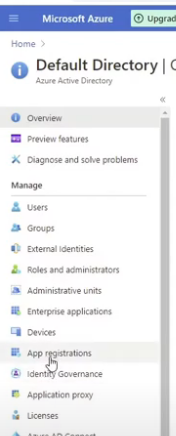
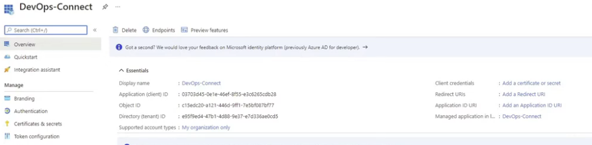
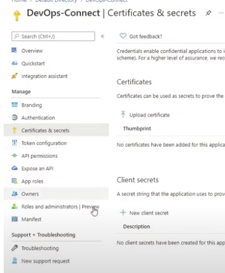

# Service Connection

https://www.youtube.com/watch?v=06wxMtSt_0g

Create a service connection
Complete the following steps to create a service connection for Azure Pipelines.

Sign in to your organization (https://dev.azure.com/{yourorganization}) and select your project.

Select Project settings > Service connections.

Select + New service connection, select the type of service connection that you need, and then select Next.

Choose an authentication method, and then select Next.

Enter the parameters for the service connection. The list of parameters differs for each type of service connection. For more information, see the list of service connection types and associated parameters.

Select Save to create the connection.

# create app registration in azure cloud

subscription Id is in azure subscription

authentication

in azure active directory click on app registration

the new registration

put name anc click in register

after crete app registration click on certificates an secrets

give permission to the app registration in azure

go to azure subscription an click in acces control IAM add role and select the application

service principal ID is application id

service principal

tenantid in tenant properties