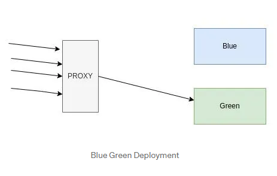
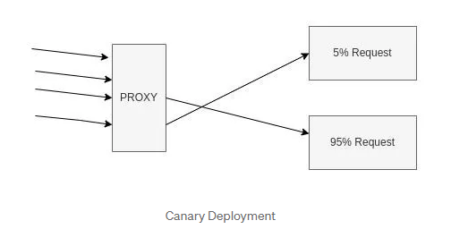
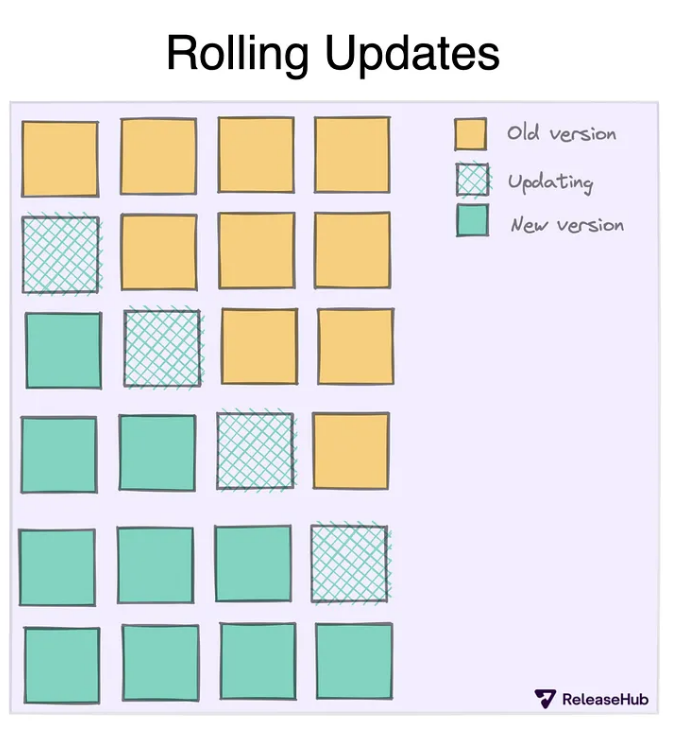
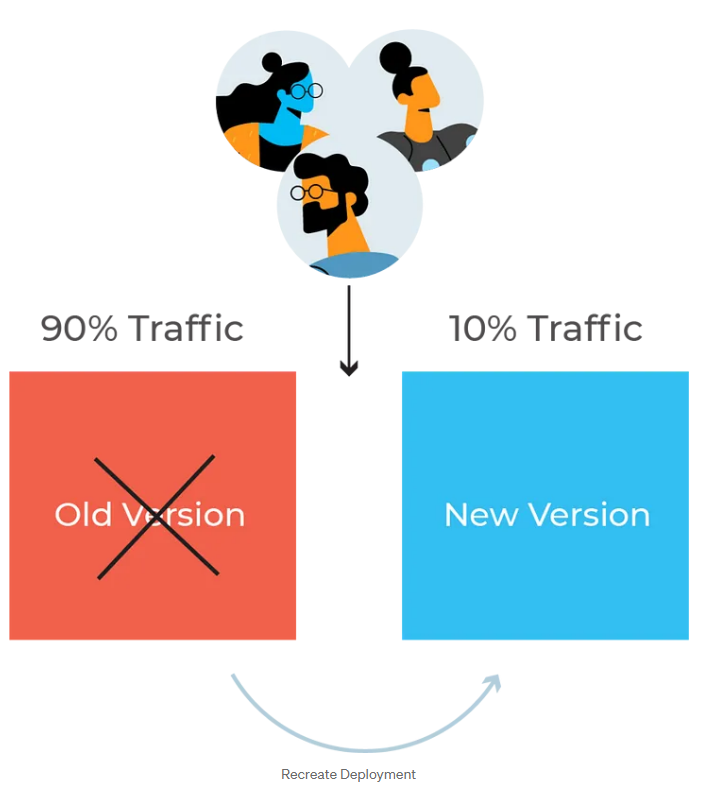
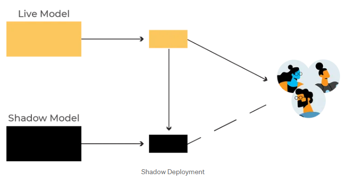
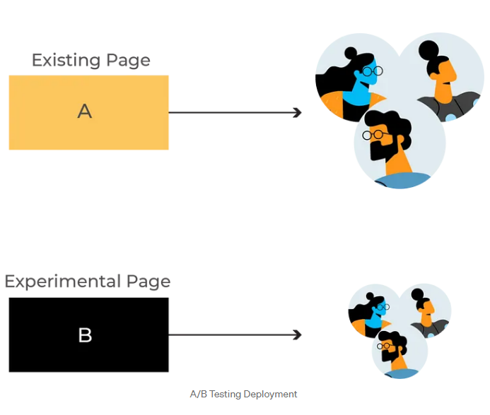

# Blue-Green Deployment

Blue Green is a deployment pattern that reduces downtime by running two identical production environments called blue and green. Only one environment lives at a time.

We need to ensure about the changes. Changes must be forward and backward-compatible. We need to set up a parallel infrastructure i.e. same number of servers and services used in the actual infrastructure. Post the setup deploy the new version to the new infrastructure, do the sanity, and validate everything. Then switch all the traffic to the green infrastructure. After everything is validated, remove or stop the old infrastructure (blue).

## Pros of Blue-Green Deployment
- Rollbacks are superfast and simple, rollbacks to the previous change are just route changes.
- Downtime during deployments is minimized, with no period where no request could be served.
- Deployments are quick, just a flip of a switch.
- A disaster recovery plan is super simple.
- Deployments can happen in regular hours.
- We can debug why a release failed.

## Challenges in Blue-Green Deployment

- During deployments, the infra cost would be double.
- Stateful applications would face problems. The information stored on instances like cached files, and artifacts will be lost when we switch from blue to green, everything would need to be rebuilt.
- Database migrations are tough.
- Frontend and Backend compatibility for APIs.
- Blue Green Setup takes effort and time.

# Canary Deployment
Canary deployment is a pattern that allows us to roll out code, features, and changes to an initial subset of users/servers. Basically, the change is deployed to a small subset of servers, then tested and rolled out to the rest of the servers. If everything is good then only roll it out to all the servers otherwise roll back it. So canary deployment act as an early warning indicator so that we could avoid a massive outage.

We create a small parallel Infra. We need to deploy the new version to one server and then monitor the vitals, CPU, RAM, error rates, and all. Test all the changes. If everything is working as expected then deploy this to the remaining servers as well.

In canary deployment, the selection criteria of new version traffic can be different i.e geographical-based, random users, beta users, internal employees, etc. Canary deployment is very helpful when you re-wrote your service.

## Pros of Canary Deployment
- It allows us to test the changes in prod with actual users.
- Rollbacks are much faster because we deployed on a few servers.
- If the newly deployed version of code has bugs it would affect a very limited set of requests.
- Zero downtime deployments.
- We could deploy even when we are unsure about the new release.

## Challenges in Canary Deployment

- Engineers will be habituated to test in prod directly which is not a recommendable practice.
- Architecting a canary deployment is complex.
- Parallel monitoring setup observability is super important in canary setup side-by-side comparison of vitals, CPU RAM, response times, error rates, exceptions, etc.

# Rolling Deployment

This strategy consists of rolling out a new version of the application one instance/container at a time. The new and old versions will co-exist without affecting functionality or user experience. The actual deployment happens over a period of time. Also, it’s easy to roll back any instance/component which is not working as per user/product expectations.

The first step is to stop serving traffic to one of the instances and either update the software or replace it with another instance running the desired version. Once the instance with the new version is created or updated, a simple test is run to verify that the instance is healthy and can start receiving traffic. When the test passes, the instance is added to the pool of instances serving traffic.

When the process for one instance is complete, the same procedure is executed for the next instance, until all of them are running the desired version. Since there are always a few instances running at any given time, current or new, the application is operational all the time and no downtime is experienced.

## Pros of Rolling Update Deployment

- It is easy to setup
- The versions are slowly released across nodes/instances
- There will be no downtime

## Cons of Rolling Update Deployment

- The Rollout/Rollback can take time
- There is no control over network traffic

# Recreate Deployment

In this deployment strategy, the dev team shuts down the old version of the application entirely, deploys the new version, and then reboots the whole system. This deployment technique creates a system downtime between shutting down the old software and booting the new one.

It is cheaper and mainly used when the software firm wants to change the application from scratch. It doesn’t require a load balancer as there’s no shifting of traffic from one version to another in the live production environment.

## Cons of Recreate Deployment

- This strategy dramatically affects the end users due to the downtime
- User must wait for the new version to be up and running

# Shadow Deployment

In this deployment strategy, developers deploy the new version alongside the old version. However, users can’t access the new version immediately. Just as the name suggests, the latest version hides in the shadows. Developers send a fork or copy of the requests the old version receives to the shadow version to test how the new version will handle the requests when live.

## Cons of Shadow Deployment
- This technique is very complex
- DevOps engineers should be careful so that the forked traffic does not create a duplicate live request since two versions of the same system are running

# A/B Testing Deployment

In A/B testing deployment, developers deploy the new version alongside the older version. However, the new version is only available to a subset of users. These users are selected based on specific conditions and parameters the engineers choose. These parameters can be the user’s location, type of device, UI language, and operating system.

## Pros of A/B Testing Deployment

- This method measures the effectiveness of the application’s new functionality.
- After gathering statistics from performance monitoring, developers roll out the version that yielded the best results to all users.

## Cons of A/B Testing Deployment

- This technique is very complex to set up
- It also requires a highly intelligent (and pricey) load balancer.

1. A/B Testing
Purpose: A/B testing is primarily used to compare two (or more) versions of an application or feature to determine which one performs better.
Approach: Users are split into groups and served different versions of a feature or application (e.g., Version A vs. Version B) simultaneously. Performance, user engagement, or any other defined metric is measured to see which version performs better.
When to Use: This method is mainly used in feature development, UI changes, or marketing tests to see how users respond to changes. It’s not a deployment strategy for rolling out code to all users but rather for testing specific features with a subset of users.
Example Use Case: If you’re redesigning a homepage, A/B testing allows you to send 50% of traffic to the original version (A) and 50% to the redesigned version (B) to see which has higher user engagement.
2. Canary Deployment
Purpose: Canary deployment is a strategy for releasing new code to a small subset of users first, allowing you to test the new version in production without exposing it to all users at once.
Approach: The new version (the “canary”) is released to a small portion of users. If the release performs well and no issues are detected, more traffic is gradually routed to the new version until it’s fully deployed to all users. This phased rollout minimizes risk and provides a rollback option if any issues arise.
When to Use: Canary deployments are ideal when releasing updates with moderate risk, where monitoring initial reactions or performance is critical. It allows you to detect any unforeseen issues early on without impacting the majority of users.
Example Use Case: If you’re deploying a new backend API version, you could route only 5% of traffic to the new version initially. After monitoring its performance, you gradually increase traffic to 100% if no issues are detected.
3. Blue/Green Deployment
Purpose: Blue/green deployment is a strategy to switch between two identical environments (blue and green) to release updates with minimal downtime and an easy rollback mechanism.
Approach: Two environments are maintained: the blue environment (current production) and the green environment (new version). The new code is deployed to the green environment while users continue using the blue environment. Once the green environment is verified to be stable, traffic is switched to it, making it the new production environment. If any issues arise, you can quickly switch back to the blue environment.
When to Use: Blue/green deployments are ideal for high-stakes releases where zero downtime is required, such as for critical systems. It’s also beneficial when you want an instant fallback to a stable version.
Example Use Case: If you’re deploying a major update to a banking application, blue/green deployment allows you to direct users to the green environment only when you’re confident that everything is working perfectly. If there’s a problem, you can quickly route traffic back to the blue environment with minimal disruption.
Comparison Summary
Strategy	Purpose	Rollout Method	Risk Level	Rollback Complexity
A/B Testing	Compare user response to versions	Split users between versions	Low	Simple (remove failing version)
Canary	Gradual rollout of a new version	Phased rollout to small user segments	Moderate	Moderate (gradual rollback)
Blue/Green	Ensure zero downtime with rollback	Full traffic switch between environments	Low	Easy (switch traffic back)
Each approach provides a different level of control and risk management, making them useful for various scenarios based on the impact, criticality, and size of the deployment.
