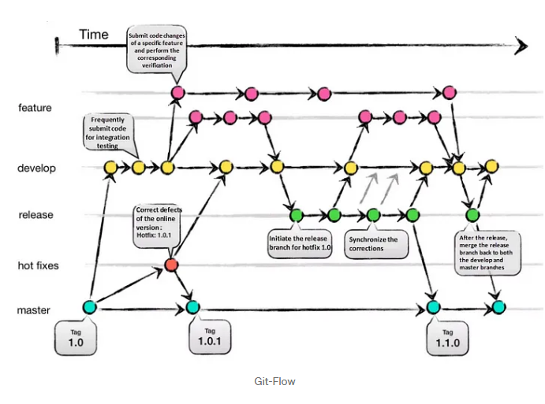

# AMAZON SQS

Amazon Simple Queue Service (SQS) is a fully-managed, reliable, and scalable messaging service that enables the decoupling of distributed components within cloud-based applications. As part of Amazon Web Services (AWS), SQS offers an accessible solution for managing message queues in a secure, fault-tolerant environment. This service allows you to send, store, and retrieve messages between software components without losing them or requiring other services to be available.

SQS simplifies the complexities associated with traditional messaging systems by providing a cost-effective, easy-to-use, and low-latency alternative. With its ability to handle fluctuating workloads, SQS ensures smooth communication between various application components, thereby improving overall system resilience and performance.

In this article, we present a curated collection of interview questions on Amazon Simple Queue Service (SQS). These questions cover essential topics such as architecture, features, use cases, and best practices, offering valuable insights into the workings of this powerful messaging service. Whether you are preparing for an AWS-related job interview or simply wish to expand your knowledge of SQS, this compilation will serve as an indispensable resource in enhancing your understanding of Amazon’s robust queuing solution.

1. How would you explain Amazon Simple Queue Service (SQS) to a non-technical person? Please provide a simple and concise explanation.

Amazon Simple Queue Service (SQS) is like a virtual post office. Imagine you have many people sending letters to each other, but instead of using physical mailboxes, they use SQS. It helps organize and deliver messages between different parts of a computer system without losing any information or causing delays. This makes it easier for the whole system to work together smoothly and efficiently.

2. What are the primary differences between Amazon SQS and other message queuing services? Can you discuss some key advantages and disadvantages of using SQS?

Amazon SQS differs from other message queuing services primarily in its tight integration with AWS ecosystem, scalability, and ease of use. Key advantages include: managed service reducing operational overhead, at-least-once delivery guarantee, and support for both standard and FIFO queues. Disadvantages encompass potential latency issues due to regional restrictions, lack of advanced features compared to some competitors (e.g., RabbitMQ), and costs associated with high throughput scenarios.

FIFO queues have essentially the same features as standard queues, but provide the added benefits of supporting ordering and exactly-once processing and ensure that the order in which messages are sent and received is strictly preserved.


3. What are the differences between the standard SQS and FIFO (First-In-First-Out) SQS queues? How do you decide which one to use for a particular project?

Standard SQS and FIFO SQS queues differ in message ordering, delivery, and throughput. Standard SQS offers at-least-once delivery with no specific order guarantee, while FIFO ensures exactly-once processing and maintains the order of messages. Standard SQS has higher throughput, allowing unlimited transactions per second (TPS), whereas FIFO is limited to 300 TPS.



To decide which queue type to use, consider your project’s requirements. If maintaining message order and avoiding duplicates are critical, choose FIFO. However, if high throughput and scalability are more important than strict ordering, opt for Standard SQS.

4. What are the primary use cases for Amazon SQS? Can you provide an example of a real-world application that would benefit from using SQS, and explain why it’s a good fit?

Amazon SQS primarily serves as a fully managed message queuing service, enabling decoupling and communication between distributed components in a cloud application. Key use cases include buffering requests, distributing tasks, and handling asynchronous workflows.

A real-world example is an e-commerce platform experiencing high order volumes during peak seasons. The platform’s backend services may struggle to process orders simultaneously, causing delays or failures. Implementing SQS allows the system to queue incoming orders, ensuring they are processed sequentially without overloading the backend. This improves reliability, scalability, and fault tolerance, making SQS a good fit for such applications.

5. How can you configure the visibility timeout in SQS? What factors should be considered when setting this value?

Visibility timeout in SQS can be configured during queue creation or by updating an existing queue using the AWS Management Console, SDKs, CLI, or APIs. You can also set a per-message visibility timeout when consuming messages.

  Factors to consider when setting this value include:
  a. Message processing time: Ensure the timeout is long enough for your application to process and delete the message.

  b. Retention period: Avoid setting timeouts exceeding the retention period, as messages may expire before being processed.

  c. Resource utilization: Longer timeouts reduce the chance of duplicate processing but may increase resource usage.

  d. Error handling: Shorter timeouts allow faster retries if message processing fails, but may lead to unnecessary duplicates.

6. What are the limitations of Amazon SQS regarding message size and retention periods? How can these limitations be managed in a project?

Amazon SQS has a message size limit of 256 KB and a retention period ranging from 1 minute to 14 days. To manage these limitations, consider the following approaches:

a. For larger messages, use Amazon S3 to store data and include an S3 object reference in the SQS message.

b. Compress messages before sending them to the queue to reduce their size.

c. Use multiple queues with different retention periods based on priority or time sensitivity.

d. Implement dead-letter queues for failed processing attempts, allowing further investigation and manual intervention.

7. What are the Amazon SQS best practices for designing a scalable, reliable, and cost-effective messaging system?

To design a scalable, reliable, and cost-effective messaging system using Amazon SQS, follow these best practices:

a. Choose the right type of queue: Use standard queues for high throughput and at-least-once delivery, or FIFO queues for strict ordering and exactly-once processing.

b. Optimize polling: Implement long-polling to reduce empty responses and costs by setting ReceiveMessageWaitTimeSeconds parameter.

c. Batch operations: Utilize SendMessageBatch and DeleteMessageBatch APIs to improve performance and reduce costs.

d. Handle errors gracefully: Implement retries with exponential backoff and jitter for transient failures, and use dead-letter queues (DLQ) for persistent issues.

e. Monitor and scale: Leverage CloudWatch metrics to monitor your queues’ performance and set up alarms for scaling resources based on demand.

f. Secure access: Apply IAM policies to control access to your queues and encrypt messages using server-side encryption (SSE) with AWS KMS.


8. How can you ensure message ordering and exactly-once processing in an SQS-based system?

To ensure message ordering and exactly-once processing in an SQS-based system, use FIFO (First-In-First-Out) queues. FIFO queues maintain the order of messages and prevent duplicates by assigning a unique MessageDeduplicationId. Enable content-based deduplication or provide a custom deduplication ID for each message. Implement idempotent message processing in your consumer application to handle cases where a message is delivered more than once due to visibility timeout expiration.

9. How can you use AWS Lambda with Amazon SQS? What benefits does this integration provide?

AWS Lambda can be integrated with Amazon SQS by setting up an event source mapping, which triggers a Lambda function when new messages arrive in the queue. This enables serverless processing of queued messages without needing to manage infrastructure.

Benefits of this integration include:
a. Scalability: Lambda automatically scales based on incoming message volume.

b. Cost-effectiveness: Pay only for compute time used during message processing.

c. Flexibility: Process messages using various programming languages supported by Lambda.

d. Resilience: Retries and dead-letter queues handle failed message processing.

e. Simplified architecture: Eliminates polling and managing worker instances.


10. How would you monitor an SQS queue to ensure optimal performance, high availability, and cost-efficiency? Which AWS services or third-party tools can be used for this purpose?

To monitor an SQS queue for optimal performance, high availability, and cost-efficiency, utilize AWS services like Amazon CloudWatch and AWS X-Ray. CloudWatch provides metrics such as NumberOfMessagesSent, NumberOfMessagesReceived, ApproximateNumberOfMessagesVisible, and ApproximateAgeOfOldestMessage to track queue performance. Set up alarms based on these metrics to receive notifications when thresholds are breached.

AWS X-Ray helps in tracing requests and identifying bottlenecks or errors within the system. Additionally, consider using third-party tools like Datadog or New Relic for advanced monitoring capabilities.

Optimize costs by adjusting visibility timeout settings, message retention periods, and utilizing long polling. Implement dead-letter queues (DLQ) to handle failed messages efficiently and avoid unnecessary processing.

11. How do you handle dead-letter queues in Amazon SQS? Explain a scenario where using a dead-letter queue is beneficial.

Dead-letter queues (DLQ) in Amazon SQS are used to handle messages that cannot be processed by the consumer. To implement a DLQ, follow these steps:

a. Create a new queue as the dead-letter queue.

b. Configure the source queue’s Redrive Policy with the ARN of the DLQ and set maxReceiveCount.

c. Process messages from the source queue; if processing fails, the message is returned to the queue and its receive count increases.

d. When the message’s receive count exceeds maxReceiveCount, it’s moved to the DLQ.


A scenario where using a DLQ is beneficial is when an application processes messages containing data for multiple services. If one service experiences temporary issues causing message processing failures, the affected messages can accumulate in the DLQ. Once the issue is resolved, these messages can be reprocessed from the DLQ without impacting other services or losing critical data.

12. Can you describe the process of sending and receiving messages in Amazon SQS using AWS SDK? What are the different methods and their purposes?

To send and receive messages in Amazon SQS using AWS SDK, follow these steps:

a. Install and configure the AWS SDK for your preferred language.

2. Create an SQS client instance using the SDK.

3. Use the createQueue method to create a new queue or obtain the URL of an existing one.

4. To send a message, use the sendMessage method with the queue URL and message body as parameters.

5. For receiving messages, call the receiveMessage method with the queue URL. This returns available messages without deleting them from the queue.

6. Process the received messages and delete them from the queue using the deleteMessage method with the queue URL and receipt handle.

Methods:
– createQueue: Creates/gets queue URL.
– sendMessage: Sends a message to the specified queue.
– receiveMessage: Retrieves messages from the queue.
– deleteMessage: Deletes a processed message from the queue.


13. How can you secure access to your Amazon SQS queues? Can you discuss different IAM (Identity and Access Management) policies that can be applied to SQS?

To secure access to Amazon SQS queues, use AWS Identity and Access Management (IAM) policies. There are three types of IAM policies for SQS:

1. Identity-based policies: Attach these directly to IAM users, groups, or roles. They grant permissions to perform specific actions on specified resources.

Example:
```
{
  "Version": "2012-10-17",
  "Statement": [
    {
      "Effect": "Allow",
      "Action": "sqs:SendMessage",
      "Resource": "arn:aws:sqs:us-east-1:123456789012:MyQueue"
    }
  ]
}
```
2. Resource-based policies: Attach these to the SQS queue itself. They define which principals can perform specific actions on that resource.

Example:
```
{
  "Version": "2012-10-17",
  "Id": "example-ID",
  "Statement": [
    {
      "Sid": "example-statement-ID",
      "Effect": "Allow",
      "Principal": {
        "AWS": "arn:aws:iam::111122223333:user/Alice"
      },
      "Action": "sqs:ReceiveMessage",
      "Resource": "arn:aws:sqs:us-east-1:123456789012:MyQueue"
    }
  ]
}
```
3. Permission boundaries: These limit the maximum permissions a user can have. Use them in conjunction with identity-based policies to restrict access further.

Remember to follow the principle of least privilege when granting permissions, only allowing necessary actions on specific resources.

14. What is the role of message attributes in Amazon SQS, and how can they be utilized in a messaging system?

Message attributes in Amazon SQS provide metadata for messages, allowing additional information to be attached without modifying the message body. They can be utilized in a messaging system to enable filtering, routing, and prioritization of messages based on their attributes.

For example, an application processing orders could use message attributes to differentiate between high-priority and low-priority orders. By assigning a “priority” attribute to each message, consumers can selectively process high-priority orders first, improving overall efficiency.

Additionally, message attributes can be used to route messages to specific consumers or groups of consumers. In a distributed system with multiple services, this enables targeted processing of messages by relevant components, reducing unnecessary overhead.

To add message attributes, include them as key-value pairs when sending a message using the SendMessage API action. Consumers can then access these attributes via the ReceiveMessage API action.

15. How can you set up event-driven processing in Amazon SQS? Provide an example of a use case where this approach would be beneficial.

To set up event-driven processing in Amazon SQS, use AWS Lambda to create a Lambda function that processes messages from the queue. Configure an event source mapping between the Lambda function and the SQS queue, enabling automatic invocation of the function when new messages arrive.

A beneficial use case is an e-commerce order processing system. When customers place orders, they’re added to an SQS queue. The Lambda function processes each order by updating inventory, charging payment, and notifying shipping services. This approach ensures scalability, fault tolerance, and decoupling of components.

Example:
```
import boto3
def lambda_handler(event, context):
    for record in event['Records']:
        process_order(record['body'])
def process_order(order_data):
    # Update inventory, charge payment, notify shipping service
```

16. How can you manage cost and control the number of messages being processed with Amazon SQS?

To manage cost and control the number of messages processed with Amazon SQS, implement batching, set visibility timeout, use long polling, and monitor metrics. Batching groups multiple messages in a single request, reducing API calls and costs. Adjusting visibility timeout ensures that messages are not prematurely returned to the queue, preventing duplicate processing. Long polling reduces empty responses and lowers costs by waiting for messages before returning. Monitoring CloudWatch metrics helps identify bottlenecks and optimize performance.

17. What is the significance of the delay queue in Amazon SQS? When should it be used?

The delay queue in Amazon SQS is significant for controlling the visibility of messages, allowing a specified time to pass before they become available for processing. This feature helps manage scenarios where immediate message consumption isn’t desired or necessary.

It should be used when:
1. Ensuring ordered processing: Delay queues can help maintain order by preventing premature message consumption.

2. Handling transient errors: If consumers experience temporary issues, delaying messages allows time for resolution without losing data.

3. Scheduled tasks: Delay queues enable scheduling future tasks by setting an appropriate delay period.

4. Throttling requests: To avoid overwhelming downstream services, delay queues can limit the rate at which messages are processed.

18. How does Amazon SQS handle throttling and scaling under high load? What strategies can be applied to reduce throttling and improve system performance?

Amazon SQS handles throttling and scaling under high load through its distributed architecture, which automatically scales with the number of messages and traffic. However, it enforces limits on API actions to prevent abuse and ensure fair usage.

To reduce throttling and improve system performance, consider these strategies:

1. Use long polling: Long polling reduces the number of empty responses by waiting for a message to arrive before returning a response, thus reducing request rates.
2. Implement exponential backoff: In case of client-side throttling, use exponential backoff with jitter to retry requests at increasing intervals, minimizing contention.

3. Batch operations: Group multiple messages in a single request using SendMessageBatch and DeleteMessageBatch APIs to optimize throughput.

4. Utilize multiple queues: Distribute workload across multiple queues to increase overall throughput and avoid hitting per-queue limits.

5. Adjust visibility timeout: Set an appropriate visibility timeout based on message processing time to prevent premature reprocessing and reduce duplicate work.

6. Monitor CloudWatch metrics: Keep track of key metrics like NumberOfMessagesSent and ThrottledRequests to identify bottlenecks and adjust your strategy accordingly.

19. What are the different error types that can be encountered when working with Amazon SQS? How can these errors be properly managed in a system?

Amazon SQS errors can be categorized into client and server errors. Client errors include InvalidParameterValue, AccessDenied, NonExistentQueue, and MessageTooLarge. Server errors consist of ServiceUnavailable and InternalError.

To manage these errors:

1. Validate input parameters to avoid InvalidParameterValue.

2. Ensure proper permissions for AccessDenied issues.

3. Check queue existence before performing operations to prevent NonExistentQueue errors.

4. Keep message size within limits (256 KB) to avoid MessageTooLarge errors.

5. Implement retries with exponential backoff for server errors like ServiceUnavailable and InternalError.

6. Monitor application logs and set up alarms for error occurrences to proactively address issues.

20. What is the role of Amazon SNS (Simple Notification Service) in conjunction with Amazon SQS, and how can they be integrated effectively to build a robust messaging system?

Amazon SNS and SQS work together to create a robust messaging system by combining the publish-subscribe pattern of SNS with the reliable message queuing capabilities of SQS. SNS handles topic creation, subscription management, and message distribution, while SQS ensures reliable delivery and processing of messages.

To integrate effectively:
1. Create an SNS topic for publishing messages.

2. Set up SQS queues as subscribers to the SNS topic.

3. Configure appropriate permissions for SNS to send messages to SQS.

4. Publish messages to the SNS topic; they will be automatically delivered to all subscribed SQS queues.

5. Implement consumers to process messages from SQS queues, ensuring at-least-once processing and handling duplicates if necessary.

6. Utilize visibility timeout and dead-letter queues in SQS to handle failed message processing.

This integration enables decoupling of producers and consumers, allowing for scalability, fault tolerance, and flexibility in the messaging system.

21. Can you describe the process of message deduplication in Amazon SQS? How can this feature enhance the reliability of a messaging system?

Message deduplication in Amazon SQS involves eliminating duplicate messages from being processed. It’s achieved through two methods: content-based and ID-based deduplication.

Content-based deduplication uses a SHA-256 hash of the message body to identify duplicates. If the hashes match, the message is considered a duplicate and discarded. This method requires enabling on the queue level.

ID-based deduplication relies on assigning unique MessageDeduplicationIds to each message. The system checks if an identical ID was processed within the 5-minute deduplication interval. If so, it discards the duplicate message.

Deduplication enhances reliability by ensuring that messages are processed only once, preventing redundant processing and potential data corruption or inconsistency. Additionally, it reduces resource consumption and costs associated with unnecessary processing.

22. How can you set up access control based on tags for your Amazon SQS queues?

To set up access control based on tags for Amazon SQS queues, follow these steps:

1. Create an IAM policy that allows specific actions on resources with matching tags.
2. Define the required tags in the policy using “aws:ResourceTag/key” condition keys.
3. Attach the IAM policy to the appropriate users or groups.

Example IAM policy:
```
{
  "Version": "2012-10-17",
  "Statement": [
    {
      "Effect": "Allow",
      "Action": "sqs:*",
      "Resource": "*",
      "Condition": {
        "StringEquals": {
          "aws:ResourceTag/Department": "Finance"
        }
      }
    }
  ]
}
```
This policy grants permission to perform all SQS actions on queues tagged with “Department=Finance”. Ensure you replace “Finance” and “Department” with your desired tag values and key.

23. What are the requirements for using long polling in Amazon SQS, and how does it differ from the short polling method?

Long polling in Amazon SQS requires setting a wait time (1-20 seconds) when receiving messages, enabling the ReceiveMessageWaitTimeSeconds attribute. It reduces empty responses and lowers costs by waiting for messages to arrive before returning.

Short polling returns immediately, even with empty responses, increasing request frequency and cost. Long polling is more efficient for low-volume queues.

24. How can Amazon SQS be used in a microservices-driven architecture? Discuss its role in designing a resilient and decoupled system.

Amazon SQS can be used in a microservices-driven architecture to facilitate communication between services, ensuring resilience and decoupling. By utilizing message queues, SQS allows asynchronous processing of tasks, enabling services to operate independently without waiting for responses from other components.

SQS acts as a buffer between producer and consumer services, absorbing fluctuations in workload and preventing system overloads. This ensures high availability and fault tolerance, as the failure of one service does not directly impact others.

Additionally, SQS supports multiple consumers for each queue, allowing parallel processing and load balancing across instances. This enhances scalability and performance, as new instances can be added or removed based on demand.

Dead Letter Queues (DLQs) further improve resiliency by handling failed messages, reducing the risk of data loss and providing an opportunity for error analysis and resolution.

25. Can you develop Amazon SQS message consumers using languages that are not officially supported by AWS SDKs? If so, how would you approach connecting to and working with SQS using those languages?

Yes, you can develop Amazon SQS message consumers using languages not officially supported by AWS SDKs. To achieve this, use the following approach:

1. Utilize the RESTful API provided by Amazon SQS to interact with the service.
2. Implement authentication and request signing according to AWS Signature Version 4.
3. Create HTTP requests for desired actions (e.g., SendMessage, ReceiveMessage) and parse responses in your chosen language.
4. Handle errors and retries as per AWS best practices.

Here’s a Python example without using an official SDK:
```
import requests
from aws_requests_auth import AWSRequestsAuth
auth = AWSRequestsAuth(aws_access_key='YOUR_ACCESS_KEY',
                       aws_secret_access_key='YOUR_SECRET_KEY',
                       aws_host='sqs.YOUR_REGION.amazonaws.com',
                       aws_region='YOUR_REGION',
                       aws_service='sqs')
queue_url = 'https://sqs.YOUR_REGION.amazonaws.com/YOUR_ACCOUNT_ID/YOUR_QUEUE_NAME'
response = requests.post(queue_url,
                         auth=auth,
                         data={'Action': 'SendMessage', 'MessageBody': 'Hello World'})
print(response.text)
```