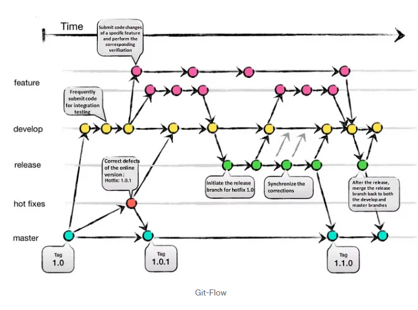
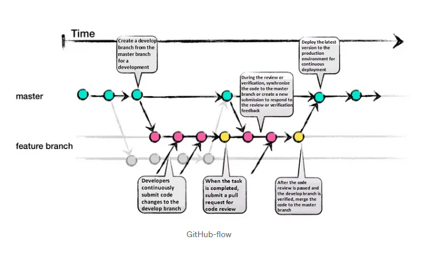

# branch stategy 

## GIT FLOW
In the Git flow development model, you have one main development branch with strict access to it. It’s often called the develop branch.

Developers create feature branches from this main branch and work on them. Once they are done, they create pull requests. In pull requests, other developers comment on changes and may have discussions, often quite lengthy ones

**Overview:** Utilizes two main branches: master for production-ready code and develop for ongoing development. Feature branches, release branches, and hotfix branches are used for specific tasks.

**Advantages:**

- Structured Release Management: Provides a structured approach to release management, with dedicated branches for features, releases, and hotfixes.
- Stability: Keeps the master branch stable, as it only contains production-ready code, while ongoing development occurs in the develop branch.
- Parallel Development: Allows for parallel development of features and hotfixes, ensuring that ongoing development is not blocked by release activities.

**Disadvantages:**
- Complexity: The Gitflow model can be relatively complex, especially for smaller teams or projects, requiring discipline and adherence to the workflow.

- Overhead: Managing multiple long-lived branches (e.g., feature, release, hotfix) can introduce overhead and administrative burden, potentially slowing down development.

## Trunk-based Development Workflow

**Overview:** All development occurs directly on the main branch (master or main). Developers use feature toggles, feature flags, or experimental branches to isolate incomplete or experimental features.

**Advantages:** Promotes continuous integration and rapid feedback cycles, reduces merge conflicts, and encourages small, frequent commits.

- Simplicity: Trunk-based development simplifies the branching model by having all development occur directly on the main branch (often master or main). This simplicity can reduce overhead and streamline the development process, especially for small teams or projects.

- Continuous Integration: Trunk-based development promotes continuous integration practices, where developers frequently merge their changes into the main branch. This ensures that code changes are regularly integrated, tested, and validated, leading to fewer integration issues and faster feedback cycles.

- Reduced Merge Conflicts: With developers working directly on the main branch, there are fewer long-lived feature branches, reducing the likelihood of merge conflicts. Developers are encouraged to make small, incremental changes, minimizing the impact of conflicts and making them easier to resolve.

- Faster Feedback: Trunk-based development encourages rapid feedback cycles, as changes are integrated into the main branch and tested promptly. This enables developers to identify issues early and address them quickly, improving overall code quality and stability.

- Encourages Collaboration: Since all development occurs on the main branch, developers have visibility into each other's changes and can collaborate more effectively. Code reviews, discussions, and feedback are integral parts of the development process, fostering collaboration and knowledge sharing within the team.

**Disadvantages:**

- Risk of Instability: Working directly on the main branch can introduce instability, especially if developers introduce bugs or incomplete features. Since changes are immediately reflected in the main branch, there is a risk of disrupting other developers' work or impacting the stability of the codebase.

- Limited Experimentation: Trunk-based development may discourage experimentation or exploration of new ideas, as changes are immediately integrated into the main branch. Developers may feel pressured to prioritize stability over innovation, potentially stifling creativity and innovation.

- Dependency Management: Trunk-based development relies heavily on feature toggles or experimental branches to isolate incomplete or experimental features. Managing these toggles or branches effectively requires careful coordination and communication among team members, adding complexity to the development process.

- High Level of Discipline: Trunk-based development requires a high level of discipline and adherence to best practices such as continuous integration, automated testing, and small, incremental changes. Without proper discipline, the main branch can quickly become unstable, leading to integration issues and delays.

**Example:** Developers work directly on the main branch, using feature toggles or experimental branches to isolate incomplete features until they are ready for release.

## Feature Branch:

**Overview:** Each new feature or task is developed in its own branch, typically branched off the main development branch (e.g., master or develop).

**Advantages:**

- Isolation: Each feature or task is developed in its own branch, allowing for isolation of changes and preventing interference with other features.
- Collaboration: Facilitates collaborative development by enabling team members to work on different features simultaneously without conflicts.
- Code Review: Pull requests can be used for code review, providing an opportunity for feedback and ensuring quality before merging.

**Disadvantages:**

- Branch Proliferation: If not managed properly, the repository can become cluttered with numerous feature branches, making it challenging to track and manage.
- Integration Complexity: Merging feature branches back into the main branch (e.g., master or develop) can sometimes result in merge conflicts or integration issues.

Example: GitHub Flow, where feature branches are created for each new feature, and pull requests are used for code review and merging.

_________________________

https://medium.com/@sreekanth.thummala/choosing-the-right-git-branching-strategy-a-comparative-analysis-f5e635443423

# 1. Git-Flow:
Git-Flow is a comprehensive branching strategy that aims to cover various scenarios. It defines specific branch responsibilities, such as main/master for production, develop for active development, feature for new features, release as a gatekeeper to production, and hotfix for addressing urgent issues. The life-cycle involves branching off from develop, integrating features, creating release branches for testing, merging into main/master, and tagging versions.

## Pros:
- Well-suited for large teams and aligning work across multiple teams.
- Effective handling of multiple product versions.
- Clear responsibilities for each branch.
- Allows for easy navigation of production versions through tags.

## Cons:
- Complexity due to numerous branches, potentially leading to merge conflicts.
- Development and release frequency may be slower due to multi-step process.
- Requires team consensus and commitment to adhere to the strategy.

# 2. GitHub-Flow:
GitHub-Flow simplifies Git-Flow by eliminating release branches. It revolves around one active development branch (often main or master) that is directly deployed to production. Features and bug fixes are implemented using long-living feature branches. Feedback loops and asynchronous collaboration, common in open-source projects, are encouraged.

Pros:
- Faster feedback cycles and shorter production cycles.
- Ideal for asynchronous work in smaller teams.
- Agile and easier to comprehend compared to Git-Flow.

Cons:
- Merging a feature branch implies it is production-ready, potentially introducing bugs without proper testing and a robust CI/CD process.
- Long-living branches can complicate the process.
- Challenging to scale for larger teams due to increased merge conflicts.
- Supporting multiple release versions concurrently is difficult.

# 3. GitLab-Flow:
GitLab-Flow strikes a balance between Git-Flow and GitHub-Flow. It adopts GitHub-Flow’s simplicity while introducing additional branches representing staging environments before production. The main branch still represents the production environment.

Pros:
- Can handle multiple release versions or stages effectively.
- Simpler than Git-Flow.
- Focuses on quality with a lean approach.

Cons:
- Complexity increases when maintaining multiple versions.
- More intricate compared to GitHub-Flow.

# 4. Trunk Based Development:
Trunk Based Development promotes a single shared branch called “trunk” and eliminates long-living branches. There are two variations based on team size: smaller teams commit directly to the trunk, while larger teams create short-lived feature branches. Frequent integration of smaller feature slices is encouraged to ensure regular merging.

Pros:
- Encourages DevOps and unit testing best practices.
- Enhances collaboration and reduces merge conflicts.
- Allows for quick releases.

Cons:
- Requires an experienced team that can slice features appropriately for regular integration.
- Relies on strong CI/CD practices to maintain stability.

Conclusion:
Each branching strategy — Git-Flow, GitHub-Flow, GitLab-Flow, and Trunk Based Development — offers its own advantages and considerations. Choosing the right strategy depends on your specific project requirements. Git-Flow suits large teams and complex projects, while GitHub-Flow excels in open-source and small team environments. GitLab-Flow provides a compromise between Git-Flow and GitHub-Flow, while Trunk Based Development is ideal for experienced teams focused on collaboration and quick releases. Select the strategy that aligns with your team’s capabilities, project complexity, and desired workflow to maximize efficiency and success.

