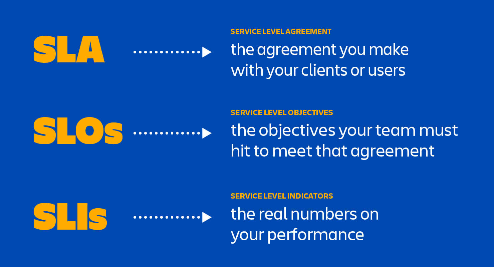

# Devops

DevOps is a work culture primarily centered around collaboration, communication, and integration among the development teams

What are the key benefits of using DevOps?

The key benefits of using DevOps include faster time-to-market, increased collaboration between teams, improved software quality and reliability, and efficient use of resources.

# What are the differences between Continuous Integration, Continuous Delivery, and Continuous Deployment?

Continuous Integration (CI) is a DevOps software development practice that permits developers to combine/merge the changes to their code in the central repository to run automated builds and tests

Continuous Delivery (CD) refers to the building, testing, and delivering improvements to the software code. The most critical part of the CD is that the code is always in a deployable stat

Continuous Deployment (CD) is the ultimate stage in the DevOps pipeline. It  refers to automatic release of any developer changes from the repository to the production stage.

Idempotency is the property that ensures that the results from an operation are the same, even if the same function is applied multiple times beyond the initial application. 

Agile prescribes working incrementally, collaboratively and flexibly; it does not prescribe a specific framework or methodology. A few of the most popular frameworks that Agile teams adopt are Scrum, Kanban and Extreme Programming. Teams may choose one of these frameworks or pieces of each.
## ADVANTAGES CLOUD COMPUTING

- trade capital expenses for variable expenses
- benefits from massive economic of scale
- stop guessing capacity
- increase speed and agility
- go global in minutes

## RTO and RPO
 Recovery time objective (RTO): The maximum acceptable delay between the interruption of service and restoration of service. This determines an acceptable length of time for service downtime.
Recovery point objective (RPO): The maximum acceptable amount of time since the last data recovery point. This determines what is considered an acceptable loss of data.

# Containerization
Containerization is a software deployment process that bundles an application’s code with all the files and libraries it needs to run on any infrastructure.

A container is a standard unit of software bundled with dependencies so that applications can be deployed fast and reliably b/w different computing platforms.

## Containerization compared to virtual machines
Containerization is a similar but improved concept of a VM. Instead of copying the hardware layer, containerization removes the operating system layer from the self-contained environment. This allows the application to run independently from the host operating system. Containerization prevents resource waste because applications are provided with the exact resources they need. 

# like about devops

one of the thing I enjoy most about the role is the ability to bridge the gap between development and operations, fostering collaboration that lead to more efficient and reliable software delivery.
I love the problem-solving aspects, automate processes, optimize systems and continously improve the development lifecycle
the cahellege of integrating various technologies and ensuring stability while embracing rapid change is both exciting and rewarding
See the tangible impact of the optimizations on teams and end users

# CI/CD

- CI(Continous Integration): involves automating the process of integrating code changes into a shared repository, ensuring that the applications is tested, and any issue are caught early before delivering to the customer

- Continous Delivery focuses on automating the deployment of applications to platform like ECR or ACR ensurign smooth and reliable releases

# CI

- VCS control de versiones
- pruebas autoamtizadas
    - unitarias
    - integracion
    - linting y analiss estatico
- construccion automatizada
- entornos aisaldos

# CD

- pruebas funcionales
- iplementacion entornos escalonados
- estrategias de despliegue
- IAC
- Notificaciones y reportes
- rollback automatizado

- Observabilidad
