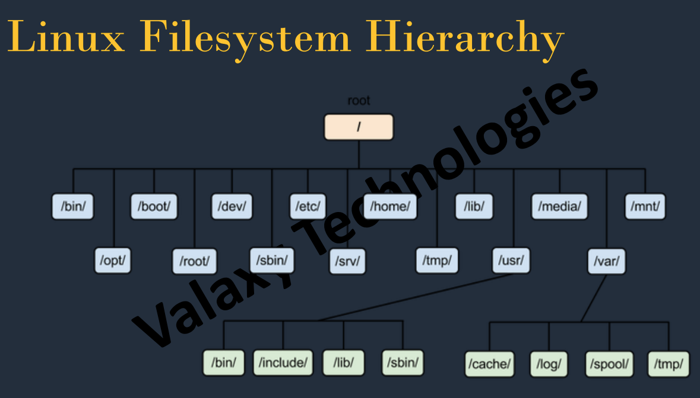

sudo su - convertir en root

Copiar archivo a otra carpeta
Para copiar un archivo de una carpeta a otra es muy fácil, la instrucción a ejecutar es la siguiente.

cp fichero_a_copiar carpeta_destino


Copiar carpeta o directorio
Si queremos copiar una carpeta o directorio de forma recursiva en Linux usaremos el parámetro -r la instrucción es la siguiente. La -r indica que copie el directorio recursivamente, en este caso también se puede usar -R.

cp -r carpeta_a_copiar destino

Ejemplos del comando cp
En los ejemplos suponemos que estamos situados en la ruta del archivo o directorio que vamos a copiar, si no tendríamos que poner su ruta.

 

    Si queremos copiar el fichero test.txt a la carpeta /home/solvetic, usamos lo siguiente:

cp test.txt /home/solvetic

    Si queremos copiar una carpeta llamada webSolvetic al directorio var:

sudo cp -r web /var

Observa que el directorio var en Linux no tiene permisos para el usuario, por lo tanto, tenemos que ejecutarlo como root, por eso se ha puesto sudo, y la -r porque web es una carpeta.


Copiar un archivo a varias carpetas a la vez Linux

Es posible que queramos copiar un archivo a varias carpetas ala vez usando comandos y por eso los siguientes pasos te mostrarán a cómo copiar un archivo a varias carpetas a la vez Linux. Para ello usaremos el comando echo y xargs.

 

Paso 1

Para utilizar el comando echo nos basaremos en la siguiente sintaxis:

echo destino1 destino2 etc | xargs -n 1 cp archivo a copiar

Paso 2

Así podemos desglosar esta estructura en:

 

echo
Nos permite mostrar en pantalla texto y poner la barra delante de xargs permite tomar valores de este comando.

 

xargs
Permite copiar archivos con comando cp en función de los destinos.

 

-n 1
Indica que solo se agrege uno de los argumentos a cp.

 

Tras ver la sintaxis en nuestro ejemplo encontraremos lo siguiente:

echo  /home/Solvetic/Solvetic /home/Solvetic/Pruebas /home/Solvetic/Escritorio/Test | xargs –n 1 cp /home/Solvetic/Escritorio/Solvetic.png


Copiar archivos en Linux a escritorio remoto

Para poder copiar archivos en directorio remoto usaremos el comando rsync.

 

Paso 1

Para copiar archivos a un equipo remoto usaremos la siguiente sintaxis. Cuando ingresemos la IP en remoto tendremos que poner la contraseña root de este equipo.

rsync -avz archivo/ root@192.168.0.xxx:/destino/


También podemos hacer lo contrario, copiar un directorio remoto a nuestro servidor local. Para ello usaremos la siguiente sintaxis:

rsync -azvh root@192.168.0.xxx:/destino/ directorio/

Mover archivos en Linux con mv

Para mover un archivo o directorio usaremos el comando mv, la instrucción es la siguiente. A diferencia del copiar no necesitamos ningún parámetro extra para mover una carpeta.

mv archivo_o_carpeta destino

5. Borrar archivos Linux con rm

Para poder eliminar archivos desde la terminal usaremos el comando rm. Aunque por defecto no borra directorios, combinándolo con -r podremos eliminar los contenidos. Su sintaxis general es:

rm [-opciones] [-d|s] archivo


Eliminar varios archivos a la vez
Disponemos de diferentes opciones adicionales para poder añadir al comando rm. Podemos borrar diferentes archivos a la vez con este comando también:

Rm archivo1.txt archivo 2.txt
rm archivo1_directorio archivo2_directorio

--Renombrar Archivos
mv nombrearchvioviejo nombre archivo nuevo

--Crear archivos
touch nombre dle archivo

--Permisos Archivos


    The first three characters show the permissions for the user who owns the file (user permissions).
    The middle three characters show the permissions for members of the file’s group (group permissions).
    The last three characters show the permissions for anyone not in the first two categories (other permissions).

    r- read x- execute w- write


    u: User, meaning the owner of the file.
    g: Group, meaning members of the group the file belongs to.
    o: Others, meaning people not governed by the u and g permissions.
    a: All, meaning all of the above.


    –: Minus sign. Removes the permission.
    +: Plus sign. Grants the permission. The permission is added to the existing permissions. If you want to have this permission and only this permission set, use the = option, described below.
    =: Equals sign. Set a permission and remove others.

EXAMPLE chmod u=rw,og=r new_file.txt  give user read and write and other and group only read to de file new_file.txt

If we had wanted to include files in subdirectories, we could have used the -R (recursive) option.

chmod -R o-r *.page

CHMOD in numericla form

    0: (000) No permission.
    1: (001) Execute permission.
    2: (010) Write permission.
    3: (011) Write and execute permissions.
    4: (100) Read permission.
    5: (101) Read and execute permissions.
    6: (110) Read and write permissions.
    7: (111) Read, write, and execute permissions.

chmod 664 *.page give read and write to user an group and only read to others

https://www.howtogeek.com/437958/how-to-use-the-chmod-command-on-linux/


Listar y observar permisos de todos los archivos

ls -al

listas todos los objetos incluso ocultos

ls -a

concatenar

cat file1.txt file2.txt muestra en pantalal la union de los dos archivos

cat file1.txt file2.txt > filecompleto.txt lleva la concatenacion de los archivos 1 y 2 a un nuevo archivo llamado filecompleto.txt

cat file5.txt >> file4.txt para realizar un append (agregar en vez de reemplazar) de la data copiando las nuevas lineas de file5 al final de file4


SUDO super usuario DO

SUDO BASH

SU usuario cambiar usuario


# DIRECTORY LINUX

/ Root

~/BIN directorio estatico donde se almacenan los binarios
~/SBIN binarios relativos a tareas propias del SO y solo son gestionadas por el usuario root
~/BOOT directorio estatico archvios y ejecutables para el arranque del sistema
~/DEV dispositivos de almacenamiento en forma de archvios
~/ETC Almacenar archvios de configuracion no deberia tener binarios
~/HOME directorio de los usuraios estandar
~/LIB bibliotecas esenciales para ejecutar los binarios de /BIN y/o  /SBIN existe /LIB&$ aplicaciones de 64 bits
~/MEDIA representa los puntos de montaje de volumenes logicos
~/OPT archvios solo lectura que son partes de programas autocontenidos 
~/PROC informacion de los procesos y aplicaciones que se estan ejecutando
~/ROOT el home del usurio Root o superusuario
~/SRV almacenar arcvhivos y directorios relativos a servidores
~/SYS contiene archivos virtuales informacion del kernel
~/TMP archivos temporales se borra de manera automatica
~/USR user system resource archivos solo lectura software gestores
~/VAR archvios con informacion del sistema registro del sistema

||||
|-|-|-|
|/|Root Directory|Is the starting point of the linux file system hierarchy|
|/bin|Binary Programs|Contains essential binary executables (programs) that are available to all users. Common commands like ls,cp,mv, etc are located here|
|/boot|Bootloaders Files|Contains boot-related files, such as the linux kernel, initial RAM disk (initrd), and boot loader configurations. The boot loader is responsible for loading the operating system during the boot process|
|/dev|Devices Files|Contains device files that represent various hardware devices on the system. These files allow access to devices such as hard drives, USB devices, serial ports,etc|
|/etc|System configuration Files|Contains system-wide configuration files and scripts. Configuration files for various services, network settings, user information,etc, are stored here|
|/home|Home directories|Contains personal home directories for each user on the system. Each user has a subdirectory here with their username, where they can store their personal files and settings|
|/lib|Shared libraries|Contains shared libraries requiered by the system and various programs. These libraries provide common functions and features to multiple applications|
|/mnt|Mount directory|Used as a temporary mount point for mounting external file systems, such as removable media or networks shares|
|/opt|Optional Software|Typically used for installing additional software packages that are not part of the default system installation. Third party applications or programs that are not managed by the system's package manager may be installed here|
|/proc|Process Information|A virtual file system that provides information about running processes and system resources. Each process has a directory named after its process ID (PID), containing information about the proccess|
|/sbin|System binaries|Contains system-related binaries (programs) that are mostly used by system administrator. Commands necessary for systems maintenance or system recovery are located here|
|/tmp|Temporary files|Used for storing temporary files created by the system and users. Files in this directory are typically deleted when the system is rebooted|
|/usr|User Programs Data| Contains user-related programs, libraries, and data files It is one of the largest directories and is further divided into subdirectories such as /usr/bin, usr/lib, usr/include, etc|
|/var|Variable Data|Contains variable files that change during system|


# BASH

[BASH Guide](https://guide.bash.academy/)

se inicia con '#! /bin/bash

echo

'#se usa para comentarios d euna linea
: ' todo lo que se quiere comentado'
comentario que se vean en pantalla
    cat << kreativ
    this is hello cretive text
    and another line
    kreativ

IF en bash

#! /bin/bash

count=10

if [ $count -eq 9 ]
then
    echo "the conditions is true"
else 
    echo "the condition is false"
fi

-------------------

#! /bin/bash

count=10

if (( $count < 9 ))
then
    echo "the conditions is true"
elif (($count <= 9))
then
    echo "the conditions is true"
else 
    echo "the condition is false"
fi


----------- imprimir numeros impares hasta el 99

for (( c=1; c<100; c++ ))
do  
  let resto=$c%2
    if [ $resto -ne 0 ]; then
    echo " $c"
    fi
done

-------------- imprimir de 1 al 50
for i in {1..50}
do  
   echo " $i"
done

--------------recibir variable por pantalla
```
read name
if [ -n "$name" ]; then
echo "Welcome $name"
exit 0
fi
```
 Working With Files and Folders

 ```
cd  	Shows your home directory
cd <folder>  	Change to a specific directory
cd ~  	Home directory, e.g. ‘cd ~/folder/’
cd / 	Root of drive
ls  	Shows a listing of all files in the current directory
ls -C 	Sort files or entries by size
ls -lt 	List the files sorted by time modified (most recent first)
ls -l  	Shows a long listing of all files in the current directory.
ls -a 	Listing including hidden files
ls -lh 	Long listing with human readable file sizes ( KB, MB, or GB)
ls -R  	Shows the entire contents of folder recursively
top 	Displays the active processes. Press q to quit 
q  	Exit
clear 	Clear the screen
touch <file> 	Create a new file with no extension
pwd 	Full path to the working directory
.. 	Parent directory
ls -l .. 	Long listing of parent directory
cd ../../ 	Move 2 levels up
. 	Current folder 
cat 	The current folder
rm <file> 	Remove a file
rm -i <file> 	Remove with confirmation
rm -r <dir> 	Remove a directory and its contents - Use with caution!
rm -f <file> 	Force a removal without confirmation
rm -i <file> 	Will display prompt before removal
cp <file> <newfile> 	Copy a file to file
cp <file> <dir> 	Copy a file to a directory
mv <file> <new filename> 	Move/Rename a file
mkdir <dir> 	Create new directory named <dir>
mkdir <dir> <dir2> <dir3> 	Create multiple directories at once
mkdir -p <dir>/<dir> 	Create nested directories 
rmdir <dir> 	Remove an entire directory ( only works on empty directories )
find <dir> -name <"file"> 	Find all files named <file> inside <dir>. Use wildcards (*) to search for partial filenames
```
 Special Commands
 ```
sudo <command> 	Run a command with the security privileges of super user
nano <file> 	Opens the Terminal editor
open <file> 	Opens a file
<command> -h 	Show help about a command
man <command> 	Show the help manual of the command

```
Control Permissions
ls -ld 	Display the default permission for a home directory
ls -ld/<dir> 	Display the read, write, and access permission of a particular folder
chmod 755 <file> 	Change the permission of a file to 755
chmod -R 600 <dir> 	Change the permission of a folder (and its contents) to 600
chown <user>:<group> <file> 	Change the ownership of a file to user and group. Add -R to include folder contents
Network and Server Commands
ping <host> 	Ping a host and display its status
whois <domain> 	Output WHOIS information about a domain
curl -O <url/to/file> 	Download a file via HTTP, HTTPS, or FTP
ssh <username>@<host> 	Establish an SSH connection to <host> with user <username>
scp <file><user>@<host>:/remote/path 	Copy a <file> to a remote <host>

 Download Files From the Internet

To quickly download a file from the internet use the command below.

curl -O URL of the file you want to download

https://www.lifewire.com/mac-terminal-commands-4774997

encriptar en base64

echo -n 'username' | base64


## Compresion archivos ##

### TAR ###
Para poder empaquetar ficheros, utilizamos el siguiente comando:

tar -cvf archivo.tar /dir/a/comprimir/

    -c : indica a tar que cree un archivo.
    -v : indica a tar que muestre lo que va empaquetando.
    -f : indica a tar que el siguiente argumento es el nombre del fichero.tar.

En cambio para poder desempaquetar los ficheros .tar, utilizamos el siguiente comando:

tar -xvf archivo.tar

    -x : indica a tar que descomprima el fichero.tar.
    -v : indica a tar que muestre lo que va desempaquetando.
    -f : indica a tar que el siguiente argumento es el nombre del fichero a desempaquetar.

Si se quiere ver el contenido de un fichero .tar, se utiliza el siguiente comando:

tar -tf archivo.tar

    -t : Lista el contenido del fichero .tar
    -f : indica a tar que el siguiente argumento es el nombre del fichero a ver.

### Ficheros gz ###

Para comprimir ficheros en formato .gz, se utiliza el siguiente comando:

gzip -9 fichero

    -9 : le indica a gz que utilice el mayor factor de compresión posible.

Para descomprimir ficheros .gz, se utilizara el siguiente comando:

gzip -d fichero.gz

    -d : indica descompresión

### Ficheros bz2 ###

Para comprimir ficheros en formato bz2, se utiliza el siguiente comando:

bzip fichero

Para descomprimir ficheros .bz2, se usa el comando siguiente:

bzip2 -d fichero.bz2

    -d : indica descompresión.

    Nota: Tanto el compresor gzip como bzip2, solo comprimen ficheros, no directorios, para comprimir directorios (carpetas), se debe de usar en combinación con tar.

### Ficheros tar.gz ###

Para comprimir ficheros en formato tar.gz, se utiliza el siguiente comando:

tar -czfv archivo.tar.gz ficheros

    -c : indica a tar que cree un archivo.
    -z : indica que use el compresor gzip
    -f : indica a tar que el siguiente argumento es el nombre del fichero.tar
    -v : indica a tar que muestre lo que va empaquetando

Para descomprimir ficheros con extensión tar.gz, se usa el siguiente comando:

tar -xzvf archivo.tar.gz

    -x : le dice a tar que extraiga el contenido del fichero tar.gz
    -z : le indica a tar que esta comprimido con gzip
    -v : va mostrando el contenido del fichero
    -f : le dice a tar que el siguiente argumento es el fichero a descomprimir.

Para poder ver el contenido de un fichero comprimido en tar.gz, se usa el siguiente comando:

tar -tzf archivo.tar.gz

### Ficheros tar.bz2 ###

Para comprimir en tar.bz2 usaremos un «truco», mediante el uso del parámetro pipeline ( | ). Esto permite hacer que dos programas trabajen «juntos».

tar -c ficheros | bzip2 > archivo.tar.bz2

Para descomprimir ficheros tar.bz2, se utiliza el siguiente comando:

bzip2 -dc archivo.tar.bz2 | tar -xv

Y para ver el contenido de un fichero tar.bz2, se usa el siguiente comando:

bzip2 -dc archivo.tar.bz2 | tar -t

### Ficheros zip ###


Para poder comprimir en formato zip, se usara el comando siguiente:

zip archivo.zip ficheros a comprimir

Para poder descomprimir los ficheros zip, se usa el siguiente comando:

unzip archivo.zip

Para ver el contenido de un fichero zip, se pone el siguiente comando:

unzip -v archivo.zip

### Ficheros rar ###

Para comprimir en formato rar, se usara el siguiente comando:

rar -a archivo.rar ficheros

Para descomprimir ficheros en formato rar, se utiliza el siguiente comando:

unrar -x archivo.rar

Para ver el contenido de un fichero rar, se usa el siguiente comando:

unrar -v archivo.rar
unrar -l archivo.rar

## CRONTAB ##

The crontab is a list of commands that you want to run on a regular schedule, and also the name of the command used to manage that list.

MIN HOUR DOM MON DOW CMD

Crontab Fields and Allowed Ranges (Linux Crontab Syntax)

Field    Description    Allowed Value
MIN      Minute field    0 to 59
HOUR     Hour field      0 to 23
DOM      Day of Month    1-31
MON      Month field     1-12
DOW      Day Of Week     0-6
CMD      Command         Any command to be executed.

30 08 10 06 * /home/maverick/full-backup

30 – 30th Minute
08 – 08 AM
10 – 10th Day
06 – 6th Month (June)
* – Every day of the week

View Current Logged-In User’s Crontab entries : To view your crontab entries type crontab -l from your unix account.

To schedule a job for every minute using Cron.
Ideally you may not have a requirement to schedule a job every minute. But understanding this example will will help you understand the other examples.

* * * * * CMD

To schedule a job for more than one time (e.g. Twice a Day)

The following script take a incremental backup twice a day every day.

This example executes the specified incremental backup shell script (incremental-backup) at 11:00 and 16:00 on every day. The comma separated value in a field specifies that the command needs to be executed in all the mentioned time.

00 11, 16 * * * /home/maverick/bin/incremental-backup

00 – 0th Minute (Top of the hour)
11, 16 – 11 AM and 4 PM
* – Every day
* – Every month
* – Every day of the week

    Cron Job everyday during working hours :
    This example checks the status of the database everyday (including weekends) during the working hours 9 a.m – 6 p.m

    00 09-18 * * * /home/maverick/bin/check-db-status

    00 – 0th Minute (Top of the hour)
    09-18 – 9 am, 10 am, 11 am, 12 am, 1 pm, 2 pm, 3 pm, 4 pm, 5 pm, 6 pm
    * – Every day
    * – Every month
    * – Every day of the week
    Cron Job every weekday during working hours :
    This example checks the status of the database every weekday (i.e excluding Sat and Sun) during the working hours 9 a.m – 6 p.m.

    00 09-18 * * 1-5 /home/maverick/bin/check-db-status

    00 – 0th Minute (Top of the hour)
    09-18 – 9 am, 10 am, 11 am, 12 am, 1 pm, 2 pm, 3 pm, 4 pm, 5 pm, 6 pm
    * – Every day
    * – Every month
    1-5 -Mon, Tue, Wed, Thu and Fri (Every Weekday)

7.To schedule a background Cron job for every 10 minutes.
Use the following, if you want to check the disk space every 10 minutes.

*/10 * * * * /home/maverick/check-disk-space

It executes the specified command check-disk-space every 10 minutes through out the year. But you may have a requirement of executing the command only during certain hours or vice versa. The above examples shows how to do those things.Instead of specifying values in the 5 fields, we can specify it using a single keyword as mentioned below.

There are special cases in which instead of the above 5 fields you can use @ followed by a keyword — such as reboot, midnight, yearly, hourly.

Cron special keywords and its meaning

Keyword    Equivalent
@yearly    0 0 1 1 *
@daily     0 0 * * *
@hourly    0 * * * *
@reboot    Run at startup.

8.To schedule a job for first minute of every year using @yearly
If you want a job to be executed on the first minute of every year, then you can use the @yearly cron keyword as shown below.This will execute the system annual maintenance using annual-maintenance shell script at 00:00 on Jan 1st for every year.

@yearly /home/maverick/bin/annual-maintenance

9.To schedule a Cron job beginning of every month using @monthly
It is as similar as the @yearly as above. But executes the command monthly once using @monthly cron keyword.This will execute the shell script tape-backup at 00:00 on 1st of every month.

@monthly /home/maverick/bin/tape-backup

10.To schedule a background job every day using @daily
Using the @daily cron keyword, this will do a daily log file cleanup using cleanup-logs shell script at 00:00 on every day.

@daily /home/maverick/bin/cleanup-logs "day started"

11.To execute a linux command after every reboot using @reboot
Using the @reboot cron keyword, this will execute the specified command once after the machine got booted every time.

@reboot CMD

## Linux package manager
On Linux, the package manager will change based on the Linux distribution you choose.

|Distribution(s)|	Package manager|
|-|-|
|Ubuntu, Debian|	apt-get|
|Red Hat, CentOS|	yum|
|OpenSUSE|	zypper|
|Fedora|	dnf|

## Some Commands

- whatis command:breve descripcion de un comando

- du estimate file space usage
- df report file system disk space usage
- more -n \<filename> this option display the text upto the specified n number of lines of the document
- more +n \<filename> displays the text from the specified n number of lines of the document
- head -n \<filename> primeras 10 lineas del docuemnto por defecto
- tail -n \<filename> ultimas lineas del documento por defecto 10 (si no se pone n)
- sed -n 'initial_line, last_linep' \<filename>

 (sed -n '6,12p' xyz.txt) 
 
  imprimir un rango de lineas de un documento
- grep is a filter command

grep[options] "string/pattern" file/files

**basic options:** -i ignore case sensitive -w to match a whole world estrict match -v to display the lines which are not having given string or text -o to display only matched parts from matched lines -n to display the matched line numbers -c to display matched numbers of line count -A to display N lines after match  -B to display N lines before match -C to display N lines around match -r to search under current directory and its sub-directory -l to display only file names -h to hide file names
**advanced options:** -f takes search string/pattern from a file, one per line (grep -f prueba1.txt prueba21.txt ) -e to search multiple string/patterns (grep -e "lobo" -e "zorro" prueba1.txt) -E to work with patterns

rules to create patterns
- xy|pq matches for xy or pq
- ^xyz matches for the lines which are starting with "xyz"
- xyz$ matches for the lines which are ending with "xyz"
- ^$ matches for the lines wich are empty
- \ to remove the special purpose of any symbol. character escape EX \^ \$
- . matches any one character
- \b match the empty string at the edge of word
- ? the preceding character is optional and will be matched, at most, once
- \* the preceding character will be matched zero or more times
- \+ the preceding character will be matched one or more times
- [xyz] Matches for the lines which are having x or y or z
- [a-d] is equal to [abcd] matched for the lines which are havin a/b/c/d
- [a-ds-z] is equal to [abcdstuvwxyz]
- ^[abc] Matches for the lines which are starting with a/b/c
- [^abc] Matches for the lines which are not starting with a/b/c
- {N} the precedin string matched exactly N time
- {N,} the preceding string matched Nor more times
- {N,M} the preceding string matched at least N times but not more then M times
- [[:alnum:]] – Alphanumeric characters.
- [[:alpha:]] – Alphabetic characters
- [[:blank:]] – Blank characters: space and tab.
- [[:digit:]] – Digits: ‘0 1 2 3 4 5 6 7 8 9’.
- [[:lower:]] – Lower-case letters: ‘a b c d e f g h i j k l m n o p q r s t u v w x y z’.
- [[:space:]] – Space characters: tab, newline, vertical tab, form feed, carriage return, and space.
- [[:upper:]] – Upper-case letters: ‘A B C D E F G H I J K L M N O P Q R S T U V W X Y Z’.

### some examples of grep command

- filtar solo directorios ls -lrt | grep -E "^d"
- filtar solo archivos ls -lrt | grep -E "^-"


 grep "textoabuscar" \<filename> \<otherfilename> 

grep "texto a buscar o patron" * busca en todo el directorio actual

Find is a utility to search for files and directories in the Linux filesystem based on certain criteria (e.g. filename, modify date, size, file type, etc…), grep is a utility to search for patterns in the content of files or in the output of other commands.

- cut command  tool to extract parts of each line from a file

cut -c numero_de_caracteres \<filename>

cut -f numerodecampo \<filename> aplica solo si el separador es tab

cut -d 'delimitador de campo' -f 1  \<filename> se pone el delimitador que se teien en el doc ejemplo ':'

cut -d ' ' -sf numerodecampo \<filename> con la letra s solo se aplica a las lineas que tienen el delimitadro ' ' en este caso


2 solo posicion 2
2- de la posicion 2 al final de la linea
-7 first to seven position
3,5 3tercera y quinta posicion
5-9 rango entre posicion quinta y novena


- awk command  is a powerful method for processing or analyzing text or data files, which are organized by lines(rows and records) and columns (fields)

awk[options] '[selection_criteria] {actions}' input-file

**options**

- -F fs to specify a field separator (default separator is tab and space)
- -f file to specify a file that contains awk script
- -v var=value to declare a varaible
    - $0 -> entire file
    - $1 -> first fild from each line/record
    - $2 -> second fild from each line/record
    - NR -> it will print line or record number
    - NF -> number of field in the line
    - $NF -> last value or the line

- tr command: short for translate, is useful to translate or delete given set of charactera from the input

tr[options] [SET1] [SET2] < input_File

No Option: For translation
-  Examples for SET1/SET2: [:lower:], [a-z], [:upper:] [A-Z] , [:digit:] , [0-9], [:space:]
-  -d : deletes given set of characters

- tee command: is used to display the output and also to store that output into a file, its useful to create logs for shell scripting

command | tee OutputFile.txt
command | tee -a outputFile.txt para hacer append del archivo

ls -lrt | tee abc.txt

- echo command: print para imprimir con caracteres de escape echo -e "ok\tfine"

Escape Characters:
    -  \n New Line
    - \t Horizantal Tab
    - \v Vertical Tab
    - \b Backspace
    - \r Carriage Return etc…

- Heredoc is very useful to write multi-lines or multinline block

command << DELIMITER
line-1
line-2
line-3
DELIMITER

- Here String is like here document only but with one line

syntax: command <<<string 
example: tr [A-z] [a-z] <<<$(docker -v)


## STDIN, STDOUT, STERR
A file descriptor is simply an integer number to identify STDIN, STDOUT and STDERR

0: STDIN
1: STDOUT
2: STDERR

example:

ls 1>succes.txt 2>error.txt

java -version 1>java_version.txt 2>java_version.txt es lo mismo que java -version 1>java_version.txt 2>&1 que es los mismo que  java -version &>java_versiont.txt & means both standard output ( 1> ) and standard error( 2>)

\> default to succes output

1> succes output

2> error output

### output redirection operators
- \> to create a new file
- \>> to append the content
### input redirection operators
- < to provide the input
### Combining redirection Operators
- | to send the standard output of one command to another command as standard input


## Cómo ejecutar varios comandos a la vez en Linux

En Linux, hay tres formas de ejecutar varios comandos en una terminal ayudandonos con operadores:

1. El operador de punto y coma ( ; )
2. El operador lógico OR ( || )
3. El operador lógico AND ( && )


-  Uso del operador de punto y coma (;)
Segmentar una cadena de comandos con punto y coma es la práctica más común cuando desea ejecutar varios comandos en una terminal. Parte de la razón de esto es la forma en que actúa el operador: ejecuta todos los comandos en la secuencia independientemente de si el comando anterior se ejecutó correctamente o falló.

    Por ejemplo, si hay dos comandos: comando A y comando B, el uso del operador de punto y coma entre ellos asegura que tanto el primer comando como el segundo se ejecuten secuencialmente independientemente de la salida del primer comando.

    command A ; command B
    Entonces, si se encuentra en una situación en la que es necesario ejecutar dos o más comandos de terminales no relacionados, de modo que el estado de salida del primer comando no afecta la ejecución del último, el operador de punto y coma es el camino a seguir.

    Ejemplo: primero actualiza la base de apt y luego actualiza el sistema.

    apt update ; apt upgrade

- Uso del operador OR (||)
    Cuando ejecutas dos comandos usando el operador OR, le dices al shell que ejecute solo un comando entre los dos.

    Consideremos un escenario en el que ha utilizado el operador OR con dos comandos: comando A y comandos B . Así es como se vería el comando combinado con el operador OR:

    command A || command B
    Aquí, el comando B solo se ejecutará si el comando A falla, es decir, cuando el comando A devuelve un error. Del mismo modo, si el comando A se ejecuta correctamente, el comando B no se ejecutará.

    Ejemplo de caso de uso : supongamos que desea crear un nuevo archivo, digamos Document.txt , pero antes de hacerlo, debe asegurarse de que no exista un archivo con el mismo nombre en el directorio actual. En tales situaciones, puede ejecutar sus comandos en la siguiente secuencia:

    find . -name Document.txt || touch Document.txt

- Uso del operador AND (&&)
    El operador AND ejecuta el siguiente comando en una secuencia solo cuando su comando anterior se ejecuta correctamente.

    Para comprender esto mejor, consideremos un escenario en el que desee ejecutar dos comandos relacionados, de modo que desee que el segundo comando se ejecute solo si el primero devuelve un resultado válido. En este caso, podemos vincular los comandos mediante el operador AND, denominado &&, para obtener el resultado deseado.

    Ejemplo de caso de uso : Uno de los casos de uso más comunes del operador AND en Linux es crear un nuevo directorio y acceder a él de inmediato. De esa forma, no tendrá que ejecutar los dos comandos individualmente para realizar la operación.

    Para el propósito de esta guía, supongamos que desea crear un nuevo directorio llamado Documentos y cambiar inmediatamente su directorio de trabajo actual a él.

    mkdir Documents && cd Documents


- Se usa \ pra poner mas lineas en la terminal

- Generate a 32-byte random key and base64 encode it. If you're on Linux or macOS, run the following command:

```
head -c 32 /dev/urandom | base64
```
____________________

First of all, I should say in terms of functionality there is no difference between /bin/false & /sbin/nologin. It means, both denies a shell access to a particular user account.

/bin/false does nothing and it just exits with a status code indicating failure when a user attempts to login to the machine. It does not output any message indicating that the user account does not have shell access.

Whereas, /sbin/nologin politely denies a shell access for a particular user account and exists with a status code of non-zero. For example, when a user account is set to /sbin/nologin as shell, then nologin displays ‘This account is currently not available‘.

nologin can also read a custom message from /etc/nologin.txt, if present.

Enter a custom message say “This is not a valid login account – Administrator“.

Both /bin/false & /sbin/nologin will log the login attempts in /var/log/secure.

_____________________

## CHOWN command

The chown command allows you to change the user and/or group ownership of a given file, directory, or symbolic link.

chown [OPTIONS] USER[:GROUP] FILE(s)
Copy
USER is the user name or the user ID (UID) of the new owner. GROUP is the name of the new group or the group ID (GID). FILE(s) is the name of one or more files, directories or links. Numeric IDs should be prefixed with the + symbol.

USER - If only the user is specified, the specified user will become the owner of the given files, the group ownership is not changed.

USER: - When the username is followed by a colon :, and the group name is not given, the user will become the owner of the files, and the files group ownership is changed to user’s login group.

USER:GROUP - If both the user and the group are specified (with no space betwen them), the user ownership of the files is changed to the given user and the group ownership is changed to the given group.

:GROUP - If the User is omitted and the group is prefixed with a colon :, only the group ownership of the files is changed to the given group.
: If only a colon : is given, without specifying the user and the group, no change is made.
By default, on success, chown doesn’t produce any output and returns

______________

Use the ls -l command to find out who owns a file or what group the file belongs to:

ls -l filename.txt


___________

### uname Command 
The uname tool is most commonly used to determine the processor architecture, the system hostname and the version of the kernel running on the system.

__________________________
 
 # Linux Package Manager (and Distro)

- **APT** Apt is a dependency resolver for Debian based systems, including Ubuntu. In conjunction with dpkg, the package manager, Apt provides an easy way to update, upgrade, install and remove software.

To update software repositories and upgrade your software
```
sudo apt-get update && sudo apt-get upgrade

sudo apt update && sudo apt upgrade
```
To install software, the command is:

```
sudo apt-get install $packageName
```
To remove a package:

```
sudo apt-get remove $packageName


sudo apt remove $packageName
```
When removing software from your system using the apt-get remove command, Apt does a good job of removing unused dependencies, however sometimes in the course of software removal or an upgrade, some straggler dependencies may remain on your system. If you have OCD like me, you may want these packages removed from your system. Apt includes a command I am quite fond of in this regard:

```
sudo apt autoremove
```

Searching for an installable package:
```
sudo apt-cache search $packageName

sudo apt search $packageName
```
Apt does not currently offer the ability to install a package from a URL, meaning the user must find and download the package to be installed on their own. Ubuntu and some of its derivitaves have managed to combat this with single-click apturl links, found on some websites.


- **YUM**  is a dependency resolver for the underlying package manager, RPM. YUM is the default package management system included in quite a few Red Hat based derivitaves, including Fedora 21 and below, and CentOS. The syntax for YUM is simple, and Apt users should have no problem making the switch.

Updating and upgrading through YUM is very simple, where the following command handles both tasks:

```
sudo yum update
```
To install a package, the following command is used:

```
sudo yum install $packageName
```
Likewise, to remove a package, the command is:
```
sudo yum remove $packageName
```
To search for an installable package:
```
sudo yum search $packageName
```
YUM does not include an autoremove command for finding and removing unused dependencies, however it does include a great feature for installing a package from a URL, which Apt does not include:
```
sudo yum install $url
```

- **ZYpp** is another dependency resolver for the RPM package management system, and is the default package manager for OpenSUSE and SUSE Linux Enterpise. ZYpp utilizes .rpm binaries, just like YUM, but is a bit faster due to being written in C++, where YUM is written in Python. ZYpp is extremely easy to use, as it includes command shortcuts which can be used in place of the full command.

Like YUM, ZYpp both updates and upgrades all packages using the following command:
```
sudo zypper update

or

sudo zypper up
```
To install a package:
```
sudo zypper install $packageName
or

sudo zypper in $packageName
```
To remove a package, use the command:
```
sudo zypper remove $packageName
or

sudo zypper rm $packageName
```
Search for an installable package:
```
sudo zypper search $packageName
```
Like YUM, there is no autoremove command included in ZYpp. Additionally, like Ubuntu, OpenSUSE has one-click install links for web based package installation.

- **DNF, or Dandified YUM** is a rewrite of YUM which utilizes features from ZYpp, most notably, the dependency resolving capabilities. DNF is the default package manager for Fedora 22 and higher, and should become the default system in CentOS in the future.

To update and upgrade all software:
```
sudo dnf update
```
To install a package:
```
sudo install $packageName
```
To remove a package:
```
sudo dnf remove $packageName
```
Search for an installable package:
```
sudo dnf search $packageName
```

Unlike YUM and ZYpp, DNF provides the autoremove command to search your system and remove unused dependencies:

```
sudo dnf autoremove
```
And DNF also allows for package installation from a URL:
```
sudo dnf install $url
```

- **Entropy** is the default package management system for Sabayon Linux, a Gentoo derivitave. What makes Entropy interesting is Sabayon utilizes binary files through Entropy, and also source code through Gentoo's package management system, Portage. A basic rundown for this system is as follows:

    - Source packages are built into binaries through Entropy, using Portage.
    - Entropy converts the built binary to an Entropy package.
    - The Entropy packages are added to the Sabayon repos.
    - The user installs a binary file through Entropy.

Entropy is comparable to Apt, YUM, ZYpp, and DNF, meaning it is beginner friendly with easy to use commands. Entropy also includes shortcuts for brevity.

To update software sources:

```
sudo equo update

or

sudo equo up

```

To upgrade all packages
```
sudo equo upgrade
or

sudo equo u
```
These commands can be used at the same time:
```
sudo equo update && sudo equo upgrade
or

sudo equo up && sudo equo u
```
To install a package:
```
sudo equo install $packageName
or

sudo equo in $packageName
```
To remove a package:
```
sudo equo remove $packageName
or

sudo equo rm $packageName
```
To search for an installable package:
```
sudo equo search $packageName
```

- **Pacman** is the default package management system for Arch Linux and its derivitaves, and is a complete package manager, not relying on underlying systems or frontends to resolve dependencies. Pacman utilizes a simple compressed .pkg.tar.xz file system, which contains all information needed to build source code into a working program. Think of pacman as a system to automate the process of manually building software from source code. Pacman utilizes a "helper" program, Yaourt, to install unofficial software found in the Arch User Repository, and when doing so, the command "pacman" is replaced by "yaourt."

When working with packages, you will mostly utilize the "sync" flag (-S), which compares your system with the software repository. To refresh your software repos (-y):
```
sudo pacman -Sy
```
To upgrade your system, you modify your previous sync command with the sysupgrade flag (-u):
```
sudo pacman -Syu
```
To install a package, you must sync the package:
```
sudo pacman -S $packageName
```
To remove a package, pacman has a remove flag. To remove a package (-R), its configuration files (-n), and all unused dependencies, recursively, not installed explicitly by the user (-s). Note: this -s flag is different to the -s flag used in the sync command:
```
sudo pacman -Rns
```
To search for an installable package, you will sync and search (-s):
```
sudo pacman -Ss $packageName
```
Pacman does not include an autoremove command, however you can search for and remove any unused dependencies using the Query command. Note: again, these flags are not the same as the sync flags or remove flags. This command will query the database (-Q), check for orphaned dependencies (-t), restrict the search to dependencies (-d), and will not print the process out verbosely (-q, meaning "quiet").
_____________________________
# Linux for cloud and Devops Engineers

## Linux filesystem Hierarchy

 

- sudo su - pasar a root user

## Basi linux command

- uptime show the uptime on the server you can validate if the server was restarted or not

- ls -ltr : lista los archvios l de long mas info, t de organizar por creacion por defecto de mas joven a mas viejo y r de reverse para cmabair el orde n

cat >> filename using to append data to the file, not edit previous info

cat > filename crea un nuevo archvio o sobreescribe toda la informacion si el archivo existia

rm remove file_name pide aceptacion

rm -f file_name elimina sin preguntar

rm -rf dir_name borrar directorios aunque tengs datos adentro

rm -rf * borra todo

________________________

copy file

cp source_file destination_file

cp -R dir1 source_dir destination_dir copia de manera recursiva de un directorio a otro

__________________

move a file or rename a file

mv source_file destination_dir

________________

find command

is used to find the files or directory's path

fin / -option filename

Option | Usage |
|-|-|
|-name| for searching a file with its name|
|-user| For files whose owner is a particular user|
|-group| for files belonging to particular group|


__________________________

## How to Give Sudo Privileges to a User in Linux

### Giving Full Sudo Access to a User

A user that has full sudo privileges can run all Linux commands as root. This is required when we run commands in the terminal that need to access root directories or files in the filesystem. There are two ways we can give full sudo privileges to a user.

- Editing the Sudoers File

  First, we’ll log in as a user that has full sudo privileges. Then we’ll run sudo visudo. This will open up an editor on the command line. Next, we’ll add this line at the end of the file:

        <user> ALL=(ALL) ALL

     This will give full sudo privileges to \<user>. We’ll replace <user> with the actual user.

     In addition, we can add NOPASSWD to the line, so that <user> won’t have to enter the password every time they run a command with sudo:

         <user> ALL=(ALL) NOPASSWD: ALL

     To exit the editor, we’ll press CTRL+X, and then press Y to modify the file. Finally, we’ll press ENTER to exit the editor.

- Adding the User to the Sudo Group
Alternatively, we can add the user to the sudo group using usermod:

    sudo usermod -aG sudo <user>

   This will add <user> to the sudo group. Members of the sudo group have full sudo privileges. We need to make sure we replace <user> with the actual user.

### Giving Limited Sudo Access to a User

A user with limited sudo access can only run a particular set of commands as root.

After logging in as a user that already has full sudo privileges, we’ll run sudo visudo, and add this line at the end of the file:

        <user> ALL=(ALL) NOPASSWD: <commands>

This will allow <user> to execute the specified commands with sudo, and they won’t be asked for a password each time. We need to make sure we replace <commands> with the location of each command and separate them with a comma. So, for example, it would look something like this:

    baeldung ALL=(ALL) NOPASSWD: /usr/bin/apt, /usr/bin/whoami
The user, baeldung, can run apt and whoami with sudo privileges.

___________________

saber la version de linux

        lsb_release -a

_____________

Linux Directories mkdir -p
With the help of mkdir -p command you can create sub-directories of a directory. It will create parent directory first, if it doesn't exist. But if it already exists, then it will not print an error message and will move further to create sub-directories.

____________________

nux's fallocate command
The "fallocate" command is probably one of the lesser known commands that can be used within Linux to create a file. fallocate is used to preallocate blocks to a file. For filesystems that support the "fallocate" system call, this is done quickly by allocating blocks and marking them as uninitialised, thus requiring no I/O to the data blocks. This is a much faster method of creating a file rather than filling it with zeros. Large files can be created almost instantly without having to wait for any I/O operations to complete. The fallocate system call is supported on the following filesystems: btrfs, ext4, ocfs2, and xfs filesystems. Below are some examples of how you can use the fallocate command.

fallocate command examples
General Syntax: fallocate [-n] [-o offset] -l length filename

The length and offset arguments may be followed by binary (2^N) suffixes KiB, MiB, GiB, TiB, PiB and EiB (the "iB" is optional, e.g. "K" has the same meaning as "KiB") or decimal (10^N) suffixes KB, MB, GB, PB and EB.

use fallocate command to create a 1gb file
The following command will allocate a file with a size of 1GB.


fallocate -l 1G test_file1.img

_____________________

cuantas cpu tenog en linux

grep "model name" /proc/cpuinfo | wc -1

_______________

_______________


_______________________

```
SYSTEM_ COMMANDS → → → →
--------------------------------------------------------------------------
# sudo -i         --> Login as root user 
# exit            --> Exit from current user
# whoami          --> Which user logged_in
# pwd             --> Current Working Directory
# cd              --> Change Directory
          # cd ..              -> Go back previous directory
          # cd ../..           -> Go back 2 previous directory 
# ls              --> List Files / Directory in current path
# lshw            --> List hardware configuration information
# date            --> View date
# timedatectl     --> View time & Date 
# hwclock         --> Display Hardware Clock
# uname -a        --> Displays system information: kernel version, machine type, and more. ( uname -a , -r , -v , -m )
# cal             --> Calander 
# whoami          --> Displays the username of the current user
# clear           --> Clear the screen
# uname -a,-r,    --> Displays the Linux infromation
# uptime          --> Shows how long system is running
# last reboot     --> List system reboot history
# hostname        --> Shows the system hostname
# hostname -i     --> Show the IP address of System
# shutdown now    --> Shutdown my system / server
# finger username --> Displays information about a user
# top , htop ,btop--> View the running process
      * kill -9  -> to kill the running processor forcefuly
      * kill -15 -> to kill the running processor properly
# ps -ef           --> to view the running processor
      # ps -ef | grep ec2-user -> to view the particular processor
# cat /proc/cpuinfo --> CPU info
# cat /proc/meminfo --> Memory Info
# history          --> View history
     # HISTTIMEFORMAT="%Y-%m-%d %T " --> View complte history 
     # history -c                    --> Delete all command in history
     # history -d 32,26.02           --> Delete particular command in history
     # history then # !10            --> Run a command again in history list


I I — DIRECTORY / FILE _ COMMANDS → → → →
-------------------------------------------------------------------------
# mkdir Dir_1             --> Create a directory
    # mkdir Tester{0..5}     => Create 6 dir at time
    # rmdir -f Tester{0..5}  => Delete 6 dir at time.
# cp -r Dir_1 Dir_2      --> Copy Source _ Distination_Directory 
# mv Dir_1 Dir_2         --> Move Source _ Distination_Directory 
# diff Dir_1 Dir_2       --> Compare two DIRS and display differences.
--------------------------------------------------------------------------
# touch File_1                             --> Create a File without content
    # touch Developer{0..5}  => Create 6 dir at time
    # rm -f Developer{0..5}  => Delete 6 dir at time
# echo " My linux commands " > testing.txt --> Create a file with content
# cat > File_2                             --> Create a file with content 
# cp File_1 Dir_2         --> Copy Source files _ Distination_Directory 
# mv File_2 Dir_2         --> Move Source files _ Distination_Directory
# diff File_1 File_2     --> Compare two files and display differences.
--------------------------------------------------------------------------- 
# tail -f /var/log/syslog --> Check System logs @ Run_time ( IMPORTANT REAL TIME )
# less updates.txt <<< /// >>> more updates.txt => content page by page view
# head -10 updates.txt    --> Shows first 10 lines of file 
# tail -10 updates.txt    --> Shows last 10 lines of file
III — VI / VIM _ EDITOR → → → → →
• # :wq      --> Save & Quit
• # :q!      --> quit force without saves
• # 3yy      --> Copy 3 lines <<< /// >>> p => Paste a lines
• # dd       --> delete single line ,3dd => delete 3 lines, x = backspace
• # :%d      --> Delete all lines
• # :set nu / :set nonu       --> Numbers settings
• # :2       --> Navigate that line
• # u        --> Undo 
• # Ctrl+r   --> Redo 
• # / = Search, downside >>> "n" upside >>>"shft+n" → next and next 
• # :%s/uma/umasankar/g or gc => Search & Replace all in text file completely.
• # g + U + w & g+u+w => change uppercase to lower case
• # g + U + G & g + u + gg => all line uppercase & Lowercase
• # cntrl+z <<< /// >>> fg     --> Minimize and Maximize editor ( Must save& Exit before close terminal ) 
• # gg          --> switch to the first line
• # shift + g   --> switch to the last line
IV — FILE COMPRESSION / TRANSFER_COMMANDS
# scp file_1 ec2-user@1.1.1.1 /home/ec2-user --> File transfer Server_1 to Server_2
# wget <URL>                     --> Download any tool / file from internet
# sudo curl -O [link]            --> Transfer data to or from a server to Servers
# tar -cvzf [file/directory]     -->  Archive   [file/directory] using TAR_FORMAT
# tar -xvzf [file/directory.tar] --> Un-Archive [file/directory] using TAR_FORMAT
# gzip [file_name]               --> Archive   [file/directory] using  gzip_FORMAT
# gunzip [file_name.gz]          --> Un-Archive [file/directory] using gzip_FORMAT
V — NETWORKING / SSH _ COMMANDS → → →
# nmtui                     --> Change Host_name
# ifconfig                  --> Show all IP address ( IP_V4 , IP_v6 )
# ping [remote_host]        --> Ping Servers ( communication_check )
# netstat -pnltu            --> Check TCP / UDP lister's port's  
# host [domain_name]        --> Check Domain_IP
# hostname -i               --> Show local IP's address 
# nslookup [domain_name]    --> Receive information about an internet domain

--------------------------------------------------------------------------------

# ssh -i ec2-user@1.1.1.1        --> Communication establishment SERVER to SERVERS
# ssh -keygen                    --> Creating Key_pairs
# ssh -p "1111" ec2-user@1.1.1.1 --> Connect to the host using a particular port
# sudo systemctl start sshd      --> Start sshd ( Demon_process )
VI — DISK_COMMANDS → → → →
# df -hi            --> Check free and used space on mounted systems
# lsblk             --> List Block 
# du -ah , -sh      --> See disk usage for all filesand directories.
# free -h           --> Display free and usedmemory
# fdisk -l          --> Display disk partitions
# lshw              --> List Hardware info


VII — BOOTSTRAP → → → APACHE_INSTALLATION
1, Redhat_LINUX -->
---------------
#! /bin/bash
sudo yum install httpd -y
systemctl start httpd
sudo yum update

2, Amazon_Linux -->
---------------
#! /bin/bash
sudo yum install httpd -y
systemctl start httpd
sudo yum update

3, UBUNTU_LINUX -->
---------------
#! /bin/bash
sudo apt-get update
sudo apt install apache2 -y
systemctl start apache2
sudo apt-get update
VII — Encrypt/decrypt via Linux_command
# echo "Sankar" -> Encrypt this variable / Password 
# echo -n "Sankar" | base64 -> En encrypted
# echo -n "uty54yt55t5t5t6" | base64 - decode -> Decrypted

```

)
)

```
* R - read    -> 4
* W - Write   -> 2
* X - excute  -> 1

# ls -larth                      -->  List files / Dirs
# chmod 754 file_name            -->  Change permission File_name 
# chmod U=rwx,  G=rx-,    O=-r- file_name 

# chmod 777 Sathish  => Set full permission ( File / Directory )
IX — File / DIR CHANGE PERMISSION_ COMMAND
# id                     --> See details about theactive users
# last                   --> Show the last system logins
# who                    -->  Display who is currently logged into the system
# sudo useradd sankar_1  -->  Create new user
# passwd sankar_1        -->  Create Password 
# finger ubuntu          -->  Show user information
# su - sankar_1          --> Login as sankar_1 ( USER ) 
# sudo userdel sankar_1  -->  Delete user
X — KEY_BOARD SHORTCUTS → → →
# Ctrl + C        -->  Kill running process
# Ctrl + Z        -->  Stop the current process
# Ctrl + W        -->  Cut one word before the cursor
# Ctrl + U        -->  Cut part of the line before the cursor
# Ctrl + K        -->  Cut part of the line after the cursor
# Ctrl + Y        -->  Paste from clipboard
# Ctrl + R        -->  Recall the last command that matches the provided characters.
# !!              -->  run again last command 
# exit            -->  Log out of the current session
```

___________________

https://medium.com/edureka/linux-commands-in-devops-73b5a2bcd007

_____________________

Open your terminal and type in:

sudo lsof -i :9323
This command will give you a list of processes using port 9323, along with their PID (Process ID).

______________________

## LINUX TROUBLESHOOTING

### Issue 1 : Server is not reachable or unable to connect Approach / Solution :

├── Ping the server by Hostname and IP Address

│ ├── Hostname/IP Address is pingable

│ │ ├── Issue might be on the client side as server is reachable

│ ├── Hostname is not pingable but IP Address is pingable

│ │ ├── Could be the DNS issue

│ │ │ ├── check /etc/hosts

│ │ │ ├── check /etc/resolv.conf

│ │ │ ├── check /etc/nsswitch.conf

│ │ │ ├── (Optional) DNS can also be defined in the

/etc/sysconfig/network-scripts/ifcfg-<interface>

│ ├── Hostname/IP Address both are not pingable

│ │ ├── Check the other server on its same network to see if there is Network side access issue or other overall something bad

│ │ │ ├── False: Issue is not overall network side but its with that host/server

│ │ │ ├── True: Might be overall network side issue

│ │ ├── Logged into server by Virtual Console, if the server is PoweredON. Check the uptime

│ │ ├── Check if the server has the IP, and has UP status of Network interface

│ │ │ ├── (Optional) Also check IP related information from

/etc/sysconfig/network-scripts/ifcfg-<interface>

│ │ ├── Ping the gateway, also check routes

│ │ ├── Check Selinux, Firewall rules

│ │ ├── Check physical cable conn

### Issue 2 : Unable to connect to website or an application Approach / Solution :
.
├── Ping the server by Hostname and IP Address

│ ├── False: Above Troublshooting Diagram “Server is not reachable or cannot connect”

│ ├── True: Check the service availabilty by using telnet command with port

│ │ ├── True: Service is running

│ │ ├── False: Service is not reachable or running

│ │ │ ├── Check the service status using systemctl or other command

│ │ │ ├── Check the firewall/selinux

│ │ │ ├── Check the service logs

│ │ │ ├── Check the service configuration

└── …

Issue 3 : Unable to ssh as root or any other user. Approach / Solution :
.

├── Ping the server by Hostname and IP Address

│ ├── False: Above Troublshooting Diagram “Server is not reachable or cannot connect”

│ ├── True: Check the service availabilty by using telnet command with port

│ │ ├── True: Service is running

│ │ │ ├── Issue migh be on client side

│ │ │ ├── User might be disabled, nologin shell, disabled root login and other configuration

│ │ ├── False: Service is not reachable or running

│ │ │ ├── Check the service status using systemctl or other command

│ │ │ ├── Check the firewall/selinux

│ │ │ ├── Check the service logs

│ │ │ ├── Check the service configuration

└── …

Issue 4 : Disk Space is full issue or add/extend disk space Approach / Solution :
.

├── System Performance degradation detection

│ ├── Application getting slow/unresponsive

│ ├── Commands are not running (For Example: as / disk space is full)

│ ├── Cannot do logging and other etc

├── Analyse the issue

│ ├── df command to find the problematic filesystem space issue

├── Action

│ ├── After finding the specific filesystem, use du command in that filesystem to get which files/directories are large

│ ├── Compress/remove big files

│ ├── Move the items to another partition/server

│ ├── Check the health status of the disks using badblocks command (For Example: #badblocks -v /dev/sda)

│ ├── Check which process is IO Bound (using iostat)

│ ├── Create a link to file/dir

├── New disk addition

│ ├── Simple partition

│ │ ├── Add disk to VM

│ │ ├── Check the new disk with df/lsblk command

│ │ ├── fdisk to create partition. Better to have LVM partition

│ │ ├── Create filesytem and mount it

│ │ ├── fstab entry for persistent

│ ├── LVM Partition

│ │ ├── Add disk to VM

│ │ ├── Check the new disk with df/lsblk command

│ │ ├── fdisk to create LVM partition

│ │ ├── PV, VG, LV

│ │ ├── Create filesytem and mount it

│ │ ├── fstab entry for persistent

│ ├── Extend LVM partition

│ │ ├── Add disk, and create LVM partition

│ │ ├── Add LVM partition (PV) in existing VG

│ │ ├── Extend LV and resize filesystem

└── …

Issue 5 : Filesystem corrupted Approach / Solution :
.

├── One of the error that cause the system unable to BOOT UP

├── Check /var/log/messages, dmesg and other log files

├── If we have a badsector logs, we have to run fsck

│ ├── True:

│ │ ├── reboot the system into resuce mode as booting it from CDROM by applying ISO

│ │ ├── proceed with option 1, which mount the original root filesystem under

/mnt/sysimage

│ │ ├── edit fstab entries or create a new file with the help of blkid and reboot

└── …

Issue 6 : fstab file missing or bad entry Approach / Solution :
.

├── One of the error that cause the system unable to BOOT UP

├── Check /var/log/messages, dmesg and other log files

├── If we have a badsector logs, we have to run fsck

│ ├── True:

│ │ ├── reboot the system into resuce mode as booting it from CDROM by applying ISO

│ │ ├── proceed with option 1, which mount the original root filesystem under

/mnt/sysimage

│ │ ├── edit fstab entries or create a new file with the help of blkid and reboot

└── …

###  Issue 7 : Can’t cd to the directory even if user has sudo privileges Approach / Solution :
.

├── Reasons and Resolution

│ ├── Directory does not exist

│ ├── Pathname conflict: relative vs absolute path

│ ├── Parent directory permission/ownership

│ ├── Doesn’t have executable permission on target directory

│ ├── Hidden directory

└── …

### Issue 8 : Can’t Create Links Approach / Solution :
.

├── Reasons and Resolution

│ ├── Target directory/File does not exist

│ ├── Pathname conflict: relative vs absolute path — (should be complete path)

│ ├── Parent directory permission/ownership

│ ├── Target file permission/ownership — (as there should be read permission)

│ ├── Hidden directory/file

└── …

### Issue 9 : Running Out of Memory Approach / Solution :
.

├── Types

│ ├── Cache (L1, L2, L3)

│ ├── RAM

│ │ ├── Usage

│ │ │ ├── #free -h

│ │ │ │ ├── Total (Total assigned memory)

│ │ │ │ ├── Used (Total actual used memory)

│ │ │ │ ├── Free (Actual free memory)

│ │ │ │ ├── Shared (Shared Memory)

│ │ │ │ ├── Buff/Cache (Pages cache memory)

│ │ │ │ ├── Available (Memory can be freed)

│ │ │ ├── /proc/meminfo

│ │ │ │ ├── file active

│ │ │ │ ├── file inactive

│ │ │ │ ├── anon active

│ │ │ │ ├── anon inactive

│ ├── Swap (Virtual Memory)

├── Resolution

│ ├── Identify the processes that are using high memory using top, htop, ps etc.

│ ├── Check the OOM in logs and also check if there is a memory commitment in sysctl.conf

│ ├── Kill or restart the process/service

│ ├── prioritize the process using nice

│ ├── Add/Extend the swap space

│ ├── Add more physical more RAM

└── …

### Issue 10 : Add/ Extend the Swap Space Approach / Solution :
.

├── Due to running out of memory, we would need to add more swap space

│ ├── Create a file with #dd, as it will reserve the blocks of disk for swap file

│ ├── Set permission 600 and give root ownership

│ ├── #mkswap

│ ├── Now Turned swap on #swapon

│ ├── fstab entry for persistent

└── …

Issue 11 : Unable to Run Certain Commands Approach / Solution :
.

├── Troubleshooting and Resolution

│ ├── command

│ │ ├── Could be the system related command which non root user does not have the access

│ │ ├── Could be the user defined script/command

│ ├── Troubleshooting

│ │ ├── permission/ownership of the command/script

│ │ ├── sudo permission

│ │ ├── absolute/relative path of command/script

│ │ ├── not defined in user $PATH variable

│ │ ├── command is not installed

│ │ ├── command library is missing or deleted

└── …

### Issue 12 : System Unexpectedly reboot and process restart ? Approach / Solution :
.

├── Troubleshooting and Resolution

│ ├── System reboot/crash reasons

│ │ ├── CPU stress

│ │ ├── RAM stress

│ │ ├── Kernel fault

│ │ ├── Hardware fault

│ ├── Process restart

│ │ ├── System reboot

│ │ ├── Restart itself

│ │ ├── Watchdog application

│ │ │ ├── To prevent high stress on system resources

│ │ │ ├── If application causing stress, so it will restart or terminate

│ ├── Troubleshooting

│ │ ├── After logged in, check the status by using commands like uptime, top, dmesg, journalctl, iostat -xz 1

│ │ ├── syslog.log, boot.log, dmesg, messages.log etc

│ │ ├── custom log path of applicatoin

│ │ ├── if not completely accessible, so take the virutal console like from ILO, IDRAC etc

│ │ ├── open a case and reach out a vendor

└── …

Issue 13 : Unable to get IP Address Approach / Solution :
.

├── IP Assignment Methods

│ ├── DHCP

│ │ ├── Fixed Allocation

│ │ ├── Dynamic Allocation

│ ├── Static

├── Troubleshooting

│ ├── check network setting from virtualization environment like VMware, VirtualBox or etc

│ ├── check the IP address is assigned or not

│ ├── check the NIC status from host side using #lspci, #nmcli etc

│ ├── restart network service

└── …

Issue 14 : Backup and Restore File Permissions in Linux Approach / Solutions :
.

├── Troubleshooting

│ ├── The best option is to create the ACL file of Dir/Files before changing the permissions in bulk

│ │ ├── Create the acl file before changing the permission (or backup the file permission): ~$ getfacl -R <dir> > permissions.acl

│ │ ├── Restore File Permissions: ~$ setfacl — restore=permissions.acl

│ ├── Restore from the VM Snapshot (But not always a good option for production)

│ ├── Rebuild the VM (this option is safe for future)

└── …

Useful Tip Related Disk Partition :
.

├── Tips

│ ├── After adding/attaching a new disk to a VM, we can get its status from lsblk command by doing ~$echo 1 > /sys/block/sda/device/rescan

│ ├── If we increase disk size of existing disk than the additional space get appended to the existing disk without affecting the already existed FileSystem and Partition

│ ├── We can also recreate the filesystem on block device as it will automatically format the old one

│ ├── If we have a disk(with created partition/FS) we can share the .vmdk to other VM. So after mounting we would have a same data as it was on previous one.

└── END

If you got some help from this then do share with your friends also .Follow 
Neel Shah
 for latest updates around Devops !!

The credits of the above trouble shooting techniques is to anonymous found from linkedin.
