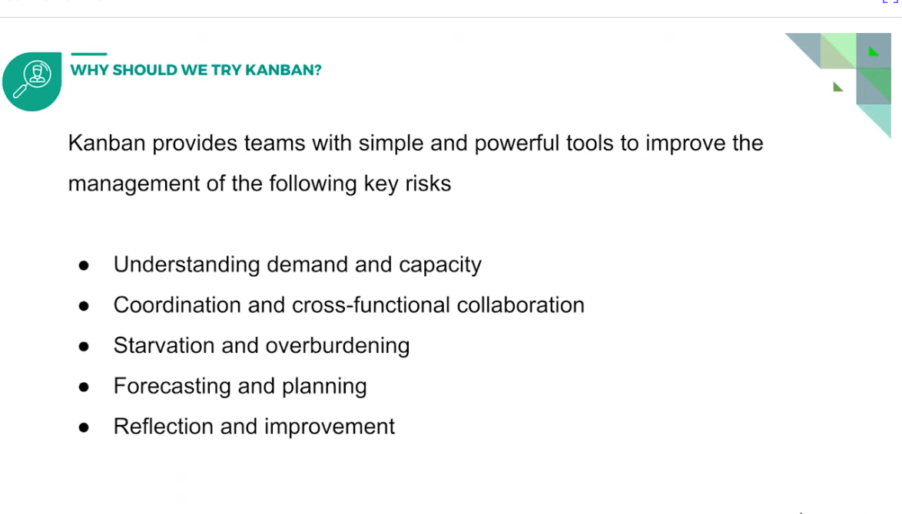

## What is agile?

## Why agile?

## Why Kanban

is a softwarte development framework, especially in conditions where the arrival rate of work is highly varaible and starvation and overburdening are common

