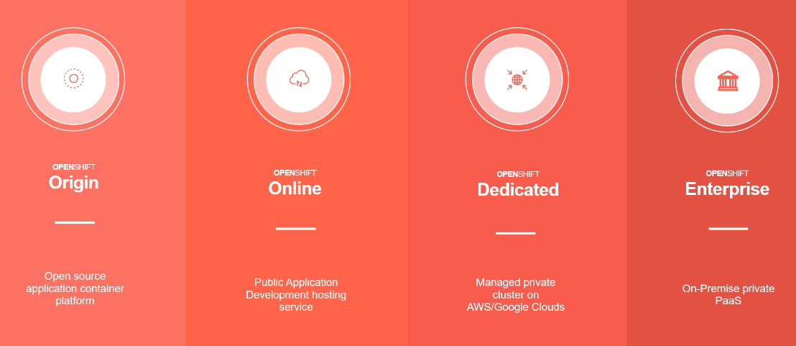
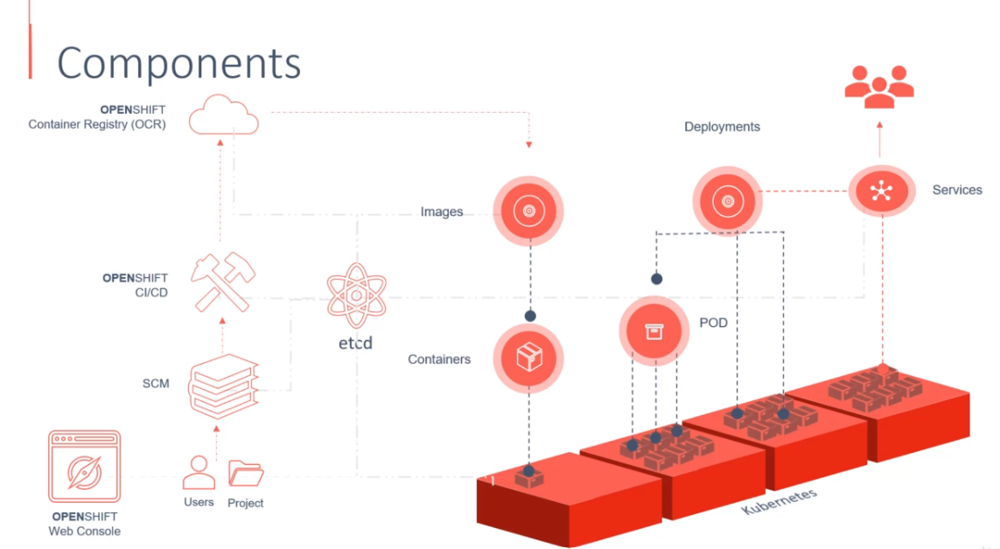
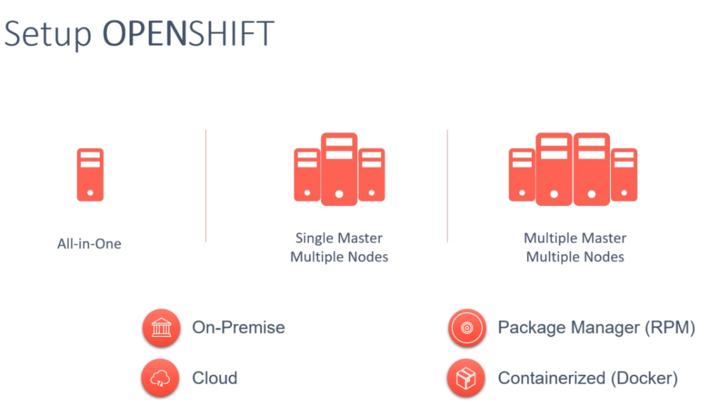

# Openshift

Open shift origin is based on top docker containers and kubernetes cluster manager, with added developer and operational centric tools that enable rapid application development, deployment and lifecycle management

## Architecture Openshifts

## Setup openshift

